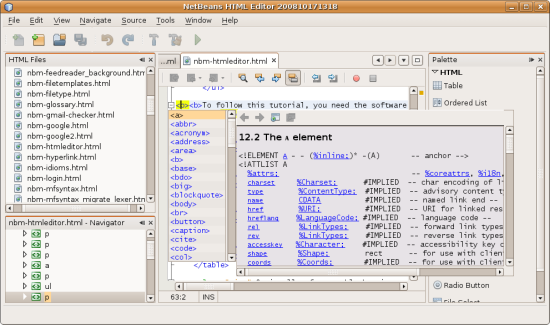
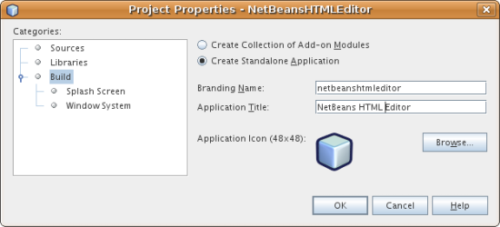
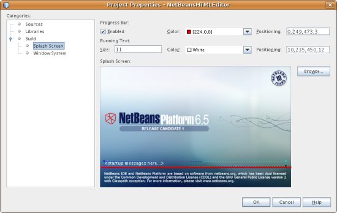
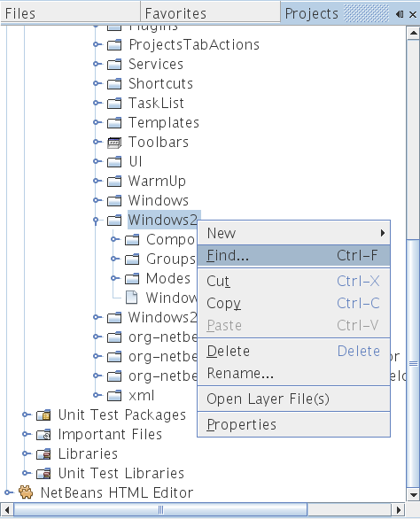
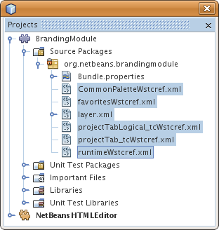
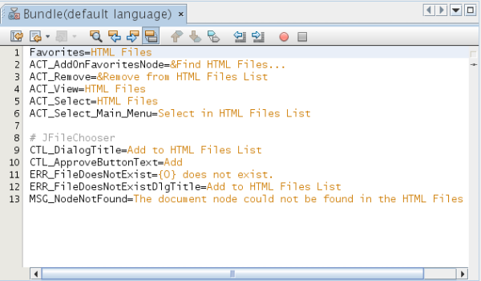
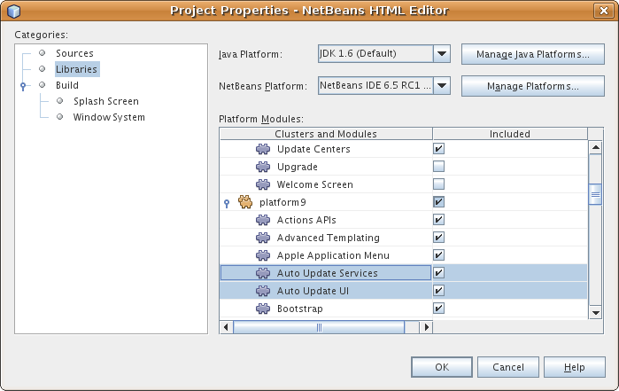
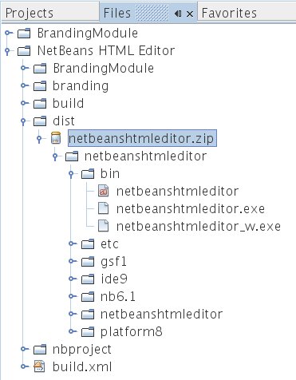

// 
//     Licensed to the Apache Software Foundation (ASF) under one
//     or more contributor license agreements.  See the NOTICE file
//     distributed with this work for additional information
//     regarding copyright ownership.  The ASF licenses this file
//     to you under the Apache License, Version 2.0 (the
//     "License"); you may not use this file except in compliance
//     with the License.  You may obtain a copy of the License at
// 
//       http://www.apache.org/licenses/LICENSE-2.0
// 
//     Unless required by applicable law or agreed to in writing,
//     software distributed under the License is distributed on an
//     "AS IS" BASIS, WITHOUT WARRANTIES OR CONDITIONS OF ANY
//     KIND, either express or implied.  See the License for the
//     specific language governing permissions and limitations
//     under the License.
//

= NetBeans プラットフォームクイックスタート
:jbake-type: platform_tutorial
:jbake-tags: tutorials 
:jbake-status: published
:syntax: true
:source-highlighter: pygments
:toc: left
:toc-title:
:icons: font
:experimental:
:description: NetBeans プラットフォームクイックスタート - Apache NetBeans
:keywords: Apache NetBeans Platform, Platform Tutorials, NetBeans プラットフォームクイックスタート

NetBeans プラットフォームにようこそ。

このチュートリアルでは、簡単な HTML エディタの作成を通して、NetBeans プラットフォームのワークフローを簡潔に紹介します。簡単ではあっても、作成する HTML エディタは、NetBeans プラットフォームが提供するインフラストラクチャーを再利用するため、非常に成熟したものになります。たとえば、コーディングを行わなくても、HTML エディタは成熟したウィンドウシステムを持ちます。このチュートリアルを終了すれば、NetBeans プラットフォーム上でアプリケーションを作成、構築、および実行する方法に関する全般的な理解が得られます。

このチュートリアルを終了したら、 link:https://netbeans.apache.org/tutorials[NetBeans プラットフォームの学習]のチュートリアルに進むことができます。学習の各チュートリアルは、さまざまな種類のアプリケーションに利用できる NetBeans API を幅広く網羅しています。このチュートリアルを省略し、「Hello World」アプリケーションを作成しないで学習のチュートリアルに進んでもかまいません。

NOTE:  このドキュメントでは NetBeans IDE 6.5 リリースを使用します。これ以前のバージョンを使用している場合、 link:61/nbm-htmleditor_ja.html[このドキュメントの 6.1 バージョン]を参照してください。NetBeans プラットフォームアプリケーションを作成する方法を学習する代わりに、NetBeans プラグインを作成する方法を学習する場合は、「 link:../60/nbm-google.html[NetBeans プラグインクイックスタート]」を参照してください。

トラブルシューティングのために、 link:http://plugins.netbeans.org/PluginPortal/faces/PluginDetailPage.jsp?pluginid=6635[完了したサンプルをダウンロード]してソースを調べることもできます (任意)。

このチュートリアルの最後で、次のような HTML エディタができます。

NOTE: 非常に簡単なデモアプリケーションですが、おもちゃではありません。コード補完、妥当性検査、事前定義済みの HTML スニペットなどの機能を備えた、HTML ページの簡単な編集をサポートする_実際_のプログラムです。

このチュートリアルで作成する HTML エディタは、「NetBeans プラットフォーム上」に構築されるリッチクライアントアプリケーションです。これは IDE のコア、つまり NetBeans プラットフォームがアプリケーションのベースになることを意味しています。NetBeans プラットフォーム上で必要なモジュールを追加し、IDE には必要だがアプリケーションでは必要のないモジュールを除外します。ここでは、NetBeans プラットフォームに追加される、ベースである IDE モジュールの一部が表示されます。

image::images/htmleditor_diagram.png[]

この HTML エディタを作成するということは、アプリケーションスケルトンを生成するということです。必要ないモジュールとユーザーインタフェース項目を除外し、IDE の起動時にデフォルトで開くウィンドウとして「お気に入り」ウィンドウを設定します。これらのアクティビティーはすべて、IDE のユーザーインタフェース要素でサポートされています。

NetBeans プラットフォーム上に各種機能を備えたアプリケーションを構築する、より正確には_アセンブル_することが、いかに単純で簡単であるかを自分で体験できます。最後に、WebStart を使用して簡単にダウンロードおよび起動できる最終製品の作成方法が表示されます。

NOTE:  それが単体の製品であっても、このチュートリアルのために NetBeans プラットフォームを別途ダウンロードする必要はありません。IDE でリッチクライアントアプリケーションを開発したあとで、アプリケーションにとって不要な IDE 特有のモジュールを除外します。

== スケルトンアプリケーションの生成

NetBeans プラットフォーム上にアプリケーションを作成するときは、まず NetBeans プラットフォームアプリケーションプロジェクトを作成します。デフォルトの NetBeans プラットフォームアプリケーションプロジェクトには、NetBeans IDE に含まれている_すべて_のモジュールだけでなく、NetBeans プラットフォームに含まれている_すべて_のモジュールも含まれます。これらのモジュールのすべてが必要ではないため、必要のないものを除外します。

[start=1]
1. 「新規プロジェクト」(Ctrl-Shift-N) ウィザードを使用して、次に示すように、「NetBeans モジュール」カテゴリのテンプレートから「NetBeans プラットフォームアプリケーション」プロジェクトを作成します。

image::images/htmleditor_new-nb-app-wiz-65.png[]

「次へ」をクリックし、NetBeans プラットフォームアプリケーションプロジェクトの名前を「NetBeansHTMLEditor」にします。「完了」をクリックします。

[start=2]
1. プロジェクトノードを右クリックして「プロパティー」を選択し、NetBeans プラットフォームアプリケーションの「プロジェクトプロパティー」ダイアログでいくつかの変更を行います。

* 「構築」パネルで「スタンドアロンアプリケーションを作成」をクリックし、NetBeans プラットフォーム上のリッチクライアントアプリケーションにすることを指定します。

実行可能アプリケーションのブランド名を確認し、タイトルバーのアプリケーションタイトルを次のように変更します。

* 「スプラッシュ画面」パネルで、次に示すように、アプリケーションのスプラッシュ画面、進捗バーのブランディングを提供できることを確認します。

NOTE:  スプラッシュ画面がない場合は、 link:images/htmleditor_splash.gif[これ]を使用してください。

* 「プロジェクトプロパティー」ダイアログの「ライブラリ」パネルに、「クラスタ」が一覧表示されます。クラスタとは、関連するモジュールの集合のことです。ここで選択する必要のあるクラスタは、 ``gsf1`` 、 ``ide10`` 、および  ``platform9``  のみです。その他のクラスタをすべて選択解除します。多数のモジュールを有効および無効にする必要があります。HTML エディタに特に関連のあるモジュールのみを選択すべきであるためです。「ライブラリ」パネルでモジュールを選択または選択解除するたびに、アプリケーションの NetBeans プラットフォーム構成ファイルにエントリが追加されます。単にエントリをファイルにペーストすれば、この手順を高速化できます。「プロジェクトプロパティー」ダイアログを閉じます。

「重要なファイル」ノードを展開し、NetBeans プラットフォームの構成ファイルを開きます。次のエントリをペーストします。

[source,java]
----

disabled.clusters=\
    apisupport1,\
    harness,\
    java2,\
    nb6.1,\
    profiler3
disabled.modules=\
    org.mozilla.rhino.patched,\
    org.netbeans.api.debugger,\
    org.netbeans.api.visual,\
    org.netbeans.core.ide,\
    org.netbeans.core.multiview,\
    org.netbeans.core.nativeaccess,\
    org.netbeans.lib.cvsclient,\
    org.netbeans.libs.commons_logging,\
    org.netbeans.libs.ini4j,\
    org.netbeans.libs.jna,\
    org.netbeans.libs.svnClientAdapter,\
    org.netbeans.libs.xerces,\
    org.netbeans.modules.autoupdate.services,\
    org.netbeans.modules.autoupdate.ui,\
    org.netbeans.modules.classfile,\
    org.netbeans.modules.core.kit,\
    org.netbeans.modules.css.visual,\
    org.netbeans.modules.db,\
    org.netbeans.modules.db.core,\
    org.netbeans.modules.db.dataview,\
    org.netbeans.modules.db.drivers,\
    org.netbeans.modules.db.kit,\
    org.netbeans.modules.db.metadata.model,\
    org.netbeans.modules.db.mysql,\
    org.netbeans.modules.db.sql.editor,\
    org.netbeans.modules.db.sql.visualeditor,\
    org.netbeans.modules.dbapi,\
    org.netbeans.modules.editor.bookmarks,\
    org.netbeans.modules.editor.kit,\
    org.netbeans.modules.extbrowser,\
    org.netbeans.modules.glassfish.common,\
    org.netbeans.modules.gototest,\
    org.netbeans.modules.httpserver,\
    org.netbeans.modules.ide.kit,\
    org.netbeans.modules.javascript.editing,\
    org.netbeans.modules.javascript.hints,\
    org.netbeans.modules.javascript.kit,\
    org.netbeans.modules.javascript.refactoring,\
    org.netbeans.modules.languages,\
    org.netbeans.modules.languages.bat,\
    org.netbeans.modules.languages.diff,\
    org.netbeans.modules.languages.manifest,\
    org.netbeans.modules.languages.refactoring,\
    org.netbeans.modules.languages.sh,\
    org.netbeans.modules.localhistory,\
    org.netbeans.modules.mercurial,\
    org.netbeans.modules.project.ant,\
    org.netbeans.modules.project.libraries,\
    org.netbeans.modules.properties,\
    org.netbeans.modules.properties.syntax,\
    org.netbeans.modules.schema2beans,\
    org.netbeans.modules.sendopts,\
    org.netbeans.modules.server,\
    org.netbeans.modules.servletapi,\
    org.netbeans.modules.subversion,\
    org.netbeans.modules.tasklist.kit,\
    org.netbeans.modules.tasklist.projectint,\
    org.netbeans.modules.tasklist.todo,\
    org.netbeans.modules.tasklist.ui,\
    org.netbeans.modules.usersguide,\
    org.netbeans.modules.utilities,\
    org.netbeans.modules.utilities.project,\
    org.netbeans.modules.versioning,\
    org.netbeans.modules.versioning.system.cvss,\
    org.netbeans.modules.versioning.util,\
    org.netbeans.modules.web.flyingsaucer,\
    org.netbeans.modules.xml,\
    org.netbeans.modules.xml.axi,\
    org.netbeans.modules.xml.core,\
    org.netbeans.modules.xml.lexer,\
    org.netbeans.modules.xml.multiview,\
    org.netbeans.modules.xml.retriever,\
    org.netbeans.modules.xml.schema.completion,\
    org.netbeans.modules.xml.schema.model,\
    org.netbeans.modules.xml.tax,\
    org.netbeans.modules.xml.text,\
    org.netbeans.modules.xml.tools,\
    org.netbeans.modules.xml.wsdl.model,\
    org.netbeans.modules.xml.xam,\
    org.netbeans.modules.xml.xdm,\
    org.netbeans.modules.xsl,\
    org.netbeans.spi.debugger.ui,\
    org.netbeans.spi.viewmodel,\
    org.netbeans.swing.dirchooser,\
    org.openide.compat,\
    org.openide.util.enumerations
enabled.clusters=\
    gsf,\
    ide,\
    platform
nbplatform.active=default
----

これで HTML エディタに関連する NetBeans モジュールのサブセットができました。ただし、今あるモジュールは必要ですが、これらのモジュールにあるユーザーインタフェース要素すべてが必要というわけではありません。次の節では、特に、作成する HTML エディタに対する、ユーザーインタフェースの調整と、ウィンドウレイアウトのカスタマイズを行います。

== ユーザーインタフェースの調整

選択したモジュールにあるユーザーインタフェースの多くを、保持したり拒否したりできます。たとえば、HTML エディタでは、「ツール」メニュー以下の項目の一部またはすべてはおそらく必要ありません。同様に、必要ないツールバーやツールバーボタンがある場合もあります。この節では、特定のリッチクライアントアプリケーションに有用なものだけ残すように、IDE のユーザーインタフェースを削除します。

[start=1]
1. NetBeans プラットフォームアプリケーションプロジェクトを展開し、次に示すように、「モジュール」ノードを右クリックして「新規を追加」を選択します。

image::images/htmleditor_add-module-61.png[]

「新規プロジェクト」(Ctrl-Shift-N) ウィザードが表示されます。プロジェクトの名前を  ``BrandingModule``  にして、「次へ」をクリックします。

[start=2]
1. 「コードベース名」フィールドに「 ``org.netbeans.brandingmodule`` 」と入力します。

[start=3]
1. 「XML レイヤーを生成」を選択し、「完了」をクリックします。

[start=4]
1. ブランドモジュールで、 ``layer.xml``  ノードを展開します。2 つのサブノードが展開されます。

image::images/htmleditor_expanded-xml-layer-61.png[]

[start=5]
1.  ``<コンテキスト内のこのレイヤー>``  ノードには、すべてのモジュールがレイヤーで登録する、すべてのフォルダおよびファイルがマージされた状態で表示されます。項目を除外するには、次に示すように、その項目を右クリックして「削除」を選択します。

image::images/htmleditor_this-layer-in-context-61.png[]

次に、IDE ではモジュールの  ``layer.xml``  ファイルにタグが追加されます。そのファイルにより、モジュールがインストールされるときに、削除した項目が非表示になります。たとえば、 ``「Menu Bar/Edit」`` を右クリックすると、HTML エディタに必要のないメニュー項目を「編集」メニューから削除できます。これにより、 ``layer.xml``  ファイルに次のようなスニペットを生成します。

[source,xml]
----

<folder name="Menu">
    <folder name="Edit">
        <file name="org-netbeans-modules-editor-MainMenuAction$StartMacroRecordingAction.instance_hidden"/>
        <file name="org-netbeans-modules-editor-MainMenuAction$StopMacroRecordingAction.instance_hidden"/>
    </folder>       
</folder>
----

前のスニペットの結果、ほかのモジュールによって提供された  ``Start Macro Recording``  および  ``Stop Macro Recording``  アクションが、ブランドモジュールによってメニューから削除されます。それらをふたたび表示するには、 ``layer.xml``  ファイルから上部のタグを削除するだけです。

[start=6]
1. 前の手段で説明されている方式を使用して、必要な数のツールバー、ツールバーのボタン、メニュー、およびメニュー項目を非表示にします。

この段階を終了したら、 ``layer.xml``  ファイルを確認します。これを行うと、削除した項目に応じて、次のようなものが表示されるはずです。

[source,xml]
----

<?xml version="1.0" encoding="UTF-8"?>
<!DOCTYPE filesystem PUBLIC "-//NetBeans//DTD Filesystem 1.1//EN" "https://netbeans.org/dtds/filesystem-1_1.dtd">
<filesystem>
    <folder name="Menu">
        <file name="BuildProject_hidden"/>
        <folder name="File">
            <file name="Separator2.instance_hidden"/>
            <file name="SeparatorNew.instance_hidden"/>
            <file name="SeparatorOpen.instance_hidden"/>
            <file name="org-netbeans-modules-project-ui-CloseProject.shadow_hidden"/>
            <file name="org-netbeans-modules-project-ui-CustomizeProject.shadow_hidden"/>
            <file name="org-netbeans-modules-project-ui-NewFile.shadow_hidden"/>
            <file name="org-netbeans-modules-project-ui-NewProject.shadow_hidden"/>
            <file name="org-netbeans-modules-project-ui-OpenProject.shadow_hidden"/>
            <file name="org-netbeans-modules-project-ui-RecentProjects.shadow_hidden"/>
            <file name="org-netbeans-modules-project-ui-SetMainProject.shadow_hidden"/>
            <file name="org-netbeans-modules-project-ui-groups-GroupsMenu.shadow_hidden"/>
        </folder>
        <file name="Refactoring_hidden"/>
        <file name="RunProject_hidden"/>
        <folder name="Window">
            <file name="ViewRuntimeTabAction.shadow_hidden"/>
            <file name="org-netbeans-modules-project-ui-logical-tab-action.shadow_hidden"/>
            <file name="org-netbeans-modules-project-ui-physical-tab-action.shadow_hidden"/>
        </folder>
    </folder>
</filesystem>
----

== ウィンドウレイアウトの調整

 ``<コンテキスト内のこのレイヤー>``  ノードを使用して、既存の項目を削除するだけではなく、それらの内容を変更することもできます。たとえば、HTML エディタは HTML ファイルを対象とします。したがって、Java ソースファイルやプロジェクトにも使用する通常の IDE とは異なり、初期レイアウトに「 ``お気に入り`` 」ウィンドウを表示することは理にかなっています。

ウィンドウレイアウトの定義も、このレイヤーにファイルとして記述され、 ``Windows2``  フォルダにすべて格納されます。 ``Windows2``  フォルダ内のファイルは、 link:http://bits.netbeans.org/dev/javadoc/org-openide-windows/org/openide/windows/doc-files/api.html[ウィンドウシステム API] によって定義された、擬似的に読解可能な XML ファイルです。これらはかなり複雑です。ただし次に示すように、HTML エディタのためにはこれらを完全に理解する必要はありません。

[start=1]
1. ブランドモジュールの  ``<コンテキスト内のこのレイヤー>``  ノードで、次に示すように、 ``Windows2``  ノードを右クリックし、「検索」を選択します。

[start=2]
1.  ``Favorites``  という名前のオブジェクトを検索します。大文字小文字は無視します。2 つのファイルが見つかります。

image::images/htmleditor_find-favorites2-61.png[]

最初のファイルはコンポーネントがどのように見えるか、またどのように作成されるかを定義します。これは変更する必要がないので、このファイルは編集する必要はありません。2 番目のファイルは目的に関わるファイルです。その内容は次のようになっています。

[source,xml]
----

<tc-ref version="2.0">
    <module name="org.netbeans.modules.favorites/1" spec="1.1" />
    <tc-id id="favorites" />
    <state opened="false" />
</tc-ref>
----

[start=3]
1. この XML のほとんどの意味がわからないとしても、ほかのドキュメントを読まずに理解できる箇所が 1 行だけあります。 ``false``  を  ``true``  に変更すると、そのコンポーネントをデフォルトで開くことができます。これをやってみましょう。

[start=4]
1. 同じような方法で、次のウィンドウを、デフォルトで開いている状態から HTML エディタで行いたい動作の状態に変更できます。
*  ``CommonPalette.wstcref`` 。コンポーネントパレットの開いている状態は  ``false``  です。これを  ``true``  に変更します。
*  ``projectTabLogical_tc.wstcref`` 。 プロジェクトウィンドウの開いている状態は  ``true``  です。これを  ``false``  に変更します。
*  ``projectTab_tc.wstcref`` 。 ファイルウィンドウの開いている状態は  ``true``  です。これを  ``false``  に変更します。
*  ``runtime.wstcref`` 。サービスウィンドウの開いている状態は  ``true``  です。これを  ``false``  に変更します。

これで、ブランドモジュールにいくつかの新しいファイルが含まれていることが表示されます。変更したファイルそれぞれに 1 つです。実際には、これらのファイルは前の手順で検出したファイルをオーバーライドするため、ウィンドウのレイアウトをオーバーライドするのに必要な情報が提供されます。

 ``layer.xml``  ファイルに次の内容が含まれていることを確認します。含まれていない場合、次の内容をコピーして  ``layer.xml``  ファイルにペーストします。

[source,xml]
----

<?xml version="1.0" encoding="UTF-8"?>
<!DOCTYPE filesystem PUBLIC "-//NetBeans//DTD Filesystem 1.1//EN" "https://netbeans.org/dtds/filesystem-1_1.dtd">
<filesystem>
    <folder name="Menu">
        <file name="BuildProject_hidden"/>
        <folder name="File">
            <file name="Separator2.instance_hidden"/>
            <file name="SeparatorNew.instance_hidden"/>
            <file name="SeparatorOpen.instance_hidden"/>
            <file name="org-netbeans-modules-project-ui-CloseProject.shadow_hidden"/>
            <file name="org-netbeans-modules-project-ui-CustomizeProject.shadow_hidden"/>
            <file name="org-netbeans-modules-project-ui-NewFile.shadow_hidden"/>
            <file name="org-netbeans-modules-project-ui-NewProject.shadow_hidden"/>
            <file name="org-netbeans-modules-project-ui-OpenProject.shadow_hidden"/>
            <file name="org-netbeans-modules-project-ui-RecentProjects.shadow_hidden"/>
            <file name="org-netbeans-modules-project-ui-SetMainProject.shadow_hidden"/>
            <file name="org-netbeans-modules-project-ui-groups-GroupsMenu.shadow_hidden"/>
        </folder>
        <file name="Refactoring_hidden"/>
        <file name="RunProject_hidden"/>
        <folder name="Window">
            <file name="ViewRuntimeTabAction.shadow_hidden"/>
            <file name="org-netbeans-modules-project-ui-logical-tab-action.shadow_hidden"/>
            <file name="org-netbeans-modules-project-ui-physical-tab-action.shadow_hidden"/>
        </folder>
    </folder>
    <folder name="Windows2">
        <folder name="Modes">
            <folder name="commonpalette">
                <file name="CommonPalette.wstcref" url="CommonPaletteWstcref.xml"/>
            </folder>
            <folder name="explorer">
                <file name="favorites.wstcref" url="favoritesWstcref.xml"/>
                <file name="projectTabLogical_tc.wstcref" url="projectTabLogical_tcWstcref.xml"/>
                <file name="projectTab_tc.wstcref" url="projectTab_tcWstcref.xml"/>
                <file name="runtime.wstcref" url="runtimeWstcref.xml"/>
            </folder>
        </folder>
    </folder>
</filesystem>
----

== 「お気に入り」ウィンドウの調整

「ファイル」ウィンドウに表示される、NetBeans プラットフォームアプリケーションプロジェクトの  ``branding``  フォルダのサブフォルダでは、NetBeans のソースで定義された文字列をオーバーライドできます。この節では、「お気に入り」ウィンドウで使用されるラベルを定義する文字列をオーバーライドします。たとえば、特に HTML ファイル用にそのウィンドウを使用するため、「お気に入り」ラベルを「HTML ファイル」に変更します。

[start=1]
1. 「ファイル」ウィンドウを開いて NetBeans プラットフォームアプリケーションプロジェクトの  ``branding``  フォルダを展開します。

[start=2]
1.  ``branding/modules``  内に新しいフォルダ構造を作成します。IDE では、フォルダを右クリックし、「新規」>「その他」を選択して「その他」カテゴリからフォルダを選択することで、フォルダを作成できます。新しいフォルダに  ``org-netbeans-modules-favorites.jar``  という名前を付けます。そのフォルダ内に、 ``org/netbeans/modules/favorites``  のフォルダ構造を作成します。最終フォルダ、つまり  ``favorites``  内に、新しい  ``Bundle.properties``  ファイルを作成します。

image::images/htmleditor_favorites-branding-61a.png[]

このフォルダ構造とプロパティーファイルは、「お気に入り」ウィンドウに関係する NetBeans のソースのフォルダ構造と一致します。

[start=3]
1. 次のスクリーンショットに示す文字列を追加し、「お気に入り」ウィンドウのソース内の一致するプロパティーファイルで定義されている同じ文字列をオーバーライドします。

この手順を簡素化するには、前に定義した文字列をコピー＆ペーストします。

[source,java]
----

Favorites=HTML ファイル
ACT_AddOnFavoritesNode=HTML ファイルを検索(&amp;F)
ACT_Remove=HTML ファイルの一覧から削除(&amp;R)
ACT_View=HTML ファイル
ACT_Select=HTML ファイル
ACT_Select_Main_Menu=HTML ファイルの一覧から選択

# JFileChooser
CTL_DialogTitle=HTML ファイルの一覧に追加
CTL_ApproveButtonText=追加
ERR_FileDoesNotExist={0} が存在しません。
ERR_FileDoesNotExistDlgTitle=HTML ファイルの一覧に追加
MSG_NodeNotFound=HTML ファイルの一覧にドキュメントノードは見つかりませんでした。
----

あとでアプリケーションを起動すると、「お気に入り」ウィンドウのテキストとラベルが、前述の一覧のように変更されていることがわかります。これは、NetBeans プラットフォームからコンポーネントを取得し、必要に合わせてブランディングできることを示しています。

== アプリケーションの実行

アプリケーションの実行は、プロジェクトノードを右クリックしてメニュー項目を選択するのと同じくらい簡単です。

[start=1]
1. アプリケーションのプロジェクトノードを右クリックし、「すべてを削除して構築」を選択します。

[start=2]
1. アプリケーションのプロジェクトノードを右クリックし、「実行」を選択します。

[start=3]
1. アプリケーションが配備されたら、「お気に入り」ウィンドウ内を右クリックし、HTML ファイルを含むフォルダを選択します。次に、次に示すように、HTML ファイルを開くことができます。

これで、Java コードを 1 行も入力せずに、完全で機能的な HTML エディタを作成できました。

== アプリケーションの配布

アプリケーションの配布用として、2 つの方法のうち 1 つを選択します。アプリケーションの制御をできるだけ維持する場合、Web 経由でアプリケーションを配布する Web Start を使用します。このシナリオでは、アプリケーションをアップデートする場合は、ローカルで作業し、エンドユーザーにアップデートについて知らせます。エンドユーザーが次回 Web からアプリケーションを起動するときに、自動的に使用可能になります。または、アプリケーションを含む ZIP ファイルを配布します。エンドユーザーは、ローカルで利用できるアプリケーションを入手できます。次に説明するアップデート機構を使用して、アップデートおよび新しい機能を配布します。

=== ZIP ファイルを使用したアプリケーションの配布

アプリケーションを拡張可能にするには、ユーザーにアプリケーションの機能を拡張するためのモジュールをインストールさせる必要があります。これを行うには、HTML エディタにプラグインマネージャーをバンドルする、いくつかの追加モジュールを有効にする必要があるだけです。

[start=1]
1. NetBeans プラットフォームアプリケーションプロジェクトを右クリックし、「プロパティー」を選択します。「プロジェクトプロパティー」ダイアログの「ライブラリ」パネルを使用して、次で強調表示されている「 ``アップデートセンター`` 」チェックボックス、「 ``自動更新サービス`` 」チェックボックス、および「 ``自動更新 UI`` 」チェックボックスを選択します。

[start=2]
1. アプリケーションのプロジェクトノードを右クリックし、「すべてを削除して構築」を選択します。

[start=3]
1. アプリケーションを再度実行すると、「ツール」メニューの下に「プラグイン」という名前の新しいメニュー項目が表示されます。

image::images/htmleditor_auto-update2-61.png[]

[start=4]
1. 新しい「プラグイン」メニュー項目を選択し、HTML エディタで役立つプラグインをいくつかインストールします。 link:http://plugins.netbeans.org/PluginPortal/[プラグインポータル]を参照し、適切なものをいくつか検索します。これも、エンドユーザーがアプリケーションのローカルインストールを更新する方法です。

[start=5]
1. 
アプリケーションのプロジェクトノードを右クリックし、「配布用 ZIP を構築」を選択します。

[start=6]
1.  ``dist``  フォルダ (「ファイル」ウィンドウに表示される) で、展開可能な ZIP ファイルとその内容を確認できるはずです。

NOTE:  アプリケーションの起動ツールは、前に示すように、 ``bin``  フォルダに作成されます。

=== 共有の NetBeans Web Start リポジトリからの HTML エディタの配布

ZIP ファイルを配布する代わりに、アプリケーションを最初に起動するときに生成される  ``master.jnlp``  ファイルを調整して、Web Start による配布を準備してみましょう。作業を行なっていても、まだ配布の準備は整っていません。少なくとも、情報セクションを変更して、より良い説明やアイコンを提供する必要があります。

標準 JNLP インフラストラクチャーに対するほかの変更は、www.netbeans.org での共有 JNLP リポジトリの使用です。デフォルトでは、スイート用に生成される JNLP アプリケーションには、常に、そのすべてのモジュールと依存するすべてのモジュールが含まれます。これはイントラネットでの使用時に便利な場合もありますが、幅広くインターネットで使用する場合には、やや実用性に欠けることがあります。インターネットの場合、NetBeans プラットフォームに構築されたすべてのアプリケーションは、NetBeans モジュールの 1 つのリポジトリを参照するほうがよいでしょう。これは、そのようなモジュールは共有されるため、何度もダウンロードする必要がないからです。

NetBeans 6.1 にはそのようなリポジトリがあります。NetBeans IDE のすべてのモジュールは含まれていませんが、HTML エディタのような IDE 以外のアプリケーションを作成するのに十分なものが含まれています。リポジトリを使用するには、正しい URL を追加して、 ``platform.properties``  を変更するだけです。

[source,java]
----

# netbeans.org の共通のリポジトリからライブラリを共有
# この URL は release60 JNLP ファイル専用:
jnlp.platform.codebase=https://netbeans.org/download/6_0/jnlp/

----

アプリケーションが JNLP アプリケーションとして起動されるとすぐに、すべての共有プラグインモジュールが netbeans.org から読み込まれ、同様のアプリケーション間で共有されます。

link:http://netbeans.apache.org/community/mailing-lists.html[ご意見をお寄せください]

== 関連項目

これで NetBeans プラットフォームクイックスタートを終了します。このドキュメントでは、IDE に Google 検索ツールバーを追加するプラグインの作成方法について説明しました。NetBeans プラットフォームでのアプリケーションの作成と開発の詳細については、次のリソースを参照してください。

*  link:https://netbeans.apache.org/tutorials[その他の関連チュートリアル]

*  link:https://bits.netbeans.org/dev/javadoc/[NetBeans API Javadoc]
