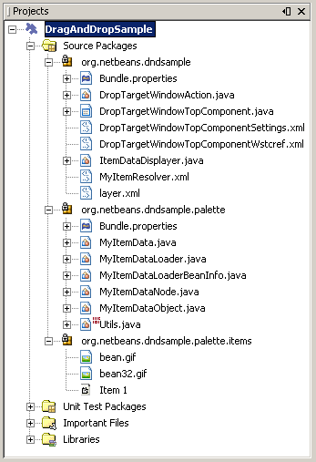
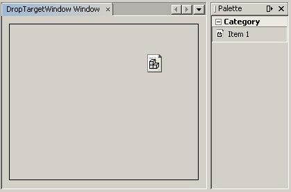
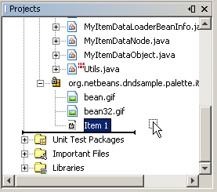
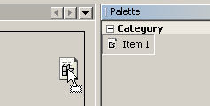
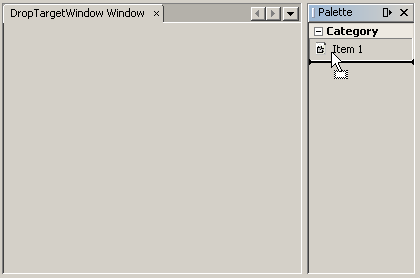
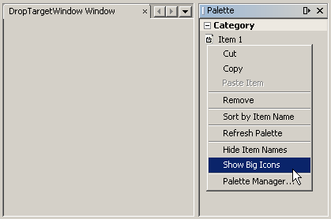

// 
//     Licensed to the Apache Software Foundation (ASF) under one
//     or more contributor license agreements.  See the NOTICE file
//     distributed with this work for additional information
//     regarding copyright ownership.  The ASF licenses this file
//     to you under the Apache License, Version 2.0 (the
//     "License"); you may not use this file except in compliance
//     with the License.  You may obtain a copy of the License at
// 
//       http://www.apache.org/licenses/LICENSE-2.0
// 
//     Unless required by applicable law or agreed to in writing,
//     software distributed under the License is distributed on an
//     "AS IS" BASIS, WITHOUT WARRANTIES OR CONDITIONS OF ANY
//     KIND, either express or implied.  See the License for the
//     specific language governing permissions and limitations
//     under the License.
//

= NetBeans Drag and Drop Tutorial
:jbake-type: platform_tutorial
:jbake-tags: tutorials 
:jbake-status: published
:syntax: true
:source-highlighter: pygments
:toc: left
:toc-title:
:icons: font
:experimental:
:description: NetBeans Drag and Drop Tutorial - Apache NetBeans
:keywords: Apache NetBeans Platform, Platform Tutorials, NetBeans Drag and Drop Tutorial

*Draft tutorial: Use/believe at your own risk.*

Drag and drop enables data transfer across Java programming language and native applications, between Java programming language applications, and within a single Java programming language application. Within the context of the NetBeans APIs, drag and drop is commonly used between the Component Palette and a Swing component. Different types of files may provide different types of Component Palettes. For example, JSP files in NetBeans IDE come with a Component Palette with items that generate JSP tags in the IDE's Source Editor. Similarly, a Swing container in the IDE, such as a JFrame, is supported by a Component Palette containing items that can be dragged and dropped onto the JFrame.

In this tutorial, you will learn how to create a Component Palette for a custom component. A custom component is provided by the NetBeans API TopComponent class. You will use a wizard to create a TopComponent. Then you will create items that can be dragged from the TopComponent's Component Palette onto the TopComponent. You will also be shown how to add functionality for dragging an item after it has been dropped.

In this tutorial, you will do the following:

[start=1]
1. Use the File Type wizard to create a new file type recognized by file extension. The file type will be used to create the items in the Component Palette.

[start=2]
1. Create the file content that you want to drag from the Component Palette onto the TopComponent.

[start=3]
1. Edit the data loader and data node to add the data into the data node's transferable.

[start=4]
1. Create a few more sample files and create a palette folder in the XML layer file, to register the items.

[start=5]
1. Use the Window Component wizard to create a new TopComponent.

[start=6]
1. Add a palette controller to the TopComponent's Lookup.

[start=7]
1. Create an item displayer class for rendering the item on the TopComponent.

[start=8]
1. Add drag and drop listeners to the TopComponent, for handling drag and drop events.

The following topics are covered below:

* <<prerequisites,Prerequisites>>
* <<requirements,Requirements>>
* <<sample,Looking at the Sample>>
* <<moduleproject,Creating the Module Project>>
* <<topcomponent,Creating a Custom Window Component>>
* <<dataloader,Creating a New File Type>>
* <<dependencies,Setting Dependencies>>
* <<item,Creating, Registering, and Using a Drag and Drop Item>>
* <<associating,Associating a Component Palette with a Window Component>>
* <<droptarget,Creating a Drop Target>>
* <<draggesture,Defining a Drag Gesture>>
* <<dragimage,Defining a Drag Image>>
* <<additionalitems,Adding Additional Items>>
* Supplemental Topics

* <<visuallibraryapi,Drag and Drop and the Visual Library API>>
* <<explorermanagerapi,Drag and Drop and Bean Tree Views>>
* <<sourceeditor,Drag and Drop and the NetBeans Source Editor>>
* <<existing,Adding Items to Existing Component Palettes>>

Once the software is installed, this tutorial can be completed in 60 minutes.

For more information on working with modules, see the  link:https://netbeans.apache.org/platform/index.html[ NetBeans Development Project home] on the NetBeans website. If you have questions, visit the  link:http://wiki.netbeans.org/wiki/view/NetBeansDeveloperFAQ[NetBeans Developer FAQ] or use the feedback link at the top of this page.

== Prerequisites

Before beginning this tutorial, you need to be familiar with the concepts and terminology relating to Swing drag and drop.

As a quick refresher, here are some common terms used in Swing drag and drop, taken directly from the specification:

* *Drag Source.* The entity responsible for the initiation of the drag and drop operation.
* *Drop Target.* Encapsulates all of the platform-specific handling of the Drag and Drop protocol with respect to the role of the recipient or destination of the operation.
* *Transferable.* Represents the object(s) or data that are the operand(s), or the subject(s), of the Drag and Drop operation, that is, the information that will subsequently be passed from the DragSource to the DropTarget as a result of a successful Drop on the Component associated with that DropTarget.
* *Data Flavor.* The type of data.
* *DragGestureEvent.* Encapsulates all the information regarding the nature of the gesture that has just been recognized.

For details on these and other concepts related to drag and drop, see the links listed above.

== Requirements

* NetBeans IDE 5.x.
* Optionally, and for troubleshooting purposes, the sources of the sample discussed in this tutorial. (To come.)

== Looking at the Sample

Once completed, the module that this tutorial shows you how to build will look as follows:

When you install the module, you will have a TopComponent with a Component Palette. You will be able to drag an item from the Component Palette and drop it in a JPanel within the TopComponent:

When you drag the dropped item, you will be able to drop it somewhere else on the JPanel in the TopComponent.

You will also be able to drag the item from an explorer window, in addition to being able to do so from the Component Palette:

When you drag the item from the Component Palette, as shown above, you will be able to drop it on the JPanel in the TopComponent.

You will also be shown how to add a drag image at the cursor:

== Creating the Module Project

[start=1]
1. Choose File > New Project. Under Categories, select NetBeans Plug-in Modules. Under projects, select Module Project. Click Next.

[start=2]
1. In the Name and Location panel, type  ``DragAndDropSample``  in Project Name.

[start=3]
1. In Project Location, specify an appropriate location for storing your module.

[start=4]
1. Select the Standalone Module radio button, if not selected.

[start=5]
1. Select the Set as Main Project checkbox, if not selected. Click Next.

[start=6]
1. In the Basic Module Configuration panel, set the Code Name Base to  ``org.netbeans.dndsample`` .

[start=7]
1. Leave the Module Display Name as  ``DragAndDropSample`` . Click Finish.

== Creating a Custom Window Component

[start=1]
1. In the Projects window, right-click the DragAndDropSample project, and choose New > File/Folder. In the New File wizard, under Categories, select NetBeans Module Development. Under File Types, select Window Component. Click Next.

[start=2]
1. In the Basic Settings panel, select  ``editor``  as the Window Position. This specifies that the window component will open in the 'editor' area of the IDE.

[start=3]
1. Select Open on Application Start. Click Next.

[start=4]
1. In the Name, Icon and Location panel, type  ``DropTargetWindow`` . Optionally, select an icon with a dimension of 16x16 pixels. Click Finish.

The DropTargetWindowTopComponent opens in the IDE, together with several supporting XML and Java files.

[start=5]
1. Right-click the module project and choose Install/Reload in Development IDE.

If you receive a warning message, click OK. Once it is installed, go to the Window menu and choose Open DropTargetWindow Window. The new window component opens in the IDE.

== Creating a New File Type

[start=1]
1. In the Projects window, right-click the project and choose New > File/Folder. In the New File wizard, under Categories, select NetBeans Module Development. Under File Types, select File Type. Click Next.

[start=2]
1. In the Basic Settings panel, set the following:
* MIME Type:  ``text/x-my-palette-item`` 
* Extension(s):  ``myitem`` 
Click Next.

[start=3]
1. In the Name, Icon and Location panel, type  ``MyItem``  as the Class Name Prefix. Optionally, select an icon with a dimension of 16x16 pixels.

[start=4]
1. In Package, type  ``org.netbeans.dndsample.palette`` . Click Finish.

== Setting Dependencies

To use the Palette API, you need to declare a dependency on the Component Palette API.

[start=1]
1. Right-click the module project and choose Properties.

[start=2]
1. In the Libraries category, click Add, next to the Module Dependencies list.

[start=3]
1. Add  ``Core - Component Palette``  to the list of dependencies. The following dependencies should now be in the module dependencies list:

* Core - Component Palette
* Datasystems API
* File System API
* Nodes API
* Swing Layout Extensions integration
* Text API
* UI Utilities API
* Utilities API
* Window System API

[start=4]
1. Click OK.

== Creating, Registering, and Using a Drag and Drop Item

Each item that you drag from the Component Palette can contain information that you want to transfer to the drop target. In this section, you are shown how to provide information to an item and how to register the item in the  ``layer.xml``  file.

[start=1]
1. Create a new package called  ``org.netbeans.dndsample.palette.items`` .

[start=2]
1. Move  ``MyItemTemplate.myitem``  into the new package.

[start=3]
1. Rename  ``MyItemTemplate.myitem``  to  ``id1.myitem`` .

[start=4]
1. Replace the content of the file with the following:

[source,java]
----

id=id1
displayName=Item 1
icon16=org/netbeans/dndsample/palette/items/bean.gif
icon32=org/netbeans/dndsample/palette/items/bean32.gif
comment=This is item 1
----

[start=5]
1. Add two image files, called bean.gif and bean32.gif, to the package. The former must be 16x16 pixels in size; the latter 32x32 pixels. You can create you own or right-click the two images here and save them in the folder specified in the item file above:

[start=6]
1. Register the item in the  ``layer.xml``  file, below the opening  ``<filesystem>``  tag, as follows:

[source,xml]
----

<folder name="MyPalette">
   <folder name="Category">
     <file name="Item1.myitem" url="palette/items/id1.myitem"/>
   </folder>
</folder>
----

[start=7]
1. In  ``org.netbeans.dndsample.palette`` , create a Java class called  ``MyItemData.java`` . The content of the file is as follows:

[source,java]
----

package org.netbeans.dndsample.palette;

import java.awt.Image;
import java.util.Properties;
import org.openide.util.Utilities;

public class MyItemData {
    private Properties props;
    
    private Image icon16;
    private Image icon32;
    
    public static final String PROP_ID = "id";
    public static final String PROP_NAME = "displayName";
    public static final String PROP_COMMENT = "comment";
    public static final String PROP_ICON16 = "icon16";
    public static final String PROP_ICON32 = "icon32";
    
    /** Creates a new instance of MyItemData */
    MyItemData( Properties props ) {
        this.props = props;
        loadIcons();
    }
    
    public String getId() {
        return props.getProperty( PROP_ID );
    }
    
    public String getDisplayName() {
        return props.getProperty( PROP_NAME );
    }
    
    public String getComment() {
        return props.getProperty( PROP_COMMENT );
    }
    
    public Image getSmallImage() {
        return icon16;
    }
    
    public Image getBigImage() {
        return icon32;
    }

    public boolean equals(Object obj) {
        if( obj instanceof MyItemData ) {
            return getId().equals( ((MyItemData)obj).getId() );
        }
        return false;
    }
    
    private void loadIcons() {
        String iconId = props.getProperty( PROP_ICON16 );
        icon16 = Utilities.loadImage( iconId );
        iconId = props.getProperty( PROP_ICON32 );
        icon32 = Utilities.loadImage( iconId );
    }
}
----

[start=8]
1. We need to load the content of our data object into the MyItemData class. To do this, declare the MyItemData class at the top of the MyItemDataObject class:

[source,java]
----

private MyItemData data;
----

Next, change the data object's Constructor to the following:

[source,java]
----

public MyItemDataObject(FileObject pf, MyItemDataLoader loader) throws DataObjectExistsException, IOException {
    super(pf, loader);
    //DND start 
    //create the 'data' from properties file:
    InputStream input = pf.getInputStream();
    Properties props = new Properties();
    props.load( input );
    input.close();
    data = new MyItemData( props );
    //DND end
}
----

Change  ``createNodeDelegate()`` , so that the data is passed to the node, together with the data object:

[source,java]
----

protected Node createNodeDelegate() {
    return new MyItemDataNode(this, data );
}
----

When prompted, let the IDE generate the following import statements:

[source,java]
----

import java.io.InputStream;
import java.util.Properties;
----

[start=9]
1. Now we edit the data node to add the data to the data node's transferable. The data node should be as follows:

[source,java]
----

package org.netbeans.dndsample.palette;

import java.awt.Image;
import java.awt.datatransfer.Transferable;
import java.awt.datatransfer.UnsupportedFlavorException;
import java.beans.BeanInfo;
import java.io.IOException;
import org.openide.loaders.DataNode;
import org.openide.nodes.Children;
import org.openide.util.datatransfer.ExTransferable;

public class MyItemDataNode extends DataNode {
    private MyItemData data;
    
    public MyItemDataNode( MyItemDataObject obj, MyItemData data ) {
        super( obj, Children.LEAF );
        this.data = data;
        setName( data.getId() );
        setShortDescription( data.getComment() );
    }

    public Image getIcon(int i) {
        if( i == BeanInfo.ICON_COLOR_16x16 || i == BeanInfo.ICON_MONO_16x16 ) {
            return data.getSmallImage();
        }
        return data.getBigImage();
    }
    
    public String getDisplayName() {
        return data.getDisplayName();
    }

    // DND start
    public Transferable drag() throws IOException {
        ExTransferable retValue = ExTransferable.create( super.drag() );
        //add the 'data' into the Transferable
        retValue.put( new ExTransferable.Single( Utils.MY_DATA_FLAVOR ) {
            protected Object getData() throws IOException, UnsupportedFlavorException {
                return data;
            }
        });
        return retValue;
    }
    //DND end
}
----

An error remains because the code referes to a data flavor in a class that you have not created yet. You will do so in the next step.

[start=10]
1. In  ``org.netbeans.dndsample.palette`` , create a Java class named  ``Utils.java`` .

Create the following data flavor at the top of Utils.java:

[source,java]
----

public static final DataFlavor MY_DATA_FLAVOR = new DataFlavor( MyItemData.class, "My Item Data" );
----

When prompted, let the IDE generate an import statement for  ``java.awt.datatransfer.DataFlavor`` .

Here, you have declared a folder called "MyPalette". This represents our palette in the  ``layer.xml``  file. We added an inner folder, which will be a new category. The files inside the categories folders are the items. The items may have any names you want but note the  ``url``  attribute refers to the location of our item data.

== Associating a Component Palette with the Window Component

[start=1]
1. At the end of the window component's Constructor, add the following lines:

[source,java]
----

//make sure the common palette shows up when this window is activated
associateLookup( Lookups.fixed( new Object[] {Utils.getPalette()} ) );
----

[start=2]
1. The IDE prompts you to create an import statement for  ``org.openide.util.lookup.Lookup`` . Click on the tip to let the IDE generate the import statement.

[start=3]
1. Declare the palette controller at the top of the Utils.java class:

[source,java]
----

private static PaletteController thePalette;
----

[start=4]
1. Add this method to the Utils.java class:

[source,java]
----

public static PaletteController getPalette() {
    //create the palette
    if( null == thePalette ) {
        try {
            //DND start
            //use custom DragAndDropHandler when creating the palette so that our custom
            //dataflavor gets added when an item is being dragged from the palette:
            thePalette = PaletteFactory.createPalette( "MyPalette", new MyActions() );//, null, new MyDnDHandler() );
            //DND end
        } catch (IOException ex) {
            ex.printStackTrace();
        }
    }
    return thePalette;
}
----

[start=5]
1. Add the following actions to the Utils.java class:

[source,java]
----

private static class MyActions extends PaletteActions {
    public Action[] getImportActions() {
        return null;
    }

    public Action[] getCustomPaletteActions() {
        return null;
    }

    public Action[] getCustomCategoryActions(Lookup lookup) {
        return null;
    }

    public Action[] getCustomItemActions(Lookup lookup) {
        return null;
    }

    public Action getPreferredAction(Lookup lookup) {
        return null;
    }

}
----

[start=6]
1. Right-click in the Source Editor, choose Fix Imports, and choose to import  ``javax.swing.Action`` .

[start=7]
1. Right-click the module project and choose Install/Reload in Development IDE.

[start=8]
1. Once it is installed, go to the Window menu and choose Open DropTargetWindow Window. The window component opens in the IDE. The new Component Palette, containing your one item, is displayed as well:

As can be seen above, you can drag the item, but you cannot drop it. That is because you have not created a drop target yet, which we will do in the next section. When you right-click in the Component Palette, several menu items are available, which you didn't have to code yourself. For example, if you choose Show Big Icons, the 32x32 pixel icon will be shown.

== Creating a Drop Target

[start=1]
1. In  ``org.netbeans.dndsample`` , create a Java class called  ``ItemDataDisplayer.java`` . You will use this class to render the data in your window component. It extends  ``JLabel``  and is defined as follows:

[source,java]
----

package org.netbeans.dndsample;

import javax.swing.ImageIcon;
import javax.swing.JLabel;
import org.netbeans.dndsample.palette.MyItemData;

public class ItemDataDisplayer extends JLabel {
    
    private MyItemData data;
    
    /** Creates a new instance of ItemDataDisplayer */
    public ItemDataDisplayer( MyItemData data ) {
        super( "" );
        this.data = data;
        setIcon( new ImageIcon( data.getBigImage() ) );
        setToolTipText( data.getComment() );
    }
    
    public MyItemData getData() {
        return data;
    }
}
----

[start=2]
1. Open DropTargetWindowTopComponent in the Design view of the GUI Builder.

[start=3]
1. Drag a JPanel from the Component Palette and drop it on the window component.

[start=4]
1. Resize the JPanel so that it covers the whole window component.

[start=5]
1. Right-click in the JPanel, choose Change Variable Name, and rename the JPanel to  ``dropPanel`` .

[start=6]
1. In the Properties section of the Properties window (Ctrl-Shift-7), click "border", choose Line Border, and click OK. Now you can see the edges of the JPanel, if it doesn't completely cover the window component. Doing this gives the user a visual indication of where to drop an item from the Component Palette.

[start=7]
1. In the Source view, declare the following at the top of the class:

[source,java]
----

private Map displayers = new HashMap();
private DragGestureRecognizer recognizer;
----

When prompted to do so, let the IDE generate import statements for  ``import java.util.HashMap`` ,  ``import java.util.Map`` , and  ``java.awt.dnd.DragGestureRecognizer`` .

[start=8]
1. Add the following to the end of the window component's Constructor:

[source,java]
----

//DND start
//start listening for for d'n'd events in the dropPanel
dropPanel.setDropTarget( new DropTarget( dropPanel, new DropTargetListener() {
    public void dragEnter(DropTargetDragEvent dtde) {
        doDragOver( dtde );
    }
    public void dragExit(DropTargetEvent dte) {
    }
    public void dragOver(DropTargetDragEvent dtde) {
        doDragOver( dtde );
    }
    public void drop(DropTargetDropEvent dtde) {
        doDrop( dtde );
    }
    public void dropActionChanged(DropTargetDragEvent dtde) {
        //ignore
        //we don't really care whether it's a COPY or MOVE operation, let's treat both cases as the same
    }
}) );
//DND end
dropPanel.setLayout( null );
----

When prompted, let the IDE generate the following import statements:

[source,java]
----

import java.awt.dnd.DragGestureEvent;
import java.awt.dnd.DragGestureListener;
----

Also let the IDE generate the following import statements:

[source,java]
----

import java.awt.dnd.DropTargetDragEvent;
import java.awt.dnd.DropTargetDropEvent;
import java.awt.dnd.DropTargetEvent;
----

[start=9]
1. The  ``doDragOver``  event is defined as follows:

[source,java]
----

private void doDragOver( DropTargetDragEvent dtde ) {
    if( dtde.isDataFlavorSupported( Utils.MY_DATA_FLAVOR ) ) {
        //only accept object of our type
        dtde.acceptDrag( DnDConstants.ACTION_COPY_OR_MOVE );
    } else {
        //reject everything else
        dtde.rejectDrag();
    }
}
----

[start=10]
1. The  ``doDrop``  event is defined as follows:

[source,java]
----

private void doDrop( DropTargetDropEvent dtde ) {
    //first check if we support this type of data
    if( !dtde.isDataFlavorSupported( Utils.MY_DATA_FLAVOR ) ) {
        dtde.rejectDrop();
    }
    //accept the drop so that we can access the Transferable
    dtde.acceptDrop( DnDConstants.ACTION_COPY_OR_MOVE );
    MyItemData data = null;
    try {
        //get the dragged data from the transferable
        data = (MyItemData) dtde.getTransferable().getTransferData(Utils.MY_DATA_FLAVOR);
    } catch (IOException ex) {
        ex.printStackTrace();
    } catch (UnsupportedFlavorException ex) {
        ex.printStackTrace();
    }

    dtde.dropComplete( null != data );
    if( null != data ) {
        //find the displayer for the data
        ItemDataDisplayer displayer = (ItemDataDisplayer)displayers.get( data );
        if( null == displayer ) {
            //it's a drop from the palette and the data is not in our list yet
            displayer = new ItemDataDisplayer( data );
            
            //This is where a drag and drop listener should be added,
            //if you want to add functionality for dragging after the item is dropped.
            //See the next section for details.
            
            //add the displayer to the panel
            dropPanel.add( displayer );
            displayer.setSize( displayer.getPreferredSize() );
            displayers.put( data, displayer );
        }
        //update displayer's location from the drop point
        displayer.setLocation( dtde.getLocation() );
    }
}
----

[start=11]
1. When you install the module, you will have a TopComponent with a Component Palette. You will be able to drag an item from the Component Palette and drop it in a JPanel within the TopComponent:

When you try to drag the dropped item, nothing happens. The next section explains how to define the drag gesture event.

== Defining a Drag Gesture

You can specify what should happen when the user drags the dropped item. Here, we assume that the dropped item should be dragged elsewhere when the drag event is handled.

[start=1]
1. Change the window component's signature to specify that  ``DragGestureListener``  should be implemented. When prompted, let the IDE generate the import statements and abstract methods.

Fill out the generated  ``dragGestureRecognized``  event as follows:

[source,java]
----

public void dragGestureRecognized(DragGestureEvent dge) {
    //first check which object is to be dragged
    if( dge.getComponent() instanceof ItemDataDisplayer ) {
        ItemDataDisplayer displayer = (ItemDataDisplayer)dge.getComponent();
        //get the data from the displayer and create a new transferable for dragging
        dge.startDrag( null, new ItemDataTransferable(displayer.getData()) );
    }
}
----

[start=2]
1. At the end of the window component class, add this helper class that that wraps MyItemData in a transferable, using the correct Data Flavor.

[source,java]
----

private static class ItemDataTransferable implements Transferable {
    private MyItemData data;
    public ItemDataTransferable( MyItemData data ) {
        this.data = data;
    }
    public DataFlavor[] getTransferDataFlavors() {
        return new DataFlavor[] { Utils.MY_DATA_FLAVOR };
    }

    public boolean isDataFlavorSupported(DataFlavor flavor) {
        return Utils.MY_DATA_FLAVOR.equals( flavor );
    }

    public Object getTransferData(DataFlavor flavor) throws UnsupportedFlavorException, IOException {
        if( !isDataFlavorSupported( flavor ) ) {
            throw new UnsupportedFlavorException( flavor );
        }
        return data;
    }
}
----

[start=3]
1. Search for the following text in the TopComponent:

[source,java]
----

//This is where a drag and drop listener should be added,
//if you want to add functionality for dragging after the item is dropped.
----

Replace the text with the following to register a listener on the displayer:

[source,java]
----

//register a d'n'd listener on the new displayer so that we can drag it too
DragSource.getDefaultDragSource().createDefaultDragGestureRecognizer( displayer, DnDConstants.ACTION_COPY_OR_MOVE, this );
----

== Defining a Drag Image

A nice touch is to display an image when the user drags an item. To do this, the assumption is that you want to show the large image, that is, the image that is 32x32 pixels in size, as specified in the item's file earlier.

[start=1]
1. In the TopComponent's doDragOver() event, add the following after the code that is already there:

[source,java]
----

MyItemData data = null;
try {
    data = (MyItemData) dtde.getTransferable().getTransferData(Utils.MY_DATA_FLAVOR);
} catch (IOException ex) {
    ex.printStackTrace();
} catch (UnsupportedFlavorException ex) {
    ex.printStackTrace();
}

ItemDataDisplayer displayer = new ItemDataDisplayer( data );
Image dragImage = displayer.getData().getBigImage();

Graphics2D g2 = (Graphics2D) getGraphics();
Rectangle visRect = getVisibleRect();
paintImmediately(visRect.x, visRect.y, visRect.width, visRect.height);
g2.drawImage(dragImage,
        AffineTransform.getTranslateInstance(dtde.getLocation().getX(),
        dtde.getLocation().getY()),
        null);
----

[start=2]
1. Install the module again. Drag an item, either from the Component Palette or from an explorer window. When you do so, notice that an image appears at the cursor, once the cursor is over the drop target:

== Adding Additional Items

Currently, you only have one item in the Component Palette. To add additional items, take the steps below.

[start=1]
1. If the module is installed, uninstall it using the Module Manager in the Tools menu.

[start=2]
1. In  ``org.netbeans.dndsample.palette.items`` , copy  ``id1.myitem``  and name it  ``id2.myitem`` .

[start=3]
1. Open the new file in the Source Editor and change the data.

[start=4]
1. Add a new 16x16 pixel icon and a new 32x32 pixel icon.

[start=5]
1. Register the new item in the  ``layer.xml``  file, below the one you registered earlier.

== Drag and Drop and the Visual Library API

See the  link:https://netbeans.apache.org/tutorials/nbm-visual_library.html[Visual Library 2.0 Tutorial (Part 1)].

== Drag and Drop and Bean Tree Views

See the  link:https://netbeans.apache.org/tutorials/nbm-nodesapi3.html[NetBeans Nodes, Explorer Manager, and Component Palette Tutorial].

== Drag and Drop and the NetBeans Source Editor

See the  link:https://netbeans.apache.org/tutorials/nbm-palette-api2.html[NetBeans Component Palette Module Tutorial].

== Adding Items to Existing Component Palettes

See the  link:https://netbeans.apache.org/tutorials/nbm-palette-api1.html[NetBeans Code Snippet Module Tutorial]. 

link:http://netbeans.apache.org/community/mailing-lists.html[Send Us Your Feedback]

== Open Issues

[start=1]
1. Add lots of explanatory text.

[start=2]
1. Add icons.

[start=3]
1. Review by Stan.
