// 
//     Licensed to the Apache Software Foundation (ASF) under one
//     or more contributor license agreements.  See the NOTICE file
//     distributed with this work for additional information
//     regarding copyright ownership.  The ASF licenses this file
//     to you under the Apache License, Version 2.0 (the
//     "License"); you may not use this file except in compliance
//     with the License.  You may obtain a copy of the License at
// 
//       http://www.apache.org/licenses/LICENSE-2.0
// 
//     Unless required by applicable law or agreed to in writing,
//     software distributed under the License is distributed on an
//     "AS IS" BASIS, WITHOUT WARRANTIES OR CONDITIONS OF ANY
//     KIND, either express or implied.  See the License for the
//     specific language governing permissions and limitations
//     under the License.
//

= NetBeans Project Template Module Tutorial
:jbake-type: platform_tutorial
:jbake-tags: tutorials 
:jbake-status: published
:syntax: true
:source-highlighter: pygments
:toc: left
:toc-title:
:icons: font
:experimental:
:description: NetBeans Project Template Module Tutorial - Apache NetBeans
:keywords: Apache NetBeans Platform, Platform Tutorials, NetBeans Project Template Module Tutorial

link:http://netbeans.apache.org/community/mailing-lists.html[Feedback]

This tutorial demonstrates how to create a module that makes a new project template available to the IDE's New Project wizard. The IDE provides several project templates—for example, the Web Application, the Java Project with Existing Sources, the EJB Module, and the Enterprise Application. Each project template provides a basic source structure and several files with sample code. For example, the Web Application project template provides a source structure that conforms to the Java BluePrints or a source structure that conforms to the Jakarta recommendations. In addition, it provides a default  ``index.jsp``  file, a  ``web.xml``  deployment descriptor, and a deployment descriptor for the server selected in the Web Application template's wizard.

In this tutorial, you add a project template for  link:http://wicket.sourceforge.net/[Wicket], a Java web application framework. When creating a Wicket project template, the following Wicket-specific requirements are important to bear in mind:

* No JSP files. Each web page consists of a Java class and an HTML file, with the same name and found within the same package structure.
* No XML configuration files. One Java class provides application-level information, such as the application's homepage.
* Wicket-specific libraries and a  ``web.xml``  deployment descriptor file that references a Wicket servlet for handling requests.

After you create and install the module, the New Project wizard will include the Wicket project template and the Library Manager will include the Wicket JAR files.

The following topics are covered below:

* <<installing,Installing the Software>>
* <<preparing,Preparing the Wicket Project Template>>
* <<creatingthemoduleproject,Creating the Module Project>>
* <<bundlinglibraries,Bundling the Libraries>>
* <<bundlingtemplate,Bundling the Project Template>>
* <<building,Building and Installing the Module>>

Once the software is installed, this tutorial can be completed in 20 minutes.

For more information on working with NetBeans modules, see the  link:https://netbeans.apache.org/platform/index.html[ NetBeans Development Project home] on the NetBeans website. If you have questions, visit the  link:http://wiki.netbeans.org/wiki/view/NetBeansDeveloperFAQ[ NetBeans Developer FAQ] or use the feedback link at the top of this page.

== Installing the Software

Before you begin, you need to install the following software on your computer:

* NetBeans IDE 5.x ( link:https://netbeans.apache.org/download/index.html[download])
* Java Standard Development Kit (JDK™) version 1.4.2 ( link:https://www.oracle.com/technetwork/java/javase/downloads/index.html[download]) or 5.0 ( link:https://www.oracle.com/technetwork/java/javase/downloads/index.html[download])

== Preparing the Wicket Project Template

[start=1]
1. Download and unzip  link:http://sourceforge.net/project/showfiles.php?group_id=119783&package_id=130482[Wicket 1.0.3].

NOTE:  This tutorial also applies to other releases of Wicket, but in other releases Wicket's libraries might be found in different folders to where they are indicated to be in this tutorial.

[start=2]
1. Choose File > New Project. Under Categories, select Web. Under Projects, select Web Application and click Next.

[start=3]
1. Under Project Name, enter  ``WicketApplication`` . Change the Project Location to any directory on your computer. From now on, this directory is referred to as  ``_$__PROJECTHOME_`` .

[start=4]
1. Select the recommendations to which your source structure will adhere, which is purely a personal preference:

* *Java BluePrints.* For more information, see  link:http://java.sun.com/blueprints/code/projectconventions.html[http://java.sun.com/blueprints/code/projectconventions.html].

* *Jakarta.* For more information, see  link:http://jakarta.apache.org/tomcat/tomcat-5.0-doc/[http://jakarta.apache.org/tomcat/tomcat-5.0-doc/].

[start=5]
1. Leave all the other defaults. Click Finish. 

The IDE creates the  ``_$PROJECTHOME_/WicketApplication``  project folder. The project folder contains all of your sources and project metadata, such as the project's Ant build script. The  ``WicketApplication``  project opens in the IDE. You can view its logical structure in the Projects window and its file structure in the Files window.

[start=6]
1. Delete  ``index.jsp`` . A Wicket web page consists of a Java class together with an HTML file. The default JSP page is therefore superfluous.

The basis of your Wicket project template is now ready. In this example, the only difference between a standard web application and a Wicket application is the absence of the  ``index.jsp``  file. You could make further modifications yourself, depending on your needs. In the next sections, you create a module project, bundle the Wicket libraries, bundle the project template, and install it in the New Project wizard. 

== Creating the Module Project

[start=1]
1. Choose File > New Project (Ctrl-Shift-N). Under Categories, select NetBeans Plug-in Modules. Under projects, select Module Project and click Next.

[start=2]
1. In the Name and Location panel, type  ``WicketTemplate``  in Project Name. Change the Project Location to any directory on your computer, such as  ``c:\mymodules`` . Leave the Standalone Module radiobutton and the Set as Main Project checkbox selected The panel should now look as follows:

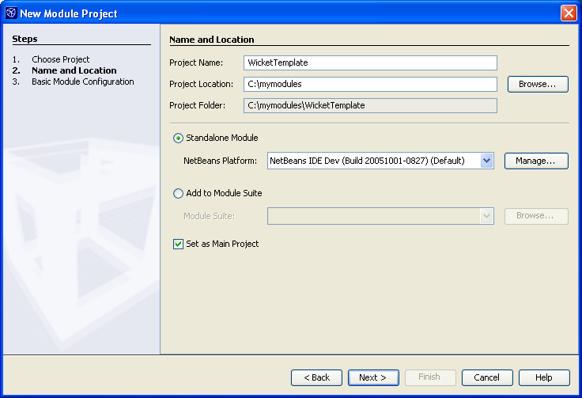

Click Next.

[start=3]
1. In the Basic Module Configuration panel, replace  ``yourorghere``  in Code Name Base with  ``myorg`` , so that the whole code name base is  ``org.myorg.wickttemplate`` . Leave the location of the localizing bundle and XML layer, so that they will be stored in a package with the name  ``org/myorg/wickttemplate`` . The panel should now look as follows:

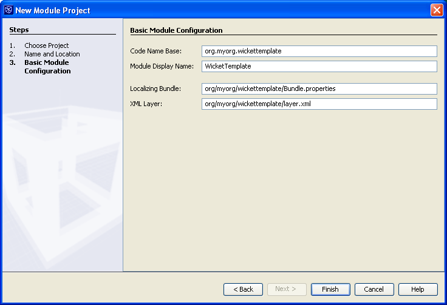

[start=4]
1. Click Finish.

The IDE creates the  ``WicketTemplate``  project. The project contains all of your sources and project metadata, such as the project's Ant build script. The project opens in the IDE. You can view its logical structure in the Projects window (Ctrl-1) and its file structure in the Files window (Ctrl-2). For example, the Projects window should now look as follows:

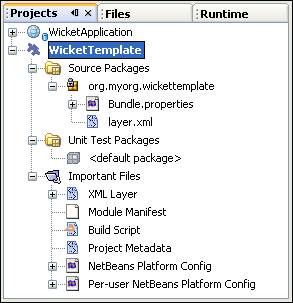

For basic information on each of the files above, see the  link:quickstart-nbm.html[Introduction to NetBeans Module Development].

== Bundling the Wicket Libraries

[start=1]
1. Right-click the  ``WicketTemplate``  project node and choose New > J2SE Library Descriptor. Click Next.

[start=2]
1. In the Select Library panel, click Manage Libraries. In the Library Manager, click New Library and type  ``Wicket``  as the Library Name. Click OK.

[start=3]
1. Click Add JAR/Folder and browse to the folder where you unzipped  link:http://sourceforge.net/project/showfiles.php?group_id=119783&package_id=130482[Wicket 1.0.3].

[start=4]
1. Use the Browse JAR/Folder dialog box to add the following JAR files to the Classpath tab:

*  ``wicket-1.0.3`` 
*  ``lib/commons-fileupload-1.0`` 
*  ``lib/commons-logging-1.0.4`` 
*  ``lib/concurrent-1.3.3`` 
*  ``lib/dom4j-1.4`` 
*  ``lib/log4j-1.2.8`` 
*  ``lib/ognl-2.6.7`` 

The Classpath tab of the Library Manager should now look as follows:

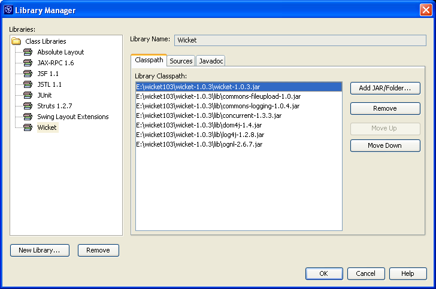

[start=5]
1. In the Javadoc tab, add the  ``docs/apidocs``  folder.

The Javadoc tab of the Library Manager should now look as follows:

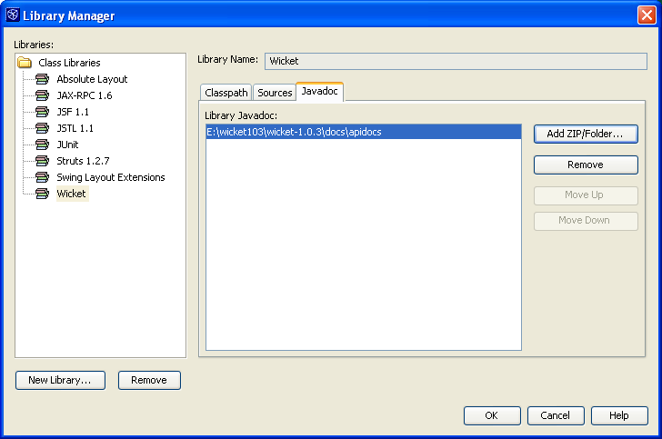

[start=6]
1. Click OK. In the Select Library panel, select the newly created Wicket library:

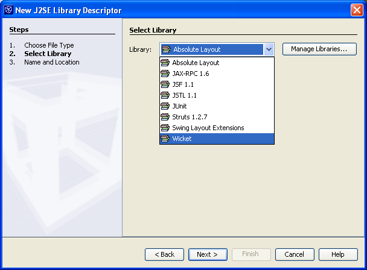

Click Next.

[start=7]
1. In the Name and Location panel, leave all the defaults.

[start=8]
1. Click Finish.

The Projects window now includes the  ``Wicket``  J2SE library descriptor and the Files window shows the Wicket archive files that have been added to the module:

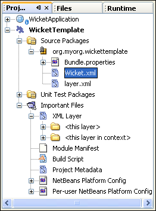 
image::images/projecttemplates_projects-window-3.png[] 

== Bundling the Wicket Project Template

[start=1]
1. Right-click the  ``WicketTemplate``  project node and choose New > Project Template.

[start=2]
1. In the Select Project panel, the project that you want to bundle as a sample is automatically selected, as shown below:

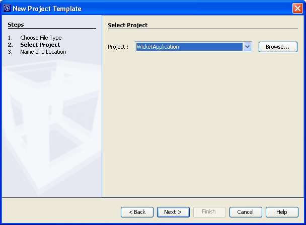

If there are more projects open in the IDE, use the drop-down list to select the Wicket Application.

Click Next.

[start=3]
1. In the Name and Location panel, type  ``WicketApplication``  as the template name, type  ``Wicket Application``  as the display name, and select Web in the Category drop-down list, as shown below:

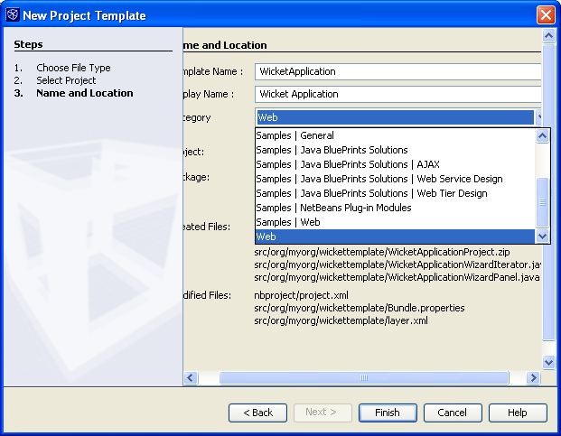

[start=4]
1. Click Finish.

The IDE does the following:

* creates a ZIP file containing your project
* provides a Java panel and an iterator used in the New Project wizard to create the sample
* provides an HTML file for the description displayed in the New Project wizard
* registers the sample in the XML layer file
* adds localization strings to the  ``bundle.properties``  file

The Projects window should now look as follows:

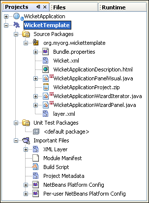

Finally, you will replace the template's default icon with Wicket's icon. To get Wicket's icon, right-click on the image below and save it in your filesystem:

[start=5]
1. In the Important Files node, expand XML Layer. The two nodes  ``<xml layer>``  and  ``<this layer in context>`` , together with their subnodes, make up the  link:https://netbeans.apache.org/tutorials/nbm-glossary.html[System Filesystem] Browser. Expand  ``<this layer>`` , expand  ``Templates`` , continue expanding nodes until you see the template that you created above.

[start=6]
1. Right-click the node for the new template and choose Pick Icon, as shown below:

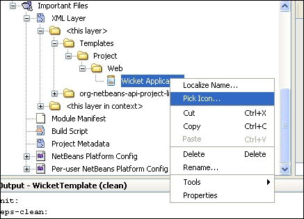

Browse to where you saved the Wicket icon. Notice that the default icon changes to Wicket's icon:

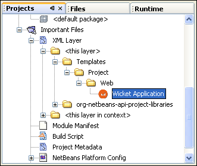

You are now ready to build, install, and use the module containing the Wicket libraries and template. 

== Building and Installing the Module

The IDE uses an Ant build script to build and install your module. The build script is created for you when you create the module project.

=== Installing the NetBeans Module

* In the Projects window, right-click the  ``WicketTemplate``  project and choose Install/Reload in Target Platform.

The module is built and installed in the target IDE or Platform. The target IDE or Platform opens so that you can try out your new module. The default target IDE or Platform is the installation used by the current instance of the development IDE. Note that when you run your module, you will be using a temporary test user directory, not the development IDE's user directory.

=== Using the NetBeans Module

[start=1]
1. Choose File > New Project (Ctrl-Shift-N).

The New Project wizard opens and displays the new Wicket Application template:

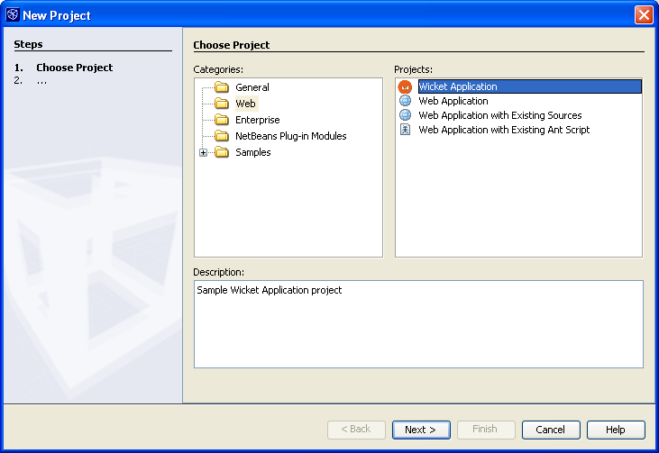

[start=2]
1. Select the Wicket application and click Next. The Name and Location panel appears. Type a name in the project name field.

[start=3]
1. Click Finish.

The IDE opens and displays the newly created project sample. Notice that the  ``index.jsp``  is not created.

[start=4]
1. Right-click the Libraries node and choose Add Library, as shown below:

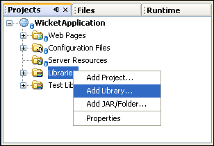

[start=5]
1. Select the Wicket library and click Add Library.

[start=6]
1. Create a new Java class and notice that there is code completion and Javadoc support for the Wicket libraries, as shown below:

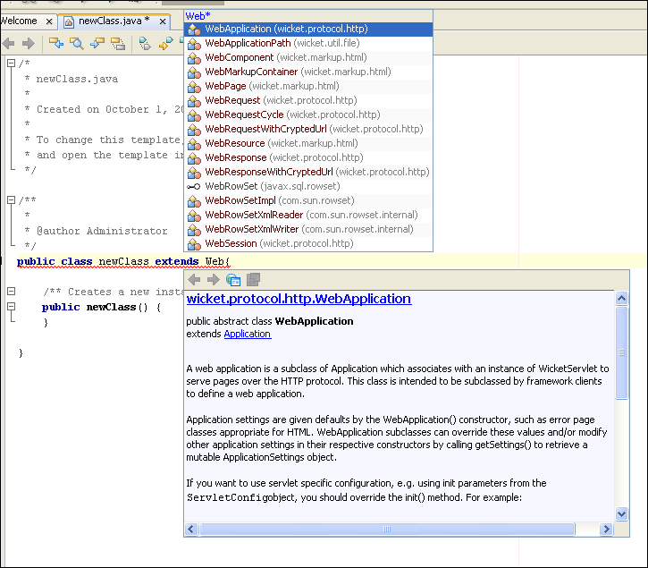

=== Creating a Shareable Module Binary (NBM File)

An NBM file is a NetBeans module packaged for delivery via the web. The principal differences between NBM files and module JAR files are:

* An NBM file is compressed.
* An NBM file can contain more than one JAR file—modules can package any libraries they use into their NBM file.
* An NBM file contains metadata that NetBeans will use to display information about it in the Update Center, such as the manifest contents, the license, etc.
* An NBM file is typically signed for security purposes.

NBM files are just ZIP files with a special extension. They use the JDK's mechanism for signing JAR files. Unless you are doing something unusual, you will not need to worry about the contents of an NBM file—just let the standard Ant build script for NBM creation take care of it for you. The IDE generates the build script based on the options you enter in the project's Project Properties dialog box. You can set the module's dependencies, versioning, and packaging information in the Project Properties dialog box. You can further customize program execution by editing the Ant script and Ant properties for the project.

[start=1]
1. In the Projects window, right-click the  ``WicketTemplate``  project and choose Create NBM.

The NBM file is created and you can view it in the Files window (Ctrl-2):

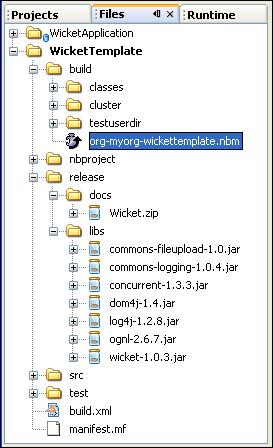

[start=2]
1. Make it available to others via, for example, e-mail.

== Next Steps

For more information about creating and developing NetBeans Modules, see the following resources:

*  link:https://netbeans.apache.org/platform/index.html[Plug-in Developer's Resources]

*  link:https://bits.netbeans.org/dev/javadoc/[NetBeans API List (Current Development Version)]

*  link:http://apisupport.netbeans.org/new-apisupport.html[New API Support-Proposal]

*  link:https://netbeans.apache.org/tutorials[Other Plug-in Module Tutorials]

== Versioning

|===
|*Version* |*Date* |*Changes* 

|1 |1 October 2005 |

* Initial version.
* To do:
* P1. Show how to create wizard that lets user specify number of web pages, and then IDE creates Java class and HTML file for each; and  ``web.xml``  automatically filled with servlet definitions for application name.
* P1. Add some post-processing customization steps (e.g., how to put the sample in a different category in the New Project wizard).
* P2. Add details on each of the created files (currently there's only a sentence, this should be expanded).
* P2. Explain relationship between generated files and resulting project template wizard.
* P2. Info about XML layer file to be added.
* P3. Add introductory sentences to each section.
* Note:  link:https://bz.apache.org/netbeans/show_bug.cgi?id=65595[http://www.netbeans.org/issues/show_bug.cgi?id=65595]
 
|===
