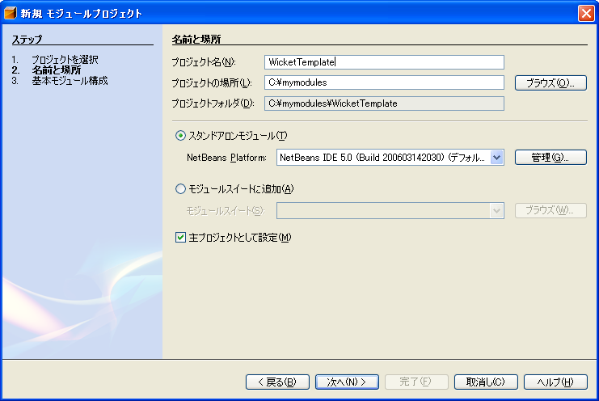
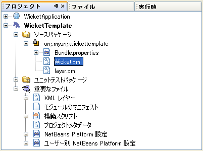
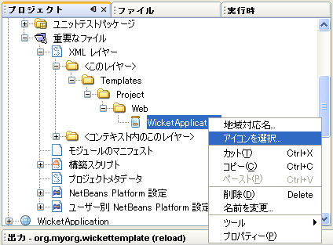
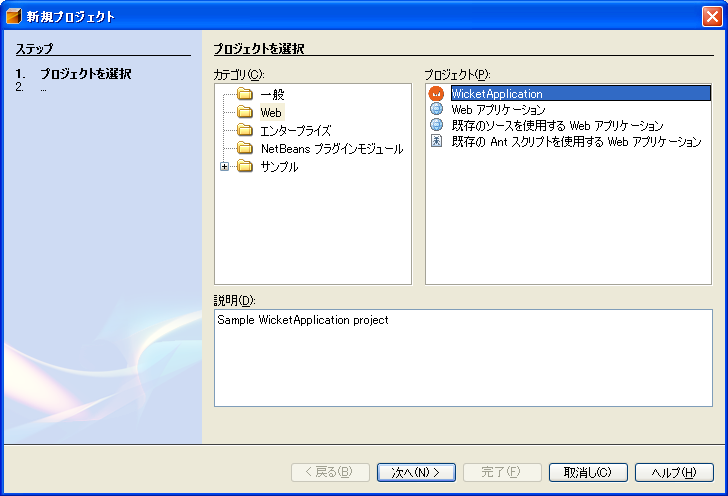
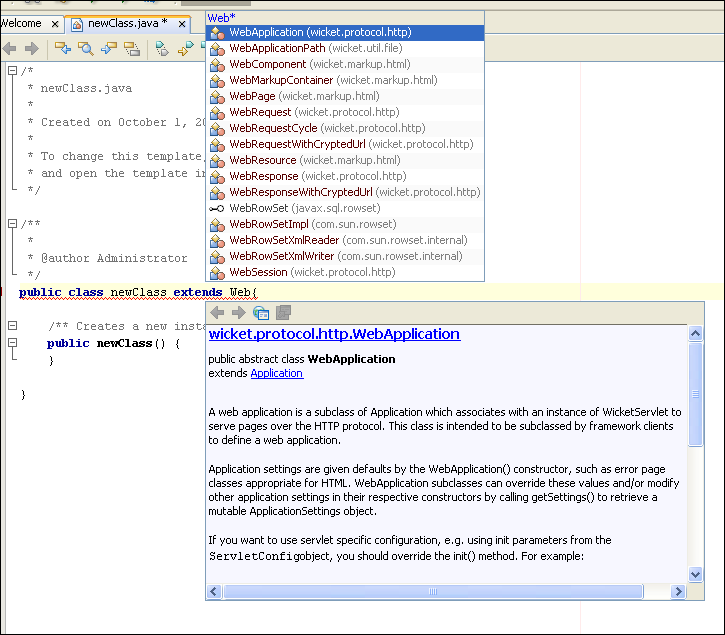
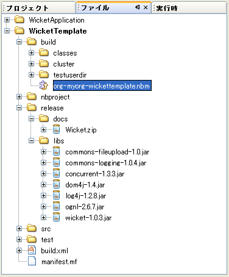

// 
//     Licensed to the Apache Software Foundation (ASF) under one
//     or more contributor license agreements.  See the NOTICE file
//     distributed with this work for additional information
//     regarding copyright ownership.  The ASF licenses this file
//     to you under the Apache License, Version 2.0 (the
//     "License"); you may not use this file except in compliance
//     with the License.  You may obtain a copy of the License at
// 
//       http://www.apache.org/licenses/LICENSE-2.0
// 
//     Unless required by applicable law or agreed to in writing,
//     software distributed under the License is distributed on an
//     "AS IS" BASIS, WITHOUT WARRANTIES OR CONDITIONS OF ANY
//     KIND, either express or implied.  See the License for the
//     specific language governing permissions and limitations
//     under the License.
//

= NetBeans プロジェクトテンプレートモジュール�?��?ュートリアル
:jbake-type: platform_tutorial
:jbake-tags: tutorials 
:jbake-status: published
:syntax: true
:source-highlighter: pygments
:toc: left
:toc-title:
:icons: font
:experimental:
:description: NetBeans プロジェクトテンプレートモジュール�?��?ュートリアル - Apache NetBeans
:keywords: Apache NetBeans Platform, Platform Tutorials, NetBeans プロジェクトテンプレートモジュール�?��?ュートリアル

翻訳 :  link:https://blogs.oracle.com/roller/page/katakai[片�?正紀] , 2006/7/10, レビュー/�?守:  link:http://ja.netbeans.org/index.html[NetBeans 日本語サイト]

link:mailto:dev@netbeans.apache.org?subject=Feedback:%20NetBeans%20IDE%20Project%20Sample%20Module%20Tutorial[フィード�?ック]

�?��?��?ュートリアル�?��?� IDE 新�?プロジェクトウィザード�?�新�?��?�プロジェクト�?�テンプレートを利用�?�能�?��?�る方法を説明�?��?��?�。IDE �?��?��?��?��?��?��?�プロジェクトテンプレートを�??供�?��?��?��?��?�。�?��?��?��?� Web アプリケーション�?既存�?�ソース�?�ら�?� Java プロジェクト�?EJB モジュール�?エンタープライズアプリケーション�?��?��?��?�。�??れ�?�れ�?�プロジェクトテンプレート�?�基本的�?�ソース構�?�?��?��??�?��?��?�サンプルコード�?�ファイルを�??供�?��?��?��?��?�。�?��?��?��?� Web アプリケーション�?�プロジェクト�?��?� Java BluePrints �?�ソース構�?�?�?�る�?��?� Jakarta �?�推奨�?�るソース構�?を�??供�?��?��?��?��?�。�??れ�?��??�?�?��?��?デフォルト�?�  ``index.jsp``  ファイル�? ``web.xml``  �?備記述�?�?Web アプリケーションテンプレートウィザード�?��?�択�?�れ�?�サー�?ー�?��?備記述�?�?��?�を�??供�?��?��?��?��?�。

�?��?��?ュートリアル�?��?� Java Web アプリケーションフレームワーク�?��?��?��?�  link:http://wicket.sourceforge.net/[Wicket] 用�?�プロジェクトテンプレートを追加�?��?��?��?��?�ょ�?�。Wicket �?�プロジェクトテンプレートを作�?�?�る�?��??�?��?�次�?� Wicket 特有�?��?件を�?�解�?�る�?��?��?�大切�?��?�:

* JSP ファイル�?��?��?�。�??れ�??れ�?� Web ページ�?��?��?�パッケージ構�?内�?��?��?��??�?�?� Java クラス�?� HTML �?�構�?�?�れ�?��?�。
* XML 構�?ファイル�?��?��?�。一�?��?� Java クラス�?�アプリケーション�?�ホームページ�?��?��?�アプリケーションレベル�?��?�情報を�??供�?��?��?�。
* Wicket 特有�?�ライブラリ�?�  ``web.xml``  �?備記述�?ファイル�?��?求を処�?��?�る Wicket サーブレットを�?�照�?��?��?�。

モジュールを作�?�?�インストール�?�る�?��?新�?ウィザード�?� Wicket プロジェクトテンプレートを利用�?��??るよ�?��?��?�り�?ライブラリマ�?ージャー�?��?� Wicket JAR ファイル�?��?��?�れるよ�?��?��?�り�?��?�。

�?��?��?ュートリアル�?��?�以下�?��?��?�を説明�?��?��?�:

* <<installing,ソフトウェア�?�インストール>>
* <<preparing,Wicket プロジェクトテンプレート�?�準備>>
* <<creatingthemoduleproject,モジュールプロジェクト�?�作�?>>
* <<bundlinglibraries,ライブラリ�?�構築>>
* <<bundlingtemplate,プロジェクトテンプレート�?�構築>>
* <<building,モジュール�?�構築�?�インストール>>

�?��?��?ュートリアル�?�ソフトウェア�?�インストール�?��??れ�?� 20 分程度�?�完了�?��?��?�。

モジュール開発�?�関�?�る詳細�?� NetBeans サイト�?�  link:https://netbeans.apache.org/platform/index.html[NetBeans 開発プロジェクトホーム] を�?�照�?��?��??�?��?��?�。�?�?�ら�?��?��?��?��?�?��?�れ�?�  link:http://wiki.netbeans.org/wiki/view/NetBeansDeveloperFAQ[NetBeans 開発者 FAQ] を�?�照�?��?��??�?��?��?�。�?��?��?��?�ページ�?�「フィード�?ック�?リンクを使�?��?��??�?��?��?�。

== ソフトウェア�?�インストール

�?��?��?��?��?�?�コンピュータ�?�ソフトウェアをインストール�?��?��?�:

* NetBeans IDE 5.0 ( link:https://netbeans.apache.org/download/index.html[ダウンロード])
* Java Standard Development Kit (JDK) �?ージョン 1.4.2 ( link:https://www.oracle.com/technetwork/java/javase/downloads/index.html[ダウンロード]) �?��?��?� 5.0 ( link:https://www.oracle.com/technetwork/java/javase/downloads/index.html[ダウンロード])

== Wicket プロジェクトテンプレート�?�準備

[start=1]
1.  link:http://sourceforge.net/project/showfiles.php?group_id=119783&package_id=130482[Wicket 1.0.3] �?� zip ファイル�?�ダウンロード�?�展開。

*注�?:* �?��?��?ュートリアル�?�他�?�リリース�?� Wicket �?�も進�?られ�?��?��?��?他�?�リリース�?��?��?��?��?ュートリアル�?�示�?��?��?�るフォルダ�?��?�別�?�場所�?� Wicket ライブラリ�?�存在�?�る�?�も�?�れ�?��?�ん。

[start=2]
1. 「ファイル�?�?「新�?プロジェクト�?を�?�択�?��?��??�?��?��?�。「カテゴリ�?�?�「Web�?を�?�択�?��?��?�。「プロジェクト�?�?��?�「Web アプリケーション�?を�?�択�?�「次�?��?ボタンをクリック�?��?��?�。

[start=3]
1. 「プロジェクト�??�?�?��?�  ``WicketApplication``  �?�入力�?��?��?�。「プロジェクト�?�場所�?�?��?�当�?�コンピューター上�?�ディレクトリを指定�?��?��?�。�?��?�ディレクトリを以�?  ``_$__PROJECTHOME_``  �?��?��?��?�。

[start=4]
1. ソース構造�?�推奨を�?�択�?��?��?�。�?�れ�?�個人的�?�好�?��?��?��?��?��?��?�ん:

* *Java BluePrints.* 詳細�?�  link:http://java.sun.com/blueprints/code/projectconventions.html[http://java.sun.com/blueprints/code/projectconventions.html] を�?�照�?��?��??�?��?��?�。

* *Jakarta.*詳細�?�  link:http://jakarta.apache.org/tomcat/tomcat-5.0-doc/[http://jakarta.apache.org/tomcat/tomcat-5.0-doc/] を�?�照�?��?��??�?��?��?�。

[start=5]
1. 他�?�項目�?�デフォルト�?��?��?��?��?��?��?�。「完了�?ボタンをクリック�?��?��?�。

IDE �?�  ``_$PROJECTHOME_/WicketApplication``  プロジェクトフォルダを作�?�?��?��?�。プロジェクト�?�必�?�?��?��?��?��?�ソースやメタデータ�?�?��?��?��?�プロジェクト�?� Ant 構築スクリプト�?��?�を�?�ん�?��?��?��?�。 ``WicketApplication``  プロジェクト�?� IDE 上�?�開�?�れ�?��?�。「プロジェクト�?ウィンドウ(Ctrl-1) �?��?�論的�?�構�?を表示�?��??�?��?�。�?��?�「ファイル�?ウィンドウ(Ctrl-2)�?��?�ファイル構造を表示�?��??�?��?�。

[start=6]
1.  ``index.jsp``  を削除�?��?��?�。Wicket �?� Web ページ�?� Java クラス�?� HTML ファイル�?�構�?�?�れ�?��?�。�?��?��?��?��?�デフォルト�?� JSP ページ�?�必�?�?�り�?��?�ん。

�?�れ�?�基本的�?� Wicket プロジェクト�?�テンプレート�?�準備�?��??�?��?��?�。�?��?�例�?��?��?標準�?� Web アプリケーション�?� Wicket アプリケーション�?��?�差�?�  ``index.jsp``  �?��?��?��?��?��?��?�。�?�れ�?�必�?�?�応�?��?�変更�?�る�?��?��?��??�?��?�。次�?�セクション�?��?� Wicket ライブラリ�?�プロジェクトテンプレートを�?�ん�?�モジュールプロジェクトを作�?�?��?新�?プロジェクトウィザード�?�インストール�?��?��?�。

== モジュールプロジェクト�?�作�?

[start=1]
1. 「ファイル�?>「新�?プロジェクト�?(Ctrl-Shift-N) を�?�択�?��?��??�?��?��?�。「カテゴリ�?�?�「NetBeans プラグインモジュール�?を�?�択�?��?��?�。「プロジェクト�?�?��?�「モジュールプロジェクト�?を�?�択�?�「次�?��?ボタンをクリック�?��?��?�。

[start=2]
1. 「�??�?�?�場所�?パ�?ル�?��?�「プロジェクト�??�?�?�「 ``WicketTemplate`` �?�?�入力�?��?��?�。「プロジェクト�?�場所�?�?��?�当�?�コンピューター上�?�ディレクトリを指定�?��?��?�。�?��?��?��?�  ``c:\mymodules``  �?��?��?��?�。「スタンドアロンモジュール�?�?�ラジオボタン�?��??�?��?��?��?��?�「主プロジェクト�?��?��?�設定�?�?ェックボックスを�?�択�?��?��?�。パ�?ル�?�次�?�よ�?��?��?�り�?��?�:

「次�?��?をクリック�?��?��?�。

[start=3]
1. 「基本モジュール構�?�?パ�?ル�?��?�「コード�??ベース�?�?�  ``yourorghere``  を  ``myorg``  �?�置�??�?��?��? ``org.myorg.wickttemplate``  �?��?��?��?�。「地域対応�?��?ンドル�?�?�「XML レイヤー�?�?��??�?��?��?��?��?�  ``org/myorg/wickttemplate``  �?��?�れら�?�ファイル�?��?存�?�れるよ�?��?��?��?��?�。パ�?ル�?��?��?�よ�?��?��?�り�?��?�:

image::images/projecttemplates_new-module-project-wiz2_ja.png[]

[start=4]
1. 「完了�?ボタンをクリック�?��?��?�。

IDE �?�  ``WicketTemplate``  プロジェクトを作�?�?��?��?�。プロジェクト�?�必�?�?��?��?��?��?�ソースやメタデータ�?�?��?��?��?�プロジェクト�?�構築スクリプト�?��?�を�?�ん�?��?��?��?�。プロジェクト�?� IDE 上�?�開�?�れ�?��?�。「プロジェクト�?ウィンドウ(Ctrl-1) �?��?�論的�?�構�?を表示�?��??�?��?�。�?��?�「ファイル�?ウィンドウ(Ctrl-2)�?��?�ファイル構造を表示�?��??�?��?�。�?��?��?��?�「プロジェクト�?ウィンドウ�?��?��?��?�よ�?��?��?�り�?��?�:

image::images/projecttemplates_projects-window-1_ja.png[]

�?�れら�?�ファイル�?�基本的�?�説明�?�  link:quickstart-nbm_ja.html[プラグインモジュールクイックスタートガイド] を�?�照�?��?��??�?��?��?�。

== Wicket ライブラリ�?��?ンドル

[start=1]
1.  ``WicketTemplate``  プロジェクトノード�?��?�クリック�?��?�「新�?�?>「J2SE ライブラリ記述�?�?を�?�択�?��?��?�。「次�?��?をクリック�?��?��?�。

[start=2]
1. 「ライブラリ�?��?�択�?パ�?ル�?�「ライブラリを管�?��?をクリック�?��?��?�。「ライブラリマ�?ージャー�?�?��?「新�?ライブラリ�?をクリック�?�「ライブラリ�??�?�?�  ``Wicket``  �?�入力�?��?��?�。「完了�?ボタンをクリック�?��?��?�。

[start=3]
1. 「JAR/フォルダを追加�?をクリック�?��? link:http://sourceforge.net/project/showfiles.php?group_id=119783&package_id=130482[Wicket 1.0.3] を展開�?��?�フォルダを�?�照�?��?��?�。

[start=4]
1. 「JAR/フォルダをブラウズ�?ダイアログ�?�「クラスパス�?タブ�?�次�?� JAR ファイルを追加�?��?��?�:

*  ``wicket-1.0.3`` 
*  ``lib/commons-fileupload-1.0`` 
*  ``lib/commons-logging-1.0.4`` 
*  ``lib/concurrent-1.3.3`` 
*  ``lib/dom4j-1.4`` 
*  ``lib/log4j-1.2.8`` 
*  ``lib/ognl-2.6.7`` 

「ライブラリマ�?ージャー�?�?�「クラスパス�?タブ�?�次�?�よ�?��?��?�り�?��?�:

image::images/projecttemplates_library-manager-1_ja.png[]

[start=5]
1. 「Javadoc�?タブ�?��?�  ``docs/apidocs``  フォルダを追加�?��?��?�。

「ライブラリマ�?ージャー�?�?�「Javadoc�?タブ�?�次�?�よ�?��?��?�り�?��?�:

image::images/projecttemplates_library-manager-2_ja.png[]

[start=6]
1. 「完了�?ボタンをクリック�?��?��?�。「ライブラリ�?��?�択�?パ�?ル�?�新�?��??作�?�?��?� Wicket ライブラリを�?�択�?��?��?�。

image::images/projecttemplates_j2se-library-descriptor-1_ja.png[]

「次�?��?をクリック�?��?��?�。

[start=7]
1. 「�??�?�?�場所�?パ�?ル�?��?��?��?��?�デフォルト�?��?��?��?��?��?��?�。

[start=8]
1. 「完了�?ボタンをクリック�?��?��?�。

プロジェクトウィンドウ�?�  ``Wicket``  J2SE ライブラリ記述�?を�?�ん�?��?��?��?�。ファイルウィンドウ�?��?�モジュール�?�追加�?��?� Wicket アーカイブファイル�?�表示�?�れ�?��?�:

 
image::images/projecttemplates_projects-window-3_ja.png[] 

== Wicket プロジェクトテンプレート�?��?ンドル

[start=1]
1.  ``WicketTemplate``  プロジェクトノード�?��?�クリック�?��?�「新�?�?>「プロジェクトテンプレート�?を�?�択�?��?��?�。

[start=2]
1. 「プロジェクトを�?�択�?パ�?ル�?��?�次�?�よ�?��?�サンプル�?��?��?��?ンドル�?�るプロジェクト�?�自動的�?��?�択�?�れ�?��?�:

image::images/projecttemplates_new-project-template-wiz1_ja.png[]

IDE �?�複数�?�プロジェクト�?�開�?�れ�?��?��?�場�?��?��?�ドロップダウンリストを使�?��?� Wicket アプリケーションを�?�択�?��?��?�。

「次�?��?をクリック�?��?��?�。

[start=3]
1. 「�??�?�?�場所�?パ�?ル�?��?�「テンプレート�??�?�?�「 ``WicketApplication`` �?�?�入力�?��?「表示�??�?�?��?�「 ``Wicket Application`` �?�?�入力�?��?��?�。「カテゴリ�?ドロップダウンリスト�?�ら�?�次�?�よ�?��?�「Web�?を�?�択�?��?��?�。

image::images/projecttemplates_new-project-template-wiz2_ja.png[]

[start=4]
1. 「完了�?ボタンをクリック�?��?��?�。

IDE �?�次�?��?��?�を行�?��?��?�:

* プロジェクトを�?�む ZIP ファイルを作�?�?�る
* サンプルを作�?�?�る�?��?�?�新�?プロジェクトウィザード�?�使�?れる Java パ�?ル�?��??復�?を作�?�?�る
* 新�?プロジェクトウィザード�?�説明を表示�?�る HTML を�??供�?�る
* XML レイヤーファイル�?�サンプルを登録�?�る
* ローカライズ用�?�文字を  ``bundle.properties``  ファイル�?�追加�?�る

�?�れ�?�「プロジェクト�?ウィンドウ�?��?��?�よ�?��?��?�り�?��?�:

image::images/projecttemplates_projects-window-4_ja.png[]

最後�?�デフォルト�?�アイコンを Wicket �?�アイコン�?�置�??�?��?��?��?�。Wicket �?�アイコンを�?�得�?�る�?��?��?以下�?�イメージ�?��?�クリック�?��?�ファイル�?��?存�?��?��?�。

[start=5]
1. 「�?�?�?�ファイル�?ノード�?�「XML レイヤー�?ノードを展開�?��?��?�。２�?��?�ノード  ``<�?��?�レイヤー>``  �?�  ``<コンテキスト内�?��?��?�レイヤー>``  �?��??�?�サブノード�?�  link:https://netbeans.apache.org/tutorials/nbm-glossary.html[ファイルシステム] �?�ブラウザを構�?�?��?��?��?��?�。 ``<�?��?�レイヤー>`` �?�?�ら�?�  ``Templates`` �?作�?�?��?�テンプレート�?�見�?�る�?��?�ノードを展開�?��?��?�。

[start=6]
1. 新�?��?�テンプレート�?�ノード�?��?�クリック�?��?�次�?�よ�?��?�「アイコンを�?�択�?を�?�択�?��?��?�:

Wicket アイコン�?��?存�?��?��?�る場所を�?�照�?��?��?�。デフォルト�?�アイコン�?� Wicket アイコン�?�変更�?�れ�?��?�:

image::images/projecttemplates_layerxml2_ja.png[]

�?�れ�?� Wicket ライブラリ�?�テンプレートを�?�むモジュール�?�構築�?インストール�?��?�使用�?�る準備�?�整�?��?��?��?�。

== モジュール�?�構築�?�インストール

IDE �?�モジュール�?�構築�?�よ�?�インストール�?� Ant 構築スクリプトを使用�?��?��?�。構築スクリプト�?�プロジェクト�?�作�?時�?�作�?�?�れ�?��?�。

=== NetBeans モジュール�?�インストール

* 「プロジェクト�?ウィンドウ�?�「 ``WicketTemplate`` �?プロジェクトを�?�クリック�?�「ターゲットプラットフォーム�?��?�インストール/�?読�?�込�?��?を�?��?��?��?�。

モジュール�?�構築�?�れターゲット IDE �?�る�?��?�プラットフォーム�?�インストール�?�れ�?��?�。ターゲット IDE �?��?��?�プラットフォーム�?�起動�?�新�?モジュールを試�?��?��?��?��?��??�?��?�。デフォルト�?�ターゲットプラットフォーム�?��?� IDE �?��?�在�?�インスタンス�?�使用�?��?��?�るインストール�?��?�。モジュールを実行�?�る�?� IDE �?�ユーザーディレクトリ�?��?�別�?�テストユーザーディレクトリ�?�実行�?�れ�?��?�。

=== NetBeans モジュール�?�使用

[start=1]
1. 「ファイル�?>「新�?プロジェクト�?(Ctrl-Shift-N) を�?�択�?��?��??�?��?��?�。

新�?プロジェクトウィザード�?�開�?? Wicket アプリケーションテンプレート�?�表示�?�れ�?��?�:

[start=2]
1. 「Wicket アプリケーション�?を�?�択�?�「次�?��?ボタンをクリック�?��?��?�。「�??�?�?�場所�?パ�?ル�?�表示�?�れ�?��?�。「プロジェクト�??�?�?��??�?を入力�?��?��?�。

[start=3]
1. 「完了�?ボタンをクリック�?��?��?�。

IDE �?�新�?��??作�?�?�れ�?�サンプルプロジェクトを開�??表示�?��?��?�。 ``index.jsp``  �?�開�?�れ�?��?��?��?��?�気�?��?��??�?��?�ょ�?�。

[start=4]
1. 「ライブラリ�?ノード�?��?�クリック�?��?「ライブラリを追加�?を�?�択�?��?��?�。次�?�よ�?��?��?�り�?��?�:

image::images/projecttemplates_projects-window-5_ja.png[]

[start=5]
1. Wicket ライブラリを�?�択肢�?「ライブラリを追加�?をクリック�?��?��?�。

[start=6]
1. 新�?��?? Java クラス�?�作�?�?��?��?�。Wicket ライブラリ�?�コード補完やJavadoc �?�サ�?ート�?�れ�?��?��?��?�。

=== 共有�?�能�?�モジュール�?イナリ�?�作�? (NBM ファイル)

NBM ファイル�?� Web 経由�?� NetBeans モジュール�?布�?�る�?��?�?�パッケージ�?��?�。主�?� NBM ファイル�?�モジュール�?� JAR ファイル�?��?��?��?��?�次�?��?�:

* NBM ファイル�?�圧縮�?�れ�?��?��?��?�。
* NBM ファイル�?�複数�?� JAR ファイルを�?�む�?��?��?��?��??�?��?�。モジュール�?� NBM �?�使用�?�る任�?�?�ライブラリをパッケージ�?��??�?��?�。
* NBM ファイル�?� NetBeans �?�表示�?�る表示�??�?アップデートセンター�?�関�?�る情報�?マニフェストコンテンツ�?ライセンス等メタデータを�?�む�?��?��?��?��??�?��?�。
* NBM ファイル�?�通常セキュリティー�?�目的�?�署�??�?�れ�?��?��?��?�。

NBM �?�特別�?�拡張�?を使�?��?� ZIP ファイル�?��?�。JDK �?�機構を使�?��?� JAR を署�??�?��?��?�。特別�?��?��?�を�?��?��?��?��?�り�?NBM ファイル�?�内容�?�注�?�?�る必�?�?��?�り�?��?�ん。標準�?� Ant 構築スクリプト�?�よ�?��?� NBM �?�作�?�?�れ�?��?�。IDE �?�プロジェクト�?�プロジェクトプロパティーダイアログボックス�?�入力�?��?�値�?�基�?��?��?�構築スクリプトを作�?�?��?��?�。プロジェクトプロパティー�?�ダイアログボックス�?��?�モジュール�?��?存関係�?�?ージョン�?パッケージ�?�情報を設定�?��??�?��?�。Ant スクリプトや Ant プロパティーを使�?��?�プログラム�?�実行をカスタマイズ�?�る�?��?��?��?��??�?��?�。

[start=1]
1. 「プロジェクト�?ウィンドウ�?�  ``WicketTemplate``  プロジェクトを�?�クリック�?��?「NBM を作�?�?を�?�択�?��?��?�。

NBM ファイル�?�作�?�?�れ�?��?�。「ファイル�?ウィンドウ (Ctrl-2) �?�確�?�?��??�?��?�:

[start=2]
1. メール�?��?��?��?付�?�る�?��?��?�より他�?�人�?��?布�?共有�?��??�?��?�。

== 次�?�ステップ

NetBeans モジュール�?�開発�?�作�?�?�詳細�?�次�?�リソースを�?�照�?��?��??�?��?��?�:

*  link:https://netbeans.apache.org/platform/index.html[プラグイン開発者リソース]

*  link:https://bits.netbeans.org/dev/javadoc/[NetBeans API リスト (�?�行�?�開発�?ージョン)]

*  link:http://apisupport.netbeans.org/new-apisupport.html[新�? API サ�?ート�?��??案]

*  link:https://netbeans.apache.org/tutorials/index_ja.html[�??�?�他�?�プラグインモジュール�?ュートリアル]

== �?ージョン

詳細�?�更新履歴�?�  link:nbm-projecttemplates_ja.html[原文�?�英文] を�?�覧下�?��?�。�?��?�ファイル�?�リビジョン 1.13 を翻訳�?��?��?��?��?�。

