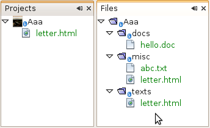
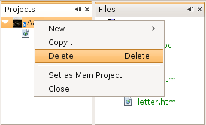
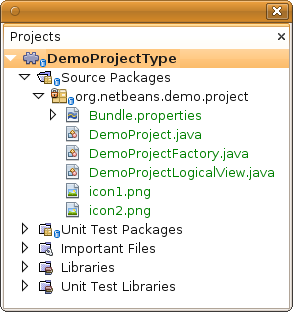
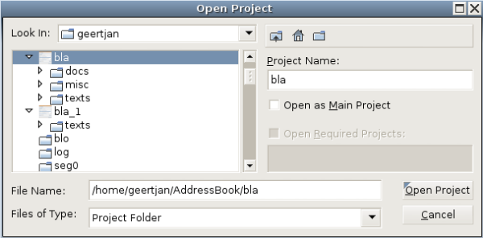

// 
//     Licensed to the Apache Software Foundation (ASF) under one
//     or more contributor license agreements.  See the NOTICE file
//     distributed with this work for additional information
//     regarding copyright ownership.  The ASF licenses this file
//     to you under the Apache License, Version 2.0 (the
//     "License"); you may not use this file except in compliance
//     with the License.  You may obtain a copy of the License at
// 
//       http://www.apache.org/licenses/LICENSE-2.0
// 
//     Unless required by applicable law or agreed to in writing,
//     software distributed under the License is distributed on an
//     "AS IS" BASIS, WITHOUT WARRANTIES OR CONDITIONS OF ANY
//     KIND, either express or implied.  See the License for the
//     specific language governing permissions and limitations
//     under the License.
//

= NetBeans Project Type Module Tutorial
:jbake-type: platform_tutorial
:jbake-tags: tutorials 
:jbake-status: published
:syntax: true
:source-highlighter: pygments
:toc: left
:toc-title:
:icons: font
:experimental:
:description: NetBeans Project Type Module Tutorial - Apache NetBeans
:keywords: Apache NetBeans Platform, Platform Tutorials, NetBeans Project Type Module Tutorial

This tutorial demonstrates how to create a new project type.

If the projects for which you're creating a project type need to use Ant as their build tool, you should use the  link:https://netbeans.apache.org/tutorials/nbm-projecttypeant.html[NetBeans Ant-Based Project Type Module Tutorial] instead.

You will also make use of these two icons, which you can right-click here and download: 
image::images/icon1.png[] 

Optionally, for troubleshooting purposes, you can  link:http://plugins.netbeans.org/PluginPortal/faces/PluginDetailPage.jsp?pluginid=12170[download the completed sample] and inspect the sources.

== Introduction to Project Types

A _project type_ is a NetBeans Platform term for a grouping of folders and files that is treated as a single unit. Treating related folders and files as a single unit makes working with them easier for the end user. One way in which a project type simplifies life for the user is that you are able to fill the Projects window only with those folders and files that the end user is most likely to work.

For example, the Java project type in NetBeans IDE helps the end user to work with the folders and files belonging to a single Java application. As you can see below, the folders and files the end user most needs to work with are shown in the Projects window:

image::images/projecttypes_sample-3.png[]

In this tutorial, we will create a project type that will look as follows in the Projects window:

Our project type will be defined by the existence of a subfolder named "texts". If a folder contains a subfolder with that name, the NetBeans Platform will recognize it as a project type. The user will be able to open the project into a NetBeans Platform application and the content of the "texts" folder will be displayed in the Projects window.

We will also have menu items that are specific to our new project type:

The following are the main NetBeans API classes we will be implementing in this tutorial:

|===
|Class |Description 

| `` link:http://bits.netbeans.org/dev/javadoc/org-netbeans-modules-projectapi/org/netbeans/spi/project/ProjectFactory.html[org.netbeans.spi.project.ProjectFactory]``  |Determines when a folder or file is a valid project and then creates the implemention of  ``org.netbeans.api.project.Project`` . 

| `` link:http://bits.netbeans.org/dev/javadoc/org-netbeans-modules-projectapi/org/netbeans/api/project/Project.html[org.netbeans.api.project.Project]``  |Represents the project. 

| `` link:http://bits.netbeans.org/dev/javadoc/org-netbeans-modules-projectuiapi/org/netbeans/spi/project/ui/LogicalViewProvider.html[org.netbeans.spi.project.ui.LogicalViewProvider]``  |Provides the logical view for the project. 

| `` link:http://bits.netbeans.org/dev/javadoc/org-netbeans-modules-projectapi/org/netbeans/api/project/ProjectInformation.html[org.netbeans.api.project.ProjectInformation]``  |Provides supplemental information for the project. 

| `` link:http://bits.netbeans.org/dev/javadoc/org-netbeans-modules-projectapi/org/netbeans/spi/project/ActionProvider.html[org.netbeans.spi.project.ActionProvider]``  |Provides one or more actions for the project. 

| `` link:http://bits.netbeans.org/dev/javadoc/org-netbeans-modules-projectapi/org/netbeans/spi/project/CopyOperationImplementation.html[org.netbeans.spi.project.CopyOperationImplementation]``  |Provides the Copy operation for the project. 

| `` link:http://bits.netbeans.org/dev/javadoc/org-netbeans-modules-projectapi/org/netbeans/spi/project/DeleteOperationImplementation.html[org.netbeans.spi.project.DeleteOperationImplementation]``  |Provides the Delete operation for the project. 
|===

At the end of this tutorial, your module source structure will be as follows:

== Creating the Module Project

We begin by working through the New Module Project wizard. At the end of it, we will have a basic source structure, with some default files, that every NetBeans module requires.

[start=1]
1. Choose File > New Project (Ctrl+Shift+N). Under Categories, select NetBeans Modules. Under Projects, select Module. Click Next.

[start=2]
1. In the Name and Location panel, type  ``DemoProjectType``  in the Project Name field. Change the Project Location to any directory on your computer. Leave the Standalone Module option and Set as Main Project checkbox selected. Click Next.

[start=3]
1. In the Basic Module Configuration panel, type  ``org.netbeans.demo.project``  in Code Name Base.

[start=4]
1. Do not select "Generate XML Layer", since our module will not need a  ``layer.xml``  file. Leave the location of the localizing bundle so that it will be stored in a package with the name  ``org/netbeans/demo/project`` . Click Finish.

The IDE creates the  ``DemoProjectType``  project. The project contains all of your sources and project metadata, such as the project's Ant build script. The project opens in the IDE. You can view its logical structure in the Projects window (Ctrl-1) and its file structure in the Files window (Ctrl-2).

== Setting Dependencies

We will need to make use of several NetBeans APIs. In this step, we select the modules that provide the NetBeans APIs that we will need.

[start=1]
1. Right-click the project node and choose Properties. The Project Properties dialog box opens.

[start=2]
1. In the Libraries panel, add dependencies on the following modules:

* Datasystems API
* Dialogs API
* File System API
* Module System API
* Nodes API
* Project API
* Project UI API
* UI Utilities API
* Utilities API

[start=3]
1. 
Expand the module's Libraries node in the Projects window and make sure that the list of APIs is as shown in the Libraries node below:

== Creating the Project Factory

We start by implementing the  `` link:http://bits.netbeans.org/dev/javadoc/org-netbeans-modules-projectapi/org/netbeans/spi/project/ProjectFactory.html[org.netbeans.spi.project.ProjectFactory]``  class.

[start=1]
1. Create a Java class called  ``DemoProjectFactory`` .

[start=2]
1. Change the default code to the following:

[source,java]
----

@org.openide.util.lookup.ServiceProvider(service=ProjectFactory.class)
public class DemoProjectFactory implements  link:http://bits.netbeans.org/dev/javadoc/org-netbeans-modules-projectapi/org/netbeans/spi/project/ProjectFactory.html[ProjectFactory] {

    public static final String PROJECT_DIR = "texts";

    *//Specifies when a project is a project, i.e.,
    //if the project directory "texts" is present:*
    @Override
    public boolean isProject(FileObject projectDirectory) {
        return projectDirectory.getFileObject(PROJECT_DIR) != null;
    }

    *//Specifies when the project will be opened, i.e.,
    //if the project exists:*
    @Override
    public Project loadProject(FileObject dir, ProjectState state) throws IOException {
        return isProject(dir) ? new DemoProject(dir, state) : null;
    }

    @Override
    public void saveProject(final Project project) throws IOException, ClassCastException {
        FileObject projectRoot = project.getProjectDirectory();
        if (projectRoot.getFileObject(PROJECT_DIR) == null) {
            throw new IOException("Project dir " + projectRoot.getPath() +
                    " deleted," +
                    " cannot save project");
        }
        *//Force creation of the texts dir if it was deleted:*
        ((DemoProject) project).getTextFolder(true);
    }

}
----

== Creating the Project

Next, we implement the  `` link:http://bits.netbeans.org/dev/javadoc/org-netbeans-modules-projectapi/org/netbeans/api/project/Project.html[org.netbeans.api.project.Project]``  class.

[start=1]
1. Create a Java class called  ``DemoProject`` .

[start=2]
1. Change the default code to the following:

[source,java]
----

class DemoProject implements  link:http://bits.netbeans.org/dev/javadoc/org-netbeans-modules-projectapi/org/netbeans/api/project/Project.html[Project] {

    private final FileObject projectDir;
    private final ProjectState state;
    private Lookup lkp;

    public DemoProject(FileObject projectDir, ProjectState state) {
        this.projectDir = projectDir;
        this.state = state;
    }

    @Override
    public FileObject getProjectDirectory() {
        return projectDir;
    }

    FileObject getTextFolder(boolean create) {
        FileObject result =
                projectDir.getFileObject(DemoProjectFactory.PROJECT_DIR);
        if (result == null &amp;&amp; create) {
            try {
                result = projectDir.createFolder(DemoProjectFactory.PROJECT_DIR);
            } catch (IOException ioe) {
                Exceptions.printStackTrace(ioe);
            }
        }
        return result;
    }

    *//The project type's capabilities are registered in the project's lookup:*
    @Override
    public Lookup getLookup() {
        if (lkp == null) {
            lkp = Lookups.fixed(new Object[]{
                        state, *//allow outside code to mark the project as needing saving*
                        new ActionProviderImpl(), *//Provides standard actions like Build and Clean*
                        new DemoDeleteOperation(),
                        new DemoCopyOperation(this),
                        new Info(), *//Project information implementation*
                        new DemoProjectLogicalView(this), *//Logical view of project implementation*
                    });
        }
        return lkp;
    }

    private final class ActionProviderImpl implements  link:http://bits.netbeans.org/dev/javadoc/org-netbeans-modules-projectapi/org/netbeans/spi/project/ActionProvider.html[ActionProvider] {

        private String[] supported = new String[]{
            ActionProvider.COMMAND_DELETE,
            ActionProvider.COMMAND_COPY,
        };

        @Override
        public String[] getSupportedActions() {
            return supported;
        }

        @Override
        public void invokeAction(String string, Lookup lookup) throws IllegalArgumentException {
            if (string.equalsIgnoreCase(ActionProvider.COMMAND_DELETE)) {
                DefaultProjectOperations.performDefaultDeleteOperation(DemoProject.this);
            }
            if (string.equalsIgnoreCase(ActionProvider.COMMAND_COPY)) {
                DefaultProjectOperations.performDefaultCopyOperation(DemoProject.this);
            }
        }

        @Override
        public boolean isActionEnabled(String command, Lookup lookup) throws IllegalArgumentException {
            if ((command.equals(ActionProvider.COMMAND_DELETE))) {
                return true;
            } else if ((command.equals(ActionProvider.COMMAND_COPY))) {
                return true;
            } else {
                throw new IllegalArgumentException(command);
            }
        }
    }

    private final class DemoDeleteOperation implements  link:http://bits.netbeans.org/dev/javadoc/org-netbeans-modules-projectapi/org/netbeans/spi/project/DeleteOperationImplementation.html[DeleteOperationImplementation] {

        public void notifyDeleting() throws IOException {
        }

        public void notifyDeleted() throws IOException {
        }

        public List<FileObject> getMetadataFiles() {
            List<FileObject> dataFiles = new ArrayList<FileObject>();
            return dataFiles;
        }

        public List<FileObject> getDataFiles() {
            List<FileObject> dataFiles = new ArrayList<FileObject>();
            return dataFiles;
        }
    }

    private final class DemoCopyOperation implements  link:http://bits.netbeans.org/dev/javadoc/org-netbeans-modules-projectapi/org/netbeans/spi/project/CopyOperationImplementation.html[CopyOperationImplementation] {

        private final DemoProject project;
        private final FileObject projectDir;

        public DemoCopyOperation(DemoProject project) {
            this.project = project;
            this.projectDir = project.getProjectDirectory();
        }

        public List<FileObject> getMetadataFiles() {
            return Collections.EMPTY_LIST;
        }

        public List<FileObject> getDataFiles() {
            return Collections.EMPTY_LIST;
        }

        public void notifyCopying() throws IOException {
        }

        public void notifyCopied(Project arg0, File arg1, String arg2) throws IOException {
        }
    }

    private final class Info implements  link:http://bits.netbeans.org/dev/javadoc/org-netbeans-modules-projectapi/org/netbeans/api/project/ProjectInformation.html[ProjectInformation] {

        @Override
        public Icon getIcon() {
            return new ImageIcon(ImageUtilities.loadImage(
                    "org/netbeans/demo/project/icon2.png"));
        }

        @Override
        public String getName() {
            return getProjectDirectory().getName();
        }

        @Override
        public String getDisplayName() {
            return getName();
        }

        @Override
        public void addPropertyChangeListener(PropertyChangeListener pcl) {
            //do nothing, won't change
        }

        @Override
        public void removePropertyChangeListener(PropertyChangeListener pcl) {
            //do nothing, won't change
        }

        @Override
        public Project getProject() {
            return DemoProject.this;
        }
    }
}

----

== Creating the Logical View Provider

Finally, we implement the  `` link:http://bits.netbeans.org/dev/javadoc/org-netbeans-modules-projectuiapi/org/netbeans/spi/project/ui/LogicalViewProvider.html[org.netbeans.spi.project.ui.LogicalViewProvider]``  class.

[start=1]
1. Create a Java class called  ``DemoProjectLogicalView`` .

[start=2]
1. Change the default code to the following:

[source,java]
----

class DemoProjectLogicalView implements  link:http://bits.netbeans.org/dev/javadoc/org-netbeans-modules-projectuiapi/org/netbeans/spi/project/ui/LogicalViewProvider.html[LogicalViewProvider] {

    private final DemoProject project;

    public DemoProjectLogicalView(DemoProject project) {
        this.project = project;
    }

    @Override
    public org.openide.nodes.Node createLogicalView() {
        try {
            *//Get the Text directory, creating if deleted*
            FileObject text = project.getTextFolder(true);

            *//Get the DataObject that represents it*
            DataFolder textDataObject =
                    DataFolder.findFolder(text);

            *//Get its default node-we'll wrap our node around it to change the
            //display name, icon, etc*
            Node realTextFolderNode = textDataObject.getNodeDelegate();

            *//This FilterNode will be our project node*
            return new TextNode(realTextFolderNode, project);

        } catch (DataObjectNotFoundException donfe) {
            Exceptions.printStackTrace(donfe);
            *//Fallback-the directory couldn't be created -
            //read-only filesystem or something evil happened*
            return new AbstractNode(Children.LEAF);
        }
    }

    */** This is the node you actually see in the project tab for the project */*
    private static final class TextNode extends  link:http://bits.netbeans.org/dev/javadoc/org-openide-nodes/org/openide/nodes/FilterNode.html[FilterNode] {

        final DemoProject project;

        public TextNode(Node node, DemoProject project) throws DataObjectNotFoundException {
            super(node, new FilterNode.Children(node),
                    *//The projects system wants the project in the Node's lookup.
                    //NewAction and friends want the original Node's lookup.
                    //Make a merge of both*
                    new ProxyLookup(new Lookup[]{Lookups.singleton(project),
                        node.getLookup()
                    }));
            this.project = project;
        }

        @Override
        public Action[] getActions(boolean arg0) {
            Action[] nodeActions = new Action[7];
            nodeActions[0] = CommonProjectActions.newFileAction();
            nodeActions[1] = CommonProjectActions.copyProjectAction();
            nodeActions[2] = CommonProjectActions.deleteProjectAction();
            nodeActions[5] = CommonProjectActions.setAsMainProjectAction();
            nodeActions[6] = CommonProjectActions.closeProjectAction();
            return nodeActions;
        }

        @Override
        public Image getIcon(int type) {
            return ImageUtilities.loadImage("org/netbeans/demo/project/icon1.png");
        }

        @Override
        public Image getOpenedIcon(int type) {
            return getIcon(type);
        }

        @Override
        public String getDisplayName() {
            return project.getProjectDirectory().getName();
        }

    }

    @Override
    public Node findPath(Node root, Object target) {
        //leave unimplemented for now
        return null;
    }

}

----

== Installing the Module

Finally, we install the module and make use of the result.

[start=1]
1. Check that the module looks as follows in the Projects window:

[start=2]
1. Right-click the module project and choose "Run". The application for which the module is being created starts up and the module installs into it.

[start=3]
1. 
Choose File | Open Project and browse to a folder that has a subfolder named "texts". You should see the icon that you defined earlier to identify the project type:

[start=4]
1. Open the project and you should see the Projects window displaying your project. The content of the "texts" folder should be shown in the Projects window:

[start=5]
1. Right-click the project node and notice the project-level menu items that you defined earlier:

link:http://netbeans.apache.org/community/mailing-lists.html[Send Us Your Feedback]

== Next Steps

For more information about creating and developing NetBeans modules, see the following resources:

*  link:https://netbeans.apache.org/kb/docs/platform.html[Other Related Tutorials]

*  link:http://bits.netbeans.org/dev/javadoc/index.html[NetBeans API Javadoc]
