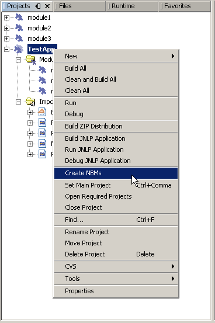
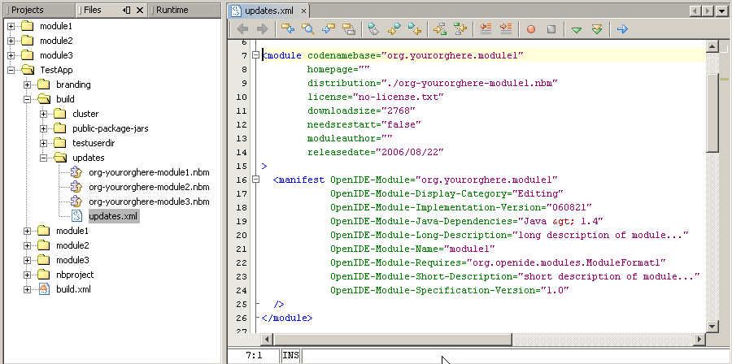
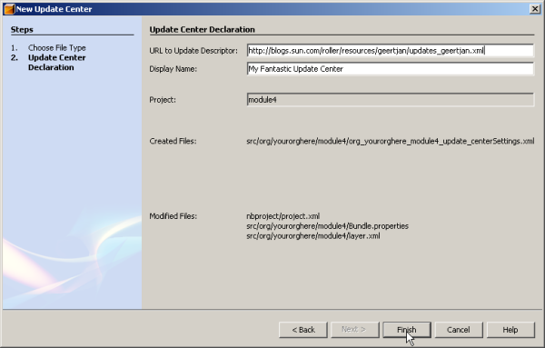
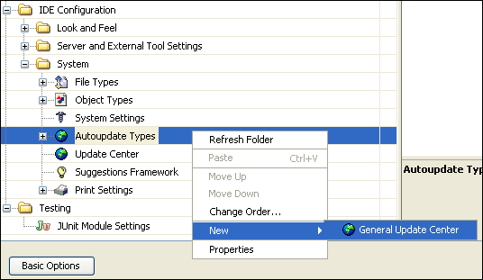

// 
//     Licensed to the Apache Software Foundation (ASF) under one
//     or more contributor license agreements.  See the NOTICE file
//     distributed with this work for additional information
//     regarding copyright ownership.  The ASF licenses this file
//     to you under the Apache License, Version 2.0 (the
//     "License"); you may not use this file except in compliance
//     with the License.  You may obtain a copy of the License at
// 
//       http://www.apache.org/licenses/LICENSE-2.0
// 
//     Unless required by applicable law or agreed to in writing,
//     software distributed under the License is distributed on an
//     "AS IS" BASIS, WITHOUT WARRANTIES OR CONDITIONS OF ANY
//     KIND, either express or implied.  See the License for the
//     specific language governing permissions and limitations
//     under the License.
//

= Leveraging an Update Center in a Rich-Client Application
:jbake-type: platform_tutorial
:jbake-tags: tutorials 
:jbake-status: published
:syntax: true
:source-highlighter: pygments
:toc: left
:toc-title:
:icons: font
:experimental:
:description: Leveraging an Update Center in a Rich-Client Application - Apache NetBeans
:keywords: Apache NetBeans Platform, Platform Tutorials, Leveraging an Update Center in a Rich-Client Application

link:mailto:dev@netbeans.apache.org?subject=Feedback:%20NetBeans%20Platform%20Paint%20Application%20Tutorial[Feedback]

NetBeans applications are modular. In NetBeans terms, a module is a group of Java classes that provides an application with a specific feature. You can develop each of an application's distinct features in separate modules. Depending on the application's architecture, there may or may not be dependencies between modules. Especially in the case of third party libraries, having the Java classes in a separate module makes sense, because you can distribute updates to the third party library in a new module, rather then redistributing one whole monolithic application.

A module is made available as a file with an  ``.NBM``  extension, referred to as an NBM file. An NBM file is nothing more than a ZIP file that a rich-client application's Update Center functionality understands. NetBeans IDE, which is just another rich-client application, has an Update Center wizard under the Tools menu. Via the Update Center wizard, you can browse to an NBM file in your file system and install it in the IDE by using the Update Center wizard to load it. That same Update Center wizard can easily be reused in your own application. It is provided by a module and you can specify that your application should include that module, in addition to the modules that you yourself are providing.

Instead of being available locally in your file system, an NBM file could also be in a so-called "update center". This is nothing more than an XML file that is known as an "autoupdate descriptor", together with the modules that it describes. The autoupdate descriptor lists all the modules that you would like to make available. For each module, the autoupdate descriptor provides information such as a name, a description, and a list of modules that it depends on. Most importantly, the autoupdate descriptor specifies a URL for each module that it describes. Each module, in binary NBM file format, must live on a host. The autoupdate descriptor itself must also live on a host. The host where the autoupdate descriptor lives need not be the same host as where the modules live. The modules can live together on the same host or be spread across different hosts.

Assuming that you have an autoupdate descriptor and its associated modules on a host, you must let your end users know that they are there. The URL to the autoupdate descriptor must be registered in the end users' application. This can be done in one of two ways:

* *Automatically.* You can provide a module that registers the URL to the update center for them. This module can be generated in the IDE, without any coding on your part.
* *Manually.* You must tell your end user what the URL to your autoupdate descriptor is. Then, the end users need to register the URL to your autopdate descriptor. They must then do so manually in the Options window.

Once the URL to the update center is registered, your end users can access your modules via the Update Center wizard, which they can find under the IDE'S Tools menu or under your own application's Tools menu. Not only new modules, but new versions of existing modules can be distributed in this way.

In this tutorial, you will learn about all of the above activities and how to leverage them in your own rich-client applications built on top of the NetBeans Platform.

The following topics are covered below:

* <<create,Creating an Application and Stealing the IDE's Update Center Functionality>>

* <<create1,Creating an Application>>
* <<create2,Stealing the IDE's Update Center Functionality>>
* <<distribute,Creating and Distributing an Autoupdate Descriptor>>

* <<distribute1,Using the IDE to Create an Autoupdate Descriptor>>
* <<distribute2,Setting the Autoupdate Descriptor's Values and Regenerating the Autoupdate Descriptor>>
* <<distribute3,Uploading the Autoupdate Descriptor and NBM Files>>
* <<url,Distributing the URL to the Autoupdate Descriptor>>

* <<url1,Generating a Module for Registering an Autoupdate Descriptor>>
* <<url2,Making the End User Manually Register an Autoupdate Descriptor>>
* <<download,Downloading NBM Files from an Update Center>>

* <<download1,Dynamically Installing Modules via an Application's Update Center Wizard>>
* <<download2,Manually Downloading and Installing Modules>>
* <<reading,Further Reading>>

Once the software is installed, this tutorial can be completed in 30 minutes.

== Creating an Application and Stealing the IDE's Update Center Functionality 

In this section, you create the structure of your application. You first need to create a module suite project, which will represent your application. Next, you will take the module that provides the IDE's Update Center, and make it available to your own application.

=== Creating an Application 

A module suite is the equivalent of an application—it is a set of modules that work together to create specific results. It also lets you assign your own splash screen (branding), application name, and the type and number of NetBeans modules you want to use. You can also take advantage of such actions as creating a ZIP distribution and building a Java WebStart (JNLP) application, which are important tools in making your application available to other users.

Do the following:

[start=1]
1. Choose File > New Project > NetBeans Plug-in Modules > Module Suite Project. Click Next.

[start=2]
1. Name the project "TestApp" and put it in any project location of your choice. Click Finish.

You now have an application that includes all of the IDE's modules. Except in the case where you intend to create an application that is also an IDE, having all of the IDE's modules is not necessary, making your application far larger than it needs to be. In the next step, you are shown how easy it is to remove the IDE's modules, so that you are left with only those modules that are provided by the core of the NetBeans IDE, which is also known as "the NetBeans Platform".

[start=3]
1. Right-click the "TestApp" node and choose Properties. In the "Application" panel, click "Create Standalone Application". When prompted to exclude the IDE's modules, click Exclude. Click OK.

[start=4]
1. Right-click the "TestApp" node and choose Run.

[start=5]
1. The application starts up. The Update Center wizard, which you need if you want to load NBM files into your application, should be found under the Tools menu. Look under the Tools menu. You should see the following:

image::http://blogs.oracle.com/roller/resources/geertjan/kaiupdate1.png[]

No "Update Center" menu item! It isn't a menu item that belongs to the NetBeans Platform. It is a menu item that belongs to NetBeans IDE. You need to tell the application to include the module that will provide the NetBeans IDE's Update Center wizard, as well as its supporting functionality—a menu item and the Module Manager. Close the application and go back to the IDE.

=== Stealing the IDE's Update Center Functionality

[start=1]
1. Right-click the "TestApp" node. Choose Properties. In the Libraries panel, expand the nb5.5 node. Click the nb5.5 checkbox. All the subnodes are now selected. Unselect all of them, except "Update Centers".

[start=2]
1. Now the IDE helpfully tells you in red text that you need the "Auto Update" module in the "platform6" cluster:

image::http://blogs.oracle.com/roller/resources/geertjan/kaiupdate2.png[]

[start=3]
1. In the Libraries panel, expand the "platform6" node. Select "Auto Update". No red text appears, which means that your dependencies are satisfied. Click OK.

[start=4]
1. Right-click the "TestApp" node and choose "Clean and Build All".

[start=5]
1. Right-click the "TestApp" node and choose Run.

[start=6]
1. The application starts up again. Look under the Tools menu:

image::http://blogs.oracle.com/roller/resources/geertjan/kaiupdate3.png[]

There's the "Update Center" menu item! (And the "Module Manager" menu item for installing/uninstalling and enabling/disabling modules.) Now choose the menu item and install modules, either available locally on your system or on-line via someone's Update Center.

== Creating and Distributing an Autoupdate Descriptor

An autoupdate descriptor is an XML file that describes the NBM files that you want to make available to your users. For example, an autoupdate descriptor specifies a name, a description, and a URL for each module that it describes.

When you put an autoupdate descriptor on a host, and make its URL available to your users, your users are able to register the URL in your IDE. After registering the URL, they can access your NBM files via the Update Center wizard, under the Tools menu.

=== Using the IDE to Create an Autoupdate Descriptor

[start=1]
1. Add a few modules to the module suite, by right-clicking the module suite's Modules node and choosing "Add New", "Add New Library", or "Add Add Existing". For example, add three modules, called  ``module1`` ,  ``module2`` , and  ``module3`` . Once you have a few modules, continue with the next step.

[start=2]
1. In the Projects window, right-click the module suite's project node.

[start=3]
1. Choose Create NBMs, as shown below:

NOTE:  If you do not see the "Create NBMs" menu item shown above, you are using NetBeans IDE 5.0 without the "Module Development Update 1" module. Either install that module from the update center, or start using NetBeans IDE 5.5 Beta 2.

The IDE builds the NBM files in the module suite project. The IDE also creates a file called  ``updates.xml`` , which is the autoupdate descriptor. To see it, look in the Files window (Ctrl-2), as shown below:

Tweak the autoupdate descriptor, if needed. For example, customize the  ``distribution``  attribute for each module, so that the URL to the NBM file is correct. For an example of a live and functioning autoupdate descriptor, click the link below:

link:http://blogs.oracle.com/roller/resources/geertjan/updates_geertjan.xml[http://blogs.oracle.com/roller/resources/geertjan/updates_geertjan.xml]

NOTE:  If, instead of a rich-client application, you are only working with a single module, you can also let the IDE generate the autoupdate descriptor for you. Just add the module to a module suite, use the Create NBMs menu item, and then disregard the module suite project. Since, in this instance, you only used it to create your autoupdate descriptor, you can delete the module suite once the autoupdate descriptor has been generated.

=== Setting the Autoupdate Descriptor's Values and Regenerating the Autoupdate Descriptor

In the autoupdate descriptor, each module is described as follows:

[source,xml]
----

<module codenamebase="org.yourorghere.module1"
        homepage=""
        distribution="./org-yourorghere-module1.nbm"
        license="no-license.txt"
        downloadsize="2768"
        needsrestart="false"
        moduleauthor=""
        releasedate="2006/08/22"
>
  <manifest OpenIDE-Module="org.yourorghere.module1"
            OpenIDE-Module-Display-Category="Editing"
            OpenIDE-Module-Implementation-Version="060821"
            OpenIDE-Module-Java-Dependencies="Java > 1.4"
            OpenIDE-Module-Long-Description="long description of module..."
            OpenIDE-Module-Name="module1"
            OpenIDE-Module-Requires="org.openide.modules.ModuleFormat1"
            OpenIDE-Module-Short-Description="short description of module..."
            OpenIDE-Module-Specification-Version="1.0"
  />
</module>
----

In this section, you will look at each of the values above, assess their significance, and, where applicable, you will set the values, if they have not yet been set.

[start=1]
1. Here is an explanation of each of the attributes in the  ``<module>``  section of the autoupate descriptor (to be completed):

|===
|Attribute |Description |Where to Set |Mandatory 

| ``codenamebase``  |A module project's unique ID. |Defined in the wizard when you create the module project. Afterwards, you can only change it by tweaking the  ``manifest.mf``  file _and_ the  ``project.xml``  file. |Yes. 

| ``homepage``  |When the user clicks "More" in the Update Center wizard, this URL is opened in the web browser. Use this attribute to provide the URL to your module's homepage, so that the end user can find more detailed information than is provided in the Update Center wizard for the module. |Right-click a module project, choose Properties, and set the Home Page field in the Packaging panel. |No. If this property is not defined, the More button is disabled. 

| ``distribution``  |A URL to a place where the NBM file is stored. The application will download the update from this place. |Generated by the IDE when you use the "Create NBMs" menu item. To change it, manually tweak the autoupdate descriptor. |Yes. 

| ``license``  |a |Right-click a module project, choose Properties, and set the License field in the Packaging panel. |a 

| ``downloadsize``  |a |a |a 

| ``needsrestart``  |A Boolean attribute which controls whether the application has to be restarted after the module is installed. If it is not defined, then the application is not restarted. However, in the case of the IDE, if the module is installed into the installation directory, the restart is done automatically, regardless of the setting that you specify. |Right-click a module project, choose Properties, and select the Needs Restart on Install checkbox in the Packaging panel. |No. If this property is not defined, the application is not restarted. 

| ``moduleauthor``  |a |Right-click a module project, choose Properties, and set the Author field in the Packaging panel. |a 

| ``releasedate``  |Generated date of module release. Shown in as same area as moduleauthor above. |Generated when the autoupdate descriptor is created. You can tweak it in the autoupdate descriptor, if necessary. Note that it will be overridden when you generate the autoupdate descriptor afresh. |Yes. 
|===

[start=2]
1. Here is an explanation of each of the attributes in the  ``<manifest>``  section of the autoupate descriptor (to be completed):

|===
| ``Module``  |a 

| ``Module-Display-Category``  |a 

| ``Module-Implementation-Version``  |a 

| ``Module-Java-Dependencies``  |a 

| ``Module-Long-Description``  |a 

| ``Module-Name``  |a 

| ``Module-Requires``  |a 

| ``Module-Short-Description``  |a 

| ``Module-Specification-Version``  |a 
|===

[start=3]
1. After you set the values above for each module, where applicable, right-click the module suite project again and choose Create NBMs. In the  ``build``  folder, you will find a new  ``updates.xml``  file, containing your new values.

=== Uploading the Autoupdate Descriptor and NBM Files

Now that you have an autoupdate descriptor and one or more NBM files, place them on a server of your choice. Make sure that the  ``distribution``  attribute for each module described in the autoupdate descriptor correctly points to the location of the NBM file. Once your autoupdate descriptor and NBM files are on a server, you need to tell your end users where that server is. More precisely, all you need to provide is the URL to the autoupdate descriptor. Once the URL is registered in your application, you use the Update Center wizard to access the autoupdate descriptor, download its NBM files and install them in your application.

== Distributing the URL to the Autoupdate Descriptor

Your module's end user needs to register the URL to your autoupdate descriptor. You can make the end user's life hard or easy—if you want to make the end user's life easy, you will provide a module that the end user will install through the Update Center wizard. Once installed, the URL to the autoupdate descriptor will be installed. The module is very easy to create, because the Update Center wizard can create exactly what you need, without any tweaking or post-processing on your part.

If you want to make the end user's life hard, you will tell the user what the URL to the autoupdate descriptor is. Then the end user will manually register the URL in the application.

Both approach are described below.

=== Generating a Module for Registering an Autoupdate Descriptor

[start=1]
1. Create a new module project. Make it a standalone module. In other words, make sure that it is not part of your module suite project.

[start=2]
1. In the Projects window, right-click the new module project's project node. Choose New > File/Folder. Then, in the NetBeans Module Development category, choose Update Center. Click Next.

[start=3]
1. In the URL to Update Descriptor field, type the name of the URL to the autoupdate descriptor.

[start=4]
1. In the Display Name field, type the name that you want to have displayed when the end user makes use of the Update Center wizard.

The end result should be something like the following:

[start=5]
1. Click Finish.

The wizard creates a file and adds entries to other files. You do not need to look at these or tweak these at all. No post-processing is necessary and you can create the NBM file right away, as described in the next step.

[start=6]
1. Right-click the module project and choose Create NBM.

Pass the NBM file on to your end users. When they install the NBM file, as described in the "Downloading NBM Files from an Update Center" section below, the Update Center wizard will register the autoupdate descriptor that is referenced by the module.

=== Making the End User Manually Register an Autoupdate Descriptor

If you do not give the end user a module for installing your update center, you need to tell your end user how to register your autoupdate descriptor by hand. The steps below describe how manual registration of an autoupdate descriptor is done in the IDE. However, the process is the same for any application built on top of the NetBeans Platform.

[start=1]
1. In the application, choose Tools > Options.

The Options window appears.

[start=2]
1. In the Options window, click Advanced Options, in the bottom left corner.

[start=3]
1. In the IDE Configuration node, expand the System node.

[start=4]
1. In the System node, right-click Autoupdate Types, and choose New > General Update Center, as shown below:

The General Update Center dialog box appears.

[start=5]
1. Type the name of the autoupdate center. The name can be anything you want it to be. It is displayed in the Update Center wizard and is used to identify the update center. Click Finish.

[start=6]
1. Expand the Autoupdate Types node, select the newly created node for the update center, and enter the URL to the autoupdate descriptorin the Server URL field, on the rightside of the Options window.

[start=7]
1. Press Enter in the field. Click Close.

You have now manually registered the autoupdate descriptor's URL. To verify that you have done so successfully, continue with the next section.

== Downloading NBM Files from an Update Center

A rich-client application's Update Center wizard allows your end user to update the application's installed modules dynamically. When the end user connects to your autoupdate descriptor, the application checks to see if there are new modules or new versions of already installed modules available. If new or updated modules are available in the update center, the end user can select, download, and install them.

Modules can be added through an application's Update Center wizard. Altrnatively, you can look at the autoupdate descriptor, determine where the NBM files are found, and manually download them and then install them in your application.

Both approaches are described here.

=== Dynamically Installing Modules via an Application's Update Center Wizard

[start=1]
1. Choose Tools > Update Center from the main menu to open the Update Center wizard.

[start=2]
1. Select the update centers that you wish to check for modules and click Next to connect to them.

[start=3]
1. In the Select Modules to Install panel, select the modules that you require. Version information and a module description are displayed for the selected modules in the pane below.

[start=4]
1. Click the > button to add the desired modules to the Include in Install panel. Then click Next.

[start=5]
1. Complete the remaining pages of the wizard to install the module.

If you receive the Unable to Connect to the Update Center Server error message, click OK in the dialog box to close it. Then click Proxy Configuration in the wizard and enter a proxy host and port number. After entering the proxy information, click OK to set the values and continue with your update.

=== Manually Downloading and Installing Modules

If you know the URL to an autoupdate descriptor, you can access it in your browser, find the  ``distribution``  attribute, and paste the attribute's value in your browser. Then you can download the module via your browser, store it locally in your file system, and manually install in via the Update Center wizard.

Do the following:

[start=1]
1. Paste the URL to an autoupdate descriptor in your browser's URL field. For example, do that with this autoupdate descriptor URL:

link:http://blogs.oracle.com/roller/resources/geertjan/updates_geertjan.xml[http://blogs.oracle.com/roller/resources/geertjan/updates_geertjan.xml]

In your browser, you now see the raw XML that defines your autoupdate descriptor, as generated by the IDE's "Create NBMs" menu item.

[start=2]
1. Copy the  ``distribution``  attribute's value and create a new URL, pointing to the specific NBM file. For example, in this case, the  ``distribution``  attribute is defined as follows:

[source,java]
----

distribution="./org-netbeans-modules-nb55beta2modulesamples.nbm"
----

In this particular case, the NBM file is found in the same location as the autoupdate descriptor. Therefore, the new URL would be as follows:

link:http://blogs.oracle.com/roller/resources/geertjan/org-netbeans-modules-nb55beta2modulesamples.nbm[http://blogs.oracle.com/roller/resources/geertjan/org-netbeans-modules-nb55beta2modulesamples.nbm]

[start=3]
1. When the end user right-clicks on a link pointing to the NBM file, the NBM file can be saved to the local file system.

[start=4]
1. Choose Tools > Update Center from the main menu to open the Update Center wizard.

[start=5]
1. Select Install Manually Downloaded Modules (.nbm Files), at the bottom of the Update Center wizard. Click Next.

[start=6]
1. In the Select Modules to Install panel, click Add and browse to the location of the NBM file that you downloaded. Click OK once you have selected it. Click Next

Version information and a module description are displayed for the selected modules in the pane below.

[start=7]
1. Click the > button to add the desired modules to the Include in Install panel. Then click Next.

[start=8]
1. Complete the remaining pages of the wizard to install the module.

== Versioning and Known Issues in this Tutorial

|===
|*Version* |*Date* |*Changes* 

|1 |21 August 2006 |Initial version 

|===

|===
|*Issue Number* |*Description* |*Status* 

|1 |Tables for autoupdate descriptor and manifest file need to be completed. |To do. 

|2 |Screenshots to be added to final section. |To do. 

|3 |Further reading section to be added. |To do. 
|===

