// 
//     Licensed to the Apache Software Foundation (ASF) under one
//     or more contributor license agreements.  See the NOTICE file
//     distributed with this work for additional information
//     regarding copyright ownership.  The ASF licenses this file
//     to you under the Apache License, Version 2.0 (the
//     "License"); you may not use this file except in compliance
//     with the License.  You may obtain a copy of the License at
// 
//       http://www.apache.org/licenses/LICENSE-2.0
// 
//     Unless required by applicable law or agreed to in writing,
//     software distributed under the License is distributed on an
//     "AS IS" BASIS, WITHOUT WARRANTIES OR CONDITIONS OF ANY
//     KIND, either express or implied.  See the License for the
//     specific language governing permissions and limitations
//     under the License.
//

= Начало работы с подключаемыми модулями в среде NetBeans
:jbake-type: platform_tutorial
:jbake-tags: tutorials 
:jbake-status: published
:syntax: true
:source-highlighter: pygments
:toc: left
:toc-title:
:icons: font
:experimental:
:description: Начало работы с подключаемыми модулями в среде NetBeans - Apache NetBeans
:keywords: Apache NetBeans Platform, Platform Tutorials, Начало работы с подключаемыми модулями в среде NetBeans

Добро пожаловать в среду разработки подключаемых модулей NetBeans!

В этом руководстве приводится простое и краткое введение в технологический процесс разработки подключаемых модулей NetBeans. Описывается поэтапное создание новой панели инструментов для среды IDE NetBeans. Ознакомление с этим руководством даст общее представление о создании, построении и выполнении подключаемых модулей в среде IDE NetBeans.

После изучения этого руководства можно перейти к  link:https://netbeans.apache.org/kb/docs/platform_ru.html[учебной карте по платформе NetBeans]. В этой учебной карте содержатся полные руководства, в которых подробно рассмотрен широкий спектр интерфейсов API NetBeans для приложений различных типов. Если процедура создания простейшего приложения "Hello World" читателю уже знакома, можно пропустить это руководство и перейти сразу к учебной карте.

NOTE:  В этом документе используется среда IDE NetBeans версии 6.8. Если установлена более ранняя версия, см  link:67/nbm-google.html[версию 6.7 этого документа].

Дополнительно, в целях поиска и устранения ошибок, можно  link:http://plugins.netbeans.org/PluginPortal/faces/PluginDetailPage.jsp?pluginid=13794[загрузить готовый пример] и изучить исходный код.

Создаваемая в этом курсе панель инструментов выглядит следующим образом:

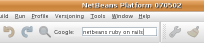

Когда пользователь нажимает клавишу Enter в форме, показанной выше, открывается стандартный обозреватель среды IDE, и текст с панели инструментов передается в средство поиска Google, результаты которого выдаются в открытом обозревателе. При создании этой панели инструментов используются  link:http://bits.netbeans.org/dev/javadoc/[интерфейсы API NetBeans], позволяющие расширить набор функциональных возможностей среды IDE. В частности, создается действие, вызываемое при нажатии кнопки на панели инструментов. Затем создается панель JPanel платформы Swing, содержащая компоненты графического интерфейса  ``JLabel``  и  ``JTextField`` . Наконец, создается реализация  link:http://bits.netbeans.org/dev/javadoc/org-openide-util/org/openide/util/actions/Presenter.Toolbar.html[ ``Presenter.Toolbar`` ], возвращающая панель JPanel, которая отображается на панели инструментов вместо кнопки.  

== Настройка проекта модуля

При разработке модуля необходимо обеспечить правильную настройку структуры проектов. В среде IDE NetBeans предоставляется мастер создания проекта модуля, который позволяет настроить все базовые файлы, требуемые для создания модуля.

[start=1]
1. Выберите команду "File > New Project" (Ctrl+Shift+N). В разделе "Categories" выберите параметр "NetBeans Modules". В области "Проекты" выберите "Модуль". Нажмите кнопку "Далее".

[start=2]
1. На панели "Имя и расположение" в поле "Имя проекта" введите  ``GoogleToolbar`` . В поле "Расположение проекта" укажите любой каталог на компьютере. Оставьте параметр "Отдельный модуль" выбранным и не снимайте флажок "Установить как главный проект". Нажмите кнопку "Далее".

[start=3]
1. На панели "Основные настройки модуля" введите  ``org.myorg.googletoolbar``  в поле "Основа кодового имени".

[start=4]
1. Выберите параметр "Создать слой XML". Не изменяйте местоположения локализуемого файла ресурсов и файла слоя XML, которые должны храниться в пакете с именем  ``org/myorg/googletoolbar`` . Нажмите кнопку "Готово".

В среде IDE создается проект  ``GoogleToolbar`` . Проект содержит все исходные файлы и метаданные проекта, например, сценарий сборки проекта Ant. Проект откроется в среде IDE. Логическую структуру проекта можно просмотреть в окне "Проекты" (Ctrl+1), а структуру его файлов – в окне "Файлы" (Ctrl+2).

Разверните узел "Важные файлы", где можно открыть манифест модуля следующего содержания:

[source,java]
----

Manifest-Version: 1.0
OpenIDE-Module: org.myorg.googletoolbar
OpenIDE-Module-Layer: org/myorg/googletoolbar/layer.xml
OpenIDE-Module-Localizing-Bundle: org/myorg/googletoolbar/Bundle.properties
OpenIDE-Module-Specification-Version: 1.0
----

С подробными данными об этих ключах манифеста, специфичных для NetBeans, можно ознакомиться в описании  link:http://bits.netbeans.org/dev/javadoc/org-openide-modules/org/openide/modules/doc-files/api.html[Интерфейсы API модулей NetBeans] в документации Java. 
 

== Написание кода модуля

Для написания кода модуля необходимо выполнить следующие действия:

* <<creating-action,Создание действия>>
* <<creating-panel,Создание JPanel>>
* <<resolving-errors,Поиск и устранение ошибок>>
* <<overriding,Переопределение getToolbarPresenter()>>

=== Создание действия

[start=1]
1. Щелкните правой кнопкой мыши узел проекта и выберите "Создать > Действие" (если пункт "Действие" отсутствует в списке, перейдите к нему путем выбора "Прочее", затем в мастере создания файла выберите "Разработка модулей" в области "Категории"). Нажмите кнопку "Далее".

[start=2]
1. Оставьте значение по умолчанию на панели "Тип действия"; в результате будет создано действие, являющееся подклассом  ``ActionListener`` , как показано ниже: 
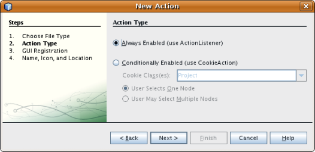 Нажмите кнопку "Далее".

[start=3]
1. На панели "Регистрация в интерфейсе" выберите в раскрывающемся списке "Категория" значение "Файл". Значение, выбранное в раскрываюшемся списке "Категория", определяет место отображения действия в редакторе сочетаний клавиш в среде IDE. Затем снимите флажок для создания глобального пункта меню и установите флажок "Глобальная кнопка панели инструментов". В раскрывающемся списке "Панель инструментов" выберите значение "Файл", затем в раскрывающемся списке "Позиция" выберите _любую позицию в раскрывающемся списке_, например, как показано ниже: 
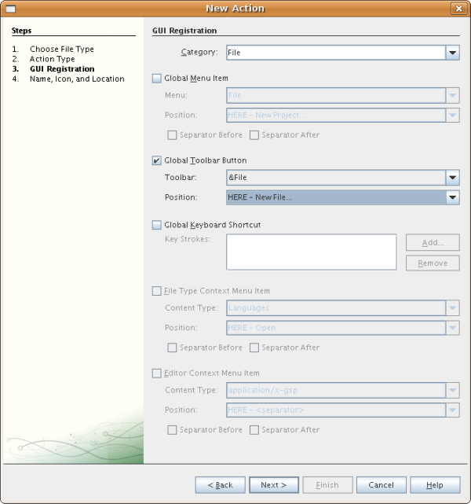 Нажмите кнопку "Далее".

[start=4]
1. 
На панели "Имя и расположение" введите  ``GoogleAction``  в качестве имени класса и  ``Google Action``  в поле "Видимое имя". Укажите значок размером 16x16 пикселей. Этот значок фактически не используется: выводиться будет форма JPanel, созданию которой посвящен следующий раздел. Однако для работы мастера создания действия требуется указать значок. Следовательно, значок может иметь любые размеры, поскольку он не будет использоваться. Нажмите кнопку "Готово".

NOTE:  К пакету  ``org.myorg.googletoolbar``  в окне "Проекты" добавляется файл  ``GoogleAction.java`` .

=== Создание JPanel

Этот раздел посвящен созданию панели JPanel, которая представляет собой панель инструментов, отображаемую как часть главной панели инструментов приложения.

[start=1]
1. Щелкните узел проекта правой кнопкой мыши и выберите команду "Создать > Прочее". В области "Категории" выберите "Формы Swing GUI". В области "Проекты" выберите "Форма JPanel". Нажмите кнопку "Далее".

[start=2]
1. На панели "Имя и расположение" введите  ``GooglePanel``  в качестве имени класса и выберите пакет в раскрывающемся списке. Нажмите кнопку "Готово".  ``GooglePanel.java``  добавляется к пакету и открывается в редакторе исходного кода в представлении "Проектирование".

[start=3]
1. Переместите курсор в нижний правый угол панели JPanel, затем выберите панель JPanel и перетащите курсор для изменения ее размера: приблизительная ширина и длина показана ниже: 
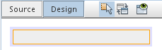

[start=4]
1. Перетащите компоненты "Текстовое поле" и "Надпись" с палитры (Ctrl+Shift+8) непосредственно на панель JPanel, затем измените размер панели JPanel и двух оставшихся компонентов до плотного смыкания. Наконец, щелкните надпись и измените ее текст на  ``Google:`` , затем удалите текст по умолчанию в текстовом поле. Итоговый вид панели JPanel показан на рисунке ниже: 
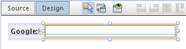

[start=5]
1. Убедитесь в том, что открыт инспектор свойств ("Окно > Навигация > Инспектор), затем щелкните правой кнопкой мыши текстовое поле и выберите в раскрывающемся меню "События > Клавиша > keyTyped". При этом к исходному коду  ``GooglePanel.java``  добавляется метод  ``jTextField1KeyTyped()`` , который открывается в редакторе исходного кода, как показано ниже: 
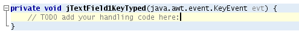

[start=6]
1. В редакторе исходного кода перейдите к представлению "Исходный код" для  ``GooglePanel.java``  и заполните метод  ``jTextField1KeyTyped()``  следующим образом (текст для вставки выделен *полужирным шрифтом*):

[source,java]
----

    
private void jTextField1KeyTyped(java.awt.event.KeyEvent evt) {
    *int i = evt.getKeyChar();
    if (i==10){//Клавиша "Enter"
        // вывод адреса URL Google
        try{
            URLDisplayer.getDefault().showURL
                    (new URL("http://www.google.com/search?hl=en&amp;q="+jTextField1.getText()+"&amp;btnG=Поиск+Google"));
        } catch (Exception eee){
            return;//nothing much to do
        }
    }*
}
----

В случае необходимости щелкните в редакторе исходного кода правой кнопкой мыши и выберите "Формат" (Alt+Shift+F).

=== Поиск и устранение ошибок

Обратите внимание, что одна из строк кода выделена красным подчеркиванием, что указывает на наличие ошибок. Причина в том, что требуемые пакеты еще не импортированы. Наведите указатель мыши на значок лампочки в столбце слева от красной линии для  ``URLDisplayer`` . Выводится всплывающая подсказка, указывающая причину ошибки: 

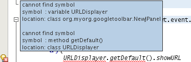

Для решения этой проблемы необходимо обеспечить доступность для проекта класса  `` link:http://bits.netbeans.org/dev/javadoc/org-openide-awt/org/openide/awt/HtmlBrowser.URLDisplayer.html[HtmlBrowser.URLDisplayer]`` , входящего в пакет  link:http://bits.netbeans.org/dev/javadoc/org-openide-awt/org/openide/awt/package-summary.html[  ``org.openide.awt`` ]. Для этого необходимо выполнить следующие действия:

[start=1]
1. Щелкните правой кнопкой мыши узел проекта в окне "Projects" и выберите "Properties". В диалоговом окне "Свойства проекта" выберите узел "Библиотеки" под заголовком "Категории". Затем нажмите кнопку "Добавить" в разделе "Зависимости модуля". Откроется диалоговое окно "Добавить зависимость модуля".

[start=2]
1. В текстовом поле "Фильтр" в верхней части диалогового окна "Добавить зависимость модуля" начните ввод  `` link:http://bits.netbeans.org/dev/javadoc/org-openide-awt/org/openide/awt/HtmlBrowser.URLDisplayer.html[URLDisplayer]``  и обратите внимание, что выборка возвращаемых модулей сужается, пока в списке не останется только  link:http://bits.netbeans.org/dev/javadoc/org-openide-awt/overview-summary.html[API утилит интерфейса]: 
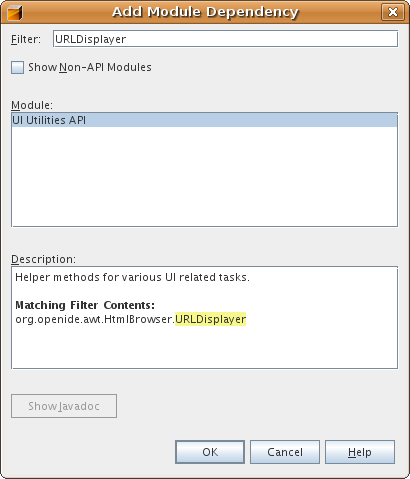 Нажмите кнопку "OK", а затем снова нажмите кнопку "OK" для закрытия диалогового окна "Свойства проекта".

[start=3]
1. Щелкните правой кнопкой мыши редактор исходного кода и выберите "Исправить выражения импорта" (Alt+Shift+F). Открывается диалоговое окно "Исправление всех операторов импорта" со списком предлагаемых путей к неопознанным классам: 
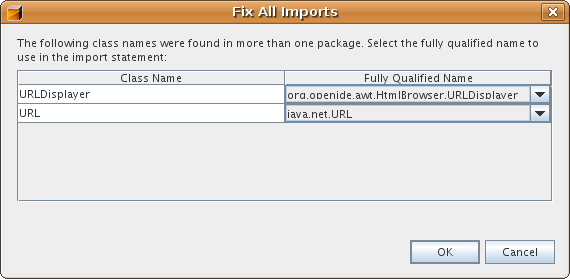 Нажмите кнопку "OK". Для  ``GooglePanel.java``  создаются следующие выражения импорта:

[source,java]
----

import java.net.URL;
import  link:http://bits.netbeans.org/dev/javadoc/org-openide-awt/org/openide/awt/HtmlBrowser.URLDisplayer.html[org.openide.awt.HtmlBrowser.URLDisplayer];
            
----

Также обратите внимание на исчезновение ошибок в редакторе исходного кода.

=== Реализация Presenter.Toolbar

Поскольку панель инструментов Google фактически отображается на только что созданной панели JPanel, необходимо создать реализацию  `` link:http://bits.netbeans.org/dev/javadoc/org-openide-util/org/openide/util/actions/Presenter.Toolbar.html[Presenter.Toolbar]``  для вывода на панели инструментов. Выполните следующие действия в файле  ``GoogleAction.java`` :

[start=1]
1. Откройте файл  ``GoogleAction.java``  и обратите внимание на следующий текст:

[source,java]
----

    
package org.myorg.googletoolbar;

import java.awt.event.ActionEvent;
import java.awt.event.ActionListener;

public final class GoogleAction implements ActionListener {

    public void actionPerformed(ActionEvent e) {
        // TODO реализация тела действия
    }
    
}
----

[start=2]
1. Измените сигнатуру таким образом, добавив реализацию  `` link:http://bits.netbeans.org/dev/javadoc/org-openide-util/org/openide/util/actions/Presenter.Toolbar.html[Presenter.Toolbar]`` , поскольку действие также должно быть представлено на панели инструментов.

[source,java]
----

package org.myorg.googletoolbar;

import java.awt.event.ActionEvent;
import java.awt.event.ActionListener;

public final class GoogleAction implements Presenter.Toolbar, ActionListener {

    Component comp  = new GooglePanel();

    @Override
    public void actionPerformed(ActionEvent e) {
        // TODO Реализация тела метода
    }

    @Override
    public Component getToolbarPresenter() {
        return comp;
    }

}
----

[start=3]
1. Откройте файл  ``layer.xml`` : в нем должен содержаться следующий текст:

[source,xml]
----

    
<?xml version="1.0" encoding="UTF-8"?>
<!DOCTYPE filesystem PUBLIC "-//NetBeans//DTD Filesystem 1.2//EN" "https://netbeans.org/dtds/filesystem-1_2.dtd">
<filesystem>
    <folder name="Actions">
        <folder name="File">
            <file name="org-myorg-googletoolbar-GoogleAction.instance">
                <attr name="SystemFileSystem.localizingBundle" stringvalue="org.myorg.googletoolbar.Bundle"/>
                <attr name="delegate" newvalue="org.myorg.googletoolbar.GoogleAction"/>
                <attr name="displayName" bundlevalue="org.myorg.googletoolbar.Bundle#CTL_GoogleAction"/>
                <attr name="iconBase" stringvalue="org/myorg/googletoolbar/icon.png"/>
                <attr name="instanceCreate" methodvalue="org.openide.awt.Actions.alwaysEnabled"/>
                <attr name="noIconInMenu" stringvalue="false"/>
            </file>
        </folder>
    </folder>
    <folder name="Toolbars">
        <folder name="File">
            <file name="org-myorg-googletoolbar-GoogleAction.shadow">
                <attr name="originalFile" stringvalue="Actions/File/org-myorg-googletoolbar-GoogleAction.instance"/>
                <attr name="position" intvalue="0"/>
            </file>
        </folder>
    </folder>
</filesystem>
----

[start=4]
1. Текст, приведенный выше, создан мастером создания действия. Удалите атрибут "instanceCreate", поскольку в данном случае создание экземпляра класса действия не требуется. Напомним, что в данном случае требуется использовать панель JPanel.

В этом разделе была создана панель JPanel, на которой выводится текстовое поле и надпись. При нажатии кнопки "Enter" в текстовом поле его содержание передается в средство поиска Google. Открывается обозреватель HTML, в котором выводятся результаты поиска Google. Класс действия служит для интеграции панели в панель инструментов приложения в соответствии с регистрационными данными в файле  ``layer.xml`` .

== Компиляция, установка и использование модуля

Для компиляции и установки модуля в среде IDE NetBeans используется сценарий построения Ant. Сценарий построения создается автоматически при создании проекта модуля, описанном в разделе <<creating-module-project,Настройка проекта модуля>>. Теперь модуль готов к компиляции и добавлению к среде IDE, для чего можно воспользоваться поддержкой Ant в среде NetBeans:

[start=1]
1. В окне "Проекты" щелкните правой кнопкой мыши узел проекта  ``Google Toolbar``  и выберите "Выполнить". Модуль будет построен и установлен в новом экземпляре среды IDE (т.е. в целевой платформе для модулей). По умолчанию целевой платформой является версия среды IDE, в которой выполняется работа в текущий момент. Oткроется целевая платформа для тестирования нового модуля.

[start=2]
1. После успешной установки модулем будет добавлена новая кнопка к панели инструментов среды IDE.

*Примечание.* Значок на кнопке панели инструментов не отображается. Вместо значка выводится панель JPanel, созданная в разделе <<creating-panel,Создание JPanel>>: 

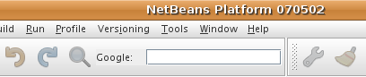

[start=3]
1. Введите строку поиска в текстовое поле: 

[start=4]
1. Нажмите клавишу Enter. В среде IDE запускается обозреватель по умолчанию, если он задан в окне "Параметры". Адрес URL Google и строка поиска передаются в обозреватель, и выполняется поиск. Полученные результаты поиска можно просмотреть в обозревателе.

== Разрешение совместного использования модуля

Работающий модуль расширения среды IDE создан, и теперь его можно предоставить другим разработчикам для совместного использования. В среде IDE NetBeans предусмотрен простой способ создания бинарного файла модуля NetBeans (.nbm), который используется в качестве универсального средства предоставления другим разработчикам возможности работы с модулем в их версиях среды IDE (фактически это действие было выполнено в разделе <<compiling,Компиляция, установка и использование модуля>>).

Для создания бинарного файла модуля необходимо выполнить действия, указанные ниже.

В окне "Проекты" щелкните правой кнопкой мыши узел проекта  ``Google Toolbar``  и выберите "Создать файл распространения модуля NBM". Создается файл NBM, который можно просмотреть в окне "Файлы" (Ctrl+2). 

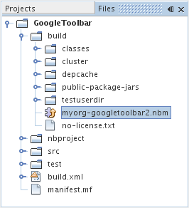 

link:http://netbeans.apache.org/community/mailing-lists.html[ Мы ждем ваших отзывов]

== Дополнительные сведения

На этом руководство по началу работы с подключаемыми модулями в среде NetBeans закончено. В этом документе было описано создание подключаемого модуля, добавляющего панель инструмента поиска Google к среде IDE. Дополнительные сведения о создании и разработке подключаемых модулей приведены в следующих ресурсах:

*  link:https://netbeans.apache.org/kb/docs/platform_ru.html[Учебная карта по платформе NetBeans]

*  link:http://bits.netbeans.org/dev/javadoc/[Документация Javadoc по интерфейсам API в среде NetBeans]

* В этом руководстве использовались следующие классы интерфейса API NetBeans:
*  `` link:http://bits.netbeans.org/dev/javadoc/org-openide-awt/org/openide/awt/HtmlBrowser.URLDisplayer.html[HtmlBrowser.URLDisplayer]`` 
*  `` link:http://bits.netbeans.org/dev/javadoc/org-openide-util/org/openide/util/actions/Presenter.Toolbar.html[Presenter.Toolbar]`` 
