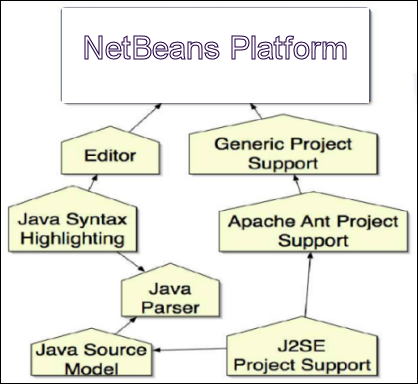
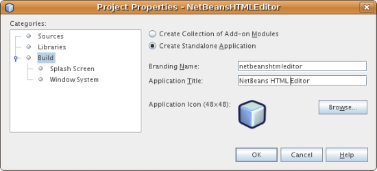
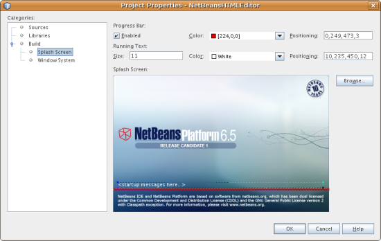
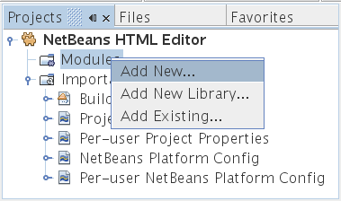
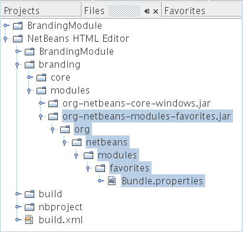
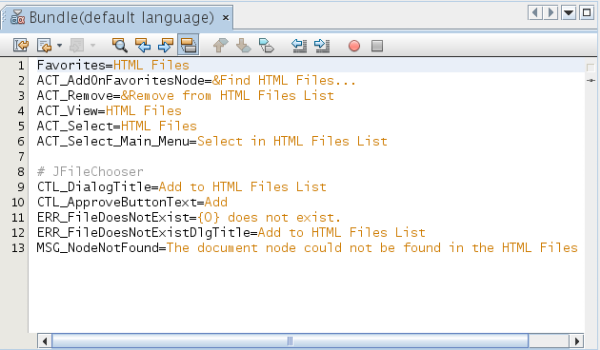
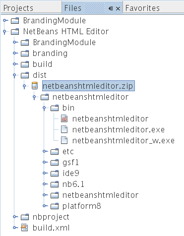

// 
//     Licensed to the Apache Software Foundation (ASF) under one
//     or more contributor license agreements.  See the NOTICE file
//     distributed with this work for additional information
//     regarding copyright ownership.  The ASF licenses this file
//     to you under the Apache License, Version 2.0 (the
//     "License"); you may not use this file except in compliance
//     with the License.  You may obtain a copy of the License at
// 
//       http://www.apache.org/licenses/LICENSE-2.0
// 
//     Unless required by applicable law or agreed to in writing,
//     software distributed under the License is distributed on an
//     "AS IS" BASIS, WITHOUT WARRANTIES OR CONDITIONS OF ANY
//     KIND, either express or implied.  See the License for the
//     specific language governing permissions and limitations
//     under the License.
//

= Руководство по началу работы с платформой NetBeans
:jbake-type: platform_tutorial
:jbake-tags: tutorials 
:jbake-status: published
:syntax: true
:source-highlighter: pygments
:toc: left
:toc-title:
:icons: font
:experimental:
:description: Руководство по началу работы с платформой NetBeans - Apache NetBeans
:keywords: Apache NetBeans Platform, Platform Tutorials, Руководство по началу работы с платформой NetBeans

В этом документе представлена простая процедура быстрого знакомства с процессом работы с платформой NetBeans на примере создания простого редактора HTML. Несмотря на свою простоту, создаваемый редактор HTML оказывается весьма развитым, поскольку в нем повторно используется инфраструктура, предоставляемая платформой NetBeans. Например, без написания какого-либо кода в редакторе HTML реализуется развитая система управления окнами. Ознакомление с этим руководством даст общие знания о создании, построении и выполнении приложений на основе платформы NetBeans.

После изучения этого руководства можно перейти к  link:https://netbeans.apache.org/kb/docs/platform_ru.html[учебной карте по платформе NetBeans]. В этой учебной карте содержатся полные руководства, в которых подробно рассмотрен широкий спектр интерфейсов API NetBeans для приложений различных типов. Если процедура создания простейшего приложения "Hello World" читателю уже знакома, можно пропустить это руководство и перейти сразу к учебной карте.

NOTE: В этом документе представлена среда IDE NetBeans версии 6.7. Если установлена более ранняя версия, см  link:61/nbm-htmleditor.html[версию 6.1 этого документа]. Если это первый опыт читателя по работе с платформой NetBeans, рекомендуется перед чтения следующих разделов изучить  link:nbm-quick-start_ru.html[Руководство по началу работы с платформой NetBeans ]. Если же требуется изучить не создание приложения на основе платформы NetBeans, а подключаемый модуль NetBeans, см. руководство  link:nbm-google_ru.html[Начало работы с подключаемыми модулями в среде NetBeans].

Дополнительно, в целях поиска и устранения ошибок, можно  link:http://plugins.netbeans.org/PluginPortal/faces/PluginDetailPage.jsp?pluginid=6635[загрузить готовый пример] и изучить исходный код.

По завершении изучения этого руководства будет создан редактор HTML, который выглядит следующим образом:

image::images/htmleditor_html-editor-65.png[]

NOTE:  Это очень простое демонстрационное приложение, но вовсе не игрушка! Это _настоящая_ программа, поддерживающая простое редактирование страниц HTML, с такими возможностями, как автозавершение кода, проверка допустимости и предварительно определенные фрагменты HTML.

Создаваемый в этом руководстве редактор HTML является функционально насыщенным клиентским приложением на базе платформы NetBeans. Это означает, что основой этого приложения будет ядро среды IDE, которым и _является_ платформа NetBeans. Поверх платформы NetBeans добавляются необходимые модули и исключаются те, которые нужны для среды IDE, но не требуются для данного приложения. Здесь показаны некоторые из модулей среды IDE, добавленных к платформе NetBeans, которые являются ее основой:

Создание этого редактора HTML подразумевает создание скелета приложения, исключение ненужных модулей и элементов интерфейса пользователя, а затем настройку окна "Избранное", которое должно открываться по умолчанию при запуске среды IDE. Все эти действия поддерживаются элементами интерфейса пользователя в среде IDE.

Пользователь сможет лично убедиться в том, как легко и просто построить или, точнее, _собрать_ полнофункциональное приложение на платформе NetBeans.. В конце этого документа показано, как с помощью WebStart сделать конечный продукт легко загружаемым и запускаемым.

NOTE:  Хотя платформа NetBeans является самостоятельным продуктом, в рамках этого руководства ее не требуется загружать отдельно. Разработка функционально насыщенного приложения выполняется в среде IDE, после чего из приложения исключаются модули, специфичные для среды IDE, но излишние в данном приложении.

== Создание скелета приложения

При создании приложения на базе платформы NetBeans самым первым действием должно стать создание проекта приложения на платформе NetBeans. По умолчанию проект приложения платформы NetBeans имеет в своем составе _все_ модули в составе платформы NetBeans, а также _все_ модули, входящие в среду IDE NetBeans. Поскольку некоторые из этих модулей нам не требуются, их следует исключить.

[start=1]
1. С помощью мастера создания проекта (Ctrl+Shift+N) создайте проект приложения на платформе NetBeans из шаблона в категории "Модули NetBeans", как показано ниже:

Нажмите кнопку "Next" и присвойте проекту приложения на платформе NetBeans имя "NetBeansHTMLEditor". Нажмите кнопку "Готово".

[start=2]
1. Щелкните правой кнопкой мыши узел проекта, выберите "Свойства" и затем внесите некоторые изменения в диалоговом окне "Свойства проекта" приложения.

* На панели "Построение" убедитесь в том, что переключатель установлен в положение "Создать отдельное приложение", т.е. создаваемый проект должен быть функционально насыщенным клиенским приложением на основе платформы NetBeans.

Убедитесь, что используется подходящее название исполняемого файла, и определите текст, который будет выводиться в строке заголовка приложения, как показано ниже:

* На панели "Заставка" обратите внимание на то, что можно установить заставку приложения и индикатор хода выполнения, как показано ниже:

NOTE:  При отсутствии собственной заставки используйте  link:images/htmleditor_splash.gif[эту] .

[start=3]
1. На панели "Библиотеки" диалогового окна "Свойства проекта" имеется список "кластеров". Кластер представляет собой ряд связанных модулей. Следует выбрать только кластеры  ``ide11``  и  ``platform11`` , как показано ниже:

Затем нажмите кнопку "Разрешить" для добавления требуемых модулей к набору модулей, на которые ссылаются модули, уже задействованные в приложении. Кнопка "Разрешить" исчезает, после чего не должно остаться ошибок, выделенных красным цветом.

Теперь создано подмножество модулей NetBeans, относящихся к редактору HTML. Однако несмотря на то, что все оставшиеся модули действительно необходимы, скорее всего нам не потребуются связанные с ними элементы интерфейса пользователя. В следующих разделах мы настроим интерфейс пользователя и размещение элементов окна специально для создаваемого редактора HTML.

== Настройка пользовательского интерфейса

В интерфейсе пользователя можно оставить столько функций, сколько позволяют выбранные модули. Например, в редакторе HTML возможно, не будут использоваться некоторые или все пункты меню "Сервис". Также весьма вероятно, что имеются панели инструментов или кнопки на панелях инструментов, без которых можно обойтись. В этом разделе будет настраиваться интерфейс пользователя среды IDE до тех пор, пока не останется набор функций, полностью отвечающий требованиям функционально насыщенного клиентского приложения.

[start=1]
1. Разверните проект приложения на платформе NetBeans, щелкните правой кнопкой мыши узел "Модули" и выберите "Добавить", как показано ниже:

Откроется мастер создания проекта (Ctrl+Shift+N). Присвойте проекту имя  ``BrandingModule``  и нажмите кнопку "Далее".

[start=2]
1. В поле "Основа кодового имени" введите  ``org.netbeans.brandingmodule`` .

[start=3]
1. Нажмите кнопку "Создать слой XML", а затем нажмите кнопку "Готово".

[start=4]
1. В модуле брэндинга разверните узел  ``layer.xml`` . Появятся два подузла:

[start=5]
1. В узле  ``<этот слой в контексте>``  представлены все папки и файлы, зарегистрированные всеми модулями на своих уровнях. Для исключения отдельных элементов щелкните их правой кнопкой мыши и выберите "Удалить", как показано ниже:

Затем в среде IDE будут добавлены теги к файлу  ``layer.xml``  модуля, в котором после установки модуля удаленные элементы будут скрыты. Например, щелкнув правой кнопкой мыши в области  ``строка меню/Правка`` , можно удалить ненужные для редактора HTML пункты из меню "Правка". В результате в файле  ``layer.xml``  будут созданы, например, следующие фрагменты:

[source,xml]
----

<folder name="Menu">
    <folder name="Edit">
        <file name="org-netbeans-modules-editor-MainMenuAction$StartMacroRecordingAction.instance_hidden"/>
        <file name="org-netbeans-modules-editor-MainMenuAction$StopMacroRecordingAction.instance_hidden"/>
    </folder>       
</folder>
----

Результатом приведенного выше фрагмента является удаление функций  ``Начать запись макроса``  и  ``Завершить запись макроса`` , обеспечиваемых другим модулем, из меню модулем брэндинга. Чтобы снова вывести их на экран, просто удалите вышеперечисленные теги из файла  ``layer.xml``  .

[start=6]
1. С помощью вышеописанного метода скройте необходимое количество панелей инструментов, кнопок панели инструментов, меню и пунктов меню. По завершении обратитесь к файлу  ``layer.xml`` . Общий вид должен соответствовать приведенному ниже, в зависимости от удаленных элементов:

[source,xml]
----

<?xml version="1.0" encoding="UTF-8"?>
<!DOCTYPE filesystem PUBLIC "-//NetBeans//DTD Filesystem 1.1//EN" "https://netbeans.org/dtds/filesystem-1_1.dtd">
<filesystem>
    <folder name="Menu">
        <file name="BuildProject_hidden"/>
        <folder name="File">
            <file name="Separator2.instance_hidden"/>
            <file name="SeparatorNew.instance_hidden"/>
            <file name="SeparatorOpen.instance_hidden"/>
            <file name="org-netbeans-modules-project-ui-CloseProject.shadow_hidden"/>
            <file name="org-netbeans-modules-project-ui-CustomizeProject.shadow_hidden"/>
            <file name="org-netbeans-modules-project-ui-NewFile.shadow_hidden"/>
            <file name="org-netbeans-modules-project-ui-NewProject.shadow_hidden"/>
            <file name="org-netbeans-modules-project-ui-OpenProject.shadow_hidden"/>
            <file name="org-netbeans-modules-project-ui-RecentProjects.shadow_hidden"/>
            <file name="org-netbeans-modules-project-ui-SetMainProject.shadow_hidden"/>
            <file name="org-netbeans-modules-project-ui-groups-GroupsMenu.shadow_hidden"/>
        </folder>
        <file name="Refactoring_hidden"/>
        <file name="RunProject_hidden"/>
        <folder name="Window">
            <file name="ViewRuntimeTabAction.shadow_hidden"/>
            <file name="org-netbeans-modules-project-ui-logical-tab-action.shadow_hidden"/>
            <file name="org-netbeans-modules-project-ui-physical-tab-action.shadow_hidden"/>
        </folder>
    </folder>
</filesystem>
----

== Настройка схемы расположения окон

С помощью узла  ``<этот слой в контексте>``  можно не только удалять существующие элементы, но и изменять их содержимое. Например, этот редактор HTML работает с файлами HTML, поэтому в отличие от стандартной среды IDE, которая работает и с исходными файлами, и с проектами Java, здесь в исходной схеме размещения целесообразно отображать окно  ``Избранное`` .

Схема размещения элементов окна также описывается в виде файлов на уровнях, хранящихся в папке  ``Windows2`` . Файлы в папке  ``Windows2``  представляют собой "псевдочитаемые" файлы XML, определяемые  link:http://bits.netbeans.org/dev/javadoc/org-openide-windows/org/openide/windows/doc-files/api.html[интерфейсами API оконной системы]. Они довольно сложны для понимания, однако для целей создания редактора HTML не обязательно изучать их полностью (см. ниже).

[start=1]
1. В узле модуля брэндинга  ``<этот слой в контексте>``  найдите два файла, выделенные ниже, в  ``Windows2/Компоненты``  и  ``Windows2/Режимы`` . Эти файлы нызываются "favorites.settings" и "favorites.wstcref":

Первый файл определяет, как будет выглядеть элемент и как он создается. Поскольку эти параметры изменять не нужно, вносить изменения в файл не требуется. Второй файл более интересен для наших целей, так как он содержит следующее:

[source,xml]
----

<tc-ref version="2.0">
    <module name="org.netbeans.modules.favorites/1" spec="1.1" />
    <tc-id id="favorites" />
    <state opened="false" />
</tc-ref>
----

[start=2]
1. Несмотря на то, что большая часть файла XML представляется непонятной, по крайней мере одна строка выглядит многообещающе – даже без чтения какой-либо документации очевидно, что путем замены  ``false``  на  ``true``  можно сделать этот элемент открывающимся по умолчанию. Попробуйте сделать это.

[start=3]
1. Аналогичным образом можно изменить файл  ``CommonPalette.wstcref``  для открытия панели компонентов по умолчанию.

Теперь модуль брэндинга должен содержать несколько новых файлов, по одному для каждого из измененных файлов. Фактически эти файлы заменяют собой те, что были найдены на предыдущих этапах. Они были автоматически зарегистрированы в файле  ``layer.xml``  модуля.

== Настройка окна "Избранное"

В подпапках папки  ``branding``  проекта приложения на платформе NetBeans, отображенных в окне "Файлы", можно заменить строки, определенные в исходных файлах NetBeans. В этом разделе будут заменены те строки, которые описывают метки, используемые в окне "Избранное". Например, изменим заголовок окна "Избранное" на "Файлы HTML", поскольку это окно предназначено именно для файлов HTML.

[start=1]
1. Откройте окно "Файлы" и разверните папку  ``branding``  проекта приложения на платформе NetBeans.

[start=2]
1. Создайте новую структуру папок в  ``branding/modules`` . (Для создания папок в среде IDE можно щелкнуть папку правой кнопкой мыши, затем выбрать пункт раскрывающегося меню "Создать | Прочее", после чего выбрать "Папка" в категории "Прочее". Новой папке должно быть присвоено имя  ``org-netbeans-modules-favorites.jar`` . Внутри этой папки создайте иерархию папок  ``org/netbeans/modules/favorites`` . В последней папке, т.е.  ``favorites`` , создайте файл  ``Bundle.properties`` :

Эта структура папок и файл свойств соответствуют структуре в исходных файлах NetBeans, которая связана с окном "Избранное".

[start=3]
1. Добавьте строки, показанные ниже на рисунке, для замены таких же строк, определенных в соответствующем файле свойств в исходных файлах окна "Избранное":

Для упрощения этой задачи скопируйте вышеуказанные строки и вставьте их:

[source,java]
----

Favorites=Файлы HTML
ACT_AddOnFavoritesNode=&amp;Найти файлы HTML...
ACT_Remove=&amp;Remove from HTML Files List
ACT_View=Файлы HTML
ACT_Select=Файлы HTML
ACT_Select_Main_Menu=Выбрать файлы HTML из списка

# JFileChooser
CTL_DialogTitle=Добавить к списку файлов HTML
CTL_ApproveButtonText=Добавить
ERR_FileDoesNotExist={0} не существует.
ERR_FileDoesNotExistDlgTitle=Добавить к списку файлов HTML
MSG_NodeNotFound=Узел документа не найден в списке файлов HTML.
----

В дальнейшем при запуске приложения обратите внимание на то, что текст и заголовки в окне "Избранное" заменены на строки, приведенные выше. Очевидно, что таким образом можно использовать компонент платформы NetBeans и адаптировать его к конкретным требованиям путем брэндинга.

== Выполнение приложения

Выполнить созданное приложение совсем не сложно – следует просто щелкнуть узел проекта правой кнопкой мыши и выбрать требуемый пункт меню.

[start=1]
1. Щелкните правой кнопкой мыши узел проекта и выберите "Очистить и построить все".

[start=2]
1. Щелкните правой кнопкой мыши узел проекта приложения и выберите "Выполнить".

[start=3]
1. После развертывания приложения можно щелкнуть правой кнопкой мыши в окне "Избранное" и выбрать папку, содержащую файлы HTML, а затем открыть файл HTML, как показано ниже:

image::images/htmleditor_html-editor-65.png[]

Итак, создан полноценный, функциональный редактор HTML, созданный без создания какого-либо нового кода на Java.

== Распространение приложения

Выберите один из двух способов распространения приложения. Если необходимо поддерживать максимально возможный контроль над приложением, то для его распространения следует выбрать способ установки по сети (JNLP). В этом случае каждый раз, когда требуется обновить приложение, это осуществляется локально, а конечные пользователи извещаются об обновлении, которое они будут получать автоматически при следующем запуске приложения через сеть. В качестве дистрибутива также может использоваться файл ZIP, содержащий данное приложение. Тогда все приложение будет доступно конечным пользователям локально. В этом случае обновления и новые компоненты будут распространяться через механизм обновления, описанный ниже.

=== Распространение редактора HTML в виде архива ZIP

Для обеспечения расширяемости приложения следует предусмотреть возможность установки пользователями модулей для расширения функциональных возможностей приложения. Для этого вместе с приложением уже поставляется диспетчер подключаемых модулей.

[start=1]
1. Выберите новый пункт меню "Подключаемые модули" и установите некоторые подключаемые модули, которые будет удобно использовать в редакторе HTML. Просмотрите материалы на  link:http://plugins.netbeans.org/PluginPortal/[Портале подключаемых модулей] и найдите несколько подходящих модулей. Конечные пользователи будут обновлять свою локальную установку приложения таким же способом.

[start=2]
1. 
Щелкните правой кнопкой мыши узел проекта приложения и выберите "Построить архив ZIP распространения".

[start=3]
1. Теперь в папке  ``dist``  (в окне "Файлы") должен отобразиться файл ZIP, который можно развернуть для просмотра его содержимого:

NOTE:  Средство запуска приложения создается в папке  ``bin`` , как показано выше.

=== Распространение редактора HTML через общедоступное хранилище для установки NetBeans по сети

Теперь вместо распространения файла ZIP подготовимся к распространению через быструю установку по сети путем точной настройки файла  ``master.jnlp``  , создаваемого при первом запуске приложения командой "Выполнить приложение JNLP". Даже в том случае, если оно работает, оно еще не готово к распространению. Следует как минимум изменить информационную часть с целью усовершенствования описаний и значков.

Еще одно изменение стандартной инфраструктуры приложения на базе JNLP касается использования общедоступного репозитария JNLP на сайте www.netbeans.org. По умолчанию приложение на базе JNLP, создаваемое для программного пакета, всегда содержит все его модули, а также все модули, от которых оно зависит. Это может быть удобно для использования во внутренней сети, но для широкого распространения в Интернете это менее практично. В случае Интернета намного удобнее, когда все приложения, создаваемые на базе платформы NetBeans, обращаются к одному репозитарию модулей NetBeans, т.к. это подразумевает, что такие модули используются совместно и не должны загружаться несколько раз.

Такое хранилище существует и для NetBeans 6.1. В нем содержатся не все существующие в среде IDE NetBeans модули, но достаточное их количество для поддержания работы приложений, не входящих в среду IDE, таких как созданный редактор HTML. Для использования этого хранилища необходимо только изменить  ``platform.properties``  путем добавления правильного адреса URL:

[source,java]
----

# совместное использование библиотек из общего репозитария на netbeans.org
# этот адрес URL предназначен для файлов JNLP версии release65:
jnlp.platform.codebase=http://bits.netbeans.org/6.5/jnlp/

----

Как только приложение будет запущено как приложение на базе JNLP, все его совместно используемые подключаемые модули будут загружены с netbeans.org и будут использоваться вместе с другими аналогичными приложениями.

link:http://netbeans.apache.org/community/mailing-lists.html[Мы ждем ваших отзывов]

== Дополнительные сведения

На этом учебный курс по созданию редактора HTML на платформе NetBeans завершен. Дополнительные сведения о создании и разработке приложений на платформе NetBeans приведены в следующих ресурсах:

*  link:https://netbeans.apache.org/kb/docs/platform_ru.html[Другие связанные руководства]

*  link:https://bits.netbeans.org/dev/javadoc/[Документация Javadoc по интерфейсам API в среде NetBeans]
