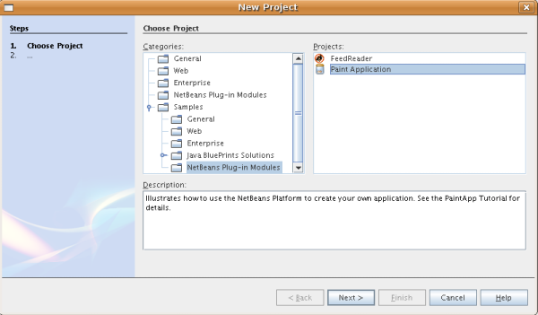
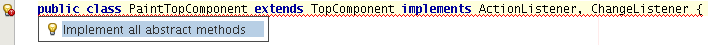
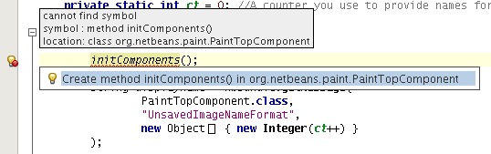
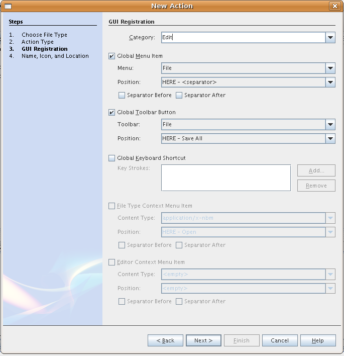

// 
//     Licensed to the Apache Software Foundation (ASF) under one
//     or more contributor license agreements.  See the NOTICE file
//     distributed with this work for additional information
//     regarding copyright ownership.  The ASF licenses this file
//     to you under the Apache License, Version 2.0 (the
//     "License"); you may not use this file except in compliance
//     with the License.  You may obtain a copy of the License at
// 
//       http://www.apache.org/licenses/LICENSE-2.0
// 
//     Unless required by applicable law or agreed to in writing,
//     software distributed under the License is distributed on an
//     "AS IS" BASIS, WITHOUT WARRANTIES OR CONDITIONS OF ANY
//     KIND, either express or implied.  See the License for the
//     specific language governing permissions and limitations
//     under the License.
//

= Tutorial do aplicativo Paint para a Plataforma NetBeans
:jbake-type: platform_tutorial
:jbake-tags: tutorials 
:jbake-status: published
:syntax: true
:source-highlighter: pygments
:toc: left
:toc-title:
:icons: font
:experimental:
:description: Tutorial do aplicativo Paint para a Plataforma NetBeans - Apache NetBeans
:keywords: Apache NetBeans Platform, Platform Tutorials, Tutorial do aplicativo Paint para a Plataforma NetBeans

Este tutorial orienta-o através dos fundamentos do uso do NetBeans IDE para desenvolver aplicativos rich-client na Plataforma NetBeans. Ao desenvolver aplicativos na Plataforma NetBeans, você está desenvolvendo no núcleo do NetBeans IDE. Todos os módulos que pertençam ao IDE e não sejam relevantes para o seu aplicativo serão excluídos, mas os úteis serão mantidos. Ao reutilizar recursos prontamente disponíveis no núcleo do IDE, você economiza tempo e energia.

*Observação:* este documento usa a versão NetBeans IDE 6.5. Se você estiver usando o NetBeans IDE 0.x, consulte  link:60/nbm-paintapp_pt_BR.html[a versão 6.0/6.1 deste documento].

== Introdução ao aplicativo Paint

Este tutorial foi concebido para começar o mais rapidamente possível. Você irá criar e instalar um aplicativo simples na Plataforma NetBeans. O aplicativo permite que o usuário pinte na tela e salve os resultados:

Esta versão inicial está longe de ser um aplicativo paint desenvolvido, mas demonstra um caso muito simples de criação de um aplicativo na Plataforma NetBeans.

*Observação:* o  link:nbm-google_pt_BR.html[Início rápido do plug-in do NetBeans] é um tutorial melhor se você quiser aprender sobre módulos do NetBeans e não sobre aplicativos rich-client.

Neste tutorial, recriaremos um aplicativo que é uma amostra fornecida com o IDE. Para ver o produto final, ou para solucionar problemas enquanto trabalhar neste tutorial, obtenha a amostra do Assistente para novo projeto, na localização mostrada abaixo:

== Configurando o aplicativo Paint

Nesta seção, você criará a estrutura do aplicativo. Você primeiro precisa criar o esqueleto de um aplicativo, o que pode ser feito através de um assistente. O aplicativo depende de uma biblioteca, assim, você também irá criar um módulo de wrapper de bibliotecas que conterá o arquivo JAR da biblioteca. Finalmente, você irá criar o módulo que conterá o código.

=== Criando o esqueleto do aplicativo

O modelo "Aplicativo da plataforma NetBeans" irá criar o esqueleto do aplicativo. O esqueleto consistirá em um conjunto de módulos que funcionam juntos para formar a base do aplicativo. Você utilizará a caixa de diálogo Propriedades do projeto para atribuir a tela inicial do aplicativo, o nome do aplicativo e o tipo e o número de módulos NetBeans que deseja usar. Você também pode se beneficiar de ações como a criação de uma distribuição ZIP e a construção de um aplicativo JNLP (Java WebStart), que são ferramentas importantes para tornar seu aplicativo disponível para os outros usuários.

[start=1]
1. Escolha Arquivo > Novo projeto. Em Categorias, selecione Módulos do NetBeans. Em Projetos, selecione Aplicativo da plataforma NetBeans:

image::images/paintapp_paintapp-proj-wiz.png[]

Clique em Próximo.

[start=2]
1. No painel Nome e local, digite  ``PaintApp``  em Nome do projeto. Altere Local do projeto para qualquer diretório no computador. Deixe marcada a caixa de verificação Definir como projeto principal. Clique em Terminar.

O novo esqueleto do aplicativo é aberto no IDE. Ele contém dois nós na janela Projetos. O primeiro nó, o nó "Módulos", é para adição manual de módulos e módulos de wrapper de bibliotecas no aplicativo. Além disso, quando você usar o assistente para Módulo ou o assistente para Módulo de wrapper de bibliotecas, o módulo que você criar poderá ser adicionado automaticamente ao aplicativo.

=== Criando o módulo de wrapper de bibliotecas

Um módulo de wrapper de bibliotecas é um módulo cujo arquivo JAR não contém código, ele apenas aponta para uma biblioteca. Ele transforma a biblioteca em um módulo do NetBeans, para que todas as proteções do sistema carregador de classes do NetBeans sejam aplicadas nele, sem modificar o arquivo JAR original. O aplicativo poderá, então, depender da biblioteca simplesmente como se ela fosse outro módulo do NetBeans. E, se novas versões da biblioteca se tornarem disponíveis, você poderá distribuí-las sem precisar distribuir nada além de um simples arquivo NBM (NetBeans Module) para o wrapper de bibliotecas.

*Observação:* um dos benefícios da construção na Plataforma NetBeans é que a interface do usuário é baseada em Swing: o kit de ferramentas padrão de interface do usuário para Java. Como o Swing tem sido usado há bastante tempo, há muitos componentes Swing que podem ser reutilizados no aplicativo. Neste tutorial, reutilize um JavaBean de seletor de cores existente (você pode encontrar a fonte para tal no NetBeans CVS em  ``contrib/coloreditor`` ). O arquivo JAR é chamado  ``ColorChooser.jar`` . É possível fazer o download da biblioteca  link:http://web.archive.org/web/20081119053233/http://colorchooser.dev.java.net/[aqui]. Salve-a em qualquer lugar no sistema de arquivos.

Faça o seguinte para criar um módulo de wrapper de bibliotecas para o arquivo  ``ColorChooser.jar`` :

[start=1]
1. Escolha Arquivo > Novo projeto. Em Categorias, selecione Módulos do NetBeans. Em Projetos, selecione Módulo de wrapper de bibliotecas e clique em Próximo.

[start=2]
1. No painel Selecionar biblioteca, para a caixa de texto Biblioteca, digite o caminho para  ``ColorChooser.jar``  ou navegue até sua localização.

[start=3]
1. Deixe o campo de texto Licença vazio. Se você pretender distribuir o produto completo, deverá incluir o arquivo de licença da biblioteca externa. Clique em Próximo.

[start=4]
1. No painel Nome e localização, preencha o nome do projeto, defina o local do projeto e certifique-se de que a lista suspensa Adicionar à suíte de módulos mostra que o módulo será adicionado ao aplicativo. Clique em Próximo.

[start=5]
1. No painel Configuração básica de módulos, digite um nome exclusivo no nome base do código, especifique um nome de exibição para o módulo e o local do pacote de localização do módulo:

Clique em Terminar.

O módulo que empacota o  ``colorchooser.jar``  selecionado é criado pelo IDE. A estrutura do novo módulo é mostrada na janela Projetos. O nó "Módulos" na estrutura do aplicativo mostra que o módulo faz parte do aplicativo.

=== Criando o módulo

Agora, você precisa de um módulo para receber o código real que você vai escrever.

[start=1]
1. Escolha Arquivo > Novo projeto. Em Categorias, selecione Módulos do NetBeans. Em Projetos, selecione Módulo e clique em Próximo.

[start=2]
1. No painel Nome e local, digite  ``Paint``  em Nome do projeto. Altere Local do projeto para qualquer diretório no computador. Certifique-se de que o botão de opção Adicionar à suíte de módulos esteja selecionado e de que o aplicativo  ``PaintApp``  esteja selecionado na lista suspensa Suíte de módulos. Selecione a caixa de verificação Definir como projeto principal. Clique em Próximo.

[start=3]
1. No painel Configuração básica de módulos, digite  ``org.netbeans.paint`` . Deixe  ``Paint``  como o Nome de exibição do módulo. Deixe o local do pacote de localização. Clique em Gerar camada XML e não altere o local sugerido, para que o pacote de localização e o arquivo de camada XML sejam armazenados em um pacote com o nome  ``org.netbeans.paint`` .

Esses destinos fazem o seguinte:

* *Pacote de localização.* Especifica as strings de linguagem específica para internacionalização.
* *Camada XML.* Registra itens como menus e botões da barra de ferramentas no aplicativo da plataforma NetBeans.

Clique em Terminar.

O IDE cria o projeto  ``Paint. ``  O projeto contém todos os metadados de projeto e fontes, como o script de construção Ant do projeto. O projeto se abre no IDE. Você pode ver a estrutura lógica na janela Projetos (Ctrl-1) e a estrutura de arquivos na janela Arquivos (Ctrl+2). Por exemplo, a janela Projetos deve ter esta aparência:

Além do pacote de localização e da camada XML, o projeto também inclui os seguintes arquivos importantes:

* *Manifesto do módulo.* Declara que o projeto é um módulo. Além disso, define algumas configurações específicas do módulo, tais como a localização da camada XML, a localização do pacote de localização e a versão do módulo.
* *Script de construção.* Fornece um local em que você pode criar seus próprios destinos Ant e substituir aqueles que são especificados em  ``nbproject/build-impl.xml`` .
* *Metadados do projeto.* Contém informações como o tipo do projeto, conteúdo, plataforma, classpath, dependências e mapeamentos entre os comandos do projeto e os destinos em scripts Ant.

Você não precisará modificar qualquer um desses arquivos durante esse tutorial.

=== Especificando as dependências do módulo

Você precisa criar subclasses de várias classes que pertencem às  link:http://bits.netbeans.org/dev/javadoc/index.html[APIs do NetBeans]. Além disso, o projeto depende do arquivo  ``ColorChooser.jar`` . Todas as APIs do NetBeans são implementadas por módulos, portanto, concluir ambas essas tarefas realmente significa adicionar alguns módulos à lista de módulos de que nosso módulo precisa para ser executado.

[start=1]
1. Na janela Projetos, clique com o botão direito do mouse no nó do projeto  ``Paint``  e escolha Propriedades. A caixa de diálogo Propriedades do projeto é aberta. Em Categorias, clique em Bibliotecas.

[start=2]
1. Para cada uma das APIs listadas na tabela abaixo, clique em "Adicionar dependência..." e, em seguida, na caixa de texto Filtro, comece digitando o nome da classe cuja subclasse deseja criar.

|===
|Classe |*API* |*Finalidade* 

| ``Seletor de cores``  | ``Seletor de cores``  |O módulo do wrapper de biblioteca do componente seletor de cores que você criou 

| ``DataObject``  | ``API de sistemas de dados``  |O módulo do NetBeans que contém a classe DataObject 

| ``DialogDisplayer``  | ``API de caixas de diálogo``  |Isso permite a criação da notificação do usuário, uma descrição da caixa de diálogo e permite que ela seja exibida 

| ``AbstractFile``  | ``API do sistema de arquivos``  |Isso fornece uma API comum para acessar os arquivos de uma maneira uniforme 

| ``AbstractNode``  | ``API de nós``  |Isso serve como o aparato principal para a visualização de objetos no NetBeans 

| ``StatusDisplayer``  | ``API de utilitários para UI``  |A classe StatusDisplayer usada para criar a barra de status na janela principal 

| ``WeakListeners``  | ``API de utilitários``  |Isso contém a classe WeakListeners 

| ``TopComponent``  | ``API do sistema de janelas``  |Isso contém a classe JPanel TopComponent 
|===

A primeira coluna na tabela acima lista todas as classes cuja subclasse você vai criar neste tutorial. Em casa caso, comece a digitar o nome da classe no filtro e veja a lista Módulo diminuir. Use a segunda coluna da tabela para selecionar a API apropriada (ou, no caso de  ``ColorChooser`` , a biblioteca) nas lista Módulo diminuída e clique em OK para confirmar a escolha:

[start=3]
1. Clique em OK para sair da caixa de diálogo Propriedades do projeto.

[start=4]
1. Na janela Projetos, expanda o nó do projeto do módulo do Paint se ele ainda não estiver expandido. Em seguida, expanda o nó Arquivos importantes e clique duas vezes no nó Metadados do projeto. Observe que as APIs selecionadas foram declaradas como dependências de módulo.

== Criando e incorporando a tela do Paint

=== Criando a tela

A próxima etapa é criar o componente real que o usuário pode pintar. Aqui, você usa um componente Swing puro - portanto, vamos ignorar os detalhes de sua implementação e fornecer apenas a versão final. O bean do seletor de cores, para o qual você criou o wrapper de biblioteca, é usado no código-fonte desse painel — quando você executar o aplicativo concluído, irá vê-lo na barra de ferramentas do painel para edição de imagens.

[start=1]
1. Na janela Projetos, expanda o nó  ``Paint`` , em seguida, expanda o nó Pacotes de códigos-fonte e clique com o botão direito do mouse no nó  ``org.netbeans.paint`` . Escolha Nova > Classe Java.

[start=2]
1. Indique  ``PaintCanvas``  como o Nome da classe. Garanta que  ``org.netbeans.paint``  esteja listado como o pacote. Clique em Terminar.  ``PaintCanvas.java``  se abre no editor de código-fonte.

[start=3]
1. Substitua o conteúdo padrão do arquivo pelo conteúdo encontrado  link:https://netbeans.apache.org/platform/guide/tutorials/paintTutorial/PaintCanvas.java[aqui]. Se você chamou o pacote de algo diferente de  ``org.netbeans.paint`` , corrija o nome do pacote no editor de código-fonte.

=== Preparando a classe TopComponent

Agora você escreverá sua primeira classe que usa as  link:http://bits.netbeans.org/dev/javadoc/index.html[APIs do NetBeans]. Trata-se de uma classe  `` link:http://bits.netbeans.org/dev/javadoc/org-openide-windows/org/openide/windows/TopComponent.html[TopComponent]`` . Uma classe  ``TopComponent``  é apenas uma classe  ``JPanel``  com a qual o sistema de janelas do NetBeans sabe se comunicar - portanto, ela pode ser colocada dentro de um contêiner com guias dentro da janela principal.

[start=1]
1. Na janela Projetos, expanda o nó  ``Paint`` , em seguida, expanda o nó Pacotes de códigos-fonte e clique com o botão direito do mouse no nó  ``org.netbeans.paint`` . Escolha Nova > Classe Java.
Indique ``PaintTopComponent`` como o Nome da classe. Garanta que ``org.netbeans.paint`` esteja listado como o pacote. Clique em Terminar. ``PaintTopComponent.java`` se abre no editor de código-fonte.

[start=2]
1. Próximo à parte superior do arquivo, altere a declaração da classe para o seguinte:

[source,java]
----

public class PaintTopComponent extends TopComponent implements ActionListener, ChangeListener {
----

[start=3]
1. Pressione Ctrl-Shift-I para corrigir as importações e clique em OK na caixa de diálogo. O IDE faz as declarações de pacote de importação necessárias na parte superior do arquivo.

Observe a linha vermelha sob a declaração da classe que você acabou de indicar. Posicione o cursor na linha e observe que uma lâmpada aparece na margem esquerda. Clique na lâmpada (ou pressione Alt-Enter), como mostrado abaixo:

Selecione Implementar todos os métodos abstratos. O IDE gera dois esqueletos de método —  ``actionPerformed()``  e  ``stateChanged()`` . Você os experimentará neste tutorial.

[start=4]
1. Adicione as três declarações de variável seguintes no início da classe  ``PaintTopComponent``  e corrija as instruções de importação (Ctrl-Shift-I).

[source,java]
----

    private PaintCanvas canvas = new PaintCanvas(); //The component the user draws on
    private JComponent preview; //A component in the toolbar that shows the paintbrush size
    private static int ct = 0; //A counter you use to provide names for new images
----

[start=5]
1. Agora você precisa implementar dois métodos padronizados. O primeiro diz ao sistema de janelas para ignorar as janelas abertas quando o aplicativo é encerrado; o segundo fornece uma string base de um ID de string único do nosso componente. Cada  ``TopComponent``  possui um ID de string único que é usado ao salvar o  ``TopComponent`` . Insira os dois métodos seguintes na classe  ``PaintTopComponent`` :

[source,java]
----

    @Override
    public int getPersistenceType() {
        return PERSISTENCE_NEVER;
    }

    @Override
    public String preferredID() {
        return "Image";
    }
----

A classe agora deve ter esta aparência:

[source,java]
----

public class PaintTopComponent extends TopComponent implements ActionListener, ChangeListener {
    
    private PaintCanvas canvas = new PaintCanvas(); //The component the user draws on
    private JComponent preview; //A component in the toolbar that shows the paintbrush size
    private static int ct = 0; //A counter you use to provide names for new images
    
    public PaintTopComponent() {
    }
    
    @Override
    public void actionPerformed(ActionEvent arg0) {
        throw new UnsupportedOperationException("Not supported yet.");
    }
    
    @Override
    public void stateChanged(ChangeEvent arg0) {
        throw new UnsupportedOperationException("Not supported yet.");
    }
    
    @Override
    public int getPersistenceType() {
        return PERSISTENCE_NEVER;
    }
    
    @Override
    public String preferredID() {
        return "Image";
    }
    
}
----

=== Inicializando a classe TopComponent

Nesta seção, adicionamos o código que inicializa a interface do usuário.

[start=1]
1. Defina o construtor e depois corrija as sentenças import (Ctrl-Shift-I):

[source,java]
----

    public PaintTopComponent() {

        initComponents();

        String displayName = NbBundle.getMessage(
                PaintTopComponent.class,
                "UnsavedImageNameFormat",
                new Object[] { new Integer(ct++) }
        );

        setDisplayName(displayName);

    }
----

O código aqui é muito simples. A primeira chamada a um método que você ainda não escreveu,  ``initComponents()`` , que adicionará uma barra de ferramentas e um PaintCanvas ao seu  ``TopComponent`` . Como você ainda não escreveu o método, uma linha vermelha aparece abaixo dele. Como antes, clique na lâmpada (ou pressione Alt-Enter) e aceite a sugestão:

O esqueleto do método  ``initComponents()``  é gerado para você.

[start=2]
1. Expanda o pacote  ``org.netbeans.paint``  na janela Projetos. Clique duas vezes no arquivo  ``Bundle.properties``  para abri-lo no editor de código-fonte. Adicionando a linha seguinte no fim:

[source,java]
----

    UnsavedImageNameFormat=Image {0}
----

Isso especifica o texto que será usado para identificar um novo arquivo de imagem no aplicativo antes de ser salvo pelo usuário. Por exemplo, quando um usuário clicar em Novo tela pela primeira vez em seu aplicativo concluído, aparecerá uma aba acima do editor de código-fonte com o rótulo, 'Image 0'. Salve o arquivo antes de continuar.

=== Preenchendo os métodos do esqueleto

Nesta seção, codificamos a interface do usuário do nosso aplicativo. Também poderíamos usar o Construtor de GUIs do IDE para criar visualmente o layout.

[start=1]
1. O método  ``initComponents()``  instala os componentes em seu painel, de forma que o usuário tenha algo com que interagir. Você gerou seu método de esqueleto durante a seção anterior na classe  ``PaintTopComponent.java`` . Preencha da seguinte forma:

[source,java]
----

    private void initComponents() {

        setLayout(new BorderLayout());
        JToolBar bar = new JToolBar();

        ColorChooser fg = new ColorChooser();
        preview = canvas.createBrushSizeView();

        //Now build our toolbar:

        //Make sure components don't get squished:
        Dimension min = new Dimension(32, 32);
        preview.setMaximumSize(min);
        fg.setPreferredSize(new Dimension(16, 16));
        fg.setMinimumSize(min);
        fg.setMaximumSize(min);

        JButton clear = new JButton(
          	    NbBundle.getMessage(PaintTopComponent.class, "LBL_Clear"));

        JLabel fore = new JLabel(
         	    NbBundle.getMessage(PaintTopComponent.class, "LBL_Foreground"));

        fg.addActionListener(this);
        clear.addActionListener(this);

        JSlider js = new JSlider();
        js.setMinimum(1);
        js.setMaximum(24);
        js.setValue(canvas.getDiam());
        js.addChangeListener(this);

        fg.setColor(canvas.getColor());

        bar.add(clear);
        bar.add(fore);
        bar.add(fg);
        JLabel bsize = new JLabel(
     	    NbBundle.getMessage(PaintTopComponent.class, "LBL_BrushSize"));

        bar.add(bsize);
        bar.add(js);
        bar.add(preview);

        JLabel spacer = new JLabel("   "); //Just a spacer so the brush preview
        //isn't stretched to the end of the
        //toolbar

        spacer.setPreferredSize(new Dimension(400, 24));
        bar.add(spacer);

        //And install the toolbar and the painting component:
        add(bar, BorderLayout.NORTH);
        add(canvas, BorderLayout.CENTER);
        
    }
----

Pressione Ctrl-Shift-I para gerar as instruções de importação necessárias.

[start=2]
1. Preencha os outros dois métodos que você gerou. Eles são usados para ouvir a classe  ``PaintTopComponent`` :

[source,java]
----

    public void actionPerformed(ActionEvent e) {

        if (e.getSource() instanceof JButton) {
           canvas.clear();
        } else if (e.getSource() instanceof ColorChooser) {
           ColorChooser cc = (ColorChooser) e.getSource();
           canvas.setPaint (cc.getColor());
        }
        
        preview.paintImmediately(0, 0, preview.getWidth(), preview.getHeight());
        
    }
----

[source,java]
----

    public void stateChanged(ChangeEvent e) {

        JSlider js = (JSlider) e.getSource();
        canvas.setDiam (js.getValue());
        preview.paintImmediately(0, 0, preview.getWidth(), preview.getHeight());
        
    }
----

[start=3]
1. No arquivo  ``Bundle.properties`` , adicione os pares chave-valor seguintes ao fim do arquivo:

[source,java]
----

    LBL_Clear = Clear
    LBL_Foreground = Foreground 
    LBL_BrushSize = Brush Size

----

Salve o arquivo antes de continuar.

=== Salvando a imagem em disco

Em seu novo aplicativo, seria uma boa idéia permitir aos usuários salvar as imagens que eles criam. Incluindo o código seguinte na classe  ``PaintTopComponent`` , essa funcionalidade será ativada.

[start=1]
1. Insira o código seguinte na classe  ``PaintTopComponent`` :

[source,java]
----

    public void save() throws IOException {

        if (getDisplayName().endsWith(".png")) {
	    doSave(new File(getDisplayName()));
        } else {
	    saveAs();
        }
        
    }
----

[source,java]
----

    public void saveAs() throws IOException {

        JFileChooser ch = new JFileChooser();
        if (ch.showSaveDialog(this) == JFileChooser.APPROVE_OPTION &amp;&amp; ch.getSelectedFile() != null) {

	    File f = ch.getSelectedFile();
            
	    if (!f.getPath().endsWith(".png")) {
	        f = new File(f.getPath() + ".png");
	    }
            
	    if (!f.exists()) {
            
	        if (!f.createNewFile()) {
		    String failMsg = NbBundle.getMessage(
		             PaintTopComponent.class,
			    "MSG_SaveFailed", new Object[] { f.getPath() }
	            );
		    JOptionPane.showMessageDialog(this, failMsg);
		    return;
	        }
                
	    } else {
	        String overwriteMsg = NbBundle.getMessage(
		    PaintTopComponent.class,
                    "MSG_Overwrite", new Object[] { f.getPath() }
	        );
                
	        if (JOptionPane.showConfirmDialog(this, overwriteMsg)
	        != JOptionPane.OK_OPTION) {
		    return;
	        }
                
	    }
            
	    doSave(f);
            
        }
        
    }
----

[source,java]
----

    private void doSave(File f) throws IOException {

        BufferedImage img = canvas.getImage();
        ImageIO.write(img, "png", f);
        String statusMsg = NbBundle.getMessage(PaintTopComponent.class,
            "MSG_Saved", new Object[] { f.getPath() });
        StatusDisplayer.getDefault().setStatusText(statusMsg);
        setDisplayName(f.getName());
        
    }
----

[start=2]
1. Adicione as linhas seguintes ao arquivo  ``Bundle.properties`` :

[source,java]
----

    MSG_SaveFailed = Could not write to file {0}
    MSG_Overwrite = {0} exists.  Sobrescrever?    MSG_Saved = Saved image to {0}
----

Salve o arquivo antes de continuar.

[start=3]
1. Clique em Ctrl-Shift-I para corrigir as instruções de importação. Você observará que haverá dois nomes totalmente classificados para a classe  ``File`` . Escolha a opção  ``java.io.File`` .

== Criando o item de menu Nova tela

Use os modelos de arquivo de desenvolvimento de módulo para criar a base da funcionalidade do método. Quando você um modelo de arquivo, o IDE registra o item que você cria no arquivo  ``layer.xml`` . Depois de usar um assistente para criar o arquivo de modelo, use as  link:https://bits.netbeans.org/dev/javadoc/[APIs do NetBeans] para continuar a desenvolver o módulo.

[start=1]
1. Na janela Projetos, clique com o botão direito do mouse no nó do projeto do módulo Paint e escolha Novo > Outro. No assistente para Novo arquivo, escolha Desenvolvimento de módulo em Categorias e Ação em Tipos de arquivo. Clique em Próximo.

[start=2]
1. No painel Tipo de ação, aceite os padrões. Clique em Próximo.

[start=3]
1. No painel Registro de GUI, selecione Item de menu global e selecione Barra de ferramentas global. Defina os seguintes valores:

* *Categoria:* Editar
* *Menu:* Arquivo
* *Posição:* Qualquer lugar que você desejar!
* *Barra de ferramentas:* Arquivo
* *Posição:* Qualquer lugar que você desejar!

*Observação:* O local em que você posiciona a ação não é importante, desde que ela esteja no menu Arquivo e na barra de ferramentas Arquivo.

Agora você deve ver o seguinte:

Clique em Próximo.

[start=4]
1. No painel Nome, ícone e localização, digite  ``NewCanvasAction``  em Nome da classe e digite  ``Nova tela``  em Nome de exibição.

Em Ícone, navegue até este ícone (clique com o botão direito do mouse aqui e em, seguida, salve-o na pasta  ``org.netbeans.paint`` ): 

[start=5]
1. Clique em Terminar.

O IDE cria  ``NewCanvasAction.java``  em  ``org.netbeans.paint``  e abre-o no editor de código-fonte. Isto é o que você deve ver:

[source,java]
----

/*
 * To change this template, choose Tools | Templates
 * and open the template in the editor.
 */
package org.netbeans.paint;

import java.awt.event.ActionEvent;
import java.awt.event.ActionListener;

public final class NewCanvasAction implements ActionListener {

    public void actionPerformed(ActionEvent e) {
        // TODO implement action body
    }
    
}
----

Como especificado no painel Registro da GUI, o IDE registra a classe da ação como um item e menu e um botão da barra de ferramentas no arquivo  ``layer.xml`` , junto com informações sobre o ícone e o nome de exibição.

[start=6]
1. No editor de código-fonte, abra  ``NewCanvasAction.java``  e preencha o método  ``actionPerformed()``  da seguinte forma:

[source,java]
----

    public void actionPerformed(ActionEvent e) {
        PaintTopComponent tc = new PaintTopComponent();
        tc.open();
        tc.requestActive();       
    }
----

O que ele faz é simplesmente criar uma nova instância do nosso componente de edição de imagem, abri-lo, de modo que ele apareça na janela principal e ativá-lo, enviando o foco do teclado para ele e selecionando sua aba.

== Criando o item de menu Salvar tela

Como na seção anterior, usamos o assistente para Novo ação para criar um item de menu, dessa vez para salvar imagens.

[start=1]
1. Na janela Projetos, clique com o botão direito do mouse no nó do projeto do módulo Paint e escolha Novo > Outro. No assistente para Novo arquivo, escolha Desenvolvimento de módulo em Categorias e Ação em Tipos de arquivo. Clique em Próximo.

[start=2]
1. No painel Tipo de ação, aceite os padrões. Clique em Próximo.

[start=3]
1. No painel Registro de GUI, selecione Item de menu global e selecione Barra de ferramentas global. Defina os seguintes valores:

* *Categoria:* Editar
* *Menu:* Arquivo
* *Posição:* Qualquer lugar que você desejar!
* *Barra de ferramentas:* Arquivo
* *Posição:* Qualquer lugar que você desejar!

*Observação:* O local em que você posiciona a ação não é importante, desde que ela esteja no menu Arquivo e na barra de ferramentas Arquivo.

Clique em Próximo.

[start=4]
1. No painel Nome, ícone e localização, digite  ``SaveCanvasAction``  em Nome da classe e digite  ``Salvar tela``  em Nome de exibição.

Em Ícone, cole esse ícone (clique com o botão direito do mouse nele aqui e salve-o na pasta  ``org.netbeans.paint`` ): 
image::images/paintapp_save_icon.png[]

[start=5]
1. Clique em Terminar.

O IDE cria  ``SaveCanvasAction.java``  em  ``org.netbeans.paint``  e abre-o no editor de código-fonte.

[start=6]
1. Altere a assinatura da classe para que  ``CallableSystemAction``  seja estendida e  ``PropertyChangeListener``  seja implementada:

[source,java]
----

public final class SaveCanvasAction extends CallableSystemAction implements PropertyChangeListener
----

[start=7]
1. No editor de código-fonte, certifique-se de que  ``SaveCanvasAction.java``  está aberto e preencha o método  ``actionPerformed()``  da seguinte forma:

[source,java]
----

    @Override
    public void actionPerformed(ActionEvent e) {
        TopComponent tc = TopComponent.getRegistry().getActivated();

        if (tc instanceof PaintTopComponent) {

            try {
                ((PaintTopComponent) tc).saveAs();
            } catch (IOException ioe) {
                ErrorManager.getDefault().notify(ioe);
            }

        } else {

            //Theoretically the active component could have changed
            //between the time the menu item or toolbar button was
            //pressed and when the action was invoked.  Not likely,
            //but theoretically possible
            Toolkit.getDefaultToolkit().beep();

        }
    }
----

Pressione Ctrl-Shift-I para gerar as instruções de importação necessárias:

image::images/paintapp_fiximports-60.png[]

[start=8]
1. Preencha os métodos da classe  ``CallableSystemAction``  da seguinte maneira:

[source,java]
----

    @Override
    public String getName() {
        return "Save Canvas";
    }

    @Override
    public HelpCtx getHelpCtx() {
        return null;
    }

----

[start=9]
1. Preencha o método  ``propertyChange()``  da classe  ``PropertyChangeListener``  da seguinte maneira:

[source,java]
----

    @Override    
    public void propertyChange(PropertyChangeEvent evt) {

        if (TopComponent.Registry.PROP_ACTIVATED.equals(evt.getPropertyName())){
	    updateEnablement();
        }
        
    }
----

Quando uma linha vermelha aparecer, clique em Alt + Enter para permitir ao IDE criar um método  ``updateEnablement()``  na classe  ``SaveCanvasAction`` .

Em seguida, defina o método  ``updateEnablement()`` :

[source,java]
----

    private void updateEnablement() {

        setEnabled(TopComponent.getRegistry().getActivated()
        instanceof PaintTopComponent);

    }
----

Finalmente, defina o construtor:

[source,java]
----

    public SaveCanvasAction() {  

        TopComponent.getRegistry().addPropertyChangeListener (
	    WeakListeners.propertyChange(this,
	    TopComponent.getRegistry()));
       
        updateEnablement();
        
    }
----

Quando uma linha vermelha aparece, clique em Alt + Enter para permitir ao IDE importar  ``org.openide.util.WeakListeners`` .

O código principal de interesse é a adição do ouvinte de alteração de propriedade.  ``TopComponent.Registry``  é um registro de todos os  ``TopComponents``  abertos no sistema — todas as abas abertas. O que queremos fazer é ouvir as alterações, e ativar e desativar a ação dependendo do que possui o foco.

*Observação:* Em vez de anexar diretamente um ouvinte de alteração de propriedade, chame  ``WeakListeners.propertyChange()`` . O que ele faz é gerar um ouvinte de alteração de propriedade que se refere ligeiramente à sua ação. Na prática, sua ação existirá enquanto o aplicativo estiver aberto, é uma boa prática e duradouro, usar um ouvinte fraco, se você estiver anexando um ouvinte e não houver código que o desanexe. Caso contrário, você terá um vazamento de memória potencial — sua ação nunca poderia ter o lixo recolhido porque o registro está mantendo uma referência a ele em sua lista de ouvintes.

Isso é o que você deve ver agora na janela Projetos:

== Empacotando

É claro que você deseja criar um aplicativo aprimorado. Assim, há algumas etapas finais que você pode realizar. Primeiro, você cria uma tela de abertura para o aplicativo e depois cria uma distribuição de ZIP e um aplicativo JNLP.

[start=1]
1. Execute o projeto  ``PaintApp`` . Depois que o aplicativo é iniciado, redimensione a tela principal de forma que fique bem pequena e desenhe uma tela de abertura. Use o botão Salvar para salvar a tela de abertura.

[start=2]
1. No projeto original, clique com o botão direito do mouse no nó  ``PaintApp`` , escolha Propriedades e, em seguida, clique em Construir na caixa de diálogo Propriedades do projeto.

[start=3]
1. Selecione Criar aplicativo independente. Agora você pode especificar um nome de marca (que será o nome do iniciador que o IDE pode gerar para você) e um título de aplicativo (que aparecerá na barra de título do aplicativo). Por padrão, você deve ver o seguinte:

[start=4]
1. Clique em Tela de abertura. Vá para a sua tela de abertura. Caso você não tenha uma, use  link:https://netbeans.apache.org/platform/images/tutorials/paintapp/splash.gif[esta]. Clique em OK para anexá-la ao seu aplicativo:

image::images/paintapp_splashscreen-60.png[]

[start=5]
1. Agora, no arquivo  ``layer.xml``  do módulo do Paint, adicione as marcas seguintes na pasta Menu. Essas marcas removem os menos Ir para e Exibir, dos quais o aplicativo Paint não precisam.

[source,java]
----

<file name="GoTo_hidden"/>
<file name="View_hidden"/>
----

Como alternativa, em vez de adicionar manualmente as marcas acima, você pode excluir as pastas no nó  ``<esta camada no contexto>``  do arquivo  ``layer.xml`` . Para fazer isso, expanda  ``<esta camada no contexto>`` , em seguida, expanda o nó Barra de menus. Escolha Excluir no menu do botão direito do mouse de ambos os nós Ir para e Exibir.

[start=6]
1. Finalmente, execute o aplicativo novamente e observe a tela de abertura. Quando o aplicativo tiver sido inicializado, observe que a barra de título exibe o título que você especificou. Além disso, existem muito menos itens de menu, botão da barra de ferramenta e outros recursos:

== Criando uma distribuição

Agora, é hora de escolher o meio de distribuição. Clique com o botão direito do mouse no nó  ``PaintApp``  e escolha Criar distribuição de ZIP para empacotar o aplicativo inteiro, com todos os módulos e arquivos necessários, como um arquivo zip. Você também pode escolher Construir aplicativo JNLP para criar uma versão JavaWebStart™ do aplicativo que você pode colocar em um serviço Web e vincular diretamente a partir de uma página da Web (você precisa definir uma URL correta — o descritor gerado usa arquivo: protocolo de forma que você possa testar localmente sua distribuição iniciável via Web).

Isso é tudo! Seu primeiro aplicativo construído sobre a Plataforma NetBeans está concluído. Próxima parada:  link:https://netbeans.apache.org/tutorials/nbm-feedreader.html[Tutorial Feed Reader da Plataforma NetBeans]. 

link:http://netbeans.apache.org/community/mailing-lists.html[Envie-nos seus comentários]

