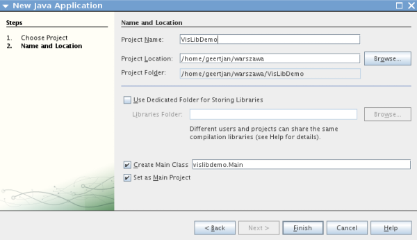
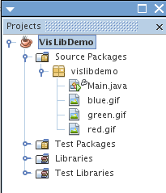
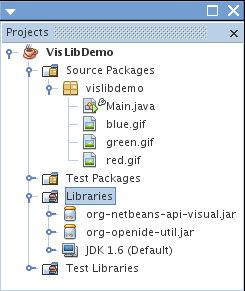
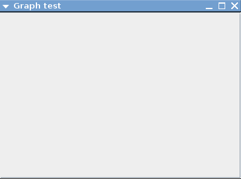
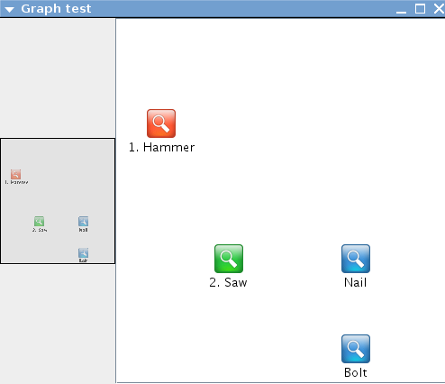

// 
//     Licensed to the Apache Software Foundation (ASF) under one
//     or more contributor license agreements.  See the NOTICE file
//     distributed with this work for additional information
//     regarding copyright ownership.  The ASF licenses this file
//     to you under the Apache License, Version 2.0 (the
//     "License"); you may not use this file except in compliance
//     with the License.  You may obtain a copy of the License at
// 
//       http://www.apache.org/licenses/LICENSE-2.0
// 
//     Unless required by applicable law or agreed to in writing,
//     software distributed under the License is distributed on an
//     "AS IS" BASIS, WITHOUT WARRANTIES OR CONDITIONS OF ANY
//     KIND, either express or implied.  See the License for the
//     specific language governing permissions and limitations
//     under the License.
//

= Tutorial da biblioteca visual do NetBeans para aplicativos Java
:jbake-type: platform_tutorial
:jbake-tags: tutorials 
:jbake-status: published
:syntax: true
:source-highlighter: pygments
:toc: left
:toc-title:
:icons: font
:experimental:
:description: Tutorial da biblioteca visual do NetBeans para aplicativos Java - Apache NetBeans
:keywords: Apache NetBeans Platform, Platform Tutorials, Tutorial da biblioteca visual do NetBeans para aplicativos Java

Neste tutorial, você aprenderá como usar os recursos principais fornecidos pela  link:http://bits.netbeans.org/dev/javadoc/org-netbeans-api-visual/overview-summary.html[API Visual Library do NetBeans].

Além disso, você usará 3 ícones no tutorial. Você pode clicar com o botão direito do mouse neles e salvá-los localmente, em seguida, copie-os para a localização do aplicativo, depois de criar o aplicativo mais tarde neste tutorial. Aqui estão os 3 ícones:

image::images/vislib_red.gif[] 
 
image::images/vislib_green.gif[]

== Configurando o aplicativo

Nesta seção, usamos o assistente para criar um aplicativo Java.

[start=1]
1. Escolha Arquivo > Novo projeto (Ctrl-Shift-N). Em Categorias, selecione Java. Em Projetos, selecione Aplicativo Java. Clique em Próximo.

[start=2]
1. No painel Nome e localização, digite  ``VisLibDemo``  no campo Nome do projeto:

Clique em Terminar.

O IDE cria o projeto  ``VisLibDemo`` . Adicione as três imagens acima ao pacote principal. O seguinte deverá ser exibido:

== Adicionando as bibliotecas

Nesta seção, adicionamos duas bibliotecas necessárias para trabalhar com a biblioteca visual.

[start=1]
1. Clique com o botão direito do mouse no nó Bibliotecas e escolha "Adicionar JAR/pasta".

[start=2]
1. Vá até o diretório de instalação do NetBeans IDE.

[start=3]
1. Em  ``platform9/lib`` , escolha  ``org-openide-util.jar`` .

[start=4]
1. Em  ``platform9/modules`` , escolha  ``org-netbeans-api-visual.jar`` .

Agora você tem os dois únicos JARs necessários. O seguinte deverá ser exibido:

== Criando o contêiner

Nesta seção, criamos o contêiner que manterá o  ``Scene``  da biblioteca visual.

[start=1]
1. Definir  ``Main.java``  da seguinte forma:

[source,java]
----

public class Main  extends JPanel {

    *//Criar o JFrame:*
    public static void main(String[] args) {
        JFrame frame = new JFrame("Graph test");
        frame.setMinimumSize(new Dimension(500, 400));
        frame.setDefaultCloseOperation(JFrame.EXIT_ON_CLOSE);
        frame.setContentPane(new Main());
        frame.pack();
        frame.setVisible(true);
    }

    public Main() {
        initComponents();
    }

    private void initComponents() {
        *//Definir o layout:*
        setLayout(new BorderLayout());
        *//Criar um JScrollPane:*
        JScrollPane scrollPane = new JScrollPane();
        *//Adicionar o JScrollPane ao JPanel:*
        add(scrollPane, BorderLayout.CENTER);
    }

}

----

[start=2]
1. Execute o aplicativo. Você deveria ver um JFrame simples:

Agora que tem um  ``JScrollPane`` , você está pronto para criar um cenário!

== Criando widgets

Nesta seção, criamos uma classe separa que contenha nosso cenário. Em seguida, vinculamos ao nosso  ``JPanel`` .

[start=1]
1. Crie uma nova classe chamada  ``GraphSceneImpl.java`` .

[start=2]
1. Deixe-a estender GraphScene<String, String>.

[start=3]
1. Use a lâmpada ao lado do IDE para adicionar instruções de importação e métodos abstratos. O seguinte deverá ser exibido:

[source,java]
----

package vislibdemo;

import org.netbeans.api.visual.graph.GraphScene;
import org.netbeans.api.visual.widget.Widget;

public class GraphSceneImpl extends GraphScene<String, String> {

    @Override
    protected Widget attachNodeWidget(String arg0) {
        throw new UnsupportedOperationException("Ainda não suportado.");
    }

    @Override
    protected Widget attachEdgeWidget(String arg0) {
        throw new UnsupportedOperationException("Ainda não suportado.");
    }

    @Override
    protected void attachEdgeSourceAnchor(String arg0, String arg1, String arg2) {
        throw new UnsupportedOperationException("Ainda não suportado.");
    }

    @Override
    protected void attachEdgeTargetAnchor(String arg0, String arg1, String arg2) {
        throw new UnsupportedOperationException("Ainda não suportado.");
    }

}

----

[start=4]
1. Usaremos três  ``LayerWidgets`` , que são como  ``JGlassPanes``  no Swing. Declare-os na parte superior da classe:

[source,java]
----

private LayerWidget mainLayer;
private LayerWidget connectionLayer;
private LayerWidget interactionLayer;

----

[start=5]
1. Crie um construtor, inicialize os  ``LayerWidgets``  e os adicione ao  ``Scene`` :

[source,java]
----

public GraphSceneImpl() {
    mainLayer = new LayerWidget(this);
    connectionLayer = new LayerWidget(this);
    interactionLayer = new LayerWidget(this);
    addChild(mainLayer);
    addChild(connectionLayer);
    addChild(interactionLayer);
}

----

[start=6]
1. Depois, defina o que acontecerá quando um novo widget for criado:

[source,java]
----

@Override
protected Widget attachNodeWidget(String arg) {
    IconNodeWidget widget = new IconNodeWidget(this);
    if (arg.startsWith("1")) {
        widget.setImage(ImageUtilities.loadImage("vislibdemo/red.gif"));
    } else if (arg.startsWith("2")) {
        widget.setImage(ImageUtilities.loadImage("vislibdemo/green.gif"));
    } else {
        widget.setImage(ImageUtilities.loadImage("vislibdemo/blue.gif"));
    }
    widget.setLabel(arg);
    mainLayer.addChild(widget);
    return widget;
}
----

O método acima é disparado sempre que  ``addNode``  for chamado no cenário.

[start=7]
1. No final do construtor, dispare o método acima quatro vezes:

[source,java]
----

Widget w1 = addNode("1. Martelo");
w1.setPreferredLocation(new Point(10, 100));
Widget w2 = addNode("2. Serra");
w2.setPreferredLocation(new Point(100, 250));
Widget w3 = addNode("Prego");
w3.setPreferredLocation(new Point(250, 250));
Widget w4 = addNode("Parafuso");
w4.setPreferredLocation(new Point(250, 350));

----

Acima, você criou quatro widgets (elementos), aprovou uma string e definiu a posição do widget. Agora, o método  ``attachNodeWidget`` , definido na etapa anterior, é disparado. O parâmetro  ``arg``  no  ``attachNodeWidget``  é a string que você aprovou para  ``addNode`` . Portanto, a string definirá o rótulo do widget. Em seguida, o widget é adicionado a  ``mainLayer`` .

[start=8]
1. De volta na classe  ``Main.java`` , adicione as linhas em negrito ao método  ``initComponents`` :

[source,java]
----

private void initComponents() {
    //Definir o layout:
    setLayout(new BorderLayout());
    //Criar um JScrollPane:
    JScrollPane scrollPane = new JScrollPane();
    //Adicionar o JScrollPane ao JPanel:
    add(scrollPane, BorderLayout.CENTER);
    *//Criar o GraphSceneImpl:
    GraphScene scene = new GraphSceneImpl();
    //Adicioná-lo ao JScrollPane:
    scrollPane.setViewportView(scene.createView());
    //Adicionar o SatellitView ao cenário:
    add(scene.createSatelliteView(), BorderLayout.WEST);*
}

----

[start=9]
1. Execute o aplicativo. Você deveria ver o seguinte:

Agora que há um cenário com alguns elementos (widgets), podemos começar a integrar algumas ações!

== Ativando ações

Nesta seção, ativamos ações nos widgets criados anteriormente.

[start=1]
1. Altere  ``attachNodeWidget``  adicionando as linhas em negrito abaixo:

[source,java]
----

@Override
protected Widget attachNodeWidget(String arg) {
    IconNodeWidget widget = new IconNodeWidget(this);
    if (arg.startsWith("1")) {
        widget.setImage(ImageUtilities.loadImage("vislibdemo/red.gif"));
    } else if (arg.startsWith("2")) {
        widget.setImage(ImageUtilities.loadImage("vislibdemo/green.gif"));
    } else {
        widget.setImage(ImageUtilities.loadImage("vislibdemo/blue.gif"));
    }
    *widget.getActions().addAction(
            ActionFactory.createAlignWithMoveAction(
            mainLayer, interactionLayer,
            ActionFactory.createDefaultAlignWithMoveDecorator()));*
    widget.setLabel(arg);
    mainLayer.addChild(widget);
    return widget;
}

----

[start=2]
1. Execute o aplicativo. Arraste um elemento e observe que os marcadores de alinhamento aparecem para ajudar o usuário a posicionar um elemento em relação aos outros elementos:

image::images/vislib_vislib-java-7.png[]

[start=3]
1. Altere a classe  ``GraphSceneImpl``  adicionando a linha abaixo ao final do construtor:

[source,java]
----

getActions().addAction(ActionFactory.createZoomAction());

----

[start=4]
1. Execute o aplicativo. Role o botão do mouse ou faça o que o seu sistema operacional requer para efetuar zoom e observe que todo o cenário diminui/aumenta de tamanho.

[start=5]
1. Adicione um  ``ConnectProvider``  personalizado ao final de  ``GraphSceneImpl`` :

[source,java]
----

private class MyConnectProvider implements ConnectProvider {

    public boolean isSourceWidget(Widget source) {
        return source instanceof IconNodeWidget &amp;&amp; source != null? true : false;
    }

    public ConnectorState isTargetWidget(Widget src, Widget trg) {
        return src != trg &amp;&amp; trg instanceof IconNodeWidget ? ConnectorState.ACCEPT : ConnectorState.REJECT;
    }

    public boolean hasCustomTargetWidgetResolver(Scene arg0) {
        return false;
    }

    public Widget resolveTargetWidget(Scene arg0, Point arg1) {
        return null;
    }

    public void createConnection(Widget source, Widget target) {
        ConnectionWidget conn = new ConnectionWidget(GraphSceneImpl.this);
        conn.setTargetAnchorShape(AnchorShape.TRIANGLE_FILLED);
        conn.setTargetAnchor(AnchorFactory.createRectangularAnchor(target));
        conn.setSourceAnchor(AnchorFactory.createRectangularAnchor(source));
        connectionLayer.addChild(conn);
    }

}

----

Vincule o  ``ConnectProvider``  personalizado ao widget da seguinte forma:

[source,java]
----

@Override
protected Widget attachNodeWidget(String arg0) {
    IconNodeWidget widget = new IconNodeWidget(this);
    if (arg0.startsWith("1")) {
        widget.setImage(ImageUtilities.loadImage("vislibdemo/red.gif"));
    } else if (arg0.startsWith("2")) {
        widget.setImage(ImageUtilities.loadImage("vislibdemo/green.gif"));
    } else {
        widget.setImage(ImageUtilities.loadImage("vislibdemo/blue.gif"));
    }
    *widget.getActions().addAction(
            ActionFactory.createExtendedConnectAction(
            connectionLayer, new MyConnectProvider()));*
    widget.getActions().addAction(
            ActionFactory.createAlignWithMoveAction(
            mainLayer, interactionLayer,
            ActionFactory.createDefaultAlignWithMoveDecorator()));
    widget.setLabel(arg0);
    mainLayer.addChild(widget);
    return widget;
}

----

[start=6]
1. Execute o aplicativo, selecione um elemento, mantenha pressionada a tecla Ctrl e arraste o mouse até outro elemento. Assim, você pode conectar os elementos uns aos outros da seguinte forma:

image::images/vislib_vislib-java-6.png[]

Agora que já tem uma ideia dos recursos que a API Visual Library oferece, consulte a seção "APIs NetBeans para visualização de dados" na  link:https://netbeans.apache.org/kb/docs/platform_pt_BR.html[Trilha do aprendizado da plataforma NetBeans].

