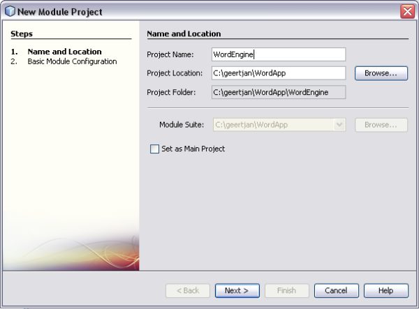
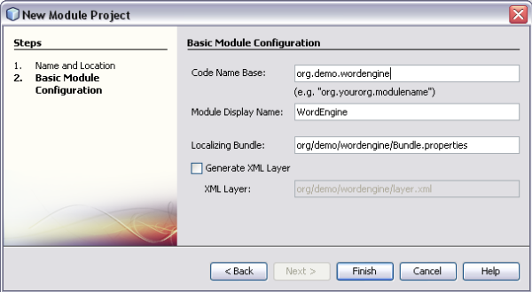
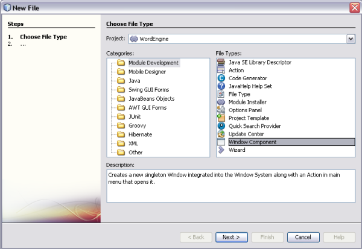
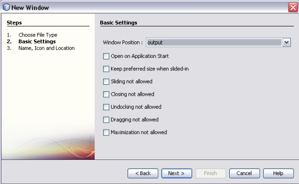
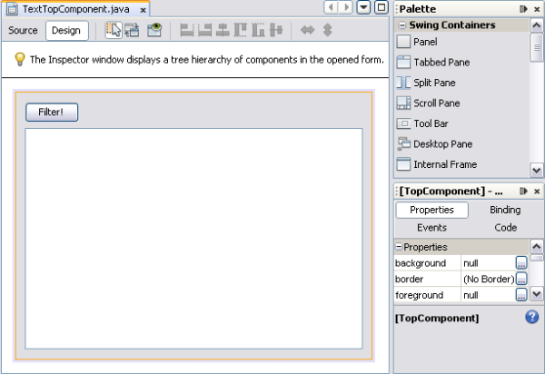
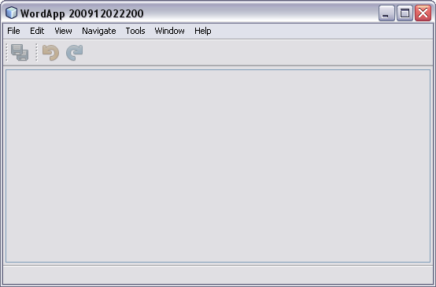
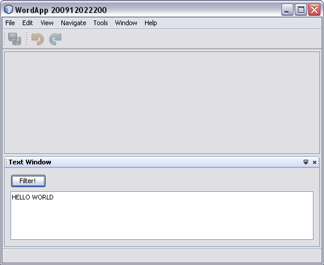
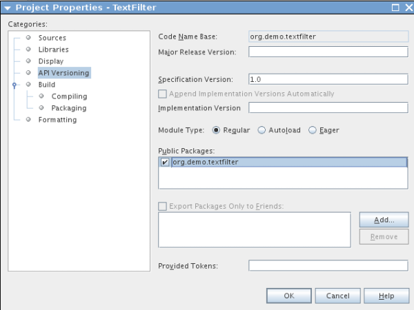
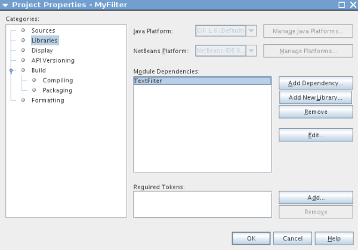
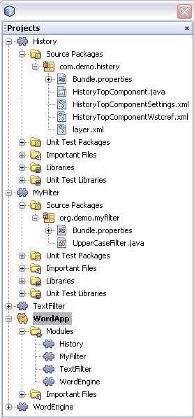

// 
//     Licensed to the Apache Software Foundation (ASF) under one
//     or more contributor license agreements.  See the NOTICE file
//     distributed with this work for additional information
//     regarding copyright ownership.  The ASF licenses this file
//     to you under the Apache License, Version 2.0 (the
//     "License"); you may not use this file except in compliance
//     with the License.  You may obtain a copy of the License at
// 
//       http://www.apache.org/licenses/LICENSE-2.0
// 
//     Unless required by applicable law or agreed to in writing,
//     software distributed under the License is distributed on an
//     "AS IS" BASIS, WITHOUT WARRANTIES OR CONDITIONS OF ANY
//     KIND, either express or implied.  See the License for the
//     specific language governing permissions and limitations
//     under the License.
//

= NetBeans プラットフォームクイックスタート
:jbake-type: platform_tutorial
:jbake-tags: tutorials 
:jbake-status: published
:syntax: true
:source-highlighter: pygments
:toc: left
:toc-title:
:icons: font
:experimental:
:description: NetBeans プラットフォームクイックスタート - Apache NetBeans
:keywords: Apache NetBeans Platform, Platform Tutorials, NetBeans プラットフォームクイックスタート

link:https://netbeans.apache.org/platform/[*NetBeans プラットフォーム*]へようこそ!

NetBeans プラットフォームの重要なメリットは、そのモジュールアーキテクチャーです。次に重要なメリットは、NetBeans プラットフォームが Swing UI ツールキットに依存していることです。これは、Java でユーザーインタフェースを作成するための正式なツールキットであり、高い評価を受けている NetBeans IDE の「Matisse」GUI ビルダーと組み合わせて使用します。

このクイックスタートでは、非常に簡単な例を使用して、モジュール性のメリットと使用方法を紹介します。この例は、オーストリアのリンツ (Linz) にあるヨハネスケプラー大学(Johannes Kepler University) の博士課程に在籍中の Thomas Würthinger によって作成されました。このクイックスタートで紹介されている概念を理解したら、 link:https://netbeans.apache.org/kb/docs/platform_ja.html[NetBeans プラットフォームの学習]に進むことができます。ここには、豊富なチュートリアルと、NetBeans プラットフォームに関連する各種のシナリオが用意されています。

NetBeans プラットフォームをはじめて使用する場合は、スクリーンキャストシリーズの「 link:https://netbeans.apache.org/tutorials/nbm-10-top-apis.html[NetBeans API のトップ 10]」を視聴いただくことをお勧めします。

NOTE:  それが単体の製品であっても、NetBeans プラットフォームを別途ダウンロードする必要はありません。通常、NetBeans IDE でアプリケーションを開発したあとで、そのアプリケーションに必要のない IDE 特有のモジュールを除外します。

== 単一モジュールの NetBeans プラットフォームアプリケーション

まず、単一のモジュールを含む新しい NetBeans プラットフォームアプリケーションを作成します。

[start=1]
1. 「ファイル」>「新規プロジェクト」を選択し、「NetBeans モジュール」を選択します。「NetBeans プラットフォームアプリケーション」を選択します。次のように表示されます。

image::images/quickstart-platform_wordapp01.png[]

「次へ」をクリックします。

[start=2]
1. 新しく作成したアプリケーションに「WordApp」という名前を付け、IDE の主プロジェクトにします。

image::images/quickstart-platform_wordapp02.png[]

IDE の主プロジェクトは、グローバルプロジェクトコマンドの「プロジェクトを実行」が呼び出されたときに起動します。

「完了」をクリックします。

[start=3]
1. 新しいアプリケーションを「プロジェクト」ウィンドウで展開し、「モジュール」ノードを右クリックして「新規を追加」を選択します。新しいモジュールに「WordEngine」という名前を付けます。

「次へ」をクリックします。

[start=4]
1. モジュールに固有の名前 (コードベース名) を指定します。この名前は、「プロジェクト」ウィンドウにも表示されます。

「完了」をクリックします。新しいモジュールが作成され、その構造が「プロジェクト」ウィンドウに表示されます。

[start=5]
1. 「WordEngine」モジュールを右クリックし、「新規」>「その他」を選択します。「モジュールの開発」カテゴリで「ウィンドウコンポーネント」を選択します。

「次へ」をクリックします。次のような表示になります。

「次へ」をクリックします。

[start=6]
1. クラス名の接頭辞に「Text」を設定し、パッケージに「org.demo.wordengine」を設定します。

image::images/quickstart-platform_wordapp07.png[]

「完了」をクリックします。新しいウィンドウが、補助的な XML ファイルとともにモジュールのソースの構造に追加されます。

[start=7]
1. ここで、TextTopComponent.java ファイルをダブルクリックして、このファイルを「Matisse」GUI ビルダーのデザインビューで開きます。パレット (Ctrl-Shift-8) を使用して、ウィンドウのテキスト領域にボタンをドラッグ＆ドロップします。

テキスト領域を右クリックして、「変数名を変更」を選択し、「text」という名前を付けます。この名前を使用して、コードからコンポーネントにアクセスできるようになります。ボタンのテキストを「Filter!」に設定します。

[start=8]
1. このボタンをダブルクリックすると、イベント処理メソッドが自動的にソースエディタ内に作成されます。このメソッドはボタンがクリックされるたびに呼び出されます。メソッドの本文を次のコードに変更します。

[source,java]
----

private void jButton1ActionPerformed(java.awt.event.ActionEvent evt) {
   String s = text.getText();
   s = s.toUpperCase();
   text.setText(s);
}
----

[start=9]
1. アプリケーションを右クリックし、「実行」を選択します。これにより、新しい NetBeans プラットフォームアプリケーションが起動し、モジュールがインストールされます。新しいアプリケーションは、次のような表示になります。

[start=10]
1. 「ウィンドウ」>「Text」を選択し、テキスト領域にテキストを入力して「Filter!」をクリックします。テキストが次のように大文字で表示されるはずです。

これで、新規 NetBeans プラットフォームアプリケーションの作成方法と、作成したアプリケーションに新規モジュールを追加する方法の学習は終了です。

== ルックアップを使用したモジュール式のアプリケーション

2 つの追加モジュールを作成します。最初のモジュールではサービスを定義します。2 つ目のモジュールでは前の節で定義したモジュールに、最初のモジュールで定義したサービスを提供します。

[start=1]
1. 新しいアプリケーションを「プロジェクト」ウィンドウで展開し、「モジュール」ノードを右クリックして「新規を追加」を選択します。コード名ベース「org.demo.textfilter」で新規モジュール「TextFilter」を呼び出し、ウィザードを完了します。これにより、前の節で行なったのと同様に、以前に作成したアプリケーションにモジュールが追加されます。

[start=2]
1. 「TextFilter」モジュールを右クリックし、「新規」>「Java インタフェース」を選択します。パッケージ「org.demo.textfilter」で、Java インタフェースに「TextFilter」という名前を付け、エディタを使用して次のように定義します。

[source,java]
----

package org.demo.textfilter;

public interface TextFilter {

    String process(String s);

}

----

[start=3]
1. 「TextFilter」モジュールを右クリックして「プロパティー」を選択し、「API のバージョン管理」タブを使用して、このインタフェースを含むパッケージがアプリケーション全体で使用できるように、次のように指定します。

[start=4]
1. アプリケーションに 3 つ目のモジュールを作成します。コード名ベースとして「org.demo.myfilter」を使用し、「MyFilter」という名前のモジュールを作成します。

[start=5]
1. 新しく作成した「MyFilter」モジュールの「プロジェクトプロパティー」ダイアログで、「TextFilter」モジュールへの依存関係を追加します。

[start=6]
1. 前の手順で依存関係を定義したため、2 つ目のモジュールで定義したインタフェースを実装できるようになりました。

[source,java]
----

package org.demo.myfilter;

import org.demo.textfilter.TextFilter;

@ServiceProvider(service=TextFilter.class)
public class UpperCaseFilter implements TextFilter {

    public String process(String s) {
        return s.toUpperCase();
    }

}
----

コンパイル時に、@ServiceProvider 注釈によってファイルを持つ META-INF/services フォルダが作成されます。これは、JDK 6 の ServiceLoader 機構に従って、TextFilter インタフェースの実装を登録します。ユーティリティー API モジュールへの依存関係を設定する必要があります。これは、ServiceProvider 注釈を提供します。

[start=7]
1. ここで、「Filter!」ボタンのクリックを処理するコードを、インタフェース「TextFilter」の実装を配置して読み込むように変更する必要があります。このような実装が検出されると、テキストをフィルタするために呼び出されます。

これを行う前に、「WordEngine」モジュールの「プロジェクトプロパティー」ダイアログで、「TextFilter」モジュールへの依存関係を追加する必要があります。

image::images/quickstart-platform_wordapp12.png[]

これで、次に示すように、「TextFilter」クラスの実装を読み込みできるようになりました。

[source,java]
----

private void jButton1ActionPerformed(java.awt.event.ActionEvent evt) {
    String s = text.getText();
    *TextFilter filter = Lookup.getDefault().lookup(TextFilter.class)*;
    if (filter != null) {
	 s = filter.process(s);
    }
    text.setText(s);
}
----

前出のものは JDK6 の「ServiceLoader」クラスを介して実行されますが、例外として、「Lookup」クラスは JDK 6 より前のバージョンの JDK でも使用できます。これとは別に、「Lookup」クラスには、次の節で説明するように多くの追加機能があります。

これでコードを実行する準備ができました。すべてが以前と同じように動作するかどうかを確認します。機能が同じでも、新しいモジュール式の設計では、グラフィカルユーザーインタフェースとフィルタの実装とは明確に区別されます。新しいアプリケーションも、新しいサービスプロバイダをアプリケーションのクラスパスに追加するだけで簡単に拡張できます。

実習として、「lookupAll」メソッドを使用して、検出されたすべてのテキストフィルタがテキストに連続して適用されるようにコードを変更することができます。たとえば、すべての空白を削除するテキストフィルタ実装を追加してから、結果として得られるアプリケーションをテストします。

== LookupListener と InstanceContent

4 つ目のモジュールを作成します。このモジュールは、1 つ目のモジュールの「Filter!」ボタンがクリックされるたびに動的にテキストを受け取ります。

[start=1]
1. 1 つ目のモジュールで、「TextTopComponent」のコンストラクタを次のように変更します。

*private InstanceContent content;*

[source,java]
----

private TextTopComponent() {
    initComponents();
    setName(NbBundle.getMessage(TextTopComponent.class, "CTL_TextTopComponent"));
    setToolTipText(NbBundle.getMessage(TextTopComponent.class, "HINT_TextTopComponent"));
//        setIcon(Utilities.loadImage(ICON_PATH, true));

    *content = new InstanceContent();
    associateLookup(new AbstractLookup(content));*

}
----

[start=2]
1. フィルタボタンのコードを変更し、ボタンがクリックされたときに、古い値が  ``InstanceContent``  オブジェクトに追加されるようにします。

[source,java]
----

private void jButton1ActionPerformed(java.awt.event.ActionEvent evt) {
    String s = text.getText();
    TextFilter filter = Lookup.getDefault().lookup(TextFilter.class);
    if (filter != null) {
        *content.add(s);*
        s = filter.process(s);
    }
    text.setText(s);
}
----

[start=3]
1. コード名ベースが「com.demo.history」の、「History」という名前の新しいモジュールを作成します。

[start=4]
1. 「History」モジュールで、「com.demo.history」パッケージに、接頭辞が「History」の新しいウィンドウコンポーネントを作成します。このコンポーネントが、「editor」位置に表示されるように指定します。ウィンドウが作成できたら、そこにテキスト領域を追加します。テキスト領域の変数名を「historyText」に変更します。

[start=5]
1. HistoryTopComponent クラスのコンストラクタにコードを追加して、現在のアクティブウィンドウの  ``String``  クラスのルックアップを待機するようにします。これは、取得されたすべての  ``String``  オブジェクトをテキスト領域に表示します。

*private Lookup.Result result;*

[source,java]
----

private HistoryTopComponent() {

    ...

    *result = org.openide.util.Utilities.actionsGlobalContext().lookupResult(String.class);
    result.addLookupListener(new LookupListener() {
        public void resultChanged(LookupEvent e) {
            historyText.setText(result.allInstances().toString());
        }
    });*
}
----

[start=6]
1. そのあとアプリケーションを起動して試してみます。結果は、次の画像のようになるはずです。

image::images/quickstart-platform_wordapp13.png[]

実習として、ルックアップ結果の型を  ``String``  から  ``Object``  へ変更し、別のウィンドウを選択したときにどのような結果が得られるか見てみましょう。

お疲れさまでした。ここでは、わずかなコーディングを行なって、小さなモジュール型アプリケーションの例を作成しました。

このアプリケーションは、4 つのモジュールから構成されます。あるモジュールのコードを別のモジュールに再利用できるのは、(1) 1 つ目のモジュールが明示的にパッケージを公開していて、(2) 2 つ目のモジュールから最初のモジュールへの依存関係が設定されている場合だけです。この方法では、NetBeans プラットフォームにより、コードが厳密なモジュールアーキテクチャーに編成されます。このアーキテクチャーによって無秩序なコードの再利用が防止され、コードを提供するモジュール間にコントラクトセットが存在する場合にのみコードが再利用されるようになります。

次に、モジュール間の通信を提供する機構として、JDK 6 ServiceLoader 方式の拡張機能である  ``Lookup``  クラスを紹介しました。実装は、それらのインタフェースを介して読み込みされます。「WordEngine」モジュールは、実装のコードをまったく使用せずに、実装者によって提供されたサービスを表示できます。疎結合は、このようにして NetBeans プラットフォームアプリケーションに提供されます。

モジュール性と NetBeans プラットフォームについてさらに学習するには、 link:https://netbeans.apache.org/tutorials/nbm-selection-1.html[ここをクリックして] 4 部構成の「NetBeans プラットフォームのセレクション」シリーズに進んでください。 そのあと「 link:https://netbeans.apache.org/kb/docs/platform_ja.html[NetBeans プラットフォームの学習]」に進み、ビジネスシナリオに最適なチュートリアルを選択して開始してください。また、NetBeans プラットフォームに関する質問については、どのような種類でも、dev@openide.netbeans.org のメーリングリストに投稿してください。メーリングリストのアーカイブは link:https://netbeans.org/projects/openide/lists/dev/archive[ここ]にあります。

NetBeans プラットフォームをお楽しみください。メーリングリストでお会いしましょう。

