// 
//     Licensed to the Apache Software Foundation (ASF) under one
//     or more contributor license agreements.  See the NOTICE file
//     distributed with this work for additional information
//     regarding copyright ownership.  The ASF licenses this file
//     to you under the Apache License, Version 2.0 (the
//     "License"); you may not use this file except in compliance
//     with the License.  You may obtain a copy of the License at
// 
//       http://www.apache.org/licenses/LICENSE-2.0
// 
//     Unless required by applicable law or agreed to in writing,
//     software distributed under the License is distributed on an
//     "AS IS" BASIS, WITHOUT WARRANTIES OR CONDITIONS OF ANY
//     KIND, either express or implied.  See the License for the
//     specific language governing permissions and limitations
//     under the License.
//

= NetBeans 向导模块教程
:jbake-type: platform_tutorial
:jbake-tags: tutorials 
:jbake-status: published
:syntax: true
:source-highlighter: pygments
:toc: left
:toc-title:
:icons: font
:experimental:
:description: NetBeans 向导模块教程 - Apache NetBeans
:keywords: Apache NetBeans Platform, Platform Tutorials, NetBeans 向导模块教程

在本教程中，您将了解如何使用  link:http://bits.netbeans.org/dev/javadoc/org-openide-dialogs/org/openide/package-summary.html[NetBeans 对话框 API] 的向导类提供的主要功能。

在 NetBeans 平台应用程序中，可以创建很多不同种类的向导。如果要创建在“新建项目”对话框中显示的向导，请参见 link:https://netbeans.apache.org/tutorials/nbm-projectsamples.html[项目样例模块教程]。如果要创建在“新建文件”对话框中显示的向导，请参见 link:https://netbeans.apache.org/tutorials/nbm-filetemplates.html[文件模板模块教程]。在本教程中，将创建一个在单击工具栏按钮时显示的常规向导。

== 创建模块项目

我们首先使用“新建模块”项目向导。在向导完成后，我们将获得每个 NetBeans 模块所需的基本源结构以及一些缺省文件。

[start=1]
1. 选择“文件”>“新建项目”(Ctrl+Shift+N)。在“类别”下选择“NetBeans 模块”。在“项目”下选择“模块”。单击“下一步”。

[start=2]
1. 在“名称和位置”面板的“项目名称”字段中键入  ``DemoWizard`` 。将项目位置更改为计算机上的任意目录。将“独立模块”选项和“设置为主项目”复选框保留为选中状态。单击“下一步”。

[start=3]
1. 在“基本模块配置”面板的“代码名称基”中键入  ``org.demo.wizard`` 。

[start=4]
1. 选择“生成 XML 层”。保留本地化包和 XML 层文件的位置，以将其存储在名为  ``org/demo/wizard``  的包中。单击“完成”。

IDE 将创建  ``DemoWizard``  项目。此项目包含所有源代码和项目 meta 数据，例如项目的 Ant 生成脚本。此项目将会在 IDE 中打开。您可以在“项目”窗口 (Ctrl-1) 中查看其逻辑结构，在“文件”窗口 (Ctrl-2) 中查看其文件结构。

== 创建向导基础结构

在本节中，我们使用“向导”向导在模块中添加向导桩模块。

[start=1]
1. 在“项目”窗口中，右键单击 "DemoWizard" 项目节点，选择“新建”|“其他”，然后选择“模块开发”|“向导”：

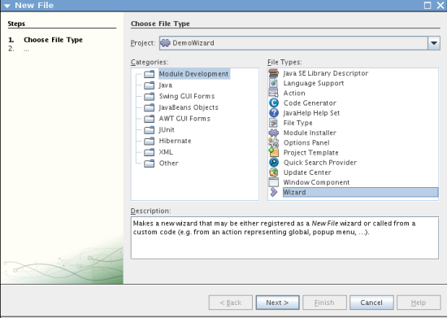

单击“下一步”。

[start=2]
1. 在“向导类型”面板中，在“向导面板数”字段中键入 2，并将其他值保持不变：

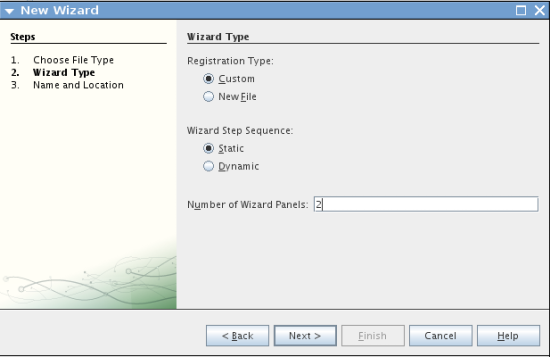

上述面板中的字段如下所示：

* *注册类型*。确定用户访问向导的位置。如果选择“定制”，“向导”向导将创建一个新的操作类，可用于打开并初始化向导。如果选择“新建文件”，“向导”向导将在模块的  ``layer.xml``  文件中注册向导。
* *向导步骤顺序*。确定向导是否为线性的，或者向导用户能否跳过向导步骤，具体取决于先前在向导中选择的内容。线性向导是“静态的”（缺省设置）；而具有可跳过步骤的向导需要定制迭代器类，这是在选择“动态”时创建的。
* *向导面板数*。确定将创建的向导面板数。对于每个向导步骤，将创建两个 Java 文件（视图和控制器）。

单击“下一步”。

[start=3]
1. 在“名称和位置”面板的“类名前缀”中键入  ``Demo`` ，然后从“包”下拉列表中选择主包：

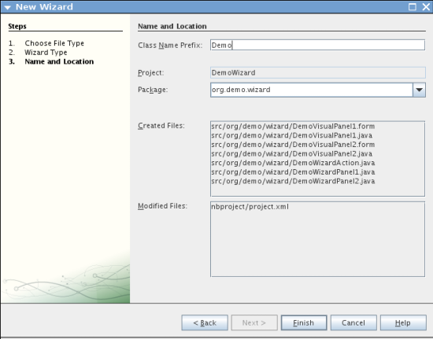

单击“完成”。

在“项目”窗口中，您现在应看到如下内容：

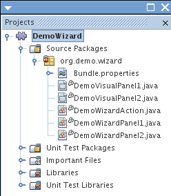

== 注册向导操作类

在本节中，我们将修改操作类，并在  ``layer.xml``  文件中注册该类。

[start=1]
1. 打开  ``DemoWizardAction.java``  文件，然后将所有代码替换为以下内容：

[source,java]
----

package org.demo.wizard;

import java.awt.Component;
import java.awt.Dialog;
import java.awt.event.ActionEvent;
import java.awt.event.ActionListener;
import java.text.MessageFormat;
import javax.swing.JComponent;
import org.openide.DialogDisplayer;
import org.openide.WizardDescriptor;

public final class DemoWizardAction implements ActionListener {

    private WizardDescriptor.Panel[] panels;

    public void actionPerformed(ActionEvent e) {
        WizardDescriptor wizardDescriptor = new WizardDescriptor(getPanels());
        // {0} will be replaced by WizardDesriptor.Panel.getComponent().getName()
        wizardDescriptor.setTitleFormat(new MessageFormat("{0}"));
        wizardDescriptor.setTitle("Your wizard dialog title here");
        Dialog dialog = DialogDisplayer.getDefault().createDialog(wizardDescriptor);
        dialog.setVisible(true);
        dialog.toFront();
        boolean cancelled = wizardDescriptor.getValue() != WizardDescriptor.FINISH_OPTION;
        if (!cancelled) {
            // do something
        }
    }

    /**
     * Initialize panels representing individual wizard's steps and sets
     * various properties for them influencing wizard appearance.
     */
    private WizardDescriptor.Panel[] getPanels() {
        if (panels == null) {
            panels = new WizardDescriptor.Panel[]{
                        new DemoWizardPanel1(),
                        new DemoWizardPanel2()
                    };
            String[] steps = new String[panels.length];
            for (int i = 0; i < panels.length; i++) {
                Component c = panels[i].getComponent();
                // Default step name to component name of panel. Mainly useful
                // for getting the name of the target chooser to appear in the
                // list of steps.
                steps[i] = c.getName();
                if (c instanceof JComponent) { // assume Swing components
                    JComponent jc = (JComponent) c;
                    // Sets step number of a component
                    // TODO if using org.openide.dialogs >= 7.8, can use WizardDescriptor.PROP_*:
                    jc.putClientProperty("WizardPanel_contentSelectedIndex", new Integer(i));
                    // Sets steps names for a panel
                    jc.putClientProperty("WizardPanel_contentData", steps);
                    // Turn on subtitle creation on each step
                    jc.putClientProperty("WizardPanel_autoWizardStyle", Boolean.TRUE);
                    // Show steps on the left side with the image on the background
                    jc.putClientProperty("WizardPanel_contentDisplayed", Boolean.TRUE);
                    // Turn on numbering of all steps
                    jc.putClientProperty("WizardPanel_contentNumbered", Boolean.TRUE);
                }
            }
        }
        return panels;
    }

    public String getName() {
        return "Start Sample Wizard";
    }

}

----

我们将使用与生成的内容相同的代码，所不同的是，我们将实现  ``ActionListener``  而不是  ``CallableSystemAction`` 。这样做是因为， ``ActionListener``  是一个标准 JDK 类，而  ``CallableSystemAction``  不是。从 NetBeans 平台 6.5 开始，我们可以改用标准 JDK 类，这种类使用更简便，并且需要的代码更少。

[start=2]
1. 在  ``layer.xml``  文件中注册操作类，如下所示：

[source,xml]
----

<filesystem>
    <folder name="Actions">
        <folder name="File">
            <file name="org-demo-wizard-DemoWizardAction.instance">
                <attr name="delegate" newvalue="org.demo.wizard.DemoWizardAction"/>
                <attr name="iconBase" stringvalue="org/demo/wizard/icon.png"/>
                <attr name="instanceCreate" methodvalue="org.openide.awt.Actions.alwaysEnabled"/>
                <attr name="noIconInMenu" stringvalue="false"/>
            </file>
        </folder>
    </folder>
    <folder name="Toolbars">
        <folder name="File">
            <file name="org-demo-wizard-DemoWizardAction.shadow">
                <attr name="originalFile" stringvalue="Actions/File/org-demo-wizard-DemoWizardAction.instance"/>
                <attr name="position" intvalue="0"/>
            </file>
        </folder>
    </folder>
</filesystem>

----

"iconBase" 元素指向主包中名为 "icon.png" 的图像。可以使用您自己以该名称命名的图像，并确保该图像为 16x16 像素大小，或者使用以下图像：

[start=3]
1. 运行该模块。将启动应用程序，将会在  ``layer.xml``  文件中指定的位置看到该工具栏按钮：

image::images/wizard_result-1.png[]

单击该按钮，将会显示向导：

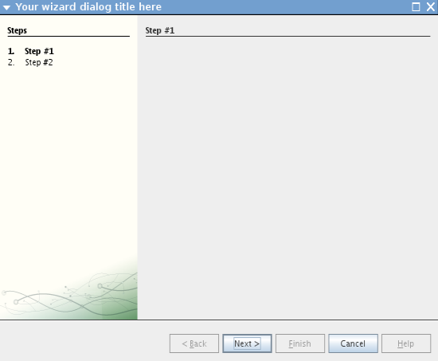

单击“下一步”，将会发现最终面板中的“完成”按钮已启用：

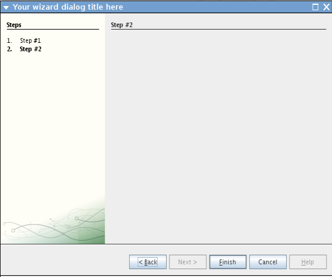

现在，向导基础结构可以正常工作了，让我们添加一些内容。

== 设计向导内容

在本节中，我们将在向导中添加一些内容并定制其基本功能。

[start=1]
1. 打开  ``DemoWizardAction.java``  文件，将会发现您可以为向导设置各种不同的定制属性：

image::images/wizard_wizard-tweaking.png[]

可以在 link:http://ui.netbeans.org/docs/ui_apis/wide/index.html[此处]了解这些属性的相关信息。

[start=2]
1. 在  ``DemoWizardAction.java``  中，将  ``wizardDescriptor.setTitle``  更改为以下内容：

[source,java]
----

wizardDescriptor.setTitle("Music Selection");

----

[start=3]
1. 打开  ``DemoVisualPanel1.java``  和  ``DemoVisualPanel2.java``  文件，并使用 "Matisse" GUI 生成器添加一些 Swing 组件，如下所示：

image::images/wizard_panel-1-design.png[]

image::images/wizard_panel-2-design.png[]

从上面可以看到  ``DemoVisualPanel1.java``  和  ``DemoVisualPanel2.java``  文件以及一些 Swing 组件。

[start=4]
1. 在“源”视图中打开这两个面板，然后将其  ``getName()``  方法分别更改为 "Name and Address" 和 "Musician Details"。

[start=5]
1. 
再次运行该模块。在打开向导时，将会看到如下内容，具体取决于添加的 Swing 组件和提供的定制内容：

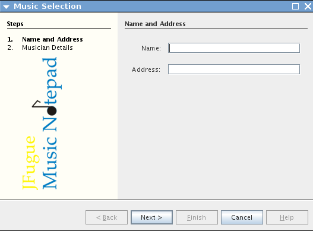

上面向导左侧边栏中的图像是在  ``DemoWizardAction.java``  文件中设置的，如下所示：

[source,java]
----

wizardDescriptor.putProperty("WizardPanel_image", ImageUtilities.loadImage("org/demo/wizard/banner.png", true));

----

现在，您已设计了向导内容，让我们添加一些代码以处理用户将输入的数据。

== 处理用户数据

在本节中，您将了解如何在面板之间传递用户数据，以及在单击“完成”后如何向用户显示结果。

[start=1]
1. 在  ``WizardPanel``  类中，使用  ``storeSettings``  方法检索可视面板中的数据集。例如，在  ``DemoVisualPanel1.java``  文件中创建 getter，然后从  ``DemoWizardPanel1.java``  文件中访问它们，如下所示：

[source,java]
----

public void storeSettings(Object settings) {
    ((WizardDescriptor) settings).putProperty("name", ((DemoVisualPanel1)getComponent()).getNameField());
    ((WizardDescriptor) settings).putProperty("address", ((DemoVisualPanel1)getComponent()).getAddressField());
}

----

[start=2]
1. 接下来，使用  ``DemoWizardAction.java``  文件检索已设置的属性，并使用这些属性执行一些操作：

[source,java]
----

public void actionPerformed(ActionEvent e) {
    WizardDescriptor wizardDescriptor = new WizardDescriptor(getPanels());
    // {0} will be replaced by WizardDesriptor.Panel.getComponent().getName()
    wizardDescriptor.setTitleFormat(new MessageFormat("{0}"));
    wizardDescriptor.setTitle("Music Selection");
    Dialog dialog = DialogDisplayer.getDefault().createDialog(wizardDescriptor);
    dialog.setVisible(true);
    dialog.toFront();
    boolean cancelled = wizardDescriptor.getValue() != WizardDescriptor.FINISH_OPTION;
    if (!cancelled) {
        *String name = (String) wizardDescriptor.getProperty("name");
        String address = (String) wizardDescriptor.getProperty("address");
        DialogDisplayer.getDefault().notify(new NotifyDescriptor.Message(name + " " + address));*
    }
}

----

也可以按其他方式使用  ``NotifyDescriptor`` ，如代码完成框所示：

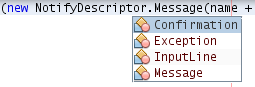

现在，您已知道如何处理用户输入的数据了。 

== 验证用户数据

在本节中，您将了解在向导中单击“下一步”后如何验证用户输入的内容。

[start=1]
1. 在  ``DemoWizardPanel1``  中，更改类签名以实现  ``WizardDescriptor.ValidatingPanel``  而不是  ``WizardDescriptor.Panel`` ：

[source,java]
----

public class DemoWizardPanel1 implements WizardDescriptor.ValidatingPanel

----

[start=2]
1. 在类顶部，将  ``JComponent``  声明更改为带类型的声明：

[source,java]
----

private DemoVisualPanel1 component;

----

[start=3]
1. 实现所需的抽象方法，如下所示：

[source,java]
----

@Override
public void validate() throws WizardValidationException {

    String name = component.getNameTextField().getText();
    if (name.equals("")){
        throw new WizardValidationException(null, "Invalid Name", null);
    }

}

----

[start=4]
1. 运行该模块。单击“下一步”，无需在“名称”字段中输入任何内容，将会看到以下结果。另外，还会发现由于验证失败而无法移到下一面板：

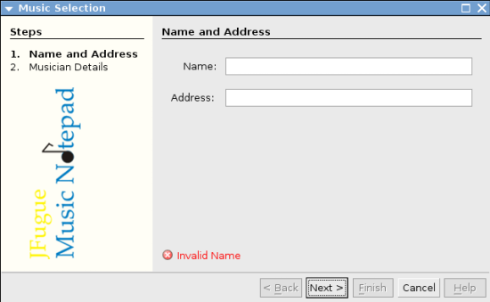

[start=5]
1. （可选）在名称字段为空时禁用“下一步”按钮。首先，在类顶部声明一个布尔值：

[source,java]
----

private boolean isValid = true;

----

然后覆盖  ``isValid()`` ，如下所示：

[source,java]
----

@Override
public boolean isValid() {
    return isValid;
}

----

在调用  ``validate()``  时（单击“下一步”按钮时调用），将返回 false：

[source,java]
----

@Override
public void validate() throws WizardValidationException {

    String name = component.getNameTextField().getText();
    if (name.equals("")) {
        *isValid = false;*
        throw new WizardValidationException(null, "Invalid Name", null);
    }

}

----

或者，也可以最初将布尔值设置为 false。然后实现  ``DocumentListener`` ，在字段上添加一个侦听程序；当用户在字段中键入某些内容时，将布尔值设置为 true 并调用  ``isValid()`` 。

现在，您已知道如何验证用户输入的数据了。

有关验证用户输入的详细信息，请参见本教程结尾的 Tom Wheeler 样例。 

== 在重新启动时永久保留数据

在本节中，您将了解如何在关闭应用程序时存储数据，以及在重新启动后打开向导时如何检索数据。

[start=1]
1. 在  ``DemoWizardPanel1.java``  中覆盖  ``readSettings``  和  ``storeSettings``  方法，如下所示：

[source,java]
----

*JTextField nameField = ((DemoVisualPanel1) getComponent()).getNameTextField();
JTextField addressField = ((DemoVisualPanel1) getComponent()).getAddressTextField();*

@Override
public void readSettings(Object settings) {
    *nameField.setText(NbPreferences.forModule(DemoWizardPanel1.class).get("namePreference", ""));
    addressField.setText(NbPreferences.forModule(DemoWizardPanel1.class).get("addressPreference", ""));*
}

@Override
public void storeSettings(Object settings) {
    ((WizardDescriptor) settings).putProperty("name", nameField.getText());
    ((WizardDescriptor) settings).putProperty("address", addressField.getText());
    *NbPreferences.forModule(DemoWizardPanel1.class).put("namePreference", nameField.getText());
    NbPreferences.forModule(DemoWizardPanel1.class).put("addressPreference", addressField.getText());*
}

----

[start=2]
1. 再次运行该模块，然后在向导的第一个面板中键入名称和地址：

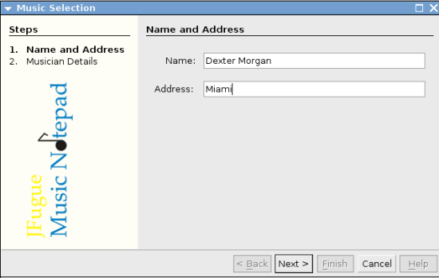

[start=3]
1. 关闭应用程序，打开“文件”窗口，然后查看应用程序的  ``build``  文件夹中的属性文件。现在，将会找到如下设置：

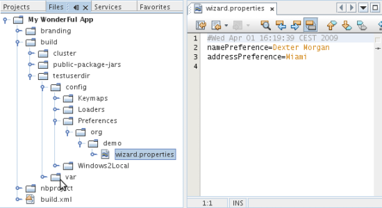

[start=4]
1. 再次运行应用程序，然后在打开向导时，将自动使用上面指定的设置定义向导字段中的值。

现在，您已知道如何在重新启动时永久保留向导数据了。 

== 标记向导

在本节中，我们将“下一步”按钮的字符串（由向导基础结构提供）标记为 "Advance"。

术语“标记”表示定制（即，通常指在同一语言中进行少量修改），而“国际化”或“本地化”表示翻译为其他语言。有关 NetBeans 模块本地化的信息，请 link:http://translatedfiles.netbeans.org/index-l10n.html[转至此处]。

[start=1]
1. 在“文件”窗口中，展开应用程序的  ``branding``  文件夹，然后创建下面突出显示的文件夹/文件结构：

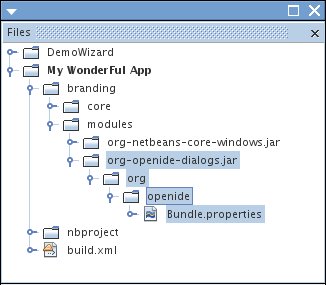

[start=2]
1. 定义文件内容，如下所示：

[source,java]
----

CTL_NEXT=&amp;Advance >

----

您可能要标记的其他字符串如下所示：

[source,java]
----

CTL_CANCEL
CTL_PREVIOUS
CTL_FINISH
CTL_ContentName

----

缺省情况下，将 "CTL_ContentName" 关键字设置为 "Steps"；如果 "WizardPanel_autoWizardStyle" 属性未设置为 "FALSE"，则会在向导左面板中使用该关键字。

[start=3]
1. 运行应用程序，“下一步”按钮将标记为 "Advance"：

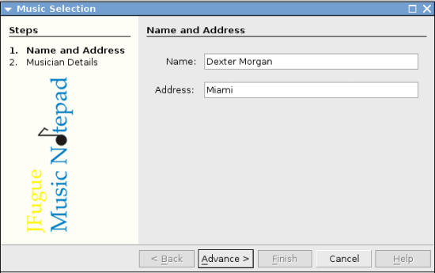

（可选）使用  ``DemoWizardAction.java``  文件（如上所述）删除向导的整个左侧部分，如下所示：

[source,java]
----

 wizardDescriptor.putProperty("WizardPanel_autoWizardStyle", Boolean.FALSE);

----

上述设置将导致向导如下所示：

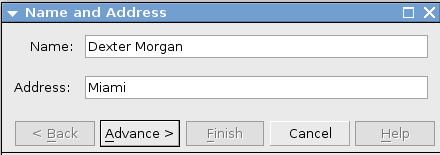

现在，您已知道如何将向导基础结构中定义的字符串标记为您自己的标记版本了。 

== 深入阅读

我们在线提供了一些相关信息：

* Tom Wheeler 的 NetBeans 站点（单击下面的图像）：

[.feature]
--
image::images/wizard_tom.png[role="left", link="http://www.tomwheeler.com/netbeans/"]
--

虽然是为 NetBeans 5.5 编写的，但已成功在带有 JDK 1.6 的 Ubuntu Linux 上针对 NetBeans IDE 6.5.1 测试了上述样例。

该样例在说明如何验证用户数据方面尤其有用。

* Geertjan 的博客:
*  link:http://blogs.oracle.com/geertjan/entry/how_wizards_work[向导工作方式：第 1 部分 - 简介]
*  link:http://blogs.oracle.com/geertjan/entry/how_wizards_work_part_2[向导工作方式：第 2 部分 - 各种类型]
*  link:http://blogs.oracle.com/geertjan/entry/how_wizards_work_part_3[向导工作方式：第 3 部分 - 第一个向导]
*  link:http://blogs.oracle.com/geertjan/entry/how_wizards_work_part_4[向导工作方式：第 4 部分 - 您自己的迭代器]
*  link:http://blogs.oracle.com/geertjan/entry/how_wizards_work_part_5[向导工作方式：第 5 部分 - 重新使用和嵌入现有面板]
*  link:http://blogs.oracle.com/geertjan/entry/creating_a_better_java_class[创建更好的 Java 类向导]

== 版本控制

|===
|*版本* |*日期* |*更改* 

|1 |2009 年 3 月 31 日 |初始版本。待更改项：

* [.line-through]#添加了有关验证用户输入的部分。#
* [.line-through]#添加了有关在向导中存储/检索数据的部分。#
* 添加了一个表以列出所有 WizardDescriptor 属性。
* 添加了一个表以列出并说明所有向导 API 类。
* 添加了指向 Javadoc 的链接。
 

|2 |2009 年 4 月 1 日 |添加了一个验证部分，其中包括用于禁用“下一步”按钮的代码。另外，还添加了持久性部分。 

|3 |2009 年 4 月 10 日 |整合了 Tom Wheeler 提供的注释，重新编写了标记部分，以便实际讲述标记内容，并引用了可以找到本地化信息的位置。 
|===
