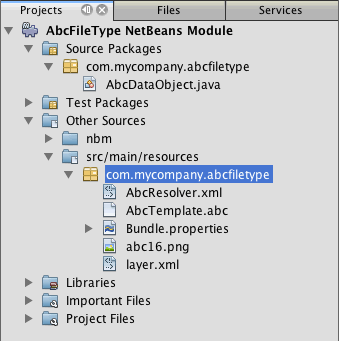
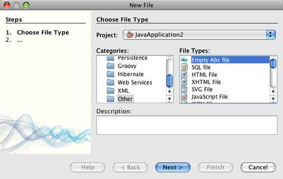

// 
//     Licensed to the Apache Software Foundation (ASF) under one
//     or more contributor license agreements.  See the NOTICE file
//     distributed with this work for additional information
//     regarding copyright ownership.  The ASF licenses this file
//     to you under the Apache License, Version 2.0 (the
//     "License"); you may not use this file except in compliance
//     with the License.  You may obtain a copy of the License at
// 
//       http://www.apache.org/licenses/LICENSE-2.0
// 
//     Unless required by applicable law or agreed to in writing,
//     software distributed under the License is distributed on an
//     "AS IS" BASIS, WITHOUT WARRANTIES OR CONDITIONS OF ANY
//     KIND, either express or implied.  See the License for the
//     specific language governing permissions and limitations
//     under the License.
//

= Creating a NetBeans Module Using Maven
:jbake-type: platform_tutorial
:jbake-tags: tutorials 
:jbake-status: published
:syntax: true
:source-highlighter: pygments
:toc: left
:toc-title:
:icons: font
:experimental:
:description: Creating a NetBeans Module Using Maven - Apache NetBeans
:keywords: Apache NetBeans Platform, Platform Tutorials, Creating a NetBeans Module Using Maven

This document demonstrates how to create a NetBeans Module project from a Maven archetype and build and install the module in your installation of the IDE. In this tutorial you will create a simple module project that when installed enables you to create a new file type in your projects. The module also creates a menu action that is available when you the new file type is selected.

This document is based on the Ant-based  link:https://netbeans.apache.org/tutorials/nbm-filetype.html[NetBeans File Type Tutorial] and illustrates some of the differences between using Ant and Maven to develop NetBeans modules. After you understand some of the differences, you can easily proceed through other tutorials on the  link:https://netbeans.apache.org/kb/docs/platform.html[NetBeans Platform Learning Trail].

If you are new to the NetBeans Platform, you might want to watch the the screencast series  link:https://netbeans.apache.org/tutorials/nbm-10-top-apis.html[Top 10 NetBeans APIs].

NOTE:  You do not need to download a separate version of the NetBeans Platform to develop applications for the NetBeans Platform. Typically, you develop the applications and modules in the NetBeans IDE and then only include the modules that are necessary to run the NetBeans Platform and your application.

Before starting this tutorial you may want to familiarize yourself with the following documentation.

*  link:http://wiki.netbeans.org/MavenBestPractices[Best Practices for Apache Maven in NetBeans 6.x]
*  link:http://www.sonatype.com/books/maven-book/reference/introduction.html[Chapter 1. Introducing Apache Maven] (from  link:http://www.sonatype.com/books/maven-book/reference/public-book.html[Maven: The Definitive Guide])
*  link:https://netbeans.apache.org/kb/docs/java/gui-functionality.html[Introduction to GUI Building]

== Using Maven with the IDE

If this is your first Maven project you will want to familiarize yourself with the Maven configuration settings and the Maven Repository Browser.

=== Configuring Maven Options

You can use the Maven tab in the Options window to configure the behavior of Maven in the IDE and to check that your configuration is correct.

[start=1]
1. Select the Miscellaneous category in the Options window and click the Maven tab.

[start=2]
1. Specify the location of your local Maven installation (requires 2.0.9 or newer).

[start=3]
1. Check that the location of the local Maven repository is correct.

[start=4]
1. Click OK.

In most cases, if your Maven configuration is typical the information in the Options window should already be correct.

*Note.* Maven support is activated as part of the Java SE feature set. If the Maven tab is not available in the Options window, confirm that Java SE is activated by creating a Java application.

=== Viewing the Maven Repositories

The artifacts that are used by Maven to build all your projects are stored in your local Maven repository. When an artifact is declared as a project dependency, the artifact is downloaded to your local repository from one of the registered remote repositories.

The NetBeans repository and several well-known indexed Maven repositories are registered and listed in the Repository Browser window by default. The NetBeans repository contains most of the public artifacts necessary for you to build your project. You can use the Maven Repository Browser to view the contents of your local and remote repositories. You can expand the Local Repository node to see the artifacts that are present locally. The artifacts listed under the NetBeans repository nodes can be added as project dependencies, but not all of them are present locally. They are only added to the Local Repository when they are declared as project dependencies.

To open the Maven Repository Browser:

* Choose Window > Other > Maven Repository Browser from the main menu.

image::images/maven-quickstart68_maven-nbm-netbeans-repo.png[title="Screenshot of Maven Repository Browser"]

== Creating the NetBeans Platform Module Project

In this section you create a NetBeans Module project and then create a DataObject for the new file type.

=== Creating the Module

In this exercise you use the New Project wizard to create the NetBeans Module project from a Maven archetype.

[start=1]
1. Open the New Project wizard and choose Maven NetBeans Module in the Maven category. Click Next.

[start=2]
1. Type *AbcFileType* in Project Name. Click Finish.

When you click Finish, the IDE creates the AbcFileType project. If you look at the POM you can see that Maven will use the  `` link:http://maven.apache.org/plugins/maven-jar-plugin/[maven-jar-plugin]``  to build the JAR and the  `` link:http://bits.netbeans.org/mavenutilities/nbm-maven-plugin/[nbm-maven-plugin]``  will package the JAR as a NetBeans Module ( ``nbm`` ).

[source,xml]
----

    <modelVersion>4.0.0</modelVersion>
    <groupId>com.mycompany</groupId>
    <artifactId>AbcFileType</artifactId>
    *<packaging>nbm</packaging>*
    <version>1.0-SNAPSHOT</version>
    <name>AbcFileType NetBeans Module</name>
    ...
    <build>
        <plugins>
            <plugin>
                <groupId>org.codehaus.mojo</groupId>
                *<artifactId>nbm-maven-plugin</artifactId>*
                <extensions>true</extensions>
            </plugin>
            ...
            <plugin>
            <groupId>org.apache.maven.plugins</groupId>
                *<artifactId>maven-jar-plugin</artifactId>*
                <version>2.2</version>
                <configuration>
                    <!-- to have the jar plugin pickup the nbm generated manifest -->
                    <useDefaultManifestFile>true</useDefaultManifestFile>
                </configuration>
            </plugin>
        </plugins>
    </build>
----

=== Creating the DataObject Class

In this section you will use the New File Type wizard to create the files for creating and recognizing a new file type named  ``.abc`` . The wizard will create a  `` link:http://bits.netbeans.org/dev/javadoc/org-openide-loaders/org/openide/loaders/DataObject.html[DataObject]`` , a MIME type resolver and a file template for  ``abc``  files and modify  ``layer.xml``  to add registration entries for the new file type.

[start=1]
1. Right-click the project node in the Projects window and choose New > File Type.

[start=2]
1. In the File Recognition panel, type *text/x-abc* for the MIME Type and *.abc .ABC* for the Filename Extension. Click Next.

[start=3]
1. Type *Abc* as the Class Name Prefix.

[start=4]
1. Click Browse and select a 16x16 pixel image file as the new file type's icon. Click Finish.

You can save this image  `` link:images/maven-crud_abc16.png[abc16.png]``  ( 
image::images/maven-crud_abc16.png[title="16x16"] ) to you system and specify the image in the wizard.

When you click Finish, the IDE creates the  ``AbcDataObject``  class and copies your file type icon into the package in the  ``src/main/resources``  under Other Sources.

In the Projects window you can see that the wizard created the MIME type resolver ( ``AbcResolver.xml`` ) and template ( ``AbcTemplate.abc`` ) files in the  ``src/main/resources``  directory.

For more details on the files that the IDE created, see  link:https://netbeans.apache.org/wiki/devfaqdataobject[What is a DataObject] and the section on  link:nbm-filetype.html#recognizing[Recognizing Abc Files] in the  link:nbm-filetype.html[NBM Filetype tutorial].

== Building and Running the Project

In this section you will configure the module so that the module will be installed into the current version of the IDE. A new instance of the IDE will launch when you run the module.

=== Specifying the Location of the NetBeans Installation

By default, no target NetBeans installation is specified when you use the Maven archetype to create a NetBeans Platform module. You can build the project, but when you try to run the project before you set the installation directory you will see a build error similar to the following in the Output window.

To install and run the module in an installation of the IDE you need to edit the  ``nbm-maven-plugin``  element in the POM to specify the path to the installation directory.

[start=1]
1. Expand the Project Files node and open  ``pom.xml``  in the editor.

[start=2]
1. Specify the path to the NetBeans installation by modifying the  ``nbm-maven-plugin``  element to add the  ``<netbeansInstallation>``  element.

[source,xml]
----

<plugin>
    <groupId>org.codehaus.mojo</groupId>
    <artifactId>nbm-maven-plugin</artifactId>
    <version>3.2</version>
    <extensions>true</extensions>
    *<configuration>
       <netbeansInstallation>/home/me/netbeans-6.9</netbeansInstallation>
    </configuration>*
</plugin>
----

*Note.* The path needs to specify the directory that contains the  ``bin``  directory containing the runnable file.

For example, on OS X the path might resemble the following.

[source,xml]
----

<netbeansInstallation>/Applications/NetBeans/NetBeans 6.9.app/Contents/Resources/NetBeans</netbeansInstallation>
----

=== Running the Module

After you specify the NetBeans IDE installation directory you can build and run the module.

[start=1]
1. Right-click the project node and choose Build.

[start=2]
1. Right-click the project node and choose Run.

When you choose Run, the IDE launches with the new module installed. To confirm that the new module is working correctly, create a new project and then use the New File wizard to create an  ``abc``  file. For example, you can create a simple Java application and then open the New File wizard and choose the Empty Abc file type in the Other category.

When you create the new file, specify a source package if you want to see the file in the Projects window. By default the wizard for the new file type will create the file at the root level of the project.

 
After you create the new abc file you can see that the file is displayed in the Projects window with the icon for the file type. If you open the file in the editor you can see that the contents of the new file were generated from the file template.

== Adding an Action for the File Type

In this section you will add an action that can be invoked from the popup menu when the user right-clicks the node of the new file type.

=== Creating the Action Class

In this exercise you will use the New Action wizard to create a Java class that will perform an action for the new file type. The wizard will also register the class in the  ``layer.xml`` .

[start=1]
1. Right-click the project node and choose New > Action.

[start=2]
1. In the Action Type panel, select Conditionally Enabled and type *com.mycompany.abcfiletype.AbcDataObject* for the Cookie Class. Click Next.

[start=3]
1. Select Edit in the Category drop-down list and deselect Global Menu Item.

[start=4]
1. Select File Type Context Menu Item and select *text/x-abc* in the Content Type drop-down list. Click Next.

[start=5]
1. Type *MyAction* as the Class Name and *My Action* as the Display Name. Click Finish.

When you click Finish,  ``MyAction.java``  is created in the  ``com.mycompany.abcfiletype``  source package. If you open  ``layer.xml``  in the editor you can see that the wizard added details about the new action for the file type inside the  ``Edit``  folder element inside the  ``Actions``  folder.

[source,xml]
----

<folder name="Actions">
    <folder name="Edit">
        *<file name="com-mycompany-abcfiletype-MyAction.instance">*
            <attr name="delegate" methodvalue="org.openide.awt.Actions.inject"/>
            <attr name="displayName" bundlevalue="com.mycompany.abcfiletype.Bundle#CTL_MyAction"/>
            <attr name="injectable" stringvalue="com.mycompany.abcfiletype.MyAction"/>
            <attr name="instanceCreate" methodvalue="org.openide.awt.Actions.context"/>
            <attr name="noIconInMenu" boolvalue="false"/>
            <attr name="selectionType" stringvalue="EXACTLY_ONE"/>
            <attr name="type" stringvalue="com.mycompany.abcfiletype.AbcDataObject"/>
        </file>
    </folder>
</folder>
----

The wizard also generated elements inside the  ``Loaders``  and  ``Factories``  folder elements that apply to the new file type. The menu actions for the  ``abc``  file type are specified under  ``Actions``  and the  ``DataLoader``  is specified under  ``Factories`` .

[source,xml]
----

<folder name="Loaders">
    <folder name="text">
        *<folder name="x-abc">
            <folder name="Actions">
                <file name="com-mycompany-abcfiletype-MyAction.shadow">*
                    <attr name="originalFile" stringvalue="Actions/Edit/com-mycompany-abcfiletype-MyAction.instance"/>
                    *<attr name="position" intvalue="0"/>*
                </file>
                <file name="org-openide-actions-CopyAction.shadow">
                    <attr name="originalFile" stringvalue="Actions/Edit/org-openide-actions-CopyAction.instance"/>
                    <attr name="position" intvalue="400"/>
                </file>
                ...
            </folder>
            *<folder name="Factories">
                <file name="AbcDataLoader.instance">*
                    <attr name="SystemFileSystem.icon" urlvalue="nbresloc:/com/mycompany/abcfiletype/abc16.png"/>
                    <attr name="dataObjectClass" stringvalue="com.mycompany.abcfiletype.AbcDataObject"/>
                    <attr name="instanceCreate" methodvalue="org.openide.loaders.DataLoaderPool.factory"/>
                    <attr name="mimeType" stringvalue="text/x-abc"/>
                </file>
            </folder>
        </folder>
    </folder>
</folder>
----

The position of My Action in the popup menu is specified by the  ``position``  attribute ( ``<attr name="position" intvalue="0"/>`` ). The default is to assign the  ``intvalue``  of the attribute of a new action to  ``0``  which will make the action the topmost in the list. You can change the order by changing the  ``intvalue`` . For example, if you change the  ``intvalue``  to  ``200`` , the My Action menu item will appear below the Open menu item (the Open action has an  ``intvalue``  of  ``100`` ).

=== Assigning a Behavior to the Action

You now need to add the code for the action. In this example you will add some code that uses  ``DialogDisplayer``  to open a dialog box when the action is invoked from the popup menu. To use  ``DialogDisplayer``  you will also need to declare a direct dependency on  ``org.openide.dialogs`` .

[start=1]
1. Modify the  ``actionPerformed(ActionEvent ev)``  method in  ``MyAction.java``  to open a dialog when My Action is invoked.

[source,java]
----

@Override
public void actionPerformed(ActionEvent ev) {
   *FileObject f = context.getPrimaryFile();
   String displayName = FileUtil.getFileDisplayName(f);
   String msg = "This file is " + displayName + ".";
   NotifyDescriptor nd = new NotifyDescriptor.Message(msg);
   DialogDisplayer.getDefault().notify(nd);*
}
----

[start=2]
1. Fix your imports and confirm that you import  ``*org.openide.filesystems.FileObject*`` . Save your changes.

When you fixed the imports you added an import statement for  ``org.openide.DialogDisplayer`` . You now need to declare the dependency on the  ``org.openide.dialogs``  artifact a direct dependency instead of a transitive dependency.

[start=3]
1. Right-click the  ``org.openide.dialogs``  JAR under the project's Libraries node and choose Declare as Direct Dependency.

You can now test the module to confirm that the new action works correctly.

*Note.* To run the module you will first need to clean and build the module.

image::images/maven-single_maven-single-action-popup.png[title="Abc file in Projects window and open in editor"]

When you right-click on a node of the  ``abc``  file type you will see that My Action is one of the items in the popup menu.

== Creating a Window for the File Type

By default, the new file type will open into a basic text editor. If you do not want to use an editor for the new file type, you can create a new window specifically for editing the new file type. You can then modify the window component to support other ways of editing the file, for example by making the window a visual editor. In this section you will create the new window component specifically for files of your new file type.

[start=1]
1. Right-click the project node and choose New > Window.

[start=2]
1. Select *editor* from the dropdown list and select Open on Application Start. Click Next.

[start=3]
1. Type *Abc* as the Class Name Prefix. Click Finish.

[start=4]
1. Open  ``AbcDataObject.java``  in the editor and modify the class constructor to use  `` link:http://bits.netbeans.org/dev/javadoc/org-openide-loaders/org/openide/loaders/OpenSupport.html[OpenSupport]``  instead of  ``DataEditorSupport`` .

[source,java]
----

public AbcDataObject(FileObject pf, MultiFileLoader loader) throws DataObjectExistsException, IOException {
    super(pf, loader);
    CookieSet cookies = getCookieSet();
    *cookies.add((Node.Cookie) new AbcOpenSupport(getPrimaryEntry()));*
}
----

[start=5]
1. Create the  ``AbcOpenSupport``  class that is called by the constructor.

Type Alt-Enter in the line containing the call to  ``AbcOpenSupport``  to create  ``AbcOpenSupport``  in the package  ``com.mycompany.abcfiletype`` .

[start=6]
1. Modify  ``AbcOpenSupport``  to extend  ``OpenSupport``  and implement  ``OpenCookie``  and  ``CloseCookie`` .

[source,java]
----

class AbcOpenSupport *extends OpenSupport implements OpenCookie, CloseCookie* {
----

[start=7]
1. Implement the abstract methods (Alt-Enter) and make the following changes to the class.

[source,java]
----

    public AbcOpenSupport(*AbcDataObject.Entry entry*) {
        *super(entry);*
    }

    @Override
    protected CloneableTopComponent createCloneableTopComponent() {
        *AbcDataObject dobj = (AbcDataObject) entry.getDataObject();
        AbcTopComponent tc = new AbcTopComponent();
        tc.setDisplayName(dobj.getName());
        return tc;*
    }
----

[start=8]
1. Open  ``AbcTopComponent``  in the editor and modify the class to extend  ``CloneableTopComponent``  instead of  ``TopComponent`` .

[source,java]
----

public final class AbcTopComponent extends *CloneableTopComponent* {
----

[start=9]
1. Change the class modifier from  ``private``  to  ``public`` .*public*

[source,java]
----

 static AbcTopComponent instance;
----

[start=10]
1. Fix your imports and save your changes.

You can now try running the module again after cleaning and building the project.

image::images/maven-single_maven-single-newfile-window.png[title="Abc file in Projects window and open in editor"]

When you open an abc file the file will now open in the new window instead of the basic editor.

This tutorial demonstrated how to create and run a NetBeans Module that you create from a Maven Archetype. You learned how to modify the project POM to specify the target NetBeans installation so that the Run command in the IDE will install the module and launch a new instance of the IDE. You also learned a little about how to work with file types and  ``DataObjects`` , but for more details you should look at the  link:https://netbeans.apache.org/tutorials/nbm-filetype.html[NetBeans File Type Tutorial]. For more examples on how to build NetBeans Platform applications and modules, see the tutorials listed in the  link:https://netbeans.apache.org/kb/docs/platform.html[NetBeans Platform Learning Trail].

link:http://netbeans.apache.org/community/mailing-lists.html[ Send Us Your Feedback]

 

== See Also

For more information about creating and developing applications, see the following resources.

*  link:https://netbeans.apache.org/kb/docs/platform.html[NetBeans Platform Learning Trail]
*  link:http://bits.netbeans.org/dev/javadoc/[NetBeans API Javadoc]

If you have any questions about the NetBeans Platform, feel free to write to the mailing list, dev@platform.netbeans.org, or view the  link:https://mail-archives.apache.org/mod_mbox/netbeans-dev/[NetBeans Platform mailing list archive].

