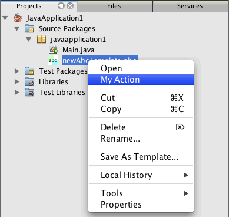

// 
//     Licensed to the Apache Software Foundation (ASF) under one
//     or more contributor license agreements.  See the NOTICE file
//     distributed with this work for additional information
//     regarding copyright ownership.  The ASF licenses this file
//     to you under the Apache License, Version 2.0 (the
//     "License"); you may not use this file except in compliance
//     with the License.  You may obtain a copy of the License at
// 
//       http://www.apache.org/licenses/LICENSE-2.0
// 
//     Unless required by applicable law or agreed to in writing,
//     software distributed under the License is distributed on an
//     "AS IS" BASIS, WITHOUT WARRANTIES OR CONDITIONS OF ANY
//     KIND, either express or implied.  See the License for the
//     specific language governing permissions and limitations
//     under the License.
//

= Criando um módulo NetBeans utilizando o Maven
:jbake-type: platform_tutorial
:jbake-tags: tutorials 
:jbake-status: published
:syntax: true
:source-highlighter: pygments
:toc: left
:toc-title:
:icons: font
:experimental:
:description: Criando um módulo NetBeans utilizando o Maven - Apache NetBeans
:keywords: Apache NetBeans Platform, Platform Tutorials, Criando um módulo NetBeans utilizando o Maven

Este documento demonstra como criar um projeto no módulo NetBeans a partir de um arquetipo Maven e como desenvolver e instalar o módulo em sua instalação do IDE. Neste tutorial, você criará um projeto de módulo simples que após ser instalado permite criar um novo tipo de arquivo em seus projetos. Este módulo também cria uma ação de menu que fica disponível quando o novo tipo de arquivo é selecionado.

Este documento tem base no  link:https://netbeans.apache.org/tutorials/nbm-filetype_pt_BR.html[Tutorial de tipo de arquivo do NetBeans] com base no Ant e ilustra algumas das diferenças entre o uso do Ant e do Maven para desenvolver módulos NetBeans. Após compreender algumas das diferenças, é possível prosseguir com facilidade através dos outros tutoriais na  link:https://netbeans.apache.org/kb/docs/platform_pt_BR.html[Trilha de aprendizado da plataforma NetBeans].

Caso seja novo na plataforma NetBeans, recomenda-se com ênfase que você assista à série de screencasts  link:https://netbeans.apache.org/tutorials/nbm-10-top-apis.html[As 10 principais APIs do NetBeans].

NOTE:  não é preciso efetuar o download de uma versão separada da plataforma NetBeans para desenvolver aplicativos para a plataforma NetBeans. Normalmente, você desenvolverá os aplicativos e os módulos no NetBeans IDE e, em seguida, somente incluirá os módulos necessários para executar a plataforma NetBeans e seu aplicativo.

Antes de começar este tutorial, talvez você queira se familiarizar com a documentação a seguir.

*  link:http://wiki.netbeans.org/MavenBestPractices[Melhores práticas para o Apache Maven no NetBeans 6.x]
*  link:http://www.sonatype.com/books/maven-book/reference/introduction.html[Capítulo 1. Introdução ao Apache Maven] (do  link:http://www.sonatype.com/books/maven-book/reference/public-book.html[Maven: o guia definitivo])
*  link:https://netbeans.apache.org/kb/docs/java/gui-functionality_pt_BR.html[Introdução à construção de GUIs]

== Usando Maven com o IDE

Se este for seu primeiro projeto Maven, talvez queira se familiarizar com as definições de configurações e com o navegador do repositório Maven.

=== Configurando as opções do Maven

É possível usar a aba Maven na janela Opções para configurar o comportamento do Maven no IDE e verificar se sua configuração está correta.

[start=1]
1. Selecione a categoria Diversos na janela Opções e clique na aba Maven.

[start=2]
1. Especifique a localização da instalação local do Maven (requer 2.0.9 ou mais recente).

[start=3]
1. Verifique se a localização do repositório local do Maven está correta.

[start=4]
1. Clique em OK.

Na maioria dos casos, se sua configuração do Maven é a típica, as informações na janela Opções já devem estar corretas.

*Nota.* O suporte ao Maven é ativado como parte do conjunto de recursos do Java SE. Se a aba Maven não estiver disponível na janela Opções, confirme se o Java SE está ativado ao criar um aplicativo Java.

=== Visualizando os repositórios Maven

Os artefatos que são usados pelo Maven para construir todos os seus projetos são armazenados em seu repositório local Maven. Quando um artefato é declarado como uma dependência do projeto, o artefato é baixado para seu repositório local a partir de um dos repositórios remotos registrados.

Como padrão, o repositório NetBeans e os diversos repositórios Maven indexados conhecidos são registrados e identificados na janela do navegador do repositório. O repositório NetBeans contém a maioria dos artefatos públicos necessários para que você desenvolva seu projeto. Você pode usar o navegador do repositório Maven para visualizar o conteúdo dos repositórios locais e remotos. Você expande o nó Repositório local para ver os artefatos que estão presentes localmente. Os artefatos listados abaixo dos nós do repositório NetBeans podem ser adicionados como dependências do projeto, mas nem todos eles estão localmente presentes. Eles são adicionados ao repositório local somente quando são declarados como dependências do projeto.

Para abrir o navegador do repositório Maven:

* Escolha Janela > Outro > Navegador do repositório Maven no menu principal.

image::images/maven-quickstart68_maven-nbm-netbeans-repo.png[title="Captura de tela do navegador do repositório Maven"]

== Criando o projeto do módulo da plataforma NetBeans

Nesta seção você criará um projeto do módulo NetBeans e a seguir criará um DataObject para o novo tipo de arquivo.

=== Criando o módulo

Neste exercício, você usa o assistente Novo projeto para criar um projeto do módulo NetBeans a partir de um arquetipo Maven.

[start=1]
1. Abra o assistente Novo projeto e escolha Módulo NetBeans Maven na categoria Maven. Clique em Próximo.

[start=2]
1. Digite *AbcFileType* em Nome do projeto. Clique em Terminar.

Quando você clicar em Terminar, o IDE criará o projeto AbcFileType. Se você examinar o POM poderá ver que o Maven utilizará o  `` link:http://maven.apache.org/plugins/maven-jar-plugin/[plug-in maven-jar]``  para desenvolver o JAR e o  `` link:http://bits.netbeans.org/mavenutilities/nbm-maven-plugin/[plug-in nbm-maven]``  empacotará o JAR como um módulo NetBeans ( ``nbm`` ).

[source,xml]
----

    <modelVersion>4.0.0</modelVersion>
    <groupId>com.mycompany</groupId>
    <artifactId>AbcFileType</artifactId>
    *<packaging>nbm</packaging>*
    <version>1.0-SNAPSHOT</version>
    <name>AbcFileType NetBeans Module</name>
    ...
    <build>
        <plugins>
            <plugin>
                <groupId>org.codehaus.mojo</groupId>
                *<artifactId>nbm-maven-plugin</artifactId>*
                <extensions>true</extensions>
            </plugin>
            ...
            <plugin>
            <groupId>org.apache.maven.plugins</groupId>
                *<artifactId>maven-jar-plugin</artifactId>*
                <version>2.2</version>
                <configuration>
                    <!-- to have the jar plugin pickup the nbm generated manifest -->
                    <useDefaultManifestFile>true</useDefaultManifestFile>
                </configuration>
            </plugin>
        </plugins>
    </build>
----

=== Criando a classe DataObject

Nesta seção você utilizará o assistente Novo tipo de arquivo para criar os arquivos para a criação e reconhecimento de um novo tipo de arquivo denominado  ``.abc`` . O assistente criará um  `` link:http://bits.netbeans.org/dev/javadoc/org-openide-loaders/org/openide/loaders/DataObject.html[DataObject]`` , um solucionador de tipo MIME e um modelo de arquivo para os arquivos  ``abc``  e modificará o  ``layer.xml``  para adicionar entradas do registro para o novo tipo de arquivo.

[start=1]
1. Clique com o botão direito do mouse no nó da janela Projeto e escolha Novo > Tipo de arquivo.

[start=2]
1. No painel Reconhecimento de arquivo, digite *text/x-abc* para o Tipo the MIME e *.abc .ABC* como a extensão do nome do arquivo. Clique em Próximo.
image::images/maven-single_maven-single-new-filetype-wizard.png[title="Assistente Novo tipo de arquivo"]

[start=3]
1. Digite *Abc* como o prefixo do nome da classe.

[start=4]
1. Clique em Procurar e selecione um arquivo de imagem de 16x16 pixels como o ícone do novo tipo de arquivo. Clique em Terminar.

Você pode salvar esta imagem como  `` link:images/maven-crud_abc16.png[abc16.png]``  ( 
 ) em seu sistema e especificar a imagem no assistente.

Quando você clica em Terminar, o IDE cria a classe  ``AbcDataObject``  e copia o ícone do tipo de arquivo no pacote em  ``src/main/resources``  sob Outras origens.

image::images/maven-single_maven-single-projects1.png[title="Captura de tela da janela Projetos"]

Na janela Projetos é possível visualizar que o assistente criou o solucionador de tipo MIME ( ``AbcResolver.xml`` ) e os arquivos de modelo ( ``AbcTemplate.abc`` ) no diretório  ``src/main/resources`` .

Para obter mais detalhes sobre os arquivos criados pelo IDE, consulte  link:https://netbeans.apache.org/wiki/devfaqdataobject[O que é um DataObject] e a seção em  link:nbm-filetype_pt_BR.html#recognizing[Reconhecendo arquivos Abc] no  link:nbm-filetype_pt_BR.html[tutorial de tipo de arquivo NBM].

== Desenvolvendo e executando o projeto

Nesta seção você configurará o módulo para que seja instalado na versão atual do IDE. Uma nova instância do IDE se inicia quando você executa o módulo.

=== Especificando a localização da instalação do NetBeans

Como padrão, nenhuma instalação NetBeans alvo é especificada quando você usa o arquetipo Maven para criar um módulo da plataforma NetBeans. Você pode desenvolver o projeto, mas quando tenta executá-lo antes de definir o diretório de instalação, verá um erro de versão similar ao seguinte na janela Saída.

image::images/maven-single_output-build-error.png[title="Janela Saída mostrando o erro de versão"]

Para instalar e executar o módulo em uma instalação do IDE, é necessário editar o elemento  ``nbm-maven-plugin``  no POM para especificar o caminho para o diretório de instalação.

[start=1]
1. Expanda o nó Arquivos do projeto e abra o  ``pom.xml``  no editor.

[start=2]
1. Especifique o caminho para a instalação do NetBeans ao modificar o elemento  ``nbm-maven-plugin``  para adicionar o elemento  ``<netbeansInstallation>`` .

[source,xml]
----

<plugin>
    <groupId>org.codehaus.mojo</groupId>
    <artifactId>nbm-maven-plugin</artifactId>
    <version>3.2</version>
    <extensions>true</extensions>
    *<configuration>
       <netbeansInstallation>/home/me/netbeans-6.9</netbeansInstallation>
    </configuration>*
</plugin>
----

*Nota.* O caminho precisa especificar o diretório que contenha o diretório  ``bin``  contendo o arquivo executável.

Por exemplo, no SO X o caminho pode se parecer com o seguinte.

[source,xml]
----

<netbeansInstallation>/Applications/NetBeans/NetBeans 6.9.app/Contents/Resources/NetBeans</netbeansInstallation>
----

=== Executando o módulo

Após especificar o diretório de instalação do NetBeans IDE, é possível desenvolver e executar o módulo.

[start=1]
1. Clique com o botão direito do mouse no nó do projeto e escolha Construir.

[start=2]
1. Clique com o botão direito do mouse no nó do projeto e escolha Executar.

Quando você escolhe Executar, o IDE é iniciado com o novo módulo instalado. Para confirmar que o novo módulo esteja funcionando corretamente, crie um novo projeto e a seguir use o assistente Novo arquivo para criar um arquivo  ``abc`` . Por exemplo, você pode criar um aplicativo Java simples e a seguir abrir o assistente Novo arquivo e escolher o tipo de arquivo Empty Abc na categoria Outro.

Quando você cria o novo arquivo, especifique uma pacote de origem se desejar visualizar o arquivo na janela Projetos. Como padrão, o assistente para o novo tipo de arquivo criará o arquivo no nível raiz do projeto.

image::images/maven-single_wizard-new-abc-file.png[title="assistente Novo arquivo com o tipo de arquivo Abc"] 
Após você criar o novo arquivo abc, poderá visualizar que o arquivo é exibido na janela Projetos com o ícone para o tipo de arquivo. Se você abrir o arquivo no editor, poderá visualizar o conteúdo do novo arquivo que foi gerado a partir do modelo de arquivo.

image::images/maven-single_maven-single-projects-abcfile.png[title="Arquivo Abc na janela Projetos e aberto no editor"]

== Adicionando uma ação para o tipo de arquivo

Nesta seção você adicionará uma ação que pode ser chamada a partir do menu suspenso quando o usuário clica com o botão direito do mouse no nó do novo tipo de arquivo.

=== Criando a classe Action

Neste exercício, usaremos o assistente Nova ação para criar uma classe Java que executará uma ação para o novo tipo de arquivo. O assistente também registrará a classe no  ``layer.xml`` .

[start=1]
1. Clique com o botão direito do mouse no nó do projeto e escolha Nova > Ação.

[start=2]
1. No painel Tipo de ação, selecione Condicionalmente habilitado e digite *com.mycompany.abcfiletype.AbcDataObject* para a classe Cookie. Clique em Próximo.
image::images/maven-single_maven-single-newactionwizard.png[title="Assistente Nova ação"]

[start=3]
1. Selecione Editar na lista suspensa Categoria e cancele a seleção de Item de menu global.

[start=4]
1. Selecione Item de menu de contexto de tipo de arquivo e selecione *text/x-abc* na lista suspensa Tipo de conteúdo. Clique em Próximo.

[start=5]
1. Digite *MyAction* como o Nome da classe e *My Action* como o Nome de exibição. Clique em Terminar.

Quando você clica em Terminar,  ``MyAction.java``  é criado no pacote fonte  ``com.mycompany.abcfiletype`` . Se você abre o  ``layer.xml``  no editor, poderá visualizar que o assistente adicionou detalhes sobre a nova ação para o tipo de arquivo dentro da pasta  ``Edit``  e o elemento dentro da pasta  ``Actions`` .

[source,xml]
----

<folder name="Actions">
    <folder name="Edit">
        *<file name="com-mycompany-abcfiletype-MyAction.instance">*
            <attr name="delegate" methodvalue="org.openide.awt.Actions.inject"/>
            <attr name="displayName" bundlevalue="com.mycompany.abcfiletype.Bundle#CTL_MyAction"/>
            <attr name="injectable" stringvalue="com.mycompany.abcfiletype.MyAction"/>
            <attr name="instanceCreate" methodvalue="org.openide.awt.Actions.context"/>
            <attr name="noIconInMenu" boolvalue="false"/>
            <attr name="selectionType" stringvalue="EXACTLY_ONE"/>
            <attr name="type" stringvalue="com.mycompany.abcfiletype.AbcDataObject"/>
        </file>
    </folder>
</folder>
----

O assistente também gerou elementos dentro das pastas  ``Loaders``  e  ``Factories``  e elementos que se aplicam ao novo tipo de arquivo. As ações de menu para o tipo de arquivo  ``abc``  são especificadas sob  ``Actions``  e o  ``DataLoader``  é especificado sob  ``Factories`` .

[source,xml]
----

<folder name="Loaders">
    <folder name="text">
        *<folder name="x-abc">
            <folder name="Actions">
                <file name="com-mycompany-abcfiletype-MyAction.shadow">*
                    <attr name="originalFile" stringvalue="Actions/Edit/com-mycompany-abcfiletype-MyAction.instance"/>
                    *<attr name="position" intvalue="0"/>*
                </file>
                <file name="org-openide-actions-CopyAction.shadow">
                    <attr name="originalFile" stringvalue="Actions/Edit/org-openide-actions-CopyAction.instance"/>
                    <attr name="position" intvalue="400"/>
                </file>
                ...
            </folder>
            *<folder name="Factories">
                <file name="AbcDataLoader.instance">*
                    <attr name="SystemFileSystem.icon" urlvalue="nbresloc:/com/mycompany/abcfiletype/abc16.png"/>
                    <attr name="dataObjectClass" stringvalue="com.mycompany.abcfiletype.AbcDataObject"/>
                    <attr name="instanceCreate" methodvalue="org.openide.loaders.DataLoaderPool.factory"/>
                    <attr name="mimeType" stringvalue="text/x-abc"/>
                </file>
            </folder>
        </folder>
    </folder>
</folder>
----

A posição de My Action no menu suspenso é especificada pelo atributo  ``posição``  ( ``<attr name="position" intvalue="0"/>`` ). O padrão é o de atribuir o atributo  ``intvalue``  de uma nova ação como  ``0``  que fará com que a ação esteja no topo da lista. Você pode alterar a ordem ao alterar o  ``intvalue`` . Por exemplo, se você altera o  ``intvalue``  para  ``200`` , o item de menu My Action aprecerá abaixo do item de menu Abrir (a ação Abrir tem um  ``intvalue``  de  ``100`` ).

=== Atribuindo um comportamento à ação

Agora é necessário adicionar o código para a ação. Neste exemplo, você adicionará algum código que usa  ``DialogDisplayer``  para abrir uma caixa de diálogo quando a ação é chamada a partir do menu suspenso. Para usar  ``DialogDisplayer``  também será necessário declarar uma dependência direta em  ``org.openide.dialogs`` .

[start=1]
1. Modifique o método  ``actionPerformed(ActionEvent ev)``  no  ``MyAction.java``  para abrir uma caixa de diálogo quando My Action é chamada.

[source,java]
----

@Override
public void actionPerformed(ActionEvent ev) {
   *FileObject f = context.getPrimaryFile();
   String displayName = FileUtil.getFileDisplayName(f);
   String msg = "This file is " + displayName + ".";
   NotifyDescriptor nd = new NotifyDescriptor.Message(msg);
   DialogDisplayer.getDefault().notify(nd);*
}
----

[start=2]
1. Corrija suas importações e confirme que você importou  ``*org.openide.filesystems.FileObject*`` . Salve as alterações.

Quando você corrigiu as importações adicionou uma declaração de importação para  ``org.openide.DialogDisplayer`` . Agora é necessário declarar a dependência no artefato  ``org.openide.dialogs`` , uma dependência direta ao invés de uma dependência transitiva.

[start=3]
1. Clique com o botão direito do mouse no JAR  ``org.openide.dialogs``  sob o nó Bibliotecas do projeto e escolha Declarar como dependência direta.

Agora é possível testar o módulo para confirmar que a nova ação funciona corretamente.

*Nota.* Para executar o módulo, é preciso primeiro limpar e desenvolver o módulo.

Ao clicar com o botão direito do mouse em um nó no tipo de arquivo  ``abc`` , verá que My Action é um dos itens no menu suspenso.

== Criando uma janela para o Tipo de arquivo

Como padrão, o novo tipo de arquivo será aberto em um editor de texto básico. Caso não deseje usar um editor para o novo tipo de arquivo, você pode criar uma nova janela especificamente para editar o novo tipo de arquivo. Você pode então modificar o componente de janela para suportar outras formas de editar o arquivo, por exemplo, ao tornar a janela um editor visual. Nesta seção você criará um novo componente de janela especificamente para arquivos de seu novo tipo de arquivo.

[start=1]
1. Clique com o botão direito do mouse no nó do projeto e escolha Nova > Janela.

[start=2]
1. Selecione *editor* na lista suspensa e selecione Abrir ao iniciar o aplicativo. Clique em Próximo.

[start=3]
1. Digite *Abc* como o prefixo do nome da classe. Clique em Terminar.

[start=4]
1. Abra  ``AbcDataObject.java``  no editor e modifique o construtor de classe para usar  `` link:http://bits.netbeans.org/dev/javadoc/org-openide-loaders/org/openide/loaders/OpenSupport.html[OpenSupport]``  ao invés de  ``DataEditorSupport`` .

[source,java]
----

public AbcDataObject(FileObject pf, MultiFileLoader loader) throws DataObjectExistsException, IOException {
    super(pf, loader);
    CookieSet cookies = getCookieSet();
    *cookies.add((Node.Cookie) new AbcOpenSupport(getPrimaryEntry()));*
}
----

[start=5]
1. Crie a classe  ``AbcOpenSupport``  que é chamada pelo construtor.

Tecle Alt-Enter na linha que contém a chamada para  ``AbcOpenSupport``  para criar  ``AbcOpenSupport``  no pacote  ``com.mycompany.abcfiletype`` .

[start=6]
1. Modifique  ``AbcOpenSupport``  para estender  ``OpenSupport``  e implementar  ``OpenCookie``  e  ``CloseCookie`` .

[source,java]
----

class AbcOpenSupport *extends OpenSupport implements OpenCookie, CloseCookie* {
----

[start=7]
1. Implemente os métodos abstratos (Alt-Enter) e faça as seguintes alterações na classe.

[source,java]
----

    public AbcOpenSupport(*AbcDataObject.Entry entry*) {
        *super(entry);*
    }

    @Override
    protected CloneableTopComponent createCloneableTopComponent() {
        *AbcDataObject dobj = (AbcDataObject) entry.getDataObject();
        AbcTopComponent tc = new AbcTopComponent();
        tc.setDisplayName(dobj.getName());
        return tc;*
    }
----

[start=8]
1. Abra  ``AbcTopComponent``  no editor e modifique a classe para estender  ``CloneableTopComponent``  ao invés de  ``TopComponent`` .

[source,java]
----

public final class AbcTopComponent extends *CloneableTopComponent* {
----

[start=9]
1. Altere o modificador de classe de  ``privado``  para  ``público`` .*public*

[source,java]
----

 static AbcTopComponent instance;
----

[start=10]
1. Corrija as importações e salve as alterações.

Agora é possível tentar executar o módulo novamente após limpar e desenvolver o projeto.

image::images/maven-single_maven-single-newfile-window.png[title="Arquivo Abc na janela Projetos e aberto no editor"]

Quando você abre um arquivo abc, este agora será aberto na nova janela ao invés de no editor básico.

Este tutorial demonstrou como criar e executar um módulo NetBeans criado a partir de um arquetipo Maven. Você aprendeu como modificar o POM do projeto para especificar a instalação NetBeans alvo, para que o comando Executar no IDE instale o módulo e inicie uma nova instância do IDE. Você também aprendeu um pouco sobre como trabalhar com tipos de arquivos e  ``DataObjects`` , mas para obter mais detalhes deveria consultar o  link:https://netbeans.apache.org/tutorials/nbm-filetype_pt_BR.html[Tutorial de tipo de arquivo do NetBeans]. Para obter mais exemplos sobre como desenvolver aplicativos e módulos da plataforma NetBeans, consulte os tutoriais listados na  link:https://netbeans.apache.org/kb/docs/platform_pt_BR.html[Trilha do aprendizado da plataforma NetBeans].

== Consulte também

Para obter mais informações sobre a criação e o desenvolvimento de aplicativos, consulte os seguintes recursos.

*  link:https://netbeans.apache.org/kb/docs/platform_pt_BR.html[Trilha do aprendizado da plataforma NetBeans]
*  link:http://bits.netbeans.org/dev/javadoc/[Javadoc da API da NetBeans ]

Sempre que tiver perguntas sobre a plataforma NetBeans, de qualquer tipo, sinta-se a vontade para escrever para a lista de e-mail, dev@platform.netbeans.org, ou visualize  link:https://mail-archives.apache.org/mod_mbox/netbeans-dev/[o arquivo da lista de e-mail da plataforma NetBeans].

