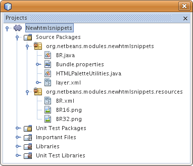
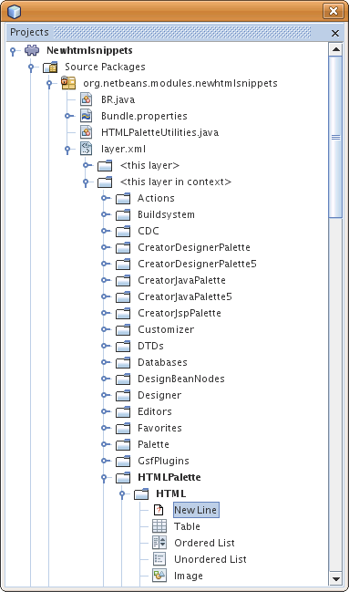
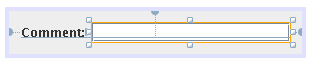
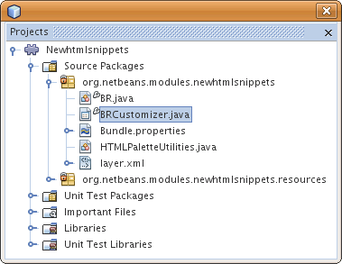
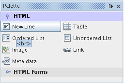
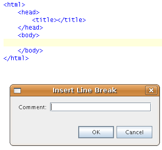
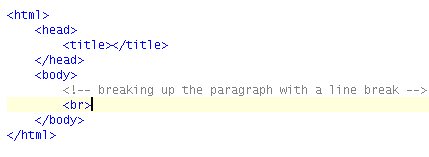
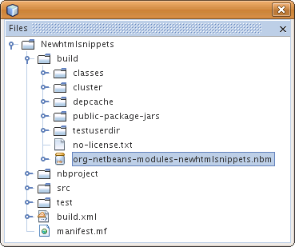

// 
//     Licensed to the Apache Software Foundation (ASF) under one
//     or more contributor license agreements.  See the NOTICE file
//     distributed with this work for additional information
//     regarding copyright ownership.  The ASF licenses this file
//     to you under the Apache License, Version 2.0 (the
//     "License"); you may not use this file except in compliance
//     with the License.  You may obtain a copy of the License at
// 
//       http://www.apache.org/licenses/LICENSE-2.0
// 
//     Unless required by applicable law or agreed to in writing,
//     software distributed under the License is distributed on an
//     "AS IS" BASIS, WITHOUT WARRANTIES OR CONDITIONS OF ANY
//     KIND, either express or implied.  See the License for the
//     specific language governing permissions and limitations
//     under the License.
//

= NetBeans Code Snippet Module Tutorial
:jbake-type: platform_tutorial
:jbake-tags: tutorials 
:jbake-status: published
:syntax: true
:source-highlighter: pygments
:toc: left
:toc-title:
:icons: font
:experimental:
:description: NetBeans Code Snippet Module Tutorial - Apache NetBeans
:keywords: Apache NetBeans Platform, Platform Tutorials, NetBeans Code Snippet Module Tutorial

This tutorial demonstrates how to create and add code snippets to the HTML/JSP Component Palette. Code snippets are small pieces of code that can be dragged from a component palette and dropped in the Source Editor. They serve to speed up coding. The HTML/JSP Component Palette has several code snippets already, but you might want to add some additional ones and share them with others.

NOTE: This document uses the NetBeans IDE 6.5 Release. If you are using an earlier version, see  link:60/nbm-palette-api1.html[the 6.0/6.1 version of this document].

Optionally, for troubleshooting purposes, you can  link:https://netbeans.org/files/documents/4/637/newhtmlsnippets.zip[download the completed sample].

== Introduction to Code Snippets

To create a code snippet, you use the  link:http://bits.netbeans.org/dev/javadoc/org-netbeans-spi-palette/overview-summary.html[NetBeans Palette API]. A code snippet requires the following files:

* A Java class that defines the piece of code to be dragged into the Source Editor.
* A display name for the palette item.
* A tooltip for the palette item.
* A 16x16 pixel image for the 'Small Icon' display.
* A 32x32 pixel image for the 'Big Icon' display.

After you have created or added the above files to the NetBeans module, you declare them in a resource declaration XML file, which you register in the NetBeans System Filesystem by using the  ``layer.xml``  file.

== Setting up the Module Project

Before you start writing the module, you have to make sure you that your project is set up correctly. The IDE provides a wizard that sets up all the basic files needed for a module.

=== Creating the Module Project

[start=1]
1. Choose File > New Project (Ctrl+Shift+N). Under Categories, select NetBeans Modules. Under Projects, select Module. Click Next.

[start=2]
1. In the Name and Location panel, type  ``Newhtmlsnippets``  in the Project Name field. Change the Project Location to any directory on your computer. Leave the Standalone Module option and Set as Main Project checkbox selected. Click Next.

[start=3]
1. In the Basic Module Configuration panel, type  ``org.netbeans.modules.newhtmlsnippets``  in Code Name Base.

[start=4]
1. Select "Generate XML Layer". Leave the locations of both the localizing bundle and the XML layer file so that they will be stored in a package with the name  ``org/netbeans/modules/newhtmlsnippets`` . Click Finish.

The IDE creates the  ``Newhtmlsnippets``  project. The project contains all of your sources and project metadata, such as the project's Ant build script. The project opens in the IDE. You can view its logical structure in the Projects window (Ctrl-1) and its file structure in the Files window (Ctrl-2).

=== Specifying the Module's Dependencies

You will need to use several classes that belong to the  link:http://bits.netbeans.org/dev/javadoc/index.html[NetBeans APIs]. Each has to be declared as a module dependency. Use the Project Properties dialog box for this purpose.

[start=1]
1. In the Projects window, right-click the  ``Newhtmlsnippets``  project node and choose Properties. In the Project Properties dialog box, click Libraries.

[start=2]
1. 
For each of the following, click "Add...", select the name from the Module list, and then click OK to confirm it:

* Common Palette
* Text API
* Utilities API

Click OK to exit the Project Properties dialog box.

[start=3]
1. In the Projects window, expand the Important Files node, double-click the Project Metadata node, and note that the APIs you selected have been declared as Module dependencies.

== Coding the Code Snippet

In this section, you create  ``BR.java`` , which defines a code snippet for an HTML line break. By implementing the  `` link:http://bits.netbeans.org/dev/javadoc/org-openide-text/org/openide/text/ActiveEditorDrop.html[ActiveEditorDrop]``  class, you let the NetBeans APIs provide the infrastructure for a palette item for NetBeans editors. You also create  ``HTMLPaletteUtilities.java`` , which defines the insertion of the tag in the editor.

=== Creating the Code Snippet

[start=1]
1. Right-click the  ``org.netbeans.modules.newhtmlsnippets``  node and choose New > Java Class. Type  ``BR``  in Class Name, make sure that the  ``org.netbeans.modules.newhtmlsnippets``  package is selected in the Package drop-down list, and click Finish.

[start=2]
1. Replace the default content of the  ``BR.java``  file with the following:

[source,java]
----

package org.netbeans.modules.newhtmlsnippets;

import javax.swing.text.BadLocationException;
import javax.swing.text.JTextComponent;
import org.netbeans.modules.newhtmlsnippets.HTMLPaletteUtilities;
import  link:http://bits.netbeans.org/dev/javadoc/org-openide-text/org/openide/text/ActiveEditorDrop.html[org.openide.text.ActiveEditorDrop];

public class BR implements  link:http://bits.netbeans.org/dev/javadoc/org-openide-text/org/openide/text/ActiveEditorDrop.html[ActiveEditorDrop] {
    
    public BR() {
    }
    
    private String createBody() {
        String Br = " ";
        return Br;
    }
    
    public boolean  link:http://bits.netbeans.org/dev/javadoc/org-openide-text/org/openide/text/ActiveEditorDrop.html#handleTransfer(javax.swing.text.JTextComponent)[handleTransfer(JTextComponent targetComponent]) {
        String body = createBody();
        try {
            HTMLPaletteUtilities.insert(body, targetComponent);
        } catch (BadLocationException ble) {
            return false;
        }
        return true;
    }
    
}
----

Right-click in the Source Editor and choose Format (Alt-Shift-F).

A red error message remains because you have not created the  ``HTMLPaletteUtilities``  class yet, which you will do in the next section.

=== Defining the Insertion

In this section, you create the  ``HTMLPaletteUtilities``  class, which defines the place where the snippet will be dropped.

[start=1]
1. Right-click the  ``org.netbeans.modules.newhtmlsnippets``  node and choose New > Java Class. Type  ``HTMLPaletteUtilities``  in Class Name, make sure that the  ``org.netbeans.modules.newhtmlsnippets``  package is selected in the Package drop-down list, and click Finish.

[start=2]
1. Replace the default content of the  ``HTMLPaletteUtilities.java``  file with the following:

[source,java]
----

package org.netbeans.modules.newhtmlsnippets;

import javax.swing.text.BadLocationException;
import javax.swing.text.Caret;
import javax.swing.text.Document;
import javax.swing.text.JTextComponent;
import javax.swing.text.StyledDocument;
import  link:https://bits.netbeans.org/dev/javadoc/org-openide-text/org/openide/text/NbDocument.html[org.openide.text.NbDocument];

public class HTMLPaletteUtilities {
  
    public static void insert(final String s,final JTextComponent target) throws BadLocationException {
        
        final StyledDocument doc = (StyledDocument)target.getDocument();
        
        class AtomicChange implements Runnable {
            
            public void run() {
                Document value = target.getDocument();
                if (value == null)
                    return;
                try {
                    insert(s, target, doc);
                } catch (BadLocationException e) {}
            }
        }
        
        try {
link:https://bits.netbeans.org/dev/javadoc/org-openide-text/org/openide/text/NbDocument.html#runAtomicAsUser(javax.swing.text.StyledDocument,%20java.lang.Runnable)[NbDocument.runAtomicAsUser(doc, new AtomicChange())];
        } catch (BadLocationException ex) {}
        
    }
    
    private static int insert(String s, JTextComponent target, Document doc) throws BadLocationException {
        
        int start = -1;
        
        try {
            
            *//firstly, find selected text range:*
            Caret caret = target.getCaret();
            int p0 = Math.min(caret.getDot(), caret.getMark());
            int p1 = Math.max(caret.getDot(), caret.getMark());
            doc.remove(p0, p1 - p0);
            
            *//then, replace selected text range with the inserted one:*
            start = caret.getDot();
            doc.insertString(start, s, null);
        
        } catch (BadLocationException ble) {}
        
        return start;

    }

}
----

Right-click in the Source Editor and choose Format (Alt-Shift-F).

== Declaring and Registering the Code Snippet

Code snippets are registered in two phases. Firstly, you declare a code snippet in an XML file that conforms to the NetBeans Editor Palette Item DTD. In this XML file, you declare your  ``ActiveEditorDrop``  implementation class, a 16x16 pixel icon, a 32x32 pixel icon, a display name, and a tooltip.

NOTE: Use the 1.0 version of the DTD if you want the display name and tooltip to be defined in a properties file. Use the 1.1 version of the DTD if you want to declare the display name and tooltip witin the XML file itself. Both approaches are described below.

Secondly, you register the XML file in the  ``layer.xml``  file, in the palette's folder.

=== Declaring the Code Snippet

The NetBeans Editor Palette Item DTD is used to declare the  ``ActiveEditorDrop``  class, the icons, the display name, and the tooltip.

[start=1]
1. Right-click the  ``org.netbeans.modules.newhtmlsnippets``  package node and choose New > Other. Select XML Document in the XML folder and click Next. Type  ``BR``  in File Name. Type  ``\resources``  at the end of  ``src\org\netbeans\modules\newhtmlsnippets``  in Folder. Click Finish.

[start=2]
1. Replace the default content of the  ``BR.xml``  file with the following:

[source,xml]
----

<?xml version="1.0" encoding="UTF-8"?>
<!DOCTYPE editor_palette_item PUBLIC "-//NetBeans//Editor Palette Item 1.0//EN"
  "https://netbeans.org/dtds/editor-palette-item-1_0.dtd">

<editor_palette_item version="1.0">

    <class name="org.netbeans.modules.newhtmlsnippets.BR" />

    <icon16 urlvalue="org/netbeans/modules/newhtmlsnippets/resources/BR16.png" />
    <icon32 urlvalue="org/netbeans/modules/newhtmlsnippets/resources/BR32.png" />
   
    <description localizing-bundle="org.netbeans.modules.newhtmlsnippets.Bundle"
               display-name-key="NAME_html-BR"
               tooltip-key="HINT_html-BR" />
               
</editor_palette_item>
----

In the 1.1 DTD, you can define the display name and tooltip without using a properties file. Below, only the difference with the previous XML file definition is highlighted:

[source,xml]
----

<?xml version="1.0" encoding="UTF-8"?>
<!DOCTYPE editor_palette_item PUBLIC "*-//NetBeans//Editor Palette Item 1.1//EN*"
  "https://netbeans.org/dtds/*editor-palette-item-1_1.dtd*">

<editor_palette_item version="1.0">

    <class name="org.netbeans.modules.newhtmlsnippets.BR" />

    <icon16 urlvalue="org/netbeans/modules/newhtmlsnippets/resources/BR16.png" />
    <icon32 urlvalue="org/netbeans/modules/newhtmlsnippets/resources/BR32.png" />
   
    *<inline-description>
       <display-name>New Line</display-name>
       <tooltip>
           <b>
              br
           </b>
       </tooltip>
    </inline-description>*
               
</editor_palette_item>
----

NOTE: You can choose either of the two approaches above, depending on your requirements.

[start=3]
1. Add a 16x16 pixel icon and a 32x32 pixel icon to the new  ``resources``  folder. Name them  ``BR16.png``  and  ``BR32.png`` . They can also be in other icon formats, such as GIF or JPG. Make sure that the resource is correctly declared in the  ``BR.xml``  file. You can right-click them here and then save them to your module's source structure:

image::images/codesnippet_BR32.png[]

[start=4]
1. If you want to use a properties file for declaring the palette item's display name and tooltip, which implies that you are using the 1.0 DTD, add the following to the  ``Bundle.properties``  file:

image::images/codesnippet_bundle-60.png[]

At this point, the project source structure should be as follows:

=== Registering the Code Snippet

The  ``layer.xml``  file registers the user interface elements of your module in your application, which in this case is the IDE. Here, we need to register the palette item in the  ``layer.xml``  file so that the item will appear in the HTML Palette.

[start=1]
1. Add the following tags to the  ``layer.xml``  file, between the  ``<filesystem>``  tags:

[source,xml]
----

<folder name="HTMLPalette">
   <folder name="HTML">
      <file name="BR.xml" url="resources/BR.xml">
         <attr name="position" intvalue="150"/>
      </file>
   </folder>
</folder>
----

[start=2]
1. Optionally, you can reorder the items in the palette. When you do so, you can use the user interface provided for this purpose to do so.

Expand the  ``layer.xml``  node and then expand  ``<this layer in context>`` . A folder appears for every folder declared by every  ``layer.xml``  file of every module registered in the IDE.

Notice that the "HTMLPalette" folder is marked in bold. This matches the name of the folder you created in your own  ``layer.xml``  file. Expand the folder and notice that its subfolder, HTML, is also in bold. Expand the HTML folder and notice that the  ``BR.xml``  resource declaration file that you declared has been added to the resource declaration files provided by other modules:

When you right-click on the node, several options are available, such as "Delete" and "Copy".

As an experiment, drag the "New Line" node and drop it right below the "Table" node. Double-click the  ``layer.xml``  file and notice that the value of the "position" element changes whenever you move the "New Line" node to a different place.

=== Optional: Adding a Customizer

Optionally, you can let a  ``JPanel``  appear when the palette item is dropped. In the  ``JPanel`` , you can let the user define values for attributes that relate to the tag that is about to be created. However, note that adding such a customizer is optional. In the case of a line break, which is what we are creating in this tutorial, there are no attributes that relate to the BR tag. For that reason, to illustrate the customizer functionality, we will add a comment before the BR tag, by means of a customizer.

NOTE: If you check out the  ``html``  module from the NetBeans sources, you will find many examples of customizers in the  ``org/netbeans/modules/html/palette/items``  package.

[start=1]
1. Add a dependency on the NetBeans  `` link:http://bits.netbeans.org/dev/javadoc/org-openide-dialogs/overview-summary.html[Dialogs API]`` .

[start=2]
1. 
Use the New File dialog (Ctrl-N) to create a  ``JPanel``  in the  ``org.netbeans.modules.newhtmlsnippets``  package. Name it  ``BRCustomizer`` .

[start=3]
1. Use the Pallette (Ctrl-Shift-8) to drag and drop a  ``JLabel``  and a  ``JTextField``  onto the  ``JPanel``  and arrange the  ``JPanel``  as follows:

[start=4]
1. You will need to declare the following at the top of the  ``BRCustomizer``  class:

[source,java]
----

private Dialog dialog = null;
private DialogDescriptor descriptor = null;
private boolean dialogOK = false;

BR br;
JTextComponent target;
----

[start=5]
1. Rewrite the  ``BRCustomizer``  constructor as follows:

[source,java]
----

public BRCustomizer(BR br, JTextComponent target) {
    this.br = br;
    this.target = target;

    initComponents();
}
----

[start=6]
1. In your  ``BRCustomizer``  class, add this method, so that, in the next steps, you can open the customizer from your  ``ActiveEditorDrop``  implementation class:

[source,java]
----

public boolean showDialog() {

    dialogOK = false;

    String displayName = "";
    try {
        displayName = NbBundle.getBundle("org.netbeans.modules.newhtmlsnippets.Bundle").getString("NAME_html-BR"); // NOI18N
    } catch (Exception e) {
        //Handle the exception here.
    }

    descriptor = new DialogDescriptor(this, NbBundle.getMessage(BRCustomizer.class, "LBL_Customizer_InsertPrefix") + " " + displayName, true,
            DialogDescriptor.OK_CANCEL_OPTION, DialogDescriptor.OK_OPTION,
            new ActionListener() {

                public void actionPerformed(ActionEvent e) {
                    if (descriptor.getValue().equals(DialogDescriptor.OK_OPTION)) {
                        evaluateInput();
                        dialogOK = true;
                    }
                    dialog.dispose();
                }

            });

    dialog = DialogDisplayer.getDefault().createDialog(descriptor);
    dialog.setVisible(true);
    repaint();

    return dialogOK;

}
----

[start=7]
1. Define the  ``evaluateInput()``  method, which is called in the  ``showDialog()``  method above, as follows:

[source,java]
----

private void evaluateInput() {

   String comment = jTextField1.getText();
   br.setComment(comment);

}
----

[start=8]
1. Add to the  ``Bundle.properties``  file:

[source,java]
----

LBL_Customizer_InsertPrefix=Insert
NAME_html-BR=Line Break
----

[start=9]
1. Hook your customizer into the  ``ActiveEditorDrop``  implementation class as follows (only the lines that are changed are highlighted below):

[source,java]
----

package org.netbeans.modules.newhtmlsnippets;

import javax.swing.text.BadLocationException;
import javax.swing.text.JTextComponent;
import org.netbeans.modules.newhtmlsnippets.HTMLPaletteUtilities;
import  link:https://bits.netbeans.org/dev/javadoc/org-openide-text/org/openide/text/ActiveEditorDrop.html[org.openide.text.ActiveEditorDrop];

public class BR implements  link:https://bits.netbeans.org/dev/javadoc/org-openide-text/org/openide/text/ActiveEditorDrop.html[ActiveEditorDrop] {

    *private String comment = "";*

    public BR() {
    }

    private String createBody() {
        *comment = getComment();
        String Br = "<!-- " + comment + " -->"
                + "\n         ";*
        return Br;
    }

    public boolean  link:https://bits.netbeans.org/dev/javadoc/org-openide-text/org/openide/text/ActiveEditorDrop.html#handleTransfer(javax.swing.text.JTextComponent)[handleTransfer(JTextComponent targetComponent]) {

        *BRCustomizer c = new BRCustomizer(this, targetComponent);
        boolean accept = c.showDialog();
        if (accept) {*
            String body = createBody();
            try {
                HTMLPaletteUtilities.insert(body, targetComponent);
            } catch (BadLocationException ble) {
                *accept = false;*
            }
        }
        *return accept;*

    }

    *public String getComment() {
        return comment;
    }

    public void setComment(String comment) {
        this.comment = comment;
    }*

}
----

Your project source structure should now include your  ``JPanel`` :

== Building and Installing the Code Snippet

Now we need to think about installation and distribution. In the first section below, we install the code snippet, next we create an NBM file and examine distribution channels.

=== Trying Out the Code Snippet

Install and try out the code snippet, by following the steps below.

[start=1]
1. In the Projects window, right-click the  ``Newhtmlsnippets``  project and choose Run.

The module is built and installed in the target platform. The target platform opens so that you can try out your new module. The default target platform is the installation used by the current instance of the development IDE.

[start=2]
1. Create a new HTML file in the IDE. When the HTML file opens, it displays the Component Palette (Ctrl-Shift-8) with one additional code snippet, called "New Line", with a tooltip that displays the result of dragging-and-dropping the item:

[start=3]
1. Drag the 'New Line' item into the Source Editor and, if you completed the optional section on creating a customizer (above), you will see a customizer:

[start=4]
1. Type a comment, click OK, and notice that a new  `` ``  tag is inserted at the cursor, together with an HTML comment:

NOTE: Above, the text "breaking up the paragraph with a line break" was typed into the customizer.

=== Creating a Shareable Module Binary

An NBM file is the binary version of the module that provides the code snippet. Below, using one menu item, we create the NBM file.

[start=1]
1. In the Projects window, right-click the  ``newhtmlsnippet``  project and choose Create NBM.

The NBM file is created and you can view it in the Files window (Ctrl-2), as shown below:

[start=2]
1. Make the module available to others via, for example, the  link:http://plugins.netbeans.org/PluginPortal/[Plugin Portal].

[start=3]
1. The recipient can install the module by using their IDE's Plugin Manager. They would choose Tools > Plugins from the main menu.
link:http://netbeans.apache.org/community/mailing-lists.html[Send Us Your Feedback]

== Next Steps

For more information about creating and developing NetBeans modules, see the following resources:

*  link:https://netbeans.apache.org/kb/docs/platform.html[Other Related Tutorials]
*  link:http://bits.netbeans.org/dev/javadoc/index.html[NetBeans API Javadoc]
