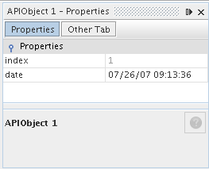
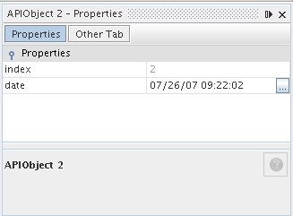
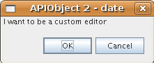
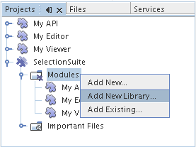
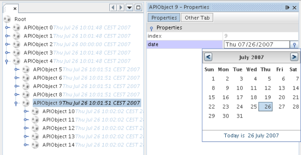

// 
//     Licensed to the Apache Software Foundation (ASF) under one
//     or more contributor license agreements.  See the NOTICE file
//     distributed with this work for additional information
//     regarding copyright ownership.  The ASF licenses this file
//     to you under the Apache License, Version 2.0 (the
//     "License"); you may not use this file except in compliance
//     with the License.  You may obtain a copy of the License at
// 
//       http://www.apache.org/licenses/LICENSE-2.0
// 
//     Unless required by applicable law or agreed to in writing,
//     software distributed under the License is distributed on an
//     "AS IS" BASIS, WITHOUT WARRANTIES OR CONDITIONS OF ANY
//     KIND, either express or implied.  See the License for the
//     specific language governing permissions and limitations
//     under the License.
//

= NetBeans Property Editor Tutorial
:jbake-type: platform_tutorial
:jbake-tags: tutorials 
:jbake-status: published
:syntax: true
:source-highlighter: pygments
:toc: left
:toc-title:
:icons: font
:experimental:
:description: NetBeans Property Editor Tutorial - Apache NetBeans
:keywords: Apache NetBeans Platform, Platform Tutorials, NetBeans Property Editor Tutorial

This tutorial shows techniques for using property editors in NetBeans, including providing custom editors and custom inplace editors. Specifically, the following will be covered:

* Providing your own property editor for an individual Node
* Creating a custom editor
* Creating a custom inplace editor
* Registering a custom property editor globally

Optionally, for troubleshooting purposes, you can  link:http://plugins.netbeans.org/PluginPortal/faces/PluginDetailPage.jsp?pluginid=3146[download the completed sample].

== Introduction to Custom Property Editors

Often you may have a property for which either the standard property editor is not sufficient, or the property type is a class for which there is no standard property editor. NetBeans IDE contains classes for many common Swing types, but every possible need cannot be covered by a set of generic property editors.

This tutorial is intended as a follow-on to these preceding tutorials, and its code is based on the code from them:

*  link:nbm-selection-1.html[Selection Management Tutorial I—Using a TopComponent's Lookup]
*  link:nbm-selection-2.html[NetBeans Selection Management Tutorial II—Using Nodes]
*  link:nbm-nodesapi2.html[Using the Nodes API]

You'll pick up where you left off in the previous tutorial, with the class `MyNode`, which wraps an `APIObject` object, and offers a read-only property for its `index` property and a read/write one for its `date` property.

== Creating a Property Editor

The basics of creating a property editor are pretty simple. The JavaBeans API offers a base class, `PropertyEditorSupport`, which covers most of the basics, and can be used to create a simple property editor with little work.

Property editors serve two purposes: Converting values to and from strings for display in the property sheet, and validating new values when they are set. To start out, you will create a property editor which simply provides and accepts a differently formatted date.

[start=1]
1. Right click the `org.myorg.myeditor` package, and choose New > Java Class. In the wizard, name the class `DatePropertyEditor`.

[start=2]
1. In the code editor, change the class signature to extend `PropertyEditorSupport`:

[source,java]
----

public class DatePropertyEditor extends PropertyEditorSupport {
    
----

[start=3]
1. Implement `setAsText()` and `getAsText()` as follows:

[source,java]
----

public String getAsText() {
    Date d = (Date) getValue();
    if (d == null) {
        return "No Date Set";
    }
    return new SimpleDateFormat("MM/dd/yy HH:mm:ss").format(d);
}

public void setAsText(String s) {
    try {
        setValue (new SimpleDateFormat("MM/dd/yy HH:mm:ss").parse(s));
    } catch (ParseException pe) {
        IllegalArgumentException iae = new IllegalArgumentException ("Could not parse date");
        throw iae;
    }
}
    
----

[start=4]
1. Open `MyNode` in the code editor. Change the line that declares `dateProperty` so that the variable is declared as `PropertySupport.Reflection` rather than `Property`. You will be calling a method specific to `PropertySupport.Reflection`:

[source,java]
----

PropertySupport.Reflection dateProp = new PropertySupport.Reflection(obj, Date.class, "date");
    
----

[start=5]
1. Insert a new line after that line:

[source,java]
----

dateProp.setPropertyEditorClass(DatePropertyEditor.class);
    
----

[start=6]
1. Run the module suite, use File > Open Editor to open your editor component, and note the new format of the Date property, as shown here:

== Creating a Custom Editor

Another basic feature of standard `java.beans.PropertyEditor`s is the ability to have a "custom editor", which usually appears in a dialog when you click a "..." button beside the property in the property sheet.

Going into the details of implementing such an editor is out of scope for this tutorial, but here are the basics:

[start=1]
1. Implement the following two methods on `DatePropertyEditor`:

[source,java]
----

public Component getCustomEditor() {
    return new JLabel ("I want to be a custom editor");
}

public boolean supportsCustomEditor() {
    return true;
}
    
----

[start=2]
1. Run the suite, and now you have a "..." button beside the property in the property sheet, as shown below:

Click it, and your JLabel appears:

If you were doing this for real, you would create a JPanel, and embed some sort of calendar and/or clock component to make it easy to set the properties; the code necessary to do it right would be a distraction here.

[start=3]
1. Remove the above two methods before continuing.

== Creating a Custom Inplace Editor

What would be really useful is to have a better date editor embedded in the property sheet itself. NetBeans has an API that makes this possible. It involves a bit of code, but the result is worth it.

Since the  link:https://swingx.dev.java.net/[SwingLabs] project on java.net produces a nice date picker component, you will simply reuse that. So the first thing you need to do is to get SwingX into NetBeans.

[start=1]
1. Download `swingx.jar` from the  link:http://swinglabs.org/downloads.jsp[the SwingLabs site] (for licensing reasons it cannot be kept in NetBeans CVS).

[start=2]
1. Expand the SelectionSuite, right-click the Modules node, and choose Add New Library, as shown here:

[start=3]
1. Browse for `swingx.jar`, which you just downloaded. Click Next.

[start=4]
1. Click Next again, notice that the code name base will be  ``org.jdesktop.swingx`` , and then click Finish.

[start=5]
1. Right click the My Editor project node in the Projects tab in the main window, and choose Properties.

[start=6]
1. In the Libraries page, click the Add Dependency button, and add a dependency on your new swingx-wrapper library wrapper module.

Now you are ready to make use of the date picker. This will involve implementing a couple of NetBeans-specific interfaces:

* ExPropertyEditor—a property editor interface through which the property sheet can pass an "environment" (`PropertyEnv`) object that gives the editor access to the `Property` object it is editing and more.
* InplaceEditor.Factory—an interface for objects that own an `InplaceEditor`
* InplaceEditor—an interface that allows a custom component to be provided for display in the property sheet.

You will implement `InplaceEditor.Factory` and `ExPropertyEditor` directly on `DatePropertyEditor`, and then create an `InplaceEditor` nested class:

[start=1]
1. Change the signature of `DatePropertyEditor` as follows:

[source,java]
----

public class DatePropertyEditor extends PropertyEditorSupport implements ExPropertyEditor, InplaceEditor.Factory {
    
----

[start=2]
1. As in earlier examples, press Ctrl-Shift-I to Fix Imports and then use the "Implement All Abstract Methods" to cause the missing methods to be added.

[start=3]
1. Add the following methods to `DatePropertyEditor`:

[source,java]
----

public void attachEnv(PropertyEnv env) {
    env.registerInplaceEditorFactory(this);
}

private InplaceEditor ed = null;

public InplaceEditor getInplaceEditor() {
    if (ed == null) {
        ed = new Inplace();
    }
    return ed;
}
    
----

[start=4]
1. Now you need to implement the `InplaceEditor` itself. This will be an object that owns a swingx `JXDatePicker` component, and some plumbing methods to set up its value, and dispose of resources when it is no longer in use. It requires a bit of code, but it's all quite straightforward. Just create `Inplace` as a static nested class inside `DatePropertyEditor`:

[source,java]
----

    private static class Inplace implements InplaceEditor {
    
        private final JXDatePicker picker = new JXDatePicker();
        private PropertyEditor editor = null;
        
        public void connect(PropertyEditor propertyEditor, PropertyEnv env) {
            editor = propertyEditor;
            reset();
        }

        public JComponent getComponent() {
            return picker;
        }

        public void clear() {
            //avoid memory leaks:
            editor = null;
            model = null;
        }

        public Object getValue() {
            return picker.getDate();
        }

        public void setValue(Object object) {
            picker.setDate ((Date) object);
        }

        public boolean supportsTextEntry() {
            return true;
        }

        public void reset() {
            Date d = (Date) editor.getValue();
            if (d != null) {
                picker.setDate(d);
            }
        }

        public KeyStroke[] getKeyStrokes() {
            return new KeyStroke[0];
        }

        public PropertyEditor getPropertyEditor() {
            return editor;
        }

        public PropertyModel getPropertyModel() {
            return model;
        }

        private PropertyModel model;
        public void setPropertyModel(PropertyModel propertyModel) {
            this.model = propertyModel;
        }

        public boolean isKnownComponent(Component component) {
            return component == picker || picker.isAncestorOf(component);
        }

        public void addActionListener(ActionListener actionListener) {
           //do nothing - not needed for this component
        }

        public void removeActionListener(ActionListener actionListener) {
           //do nothing - not needed for this component
        }
    }
    
----

[start=5]
1. If you haven't already, press Ctrl-Shift-I to Fix Imports.

[start=6]
1. Run the suite again, use File > Open Editor to open your editor (really it's not much of an editor anymore), select an instance of `MyNode` and click the value of the date property in the property sheet. Notice that the date picker popup appears, and behaves exactly as it should, as shown below:

== Registering DatePropertyEditor Globally

Often it is useful to register a property editor to be used for all properties of a given type. Indeed, your `DatePropertyEditor` is generally useful for any property of the type `java.util.Date`. While usefulness is not the primary determinant of whether such a property editor should be registered, if your application or module will regularly deal with Date properties, it might be useful to do so.

Here is how to register `DatePropertyEditor` so that any property of the type `java.util.Date` will use `DatePropertyEditor` in the property sheet:

[start=1]
1. Right click the My Editor project, and choose Properties from the popup menu.

[start=2]
1. On the Libraries page of the project properties dialog, click Add Dependency—you need to add a dependency on the Module System API so you can subclass `ModuleInstall` to run some code on startup.Type `ModuleInstall`. The dialog should auto-select "Module System API". Press Enter or click OK to add the dependency on the Modules API from the My Editor module.

[start=3]
1. Right click the `org.myorg.myeditor` package in the My Editor project and choose New > Other. Under the NetBeans Module Development category, select Module Installer. Click Finish. A subclass of `org.openide.modules.ModuleInstall` will be created for you—this class contains code that will run during startup.

[start=4]
1. Implement the `restored()` method, which is run during startup, as follows:

[source,java]
----

public void restored() {
    PropertyEditorManager.registerEditor(Date.class, DatePropertyEditor.class);
}
    
----

This code will register `DatePropertyEditor` as the default editor for all properties of the type `java.util.Date` throughout the system.

[start=5]
1. Press Ctrl-Shift-I to Fix Imports.

Remember, you should only do this if you really need to—`ModuleInstall` classes slow down application startup, because they mean more code has to run during startup. So where possible they should be avoided. If you do need to register a lot of property editors, though, it may make sense to aggregate them in a single module that registers them during startup.

If the type you want to provide a property editor for is in your module, it may be preferable to place the registration code in a static block that will be invoked when that class is loaded, e.g.

[source,java]
----

public class Foo {
    static {
         PropertyEditorManager.registerEditor(Foo.class, FooEditor.class);
    }
    //...

----

[NOTE]
====
*Caveat:* If you are not sure your property editor will be used during a typical session, a better technique may be to use `PropertyEditorManager.setEditorSearchPath()`, adding your package to the array of packages returned by `PropertyEditorManager.getEditorSearchPath()`. The above code will cause `FooEditor.class` to be loaded into memory—this is paying a price of about 1K of memory for something that will not be used. For one or two property editors, this is probably acceptable; for more, it is preferable to aggregate all of your property editors into one package, name the classes appropriately and register that package is being on the search path. For more information on registering property editors, see the javadoc for ` link:https://docs.oracle.com/javase/8/docs/api/java/beans/PropertyEditorManager.html[PropertyEditorManager]`. 

====

== Using PropertyPanel

While you won't cover it in great detail, it is worth mentioning that the property sheet is not the only place that `Node.Property` objects are useful; there is also a convenient UI class in the `org.openide.explorer.PropertySheet` class called `PropertyPanel`. It's function is to display one property, much as it is displayed in the property sheet, providing an editor field and a custom editor button, or you have called `somePropertyPanel.setPreferences(PropertyPanel.PREF_CUSTOM_EDITOR)`, it will display the custom editor for a `Property`. It is useful as a convenient way to get an appropriate UI component for editing any getter/setter pair for which there is a property editor. 

link:http://netbeans.apache.org/community/mailing-lists.html[Send Us Your Feedback]

