// 
//     Licensed to the Apache Software Foundation (ASF) under one
//     or more contributor license agreements.  See the NOTICE file
//     distributed with this work for additional information
//     regarding copyright ownership.  The ASF licenses this file
//     to you under the Apache License, Version 2.0 (the
//     "License"); you may not use this file except in compliance
//     with the License.  You may obtain a copy of the License at
// 
//       http://www.apache.org/licenses/LICENSE-2.0
// 
//     Unless required by applicable law or agreed to in writing,
//     software distributed under the License is distributed on an
//     "AS IS" BASIS, WITHOUT WARRANTIES OR CONDITIONS OF ANY
//     KIND, either express or implied.  See the License for the
//     specific language governing permissions and limitations
//     under the License.
//

= NetBeans Wizard Module Tutorial
:jbake-type: platform_tutorial
:jbake-tags: tutorials 
:jbake-status: published
:syntax: true
:source-highlighter: pygments
:toc: left
:toc-title:
:icons: font
:experimental:
:description: NetBeans Wizard Module Tutorial - Apache NetBeans
:keywords: Apache NetBeans Platform, Platform Tutorials, NetBeans Wizard Module Tutorial

In this tutorial, you will learn how to use the main features provided by the Wizard classes of the  link:http://bits.netbeans.org/dev/javadoc/org-openide-dialogs/org/openide/package-summary.html[NetBeans Dialogs API].

NOTE:  This document is not the current version of this tutorial. See  link:../nbm-wizard.html[the current version of this tutorial here].

In NetBeans Platform applications, many different kinds of wizards can be created. If you want to create a wizard that appears in the New Project dialog, see the  link:https://netbeans.apache.org/tutorials/nbm-projectsamples.html[Project Sample Module Tutorial]. If you want to create a wizard that appears in the New File dialog, see the  link:https://netbeans.apache.org/tutorials/nbm-filetemplates.html[File Template Module Tutorial]. In this tutorial, you create a general wizard that appears when you click a button in the toolbar.

== Creating the Module Project

We begin by working through the New Module Project wizard. At the end of it, we will have a basic source structure, with some default files, that every NetBeans module requires.

[start=1]
1. Choose File > New Project (Ctrl+Shift+N). Under Categories, select NetBeans Modules. Under Projects, select Module. Click Next.

[start=2]
1. In the Name and Location panel, type  ``DemoWizard``  in the Project Name field. Change the Project Location to any directory on your computer. Leave the Standalone Module option and Set as Main Project checkbox selected. Click Next.

[start=3]
1. In the Basic Module Configuration panel, type  ``org.demo.wizard``  in Code Name Base.

[start=4]
1. Select "Generate XML Layer". Leave the locations of both the localizing bundle and the XML layer file so that they will be stored in a package with the name  ``org/demo/wizard`` . Click Finish.

The IDE creates the  ``DemoWizard``  project. The project contains all of your sources and project metadata, such as the project's Ant build script. The project opens in the IDE. You can view its logical structure in the Projects window (Ctrl-1) and its file structure in the Files window (Ctrl-2).

== Creating the Wizard Infrastructure

In this section, we use the Wizard wizard to add the stubs of a wizard to our module.

[start=1]
1. In the Projects window, right-click the DemoWizard project node, choose New | Other, and then choose Module Development | Wizard:

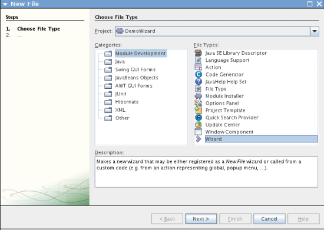

Click Next.

[start=2]
1. In the Wizard Type panel, type 2 in the "Number of Wizard Panels" field, and leave the other values unchanged:

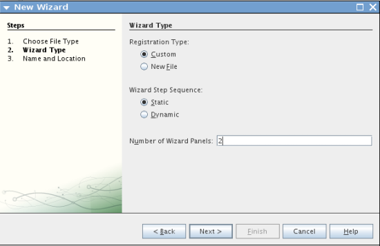

The fields in the panel above are as follows:

* *Registration Type.* Determines where the user will access the wizard. If you select "Custom", the Wizard wizard will create a new action class that you can use to open and initialize your wizard. If you select "New File", the Wizard wizard will register your wizard in the module's  ``layer.xml``  file.
* *Wizard Step Sequence.* Determines whether the wizard will be linear or whether the user of the wizard will be able to skip wizard steps, depending on choices made earlier in the wizard. Linear wizards are 'Static', which is the default, while wizards with skippable steps require a custom iterator class, which is created if you select 'Dynamic'.
* *Number of Wizard Panels.* Determines the number of wizard panels that will be created. For each wizard step, two Java files will be created—a view and a controller.

Click Next.

[start=3]
1. In the Name and Location panel, type  ``Demo``  in the Class Name Prefix and select the main package from the Package drop-down list:

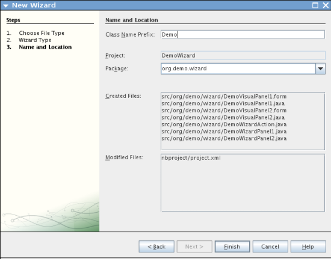

Click Finish.

In the Projects window, you should now see this:

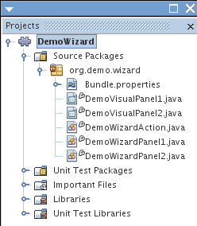

== Registering the Wizard Action Class

In this section, we modify the Action class and register it in the  ``layer.xml``  file.

[start=1]
1. Open the  ``DemoWizardAction.java``  file and replace all the code with the following:

[source,java]
----

package org.demo.wizard;

import java.awt.Component;
import java.awt.Dialog;
import java.awt.event.ActionEvent;
import java.awt.event.ActionListener;
import java.text.MessageFormat;
import javax.swing.JComponent;
import org.openide.DialogDisplayer;
import org.openide.WizardDescriptor;

public final class DemoWizardAction implements ActionListener {

    private WizardDescriptor.Panel[] panels;

    public void actionPerformed(ActionEvent e) {
        WizardDescriptor wizardDescriptor = new WizardDescriptor(getPanels());
        // {0} will be replaced by WizardDesriptor.Panel.getComponent().getName()
        wizardDescriptor.setTitleFormat(new MessageFormat("{0}"));
        wizardDescriptor.setTitle("Your wizard dialog title here");
        Dialog dialog = DialogDisplayer.getDefault().createDialog(wizardDescriptor);
        dialog.setVisible(true);
        dialog.toFront();
        boolean cancelled = wizardDescriptor.getValue() != WizardDescriptor.FINISH_OPTION;
        if (!cancelled) {
            // do something
        }
    }

    /**
     * Initialize panels representing individual wizard's steps and sets
     * various properties for them influencing wizard appearance.
     */
    private WizardDescriptor.Panel[] getPanels() {
        if (panels == null) {
            panels = new WizardDescriptor.Panel[]{
                        new DemoWizardPanel1(),
                        new DemoWizardPanel2()
                    };
            String[] steps = new String[panels.length];
            for (int i = 0; i < panels.length; i++) {
                Component c = panels[i].getComponent();
                // Default step name to component name of panel. Mainly useful
                // for getting the name of the target chooser to appear in the
                // list of steps.
                steps[i] = c.getName();
                if (c instanceof JComponent) { // assume Swing components
                    JComponent jc = (JComponent) c;
                    // Sets step number of a component
                    // TODO if using org.openide.dialogs >= 7.8, can use WizardDescriptor.PROP_*:
                    jc.putClientProperty("WizardPanel_contentSelectedIndex", new Integer(i));
                    // Sets steps names for a panel
                    jc.putClientProperty("WizardPanel_contentData", steps);
                    // Turn on subtitle creation on each step
                    jc.putClientProperty("WizardPanel_autoWizardStyle", Boolean.TRUE);
                    // Show steps on the left side with the image on the background
                    jc.putClientProperty("WizardPanel_contentDisplayed", Boolean.TRUE);
                    // Turn on numbering of all steps
                    jc.putClientProperty("WizardPanel_contentNumbered", Boolean.TRUE);
                }
            }
        }
        return panels;
    }

    public String getName() {
        return "Start Sample Wizard";
    }

}

----

We're using the same code as was generated, except that we're implementing  ``ActionListener``  instead of  ``CallableSystemAction`` . We're doing this because  ``ActionListener``  is a standard JDK class, while  ``CallableSystemAction``  isn't. Since NetBeans Platform 6.5, it is possible to use the standard JDK class instead, which is more convenient and requires less code.

[start=2]
1. Register the action class in the  ``layer.xml``  file like this:

[source,xml]
----

<filesystem>
    <folder name="Actions">
        <folder name="File">
            <file name="org-demo-wizard-DemoWizardAction.instance">
                <attr name="delegate" newvalue="org.demo.wizard.DemoWizardAction"/>
                <attr name="iconBase" stringvalue="org/demo/wizard/icon.png"/>
                <attr name="instanceCreate" methodvalue="org.openide.awt.Actions.alwaysEnabled"/>
                <attr name="noIconInMenu" stringvalue="false"/>
            </file>
        </folder>
    </folder>
    <folder name="Toolbars">
        <folder name="File">
            <file name="org-demo-wizard-DemoWizardAction.shadow">
                <attr name="originalFile" stringvalue="Actions/File/org-demo-wizard-DemoWizardAction.instance"/>
                <attr name="position" intvalue="0"/>
            </file>
        </folder>
    </folder>
</filesystem>

----

The "iconBase" element points to an image named "icon.png" in your main package. Use your own image with that name, making sure that it is 16x16 pixels in size, or use this one: 

[start=3]
1. Run the module. The application starts up and you should see your button in the toolbar where you specified it to be in the  ``layer.xml``  file:

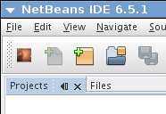

Click the button and the wizard appears:

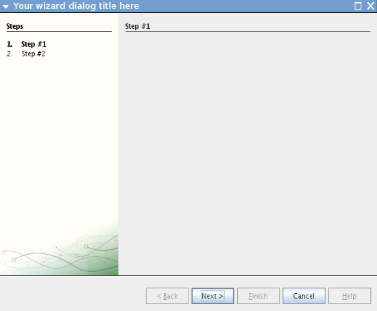

Click Next and notice that in the final panel the Finish button is enabled:

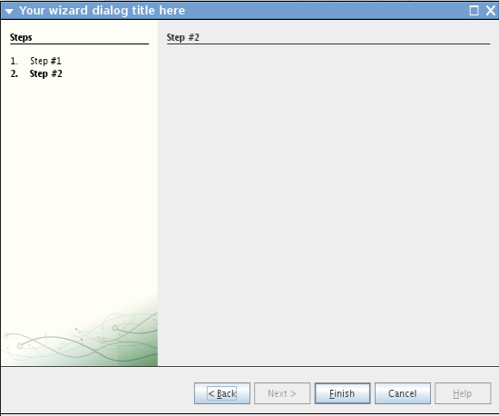

Now that the wizard infrastructure is functioning, let's add some content.

== Designing the Wizard Content

In this section, we add content to the wizard and customize its basic features.

[start=1]
1. Open the  ``DemoWizardAction.java``  file and notice that you can set a variety of customization properties for the wizard:

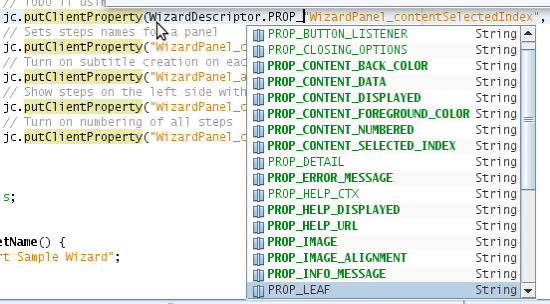

Read about these properties  link:http://ui.netbeans.org/docs/ui_apis/wide/index.html[here].

[start=2]
1. In  ``DemoWizardAction.java`` , change  ``wizardDescriptor.setTitle``  to the following:

[source,java]
----

wizardDescriptor.setTitle("Music Selection");

----

[start=3]
1. Open the  ``DemoVisualPanel1.java``  file and the  ``DemoVisualPanel2.java``  file and use the "Matisse" GUI Builder to add some Swing components, such as the following:

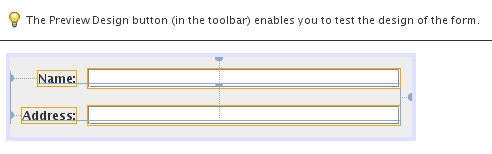

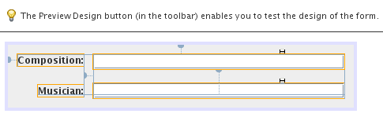

Above, you see  ``DemoVisualPanel1.java``  file and the  ``DemoVisualPanel2.java`` , with some Swing components.

[start=4]
1. Open the two panels in the Source view and change their  ``getName()``  methods to "Name and Address" and "Musician Details", respectively.

[start=5]
1. 
Run the module again. When you open the wizard, you should see something like this, depending on the Swing components you added and the customizations you provided:

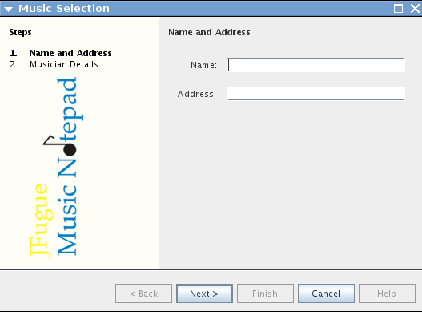

The image in the left sidebar of the wizard above is set in the  ``DemoWizardAction.java``  file, like this:

[source,java]
----

wizardDescriptor.putProperty("WizardPanel_image", ImageUtilities.loadImage("org/demo/wizard/banner.png", true));

----

Now that you have designed the wizard content, let's add some code for processing the data that the user will enter.

== Processing User Data

In this section, you learn how to pass user data from panel to panel and how to display the results to the user when Finish is clicked.

[start=1]
1. In the  ``WizardPanel``  classes, use the  ``storeSettings``  method to retrieve the data set in the visual panel. For example, create getters in the  ``DemoVisualPanel1.java``  file and then access them like this from the  ``DemoWizardPanel1.java``  file:

[source,java]
----

public void storeSettings(Object settings) {
    ((WizardDescriptor) settings).putProperty("name", ((DemoVisualPanel1)getComponent()).getNameField());
    ((WizardDescriptor) settings).putProperty("address", ((DemoVisualPanel1)getComponent()).getAddressField());
}

----

[start=2]
1. Next, use the  ``DemoWizardAction.java``  file to retrieve the properties you have set and do something with them:

[source,java]
----

public void actionPerformed(ActionEvent e) {
    WizardDescriptor wizardDescriptor = new WizardDescriptor(getPanels());
    // {0} will be replaced by WizardDesriptor.Panel.getComponent().getName()
    wizardDescriptor.setTitleFormat(new MessageFormat("{0}"));
    wizardDescriptor.setTitle("Music Selection");
    Dialog dialog = DialogDisplayer.getDefault().createDialog(wizardDescriptor);
    dialog.setVisible(true);
    dialog.toFront();
    boolean cancelled = wizardDescriptor.getValue() != WizardDescriptor.FINISH_OPTION;
    if (!cancelled) {
        *String name = (String) wizardDescriptor.getProperty("name");
        String address = (String) wizardDescriptor.getProperty("address");
        DialogDisplayer.getDefault().notify(new NotifyDescriptor.Message(name + " " + address));*
    }
}

----

The  ``NotifyDescriptor``  can be used in other ways too, as indicated by the code completion box:

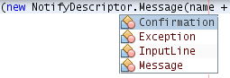

You now know how to process data entered by the user.

== Validating User Data

In this section, you learn how to validate the user input when "Next" is clicked in the wizard.

[start=1]
1. In  ``DemoWizardPanel1`` , change the class signature, implementing  ``WizardDescriptor.ValidatingPanel``  instead of  ``WizardDescriptor.Panel`` :

[source,java]
----

public class DemoWizardPanel1 implements WizardDescriptor.ValidatingPanel

----

[start=2]
1. At the top of the class, change the  ``JComponent``  declaration to a typed declaration:

[source,java]
----

private DemoVisualPanel1 component;

----

[start=3]
1. Implement the required abstract method like this:

[source,java]
----

@Override
public void validate() throws WizardValidationException {

    String name = component.getNameTextField().getText();
    if (name.equals("")){
        throw new WizardValidationException(null, "Invalid Name", null);
    }

}

----

[start=4]
1. Run the module. Click "Next", without entering anything in the "Name" field, and you should see the result below. Also, note that you are not able to move to the next panel, as a result of the validation having failed:

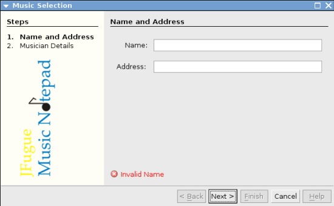

[start=5]
1. Optionally, disable the "Next" button if the name field is empty. Start by declaring a boolean at the top of the class:

[source,java]
----

private boolean isValid = true;

----

Then override  ``isValid()``  like this:

[source,java]
----

@Override
public boolean isValid() {
    return isValid;
}

----

And, when  ``validate()``  is called, which is when the "Next" button is clicked, return false:

[source,java]
----

@Override
public void validate() throws WizardValidationException {

    String name = component.getNameTextField().getText();
    if (name.equals("")) {
        *isValid = false;*
        throw new WizardValidationException(null, "Invalid Name", null);
    }

}

----

Alternatively, set the boolean to false initially. Then implement  ``DocumentListener`` , add a listener on the field and, when the user types something in the field, set the boolean to true and call  ``isValid()`` .

You now know how to validate data entered by the user.

For more information on validating user input, see Tom Wheeler's sample at the end of this tutorial.

== Persisting Data Across Restarts

In this section, you learn how to store the data when the application closes and retrieve it when the wizard opens after a new start.

[start=1]
1. In  ``DemoWizardPanel1.java``  override the  ``readSettings``  and the  ``storeSettings``  methods as follows:

[source,java]
----

*JTextField nameField = ((DemoVisualPanel1) getComponent()).getNameTextField();
JTextField addressField = ((DemoVisualPanel1) getComponent()).getAddressTextField();*

@Override
public void readSettings(Object settings) {
    *nameField.setText(NbPreferences.forModule(DemoWizardPanel1.class).get("namePreference", ""));
    addressField.setText(NbPreferences.forModule(DemoWizardPanel1.class).get("addressPreference", ""));*
}

@Override
public void storeSettings(Object settings) {
    ((WizardDescriptor) settings).putProperty("name", nameField.getText());
    ((WizardDescriptor) settings).putProperty("address", addressField.getText());
    *NbPreferences.forModule(DemoWizardPanel1.class).put("namePreference", nameField.getText());
    NbPreferences.forModule(DemoWizardPanel1.class).put("addressPreference", addressField.getText());*
}

----

[start=2]
1. Run the module again and type a name and address in the first panel of the wizard:

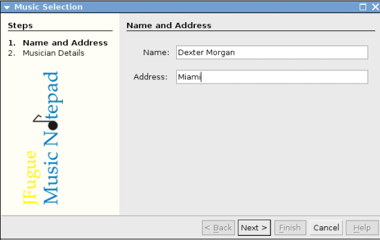

[start=3]
1. Close the application, open the Files window, and look in the properties file within the application's  ``build``  folder. You should now find settings like this:

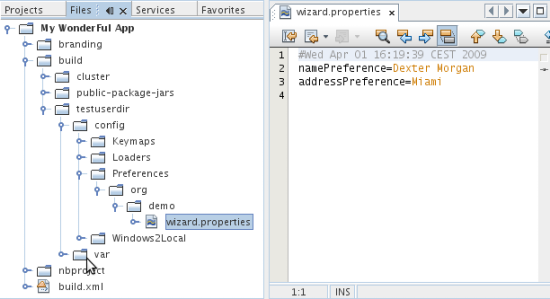

[start=4]
1. Run the application again and, when you next open the wizard, the settings specified above are automatically used to define the values in the fields in the wizard.

You now know how to persist wizard data across restarts.

== Branding the Wizard

In this section, you brand the "Next" button's string, which is provided by the wizard infrastructure, to "Advance".

The term "branding" implies customization, i.e., typically these are minor modifications within the same language, while "internationalization" or "localization" implies translation into another language. For information on localization of NetBeans modules,  link:http://translatedfiles.netbeans.org/index-l10n.html[go here].

[start=1]
1. In the Files window, expand the application's  ``branding``  folder and then create the folder/file structure highlighted below:

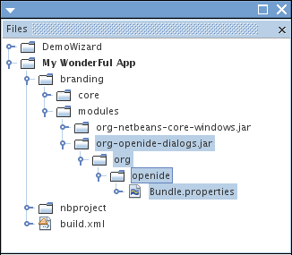

[start=2]
1. Define the content of the file as follows:

[source,java]
----

CTL_NEXT=&amp;Advance >

----

Other strings you might like to brand are as follows:

[source,java]
----

CTL_CANCEL
CTL_PREVIOUS
CTL_FINISH
CTL_ContentName

----

The key "CTL_ContentName" is set to "Steps" by default, which is used in the left panel of the wizard,if the "WizardPanel_autoWizardStyle" property has not been set to "FALSE".

[start=3]
1. Run the application and the "Next" button will be branded to "Advance":

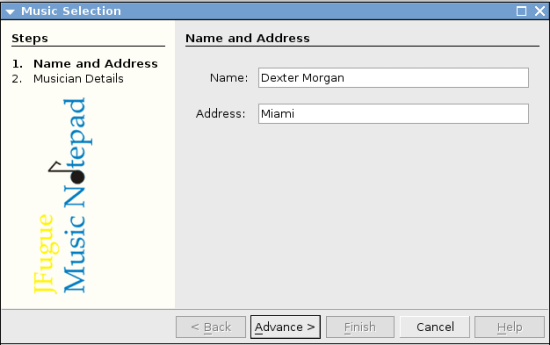

Optionally, use the  ``DemoWizardAction.java``  file, as described earlier, to remove the whole left side of the wizard as follows:

[source,java]
----

 wizardDescriptor.putProperty("WizardPanel_autoWizardStyle", Boolean.FALSE);

----

The above setting results in a wizard that looks as follows:

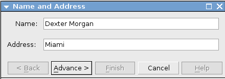

You now know how to brand the strings defined in the wizard infrastructure with your own branded versions.

== Further Reading

Several pieces of related information are available on-line:

* Tom Wheeler's NetBeans Site (click the image below):

[.feature]
--
image::images/wizard_tom.png[role="left", link="http://www.tomwheeler.com/netbeans/"]
--

Even though it was written for NetBeans 5.5, the above sample has been successfully tried in NetBeans IDE 6.5.1 on Ubuntu Linux with JDK 1.6.

The sample is especially useful in showing how to validate user data.

* Geertjan's Blog:
*  link:http://blogs.oracle.com/geertjan/entry/how_wizards_work[How Wizards Work: Part 1—Introduction]
*  link:http://blogs.oracle.com/geertjan/entry/how_wizards_work_part_2[How Wizards Work: Part 2—Different Types ]
*  link:http://blogs.oracle.com/geertjan/entry/how_wizards_work_part_3[How Wizards Work: Part 3—Your First Wizard]
*  link:http://blogs.oracle.com/geertjan/entry/how_wizards_work_part_4[How Wizards Work: Part 4—Your Own Iterator ]
*  link:http://blogs.oracle.com/geertjan/entry/how_wizards_work_part_5[How Wizards Work: Part 5—Reusing and Embedding Existing Panels ]
*  link:http://blogs.oracle.com/geertjan/entry/creating_a_better_java_class[Creating a Better Java Class Wizard]

== Versioning

|===
|*Version* |*Date* |*Changes* 

|1 |31 March 2009 |Initial version. To do:

* [.line-through]#Add a section on validating user input.#
* [.line-through]#Add a section on storing/retrieving data to/from the wizard.#
* Add a table listing all the WizardDescriptor properties.
* Add a table listing &amp; explaining all the Wizard API classes.
* Add links to Javadoc.
 

|2 |1 April 2009 |Added a validation section, with code for disabling the Next button. Also added persistence section. 

|3 |10 April 2009 |Integrated comments by Tom Wheeler, rewriting the branding section to actually be about branding, with a reference to the location where localization info can be found. 
|===
