// 
//     Licensed to the Apache Software Foundation (ASF) under one
//     or more contributor license agreements.  See the NOTICE file
//     distributed with this work for additional information
//     regarding copyright ownership.  The ASF licenses this file
//     to you under the Apache License, Version 2.0 (the
//     "License"); you may not use this file except in compliance
//     with the License.  You may obtain a copy of the License at
// 
//       http://www.apache.org/licenses/LICENSE-2.0
// 
//     Unless required by applicable law or agreed to in writing,
//     software distributed under the License is distributed on an
//     "AS IS" BASIS, WITHOUT WARRANTIES OR CONDITIONS OF ANY
//     KIND, either express or implied.  See the License for the
//     specific language governing permissions and limitations
//     under the License.
//

= NetBeans Platform CRUD Application Tutorial
:jbake-type: platform_tutorial
:jbake-tags: tutorials 
:jbake-status: published
:syntax: true
:source-highlighter: pygments
:toc: left
:toc-title:
:icons: font
:experimental:
:description: NetBeans Platform CRUD Application Tutorial - Apache NetBeans
:keywords: Apache NetBeans Platform, Platform Tutorials, NetBeans Platform CRUD Application Tutorial

This tutorial shows you how to integrate a Java DB database into a NetBeans Platform application. We start by exploring a Java DB database, from which we create entity classes. Though the starting point of this tutorial is Java DB, be aware that these instructions are not applicable to Java DB only. Rather, they are relevant to any relational database supported by NetBeans IDE.

NOTE:  Though the database access part of this tutorial is fine for smaller applications, there are many other factors to be aware of in the context of larger real-life scenarios. It is important to be aware of these factors, aspects of which are described  link:http://blog.schauderhaft.de/2008/09/28/hibernate-sessions-in-two-tier-rich-client-applications/[here].

Once we have code for accessing the database, we wrap the entity classes into a module, together with modules for the related JPA JARS. Once the data access module is part of our application, we create a new module that provides the user interface for our application. The new module gives the user a tree hierarchy showing data from the database. We then create another module that lets the user edit the data displayed by the first module. By separating the viewer from the editor in distinct modules, we will enable the user to install a different editor for the same viewer, since different editors could be created by external vendors, some commercially and some for free. It is this flexibility that the modular architecture of the NetBeans Platform makes possible.

Once we have an editor, we begin adding CRUD functionality. First, the "R", standing for "Read", is handled by the viewer described above. Next, the "U" for "Update" is handled, followed by the "C" for "Create", and the "D" for "Delete".

At the end of the tutorial, you will have learned about a range of NetBeans Platform features that help you in creating applications of this kind. For example, you will have learned about the  `` link:http://bits.netbeans.org/dev/javadoc/org-openide-awt/org/openide/awt/UndoRedo.Manager.html[UndoRedo.Manager]``  and the  `` link:http://bits.netbeans.org/dev/javadoc/org-openide-explorer/org/openide/explorer/ExplorerManager.html[ExplorerManager]`` , as well as NetBeans Platform Swing components, such as  `` link:http://bits.netbeans.org/dev/javadoc/org-openide-windows/org/openide/windows/TopComponent.html[TopComponent]``  and  `` link:http://bits.netbeans.org/dev/javadoc/org-openide-explorer/org/openide/explorer/view/BeanTreeView.html[BeanTreeView]`` .

NOTE:  This document assumes the NetBeans IDE 7.0 Release. If you are using an earlier version, see the  link:691/nbm-crud.html[previous version of this document].

The application you create in this tutorial will look as follows:

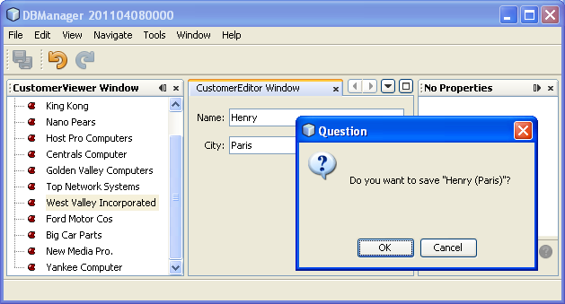

It is advisable to watch the screencast series  link:https://netbeans.apache.org/tutorials/nbm-10-top-apis.html[Top 10 NetBeans APIs] before beginning to work on this tutorial. Many of the concepts addressed in this tutorial are discussed in more detail within the screencast series.

== Setting up the Application

Let's start by creating a new NetBeans Platform application.

[start=1]
1. Choose File > New Project (Ctrl+Shift+N). Under Categories, select NetBeans Modules. Under Projects, select NetBeans Platform Application. Click Next.

[start=2]
1. In the Name and Location panel, type  ``DBManager``  in the Project Name field. Click Finish.

The IDE creates the  ``DBManager``  project. The project is a container for all the other modules you will create:

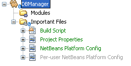

== Integrating the Database

In order to integrate the database, you need to create entity classes from your database and integrate those entity classes, together with their related JARs, into modules as part of your NetBeans Platform application.

=== Creating the Entity Classes

In this section, you generate entity classes from a selected database.

[start=1]
1. Let's start by using the IDE to inspect the database that we will use in our application. Use the Services window (Ctrl-5) to connect to the sample database that is included with NetBeans IDE:

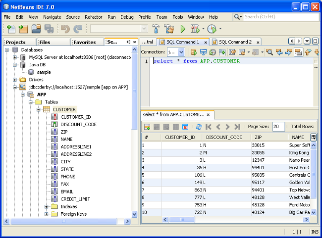

Alternatively, use any database you like and adapt the steps that follow to your particular use case. For Oracle Database, see  link:https://netbeans.apache.org/kb/docs/ide/oracle-db.html[Connecting to an Oracle Database]; for MySQL, see  link:https://netbeans.apache.org/kb/docs/ide/mysql.html[Connecting to a MySQL Database] for help.

[start=2]
1. Now we will create a library that will contain entity classes for the tables that we're interested in for our application. In the IDE, choose File | New Project, followed by Java | Java Class Library and create a new library project, anywhere on disk, named  ``CustomerLibrary`` :

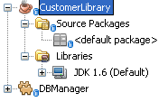

[start=3]
1. In the Projects window, right-click the `CustomerLibrary` project and choose File | New File, followed by Persistence | "Entity Classes from Database". In the wizard, select your database and the tables you need. Here we choose "Customer", and then "Discount Code" is added automatically, since there is a relationship between these two tables:

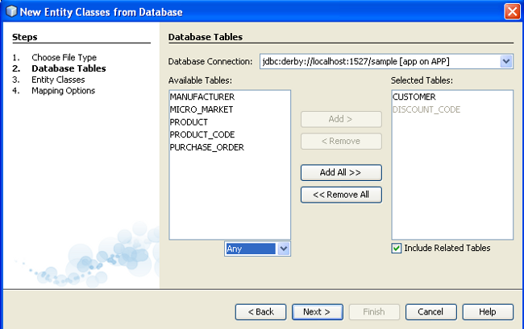

Click Next.

[start=4]
1. Type "demo" as the name of the package where the entity classes will be generated and leave everything else unchanged:

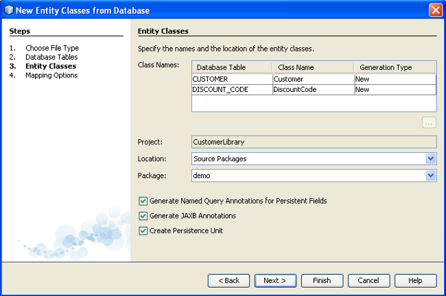

[start=5]
1. Click Finish. Once you have completed this step, look at the generated code and notice that, among other files, you now have a `persistence.xml` file in a folder called META-INF, as well as entity classes for each of your tables:

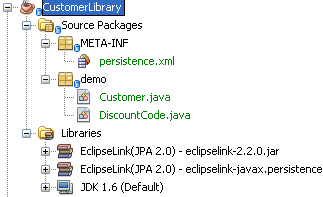

[start=6]
1. Right-click and then build the `CustomerLibrary`. Switch to the Files window (Ctrl-2) and notice that you have a JAR file in the library project's "dist" folder:

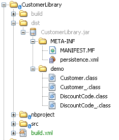

=== Wrapping the Entity Class JAR in a Module

In this section, you add your first module to your application! The new NetBeans module will wrap the JAR file you created in the previous section.

[start=1]
1. Right-click the  ``DBManager`` 's "Modules" node in the Projects window and choose Add New Library.

[start=2]
1. In the "New Library Wrapper Module Project" dialog, select the JAR you created in the previous subsection. No need to include a license; leave the License field empty. Complete the wizard, specifying any values you like. Let's assume the application is for dealing with customers at shop.org, in which case a unique identifier `org.shop.model` is appropriate for the code name base, since this module provides the model (also known as "domain") of the application:

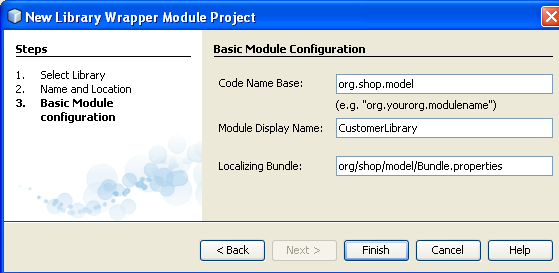

You now have your first custom module in your new application, which wraps the JAR containing the entity classes and the persistence.xml file:

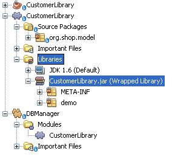

=== Creating Other Related Modules

In this section, you create two new modules, wrapping the EclipseLink JARs, as well as the database connector JAR.

[start=1]
1. Do the same as you did when creating the library wrapper for the entity class JAR, but this time for the EclipseLink JARs, which are in the NetBeans IDE installation directory, within the " ``java/modules/ext`` " folder, as shown below:

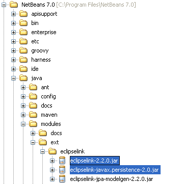

In the Library Wrapper Module wizard, you can use Ctrl-Click to select multiple JARs.

[start=2]
1. Next, create yet another library wrapper module, this time for the Java DB client JAR, which is named  ``derbyclient.jar`` . The location of this JAR depends on your version of the JDK, as well as on your operating system. For example, on Linux systems, this JAR could be found within your JDK distribution at  ``"db/lib/derbyclient.jar"`` . On Windows systems, depending on your version of the JDK, you could find this JAR here, instead, i.e., at " ``C:\Program Files\Sun\JavaDB\lib`` ":

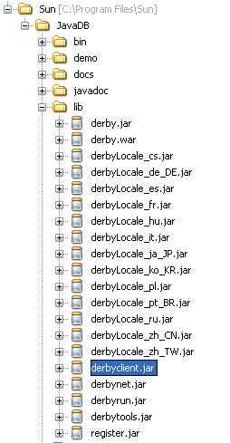

To use an embedded Java DB database, instead of the external Java DB database used in this tutorial,  link:http://blogs.oracle.com/geertjan/entry/embedded_database_for_netbeans_platform[read this article].

[start=3]
1. Your application structure should now be as shown below. You should see that you have an application that contains three modules. One module contains the customer library, while the other two contain the  ``EclipeLink``  JARs and the Derby Client JAR:

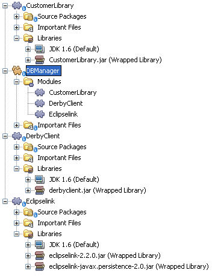

Now it is, finally, time to do some coding!

=== Designing the User Interface

In this section, you create a simple prototype user interface, providing a window that uses a  ``JTextArea``  to display data retrieved from the database.

[start=1]
1. Right-click the  ``DBManager`` 's Modules node in the Projects window and choose Add New. Create a new module named  ``CustomerViewer`` , with the code name base  ``org.shop.viewer`` . Click Finish. You now have a fourth module in your application.

[start=2]
1. In the Projects window, right-click the new module and choose New | Window. Specify that it should be created in the  ``explorer``  position and that it should open when the application starts. Set  ``CustomerViewer``  as the window's class name prefix. Click Finish.

[start=3]
1. Use the Palette (Ctrl-Shift-8) to drag and drop a  ``JTextArea``  on the new window:

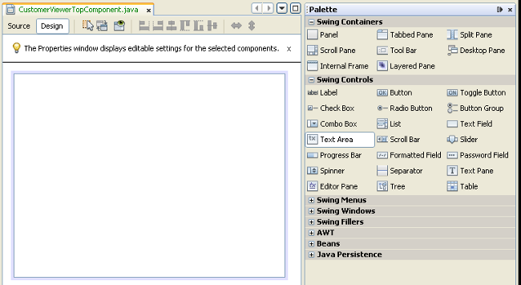

[start=4]
1. Click the "Source" tab and the source code of the  ``TopComponent``  opens. Add this to the end of the TopComponent constructor:

[source,java]
----

EntityManager entityManager = Persistence.createEntityManagerFactory("CustomerLibraryPU").createEntityManager();
Query query = entityManager.createQuery("SELECT c FROM Customer c");
List<Customer> resultList = query.getResultList();
for (Customer c : resultList) {
  jTextArea1.append(c.getName() + " (" + c.getCity() + ")" + "\n");
}
----

Since you have not set dependencies on the modules that provide the Customer object and the persistence JARs, the statements above will be marked with red error underlines. These will be fixed in the section that follows.

Above, you can see references to a persistence unit named "CustomerLibraryPU", which is the name set in the  ``persistence.xml``  file. In addition, there is a reference to one of the entity classes, called  ``Customer`` , which is in the entity classes module. Adapt these bits to your needs, if they are different to the above.

=== Setting Dependencies

In this section, you enable some of the modules to use code from some of the other modules. You do this very explicitly by setting intentional contracts between related modules, i.e., as opposed to the accidental and chaotic reuse of code that tends to happen when you do not have a strict modular architecture such as that provided by the NetBeans Platform.

[start=1]
1. The entity classes module needs to have dependencies on the Derby Client module as well as on the EclipseLink module. Right-click the  ``CustomerLibrary``  module, choose Properties, and use the Libraries tab to set dependencies on the two modules that the  ``CustomerLibrary``  module needs.

[start=2]
1. The  ``CustomerViewer``  module needs a dependency on the EclipseLink module as well as on the entity classes module. Right-click the  ``CustomerViewer``  module, choose Properties, and use the Libraries tab to set dependencies on the two modules that the  ``CustomerViewer``  module needs.

[start=3]
1. Open the  ``CustomerViewerTopComponent``  in the Source view, right-click in the editor, and choose "Fix Imports". The IDE is now able to add the required import statements, because the modules that provide the required classes are now available to the  ``CustomerViewerTopComponent`` . The import statememts you should now have are as follows:

[source,java]
----

import demo.Customer;
import java.util.List;
import javax.persistence.EntityManager;
import javax.persistence.Persistence;
import javax.persistence.Query;
import org.openide.util.NbBundle;
import org.openide.windows.TopComponent;
import org.netbeans.api.settings.ConvertAsProperties;
import org.openide.awt.ActionID;
import org.openide.awt.ActionReference;
----

You now have set contracts between the modules in your application, giving you control over the dependencies between distinct pieces of code.

=== Running the Prototype

In this section, you run the application so that you can see that you're correctly accessing your database.

[start=1]
1. Start your database server.

[start=2]
1. Run the application. You should see this:

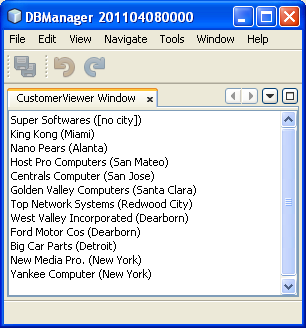

You now have a simple prototype, consisting of a NetBeans Platform application that displays data from your database, which you will extend in the next section.

== Integrating CRUD Functionality

In order to create CRUD functionality that integrates smoothly with the NetBeans Platform, some very specific NetBeans Platform coding patterns need to be implemented. The sections that follow describe these patterns in detail.

=== Read

In this section, you change the  ``JTextArea`` , introduced in the previous section, for a NetBeans Platform explorer view. NetBeans Platform explorer views are Swing components that integrate better with the NetBeans Platform than standard Swing components do. Among other things, they support the notion of a context, which enables them to be context sensitive.

Representing your data, you will have a generic hierarchical model provided by a NetBeans Platform  ``Node``  class, which can be displayed by any of the NetBeans Platform explorer views. This section ends with an explanation of how to synchronize your explorer view with the NetBeans Platform Properties window.

[start=1]
1. In your  ``TopComponent`` , delete the  ``JTextArea``  in the Design view and comment out its related code in the Source view:

[source,java]
----

EntityManager entityManager =  Persistence.createEntityManagerFactory("CustomerLibraryPU").createEntityManager();
Query query = entityManager.createQuery("SELECT c FROM Customer c");
List<Customer> resultList = query.getResultList();
//for (Customer c : resultList) {
//    jTextArea1.append(c.getName() + " (" + c.getCity() + ")" + "\n");
//}
----

[start=2]
1. Right-click the  ``CustomerViewer``  module, choose Properties, and use the Libraries tab to set dependencies on the Nodes API and the Explorer &amp; Property Sheet API.

[start=3]
1. Next, change the class signature to implement  ``ExplorerManager.Provider`` :

[source,java]
----

final class CustomerViewerTopComponent extends TopComponent implements ExplorerManager.Provider
----

You will need to override  ``getExplorerManager()`` 

[source,java]
----

@Override
public ExplorerManager getExplorerManager() {
    return em;
}
----

At the top of the class, declare and initialize the  ``ExplorerManager`` :

[source,java]
----

private static ExplorerManager em = new ExplorerManager();
----

Watch  link:https://netbeans.apache.org/tutorials/nbm-10-top-apis.html[Top 10 NetBeans APIs] for details on the above code, especially the screencast dealing with the Nodes API and the Explorer &amp; Property Sheet API.

[start=4]
1. Switch to the  ``TopComponent``  Design view, right-click in the Palette, choose Palette Manager | Add from JAR. Then browse to the  ``org-openide-explorer.jar`` , which is in  ``platform/modules``  folder, within the NetBeans IDE installation directory. Choose the BeanTreeView and complete the wizard. You should now see  ``BeanTreeView``  in the Palette. Drag it from the Palette and drop it on the window.

[start=5]
1. Create a factory class that will create a new  link:http://bits.netbeans.org/dev/javadoc/org-netbeans-modules-db/org/netbeans/api/db/explorer/node/BaseNode.html[BeanNode] for each customer in your database:

[source,java]
----

import demo.Customer;
import java.beans.IntrospectionException;
import java.util.List;
import org.openide.nodes.BeanNode;
import org.openide.nodes.ChildFactory;
import org.openide.nodes.Node;
import org.openide.util.Exceptions;

public class CustomerChildFactory extends ChildFactory<Customer> {

    private List<Customer> resultList;

    public CustomerChildFactory(List<Customer> resultList) {
        this.resultList = resultList;
    }

    @Override
    protected boolean createKeys(List<Customer> list) {
        for (Customer Customer : resultList) {
            list.add(Customer);
        }
        return true;
    }

    @Override
    protected Node createNodeForKey(Customer c) {
        try {
            return new BeanNode(c);
        } catch (IntrospectionException ex) {
            Exceptions.printStackTrace(ex);
            return null;
        }
    }

}
----

[start=6]
1. Back in the  ``CustomerViewerTopComponent`` , use the  ``ExplorerManager``  to pass the result list from the JPA query in to the  ``Node`` :

[source,java]
----

EntityManager entityManager =  Persistence.createEntityManagerFactory("CustomerLibraryPU").createEntityManager();
Query query = entityManager.createQuery("SELECT c FROM Customer c");
List<Customer> resultList = query.getResultList();
*em.setRootContext(new AbstractNode(Children.create(new CustomerChildFactory(resultList), true)));*
//for (Customer c : resultList) {
//    jTextArea1.append(c.getName() + " (" + c.getCity() + ")" + "\n");
//}
----

[start=7]
1. Run the application. Once the application is running, open the Properties window. Notice that even though the data is available, displayed in a  ``BeanTreeView`` , the  ``BeanTreeView``  is not synchronized with the Properties window, which is available via Window | Properties. In other words, nothing is displayed in the Properties window when you move up and down the tree hierarchy.

[start=8]
1. Synchronize the Properties window with the  ``BeanTreeView``  by adding the following to the constructor in the  ``TopComponent`` :

[source,java]
----

associateLookup(ExplorerUtils.createLookup(em, getActionMap()));
----

Here we add the  ``TopComponent`` 's  ``ActionMap``  and  ``ExplorerManager``  to the  ``Lookup``  of the  ``TopComponent`` . A side effect of this is that the Properties window starts displaying the display name and tooltip text of the selected  ``Node`` .

[start=9]
1. Run the application again and notice that the Properties window (available from the Window menu) is now synchronized with the explorer view:

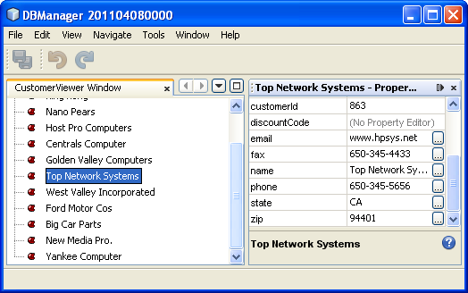

Now you are able to view your data in a tree hierarchy, as you would be able to do with a  ``JTree`` . However, you're also able to swap in a different explorer view without needing to change the model at all because the  ``ExplorerManager``  mediates between the model and the view. Finally, you are now also able to synchronize the view with the Properties window.

=== Update

In this section, you first create an editor. The editor will be provided by a new NetBeans module. So, you will first create a new module. Then, within that new module, you will create a new  ``TopComponent`` , containing two  ``JTextFields`` , for each of the columns you want to let the user edit. You will need to let the viewer module communicate with the editor module. Whenever a new  ``Node``  is selected in the viewer module, you will add the current  ``Customer``  object to the  ``Lookup`` . In the editor module, you will listen to the  ``Lookup``  for the introduction of  ``Customer``  objects. Whenever a new  ``Customer``  object is introduced into the  ``Lookup`` , you will update the  ``JTextFields``  in the editor.

Next, you will synchronize your  ``JTextFields``  with the NetBeans Platform's Undo, Redo, and Save functionality. In other words, when the user makes changes to a  ``JTextField`` , you want the NetBeans Platform's existing functionality to become available so that, instead of needing to create new functionality, you'll simply be able to hook into the NetBeans Platform's support. To this end, you will need to use the  ``UndoRedoManager`` , together with the  ``SaveCookie`` .

[start=1]
1. Create a new module, named  ``CustomerEditor`` , with  ``org.shop.editor``  as its code name base.

[start=2]
1. Right-click the  ``CustomerEditor``  module and choose New | Window. Make sure to specify that the window should appear in the  ``editor``  position and that it should open when the application starts. In the final panel of the wizard, set "CustomerEditor" as the class name prefix.

[start=3]
1. Use the Palette (Ctrl-Shift-8) to add two  ``JLabels``  and two  ``JTextFields``  to the new window. Set the texts of the labels to "Name" and "City" and set the variable names of the two  ``JTextFields``  to  ``nameField``  and  ``cityField`` . In the GUI Builder, the window should now look something like this:

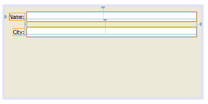

[start=4]
1. Run the application and make sure that you see the following when the application starts up:

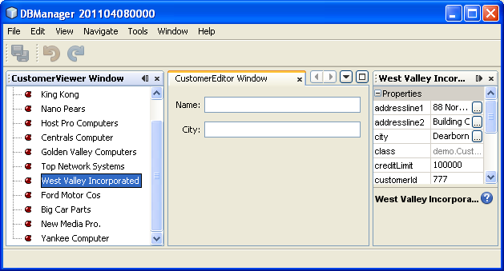

[start=5]
1. Now we can start adding some code. Firstly, we need to show the currently selected Customer object in the editor:

* Start by tweaking the  ``CustomerViewer``  module so that the current  ``Customer``  object is added to the viewer window's  ``Lookup``  whenever a new  ``Node``  is selected. Do this by adding the current  ``Customer``  object to the  ``Lookup``  of the Node, as follows (note the parts in bold):

[source,java]
----

@Override
protected Node createNodeForKey(Customer c) {
    try {
        return *new CustomerBeanNode(c);*
    } catch (IntrospectionException ex) {
        Exceptions.printStackTrace(ex);
        return null;
    }
}

*private class CustomerBeanNode extends BeanNode {
    public CustomerBeanNode(Customer bean) throws IntrospectionException {
        super(bean, Children.LEAF, Lookups.singleton(bean));
    }
}*
----

Now, whenever a new  ``Node``  is created, which happens when the user selects a new customer in the viewer, a new  ``Customer``  object is added to the  ``Lookup``  of the  ``Node`` .

* Let's now change the editor module in such a way that its window will end up listening for  ``Customer``  objects being added to the  ``Lookup`` . First, set a dependency in the editor module on the module that provides the entity class, as well as the module that provides the persistence JARs.

* Next, change the  ``CustomerEditorTopComponent``  class signature to implement  ``LookupListener`` :

[source,java]
----

public final class CustomerEditorTopComponent extends TopComponent implements LookupListener
----

* Override the  ``resultChanged``  so that the  ``JTextFields``  are updated whenever a new  ``Customer``  object is introduced into the  ``Lookup`` :

[source,java]
----

@Override
public void resultChanged(LookupEvent lookupEvent) {
    Lookup.Result r = (Lookup.Result) lookupEvent.getSource();
    Collection<Customer> coll = r.allInstances();
    if (!coll.isEmpty()) {
        for (Customer cust : coll) {
            nameField.setText(cust.getName());
            cityField.setText(cust.getCity());
        }
    } else {
        nameField.setText("[no name]");
        cityField.setText("[no city]");
    }
}
----

* Now that the  ``LookupListener``  is defined, we need to add it to something. Here, we add it to the  ``Lookup.Result``  obtained from the global context. The global context proxies the context of the selected  ``Node`` . For example, if "Ford Motor Co" is selected in the tree hierarchy, the  ``Customer``  object for "Ford Motor Co" is added to the  ``Lookup``  of the  ``Node``  which, because it is the currently selected  ``Node`` , means that the  ``Customer``  object for "Ford Motor Co" is now available in the global context. That is what is then passed to the  ``resultChanged`` , causing the text fields to be populated.

All of the above starts happening, i.e., the  ``LookupListener``  becomes active, whenever the editor window is opened, as you can see below:

[source,java]
----

@Override
public void componentOpened() {
    result = Utilities.actionsGlobalContext().lookupResult(Customer.class);
    result.addLookupListener(this);
    resultChanged(new LookupEvent(result));
}

@Override
public void componentClosed() {
    result.removeLookupListener(this);
    result = null;
}
----

Since the editor window is opened when the application starts, the  ``LookupListener``  is available at the time that the application starts up.

* Finally, declare the result variable at the top of the class, like this:

[source,java]
----

private Lookup.Result result = null;
----

* Run the application again and notice that the editor window is updated whenever you select a new  ``Node`` :

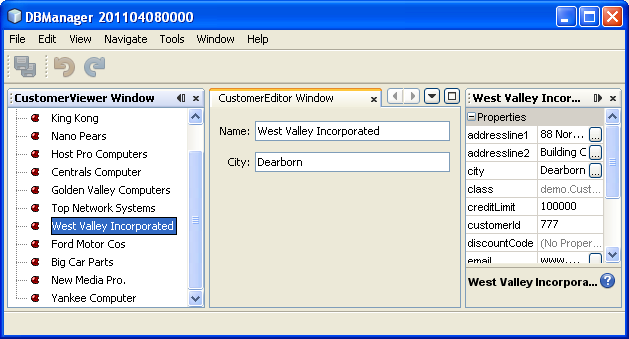

However, note what happens when you switch the focus to the editor window:

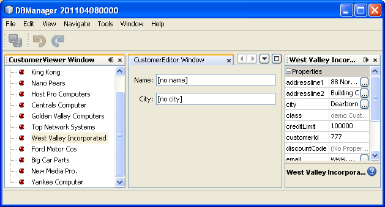

Because the  ``Node``  is no longer current, the  ``Customer``  object is no longer in the global context. This is the case because, as pointed out above, the global context proxies the  ``Lookup``  of the current  ``Node`` . Therefore, in this case, we cannot use the global context. Instead, we will use the local  ``Lookup``  provided by the Customer window.

Rewrite this line:

[source,java]
----

result = Utilities.actionsGlobalContext().lookupResult(Customer.class);
----

To this:

[source,java]
----

result = WindowManager.getDefault().findTopComponent("CustomerViewerTopComponent").getLookup().lookupResult(Customer.class);
----

The string "CustomerViewerTopComponent" is the ID of the  ``CustomerViewerTopComponent`` , which is a string constant that you can find in the source code of the  ``CustomerViewerTopComponent`` .

One drawback of the approach above is that now our  ``CustomerEditorTopComponent``  only works if it can find a  ``TopComponent``  with the ID "CustomerViewerTopComponent". Either this needs to be explicitly documented, so that developers of alternative editors can know that they need to identify the viewer  ``TopComponent``  this way, or you need to rewrite the selection model,  link:http://weblogs.java.net/blog/timboudreau/archive/2007/01/how_to_replace.html[as described here] by Tim Boudreau.

[start=6]
1. Secondly, let's work on the Undo/Redo functionality. What we'd like to have happen is that whenever the user makes a change to one of the  ``JTextFields`` , the "Undo" button and the "Redo" button, as well as the related menu items in the Edit menu, become enabled. To that end, the NetBeans Platform makes the  link:http://bits.netbeans.org/dev/javadoc/org-openide-awt/org/openide/awt/UndoRedo.Manager.html[UndoRedo.Manager] available.
* Declare and instantiate a new  ``UndoRedoManager``  at the top of the  ``CustomerEditorTopComponent`` :

[source,java]
----

private UndoRedo.Manager manager = new UndoRedo.Manager();
----

* Next, override the  ``getUndoRedo()``  method in the  ``CustomerEditorTopComponent`` :

[source,java]
----

@Override
public UndoRedo getUndoRedo() {
    return manager;
}
----

* In the constructor of the  ``CustomerEditorTopComponent`` , add a  ``KeyListener``  to the  ``JTextFields``  and, within the related methods that you need to implement, add the  ``UndoRedoListeners`` :

[source,java]
----

nameField.getDocument().addUndoableEditListener(manager);
cityField.getDocument().addUndoableEditListener(manager);
                            
----

* Run the application and try out the Undo and Redo features, the buttons as well as the menu items. The functionality works exactly as you would expect:

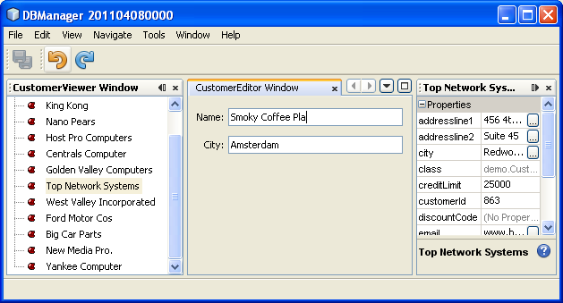

You might want to change the  ``KeyListener``  so that not ALL keys cause the undo/redo functionality to be enabled. For example, when Enter is pressed, you probably do not want the undo/redo functionality to become available. Therefore, tweak the code above to suit your business requirements.

[start=7]
1. Thirdly, we need to integrate with the NetBeans Platform's Save functionality:
* Set dependencies on the Dialogs API and the Nodes API.

* In the  ``CustomerEditorTopComponent``  constructor, add a call to fire a method (which will be defined in the next step) whenever a change is detected:

[source,java]
----

    private final InstanceContent content;
    private final CustomerSaveCapability impl;

    public CustomerEditorTopComponent() {

        ...
        ...
        ...

        nameField.getDocument().addDocumentListener(new DocumentListener() {
            public void insertUpdate(DocumentEvent arg0) {
                fire(true);
            }
            public void removeUpdate(DocumentEvent arg0) {
                fire(true);
            }
            public void changedUpdate(DocumentEvent arg0) {
                fire(true);
            }
        });

        cityField.getDocument().addDocumentListener(new DocumentListener() {
            public void insertUpdate(DocumentEvent arg0) {
                fire(true);
            }
            public void removeUpdate(DocumentEvent arg0) {
                fire(true);
            }
            public void changedUpdate(DocumentEvent arg0) {
                fire(true);
            }
        });

        //Create a new instance of our SaveCookie implementation:
        impl = new CustomerSaveCapability();

        //Create a new instance of our dynamic object:
        content = new InstanceContent();

        //Add the dynamic object to the TopComponent Lookup:
        associateLookup(new AbstractLookup(content));

    }

    ...
    ...
    ...
                            
----

* Here is the method and inner class referred to above. First, the method that is fired whenever a change is detected. Then, an implementation of the  ``SaveCookie``  from the Nodes API is dynamically added to the  ``InstanceContent``  whenever a change is detected:

[source,java]
----

public void fire(boolean modified) {
    if (modified) {
        //If the text is modified,
        //we add SaveCookie impl to Lookup:
        content.add(impl);
    } else {
        //Otherwise, we remove the SaveCookie impl from the lookup:
        content.remove(impl);
    }
}

private class CustomerSaveCapability implements SaveCookie {

    @Override
    public void save() throws IOException {

       Confirmation message = new NotifyDescriptor.Confirmation("Do you want to save \""
                + nameField.getText() + " (" + cityField.getText() + ")\"?",
                NotifyDescriptor.OK_CANCEL_OPTION,
                NotifyDescriptor.QUESTION_MESSAGE);

        Object result = DialogDisplayer.getDefault().notify(message);
        //When user clicks "Yes", indicating they really want to save,
        //we need to disable the Save action,
        //so that it will only be usable when the next change is made
        //to the JTextArea:
        if (NotifyDescriptor.YES_OPTION.equals(result)) {
            fire(false);
            //Implement your save functionality here.
        }
    }

}

                            
----

* Run the application and notice the enablement/disablement of the Save menu item.

Do not confuse the "Save All" button and menu item with the "Save" button and menu item. In this tutorial, we're focusing on the "Save" action, which by default is invoked from the File menu. If needed, you can tweak the central registry to register the Save action so that it is displayed in the toolbar.

Right now, nothing happens when you click OK in the "Question" dialog above. In the next step, we add some JPA code for handling persistence of our changes.

* Next, we add JPA code for persisting our change. Do so by replacing the comment "//Implement your save functionality here." The comment should be replaced by all of the following:

[source,java]
----

EntityManager entityManager = Persistence.createEntityManagerFactory("CustomerLibraryPU").createEntityManager();
entityManager.getTransaction().begin();
Customer c = entityManager.find(Customer.class, customer.getCustomerId());
c.setName(nameField.getText());
c.setCity(cityField.getText());
entityManager.getTransaction().commit();
----

The "customer" in  ``customer.getCustomerId()()``  is currently undefined. Add the line in bold in the  ``resultChanged``  below, after declaring  ``Customer customer;``  at the top of the class, so that the current  ``Customer``  object sets the  ``customer`` , which is then used in the persistence code above to obtain the ID of the current  ``Customer``  object.

[source,java]
----

@Override
public void resultChanged(LookupEvent lookupEvent) {
    Lookup.Result r = (Lookup.Result) lookupEvent.getSource();
    Collection<Customer> c = r.allInstances();
    if (!c.isEmpty()) {
        for (Customer customer : c) {
            *customer = cust;*
            nameField.setText(customer.getName());
            cityField.setText(customer.getCity());
        }
    } else {
        nameField.setText("[no name]");
        cityField.setText("[no city]");
    }
}
----

* Run the application and change some data. Currently, we have no "Refresh" functionality (that will be added in the next step) so, to see the changed data, restart the application.

[start=8]
1. Fourthly, we need to add functionality for refreshing the Customer viewer. You might want to add a  ``Timer``  which periodically refreshes the viewer. However, in this example, we will add a "Refresh" menu item to the Root node so that the user will be able to manually refresh the viewer.
* In the main package of the  ``CustomerViewer``  module, create a new  ``Node`` , which will replace the  ``AbstractNode``  that we are currently using as the root of the children in the viewer. Note that we also bind all actions in the "Actions/Customer" folder to the context menu of our new root node.

[source,java]
----

import java.util.List;
import javax.swing.Action;
import org.openide.nodes.AbstractNode;
import org.openide.nodes.Children;
import org.openide.util.NbBundle.Messages;
import org.openide.util.Utilities;
import static org.shop.viewer.Bundle.*;

public class CustomerRootNode extends AbstractNode {

    @Messages("CTRL_RootName=Root")
    public CustomerRootNode(Children kids) {
        super(kids);
        setDisplayName(CTRL_RootName());
    }

    @Override
    public Action[] getActions(boolean context) {
        List actionsForCustomer = Utilities.actionsForPath("Actions/Customer");
        return actionsForCustomer.toArray(new Action[actionsForCustomer.size()]);
    }

}
----

* Then create a new Java class and register a refresh Action in the "Actions/Customer" folder, which means it will appear in the context menu of the root node that you created above:

[source,java]
----

import java.awt.event.ActionEvent;
import java.awt.event.ActionListener;
import org.openide.awt.ActionID;
import org.openide.awt.ActionRegistration;
import org.openide.util.NbBundle.Messages;

@ActionID(id="org.shop.viewer.CustomerRootRefreshAction", category="Customer")
@ActionRegistration(displayName="#CTL_CustomerRootRefreshAction")
@Messages("CTL_CustomerRootRefreshAction=Refresh")
public class CustomerRootRefreshAction implements ActionListener {

    @Override
    public void actionPerformed(ActionEvent e) {
        CustomerViewerTopComponent.refreshNode();
    }
    
}
----

* Add this method to the  ``CustomerViewerTopComponent`` , for refreshing the view:

[source,java]
----

public static void refreshNode() {
    EntityManager entityManager = Persistence.createEntityManagerFactory("CustomerLibraryPU").createEntityManager();
    Query query = entityManager.createQuery("SELECT c FROM Customer c");
    List<Customer> resultList = query.getResultList();
    em.setRootContext(new *CustomerRootNode*(Children.create(new CustomerChildFactory(resultList), true)));
} 
----

Now replace the code above in the constructor of the  ``CustomerViewerTopComponent``  with a call to the above. As you can see in the highlighted part above, we are now using our  ``CustomerRootNode``  instead of the  ``AbstractNode`` . The  ``CustomerRootNode``  includes the "Refresh" action, which calls the code above.

* In your save functionality, add the call to the method above so that, whenever data is saved, an automatic refresh takes place. You can take different approaches when implementing this extension to the save functionality. For example, you might want to create a new module that contains the refresh action. That module would then be shared between the viewer module and the editor module, providing functionality that is common to both.

* Run the application again and notice that you have a new root node, with a "Refresh" action.

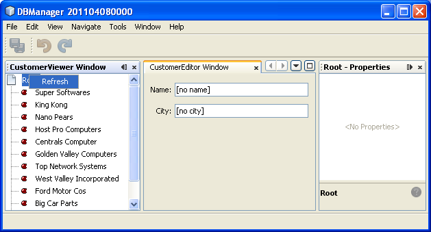

* Make a change to some data, save it, invoke the Refresh action, and notice that the viewer is updated.

You have now learned how to let the NetBeans Platform handle changes to the  ``JTextFields`` . Whenever the text changes, the NetBeans Platform Undo and Redo buttons are enabled or disabled. Also, the Save button is enabled and disabled correctly, letting the user save changed data back to the database.

=== Create

In this section, you allow the user to create a new entry in the database.

[start=1]
1. In the  ``CustomerEditor``  module create a new Java class named "CustomerNewAction". Let the  ``TopComponent``  be opened via this Action, together with emptied  ``JTextFields`` :

[source,java]
----

import java.awt.event.ActionEvent;
import java.awt.event.ActionListener;
import org.openide.awt.ActionID;
import org.openide.awt.ActionRegistration;
import org.openide.util.NbBundle.Messages;
import org.openide.windows.WindowManager;

@ActionID(id="org.shop.editor.CustomerNewAction", category="File")
@ActionRegistration(displayName="#CTL_CustomerNewAction")
@Messages("CTL_CustomerNewAction=Refresh")
public final class CustomerNewAction implements ActionListener {

    @Override
    public void actionPerformed(ActionEvent e) {
        CustomerEditorTopComponent tc = (CustomerEditorTopComponent) WindowManager.getDefault().findTopComponent("CustomerEditorTopComponent");
        tc.resetFields();
        tc.open();
        tc.requestActive();
    }

}
----

In the  ``CustomerEditorTopComponent`` , add the following method for resetting the  ``JTextFields``  and creating a new  ``Customer``  object:

[source,java]
----

public void resetFields() {
    customer = new Customer();
    nameField.setText("");
    cityField.setText("");
}
----

[start=2]
1. In the  ``SaveCookie`` , ensure that a return of  ``null``  indicates that a new entry is saved, instead of an existing entry being updated:

[source,java]
----

public void save() throws IOException {

    Confirmation message = new NotifyDescriptor.Confirmation("Do you want to save \""
                    + nameField.getText() + " (" + cityField.getText() + ")\"?",
                    NotifyDescriptor.OK_CANCEL_OPTION,
                    NotifyDescriptor.QUESTION_MESSAGE);

    Object result = DialogDisplayer.getDefault().notify(msg);

    //When user clicks "Yes", indicating they really want to save,
    //we need to disable the Save button and Save menu item,
    //so that it will only be usable when the next change is made
    //to the text field:
    if (NotifyDescriptor.YES_OPTION.equals(result)) {
        fire(false);
        EntityManager entityManager = Persistence.createEntityManagerFactory("CustomerLibraryPU").createEntityManager();
        entityManager.getTransaction().begin();
        *if (customer.getCustomerId() != null)* {
            Customer c = entityManager.find(Customer.class, cude.getCustomerId());
            c.setName(nameField.getText());
            c.setCity(cityField.getText());
            entityManager.getTransaction().commit();
        } else {
            *Query query = entityManager.createQuery("SELECT c FROM Customer c");
            List<Customer> resultList = query.getResultList();
            customer.setCustomerId(resultList.size()+1);
            customer.setName(nameField.getText());
            customer.setCity(cityField.getText());
            //add more fields that will populate all the other columns in the table!
            entityManager.persist(customer);
            entityManager.getTransaction().commit();*
        }
    }

}
----

[start=3]
1. Run the application again and add a new customer to the database.

=== Delete

In this section, let the user delete a selected entry in the database. Using the concepts and code outlined above, implement the Delete action yourself.

[start=1]
1. Create a new action,  ``DeleteAction`` . Decide whether you want to bind it to a Customer node or whether you'd rather bind it to the toolbar, the menu bar, keyboard shortcut, or combinations of these. Depending on where you want to bind it, you will need to use a different approach in your code. Read the tutorial again for help, especially by looking at how the "New" action was created, while comparing it to the "Refresh" action on the root node.

[start=2]
1. Get the current  ``Customer``  object, return an 'Are you sure?' dialog, and then delete the entry. For help on this point, read the tutorial again, focusing on the part where the "Save" functionality is implemented. Instead of saving, you now want to delete an entry from the database.

== Further Reading

This concludes the NetBeans Platform CRUD Tutorial. This document has described how to create a new NetBeans Platform application with CRUD functionality for a given database.

A problem with the design of the application you created in this tutorial is that the data access code is embedded within the user interface. For example, the calls to the `EntityManager` for persisting changes are found within the `TopComponent`. To work towards an architecture that enables a clean separation between data access code and the user interface, see this series of articles:

*  link:http://netbeans.dzone.com/loosely-coupled-reloadable-capabilities[Loosely Coupled Reloadable Capabilities for CRUD Applications]
*  link:http://netbeans.dzone.com/loosely-coupled-saveable-capabilities[Loosely Coupled Saveable Capabilities for CRUD Applications]
*  link:http://netbeans.dzone.com/loosely-coupled-creatable-capabilities[Loosely Coupled Creatable Capabilities for CRUD Applications]
*  link:http://netbeans.dzone.com/loosely-coupled-deletable-capabilities[Loosely Coupled Deletable Capabilities for CRUD Applications]
*  link:http://netbeans.dzone.com/loosely-coupled-data-layers[Loosely Coupled Data Layers for CRUD Applications]

For information on embedding a database in a NetBeans Platform application, see  link:http://blogs.oracle.com/geertjan/entry/embedded_database_for_netbeans_platform[Embedded Database for NetBeans Platform CRUD Tutorial ].

For more information about creating and developing applications, see the following resources:

*  link:https://netbeans.apache.org/kb/docs/platform.html[NetBeans Platform Learning Trail]
*  link:http://bits.netbeans.org/dev/javadoc/[NetBeans API Javadoc]
