// 
//     Licensed to the Apache Software Foundation (ASF) under one
//     or more contributor license agreements.  See the NOTICE file
//     distributed with this work for additional information
//     regarding copyright ownership.  The ASF licenses this file
//     to you under the Apache License, Version 2.0 (the
//     "License"); you may not use this file except in compliance
//     with the License.  You may obtain a copy of the License at
// 
//       http://www.apache.org/licenses/LICENSE-2.0
// 
//     Unless required by applicable law or agreed to in writing,
//     software distributed under the License is distributed on an
//     "AS IS" BASIS, WITHOUT WARRANTIES OR CONDITIONS OF ANY
//     KIND, either express or implied.  See the License for the
//     specific language governing permissions and limitations
//     under the License.
//

= 文件类型集成教程
:jbake-type: platform_tutorial
:jbake-tags: tutorials 
:jbake-status: published
:syntax: true
:source-highlighter: pygments
:toc: left
:toc-title:
:icons: font
:experimental:
:description: 文件类型集成教程 - Apache NetBeans
:keywords: Apache NetBeans Platform, Platform Tutorials, 文件类型集成教程

本教程将向您演示如何编写一个模块，以便使 IDE 或构建于 NetBeans 平台之上的任何其他应用程序能够识别新的文件类型。

*注意：*本文档针对的是 NetBeans IDE 6.5 发行版。如果使用的是 NetBeans IDE 6.x，请参见 link:60/nbm-filetype_zh_CN.html[本文档的 6.1 版]。

== 文件类型集成简介

在 IDE 中可识别的文件类型有它们自己的图标、菜单项以及行为。所显示的“文件”是  ``FileObject`` ，即  ``java.io.File``  的包装器；对于配置文件，则为以某种其他方式存储（例如存储在模块的 XML 文件内）的数据的包装器。您实际_看到_的是  ``Node`` ，它们向诸如文件之类的对象提供操作和本地化名称等功能。位于  ``Node``  和  ``FileObject``  之间的是  ``DataObject`` 。 ``DataObject``  与  ``FileObject``  类似，不同之处在于它了解显示的是哪种类型的文件，并且对于具有不同扩展名的文件以及具有不同名称空间的 XML 文件，通常存在不同类型的  ``DataObject`` 。每个  ``DataObject``  都是由一个不同的模块提供的，每个模块支持一种或多种文件类型，例如，通过图像模块可以识别和打开  ``.gif``  和  ``.png``  文件。

用于识别文件类型的模块会安装一个  ``DataLoader`` ，这是特定于文件类型的  ``DataObject``  工厂。当展开某个文件夹时，IDE 会询问每个已知的  ``DataLoader``  是否了解此文件夹的内容。第一个回答“是”的 DataLoader 将为其中的文件创建  ``DataObject`` 。为了实际显示每个文件的某些内容，系统会对每个  ``DataObject``  调用  ``DataObject.getNodeDelegate()`` ，而  ``Node``  便是您在 IDE 中实际看到的内容。

下图（居左）显示了上面提到的每一项所提供的内容：

image::images/filetype_diagram-dataobject2.png[]

在本教程中，您将创建一个模块，用于为假定的 "Abc" 文件（扩展名为  ``.abc`` ）安装  ``DataLoader`` 。缺省情况下，扩展名为 "abc" 的文件会被视为 IDE 无法识别的任何其他文件；在本教程中，我们将其视为文本文件，因此，IDE 应为 Abc 文件提供与文本文件相同的功能。创建此模块后，我们将向您演示如何用仅供 Abc 文件使用的功能来增强此模块。开发周期完成后，您可以通过以下方法轻松地让其他人使用您的模块：在 IDE 中创建一个二进制文件并将此文件发送给其他人，后者可以通过更新中心来安装此文件。

== 创建模块项目

在此部分，我们将利用向导创建每个 NetBeans 模块所需的源代码结构。源代码结构包含位于特定位置的某些文件夹以及一组始终需要的文件。例如，每个 NetBeans 模块都需要一个  ``nbproject``  文件夹和一个  ``layer.xml``  文件，前者用于存放项目的 meta 数据，后者用于工具栏按钮和窗口等项的声明性注册。

[start=1]
1. 选择“文件”>“新建项目”(Ctrl-Shift-N)。在“类别”下选择“NetBeans 模块”。在“项目”下选择“模块”，然后单击“下一步”。

[start=2]
1. 在“名称和位置”面板的“项目名称”中键入  ``AbcFileType`` 。将项目位置更改为计算机上的任意目录，例如  ``c:\mymodules`` 。将“独立模块”单选按钮保留为选中状态。此面板现在应如下所示：

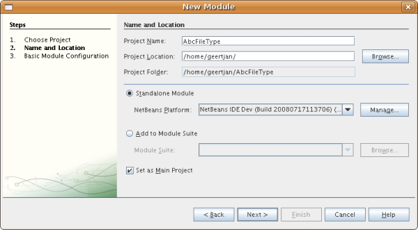

单击“下一步”。

[start=3]
1. 在“基本模块配置”面板的“代码名称基”中键入  ``org.myorg.abcfiletype`` 。在建议的模块显示名称中添加空格，以将其更改为  ``Abc File Type`` 。选中“生成 XML 层”复选框并保留本地化包和 XML 层的位置，以将其存储在名为  ``org/myorg/abcfiletype``  的包中。此面板现在应如下所示：

image::images/filetype_65-projectwizard2.png[]

[start=4]
1. 单击“完成”。

IDE 将创建  ``Abc File Type``  项目。此项目包含所有源代码和项目 meta 数据，例如项目的 Ant 生成脚本。此项目在 IDE 中打开。您可以在“项目”窗口 (Ctrl-1) 中查看其逻辑结构，在“文件”窗口 (Ctrl-2) 中查看其文件结构。例如，“项目”窗口现在应如下所示：

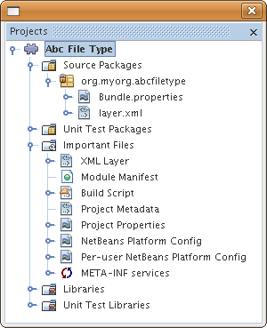

== 识别 Abc 文件

在此部分，我们将利用向导创建区分 Abc 文件和所有其他文件所需的类。在本教程的开头已提到，要实现此目的，我们需要一个数据对象、一个数据加载器、一个 MIME 类型解析器以及  ``layer.xml``  文件中的注册条目。“新建文件类型”向导将自动为我们创建所有这些内容。

[start=1]
1. 右键单击项目节点，然后选择“新建”>“文件类型”。

[start=2]
1. 在“文件识别”面板中，执行以下操作：
* 在“MIME 类型”编辑框中键入  ``text/x-abc`` 。
* 在“按文件扩展名”编辑框中键入  ``.abc .ABC`` 。

“文件识别”面板现在应如下所示：

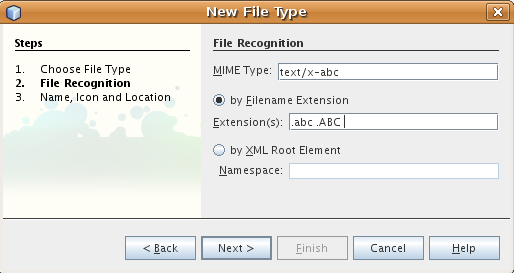

请注意下面提供的有关“文件识别”面板中的字段的说明：

* *MIME 类型。*指定数据对象的唯一 MIME 类型。
* 按
* *文件扩展名。*指定一个或多个文件扩展名，IDE 将这些扩展名识别为属于指定的 MIME 类型。可以选择在文件扩展名前面加一个圆点。分隔符为逗号和/或空格。因此，所有以下内容都是有效的：
*  ``.abc,.def`` 
*  ``.abc .def`` 
*  ``abc def`` 
*  ``abc,.def ghi, .wow`` 

我们假定 Abc 文件区分大小写。为此，在本教程中指定了_两种_ MIME 类型： ``.abc``  和  ``.ABC`` 。

* *XML 根元素。*指定唯一的名称空间，以将该 XML 文件类型与所有其他 XML 文件类型区分开。由于许多 XML 文件具有相同的扩展名 ( ``xml`` )，因此 IDE 通过 XML 根元素来区分各个 XML 文件。更确切地说，就是 IDE 可以区分名称空间以及 XML 文件中的第一个 XML 元素。例如，您可以利用这一点来区分 JBoss 部署描述符和 WebLogic 部署描述符。区分开这两种部署描述符后，便可以确保添加到 JBoss 部署描述符上下文菜单中的菜单项对于 WebLogic 部署描述符不可用。有关示例，请参见  link:nbm-palette-api2.html[NetBeans 组件面板模块教程]。

单击“下一步”。

[start=3]
1. 在“名称和位置”面板的“类名前缀”中键入  ``Abc`` ，然后浏览到任意 16x16 像素的图像文件作为新文件类型的图标，如下所示。

image::images/filetype_65-filewizard2.png[]

*注意：*您可以使用尺寸为 16x16 像素的任意图标。如果愿意，可以单击以下图标并将其保存在本地，然后在上面的向导步骤中指定该图标：
image::images/filetype_Datasource.gif[]

[start=4]
1. 单击“完成”。

“项目”窗口现在应如下所示：

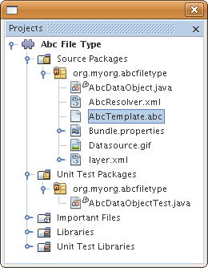

下面简要介绍了每个新生成的文件：

* *AbcDataObject.java。*包装  ``FileObject`` 。DataObject 是由 DataLoader 生成的。有关详细信息，请参见  link:https://netbeans.apache.org/wiki/devfaqdataobject[What is a DataObject?]（什么是 DataObject？）。
* *AbcResolver.xml。*将  ``.abc``  和  ``.ABC``  扩展名映射到 MIME 类型。 ``AbcDataLoader``  仅识别 MIME 类型，而不了解有关文件扩展名的信息。
* *AbcTemplate.abc。*为  ``layer.xml``  中注册的文件模板提供了基础，以便将其作为新模板安装在“新建文件”对话框中。
* *AbcDataObjectTest.java。* ``DataObject``  的 JUnit 测试类。

在  ``layer.xml``  文件中，将会看到以下内容：

[source,xml]
----

<folder name="Loaders">
    <folder name="text">
        <folder name="x-abc">
            <folder name="Actions">
                <file name="org-myorg-abcfiletype-MyAction.shadow">
                    <attr name="originalFile" stringvalue="Actions/Edit/org-myorg-abcfiletype-MyAction.instance"/>
                    <attr name="position" intvalue="600"/>
                </file>
                <file name="org-openide-actions-CopyAction.instance">
                    <attr name="position" intvalue="100"/>
                </file>
                <file name="org-openide-actions-CutAction.instance">
                    <attr name="position" intvalue="200"/>
                </file>
                <file name="org-openide-actions-DeleteAction.instance">
                    <attr name="position" intvalue="300"/>
                </file>
                <file name="org-openide-actions-FileSystemAction.instance">
                    <attr name="position" intvalue="400"/>
                </file>
                <file name="org-openide-actions-OpenAction.instance">
                    <attr name="position" intvalue="500"/>
                </file>
                <file name="org-openide-actions-PropertiesAction.instance">
                    <attr name="position" intvalue="700"/>
                </file>
                <file name="org-openide-actions-RenameAction.instance">
                    <attr name="position" intvalue="800"/>
                </file>
                <file name="org-openide-actions-SaveAsTemplateAction.instance">
                    <attr name="position" intvalue="900"/>
                </file>
                <file name="org-openide-actions-ToolsAction.instance">
                    <attr name="position" intvalue="1000"/>
                </file>
                <file name="sep-1.instance">
                    <attr name="instanceClass" stringvalue="javax.swing.JSeparator"/>
                    <attr name="position" intvalue="1100"/>
                </file>
                <file name="sep-2.instance">
                    <attr name="instanceClass" stringvalue="javax.swing.JSeparator"/>
                    <attr name="position" intvalue="1200"/>
                </file>
                <file name="sep-3.instance">
                    <attr name="instanceClass" stringvalue="javax.swing.JSeparator"/>
                    <attr name="position" intvalue="1300"/>
                </file>
                <file name="sep-4.instance">
                    <attr name="instanceClass" stringvalue="javax.swing.JSeparator"/>
                    <attr name="position" intvalue="1400"/>
                </file>
            </folder>
            <folder name="Factories">
                <file name="AbcDataLoader.instance">
                    <attr name="SystemFileSystem.icon" urlvalue="nbresloc:/org/myorg/abcfiletype/Datasource.gif"/>
                    <attr name="dataObjectClass" stringvalue="org.myorg.abcfiletype.AbcDataObject"/>
                    <attr name="instanceCreate" methodvalue="org.openide.loaders.DataLoaderPool.factory"/>
                    <attr name="mimeType" stringvalue="text/x-abc"/>
                </file>
            </folder>
        </folder>
    </folder>
</folder>
----

== 安装和试用功能

现在，让我们安装该模块，然后使用此前创建的基本功能。IDE 使用 Ant 生成脚本来生成和安装模块。此生成脚本是在创建项目时创建的。

[start=1]
1. 在“项目”窗口中，右键单击 "Abc File Type" 项目，然后选择“运行”。

将启动一个新的 IDE 实例，同时该实例将向其自身安装您的模块。

[start=2]
1. 使用“新建项目”对话框 (Ctrl-Shift-N) 在 IDE 中创建任意类型的应用程序。

[start=3]
1. 右键单击该应用程序节点，然后选择“新建”>“其他”。在“其他”类别中，有一个用于创建新文件类型的模板：

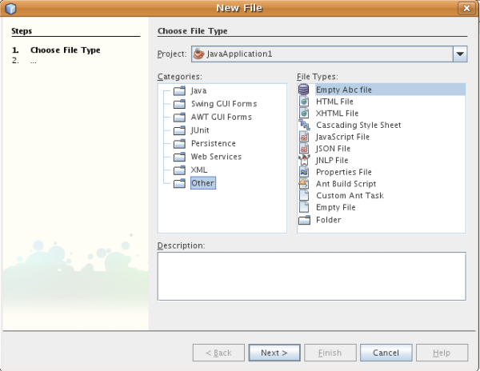

完成向导后，您便创建了一个可用于帮助用户创建给定文件类型的模板。

如果要通过该模板提供缺省代码，请将这些代码添加到“新建文件类型”向导所创建的  ``AbcTemplate.abc``  文件中。

== 为 Abc 文件创建功能

现在 NetBeans 平台能够将 Abc 文件与所有其他类型的文件区分开，接下来应添加特定于该文件类型的功能。在此部分，我们将在从资源管理器窗口（例如，“项目”窗口）右键单击该文件节点所显示的上下文菜单中添加一个菜单项，并使该文件能够在一个窗口中打开，而不是在编辑器中打开。

=== 添加操作

在本小节中，我们将使用“新建操作”向导创建一个 Java 类，用于为我们的文件类型执行操作。此向导还将在  ``layer.xml``  文件中注册该类，以使用户能够在从资源管理器窗口右键单击该文件类型节点所显示的上下文菜单中调用此操作。

[start=1]
1. 右键单击项目节点，然后选择“新建”>“操作”。

[start=2]
1. 在“操作类型”面板中，单击“有条件地启用”。键入  ``AbcDataObject`` ，这是之前由“新建文件类型”向导生成的数据对象的名称，如下所示：

image::images/filetype_60-action1.png[]

单击“下一步”。

[start=3]
1. 在“GUI 注册”面板中，从“类别”下拉列表中选择“编辑”类别。“类别”下拉列表用于控制操作在 IDE 的快捷键编辑器中的显示位置。

接下来，取消选中“全局菜单项”，然后选中“文件类型上下文菜单项”。在“内容类型”下拉列表中，选择您之前在“新建文件类型”向导中指定的 MIME 类型，如下所示：

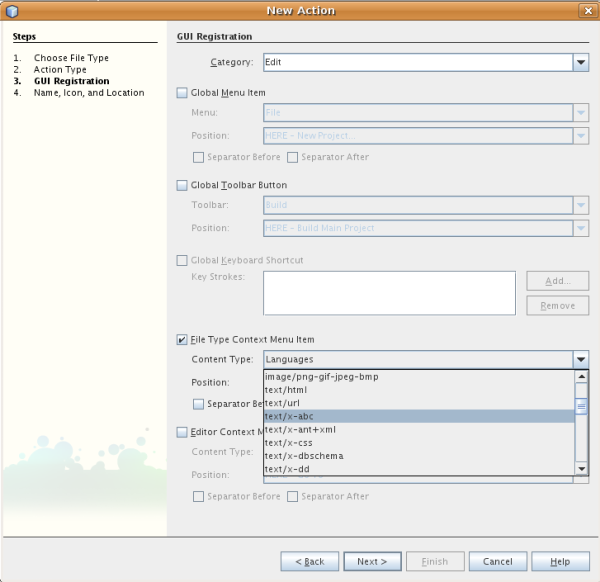

请注意，您可以设置菜单项的位置，并将此菜单项与其前面和后面的菜单项隔开。单击“下一步”。

[start=4]
1. 在“名称和位置”面板的“类名”中键入  ``MyAction`` ，在“显示名称”中键入  ``My Action`` 。上下文菜单提供的菜单项不显示图标。因此，请单击“完成”，此时  ``MyAction.java``  将被添加到  ``org.myorg.abcfiletype``  包中。

[start=5]
1. 在源代码编辑器中，将下面的代码添加到此操作的  ``actionPerformed``  方法中：

[source,java]
----

@Override
public void actionPerformed(ActionEvent ev) {
   FileObject f = context.getPrimaryFile();
   String displayName = FileUtil.getFileDisplayName(f);
   String msg = "I am " + displayName + ". Hear me roar!"; 
        NotifyDescriptor nd = new NotifyDescriptor.Message(msg);
        DialogDisplayer.getDefault().notify(nd);
}
----

按 Ctrl-Shift-I 组合键。IDE 会自动将 import 语句添加到该类的顶部。

某些代码仍带有红色下划线，这表示类路径中并未包括所有需要的包。右键单击项目节点，选择“属性”，然后单击“项目属性”对话框中的“库”。单击“库”窗格顶部的“添加”来添加“对话框 API”。

在  ``MyAction.java``  类中再次按 Ctrl-Shift-I 组合键。红色下划线将会消失，因为 IDE 在对话框 API 中找到了所需的包。

[start=6]
1. 在“重要文件”节点中，展开“XML 层”。"<此层>" 和 "<上下文中的此层>" 这两个节点以及它们的子节点共同组成了 link:https://netbeans.apache.org/tutorials/nbm-glossary.html[系统 Filesystem] 浏览器。展开 "<此层>"，再展开 "Loaders"，继续展开节点，直到显示您之前所创建的操作。

[start=7]
1. 将  ``My Action``  拖放到“打开”操作下方，如下所示：

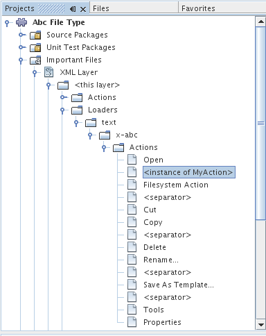

从最后两步可以看出，系统 Filesystem 浏览器可用于快速重组在系统 Filesystem 中注册的各项的顺序。

[start=8]
1. 再次运行该模块，操作方法与上一节相同。

[start=9]
1. 使用上一节中所示的模板创建一个 ABC 文件，然后在某个资源管理器视图（如“项目”窗口或“收藏夹”窗口）中右键单击该文件的节点。

请注意，Abc 文件具有您在其模块中所指定的图标，并且可以从右键单击操作所显示的上下文菜单中使用在其  ``layer.xml``  文件中定义的一系列操作：

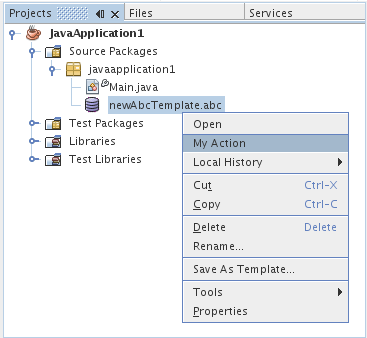

[start=10]
1. 选择新菜单项，将显示 Abc 文件的名称和位置：

image::images/filetype_60-information.png[]

现在，您已了解如何创建在“项目”窗口、“文件”窗口或“收藏夹”窗口内给定类型文件的上下文菜单中显示的新操作。

=== 在窗口中打开文件

缺省情况下，当用户打开在本教程中定义的类型的文件时，该文件将在基本编辑器中打开。但是，有时您可能需要创建文件的可视表示，以使用户能够将小部件拖放到该可视表示上。创建此类用户界面的第一步是，使用户可以在窗口中打开文件。本小节将向您演示如何执行此操作。

[start=1]
1. 右键单击项目节点，然后选择“新建”>“窗口组件”。将“窗口位置”设置为 "editor" 并选中“在应用程序启动时打开”，如下所示：

image::images/filetype_65-topc-1.png[]

[start=2]
1. 单击“下一步”，然后在“类名前缀”中键入 "Abc"：

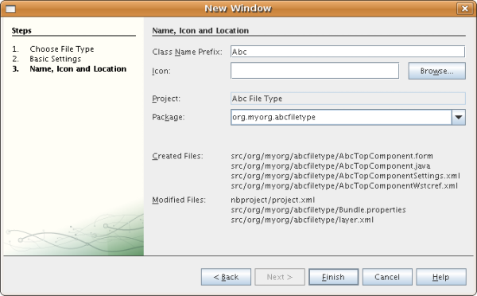

单击“完成”。

[start=3]
1. 按如下所示更改  ``DataObject``  的构造函数，将  ``DataObject``  更改为使用  `` link:http://bits.netbeans.org/dev/javadoc/org-openide-loaders/org/openide/loaders/OpenSupport.html[OpenSupport]``  而不是 DataEditorSupport：

[source,java]
----

public AbcDataObject(FileObject pf, MultiFileLoader loader)
        throws DataObjectExistsException, IOException {

    super(pf, loader);
    CookieSet cookies = getCookieSet();
    *//cookies.add((Node.Cookie) DataEditorSupport.create(this, getPrimaryEntry(), cookies));
    cookies.add((Node.Cookie) new AbcOpenSupport(getPrimaryEntry()));*
              
}
----

[start=4]
1. 创建  `` link:http://bits.netbeans.org/dev/javadoc/org-openide-loaders/org/openide/loaders/OpenSupport.html[OpenSupport]``  类：

[source,java]
----

class AbcOpenSupport extends OpenSupport implements OpenCookie, CloseCookie {

    public AbcOpenSupport(AbcDataObject.Entry entry) {
        super(entry);
    }

    protected CloneableTopComponent createCloneableTopComponent() {
        AbcDataObject dobj = (AbcDataObject) entry.getDataObject();
        AbcTopComponent tc = new AbcTopComponent();
        tc.setDisplayName(dobj.getName());
        return tc;
    }
 
}
----

调整 TopComponent 以扩展 CloneableTopComponent，而不是 TopComponent。将 TopComponent 的类修饰符及其构造函数的修饰符设置为 public 而不是 private。

再次运行该模块，当打开 Abc 文件时， ``OpenSupport``  类便会处理此打开操作，以便在  ``TopComponent``  中打开该文件，而不是在  ``DataEditorSupport``  所提供的基本编辑器中打开：

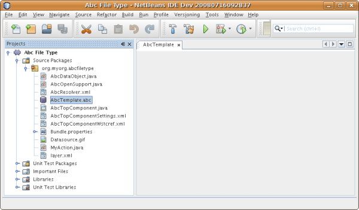

link:https://netbeans.apache.org/tutorials/nbm-visual_library.html[NetBeans 可视库教程]提供了一个进一步开发 TopComponent 的示例，以便以可视方式显示文件内容（与本教程中定义的文件类型对应）。

=== 创建多视图窗口

现在，我们已经能够在窗口中打开文件，接下来我们将使该窗口更加有趣。我们将创建一个多视图窗口。多视图窗口的第一个标签通常用于显示文件的可视表示，第二个标签则通常显示源视图。此外，该窗口也可包含两个以上的标签，每个标签提供有关已打开文件的更为详细的信息。

[start=1]
1. 右键单击项目节点，然后选择“属性”。在“项目属性”对话框中，选择“库”，然后单击“添加”。设置对“ link:http://bits.netbeans.org/dev/javadoc/org-netbeans-core-multiview/overview-summary.html[多视图窗口]”的依赖关系。单击“确定”，然后再次单击“确定”以退出“项目属性”对话框。

[start=2]
1. 对于要在多视图窗口中创建的每个标签，创建一个用于实现  `` link:http://bits.netbeans.org/dev/javadoc/org-netbeans-core-multiview/org/netbeans/core/spi/multiview/MultiViewDescription.html[MultiViewDescription]``  和  ``Serializable``  的类。

就本教程而言，首先将创建一个名为  ``AbcMultiviewDescription1``  的类以实现指定类：

[source,java]
----

public class AbcMultiviewDescription1 implements MultiViewDescription, Serializable {

    public int getPersistenceType() {
        throw new UnsupportedOperationException("Not supported yet.");
    }

    public String getDisplayName() {
        throw new UnsupportedOperationException("Not supported yet.");
    }

    public Image getIcon() {
        throw new UnsupportedOperationException("Not supported yet.");
    }

    public HelpCtx getHelpCtx() {
        throw new UnsupportedOperationException("Not supported yet.");
    }

    public String preferredID() {
        throw new UnsupportedOperationException("Not supported yet.");
    }

    public MultiViewElement createElement() {
        throw new UnsupportedOperationException("Not supported yet.");
    }

}
----

在上述  ``AbcMultiviewDescription1``  类中，方法  ``createElement()``  返回 MultiViewElement。但是，此处需要返回的是  ``TopComponent`` ，这将在下一步中完成。

[start=3]
1. 重写类签名。要为上一步中的描述提供一个多视图元素，我们需要实现  `` link:http://bits.netbeans.org/dev/javadoc/org-netbeans-core-multiview/org/netbeans/core/spi/multiview/MultiViewElement.html[MultiViewElement]`` ：

[source,java]
----

public final class AbcTopComponent extends TopComponent implements MultiViewElement {
----

现在，您需要在  ``TopComponent``  中删除（或注释掉）方法  ``findInstance()`` 、 ``getPersistenceType()`` 、 ``writeReplace()``  和  ``preferredID()`` 。

[start=4]
1. 暂时为每个所需的方法提供非常简单的实现。首先，在  ``TopComponent``  类的顶部定义一个新的  ``JToolbar`` ：

[source,java]
----

private JToolBar toolbar = new JToolBar();
----

接下来，按如下所示实现方法：

[source,java]
----

    public JComponent getVisualRepresentation() {
        return this;
    }

    public JComponent getToolbarRepresentation() {
        return toolbar;
    }

    public void setMultiViewCallback(MultiViewElementCallback arg0) {
    }

    public CloseOperationState canCloseElement() {
        return null;
    }

    public Action[] getActions() {
        return new Action[]{};
    }

    public Lookup getLookup() {
        return Lookups.singleton(this);
    }

    public void componentShowing() {
    }

    public void componentHidden() {
    }

    public void componentActivated() {
    }

    public void componentDeactivated() {
    }

    public UndoRedo getUndoRedo() {
        return UndoRedo.NONE;
    }
----

[start=5]
1. 现在，您可以重新定义  ``AbcMultiviewDescription1`` ，如下所示：

[source,java]
----

public class AbcMultiviewDescription1 implements MultiViewDescription, Serializable {

    public int getPersistenceType() {
        return TopComponent.PERSISTENCE_ALWAYS;
    }

    public String getDisplayName() {
        return "Tab 1";
    }

    public Image getIcon() {
        return ImageUtilities.loadImage("/org/myorg/abcfiletype/Datasource.gif");
    }

    public HelpCtx getHelpCtx() {
        return null;
    }

    public String preferredID() {
       return "AbcMultiviewDescription1";
    }

    public MultiViewElement createElement() {
        return new AbcTopComponent();
    }

}
----

[start=6]
1. 更改  ``OpenSupport``  类中的  ``createCloneableTopComponent``  方法，以通过在上面部分创建的  ``MultiViewDescription``  类打开  ``TopComponent`` ：

[source,java]
----

protected CloneableTopComponent createCloneableTopComponent() {

    // Create an array of multiview descriptors:
    AbcMultiviewDescription1 firstTab = new AbcMultiviewDescription1();
    MultiViewDescription[] descriptionArray = { firstTab };

    // Create the multiview window:
    CloneableTopComponent tc = MultiViewFactory.createCloneableMultiView(descriptionArray, firstTab,  null);
    tc.setDisplayName(entry.getDataObject().getName());
    return tc;

}
----

 ``MultiViewFactory.createCloneableMultiView``  中的第二个参数决定缺省情况下所打开的标签。在本示例中为  ``AbcMultiViewDescription1``  定义的标签  ``firstTab`` 。

[start=7]
1. 再次安装并打开文件。现在，您已创建包含一个标签的多视图窗口：

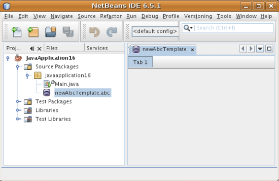

现在，多视图窗口中只有一个标签。对于其他每个标签，创建一个新的  ``MultiviewDescription``  类和一个新的  ``TopComponent`` ，然后实例化  ``OpenSupport``  扩展类中的  ``MultiViewDescription``  类，如上所示。

== 创建可共享的模块二进制文件

该模块现已完成，您可以将其交给其他用户使用了。为此，您需要创建并分发一个二进制 "NBM"（NetBeans 模块）文件。

[start=1]
1. 在“项目”窗口中，右键单击 "Abc File Type" 项目，然后选择“创建 NBM”。

将创建 NBM 文件，您可以在“文件”窗口 (Ctrl-2) 中查看它：

image::images/filetype_60-shareable-nbm.png[]

[start=2]
1. 例如，通过  link:http://plugins.netbeans.org/PluginPortal/[NetBeans 插件门户]向其他人提供该文件。接收者应使用插件管理器（“工具”>“插件”）来安装它。

link:http://netbeans.apache.org/community/mailing-lists.html[请将您的意见和建议发送给我们]

== 后续步骤

有关创建和开发 NetBeans 模块的详细信息，请参见以下资源：

*  link:https://netbeans.apache.org/platform/index.html[NetBeans 平台主页]
*  link:https://bits.netbeans.org/dev/javadoc/[NetBeans API 列表（当前开发版本）]
*  link:https://netbeans.apache.org/kb/docs/platform_zh_CN.html[其他相关教程]

