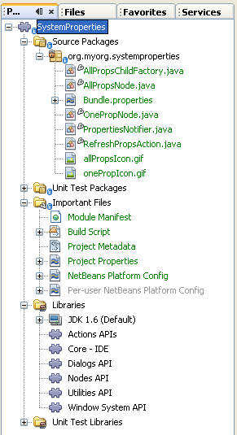
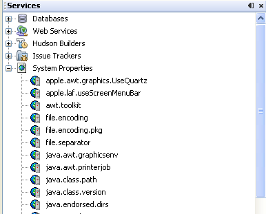

// 
//     Licensed to the Apache Software Foundation (ASF) under one
//     or more contributor license agreements.  See the NOTICE file
//     distributed with this work for additional information
//     regarding copyright ownership.  The ASF licenses this file
//     to you under the Apache License, Version 2.0 (the
//     "License"); you may not use this file except in compliance
//     with the License.  You may obtain a copy of the License at
// 
//       http://www.apache.org/licenses/LICENSE-2.0
// 
//     Unless required by applicable law or agreed to in writing,
//     software distributed under the License is distributed on an
//     "AS IS" BASIS, WITHOUT WARRANTIES OR CONDITIONS OF ANY
//     KIND, either express or implied.  See the License for the
//     specific language governing permissions and limitations
//     under the License.
//

= NetBeans System Properties Module Tutorial
:jbake-type: platform_tutorial
:jbake-tags: tutorials 
:jbake-status: published
:syntax: true
:source-highlighter: pygments
:toc: left
:toc-title:
:icons: font
:experimental:
:description: NetBeans System Properties Module Tutorial - Apache NetBeans
:keywords: Apache NetBeans Platform, Platform Tutorials, NetBeans System Properties Module Tutorial

This tutorial is intended to demonstrate aspects of the  link:https://bits.netbeans.org/dev/javadoc/org-openide-nodes/org/openide/nodes/package-summary.html[NetBeans Nodes API].

NOTE:  This document uses the NetBeans IDE 7.0 Release or above. If you are using an earlier version, see  link:691/nbm-nodesapi.html[the previous version of this document].

== Getting to Know the Sample

This tutorial will help you understand the following:

* how to add a hierarchy of nodes to the Services window
* how to rename and delete nodes
* how to to display subnodes
* how to change the list of nodes
* how to create a property sheet
* how to assign properties
* how to perform other common tasks

Working through this sample is important because the  link:https://bits.netbeans.org/dev/javadoc/org-openide-nodes/org/openide/nodes/package-summary.html[NetBeans Nodes API] is one of the more ubiquitous APIs and reflects information that exists independently of the nodes. You interact through an interface to this live information.

Before you start writing the module, you have to make sure you have all of the necessary software. In addition, you might want to play with the sample before building it yourself. Getting to know the sample lets you know what you are in for during the rest of this tutorial!

=== Installing the Sample

In this section, we download and install the sample, so that we can become acquainted with it before recreating it ourselves.

[start=1]
1. Unzip the  link:images/SystemProperties.zip[attached file].

[start=2]
1. 
In the IDE, choose File > Open Project and browse to the folder that contains the unzipped file. Open the module project. It should look as follows:

[start=3]
1. Right-click the project node and choose Install/Reload in Target Platform. The target platform opens and the module is installed.

=== Introducing the Sample

In this section, we look at the functionality provided by the module, from the perspective of an end user. Once we know in detail what the module will provide, we will be in a better position to build it from scratch.

[start=1]
1. Open the Services window (Ctrl-5) and notice that you have a new node with a large number (~50) of subnodes, each labeled according to a key for specific Java properties:

Contextual menu items appear when you right-click the main node and subnodes. For the subnodes, the Java runtime's generalized properties are used to configure basic mechanisms such as search paths for fonts, location of the Java Virtual Machine (JVM), default locale, and so on. These are typically string keys, similar to  ``name.name.name`` , and an associated string value. Values can be queried or set from within the Java language. In addition, they can be used to set default values at JVM start up. When the System Properties node is extended, it will display one node for each of the keys, each labeled according to the key. For example:

* The value  ``java.vm.vendor``  may display the value Sun Microsystems, Inc., for example.
* The value  ``path.separator``  may display a semicolon, depending on your configuration.
* The value  ``user.language``  may display the value English, depending on your configuration.

[start=2]
1. Play with the sample:
* *Show the property sheet.* Right-click a subnode and choose Properties. The property sheet is displayed with a single Properties tab, containing two properties. The first property is labeled Name and it gives the same name as the node (key), while the other is labeled Value and displays the string value of the property.
* *Rename a property.* Click on a subnode and then click it again. This lets you rename a key in place, while keeping the same value. Alternatively, click on the Name property in the property sheet, or right-click a subnode and choose Rename.
* *Change a value.* Click on the Value tab in the property sheet and type in a new value. This resets the system property to the entered value.
* *Add a property.* Right click the main System Properties node and choose Add System Property. This lets you add a new system property to the list.
* *Delete a property.* Select a property and press Delete. This removes the property.
* *Refresh the list.* Right click the main System Properties node and choose Refresh. This prompts the module to recheck the values, refreshing the list as needed.

=== Introducing the Sources

The System Properties sample consists of main files and supporting files.

* *Main Files.* The module's main files are its Java classes.

The Java classes are introduced in alphabetical order below:

|===
|*File* |*Description* 

| ``AllPropsChildFactory.java``  |This children object is responsible for keeping track of the list of nodes underneath the System Properties node. When first asked for the list, it retrieves all system properties and asks the node implementation to keep track of all the system property names. The interface for doing this is a class called Children. 

| ``AllPropsNode.java``  |This node specifies what children will be under it, and asks to use AllPropsChildFactory to keep track of the list of child nodes. The module takes care of things such as its context menu. 

| ``OnePropNode.java``  |This is the node representing a single property, and is an AbstractNode. Its constructor requires that the user supply the key, in the form of a string. For every system property name, OnePropNode is used to display it. When the user expands the system properties node, it builds a list of keys, then creates a corresponding number of OnePropNodes. Each OnePropNode displays a single key, and does not directly interact with its parent node -- its knowledge is limited to a single system property and how to deal with it, as well as notifying the PropertiesNotifier if there are any changes.This design makes it easier to reuse such nodes, including placing them in other contexts. 

| ``PropertiesNotifier.java``  |Manages routing events whenever there are changes, including adding, deleting, or renaming a property, or when a property value has changed. 

| ``RefreshPropsAction.java``  |This action appears in the pop-up menu under System Properties with the label Refresh. It forces a refresh to occur, updating the display of information based on the current state of system properties. 
|===
* 
*Supporting Files.* The module's supporting files are in the  ``org.myorg.systemproperties``  package and in the Important Files node.

The supporting files in the  ``org.myorg.systemproperties``  package are introduced in alphabetical order below:

|===
|*File* |*Description* 

| ``allPropsIcon.gif``  |Icon for the System Properties node. 

| ``Bundle.properties``  |This is a standard Java properties file, which uses the syntax  ``Key=Value`` . Keys are code names for things that appear in the source code, with values designating those things which will be displayed to the user. This file is useful for localization. For example, by creating a properties file such as  ``Bundle_ja.properties`` , and filling all the values with Japanese, this module will automatically display everything in Japanese, if the user is running the IDE in Japanese mode. 

| ``onePropIcon.gif``  |Icon for subnodes. 
|===

The files in the Important Files node are introduced in the order in which they appear in the Projects window:

|===
|*File* |*Description* 

|Module Manifest |Declares project as module. 

|Build Script |Contains Ant targets for building the project. 

|Project Metadata |Contains project metadata, such as dependencies, for project. 

|Project Properties |Contains project properties. 

|NetBeans Platform Config |Contains platform properties. 

|Per-user NetBeans Platform Config |Contains user-specific properties. 
|===

== Setting Up the Module Project

Before you start writing the module, you have to make sure you that your project is set up correctly. NetBeans IDE provides a wizard that sets up all the basic files needed for a module.

=== Creating the Module Project

In this section, we use the New Module wizard to create the source structure needed by all module projects.

[start=1]
1. Choose File > New Project (Ctrl+Shift+N). Under Categories, select NetBeans Modules. Under Projects, select Module. Click Next.

[start=2]
1. In the Name and Location panel, type  ``SystemProperties``  in the Project Name field. Change the Project Location to any directory on your computer. Make sure that the Standalone Module option and the Set as Main Project checkbox are selected. Click Next.

[start=3]
1. In the Basic Module Configuration panel, type  ``org.myorg.systemproperties``  in Code Name Base.

[start=4]
1. Leave the location of the localizing bundle unchanged. Leave the two checkboxes unchecked. Click Finish.

The IDE creates the  ``System Properties``  project. The project contains all of your sources and project metadata, such as the project's Ant build script. The project opens in the IDE. You can view its logical structure in the Projects window (Ctrl-1) and its file structure in the Files window (Ctrl-2).

=== Specifying the Module's Dependencies

Later, you will need to subclass several classes that belong to NetBeans APIs. Each NetBeans API, provided by a module, has to be declared as a module dependency. Use the Project Properties dialog box for this purpose, as explained below.

[start=1]
1. In the Projects window, right-click the  ``System Properties``  project and choose Properties. In the Project Properties dialog box, click Libraries and then click Add... Start typing 'CallableSystemAction', which is one of the NetBeans API classes you will need later. As you type, notice that the filter narrows, displaying only those modules that can provide the class that you are typing.

[start=2]
1. For each of the following APIs, click "Add..." in the Libraries panel, select the name from the Module list, and then click OK to confirm it:
*  `` link:https://bits.netbeans.org/dev/javadoc/org-openide-actions/overview-summary.html[Actions API]`` 
*  `` link:http://bits.netbeans.org/dev/javadoc/org-netbeans-core-ide/overview-summary.html[Core IDE]`` 
*  `` link:https://bits.netbeans.org/dev/javadoc/org-openide-dialogs/overview-summary.html[Dialogs API]`` 
*  `` link:http://bits.netbeans.org/dev/javadoc/org-openide-util-lookup/overview-summary.html[Lookup API]`` 
*  `` link:https://bits.netbeans.org/dev/javadoc/org-openide-nodes/overview-summary.html[Nodes API]`` 
*  `` link:https://bits.netbeans.org/dev/javadoc/org-openide-util/overview-summary.html[Utilities API]`` 
*  `` link:https://bits.netbeans.org/dev/javadoc/org-openide-windows/overview-summary.html[Window System API]`` 

Click OK to exit the Project Properties dialog box.

[start=3]
1. In the Projects window, double-click Project Metadata and note that the APIs you selected have been declared as Module dependencies.

== Creating the Main Files

The meat of the module is provided by its Java classes. In this section, you will create and examine each of them:

*  ``AllPropsNode.java`` 
*  ``PropertiesNotifier.java`` 
*  ``AllPropsChildFactory.java`` 
*  ``OnePropNode.java`` 
*  ``RefreshPropsAction.java`` 

=== AllPropsNode.java

This Java class specifies the definition of the main node. The definition includes a display name, as well as a definition of the children that will be under the main node. The definition of the children is provided by the  ``AllPropsChildFactory``  class, which keeps track of the list of child nodes. The class also takes care of things such as the main node's context menu.

Do the following:

[start=1]
1. *Create the file.* Right-click the  ``org.myorg.systemproperties``  node and choose New > Other. Under Categories, choose Java Classes. Under File Types, choose Java Class. Click Next and type  ``AllPropsNode``  in Class Name. Click Finish. The new Java class opens in the Source Editor. Replace the default code with the following:

[source,java]
----

import java.io.IOException;
import javax.swing.Action;
import org.netbeans.api.core.ide.ServicesTabNodeRegistration;
import org.openide.DialogDisplayer;
import org.openide.NotifyDescriptor;
import org.openide.actions.NewAction;
import org.openide.actions.OpenLocalExplorerAction;
import org.openide.actions.PropertiesAction;
import org.openide.actions.ToolsAction;
import org.openide.nodes.AbstractNode;
import org.openide.nodes.Children;
import org.openide.nodes.Node;
import org.openide.util.HelpCtx;
import org.openide.util.NbBundle.Messages;
import org.openide.util.actions.SystemAction;
import static org.myorg.systemproperties.Bundle.*;
import org.openide.util.datatransfer.NewType;

@ServicesTabNodeRegistration(name = "AllPropsNode",
displayName = "#LBL_AllPropsNode",
shortDescription = "#HINT_AllPropsNode",
iconResource = "org/myorg/systemproperties/allPropsIcon.gif",
position = 2021)
@Messages({
    "LBL_AllPropsNode=System Properties",
    "HINT_AllPropsNode=Shows all currently set system properties."
})
public class AllPropsNode extends AbstractNode {

    public AllPropsNode() {
        super(Children.create(new AllPropsChildFactory(), false));
        setDisplayName(LBL_AllPropsNode());
        setShortDescription(HINT_AllPropsNode());
        setIconBaseWithExtension("org/myorg/systemproperties/allPropsIcon.gif");
    }

    @Override
    public Action[] getActions(boolean context) {
        Action[] result = new Action[]{
            new RefreshPropsAction(),
            null,
            SystemAction.get(OpenLocalExplorerAction.class),
            null,
            SystemAction.get(NewAction.class),
            null,
            SystemAction.get(ToolsAction.class),
            SystemAction.get(PropertiesAction.class),};
        return result;
    }

    @Override
    public HelpCtx getHelpCtx() {
        return HelpCtx.DEFAULT_HELP;
    }

    @Override
    public Node cloneNode() {
        return new AllPropsNode();
    }

    @Messages({
        "LBL_NewProp=System Property",
        "LBL_NewProp_dialog=Create New Property",
        "MSG_NewProp_dialog_key=New property name:",
        "MSG_NewProp_dialog_value=New property value:"})
    @Override
    public NewType[] getNewTypes() {
        return new NewType[]{
            new NewType() {
                @Override
                public String getName() {
                    return LBL_NewProp();
                }
                @Override
                public void create() throws IOException {
                    NotifyDescriptor.InputLine msg = new NotifyDescriptor.InputLine(LBL_NewProp_dialog(), MSG_NewProp_dialog_key());
                    DialogDisplayer.getDefault().notify(msg);
                    String key = msg.getInputText();
                    if ("".equals(key)) {
                        return;
                    }
                    msg = new NotifyDescriptor.InputLine(MSG_NewProp_dialog_value(), MSG_NewProp_dialog_key());
                    DialogDisplayer.getDefault().notify(msg);
                    String value = msg.getInputText();
                    System.setProperty(key, value);
                    PropertiesNotifier.changed();
                }
            }
        };
    }
    
}
----

[start=2]
1. *Understand the file.* Here is an explanation of the class:
* * ``public class AllPropsNode extends  link:https://bits.netbeans.org/dev/javadoc/org-openide-nodes/org/openide/nodes/AbstractNode.html[AbstractNode]`` .*  ``AbstractNode``  is a generic Node subclass.  `` link:https://bits.netbeans.org/dev/javadocorg-openide-nodes/org/openide/nodes/Node.html[Node]``  is the abstract class,  ``AbstractNode``  is the common implementation that can be customized.
* *Constructor:*
* * ``public AllPropsNode`` .* In creating this node, it first calls super -- the  link:https://bits.netbeans.org/dev/javadoc/org-openide-nodes/org/openide/nodes/AbstractNode.html#AbstractNode(org.openide.nodes.Children)[constructor for the super class (AbstractNode)]. This creates the infrastructure for AbstractNode, and shows that it is mandatory to supply a child object for its use. This object represents the list of children of the node, creating a separate class for clarity: AllPropsChildFactory.
* * `` link:http://bits.netbeans.org/dev/javadoc/org-openide-nodes/org/openide/nodes/AbstractNode.html#setIconBaseWithExtension%28java.lang.String%29[setIconBaseWithExtension]`` .* Designates the location for the associated icon.
* * `` link:https://bits.netbeans.org/dev/javadoc/org-openide-nodes/org/openide/nodes/Node.html#setDisplayName(java.lang.String)[setDisplayName]`` .* Sets the name the user sees. This defaults to the internal name, but it is better to set it to something localized.
* * `` link:https://bits.netbeans.org/dev/javadoc/org-openide-nodes/org/openide/nodes/Node.html#setShortDescription(java.lang.String)[setShortDescription]`` .* Sets the associated tool tip. This is the override to specify what goes into the node context menu.
* *Methods:*
* * `` link:https://bits.netbeans.org/dev/javadoc/org-openide-nodes/org/openide/nodes/Node.html#getActions(boolean)[getActions]`` .* The following is a list of actions to be displayed in the menu, with separators between the menu items. The following methods are used:
*  ``RefreshPropsAction``  is an action defined in another source file
*  `` link:https://bits.netbeans.org/dev/javadoc/org-openide-actions/org/openide/actions/NewAction.html[NewAction]``  enables the creation of a new subnode or key-value pair
*  `` link:https://bits.netbeans.org/dev/javadoc/org-openide-actions/org/openide/actions/OpenLocalExplorerAction.html[OpenLocalExplorerAction]``  permits the user to make a new Explorer window showing only system properties

Both  `` link:https://bits.netbeans.org/dev/javadoc/org-openide-actions/org/openide/actions/ToolsAction.html[ToolsAction]``  and  `` link:https://bits.netbeans.org/dev/javadocorg-openide-actions/org/openide/actions/PropertiesAction.html[PropertiesAction]``  are standard actions that most nodes should have.

* * `` link:https://bits.netbeans.org/dev/javadoc/org-openide-nodes/org/openide/nodes/AbstractNode.html#getHelpCtx()[getHelpCtx]`` .* Supplies an IDE key for the context help. When building context help for this Module, this is how you would associate a specific node with a specific help string.
* * `` link:https://bits.netbeans.org/dev/javadoc/org-openide-nodes/org/openide/nodes/AbstractNode.html#cloneNode()[cloneNode]`` .* Creates a new copy of the node that enables other parts of the IDE to display a separate copy of the System Properties list, other than the Runtime tab. This is more efficient than the fallback implementation, which is to delegate to the original.
* * `` link:https://bits.netbeans.org/dev/javadoc/org-openide-nodes/org/openide/nodes/AbstractNode.html#getNewTypes()[getNewTypes]`` .* Returns a list of  `` link:https://bits.netbeans.org/dev/javadocorg-openide-util/org/openide/util/datatransfer/NewType.html[NewType]``  objects. When there is a  ``NewAction``  in the context menu, the action displays menu items corresponding to each of the  ``NewTypes``  in the node. The action provides the actual GUI, such as showing a submenu. You specify abstract definitions and make the new objects. In this example, only one  ``NewType``  is returned, since there is only one type of thing that can reasonably be created (a new system property); however, more than one  ``NewType``  could be returned, and they would be displayed in a submenu. Following this method is the definition of the name on the menu item, such as New System Property, and the help context. The @Messages annotation lets you define bundles messages right inside your Java class. Add this statement to your list of import statements at the top of the class:

[source,java]
----

import static org.myorg.systemproperties.Bundle.*;
----

* * `` link:https://bits.netbeans.org/dev/javadoc/org-openide-util/org/openide/util/datatransfer/NewType.html#create()[create]`` .* Creates the new object. In this example, there will be dialog boxes for the key-in values.
* * `` link:https://bits.netbeans.org/dev/javadoc/org-openide-dialogs/org/openide/NotifyDescriptor.InputLine.html[NotifyDescriptor.InputLine]`` .* The description of a small dialog with a single text entry field pop up, a title for the dialog, and a message.
* * `` link:https://bits.netbeans.org/dev/javadoc/org-openide-dialogs/org/openide/DialogDisplayer.html#notify(org.openide.NotifyDescriptor)[DialogDisplayer.getDefault().notify(desc)]`` .* Displays all this in a pop-up dialog.
* * `` link:https://bits.netbeans.org/dev/javadoc/org-openide-dialogs/org/openide/NotifyDescriptor.InputLine.html#getInputText()[getInputText]`` .* Retrieves the user input for the key.

The same is done for the value, again using  ``DialogDisplayer.getDefault``  and  ``getInputText`` .

Next,  ``System.setProperty`` , from the Java API, is called to set the system property.

Finally, another class,  ``PropertiesNotifier.changed``  (created next), is called to indicate to other classes and Module components that something about the current set of system properties has changed and updates are required. For example, there may be a new property, or an existing value may have changed.

=== PropertiesNotifier.java

This Java class manages routing events whenever there are changes, including adding, deleting, or renaming a property, or when a property value has changed. You could also see it as a helper routine, very similar to a JavaBeans component that has an event set attached to it. However, it is not strictly a JavaBeans component -- there are no instances of this class -- but its static methods are used like JavaBeans instance methods. Use is made of the  link:http://bits.netbeans.org/dev/javadoc/org-openide-util/org/openide/util/ChangeSupport.html[ChangeSupport] class from the NetBeans APIs, which is an equivalent of  ``PropertyChangeSupport``  for  ``ChangeListeners`` .

[start=1]
1. *Create the file.* Right-click the  ``org.myorg.systemproperties``  node, choose New > Java Class, and type  ``PropertiesNotifier``  in Class Name. Click Finish. The new Java class opens in the Source Editor. Replace the default code with the following:

[source,java]
----

import javax.swing.event.ChangeListener;
import org.openide.util.ChangeSupport;

public class PropertiesNotifier {

    private static final ChangeSupport cs = new ChangeSupport(PropertiesNotifier.class);

    public static void addChangeListener(ChangeListener listener) {
        cs.addChangeListener(listener);
    }

    public static void removeChangeListener(ChangeListener listener) {
        cs.removeChangeListener(listener);
    }

    public static void changed() {
        cs.fireChange();
    }
    
}
----

[start=2]
1. *Understand the file.* The methods defined for this class are as follows:
* * ``changed`` .* Fires an event to those processes that are listening. Every component that displays information based on a system property must listen for these events and update their displays as needed.
* * ``addChangeListener`` * and * ``removeChangeListener`` .* Lets components register themselves as listeners for these events. Processes which have displayed state can add a  ``ChangeListener``  to this class. To ensure proper updates, processes that affect the state call  ``changed`` .

=== AllPropsChildFactory.java

This Java class is responsible for keeping track of the list of nodes underneath the main node. When first asked for the list, the class retrieves all system properties and asks the node implementation to keep track of all the system property names. The abstract class doing this is called  `` link:https://bits.netbeans.org/dev/javadoc/org-openide-nodes/org/openide/nodes/Children.html[Children]`` .

In this example, a popular children implementation called  `` link:http://bits.netbeans.org/dev/javadoc/org-openide-nodes/org/openide/nodes/ChildFactory.Detachable.html[ChildFactory]``  is used. By subclassing  ``ChildFactory`` , you need not explicitly keep track of the nodes -- this implementation does that. Instead, you keep track of a set of keys, which are lighter weight objects. Each key typically represents one node. You must tell the implementation how to create a node for each key. You can decide for yourself what type of keys to use.

In this example, the keys are names of system properties.

[start=1]
1. *Create the file.* Right-click the  ``org.myorg.systemproperties``  node, choose New > Java Class, and type  ``AllPropsChildFactory``  in Class Name. Click Finish. The new Java class opens in the Source Editor. Replace the default code with the following code:

[source,java]
----

import java.util.ArrayList;
import java.util.Collections;
import java.util.List;
import javax.swing.event.ChangeEvent;
import javax.swing.event.ChangeListener;
import org.openide.nodes.ChildFactory;
import org.openide.nodes.Node;

public class AllPropsChildFactory extends ChildFactory.Detachable<String> {

    private ChangeListener listener;

    @Override
    protected void addNotify() {
        PropertiesNotifier.addChangeListener(listener = new ChangeListener() {
            @Override
            public void stateChanged(ChangeEvent ev) {
                refresh(true);
            }
        });
    }

    @Override
    protected void removeNotify() {
        if (listener != null) {
            PropertiesNotifier.removeChangeListener(listener);
            listener = null;
        }
    }

    @Override
    protected Node createNodeForKey(String key) {
        return new OnePropNode(key);
    }

    @Override
    protected boolean createKeys(List<String> toPopulate) {
        List<String> keys = new ArrayList<String>();
        for (Object prop : System.getProperties().keySet()) {
            keys.add((String) prop);
        }
        Collections.sort(keys);
        toPopulate.addAll(keys);
        return true;
    }

}
----

[start=2]
1. *Understand the file.* The important methods that should be defined when implementing  ``ChildFactory``  include:
* * `` link:http://bits.netbeans.org/dev/javadoc/org-openide-nodes/org/openide/nodes/ChildFactory.Detachable.html#addNotify%28%29[addNotify]`` .* Called the first time that a list of nodes is needed by the platform. An example of this is when the System Properties node is expanded. When  ``addNotify``  is called, it calls the helper method  ``refreshList``  to determine the keys, then it registers itself with the  ``PropertiesNotifier`` , requesting notification of any system property changes. If there is such a change, the list will be refreshed.
* * `` link:http://bits.netbeans.org/dev/javadoc/org-openide-nodes/org/openide/nodes/ChildFactory.Detachable.html#removeNotify%28%29[removeNotify]`` .* Called when the user collapses a System Properties node and starts working on something else. The platform will notice that the list of nodes is no longer needed, and it will free up the memory that is no longer being used. Note that momentarily collapsing the node will not trigger this call. When  ``removeNotify``  is called, it removes the listener, as it is no longer interested in receiving notifications. In addition,  ``refresh``  is called. This method is defined by  ``ChildFactory``  for use by the subclasses.
* * `` link:http://bits.netbeans.org/dev/javadoc/org-openide-nodes/org/openide/nodes/ChildFactory.html#createKeys%28java.util.List%29[createKeys]`` .* The  ``System.getProperties``  call retrieves all of the properties currently defined in the system. This call goes through all of the property names, keeping and sorting this list. When  ``true``  is returned, every item found in the  ``toPopulate``  list is automatically passed to  ``createNodeForKey`` , where the subnodes are created, one per system property, sorted by property name.
* * `` link:http://bits.netbeans.org/dev/javadoc/org-openide-nodes/org/openide/nodes/ChildFactory.html#createNodeForKey%28T%29[createNodeForKey]`` .* Called by the implementation whenever it needs to construct a child node. It is passed the key for which it is making a node. It returns either none, one, or more nodes corresponding to what should be displayed for the key. In this example, a new instance of one property node is being created, and the system property name is passed into its constructor.

=== OnePropNode.java

This Java class provides the  ``AbstractNode``  implementation for a single property. Its constructor requires a string key. This class displays a single system property name. When the user expands the system properties node, it builds a list of keys, then creates a corresponding number of  ``OnePropNodes`` . Each  ``OnePropNode``  displays a single key, and does not directly interact with its parent node -- its knowledge is limited to a single system property and how to deal with it, as well as notifying the  ``PropertiesNotifier``  if there are any changes. This design makes it easier to reuse such nodes, including placing them in other contexts.

[start=1]
1. *Create the file.* Right-click the  ``org.myorg.systemproperties``  node, choose New > Java Class, and type  ``OnePropNode``  in Class Name. Click Finish. The new Java class opens in the Source Editor. Replace the default code with the following:

[source,java]
----

import java.io.IOException;
import java.util.Properties;
import javax.swing.Action;
import javax.swing.event.ChangeEvent;
import javax.swing.event.ChangeListener;
import org.openide.actions.DeleteAction;
import org.openide.actions.PropertiesAction;
import org.openide.actions.RenameAction;
import org.openide.actions.ToolsAction;
import org.openide.nodes.AbstractNode;
import org.openide.nodes.Children;
import org.openide.nodes.Node;
import org.openide.nodes.PropertySupport;
import org.openide.nodes.Sheet;
import org.openide.util.NbBundle.Messages;
import org.openide.util.actions.SystemAction;
import static org.myorg.systemproperties.Bundle.*;

public class OnePropNode extends AbstractNode {

    private String key;
    private ChangeListener listener;

    @Messages("HINT_OnePropNode=Represents one system property.")
    public OnePropNode(String key) {
        super(Children.LEAF);
        this.key = key;
        setIconBaseWithExtension("org/myorg/systemproperties/onePropIcon.gif");
        super.setName(key);
        setShortDescription(HINT_OnePropNode());
    }

    @Override
    public Action[] getActions(boolean context) {
        Action[] result = new Action[]{
            SystemAction.get(DeleteAction.class),
            SystemAction.get(RenameAction.class),
            null,
            SystemAction.get(ToolsAction.class),
            SystemAction.get(PropertiesAction.class),};
        return result;
    }

    @Override
    public Action getPreferredAction() {
        return SystemAction.get(PropertiesAction.class);
    }

    @Override
    public Node cloneNode() {
        return new OnePropNode(key);
    }

    @Messages({"PROP_value=Value","HINT_value=Value of this system property."})
    @Override
    protected Sheet createSheet() {
        Sheet sheet = super.createSheet();
        Sheet.Set props = sheet.get(Sheet.PROPERTIES);
        if (props == null) {
            props = Sheet.createPropertiesSet();
            sheet.put(props);
        }
        props.put(new PropertySupport.Name(this));
        class ValueProp extends PropertySupport.ReadWrite {
            public ValueProp() {
                super("value", String.class, PROP_value(), HINT_value());
            }
            @Override
            public Object getValue() {
                return System.getProperty(key);
            }
            @Override
            public void setValue(Object nue) {
                System.setProperty(key, (String) nue);
                PropertiesNotifier.changed();
            }
        }
        props.put(new ValueProp());
        PropertiesNotifier.addChangeListener(listener = new ChangeListener() {
            @Override
            public void stateChanged(ChangeEvent ev) {
                firePropertyChange("value", null, null);
            }
        });
        return sheet;
    }

    @Override
    protected void finalize() throws Throwable {
        super.finalize();
        if (listener != null) {
            PropertiesNotifier.removeChangeListener(listener);
        }
    }

    @Override
    public boolean canRename() {
        return true;
    }

    @Override
    public void setName(String nue) {
        Properties p = System.getProperties();
        String value = p.getProperty(key);
        p.remove(key);
        if (value != null) {
            p.setProperty(nue, value);
        }
        System.setProperties(p);
        PropertiesNotifier.changed();
    }

    @Override
    public boolean canDestroy() {
        return true;
    }

    @Override
    public void destroy() throws IOException {
        Properties p = System.getProperties();
        p.remove(key);
        System.setProperties(p);
        PropertiesNotifier.changed();
    }
    
}
----

[start=2]
1. *Understand the file.* Here is an explanation of the class:

[start=1]
1. * ``public class OnePropNode extends AbstractNode`` .*  ``AbstractNode``  is a generic Node subclass.  ``Node``  is the abstract class,  ``AbstractNode``  is the common implementation that can be customized.

[start=2]
1. *Constructor:*
* * ``super( link:https://bits.netbeans.org/dev/javadoc/org-openide-nodes/org/openide/nodes/Children.html#LEAF[Children.LEAF])`` .* Tells the node�s hierarchy that this is a leaf node that will not need to be expanded and will not have any children. It then stores the key and sets the icon.
* * ``super. link:https://bits.netbeans.org/dev/javadoc/org-openide-nodes/org/openide/nodes/AbstractNode.html#setName(java.lang.String)[setName(key)]`` .* Sets the name of the key. The inherited version is used, to set the node name (it does not attempt to rename the actual property).
* * `` link:https://bits.netbeans.org/dev/javadoc/org-openide-nodes/org/openide/nodes/Node.html#setShortDescription(java.lang.String)[setShortDescription]`` .* Sets the associated tool tip. This is the override to specify what goes into the node context menu.

[start=3]
1. *Methods:*
* * `` link:http://bits.netbeans.org/dev/javadoc/org-openide-nodes/org/openide/nodes/AbstractNode.html#getPreferredAction%28%29[getPreferredAction]`` .* Sets what is run by default if the node is double clicked or similar user actions are performed. In this example, the default action is to pop up the property sheet.
* * ``createSheet`` .* Configures the look of the property sheet. This creates the list of tabs in the property sheet, along with the list of properties.  ``createSheet``  is not called until there is a need to display the list of properties.
* * ``super. link:https://bits.netbeans.org/dev/javadoc/org-openide-nodes/org/openide/nodes/AbstractNode.html#createSheet()[createSheet]`` .* Ensures there is a sheet to start with.
* * `` link:https://bits.netbeans.org/dev/javadoc/org-openide-nodes/org/openide/nodes/Sheet.html#get(java.lang.String)[sheet.get (Sheet.PROPERTIES)]`` .* Checks to see if there is a tab named  ``Properties`` . If not,  `` link:https://bits.netbeans.org/dev/javadoc/org-openide-nodes/org/openide/nodes/Sheet.html#createPropertiesSet()[Sheet.createPropertiesSet]``  makes one. Note that  `` link:https://bits.netbeans.org/dev/javadocorg-openide-nodes/org/openide/nodes/Sheet.html[Sheet]``  refers to the entire set of properties for the node, and  `` link:https://bits.netbeans.org/dev/javadoc/org-openide-nodes/org/openide/nodes/Sheet.Set.html[Sheet.Set]``  is one tab in the property sheet.
* * `` link:https://bits.netbeans.org/dev/javadoc/org-openide-nodes/org/openide/nodes/PropertySupport.Name.html[PropertySupport.Name]`` .* Creates a  ``Name``  property that reflects the name of the node. The code is already synchronizing the node name with the system property name.
* * ``ValueProp`` .* Is an inner class, a custom property that is created for this example.  `` link:https://bits.netbeans.org/dev/javadoc/org-openide-nodes/org/openide/nodes/PropertySupport.ReadWrite.html[PropertySupport.ReadWrite]``  is the base class for entering and viewing values. The super call provides a code name for the property as well as a display name and a tool tip for the user.
* * `` link:https://bits.netbeans.org/dev/javadoc/org-openide-nodes/org/openide/nodes/Node.Property.html#getValue()[getValue]`` .* Looks up the system property.
* * `` link:https://bits.netbeans.org/dev/javadoc/org-openide-nodes/org/openide/nodes/Node.Property.html#setValue(java.lang.Object)[setValue]`` .* Sets a new value for the system property and notifies other processes that the value has changed.

The property is added to the property sheet, along with a  ``ChangeListener`` , which listens for changes in system properties, which may mean that this specific property has changed. If true, then the  ``firePropertyChange``  node fires a change to say that one of the properties in its property sheet is no longer valid, and checks and updates should be made accordingly. Note that the name of the property is value, which matches the internal name assigned when creating  ``ValueProp`` .

* * ``finalize`` .* Called when the class is destroyed -- whenever this node is destroyed, the  ``ChangeListener``  is removed.
* * `` link:https://bits.netbeans.org/dev/javadoc/org-openide-nodes/org/openide/nodes/AbstractNode.html#canRename()[canRename]`` .* Returns  ``true`` , allowing the node to be renamed.
* * `` link:https://bits.netbeans.org/dev/javadoc/org-openide-nodes/org/openide/nodes/AbstractNode.html#setName(java.lang.String)[setName]`` .* Called when the node is renamed, such as from the rename action, an inplace rename from the Explorer, or from the Name property in the property sheet. This action retrieves all system properties and associated values, removes the key, adds a new property with a new name and value, and sets the system properties. This action also notifies all concerned that it has changed, though it does not directly rename itself (see  ``AllPropsChildFactory``  next).
* * `` link:https://bits.netbeans.org/dev/javadoc/org-openide-nodes/org/openide/nodes/AbstractNode.html#canDestroy()[canDestroy]`` .* Gives permission to delete this node.
* * `` link:https://bits.netbeans.org/dev/javadoc/org-openide-nodes/org/openide/nodes/Node.html#destroy()[destroy].`` * Retrieves system properties, removes its key, sets properties back, and notifies all concerned of changes. Note that this  ``destroy``  method does not remove the node -- it only removes the system property and notifies interested parties that this property is gone. The node is actually removed later, by  ``AllPropsChildFactory`` .  ``AllPropsChildFactory``  realizes this property no longer exists, and creates a new set of keys that no longer includes this property. Then the  ``ChildFactory``  implementation automatically removes that node. This is done to reflect the actual state of the system.

=== RefreshPropsAction.java

This Java class provides the "Refresh" action that appears in the pop-up menu under the "System Properties" main node. It forces a refresh to occur, updating the display of information based on the current state of system properties. It is a plain  ``AbstractAction``  and is always enabled, yet is not sensitive to what is selected. In principle, it could also be placed as a button in a toolbar.

[start=1]
1. *Create the file.* Right-click the  ``org.myorg.systemproperties``  node, choose New > Java Class, and type  ``RefreshPropsAction``  in Class Name. Click Finish. The new Java class opens in the Source Editor. Replace the default code with the following:

[source,java]
----

import org.openide.util.NbBundle.Messages;
import java.awt.event.ActionEvent;
import javax.swing.AbstractAction;
import static org.myorg.systemproperties.Bundle.*;

public class RefreshPropsAction extends AbstractAction {

    @Messages("LBL_RefreshProps=Refresh")
    public RefreshPropsAction() {
        super(LBL_RefreshProps());
    }

    @Override
    public void actionPerformed(ActionEvent e) {
        PropertiesNotifier.changed();
    }
    
}
----

[start=2]
1. *Understand the file.* When the action is invoked, the standard JDK  ``actionPerformed``  method is called:
* * ``actionPerformed`` .* Calls  ``<<PropertiesNotifierchanged,PropertiesNotifier.changed>>``  to indicate to other classes and Module components that something about the current set of system properties has changed and updates are required. For example, a new property may have been added or an existing value may have been changed.

== Setting Up the Supporting Files

Once you have coded the main files, you must include the icons you'd like to use. For the icons used to display the nodes, you can use any 16x16 pixel icons you want, so long as they are named  ``allPropsIcon.gif``  and  ``onePropIcon.gif`` , which is what they are named in the code above.

Alternatively, if you like, get the icons from the  link:images/SystemProperties.zip[ZIP file attached to this tutorial]. Note that the  ``setIconBaseWithExtension``  statements in the constructors of  ``AllPropsNode.java``  and  ``OnePropNode.java``  set the location of the icons.

== Building and Installing the Module

Now that you have completed your module, it is time to try it out. The IDE uses an Ant build script to build and install your module. The build script was created for you when you created the module project.

[start=1]
1. In the Projects window, right-click the  ``System Properties``  project and choose Install/Reload in Target Platform.

The module is built and installed in the target IDE or Platform. The target IDE or Platform opens so that you can try out your new Module. The default target IDE or Platform is the installation used by the current instance of the development IDE. Note that when you run your Module, you will be using a temporary test user directory, not the development IDE's user directory.

[start=2]
1. In the IDE's Services window (Ctrl-5), you should see the new node, together with its many subnodes:

[start=3]
1. Use the module as described in the <<introducing-sample,Introducing the Sample>> section.
link:http://netbeans.apache.org/community/mailing-lists.html[Send Us Your Feedback]

== Next Steps

For more information about creating and developing NetBeans Module, see the following resources:

*  link:https://netbeans.apache.org/kb/docs/platform.html[Other Related Tutorials]
*  link:https://bits.netbeans.org/dev/javadoc/[NetBeans API Javadoc]
