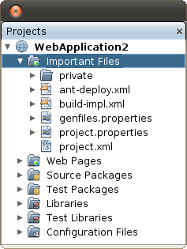
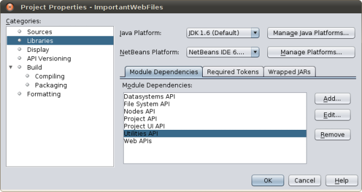
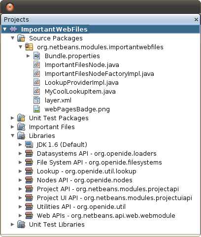
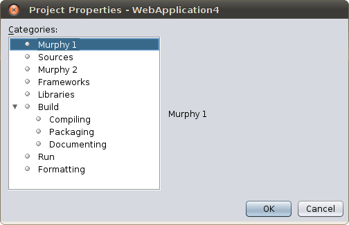

// 
//     Licensed to the Apache Software Foundation (ASF) under one
//     or more contributor license agreements.  See the NOTICE file
//     distributed with this work for additional information
//     regarding copyright ownership.  The ASF licenses this file
//     to you under the Apache License, Version 2.0 (the
//     "License"); you may not use this file except in compliance
//     with the License.  You may obtain a copy of the License at
// 
//       http://www.apache.org/licenses/LICENSE-2.0
// 
//     Unless required by applicable law or agreed to in writing,
//     software distributed under the License is distributed on an
//     "AS IS" BASIS, WITHOUT WARRANTIES OR CONDITIONS OF ANY
//     KIND, either express or implied.  See the License for the
//     specific language governing permissions and limitations
//     under the License.
//

= NetBeans Project Type Extension Module Tutorial
:jbake-type: platform_tutorial
:jbake-tags: tutorials 
:jbake-status: published
:syntax: true
:source-highlighter: pygments
:toc: left
:toc-title:
:icons: font
:experimental:
:description: NetBeans Project Type Extension Module Tutorial - Apache NetBeans
:keywords: Apache NetBeans Platform, Platform Tutorials, NetBeans Project Type Extension Module Tutorial

This tutorial demonstrates how to extend an existing project type.

NOTE: This document uses the NetBeans IDE 6.9 Release or above. If you are using an earlier version, see  link:60/nbm-projectextension.html[the 6.0/6.1 version of this document].

You will also make use of this icon, which you can right-click here and download: 
image::images/projectextensions_webPagesBadge.gif[]

Optionally, for troubleshooting purposes, you can  link:http://plugins.netbeans.org/PluginPortal/faces/PluginDetailPage.jsp?pluginid=14034[download the completed sample] and inspect the sources.

== Introduction to Project Extensions

New NetBeans IDE APIs since NetBeans IDE 6.0 enable you to add new nodes to an existing project type's logical view, new objects to an existing project type's lookup, and new panels to an existing project type's Project Properties dialog box. For example, in this tutorial, to illustrate these extensions, we extend the web application project type, by adding a new 'Important Files' node, exposing the content of the project's 'nbproject' folder, as shown here:

Prior to NetBeans IDE 6.0, no NetBeans IDE APIs existed for extending existing project types. Instead, you would need to create new project types from scratch. From 6.0 onwards, you are recommended to extend existing project types rather than create new ones. This will keep the number of project types to a minimum and avoid a large number of project types with very small differences. However, it is still possible to create project types from scratch, as before.

Annotations are used throughout this tutorial to register the lookup extension, logical view extension, and project customizer extension. As you will see below, the extensions will be registered for the project type "org-netbeans-modules-web-project", which is the web application project type. Here is a list of strings representing other project types supported by NetBeans IDE:

* org-netbeans-modules-ant-freeform
* org-netbeans-modules-apisupport-project
* org-netbeans-modules-apisupport-project-suite
* org-netbeans-modules-j2ee-archiveproject
* org-netbeans-modules-j2ee-clientproject
* org-netbeans-modules-j2ee-earproject
* org-netbeans-modules-j2ee-ejbjarproject
* org-netbeans-modules-java-j2seproject

Other project types may be available, depending on the modules that are part of your specific installation of NetBeans IDE or other application on the NetBeans Platform.

== Creating the Module Project

We begin by working through the New Module Project wizard. At the end of it, we will have a basic source structure, with some default files, that every NetBeans module requires.

[start=1]
1. Choose File > New Project (Ctrl+Shift+N). Under Categories, select NetBeans Modules. Under Projects, select Module. Click Next.

[start=2]
1. In the Name and Location panel, type  ``ImportantWebFiles``  in the Project Name field. Change the Project Location to any directory on your computer. Leave the Standalone Module option and Set as Main Project checkbox selected. Click Next.

[start=3]
1. In the Basic Module Configuration panel, type  ``org.netbeans.modules.importantwebfiles``  in Code Name Base.

[start=4]
1. Select "Generate XML Layer". Leave the locations of both the localizing bundle and the XML layer file so that they will be stored in a package with the name  ``org/netbeans/modules/importantwebfiles`` . Click Finish.

The IDE creates the  ``ImportantWebFiles``  project. The project contains all of your sources and project metadata, such as the project's Ant build script. The project opens in the IDE. You can view its logical structure in the Projects window (Ctrl-1) and its file structure in the Files window (Ctrl-2).

== Setting Dependencies

We will need to make use of several NetBeans APIs. In this step, we select the modules that provide the NetBeans APIs that we will need.

[start=1]
1. Right-click the project node and choose Properties. The Project Properties dialog box opens.

[start=2]
1. In the Libraries panel, add dependencies on the following modules:
* Datasystems API
* File System API
* Nodes API
* Project API
* Project UI API
* Utilities API
* Web APIs

The Libraries panel should now look as follows:

[start=3]
1. Click OK.

== Extending the Lookup

We start by implementing the  ``LookupProviderImpl``  class, which we will register via an annotation.

[start=1]
1. Create a Java class called  ``LookupProviderImpl`` .

[start=2]
1. Change the default code to the following:

[source,java]
----

@LookupProvider.Registration(projectType = "org-netbeans-modules-web-project")
public class LookupProviderImpl implements LookupProvider {

    public Lookup createAdditionalLookup(Lookup lookup) {
        
        Project prj = lookup.lookup(Project.class);
        
        *//If there is a web module provider in the
        //project's lookup, add a new lookup item to
        //the lookup, which we will look for to determine
        //whether a node should be created:*
        WebModuleProvider wmp = lookup.lookup(WebModuleProvider.class);
        if (wmp != null) {
            return Lookups.fixed(new MyCoolLookupItem(prj));
        }
        
        *//If there is no web module in the lookup,
        //we do not add a new item to our lookup,
        //so that later a node will not be created:*
        return Lookups.fixed();
        
    }

}
----

[start=3]
1. Create a new Java class called  ``MyCoolLookupItem`` .

[start=4]
1. 
Change the default code to the following:

[source,java]
----

public class MyCoolLookupItem {

    public MyCoolLookupItem(Project prj) {
    }

}
----

== Extending the Logical View

We start by implementing the  ``ImportantFilesNodeFactoryImpl``  class, which we will register via an annotation.

[start=1]
1. Create a Java class called  ``ImportantFilesNodeFactoryImpl`` .

[start=2]
1. Change the default code to the following:

[source,java]
----

@NodeFactory.Registration(projectType = "org-netbeans-modules-web-project")
public class ImportantFilesNodeFactoryImpl implements  link:https://bits.netbeans.org/dev/javadoc/org-netbeans-modules-projectuiapi/org/netbeans/spi/project/ui/support/NodeFactory.html[NodeFactory] {

    Project proj;

    public  link:https://bits.netbeans.org/dev/javadoc/org-netbeans-modules-projectuiapi/org/netbeans/spi/project/ui/support/NodeList.html[NodeList] createNodes(Project project) {
      
        this.proj = project;
        
        *//If there is no 'nbproject' folder,
        //return an empty list of nodes:*
        if (proj.getProjectDirectory().getFileObject("nbproject") == null) {
            return NodeFactorySupport.fixedNodeList();
        }
        
        *//If our item is in the project's lookup,
        //return a new node in the node list:*
        MyCoolLookupItem item = project.getLookup().lookup(MyCoolLookupItem.class);
        if (item != null) {
            try {
                ImportantFilesNode nd = new ImportantFilesNode(proj);
                return NodeFactorySupport.fixedNodeList(nd);
            } catch (DataObjectNotFoundException ex) {
                Exceptions.printStackTrace(ex);
            }
        }
        
        *//If our item isn't in the lookup,
        //then return an empty list of nodes:*
        return NodeFactorySupport.fixedNodeList();
        
    }
    
}
----

[start=3]
1. Create a new Java class called  ``ImportantFilesNode`` .

[start=4]
1. 
Change the default code to the following:

[source,java]
----

public class ImportantFilesNode extends  link:https://bits.netbeans.org/dev/javadoc/org-openide-nodes/org/openide/nodes/FilterNode.html[FilterNode] {

    private static Image smallImage = 
          ImageUtilities.loadImage("/org/netbeans/modules/importantwebfiles/webPagesBadge.gif"); // NOI18N

    public ImportantFilesNode(Project proj) throws DataObjectNotFoundException {
        super(DataObject.find(proj.getProjectDirectory().getFileObject("nbproject")).getNodeDelegate());
    }

    public String getDisplayName() {
        return "Important Files";
    }
     
    *//Next, we add icons, for the default state, which is
    //closed, and the opened state; we will make them the same. 
    //Icons in project logical views are
    //based on combinations--you must combine the node's own icon
    //with a distinguishing badge that is merged with it. Here we
    //first obtain the icon from a data folder, then we add our
    //badge to it by merging it via a NetBeans API utility method:*
    
    public Image getIcon(int type) {
        DataFolder root = DataFolder.findFolder(FileUtil.getConfigRoot());
        Image original = root.getNodeDelegate().getIcon(type);
        return ImageUtilities.mergeImages(original, smallImage, 7, 7);
    }

    public Image getOpenedIcon(int type) {
        DataFolder root = DataFolder.findFolder(FileUtil.getConfigRoot());
        Image original = root.getNodeDelegate().getIcon(type);
        return ImageUtilities.mergeImages(original, smallImage, 7, 7);
    }
    
}
----

[start=5]
1. Right-click this icon and save it in the main package of your module: 
image::images/projectextensions_webPagesBadge.gif[]

== Extending the Project Customizer

Finally, we create two new tabs in the Project Properties dialog of the web application project type.

[start=1]
1. Create a Java class called  ``ImportantFilesCustomizerTab`` .

[start=2]
1. Change the default code to the following:

[source,java]
----

public class ImportantFilesCustomizerTab implements ProjectCustomizer.CompositeCategoryProvider {

    private static final String MURPHY1 = "Murphy1";
    private static final String MURPHY2 = "Murphy2";

    private ResourceBundle bundle = NbBundle.getBundle(ImportantFilesCustomizerTab.class);
    private String name;

    @ProjectCustomizer.CompositeCategoryProvider.Registration(projectType = "org-netbeans-modules-web-project", position = 100)
    public static ImportantFilesCustomizerTab createMurphy1() {
        return new ImportantFilesCustomizerTab(MURPHY1);
    }

    @ProjectCustomizer.CompositeCategoryProvider.Registration(projectType = "org-netbeans-modules-web-project", position = 110)
    public static ImportantFilesCustomizerTab createMurphy2() {
        return new ImportantFilesCustomizerTab(MURPHY2);
    }

    private ImportantFilesCustomizerTab(String name) {
        this.name = name;
    }

    @Override
    public Category createCategory(Lookup lkp) {
        ProjectCustomizer.Category toReturn = null;
        if (MURPHY1.equals(name)) {
            toReturn = ProjectCustomizer.Category.create(
                    MURPHY1,
                    bundle.getString("LBL_Config_Murphy1"),
                    null);
        } else {
            toReturn = ProjectCustomizer.Category.create(
                    MURPHY2,
                    bundle.getString("LBL_Config_Murphy2"), // NOI18N
                    null);
        }
        return toReturn;
    }

    @Override
    public JComponent createComponent(Category category, Lookup lkp) {
        String nm = category.getName();
        if (MURPHY1.equals(nm)) {
            JPanel jPanel1 = new JPanel();
            jPanel1.setLayout(new BorderLayout());
            jPanel1.add(new JLabel(bundle.getString("LBL_Config_Murphy1")), BorderLayout.CENTER);
            return jPanel1;
        } else {
            JPanel jPanel2 = new JPanel();
            jPanel2.setLayout(new BorderLayout());
            jPanel2.add(new JLabel(bundle.getString("LBL_Config_Murphy2")), BorderLayout.CENTER);
            return jPanel2;
        }
    }

}
----

[start=3]
1. Add the keys referred to above to the  ``Bundle.properties``  file in the main package of your module:

[source,java]
----

LBL_Config_Murphy1=Murphy 1
LBL_Config_Murphy2=Murphy 2 
----

== Installing the Module

Finally, we install the module and make use of the result.

[start=1]
1. Check that the module looks as follows in the Projects window:

[start=2]
1. Right-click the module project and install it.

[start=3]
1. 
Create a new web application, or open an existing one, and notice that it has an Important Files node, containing the files from the 'nbproject' folder:

[start=4]
1. Right-click the web application project and choose Properties. In the Project Properties dialog box, notice your new tabs:

link:http://netbeans.apache.org/community/mailing-lists.html[Send Us Your Feedback]

== Next Steps

For more information about creating and developing NetBeans modules, see the following resources:

*  link:https://netbeans.apache.org/kb/docs/platform.html[Other Related Tutorials]
*  link:https://bits.netbeans.org/dev/javadoc/[NetBeans API Javadoc]
