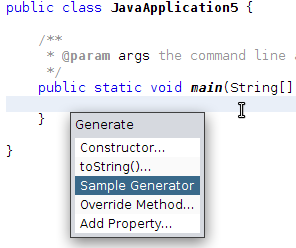
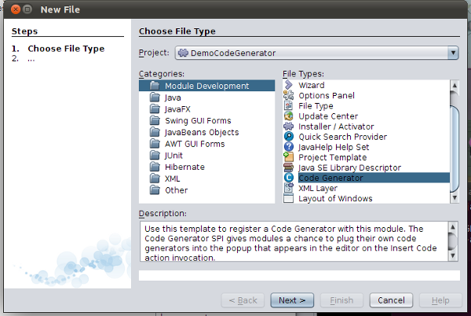
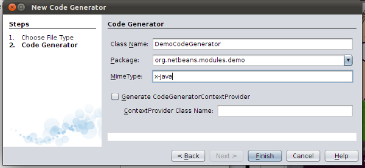
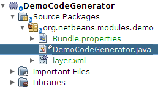

// 
//     Licensed to the Apache Software Foundation (ASF) under one
//     or more contributor license agreements.  See the NOTICE file
//     distributed with this work for additional information
//     regarding copyright ownership.  The ASF licenses this file
//     to you under the Apache License, Version 2.0 (the
//     "License"); you may not use this file except in compliance
//     with the License.  You may obtain a copy of the License at
// 
//       http://www.apache.org/licenses/LICENSE-2.0
// 
//     Unless required by applicable law or agreed to in writing,
//     software distributed under the License is distributed on an
//     "AS IS" BASIS, WITHOUT WARRANTIES OR CONDITIONS OF ANY
//     KIND, either express or implied.  See the License for the
//     specific language governing permissions and limitations
//     under the License.
//

= Code Generator Integration Tutorial
:jbake-type: platform_tutorial
:jbake-tags: tutorials 
:jbake-status: published
:syntax: true
:source-highlighter: pygments
:toc: left
:toc-title:
:icons: font
:experimental:
:description: Code Generator Integration Tutorial - Apache NetBeans
:keywords: Apache NetBeans Platform, Platform Tutorials, Code Generator Integration Tutorial

This tutorial shows you how to write a module that integrates new items into the NetBeans Code Generator feature, which appears when you click Alt-Insert in an editor.

== Introduction to Code Generator Integration

The Code Generator feature, consisting of a user interface and an API, introduced in NetBeans IDE 6.5, consists of a list of items that appears when you press Alt-Insert. Each item generates code into the editor. In this tutorial, you will create a sample generator, as shown below, which will generate a method into a Java class:

== Creating the Module Project

In this section, we use a wizard to create the source structure that every NetBeans module requires. The source structure consists of certain folders in specific places and a set of files that are always needed for Ant-based NetBeans modules. For example, every Ant-based NetBeans module requires a  ``nbproject``  folder, which holds the project's metadata.

[start=1]
1. Choose File > New Project (Ctrl-Shift-N). Under Categories, select NetBeans Modules. Under Projects, select Module. Click Next.

[start=2]
1. In the Name and Location panel, type  ``DemoCodeGenerator``  in Project Name. Change the Project Location to any directory on your computer. Click Next.

[start=3]
1. In the Basic Module Configuration panel, type  ``org.netbeans.modules.demo``  as the Code Name Base. Click Finish.

The IDE creates the  ``DemoCodeGenerator``  project. The project contains all of your sources and project metadata, such as the project's Ant build script. The project opens in the IDE. You can view its logical structure in the Projects window (Ctrl-1) and its file structure in the Files window (Ctrl-2).

== Using the Code Generator Provider Wizard

In this section, we use a wizard to create the stub class and registration entries necessary for beginning our integration with the Code Generator feature.

[start=1]
1. Right-click the project node and choose New > Other. In the New File dialog, choose Module Development > Code Generator, as shown below:

[start=2]
1. In the New Code Generator panel, set the following:
* *Class Name.* Specifies the class name of the stub that the wizard will generate. Type "DemoCodeGenerator" in this field.
* *Package.* Specifies the package where the stub class will be generated. Select "org.netbeans.modules.demo" from the drop-down.
* *MimeType.* Specifies the MIME type to which the code generator integration will be applied. Type "x-java" in this field.
* *Generate CodeGeneratorContextProvider.* Adds additional objects to the code generator's lookup. Leave this checkbox unselected.

You should now see the following:

[start=3]
1. Click Finish.

The Projects window should now show the following:

In the  ``layer.xml``  file, you should see the following:

[source,xml]
----

<filesystem>
    <folder name="Editors">
        <folder name="text">
            <folder name="x-java">
                <folder name="CodeGenerators">
                    <file name="org-netbeans-modules-demo-DemoCodeGenerator$Factory.instance"/>
                </folder>
            </folder>
        </folder>
    </folder>
</filesystem>
----

The generated class should look like this:

[source,java]
----

public class DemoCodeGenerator implements CodeGenerator {

    JTextComponent textComp;

    /**
     * 
     * @param context containing JTextComponent and possibly other items 
     * registered by {@link CodeGeneratorContextProvider}
     */
    private DemoCodeGenerator(Lookup context) { 
    // Good practice is not to save Lookup outside ctor
        textComp = context.lookup(JTextComponent.class);
    }

    public static class Factory implements CodeGenerator.Factory {

        public List create(Lookup context) {
            return Collections.singletonList(new DemoCodeGenerator(context));
        }
    }

    /**
     * The name which will be inserted inside Insert Code dialog
     */
    public String getDisplayName() {
        return "Sample Generator";
    }

    /**
     * This will be invoked when user chooses this Generator from Insert Code
     * dialog
     */
    public void invoke() {
    }
    
}
----

== Coding the Code Generator Integration

Next, we will implement the NetBeans Java Editor APIs introduced in the  link:https://netbeans.apache.org/tutorials/nbm-copyfqn.html[NetBeans Java Language Infrastructure Tutorial].

Below, we set dependencies on the required modules and then implement them in our own module.

[start=1]
1. Right-click the project, choose Properties, and add the following dependencies in the Libraries panel:

* Editor Library 2
* Javac API Wrapper
* Java Source
* Lookup API
* Utilities API

NOTE:  You will notice that some of the dependencies listed above have already been set automatically by the Code Generator wizard. The other dependencies, you will need to set yourself to be able to generate new Java code snippets via your new Code Generator integration, as explained below.

[start=2]
1. Open the generated class and modify the  ``invoke()``  method as follows:

[source,java]
----

public void invoke() {
    try {
        Document doc = textComp.getDocument();
        JavaSource javaSource = JavaSource.forDocument(doc);
        CancellableTask task = new CancellableTask<WorkingCopy>() {
            public void run(WorkingCopy workingCopy) throws IOException {
                workingCopy.toPhase(Phase.RESOLVED);
                CompilationUnitTree cut = workingCopy.getCompilationUnit();
                TreeMaker make = workingCopy.getTreeMaker();
                for (Tree typeDecl : cut.getTypeDecls()) {
                    if (Tree.Kind.CLASS == typeDecl.getKind()) {
                        ClassTree clazz = (ClassTree) typeDecl;
                        ModifiersTree methodModifiers = 
                                make.Modifiers(Collections.<Modifier>singleton(Modifier.PUBLIC), 
                                Collections.<AnnotationTree>emptyList());
                        VariableTree parameter = 
                                make.Variable(make.Modifiers(Collections.<Modifier>singleton(Modifier.FINAL), 
                                Collections.<AnnotationTree>emptyList()), 
                                "arg0", 
                                make.Identifier("Object"), 
                                null);
                        TypeElement element = workingCopy.getElements().getTypeElement("java.io.IOException");
                        ExpressionTree throwsClause = make.QualIdent(element);
                        MethodTree newMethod = 
                                make.Method(methodModifiers, 
                                "writeExternal", 
                                make.PrimitiveType(TypeKind.VOID), 
                                Collections.<TypeParameterTree>emptyList(), 
                                Collections.singletonList(parameter), 
                                Collections.<ExpressionTree>singletonList(throwsClause), 
                                "{ throw new UnsupportedOperationException(\"Not supported yet.\") }", 
                                null);
                        ClassTree modifiedClazz = make.addClassMember(clazz, newMethod);
                        workingCopy.rewrite(clazz, modifiedClazz);
                    }
                }
            }
            public void cancel() {
            }
        };
        ModificationResult result = javaSource.runModificationTask(task);
        result.commit();
    } catch (Exception ex) {
        Exceptions.printStackTrace(ex);
    }
}
----

[start=3]
1. Make sure the following import statements are declared:

[source,java]
----

import com.sun.source.tree.*;
import java.io.IOException;
import java.util.Collections;
import java.util.List;
import javax.lang.model.element.Modifier;
import javax.lang.model.element.TypeElement;
import javax.lang.model.type.TypeKind;
import javax.swing.text.Document;
import javax.swing.text.JTextComponent;
import org.netbeans.api.java.source.JavaSource.Phase;
import org.netbeans.api.java.source.*;
import org.netbeans.spi.editor.codegen.CodeGenerator;
import org.openide.util.Exceptions;
import org.openide.util.Lookup;
----

== Installing and Trying Out the Functionality

Let's now install the module and then use the code generator feature integration. The IDE uses an Ant build script to build and install your module. The build script was created for you when you created the project.

[start=1]
1. In the Projects window, right-click the project and choose Run. A new instance of the IDE starts up and installs the Code Generator integration module.

[start=2]
1. Create a new Java application and open a Java source file. Press Alt-Insert inside the editor and you will see your new item included:

[start=3]
1. Click an item and the code will be inserted:

image::images/code-generator_71_result-2.png[]

== Creating a Shareable Module Binary

Now that the module is complete, you can let others use it. To do so, you need to create a binary "NBM" (NetBeans module) file and distribute it.

[start=1]
1. In the Projects window, right-click the project and choose Create NBM.

The NBM file is created and you can view it in the Files window (Ctrl-2).

[start=2]
1. Make it available to others via, for example, the  link:http://plugins.netbeans.org/PluginPortal/[NetBeans Plugin Portal]. The recipient should use the Plugin Manager (Tools > Plugins) to install it.

link:http://netbeans.apache.org/community/mailing-lists.html[Send Us Your Feedback]

== Next Steps

For more information about creating and developing NetBeans modules, see the following resources:

*  link:https://netbeans.apache.org/platform/index.html[NetBeans Platform Homepage]
*  link:https://bits.netbeans.org/dev/javadoc/[NetBeans API List (Current Development Version)]
*  link:https://netbeans.apache.org/kb/docs/platform.html[Other Related Tutorials]
