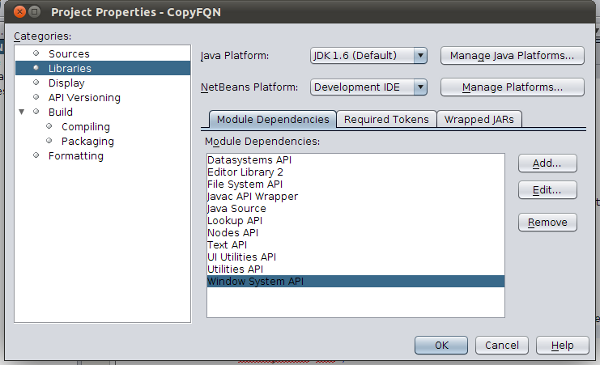
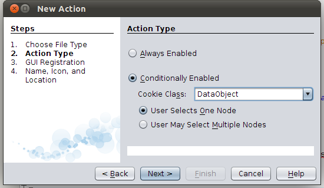
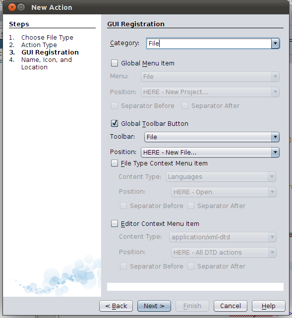
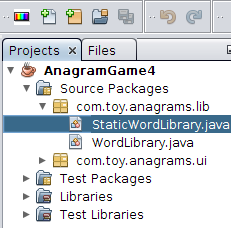
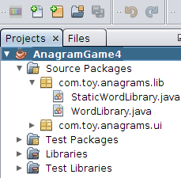
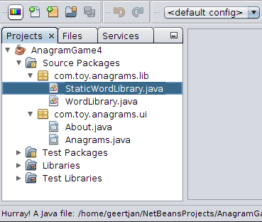
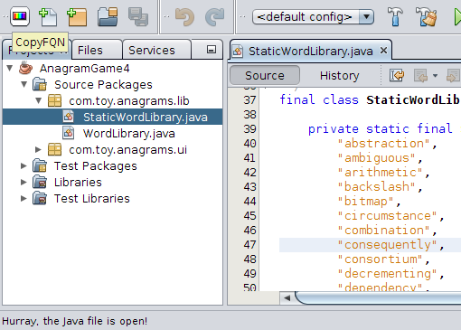
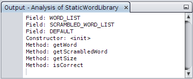
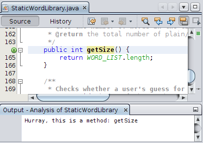

// 
//     Licensed to the Apache Software Foundation (ASF) under one
//     or more contributor license agreements.  See the NOTICE file
//     distributed with this work for additional information
//     regarding copyright ownership.  The ASF licenses this file
//     to you under the Apache License, Version 2.0 (the
//     "License"); you may not use this file except in compliance
//     with the License.  You may obtain a copy of the License at
// 
//       http://www.apache.org/licenses/LICENSE-2.0
// 
//     Unless required by applicable law or agreed to in writing,
//     software distributed under the License is distributed on an
//     "AS IS" BASIS, WITHOUT WARRANTIES OR CONDITIONS OF ANY
//     KIND, either express or implied.  See the License for the
//     specific language governing permissions and limitations
//     under the License.
//

= NetBeans Java Language Infrastructure Tutorial
:jbake-type: platform_tutorial
:jbake-tags: tutorials 
:jbake-status: published
:syntax: true
:source-highlighter: pygments
:toc: left
:toc-title:
:icons: font
:experimental:
:description: NetBeans Java Language Infrastructure Tutorial - Apache NetBeans
:keywords: Apache NetBeans Platform, Platform Tutorials, NetBeans Java Language Infrastructure Tutorial

In this tutorial, you will be introduced to aspects of the NetBeans "Retouche" APIs, which give you access to the NetBeans Java editor.

NOTE: This document uses NetBeans Platform 7.1 and NetBeans IDE 7.1. If you are using an earlier version, see  link:../70/nbm-copyfqn.html[the previous version of this document].

Optionally, for troubleshooting purposes, you can  link:http://plugins.netbeans.org/PluginPortal/faces/PluginDetailPage.jsp?pluginid=2753[download the completed sample] and inspect the sources.

== Introduction to the Java Language Infrastructure

Prior to NetBeans IDE 6, the Java language infrastructure that supported the Java editor, including Java code generation and Java refactoring, was based on something called "JMI for Java" (also known as "MDR"). JMI for Java had a few architectural issues such as single-read lock. In other words, a lock had to be acquired just to read information from its model, while this is normally required when doing write actions only. Over a period of a few years, JMI was debugged and improved in terms of performance. But another issue was that it used its own internal copy of the Java parser, which meant it had its own approach to interpreting Java source, which differed from the JDK's Java compiler. With the introduction of generics in JDK 5, which introduced a lot more complicated and subtle Java constructs, that divergence became harder to manage. Therefore, because of JMI's performance issues and because a formal language model was developed to make the JDK Java compiler a programmatically accessible tool, the JMI for Java was replaced with a new approach, based on the JDK Java compiler.

That is when Retouche, a French word meaning "touch up", was born. Retouche is the new and fast Java language infrastructure in NetBeans IDE, capable of supporting all the cool Java editor features that have been realised in NetBeans 6.0. At the heart of it, Retouche wraps an instance of the JDK Java compiler and consumes its artifacts, such as the abstract syntax tree (also known as "AST") and the symbolic resolutions that are emitted in various phases of parsing. When working with Retouche, you need to deal with some of these artifacts. The  link:http://java.sun.com/javase/6/docs/jdk/api/javac/tree/index.html[Compiler Tree API] is one of these, for example. The package naming of classes in the Compiler Tree API is  ``com.sun.*`` . Therefore, technically, this is a non-JDK API, but it does come from the JDK Java compiler. Another example of the JDK Java compiler's artifacts that you work with in relation to Retouche is the formal language model in the JDK APIs, provided by the  ``javax.language.model.*``  packages.

== Setting Up the Module

In this section, we use wizards and dialogs in NetBeans IDE to create a module project and to set dependencies on relevant NetBeans modules.

[start=1]
1. Choose File > New Project. In the New Project wizard, choose NetBeans Modules under Categories and Module under Projects. Click Next.

[start=2]
1. Type  ``CopyFQN``  in Project Name and set Project Location to an appropriate folder on your disk. If they are not selected, select Standalone Module and Set as Main Project. Click Next.

[start=3]
1. Type  ``org.netbeans.modules.copyfqn``  in Code Name Base and  ``CopyFQN``  in Module Display Name. Do not select Generate OSGi Bundle. Click Finish.

[start=4]
1. Right-click the project, choose Properties, click Libraries in the Project Properties dialog box and declare a dependency on the following APIs:

* Datasystems API
* Editor Library 2
* File System API
* Javac API Wrapper
* Java Source
* Lookup API
* Nodes API
* Text API
* UI Utilities API
* Utilities API
* Window System API

You should now see this:

Click OK.

== Creating a Context-Sensitive Toolbar Button

In this section, we create a context-aware button in the toolbar. This has nothing to do with the Retouche APIs discussed in the introduction of this tutorial, but gives us a user interface element for interacting with our implementation of the Retouche APIs, later in this tutorial.

[start=1]
1. Right-click the CopyFQN module project, choose New > Other and choose Action from the Module Development category. Click Next.

[start=2]
1. 
Choose Conditionally Enabled, and keep all the defaults, as shown below, so that the action will be sensitive to  ``DataObjects``  and so that it will only be enabled when one  ``DataObject``  is selected.

Click Next.

[start=3]
1. Choose "File" in Category and "File" in Toolbar.

You should now see the following:

Click Next.

[start=4]
1. Type  ``CopyFQNAction``  in Class Name and  ``CopyFQN``  in Display Name.

[start=5]
1. 
Browse to an icon that will be displayed in the toolbar button. For example, use the one that will be used throughout this tutorial:

image::images/copyfqn_icon.png[]

Click Finish.

You should now see the following code in your new  ``CopyFQNAction.java``  class:

[source,java]
----

package org.netbeans.modules.copyfqn;

import java.awt.event.ActionEvent;
import java.awt.event.ActionListener;
import org.openide.awt.ActionID;
import org.openide.awt.ActionReference;
import org.openide.awt.ActionReferences;
import org.openide.awt.ActionRegistration;
import org.openide.loaders.DataObject;
import org.openide.util.NbBundle.Messages;

@ActionID(category = "File",
id = "org.netbeans.modules.copyfqn.CopyFQNAction")
@ActionRegistration(iconBase = "org/netbeans/modules/copyfqn/icon.png",
displayName = "#CTL_CopyFQNAction")
@ActionReferences({
    @ActionReference(path = "Toolbars/File", position = 0)
})
@Messages("CTL_CopyFQNAction=CopyFQN")
public final class CopyFQNAction implements ActionListener {

    private final DataObject context;

    public CopyFQNAction(DataObject context) {
        this.context = context;
    }

    public void actionPerformed(ActionEvent ev) {
        // TODO use context
    }
    
}
----

NOTE:  All the work we will do in the remainder of this tutorial will focus on the  ``actionPerformed``  method above.

You have now created an action that is sensitive to data objects. Let's see what that means right away.

[start=6]
1. Right-click the module and choose Run.

Once the new instance of the IDE is started up and the module is installed, you should see a new button in the toolbar.

[start=7]
1. Select a node in the Projects window and then look at the button in the toolbar. If you select a node representing a file or folder (including a package) the button is enabled, as shown here:

However, if you select a node representing a project, the button is disabled, as shown below:

In the next section, we will go further than distinguishing between project nodes and file/folder nodes, which is what we're able to do so far—we will distinguish between file nodes for Java classes versus all other kinds of file nodes.

== Identifying Java Source Files

In this section, we begin using one of the new "Retouche" APIs, called  link:https://bits.netbeans.org/dev/javadoc/org-netbeans-modules-java-source/overview-summary.html[Java Source]. Here we use the  link:https://bits.netbeans.org/dev/javadoc/org-netbeans-modules-java-source/org/netbeans/api/java/source/JavaSource.html[JavaSource] class, which represents a Java source file. We return an instance of this class for the file object associated with our data object. If null is returned, the file object is not a Java source file. We display the result in the status bar, when the button is clicked while a file is selected.

[start=1]
1. Fill out the  ``actionPerformed``  method by adding the lines highlighted below:

[source,java]
----

public void actionPerformed(ActionEvent ev) {

    *FileObject fileObject = context.getPrimaryFile();

link:https://bits.netbeans.org/dev/javadoc/org-netbeans-modules-java-source/org/netbeans/api/java/source/JavaSource.html[JavaSource] javaSource =  link:https://bits.netbeans.org/dev/javadocorg-netbeans-modules-java-source/org/netbeans/api/java/source/JavaSource.html#forFileObject(org.openide.filesystems.FileObject)[JavaSource.forFileObject(fileObject)];
    if (javaSource == null) {
        StatusDisplayer.getDefault().setStatusText("Not a Java file: " + fileObject.getPath());
    } else {
        StatusDisplayer.getDefault().setStatusText("Hurray! A Java file: " + fileObject.getPath());
    }*

}
----

[start=2]
1. Check that your import statements are as follows:

[source,java]
----

import java.awt.event.ActionEvent;
import java.awt.event.ActionListener;
import org.netbeans.api.java.source.JavaSource;
import org.openide.awt.*;
import org.openide.filesystems.FileObject;
import org.openide.loaders.DataObject;
import org.openide.util.NbBundle.Messages;
----

[start=3]
1. Run the module again.

[start=4]
1. 
Select a file node and press the button.

Notice that the "Hurray!" message only appears when you select a Java file, as shown below:

== Determining Open State

In this section, we are introduced to our first explicitly invoked "Retouche" task. Such a task is provided by the JavaSource class's  ``runUserActionTask``  method. A task of this kind lets you control the phases of a parsing process, which is applicable when you want to respond immediately to the user's input. Everything done within the task is done as a single unit. In our case, we want the invocation of our action, represented by a button in the toolbar, to be immediately followed by the display of a text in the status bar.

[start=1]
1. Replace the "Hurray!" message in the  ``actionPerformed``  method with this line: link:http://bits.netbeans.org/dev/javadoc/org-netbeans-modules-java-source/org/netbeans/api/java/source/JavaSource.html#runUserActionTask(org.netbeans.api.java.source.Task,%20boolean)[javaSource.runUserActionTask]

[source,java]
----

(new  link:http://bits.netbeans.org/dev/javadoc/org-netbeans-modules-java-source/org/netbeans/api/java/source/Task.html[Task]< link:https://bits.netbeans.org/dev/javadoc/org-netbeans-modules-java-source/org/netbeans/api/java/source/CompilationController.html[CompilationController]>());
----

You should now see a lightbulb in the editor's left sidebar, as shown here:

image::images/copyfqn_71_runuserasactiontask.png[]

[start=2]
1. Press Ctrl-Shift-I to import the necessary classes and click OK in the dialog box. Then click the lightbulb. Alternatively, put the caret in the line and press Alt-Enter. Then let the IDE implement the method.

[start=3]
1. Tweak the generated method slightly, by adding a  ``true``  boolean to the end of the method and letting the IDE wrap the snippet in a try/catch block. At the end, the result should be as follows:

[source,java]
----

public void actionPerformed(ActionEvent ev) {

    FileObject fileObject = context.getPrimaryFile();

    JavaSource javaSource = JavaSource.forFileObject(fileObject);
    if (javaSource == null) {
        StatusDisplayer.getDefault().setStatusText("Not a Java file: " + fileObject.getPath());
     } else {
     
            *try {
                javaSource.runUserActionTask(new Task<CompilationController>() {

                    public void run(CompilationController arg0) throws Exception {
                        throw new UnsupportedOperationException("Not supported yet.");
                    }
                }, true);
            } catch (IOException ex) {
                Exceptions.printStackTrace(ex);
            }*
            
     }

}
----

[start=4]
1. Implement the  ``run()``  method as follows:

[source,java]
----

public void run(CompilationController compilationController) throws Exception {
     
link:https://bits.netbeans.org/dev/javadoc/org-netbeans-modules-java-source/org/netbeans/api/java/source/CompilationController.html#toPhase(org.netbeans.api.java.source.JavaSource.Phase)[compilationController.toPhase(Phase.ELEMENTS_RESOLVED)];
      
link:https://docs.oracle.com/javase/1.5.0/docs/api/javax/swing/text/Document.html[Document] document =  link:https://bits.netbeans.org/dev/javadoc/org-netbeans-modules-java-source/org/netbeans/api/java/source/CompilationController.html#getDocument()[compilationController.getDocument()];
      if (document != null) {
         StatusDisplayer.getDefault().setStatusText("Hurray, the Java file is open!");
      } else {
         StatusDisplayer.getDefault().setStatusText("The Java file is closed!");
      }
      
}
----

[start=5]
1. Make sure that your import statements are as follows:

[source,java]
----

import java.awt.event.ActionEvent;
import java.awt.event.ActionListener;
import java.io.IOException;
import javax.swing.text.Document;
import org.netbeans.api.java.source.CompilationController;
import org.netbeans.api.java.source.JavaSource;
import org.netbeans.api.java.source.JavaSource.Phase;
import org.netbeans.api.java.source.Task;
import org.openide.awt.*;
import org.openide.filesystems.FileObject;
import org.openide.loaders.DataObject;
import org.openide.util.Exceptions;
import org.openide.util.NbBundle.Messages;
----

[start=6]
1. Run the module again.

[start=7]
1. 
Select a file node and press the button.

Notice that the "Hurray!" message only appears when you select a Java file that is open in the Java editor, as shown here:

== Detecting the Element Under the Caret

In this section, now that we know that we are dealing with a Java file and that it is open, we can begin detecting the type of element that is under the caret at any given time.

[start=1]
1. Begin by declaring a dependency on the I/O APIs, so that we can print our results to the Output window.

[start=2]
1. Replace the "Hurray!" message in the  ``run()``  method with the lines highlighted below:

[source,java]
----

public void run(CompilationController compilationController) throws Exception {
    
    compilationController.toPhase(Phase.ELEMENTS_RESOLVED);
    Document document = compilationController.getDocument();
    
    if (document != null) {
        *new MemberVisitor(compilationController).scan(compilationController.getCompilationUnit(), null);*
    } else {
        StatusDisplayer.getDefault().setStatusText("The Java file is closed!");
    }
    
}
----

[start=3]
1. And here is the  ``MemberVisitor``  class, which is defined as an inner class of our  ``CopyFQNAction``  class:

[source,java]
----

private class MemberVisitor extends TreePathScanner<Void, Void> {

    private CompilationInfo info;

    public MemberVisitor(CompilationInfo info) {
        this.info = info;
    }

    @Override
    public Void visitClass(ClassTree t, Void v) {
        Element el = info.getTrees().getElement(getCurrentPath());
        if (el == null) {
            StatusDisplayer.getDefault().setStatusText("Cannot resolve class!");
        } else {
            TypeElement te = (TypeElement) el;
            List enclosedElements = te.getEnclosedElements();
            InputOutput io = IOProvider.getDefault().getIO("Analysis of "  
                        + info.getFileObject().getName(), true);
            for (int i = 0; i < enclosedElements.size(); i++) {
            Element enclosedElement = (Element) enclosedElements.get(i);
                if (enclosedElement.getKind() == ElementKind.CONSTRUCTOR) {
                    io.getOut().println("Constructor: " 
                        + enclosedElement.getSimpleName());
                } else if (enclosedElement.getKind() == ElementKind.METHOD) {
                    io.getOut().println("Method: " 
                        + enclosedElement.getSimpleName());
                } else if (enclosedElement.getKind() == ElementKind.FIELD) {
                    io.getOut().println("Field: " 
                        + enclosedElement.getSimpleName());
                } else {
                    io.getOut().println("Other: " 
                        + enclosedElement.getSimpleName());
                }
            }
            io.getOut().close();
        }
        return null;
    }

}
----

NOTE:  To use the "InputOutput" class above, you need a new dependency, on the "I/O APIs".

[start=4]
1. Run the module again, and open a Java class. Then click the button and notice that the constructors, methods, and fields are written to the Output window, as shown below:

[start=5]
1. Next, instead of printing all the elements to the Output window, we will only print the element under the caret. Only replace the  ``visitClass``  method, with the code highlighted below:

[source,java]
----

private class MemberVisitor extends TreePathScanner<Void, Void> {

    private CompilationInfo info;

    public MemberVisitor(CompilationInfo info) {
        this.info = info;
    }

    *@Override
    public Void visitClass(ClassTree t, Void v) {
        try {
            JTextComponent editor = EditorRegistry.lastFocusedComponent();
            if (editor.getDocument() == info.getDocument()) {
                int dot = editor.getCaret().getDot();
                TreePath tp = info.getTreeUtilities().pathFor(dot);
                Element el = info.getTrees().getElement(tp);
                if (el == null) {
                    StatusDisplayer.getDefault().setStatusText("Cannot resolve class!");
                } else {
                    InputOutput io = IOProvider.getDefault().getIO("Analysis of " 
                            + info.getFileObject().getName(), true);
                    if (el.getKind() == ElementKind.CONSTRUCTOR) {
                        io.getOut().println("Hurray, this is a constructor: " 
                            + el.getSimpleName());
                    } else if (el.getKind() == ElementKind.METHOD) {
                        io.getOut().println("Hurray, this is a method: " 
                            + el.getSimpleName());
                    } else if (el.getKind() == ElementKind.FIELD) {
                        io.getOut().println("Hurray, this is a field: " 
                            + el.getSimpleName());
                    } else {
                        io.getOut().println("Hurray, this is something else: " 
                            + el.getSimpleName());
                    }
                    io.getOut().close();
                }
            }
        } catch (IOException ex) {
            Exceptions.printStackTrace(ex);
        }
        return null;
    }*

}
----

[start=6]
1. Run the module.

[start=7]
1. 
Put the caret somewhere within your Java code and press the button. The Output window displays information about the code under the caret, if applicable. For example, if you press the button after you put the caret in a method, as shown below, the Output window tells you that the caret is in a method:

[start=8]
1. But we can detect a lot more than just the name of the element under the caret. In the  ``visitClass``  method, replace the lines in bold below:

[source,java]
----

@Override
public Void visitClass(ClassTree t, Void v) {
    try {
        JTextComponent editor = EditorRegistry.lastFocusedComponent();
        if (editor.getDocument() == info.getDocument()) {
            int dot = editor.getCaret().getDot();
            TreePath tp = info.getTreeUtilities().pathFor(dot);
            Element el = info.getTrees().getElement(tp);
            if (el == null) {
                StatusDisplayer.getDefault().setStatusText("Cannot resolve class!");
            } else {
                InputOutput io = IOProvider.getDefault().getIO("Analysis of " 
                    + info.getFileObject().getName(), true);
                *String te = null;
                if (el.getKind() == ElementKind.CONSTRUCTOR) {
                    te = ((TypeElement) ((ExecutableElement) el).getEnclosingElement()).getQualifiedName().toString();
                    io.getOut().println("Hurray, this is a constructor's qualified name: " + te);
                } else if (el.getKind() == ElementKind.METHOD) {
                    te = ((ExecutableElement) el).getReturnType().toString();
                    io.getOut().println("Hurray, this is a method's return type: " + te);
                } else if (el.getKind() == ElementKind.FIELD) {
                    te = ((VariableElement) el).asType().toString();
                    io.getOut().println("Hurray, this is a field's type: " + te);
                }* else {
                    io.getOut().println("Hurray, this is something else: " 
                        + el.getSimpleName());
                }
                io.getOut().close();
            }
        }
    } catch (IOException ex) {
        Exceptions.printStackTrace(ex);
    }
    return null;
}
----

[start=9]
1. Run the module again. This time, when you click the button while the caret is over a constructor, method, or field, more detailed information about the element is printed to the Output window.

At this stage, we are able to detect whether we are dealing with a Java file, whether the document is open, and the type of element that is under the caret. But what can we do with this information? In the next section, a simple scenario is presented where our newly acquired knowledge will prove useful.

== Doing Something Useful

In this section, we set the contents of the clipboard, provided by  ``java.awt.datatransfer.Clipboard`` , based on the element under the caret. When you press the button, the element under the caret will be put in the clipboard, so that you can paste the content elsewhere in your code.

[start=1]
1. Begin by changing the constructor to declare the clipboard:

[source,java]
----

private Clipboard clipboard;

public CopyFQNAction(DataObject context) {
    this.context = context;
    clipboard = Lookup.getDefault().lookup(ExClipboard.class);
    if (clipboard == null) {
        clipboard = Toolkit.getDefaultToolkit().getSystemClipboard();
    }
}
----

[start=2]
1. Next, replace each "Hurray!" line in your code, with a line that sends the element as a string to a method that we will define in the next step. We will call our method  ``setClipboardContents`` . Therefore, for example, replace the first "Hurray!" line with the following:

[source,java]
----

setClipboardContents(te);
----

Do the same for the other "Hurray!" lines, making sure to pass the correct string to the method.

NOTE:  Because you have not defined the  ``setClipboardContents``  method yet, each of the lines you add in this step is underlined in red. In the next step, we add the new method.

[start=3]
1. Finally, add the following to the end of the class. This method receives the string and puts it in the clipboard:

[source,java]
----

private void setClipboardContents(String content) {
    if (clipboard != null) {
        if (content == null) {
            StatusDisplayer.getDefault().setStatusText("");
            clipboard.setContents(null, null);
        } else {
            StatusDisplayer.getDefault().setStatusText("Clipboard: " + content);
            clipboard.setContents(new StringSelection(content), null);
        }
    }
}
----

link:http://netbeans.apache.org/community/mailing-lists.html[Send Us Your Feedback]

== See Also

For more information about creating and developing NetBeans Module, see the following resources:

*  link:http://wiki.netbeans.org/Java_DevelopersGuide[Java Developer's Guide]
*  link:http://wiki.netbeans.org/RetoucheDeveloperFAQ[Retouche Developer FAQ]
*  link:https://netbeans.apache.org/kb/docs/platform.html[Other Related Tutorials]
*  link:https://bits.netbeans.org/dev/javadoc/[NetBeans API Javadoc]
