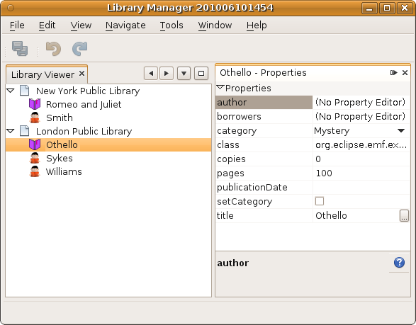
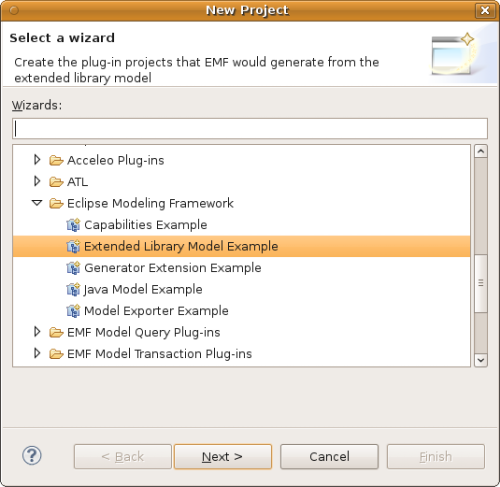
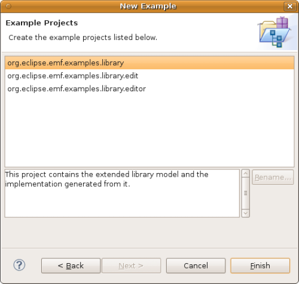
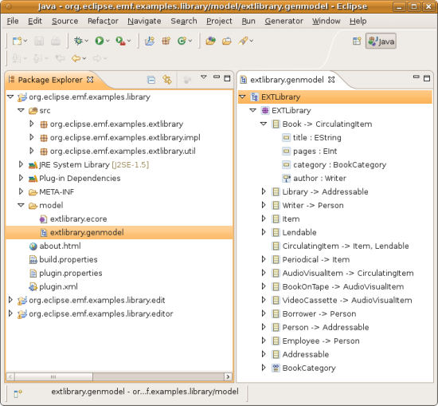
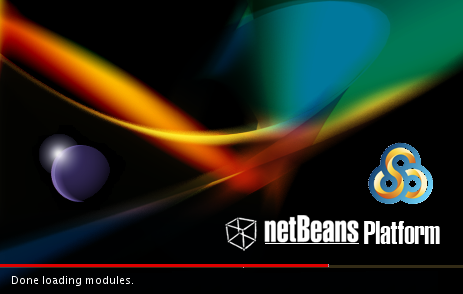
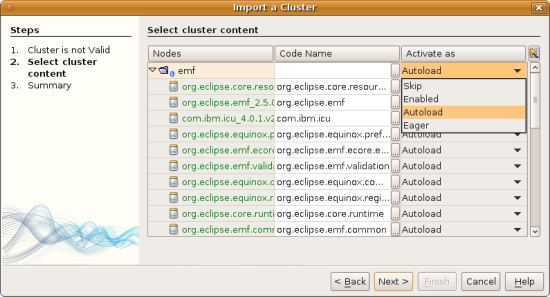
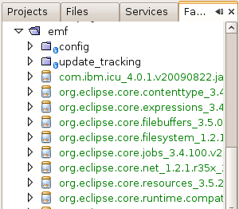
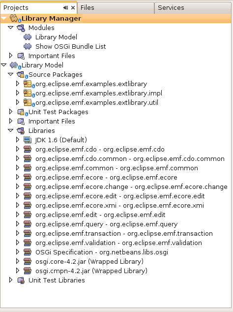
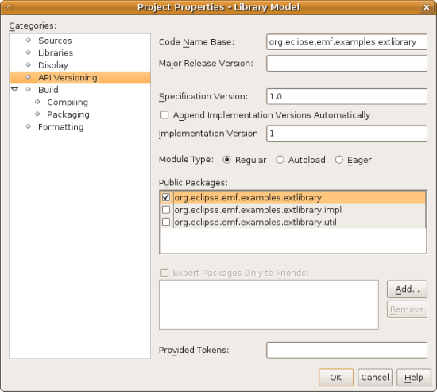

// 
//     Licensed to the Apache Software Foundation (ASF) under one
//     or more contributor license agreements.  See the NOTICE file
//     distributed with this work for additional information
//     regarding copyright ownership.  The ASF licenses this file
//     to you under the Apache License, Version 2.0 (the
//     "License"); you may not use this file except in compliance
//     with the License.  You may obtain a copy of the License at
// 
//       http://www.apache.org/licenses/LICENSE-2.0
// 
//     Unless required by applicable law or agreed to in writing,
//     software distributed under the License is distributed on an
//     "AS IS" BASIS, WITHOUT WARRANTIES OR CONDITIONS OF ANY
//     KIND, either express or implied.  See the License for the
//     specific language governing permissions and limitations
//     under the License.
//

= NetBeans Platform EMF Integration Tutorial
:jbake-type: platform_tutorial
:jbake-tags: tutorials 
:jbake-status: published
:syntax: true
:source-highlighter: pygments
:toc: left
:toc-title:
:icons: font
:experimental:
:description: NetBeans Platform EMF Integration Tutorial - Apache NetBeans
:keywords: Apache NetBeans Platform, Platform Tutorials, NetBeans Platform EMF Integration Tutorial

This document shows you how to incorporate an  link:http://www.eclipse.org/modeling/emf/[EMF model] into a NetBeans Platform application.

You will start by setting up Eclipse, together with its modeling tools. Then you will set up one of the example EMF models provided by Eclipse. Next, you will use NetBeans IDE to create a new NetBeans Platform application on top of Equinox. You will import the OSGi bundles needed for Equinox to work with EMF. Then you will create two new OSGi bundles in NetBeans IDE. The first will contain the sources of the EMF model, while the second will provide a window for displaying values that, for purposes of this tutorial, you will hardcode in the application.

At the end of the tutorial, you will have a NetBeans Platform application that looks as follows, based on the "Extended Library Model Example" provided by Eclipse:

Once you have gone through this simple scenario, you should be able to incorporate your own EMF models into your NetBeans Platform applications.

== Creating the EMF Model

In this section, you create an EMF model in Eclipse.

[start=1]
1. Install EMF via the Eclipse update manager. Select "Modeling" and install "EMF - Eclipse Modeling Framework SDK". Also select the "Ecore Tools", which will let you create UML diagrams from your EMF model.

[start=2]
1. 
In the New Project wizard, create the "Extended Library Model Example", as shown below:

[start=3]
1. In the next step, click Finish:

[start=4]
1. You now have the model that you will use throughout the rest of the tutorial:

On disk, in your workspace, you have the sources of the EMF model you created. Later in this tutorial, you will copy the sources into an OSGi bundle created in NetBeans IDE. That way, you will be able to work with the sources in the IDE, and tweak them where necessary.

== Creating the NetBeans Platform Application

Once you have all the required OSGi bundles available, create your new NetBeans Platform application, as described below.

[start=1]
1. Choose File | New Project and choose to create a NetBeans Platform application atop Equinox, via the Equinox template:

image::http://netbeans.dzone.com/sites/all/files/sudokugame-5.png[]

Click Next.

[start=2]
1. Name the application `LibraryManager` and click Finish.

[start=3]
1. The application you now have is already deployable. Right-click the application to run it. When the application starts up, you'll first see the default splash screen:

Then you will see the main window containing a window that displays all the NetBeans modules and OSGi bundles that have been deployed.

[start=4]
1. Optionally, before continuing, remove the "Show OSGi Bundle List" module that the template provided by default. If you keep it, you will continue to have the window displaying the deployed modules and bundles as part of your application. To remove it, expand the application node in the Projects window, then expand the Modules node, right-click the "Show OSGi Bundle List" node, and select Remove.

== Importing the OSGi Bundles

In this section, you create a new folder on disk. Within that folder, you copy several general Equinox JARs, together with EMF-related JARs, from the Eclipse distribution. You then import these into your NetBeans Platform application.

[start=1]
1. Create a folder on disk, name it anything you like, such as "emf-jars".

[start=2]
1. Copy the following JARs into your new folder, where "xxx" is a placeholder for the version number:

* Core bundles:

[source,java]
----

org.eclipse.core.expressions_xxx.jar
org.eclipse.core.filebuffers_xxx.jar
org.eclipse.core.filesystem_xxx.jar
org.eclipse.core.jobs_xxx.jar
org.eclipse.core.net_xxx.jar
org.eclipse.core.resources_xxx.jar
org.eclipse.core.runtime_xxx.jar
org.eclipse.core.runtime.compatibility_xxx.jar
                        
----

* EMF bundles:

[source,java]
----

org.eclipse.emf.cdo.common_xxx.jar
org.eclipse.emf.cdo_xxx.jar
org.eclipse.emf.common_xxx.jar
org.eclipse.emf.ecore.change_xxx.jar
org.eclipse.emf.ecore.edit_xxx.jar
org.eclipse.emf.ecore.xmi_xxx.jar
org.eclipse.emf.ecore_xxx.jar
org.eclipse.emf.edit_xxx.jar
org.eclipse.emf.query_xxx.jar
org.eclipse.emf.transaction_xxx.jar
org.eclipse.emf.validation_xxx.jar
org.eclipse.emf_xxx.jar
                        
----

* Equinox bundles:

[source,java]
----

org.eclipse.equinox.app_xxx.jar
org.eclipse.equinox.common_xxx.jar
org.eclipse.equinox.preferences_xxx.jar
org.eclipse.equinox.registry_xxx.jar
org.eclipse.equinox.security_xxx.jar
                        
----

* Miscellaneous bundles:

[source,java]
----

com.ibm.icu_xxx.jar
org.eclipse.net4j.util_xxx.jar
org.eclipse.net4j_xxx.jar
                        
----

[start=3]
1. Right-click the application's node and choose Properties. Open the Libraries panel of the Project Proprties dialog, as shown below:

image::images/emf_emf-library-model-016.png[]

[start=4]
1. Click "Add Cluster". Browse to the "emf" folder you created earlier. When you select it, the NetBeans IDE will not recognize its content. It will ask you to let it add metadata to the folder, so that it will be able to recognize the OSGi bundles it finds there, as shown below:

image::images/emf_emf-library-model-017.png[]

[start=5]
1. When you click Next, the NetBeans IDE presents a list of OSGi bundles found in the selected folder. You are then asked to specifiy when the bundles should be loaded:

Select "Autoload" in the first column, so that "Autoload" is selected in all the other columns too. "Autoload" means that a module is turned on only when needed. In contrast to regular modules, which require some manual action, the autoload modules are opaque for users and are managed solely by the infrastructure. As soon as there is a module needing, via its dependencies, an autoload module, the infrastructure enables it.

[start=6]
1. At the end of the previous step, the OSGi bundles are registered and available to be used within the application, as shown below:

image::images/emf_emf-library-model-019.png[]

[start=7]
1. Look at the "emf" folder on disk. The OSGi bundles are untouched and unchanged. However, two folders are added, providing the metadata needed for the OSGi support in the NetBeans Platform to recognize the JARs as OSGi bundles, as shown below:

For example, in the "config" folder, you will find an XML file as follows, for each of the OSGi bundles imported into the application:

[source,xml]
----

<?xml version="1.0" encoding="UTF-8"?>
<!DOCTYPE module PUBLIC "-//NetBeans//DTD Module Status 1.0//EN"
                        "https://netbeans.org/dtds/module-status-1_0.dtd">
<module name="com.ibm.icu">
    <param name="autoload">true</param>
    <param name="eager">false</param>
    <param name="jar">com.ibm.icu_4.0.1.v20090822.jar</param>
    <param name="reloadable">false</param>
</module>
----

Now that you have all the OSGi bundles you'll need for working with EMF in the NetBeans Platform, let's create a new OSGi bundle in the IDE. The new OSGi bundle will contain the sources of the EMF model you created earlier.

== Creating an OSGi Bundle to Contain the Model

Now we create a new OSGi bundle in NetBeans IDE. Into the OSGi bundle, we copy the Java source files making up our EMF model. Then we set dependencies on the EMF-related bundles, so that the OSGi bundle can compile. Finally, we make the package containing the API classes public to the rest of the application.

[start=1]
1. Create a new module named `LibraryModel`, as shown below:

image::images/emf_emf-library-model-004.png[]

[start=2]
1. In the next step, set "org.eclipse.emf.examples.extlibrary" as the code name base, "Library Model" as the display name, and check the "Generate OSGi Bundle" checkbox, as shown below:

image::images/emf_emf-library-model-005.png[]

Click Finish. The IDE creates an OSGi bundle, with appropriate entries in the manifest.

[start=3]
1. Copy the source packages from the EMF model into the OSGi bundle in the IDE, as shown below:

image::images/emf_emf-library-model-006.png[]

As you can see, there are many error markings shown in the IDE. That is because you have not set dependencies on the required bundles yet.

[start=4]
1. In the Projects window, right-click the "Libraries" node in the Library Model project. Then choose "Add Module Dependency". In the dialog, select all the EMF-related bundles:

image::images/emf_emf-library-model-007.png[]

[start=5]
1. Now that you have dependencies set on the EMF-related bundles, you should notice that the error markings are gone:

[start=6]
1. Right-click the LibraryModel project in the Projects window and choose Properties. In the API Versioning panel, publish the "org.eclipse.emf.examples.extlibrary" package to the rest of the application:

After checking the above checkbox, only the Java classes in the specified package will be available to other modules and bundles in the application.

== Creating an OSGi Bundle to Provide the Window

Now we add a new OSGi bundle that provides a window for the application. The window will display a ` link:http://bits.netbeans.org/dev/javadoc/org-openide-nodes/org/openide/nodes/Node.html[Node]` class for the Library object, together with ` link:http://bits.netbeans.org/dev/javadoc/org-openide-nodes/org/openide/nodes/Children.html[Children]` for each Book object and Borrower object in the Library. For demonstration purposes, we will hardcode some values to define a dummy Library, together with dummy Books and dummy Borrowers.

[start=1]
1. Create a new module named `LibraryViewer`, as shown below:

image::images/emf_emf-library-model-013.png[]

[start=2]
1. In the next step, set "org.library.viewer" as code name base, "LibraryViewer" as display name, check the "Generate XML Layer" checkbox, and check the "Generate OSGi Bundle" checkbox, as shown below:

image::images/emf_emf-library-model-014.png[]

[start=3]
1. Set dependencies on the LibraryModel created in the previous section and two of the EMF-related OSGi bundles ("org.eclipse.emf.common" and "org.eclipse.emf.ecore") that you imported, as shown below:

image::images/emf_emf-library-model-021.png[]

In addition, for the functionality you will be creating in this section, add dependencies on the following modules too:

* Explorer &amp; Property Sheet API
* Lookup
* Nodes API
* UI Utilities API
* Utilities API
* Window System API

The other OSGi-related dependencies you see in the screenshot above were added by the Equinox project template you created as the basis of the application earlier in this tutorial.

[start=4]
1. Create a new Java class named `LibraryNode`, which provides a new Node for the Library object, as well as a new Node for the Book object and Borrower object:

[source,java]
----

public class LibraryNode extends  link:http://bits.netbeans.org/dev/javadoc/org-openide-nodes/org/openide/nodes/AbstractNode.html[AbstractNode] {

    public LibraryNode(Library library) {
        super(Children.create(new BookOrBorrowerChildFactory(library), true));
        setDisplayName(library.getName());
    }

    private static class BookOrBorrowerChildFactory extends  link:http://bits.netbeans.org/dev/javadoc/org-openide-nodes/org/openide/nodes/ChildFactory.html[ChildFactory]<Object> {

        private final Library library;

        private BookOrBorrowerChildFactory(Library library) {
            this.library = library;
        }

        @Override
        protected boolean createKeys(List list) {
            EList<Book> books = library.getBooks();
            for (Book book : books) {
                list.add(book);
            }
            EList<Borrower> borrowers = library.getBorrowers();
            for (Borrower borrower : borrowers) {
                list.add(borrower);
            }
            return true;
        }

        @Override
        protected Node createNodeForKey(Object key) {
link:http://bits.netbeans.org/dev/javadoc/org-openide-nodes/org/openide/nodes/BeanNode.html[BeanNode] childNode = null;
            try {
                childNode = new BeanNode(key);
                if (key instanceof Book) {
                    Book book = (Book) key;
                    childNode.setDisplayName(book.getTitle());
                    childNode.setIconBaseWithExtension("org/library/viewer/book.png");
                } else if (key instanceof Borrower) {
                    Borrower borrower = (Borrower) key;
                    childNode.setDisplayName(borrower.getLastName());
                    childNode.setIconBaseWithExtension("org/library/viewer/borrower.png");
                }
            } catch (IntrospectionException ex) {
                Exceptions.printStackTrace(ex);
            }
            return childNode;
        }

    }

}
----

[start=5]
1. Create a new Java class named `LibraryChildFactory`, which is a factory class for creating new `LibraryNode`s:

[source,java]
----

public class LibraryChildFactory extends  link:http://bits.netbeans.org/dev/javadoc/org-openide-nodes/org/openide/nodes/ChildFactory.html[ChildFactory]<Library> {

    @Override
    protected boolean createKeys(List<Library> list) {

        EXTLibraryFactory factory = EXTLibraryFactory.eINSTANCE;

        Writer writer1 = factory.createWriter();
        writer1.setName("William Shakespeare");

        Book book1 = factory.createBook();
        book1.setAuthor(writer1);
        book1.setTitle("Romeo and Juliet");

        Book book2 = factory.createBook();
        book2.setAuthor(writer1);
        book2.setTitle("Othello");

        Borrower borrower1 = factory.createBorrower();
        borrower1.setFirstName("Jack");
        borrower1.setLastName("Smith");

        Borrower borrower2 = factory.createBorrower();
        borrower2.setFirstName("John");
        borrower2.setLastName("Sykes");

        Borrower borrower3 = factory.createBorrower();
        borrower3.setFirstName("Lucy");
        borrower3.setLastName("Williams");

        Library library1 = factory.createLibrary();
        library1.setName("New York Public Library");
        EList<Borrower> borrowers1 = library1.getBorrowers();
        EList<Book> books1 = library1.getBooks();
        borrowers1.add(borrower1);
        books1.add(book1);

        Library library2 = factory.createLibrary();
        library2.setName("London Public Library");
        EList<Borrower> borrowers2 = library2.getBorrowers();
        EList<Book> books2 = library2.getBooks();
        borrowers2.add(borrower2);
        borrowers2.add(borrower3);
        books2.add(book2);

        list.add(library1);
        list.add(library2);

        return true;

    }

    @Override
    protected Node createNodeForKey(Library key) {
        return new LibraryNode(key);
    }

}
----

[start=6]
1. Create a new Java class named `LibraryViewer`, which provides the window where the `LibraryNode` will be displayed:

[source,java]
----

public class LibraryViewer extends  link:http://bits.netbeans.org/dev/javadoc/org-openide-windows/org/openide/windows/TopComponent.html[TopComponent] implements  link:http://bits.netbeans.org/dev/javadoc/org-openide-explorer/org/openide/explorer/ExplorerManager.Provider.html[ExplorerManager.Provider] {

    private ExplorerManager em = new ExplorerManager();

    public LibraryViewer() {
        //Text displayed in the tab of the window:
        setDisplayName("Library Viewer");
        //Set the layout of the window:
        setLayout(new BorderLayout());
        //Create a new BeanTreeView:
link:http://bits.netbeans.org/dev/javadoc/org-openide-explorer/org/openide/explorer/view/BeanTreeView.html[BeanTreeView] btv = new BeanTreeView();
        //Hide the root node:
        btv.setRootVisible(false);
        //Add the BeanTreeView:
        add(btv, BorderLayout.CENTER);
        //Set the root node of the ExplorerManager:
        em.setRootContext(new AbstractNode(Children.create(new LibraryChildFactory(), true)));
        //Hook up the synchronization between the views:
        associateLookup(ExplorerUtils.createLookup(em, getActionMap()));
    }

    @Override
    public ExplorerManager getExplorerManager() {
        return em;
    }

}
----

[start=7]
1. Create a new Java class named `OpenLibraryViewerAction`, which will let the user open the viewer:

[source,java]
----

public class OpenLibraryViewerAction implements  ActionListener {

    @Override
    public void actionPerformed(ActionEvent e) {
        LibraryViewer window = new LibraryViewer();
        window.open();
        window.requestActive();
    }

}
                
----

[start=8]
1. In the layer file, register the Action you created in the previous step. Let it be always enabled and let it be displayed as a menu item in the File menu:

[source,xml]
----

<folder name="Actions">
    <folder name="File">
        <file name="org-library-viewer-OpenLibraryViewerAction.instance">
            <attr name="instanceCreate" methodvalue="org.openide.awt.Actions.alwaysEnabled"/>
            <attr name="delegate" newvalue="org.library.viewer.OpenLibraryViewerAction"/>
            <attr name="displayName" bundlevalue="org.library.viewer.Bundle#CTL_OpenLibraryViewerAction"/>
        </file>
    </folder>
</folder>
<folder name="Menu">
    <folder name="File">
        <file name="OpenLibraryViewerWindowAction.shadow">
            <attr name="originalFile" stringvalue="Actions/File/org-library-viewer-OpenLibraryViewerAction.instance"/>
        </file>
    </folder>
</folder>
----

Look at line 6 above and then register an appropriate display name for the Action, in the `Bundle.properties` file:

[source,java]
----

CTL_OpenLibraryViewerAction=Open Library Viewer
----

== Running the Application

The application is now ready to be deployed, as described below.

[start=1]
1. Run the application. All the OSGi bundles and NetBeans modules in your application will be deployed. The Output window of the IDE should not show any bundle warnings, because Equinox should resolve everything correctly:

image::images/emf_emf-library-model-011.png[]

[start=2]
1. The application starts up. Under the File menu, select the menu item for opening the viewer. Open the Properties window, from the Window menu, browse a few nodes and you should see the following:

Congratulations, you have integrated your EMF model into your NetBeans Platform application.

link:http://netbeans.apache.org/community/mailing-lists.html[Send Us Your Feedback]

== Further Reading

Now that you have completed the tutorial and understand the steps to take when you want to reuse an OSGi bundle in your NetBeans Platform application, take a look at these related documents and more advanced scenarios:

*  link:http://www.osgi.org/blog/2006_09_01_archive.html[Peter Kriens and the Sudoku Game]
*  link:http://wiki.apidesign.org/wiki/NetbinoxTutorial[Jaroslav Tulach and Netbinox]
* Toni Epple's OSGi/NetBeans  link:http://eppleton.sharedhost.de/blog/?p=662[blog entry] and  link:http://eppleton.sharedhost.de/blog/?s=Frankenstein%27s+IDE[presentation]
* Gunnar Reinseth's NetBeans-EMF integration ( link:http://eclipse.dzone.com/emf-on-netbeans-rcp[part 1],  link:http://eclipse.dzone.com/emf-on-netbeans-rcp-2[part 2])
* Also read  link:http://java.dzone.com/news/new-cool-tools-osgi-developers[New Cool Tools for OSGi Developers]
