// 
//     Licensed to the Apache Software Foundation (ASF) under one
//     or more contributor license agreements.  See the NOTICE file
//     distributed with this work for additional information
//     regarding copyright ownership.  The ASF licenses this file
//     to you under the Apache License, Version 2.0 (the
//     "License"); you may not use this file except in compliance
//     with the License.  You may obtain a copy of the License at
// 
//       http://www.apache.org/licenses/LICENSE-2.0
// 
//     Unless required by applicable law or agreed to in writing,
//     software distributed under the License is distributed on an
//     "AS IS" BASIS, WITHOUT WARRANTIES OR CONDITIONS OF ANY
//     KIND, either express or implied.  See the License for the
//     specific language governing permissions and limitations
//     under the License.
//

= NetBeans IDE 7.1 Plugin Quick Start
:jbake-type: platform_tutorial
:jbake-tags: tutorials 
:jbake-status: published
:syntax: true
:source-highlighter: pygments
:toc: left
:toc-title:
:icons: font
:experimental:
:description: NetBeans IDE 7.1 Plugin Quick Start - Apache NetBeans
:keywords: Apache NetBeans Platform, Platform Tutorials, NetBeans IDE 7.1 Plugin Quick Start

Welcome to NetBeans plugin development!

This tutorial provides a simple and quick introduction to the NetBeans plugin development workflow by walking you through the creation of a new toolbar for any NetBeans Platform application. Once you are done with this tutorial, you will have a general understanding of how to create, build, and install plugins for the NetBeans Platform.

After you finish this tutorial, you can move on to the  link:https://netbeans.apache.org/kb/docs/platform.html[NetBeans Platform learning trail]. The learning trail provides comprehensive tutorials that highlight a wide range of NetBeans APIs for a variety of application types. If you do not want to do a "Hello World" application, you can skip this tutorial and jump straight to the learning trail.

NOTE:  This document uses NetBeans IDE 7.1 and NetBeans Platform 7.1. If you are using an earlier version, see  link:../70/nbm-google.html[the previous version of this document].

The toolbar you create in this tutorial will look as follows:

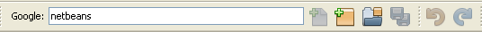

When the user presses Enter in the toolbar above, the IDE's default browser will open and the text in the toolbar will be sent to a Google search, with the results available in the open browser. To create this toolbar, you will use the  link:http://bits.netbeans.org/dev/javadoc/[NetBeans APIs] to enhance the IDE's feature set. Specifically, you will create an action that is invoked by a button in the toolbar. You will then create a Swing JPanel containing a  ``JLabel``  and  ``JTextField``  as GUI components. Finally, you will implement  link:http://bits.netbeans.org/dev/javadoc/org-openide-util/org/openide/util/actions/Presenter.Toolbar.html[ ``Presenter.Toolbar`` ] to return the JPanel so that it displays in the toolbar, instead of the button.

Do some background reading before diving into this tutorial. In particular, read the  link:http://bits.netbeans.org/dev/javadoc/org-openide-modules/org/openide/modules/doc-files/api.html[Modules API Reference] document, which explains what modules are and provides some context for this tutorial, while noting that there is an extensive Reference Material section on the  link:https://netbeans.apache.org/kb/docs/platform.html[NetBeans Platform Learning Trail].

== Setting up the Module Project

When developing the module, you have to make sure the structure of your project is set up correctly. NetBeans IDE provides a Module Project wizard that sets up all of the basic files required for a module.

[start=1]
1. Choose File > New Project (Ctrl+Shift+N). Under Categories, select NetBeans Modules. Under Projects, select Module. Click Next.

[start=2]
1. In the Name and Location panel, type  ``GoogleToolbar``  in the Project Name field.

[start=3]
1. Change the Project Location to any directory on your computer where the module will be stored.

[start=4]
1. If not selected by default, select "Standalone Module", since the module will not be part of a new application or a new collection of modules. Instead, it will be a module that will be deployed into an existing application, that is, NetBeans IDE.

[start=5]
1. If not selected by default, select "Set as Main Project", so that NetBeans IDE toolbar buttons such as "Run Project" (F6) will apply to the module you are currently creating. 
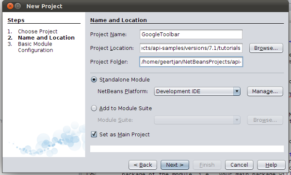 If you see the above, click Next.

[start=6]
1. In the Basic Module Configuration panel, type  ``org.myorg.googletoolbar``  in "Code Name Base", which defines the unique string identifying the module you are creating. The code name base is also used as the main package of the module, i.e., your main package will be "org.myorg.googletoolbar".

[start=7]
1. Do not select the "Generate OSGi Bundle" checkbox, since we will be using the default NetBeans module system, rather than OSGi. 
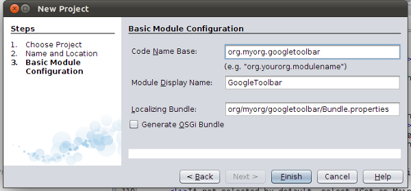 

The IDE creates the  ``GoogleToolbar``  project. A project is a NetBeans IDE compilation/deployment unit. It contains a "build.xml" file, which is an Ant script for compiling and running the project. The project contains all of your sources.

The project opens in the IDE. You can view its logical structure in the Projects window (Ctrl+1) and its file structure in the Files window (Ctrl+2).

If you expand the Important Files node, you can open the manifest, which has this content:

[source,java]
----

Manifest-Version: 1.0
OpenIDE-Module: org.myorg.googletoolbar
OpenIDE-Module-Localizing-Bundle: org/myorg/googletoolbar/Bundle.properties
OpenIDE-Module-Specification-Version: 1.0
----

For details on these NetBeans-specific manifest keys, read the  link:http://bits.netbeans.org/dev/javadoc/org-openide-modules/org/openide/modules/doc-files/api.html[NetBeans Modules API] Javadoc description. 
 

== Coding the Module

In order to create a Google toolbar, you need to complete the following steps:

* <<creating-action,Create the Action>>
* <<creating-panel,Create the Toolbar>>

=== Creating the Action

In this section, you use a template in NetBeans IDE to create a new Action. An Action is a piece of code invoked by the user to do something in the application. An Action is invoked from a menu item, toolbar button, or keyboard shortcut in the application.

Questions about Actions in the NetBeans Platform are discussed  link:https://netbeans.apache.org/wiki/index.asciidoc#_actions:_how_to_add_things_to_files.2c_folders.2c_menus.2c_toolbars_and_more[here] in the  link:https://netbeans.apache.org/wiki/[NetBeans Platform Wiki].

As you will see, the template will create a Java class with annotations. At compile-time, the annotations are converted into XML elements in a file contributed to the virtual filesystem of the application, which is how an Action is registered in the application. Therefore, even though the template is useful, it is not essential. You could simply create a plain Java class instead of using the template and then annotate the class as described below.

[start=1]
1. Right-click the project node and choose New > Action (if Action is not displayed, access it by choosing Other, then in the New File wizard under Categories, select Module Development). Click Next.

[start=2]
1. In the Action Type panel keep the default setting, which will let the IDE create an action that subclasses  ``ActionListener`` , as shown below: 
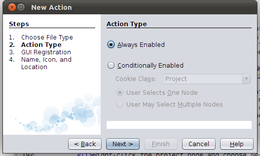 Click Next.

[start=3]
1. In the GUI Registration panel, select File from the Category drop-down list. The Category drop-down list controls where an action is shown in the Keyboard Shortcuts editor in the IDE. Next, deselect Global Menu Item and select Global Toolbar Button. In the Toolbar drop-down list, select File, then in the Position drop-down list, select the toolbar button's position within the toolbar, such as the one shown below: 
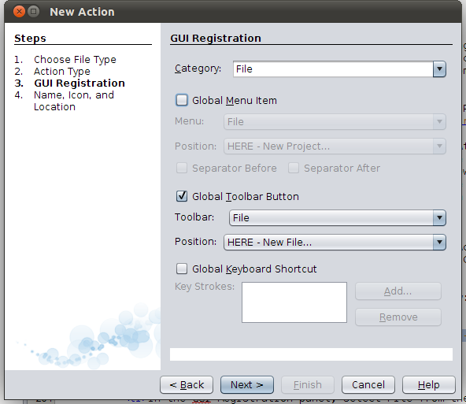 Click Next.

[start=4]
1. 
In the Name and Location panel, type  ``GoogleActionListener``  as the Class Name and  ``Google``  as the Display Name. Browse to an icon that has a dimension of 16x16 pixels. (If you have an icon in the same folder with the same name, of size 24x24 pixels, appended with "24", e.g., "google.png/google24.png", it will automatically be included and it will be used for the large icon displayed in the toolbar.)

If needed, here are two icons you can use: 
image::images/google_70_google.png[] 
image::images/google_70_google24.png[]. However, note that in the end, you will not use the icon at all once you have created the toolbar—instead, you will display the JPanel that you create in the next section. The final panel of the New Action wizard should now look like this: 

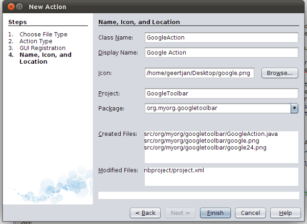 

Click Finish.

NOTE:   ``GoogleAction.java``  is added to the  ``org.myorg.googletoolbar``  package in the Projects window. The new class has this content:

[source,java]
----

package org.myorg.googletoolbar;

import java.awt.event.ActionEvent;
import java.awt.event.ActionListener;
import org.openide.awt.ActionRegistration;
import org.openide.awt.ActionReference;
import org.openide.awt.ActionReferences;
import org.openide.awt.ActionID;
import org.openide.util.NbBundle.Messages;

link:http://bits.netbeans.org/dev/javadoc/org-openide-awt/org/openide/awt/ActionID.html[@ActionID](category = "File",
id = "org.myorg.googletoolbar.GoogleAction")
link:http://bits.netbeans.org/dev/javadoc/org-openide-awt/org/openide/awt/ActionRegistration.html[@ActionRegistration](iconBase = "org/myorg/googletoolbar/google.png",
displayName = "#CTL_GoogleAction")
link:http://bits.netbeans.org/dev/javadoc/org-openide-awt/org/openide/awt/ActionReferences.html[@ActionReferences]({
link:http://bits.netbeans.org/dev/javadoc/org-openide-awt/org/openide/awt/ActionReference.html[@ActionReference](path = "Toolbars/File", position = 0)
})
link:http://bits.netbeans.org/dev/javadoc/org-openide-util/org/openide/util/NbBundle.Messages.html[@Messages]("CTL_GoogleAction=Google Action")
public final class GoogleAction implements ActionListener {

    public void actionPerformed(ActionEvent e) {
        // TODO implement action body
    }

}
            
----

Next, when you build the module, the class annotations that you see above will be converted to XML tags in a file that will be contributed to the virtual filesystem of the application. The XML file will be named "generated-layer.xml" and will be found in the "build\classes\META-INF" folder of your module, which you can see if the Files window (Ctrl-2) is open in the IDE. This file is created at compile-time and contains XML entries generated from the NetBeans annotations that you have defined in your Java classes. Together with the "layer.xml" file that your module can optionally provide, the "generated-layer.xml" file defines the contributions that the module makes to the virtual filesystem. Read about the virtual filesystem  link:https://netbeans.apache.org/wiki/devfaqsystemfilesystem[here], in the  link:https://netbeans.apache.org/wiki/[NetBeans Platform Wiki].

[start=5]
1. In the Projects window, right-click the  ``GoogleToolbar``  project node and choose Run. The module is built and installed in a new instance of the IDE (i.e., the target platform). By default, the default target platform is the version of the IDE you are currently working in. The target platform opens so that you can try out the new module. You should be able to see your button and click it: 
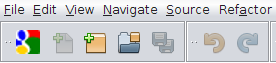

In the next section, you change the  ``JButton``  that has been created for you in the toolbar with your own  ``JComponent`` .

=== Creating the Toolbar

In this section, you create a  ``JPanel``  that will replace the  ``JButton``  that the NetBeans Platform created for you in the previous section.

[start=1]
1. Right-click the project node and choose New > Other. Under Categories, select Swing GUI Forms. Under Projects, select JPanel Form. Click Next.

[start=2]
1. In the Name and Location panel, type  ``GooglePanel``  as the Class Name and select the package from the drop-down list. Click Finish.  ``GooglePanel.java``  is added to the package and is opened in the Design view in the Source Editor.

[start=3]
1. Place the cursor at the bottom right-hand corner of the JPanel, then select the JPanel and drag the cursor to resize it, so that its width and length resemble that of a toolbar, as shown below: 
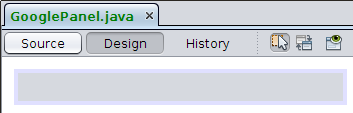

[start=4]
1. Drag a  ``JTextField``  item and a  ``JLabel``  item from the Palette (Ctrl+Shift+8) directly into the  ``JPanel`` , then resize the  ``JPanel``  and the other two items so that they fit snugly together. Finally, click the  ``JLabel``  and change its text to  ``Google:`` , then delete the default text in the  ``JTextField`` . (If you click F2 over the  ``JLabel``  and the  ``JTextField`` , their display text will become editable.) Your  ``JPanel``  should now resemble the image shown below: 
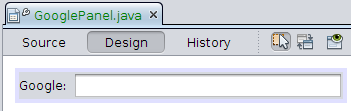

[start=5]
1. Right-click on the JTextField and choose Events > Action > actionPerformed. This generates a  ``jTextField1ActionPerformed()``  method in the  ``GooglePanel.java``  source code, which displays in the Source Editor. Fill out the  ``jTextFieljTextField1ActionPerformedd1KeyTyped()``  method as follows (inserted text shown in *bold*):

[source,java]
----

private void jTextField1ActionPerformed(java.awt.event.ActionEvent evt) {
    *
    try {
        String searchText = URLEncoder.encode(jTextField1.getText(), "UTF-8");
        URLDisplayer.getDefault().showURL
           (new URL("http://www.google.com/search?hl=en&amp;q="+searchText+"&amp;btnG=Google+Search"));
    } catch (Exception eee){
        return;//nothing much to do
    }
    *
}
----

If you need to, right-click in the Source Editor and choose Format (Alt+Shift+F).

[start=6]
1. Right-click in the Source Editor and choose Fix Imports (Ctrl+Shift+I). The Fix All Imports dialog displays, listing suggested paths for unrecognized classes: 
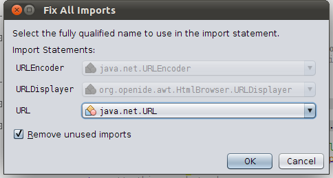 Click OK. The IDE creates the following import statements for  ``GooglePanel.java`` :

[source,java]
----

import java.net.URL;
import java.net.URLEncoder;
import  link:http://bits.netbeans.org/dev/javadoc/org-openide-awt/org/openide/awt/HtmlBrowser.URLDisplayer.html[org.openide.awt.HtmlBrowser.URLDisplayer];
----

Also notice that all errors disappear from the Source Editor.

[start=7]
1. 
Because the  ``JPanel``  you have created is the component that will render the toolbar, you need to implement  `` link:http://bits.netbeans.org/dev/javadoc/org-openide-util/org/openide/util/actions/Presenter.Toolbar.html[Presenter.Toolbar]``  to display it in the toolbar. Open  ``GoogleAction.java`` . Change the signature so that  `` link:http://bits.netbeans.org/dev/javadoc/org-openide-util/org/openide/util/actions/Presenter.Toolbar.html[Presenter.Toolbar]``  is implemented.

NOTE:  When using  ``Presenter.Toolbar`` , you need to extend  ``AbstractAction`` , instead of implementing  ``ActionListener`` .

Also, you can delete the "iconBase" attribute (as well as the icon from the source tree) because you no longer need an icon in this scenario.

The result of these changes is as follows:

[source,java]
----

import java.awt.Component;
import java.awt.event.ActionEvent;
import javax.swing.AbstractAction;
import org.openide.awt.ActionRegistration;
import org.openide.awt.ActionReference;
import org.openide.awt.ActionReferences;
import org.openide.awt.ActionID;
import org.openide.util.NbBundle.Messages;
import org.openide.util.actions.Presenter;

@ActionID(category = "File",
id = "org.myorg.googletoolbar.GoogleAction")
@ActionRegistration(displayName = "(irrelevant)")
@ActionReferences({
    @ActionReference(path = "Toolbars/File", position = 0)
})
public final class GoogleAction extends AbstractAction implements Presenter.Toolbar {

    @Override
    public Component getToolbarPresenter() {
        return new GooglePanel();
    }
    
    public void actionPerformed(ActionEvent e) {
        // not needed, because the GooglePanel handles the action
    }
    
}
----

[start=8]
1. Run the module again. This time, instead of a  ``JButton`` , you should see your  ``JPanel`` . Type a search string in the text field: 

Press Enter. The IDE's default browser starts up, if you have set one in the Options window. The Google URL and your search string are sent to the browser and a search is performed. When the search results are returned, you can view them in the browser.

In this section, you have created a  ``JPanel``  that will display a  ``JTextField``  and a  ``JLabel`` . When Enter is pressed in the  ``JTextField`` , its content will be sent to a Google search. The HTML browser will open and you will see the result of the Google search. The  ``Action``  class is used to integrate the  ``JPanel``  within the application's toolbar, as registered via the annotations in the  ``Action``  class.

== Sharing the Module

Now that you have built a working module that enhances the IDE, why not share it with other developers? NetBeans IDE offers an easy way to create a binary NetBeans Module file (.nbm) which is a universal means of allowing others to experiment with it in their own versions of the IDE.

To create a module binary, do the following:

In the Projects window, right-click the  ``GoogleToolbar``  project node and choose Create NBM. The new NBM file is created and you can view it in the Files window (Ctrl+2): 

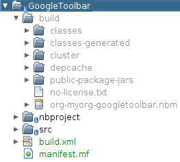 

link:http://netbeans.apache.org/community/mailing-lists.html[ Send Us Your Feedback]

== See Also

This concludes the NetBeans Plugin Quick Start. This document has described how to create a plugin that adds a Google Search toolbar to the IDE. For more information about creating and developing plugins, see the following resources:

*  link:https://netbeans.apache.org/kb/docs/platform.html[NetBeans Platform Learning Trail]
*  link:http://bits.netbeans.org/dev/javadoc/[NetBeans API Javadoc]
* NetBeans API classes used in this tutorial:
*  `` link:http://bits.netbeans.org/dev/javadoc/org-openide-awt/org/openide/awt/HtmlBrowser.URLDisplayer.html[HtmlBrowser.URLDisplayer]`` 
*  `` link:http://bits.netbeans.org/dev/javadoc/org-openide-util/org/openide/util/actions/Presenter.Toolbar.html[Presenter.Toolbar]`` 
