// 
//     Licensed to the Apache Software Foundation (ASF) under one
//     or more contributor license agreements.  See the NOTICE file
//     distributed with this work for additional information
//     regarding copyright ownership.  The ASF licenses this file
//     to you under the Apache License, Version 2.0 (the
//     "License"); you may not use this file except in compliance
//     with the License.  You may obtain a copy of the License at
// 
//       http://www.apache.org/licenses/LICENSE-2.0
// 
//     Unless required by applicable law or agreed to in writing,
//     software distributed under the License is distributed on an
//     "AS IS" BASIS, WITHOUT WARRANTIES OR CONDITIONS OF ANY
//     KIND, either express or implied.  See the License for the
//     specific language governing permissions and limitations
//     under the License.
//

= NetBeans Platform HTML Editor
:jbake-type: platform_tutorial
:jbake-tags: tutorials 
:jbake-status: published
:syntax: true
:source-highlighter: pygments
:toc: left
:toc-title:
:icons: font
:experimental:
:description: NetBeans Platform HTML Editor - Apache NetBeans
:keywords: Apache NetBeans Platform, Platform Tutorials, NetBeans Platform HTML Editor

This tutorial provides a very simple and quick introduction to the NetBeans Platform workflow by walking you through the creation of a simple HTML Editor. Though simple to create, the HTML Editor you create will be a mature application because it will reuse the infrastructure provided by the NetBeans Platform, as well as several modules from NetBeans IDE. For example, without any coding, your HTML Editor will have a mature window system, which it reuses from the NetBeans Platform. Once you are done with this tutorial, you will have a general understanding of how to create, build, and run applications on top of the NetBeans Platform.

After you finish this tutorial, you can move on to the  link:https://netbeans.apache.org/kb/docs/platform.html[NetBeans Platform learning trail]. The learning trail provides comprehensive tutorials that highlight a wide range of NetBeans APIs for a variety of application types. If you do not want to do a "Hello World" application, you can skip this tutorial and jump straight to the learning trail.

NOTE:  This document uses NetBeans IDE 7.1 and NetBeans Platform 7.1. If you are using an earlier version of these products, see  link:../70/nbm-htmleditor.html[the previous version of this document]. If this is your first encounter with the NetBeans Platform, you are recommended to work through the  link:nbm-quick-start.html[NetBeans Platform Quick Start] before continuing with this one. If, instead of learning how to create a NetBeans Platform application, you would like to learn how to create a NetBeans plugin, see the  link:nbm-google.html[NetBeans Plugin Quick Start].

At the end of this tutorial, you will have an HTML Editor that looks like this:

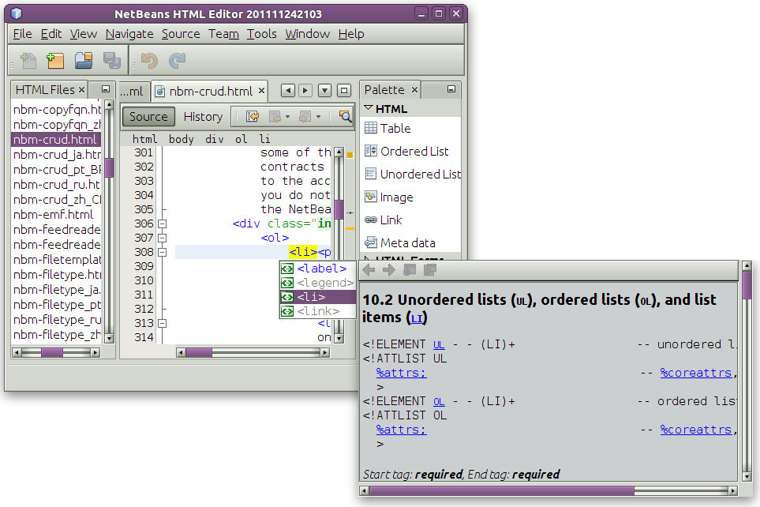

NOTE:  Although this a very simple demo application, it is not a toy! It is a _real_ program that supports easy editing of HTML pages, with features such as code completion, validation, and predefined HTML snippets.

The HTML Editor that you create in this tutorial is a rich-client application built "on top of the NetBeans Platform". What this means is that the core of the IDE, which is what the NetBeans Platform _is_, will be the base of your application. On top of the NetBeans Platform, you add the modules that you need and exclude the ones that the IDE needs but that your application doesn't. Here you see some of the IDE's modules, added to the NetBeans Platform, which is its base:

image::images/htmleditor_diagram.png[]

Creating this HTML Editor means generating an application skeleton, excluding the modules and user interface items that you do not need, and then setting the NetBeans IDE's Favorites window as the window that will open by default when the IDE starts. The Favorites window will be rebranded so that it will be a browser for HTML documents. All of these activities are supported by user interface elements in the IDE, as you will learn in this tutorial.

You will see for yourself how simple and easy it is to build, or to be more precise, to _assemble_ a full-featured application on top of the NetBeans Platform. At the end, you are shown how to make the final product easily downloadable and launchable using WebStart.

NOTE:  Even though it is a separate product, there is no need to download the NetBeans Platform separately for purposes of this tutorial. You will develop the rich-client application in the IDE and then exclude the modules that are specific to the IDE but that are superfluous to you application.

== Generating the Skeleton Application

When creating an application on the NetBeans Platform, the very first step is to create a NetBeans Platform Application project. The template we will use to create our new NetBeans Platform Application project includes a subset of the modules provided by the NetBeans Platform.

[start=1]
1. Using the New Project wizard (Ctrl-Shift-N), create a NetBeans Platform Application Project from the template in the NetBeans modules category, as shown below:

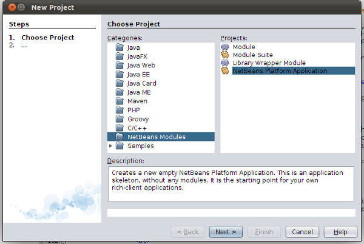

[start=2]
1. Click Next and name the NetBeans Platform Application project "NetBeansHTMLEditor":

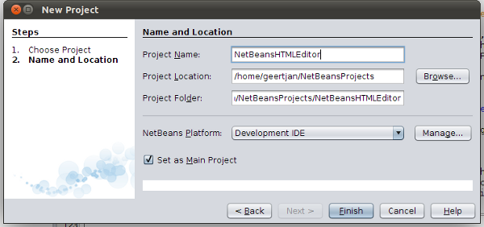

Click Finish.

[start=3]
1. We'll start by using the IDE to brand our new application. Right-click the project node, choose Branding, and then make a few changes in the Branding Editor:

* In the Basic panel, make sure that you like the application title for the titlebar, as well as the icons, as shown below:

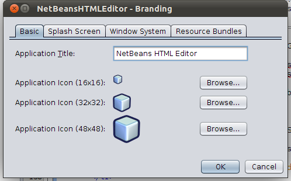

* In the Splash Screen panel, notice that you can provide the application's splash screen, and progress bar brandings, as shown below:

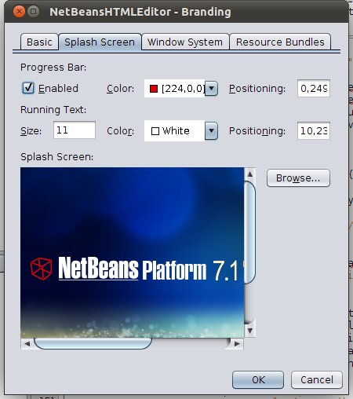

NOTE:  If you do not have a splash screen, use  link:images/htmleditor_splash.gif[this one]

.

[start=4]
1. Now that the application has been branded, let's make sure that the modules we need for our HTML editor are available to the application. Right-click the project node, choose Properties, and then go to the Libraries panel in the Project Properties dialog box. Here you see a list of "clusters". A cluster is a collection of related modules. The only clusters that need to be selected are, in the first place,  ``platform`` , which is already selected, as well as all the HTML modules in the "ide" cluster, as shown below:

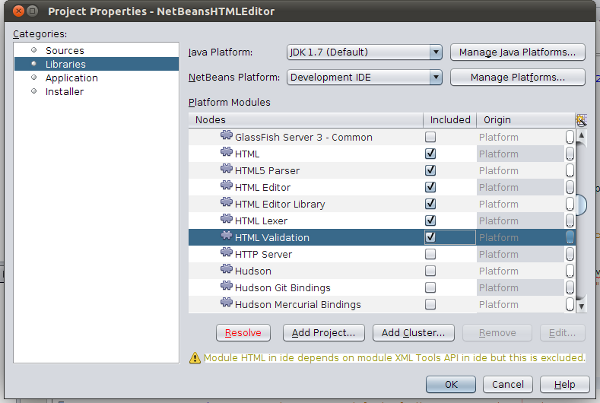

Next, click the "Resolve" button and the required modules will be added to the set of modules needed by modules that you have already selected to be part of the application.

Finally, also select the "Lexer to NetBeans Bridge" module, as shown below:

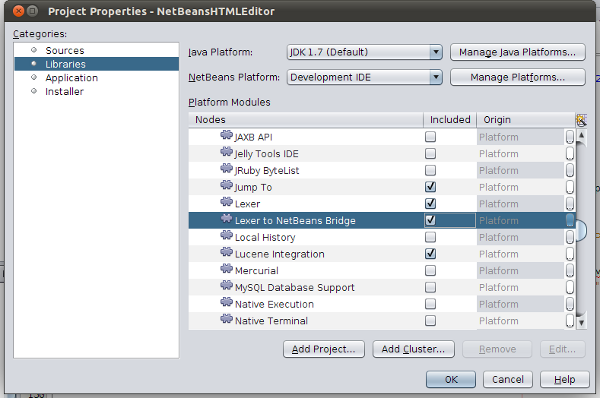

[start=5]
1. Now you have the subset of NetBeans modules relevant to your HTML Editor. Right-click the application and run it, open the Favorites window (from the Window menu), and then open an HTML file. You should see a fully functional HTML editor.

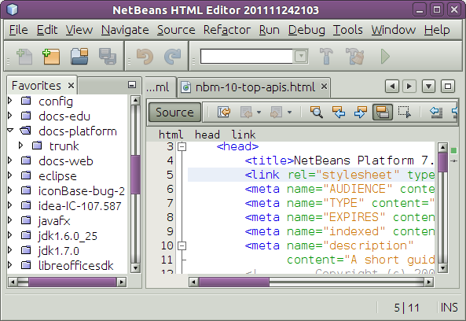

Even though you need all the NetBeans modules that you now have, you probably do not need all of the user interface elements, such as all the elements in the Run menu and the Debug menu, that these modules give you. In the next sections, you tweak the user interface and customize the window layout specifically for the HTML Editor that you are creating.

== Tweaking the User Interface: Removing Menus and Toolbars

You can keep or reject as much of the user interface that your selected modules give you. For example, your HTML Editor probably does not need any or all of the items under the Tools menu. Similarly, maybe there are toolbars or toolbar buttons that you can do without. In this section, you prune the IDE's user interface until you are left with a subset that is useful to your specific rich-client application.

[start=1]
1. Expand the NetBeans Platform Application project, right-click the Modules node and choose Add New, as shown below:

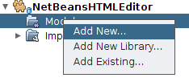

The New Project wizard (Ctrl-Shift-N) appears.

[start=2]
1. Name the project  ``BrandingModule`` . Click Next.

[start=3]
1. In the Code Name Base field, type  ``org.netbeans.brandingmodule``  and then complete the wizard.

[start=4]
1. 
Next, you need a "layer.xml" file, which the NetBeans Platform will merge with its virtual filesystem. The layer.xml file will declare the items that should be added to or removed from the virtual filesystem of your HTML Editor.

Right-click the module, choose New, and then Other, as shown below:

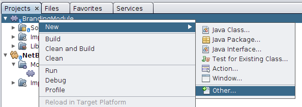

In the New File dialog, choose "Module Development | XML Layer" and then complete the wizard.

Notice that you can expand the newly created layer.xml file and show all the folders and files declared in the NetBeans Platform's virtual filesystem.

[start=5]
1. In the  ``<this layer in context>``  node, the IDE shows you a merged view of all folders and files that all modules register in their layers. To exclude items, you can right-click them and choose 'Delete', as shown below:

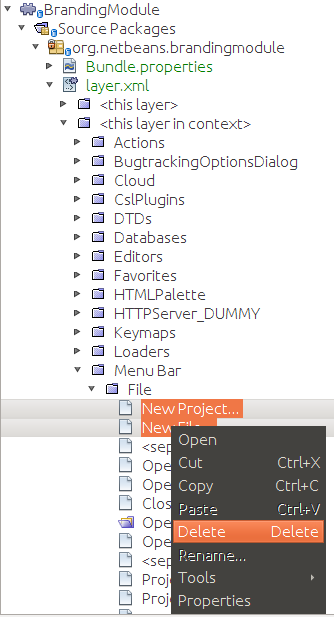

The IDE then adds tags to the module's  ``layer.xml``  file which, when the module is installed, hides the items that you have deleted. For example, by right-clicking within  ``Menu Bar/Edit`` , you can remove menu items from the Edit menu that are not necessary for the HTML Editor. By doing this, you generate snippets such as the following in the  ``layer.xml``  file:

[source,xml]
----

<folder name="Menu">
    <folder name="Edit">
        <file name="org-netbeans-modules-editor-MainMenuAction$StartMacroRecordingAction.instance_hidden"/>
        <file name="org-netbeans-modules-editor-MainMenuAction$StopMacroRecordingAction.instance_hidden"/>
    </folder>       
</folder>
----

The result of the above snippet is that the  ``Start Macro Recording``  and  ``Stop Macro Recording``  actions provided by another module are removed from the menu by your branding module. To show them again, simply delete the tags above from the  ``layer.xml``  file.

[start=6]
1. Use the approach described in the previous step to hide as many toolbars, toolbar buttons, menus, and menu items as you want. When you have completed this stage, look in the  ``layer.xml``  file. When you do so, you should see something similar to the following, depending on the items that you have deleted:

[source,xml]
----

<?xml version="1.0" encoding="UTF-8"?>
<!DOCTYPE filesystem PUBLIC "-//NetBeans//DTD Filesystem 1.2//EN" "https://netbeans.org/dtds/filesystem-1_2.dtd">
<filesystem>
    <folder name="Menu">
        <file name="BuildProject_hidden"/>
        <folder name="File">
            <file name="Separator2.instance_hidden"/>
            <file name="SeparatorNew.instance_hidden"/>
            <file name="SeparatorOpen.instance_hidden"/>
            <file name="org-netbeans-modules-project-ui-CloseProject.shadow_hidden"/>
            <file name="org-netbeans-modules-project-ui-CustomizeProject.shadow_hidden"/>
            <file name="org-netbeans-modules-project-ui-NewFile.shadow_hidden"/>
            <file name="org-netbeans-modules-project-ui-NewProject.shadow_hidden"/>
            <file name="org-netbeans-modules-project-ui-OpenProject.shadow_hidden"/>
            <file name="org-netbeans-modules-project-ui-RecentProjects.shadow_hidden"/>
            <file name="org-netbeans-modules-project-ui-SetMainProject.shadow_hidden"/>
            <file name="org-netbeans-modules-project-ui-groups-GroupsMenu.shadow_hidden"/>
        </folder>
        <file name="Refactoring_hidden"/>
        <file name="RunProject_hidden"/>
        <folder name="Window">
            <file name="ViewRuntimeTabAction.shadow_hidden"/>
            <file name="org-netbeans-modules-project-ui-logical-tab-action.shadow_hidden"/>
            <file name="org-netbeans-modules-project-ui-physical-tab-action.shadow_hidden"/>
        </folder>
    </folder>
    <folder name="Toolbars">
        <file name="Build_hidden"/>
        <file name="Debug_hidden"/>
    </folder>
</filesystem>
----

[start=7]
1. Run the application again and notice that you now have less menus and toolbar buttons than you had before:

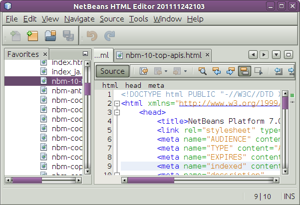

== Tweaking the Window Layout: Opening Windows by Default

By using the  ``<this layer in context>``  node, you can not only delete existing user interface elements, but you can also change their content. For example, the HTML Editor works on HTML files, so in contrast to the regular IDE, which works with Java source files and projects as well, it makes sense to show the  ``Favorites``  window in the initial layout.

The definition of the window layout is also described as files in layers, all stored under the  ``Windows2``  folder. The files in the  ``Windows2``  folder are pseudo-human readable XML files defined by the  link:http://bits.netbeans.org/dev/javadoc/org-openide-windows/org/openide/windows/doc-files/api.html[ Window System APIs]. They are quite complex but the good news is that, for purposes of our HTML Editor, it is not necessary to understand them fully, as shown below.

[start=1]
1. In your branding module, find the "layer.xml" file, in the main package of the module. Expand the file, in the Projects window. One of the subfolders is name  ``<this layer in context>`` . Expand the folder and find the  ``Windows2/Modes``  subfolder. Within it, find the file highlighted below, named "favorites.wstcref":

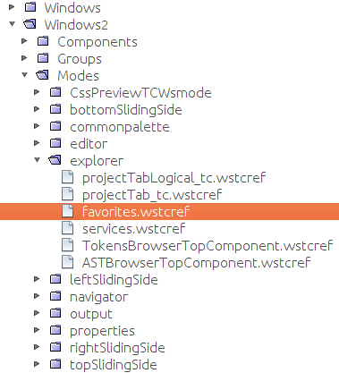

The file contains the following:

[source,xml]
----

<tc-ref version="2.0">
    <module name="org.netbeans.modules.favorites/1" spec="1.1" />
    <tc-id id="favorites" />
    <state opened="false" />
</tc-ref>
----

Even though most of the XML is cryptic, there is one line which seems promising—without needing to read any kind of documentation, it seems likely that changing the  ``false``  to  ``true``  is going to make the component opened by default. Do so now.

[start=2]
1. You should now see that your branding module contains a new file, one for each of the files that you changed. In effect, these files override the ones that you found in the previous steps. These have been automatically registered in your module's  ``layer.xml``  file.

Run the application again and you should see the following, that is, the Favorites window should be opened automatically when the application has started up:

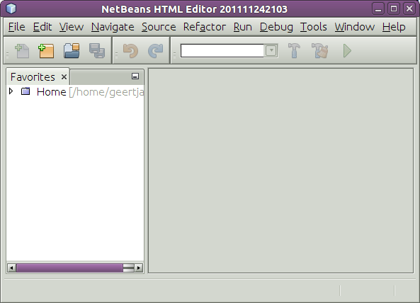

== Tweaking the Favorites Window: Customizing Predefined Strings

In the subfolders of a NetBeans Platform Application project's  ``branding``  folder, which is visible in the Files window, you can override strings defined in the NetBeans Platform sources. In this section, you override strings that define labels used in the Favorites window. For example, you change the "Favorites" label to "HTML Files", because you will use that window specifically for HTML files.

[start=1]
1. Right-click the project node and choose "Branding", as you did earlier in this tutorial. This time, open the Resource Bundles tab of the Branding Editor, as shown below:

image::images/htmleditor_71_new-nb-app-wiz96.png[]

[start=2]
1. Type "favorites" in the "Search" field, after which the list of strings filters down to those that contain the entered string, as shown below:

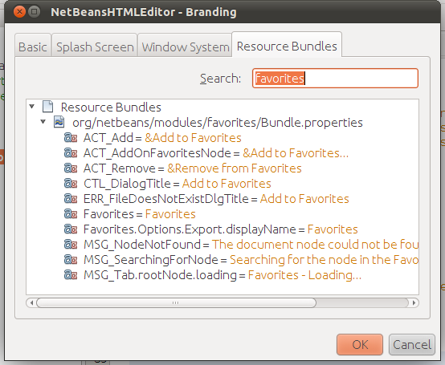

[start=3]
1. For each string you want to brand, right-click it in the dialog shown in the previous step and choose "Add To Branding". Then type the new string for the selected item.

When you complete your work in the Branding Editor, switch to the Files window and notice that a new "bundle.properties" file has been created within the application branding folder, overriding the related "bundle.properties" file within the NetBeans Platform:

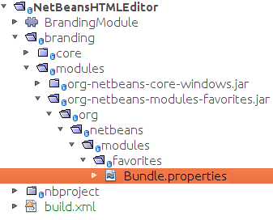

[start=4]
1. Run the application again and you will see that the texts and labels in the Favorites window have changed to those you have defined:

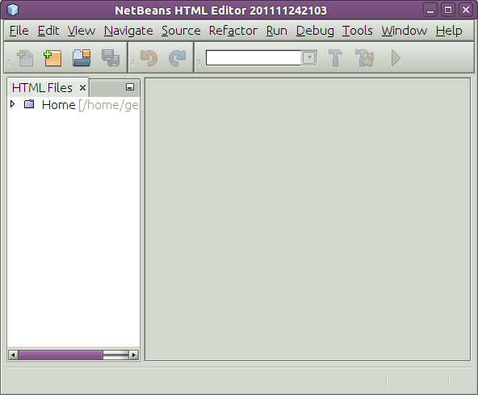

This illustrates the point that you can take a component from the NetBeans Platform and then brand it to meet your business requirements.

== Tweaking the Feature Set: Adding Versioning Support

We now have a complete HTML Editor. However, since the editor is based on top of NetBeans IDE, we can include as many of the IDE's features as we need.

As an example, let's add versioning support in our application. It would be a useful feature for our users, who are likely to have a repository where HTML files can be stored. By integrating the IDE's versioning tools into our HTML editor, we enable our users to interact with their repositories.

[start=1]
1. Right-click the application, choose Properties, and use the Libraries tab to add the "Local History" module, which is in the "ide" cluster:

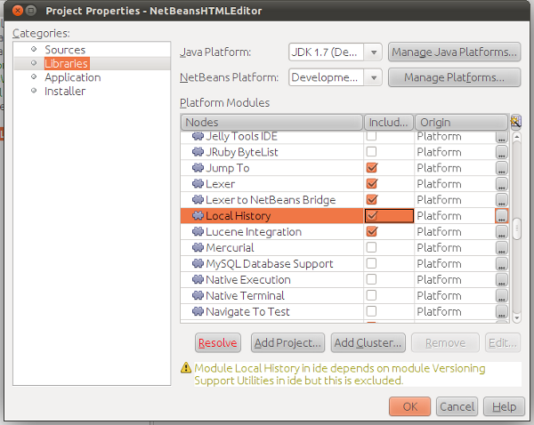

Now click the "Resolve" button, so that any related modules will also be included in the application.

[start=2]
1. Run the application again and notice that you now have a History tab for each HTML document, as well as a new "Team" menu, currently containing one item, for Local History:

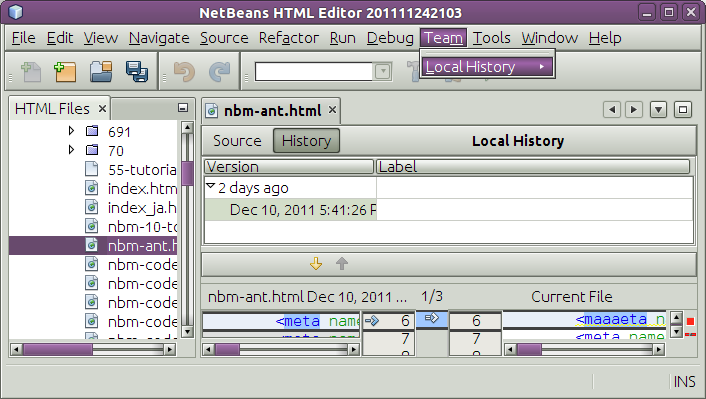

[start=3]
1. Repeat step 1 above, this time selecting "Mercurial":

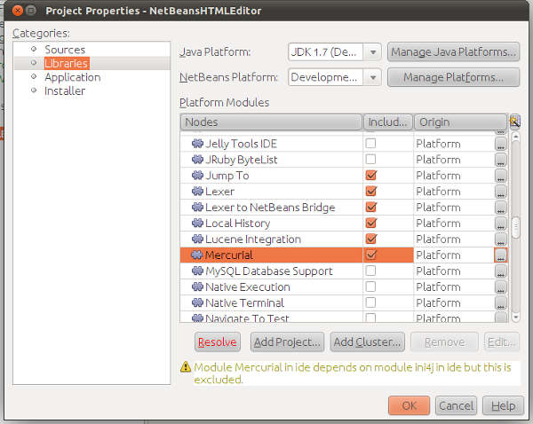

Again, click the "Resolve" button, so that any related modules will also be included in the application. Also find the Subversion modules and add them to the application. When you run the application again, the Team menu shows the additional versioning tools that have been included:

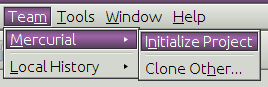

This illustrates the point that you can include additional modules from NetBeans IDE and the NetBeans Platform to include new features in your application.

== Distributing the Application

Choose one of two approaches for distributing your application. If you want to maintain as much control over your application as possible, you will use web start (JNLP) to distribute your application over the web. In this scenario, whenever you want to update the application, you will do so locally and let your end users know about the update, which they will automatically have available next time they start up your application over the web. Alternatively, distribute a ZIP file containing your application. The end users will then have the complete application locally available. You would then distribute updates and new features via the update mechanism, described below.

=== Distributing the Application via a ZIP File

To make your application extendable, you need to let your users install modules to enhance the application's functionality. To do so, your application is already bundling the Plugin Manager.

[start=1]
1. Choose the Tools | Plugins menu item and install some plugins that are useful to your HTML Editor. Browse the  link:http://plugins.netbeans.org/PluginPortal/[Plugin Portal] to find some suitable ones. This is also how your end users will update their local installation of your application.

[start=2]
1. Right-click the application's project node and choose Build ZIP Distribution.

[start=3]
1. 
In the  ``dist``  folder (visible in the Files window), you should now be able to see a ZIP file, as follows:

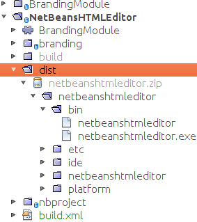

NOTE:  The application's launcher is created in the  ``bin``  folder, as shown above.

=== Distributing the HTML Editor via the Shared NetBeans Web Start Repository

Instead of distributing a ZIP file, let's prepare for a webstart distribution by finetuning the  ``master.jnlp``  file that is generated the first time you start the application via "Run JNLP Application". Even though it does the job, it is not yet ready for distribution. At the very least, you need to change the information section to provide better descriptions and icons.

Another change to the standard JNLP infrastructure is the use of a shared JNLP repository on www.netbeans.org. By default, the JNLP application generated for a suite always contains all its modules as well as all the modules it depends on. This may be useful for intranet usage, but it is a bit less practical for wide internet use. When on the internet, it is much better if all the applications built on the NetBeans Platform refer to one repository of NetBeans modules, which means that such modules are shared and do not need to be downloaded more than once.

There is such a repository for NetBeans Platform. It does not contain all the modules that NetBeans IDE has, but it contains enough to make most of non-IDE applications like our HTML Editor possible. To use the repository, you only need to modify the application's  ``platform.properties``  by adding the correct URL:

[source,java]
----

# share the libraries from common repository on netbeans.org
# this URL is for release71 JNLP files:
jnlp.platform.codebase=http://bits.netbeans.org/7.1/jnlp/
        
----

Similarly, for 7.0:

[source,java]
----

# share the libraries from common repository on netbeans.org
# this URL is for release70 JNLP files:
jnlp.platform.codebase=http://bits.netbeans.org/7.0/jnlp/
        
----

Similarly, for 6.9:

[source,java]
----

# share the libraries from common repository on netbeans.org
# this URL is for release69 JNLP files:
jnlp.platform.codebase=http://bits.netbeans.org/6.9/jnlp/
        
----

As soon as the application is started as a JNLP application, all its shared plug-in modules are going to be loaded from netbeans.org and shared with other applications doing the same.

link:http://netbeans.apache.org/community/mailing-lists.html[Send Us Your Feedback]

== See Also

This concludes the NetBeans HTML Editor Tutorial. For more information about creating and developing applications on the NetBeans Platform, see the following resources:

*  link:https://netbeans.apache.org/kb/docs/platform.html[Other Related Tutorials]
*  link:https://bits.netbeans.org/dev/javadoc/[NetBeans API Javadoc]
