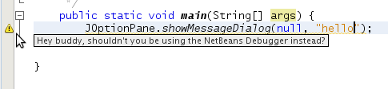
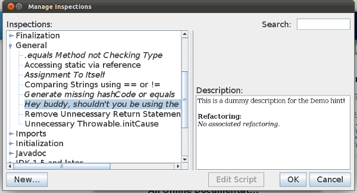

// 
//     Licensed to the Apache Software Foundation (ASF) under one
//     or more contributor license agreements.  See the NOTICE file
//     distributed with this work for additional information
//     regarding copyright ownership.  The ASF licenses this file
//     to you under the Apache License, Version 2.0 (the
//     "License"); you may not use this file except in compliance
//     with the License.  You may obtain a copy of the License at
// 
//       http://www.apache.org/licenses/LICENSE-2.0
// 
//     Unless required by applicable law or agreed to in writing,
//     software distributed under the License is distributed on an
//     "AS IS" BASIS, WITHOUT WARRANTIES OR CONDITIONS OF ANY
//     KIND, either express or implied.  See the License for the
//     specific language governing permissions and limitations
//     under the License.
//

= NetBeans Java Hint Module Tutorial
:jbake-type: platform_tutorial
:jbake-tags: tutorials 
:jbake-status: published
:syntax: true
:source-highlighter: pygments
:toc: left
:toc-title:
:icons: font
:experimental:
:description: NetBeans Java Hint Module Tutorial - Apache NetBeans
:keywords: Apache NetBeans Platform, Platform Tutorials, NetBeans Java Hint Module Tutorial

This tutorial demonstrates how to create a NetBeans module that provides one or more Java hints. In this particular scenario, whenever the user types " ``showMessageDialog`` ", a Java hint will appear, with the reminder that using the NetBeans Debugger is more effective than using calls to  ``JOptionPane`` :

NOTE:  This document is applicable to NetBeans IDE 7.1 and NetBeans Platform 7.1. If you are using an earlier version, see  link:../70/nbm-java-hint.html[the previous version of this document].

== Setting up the Module Project

Before you start writing the module, you have to make sure you that your project is set up correctly. The IDE provides a wizard that sets up all the basic files needed for a module.

[start=1]
1. Choose File > New Project (Ctrl+Shift+N). Under Categories, select NetBeans Modules. Under Projects, select Module. Click Next.

[start=2]
1. In the Name and Location panel, type  ``HintDemo``  in the Project Name field. Change the Project Location to any directory on your computer. Leave the Standalone Module option and Set as Main Project checkbox selected. Click Next.

[start=3]
1. In the Basic Module Configuration panel, type  ``org.nb.hintdemo``  in Code Name Base. Click Finish.

The IDE creates the  ``HintDemo``  project. The project contains all of your sources and project metadata, such as the project's Ant build script. The project opens in the IDE. You can view its logical structure in the Projects window (Ctrl-1) and its file structure in the Files window (Ctrl-2).

== Creating the Java Hint

In this section, you provide the Java code for the Java hint.

[start=1]
1. Right-click the HintDemo project node and choose Properties. In the Libraries panel, you need to set dependencies on the following modules:

* Datasystems API
* Editor
* Editor Hints
* Editor Library 2
* File System API
* Javac API Wrapper
* Java Source
* Java Support APIs
* Nodes API
* Text API
* UI Utilities API
* Utilities API

[start=2]
1. 
You need to set an implementation dependency on the "Java Hints" module. The module is not a stable API, i.e., it is not officially supported. A new API is likely to be created in a future release, it will be annotation-based and will allow the Java hints to use patterns, similar to Jackpot patterns. However, in the meantime, the "AbstractHint" class, in the "Java Hints" module should be used. Just be aware of this upcoming change while using the class.

To use the implementation version of the "Java Hints" API, right-click the HintDemo project node and choose Properties. In the Libraries panel, click Add. Make sure to put a checkmark in the "Show Non-API Modules" checkbox. Then find the Java Hints module and click OK, making it a dependency of the module you're working on.

Finally, to make the new dependency an "implementation" dependency, which means that you're aware the classes you're going to use from this module are likely to change, right-click the "Java Hints" display name in the Projects window, click Edit, and select the "Implementation Version" checkbox. Then click OK.

[start=3]
1. Right-click the  ``org.nb.hintdemo``  package node and choose New > Java Class. Click Next.

[start=4]
1. Type  ``DemoHint``  and click Finish.

[start=5]
1. Replace the default content of the  ``DemoHint.java``  file with the following:

[source,java]
----

import  link:http://java.sun.com/javase/6/docs/jdk/api/javac/tree/com/sun/source/tree/Tree.html[com.sun.source.tree.Tree];
import  link:http://java.sun.com/javase/6/docs/jdk/api/javac/tree/com/sun/source/tree/Tree.Kind.html[com.sun.source.tree.Tree.Kind];
import  link:http://java.sun.com/javase/6/docs/jdk/api/javac/tree/com/sun/source/util/class-use/TreePath.html[com.sun.source.util.TreePath];
import java.util.Collections;
import java.util.EnumSet;
import java.util.List;
import java.util.Set;
import javax.lang.model.element.Element;
import  link:http://bits.netbeans.org/dev/javadoc/org-netbeans-modules-java-source/org/netbeans/api/java/source/CompilationInfo.html[org.netbeans.api.java.source.CompilationInfo];
import org.netbeans.modules.java.hints.spi.AbstractHint;
import  link:http://kickjava.com/src/org/netbeans/spi/editor/hints/ErrorDescription.java.htm[org.netbeans.spi.editor.hints.ErrorDescription];
import  link:http://kickjava.com/src/org/netbeans/spi/editor/hints/ErrorDescriptionFactory.java.htm[org.netbeans.spi.editor.hints.ErrorDescriptionFactory];
import  link:http://kickjava.com/src/org/netbeans/spi/editor/hints/Fix.java.htm[org.netbeans.spi.editor.hints.Fix];

public class DemoHint extends AbstractHint {

    *//This hint does not enable the IDE to fix the problem:*
    private static final List<Fix> NO_FIXES = Collections.<Fix>emptyList();

    *//This hint applies to method invocations:*
    private static final Set<Tree.Kind> TREE_KINDS =
            EnumSet.<Tree.Kind>of(Tree.Kind.METHOD_INVOCATION);

    public DemoHint() {
        super(true, true, AbstractHint.HintSeverity.WARNING);
    }

    *//Specify the kind of code that the hint applies to, in this case,
    //the hint applies to method invocations:*
    @Override
    public Set<Kind> getTreeKinds() {
        return TREE_KINDS;
    }

    @Override
    public List<ErrorDescription> run(CompilationInfo info, TreePath treePath) {

        Tree t = treePath.getLeaf();

        Element el = info.getTrees().getElement(treePath);
        String name = el.getSimpleName().toString();

        *//This is where it all happens: if the method invocation is 'showMessageDialog',
        //then the hint infrastructure kicks into action:*
        if (name.equals("showMessageDialog")) {
            return Collections.<ErrorDescription>singletonList(
                    ErrorDescriptionFactory.createErrorDescription(
                    getSeverity().toEditorSeverity(),
                    getDisplayName(),
                    NO_FIXES,
                    info.getFileObject(),
                    (int) info.getTrees().getSourcePositions().getStartPosition(info.getCompilationUnit(), t),
                    (int) info.getTrees().getSourcePositions().getEndPosition(info.getCompilationUnit(), t)));

        }

        return null;

    }

    *//This is called if/when the hint processing is cancelled:*
    @Override
    public void cancel() {
    }

    *//Message that the user sees in the left sidebar:*
    @Override
    public String getDisplayName() {
        return "Hey buddy, shouldn't you be using the NetBeans Debugger instead?";
    }

    *//Name of the hint in the Options window:*
    @Override
    public String getId() {
        return "Demo Hint";
    }

    *//Description of the hint in the Options window:*
    @Override
    public String getDescription() {
        return "This is a dummy description for the Demo hint!";
    }

}
----

The second "true" in the constructor in the class above is for the "showInTaskListDefault" parameter. This parameter was ignored in pre-7.1 NetBeans IDE, but has a meaning now. False means that the hint will not appear in the "Inspect and Refactor" dialog. True means that the hint will appear, though a non-java.hints AbstractHint cannot provide a transformation and can only serve as a "query".

Right-click in the Source Editor and choose Format (Alt-Shift-F) and then save the file.

== Declaring and Registering the Java Hint

Hints are registered in the  ``layer.xml``  file for the category to which they apply. Right-click the "HintDemo" project node and then choose "New | Other". In the New File dialog, go to "Module Development | XML Layer" and then click Next and Finish.

Add the following tags to the  ``layer.xml``  file, between the  ``<filesystem>``  tags:

[source,xml]
----

<folder name="org-netbeans-modules-java-hints">
    <folder name="rules">
        <folder name="hints">
            <folder name="general">
                <file name="org-nb-hintdemo-DemoHint.instance"/>
            </folder>
        </folder>
    </folder>
</folder>
----

== Building and Installing the Java Hint

Now we need to think about installation and distribution. In the first section below, we install the Java hint, next we create an NBM file and examine distribution channels.

=== Trying Out the Java Hint

Install and try out the Java hint, by following the steps below.

[start=1]
1. In the Projects window, right-click the  ``HintDemo``  project and choose Run. The module is built and installed in the target platform. The target platform opens so that you can try out your new module. The default target platform is the installation used by the current instance of the development IDE.

[start=2]
1. Open a Java source file and call ' ``showMessageDialog`` ' on  ``JOptionPane`` . Notice the hint that is created in the left sidebar or press Alt-Enter to invoke it.

[start=3]
1. In the main menu choose "Refactor | Inspect and Transform". Click Browse. Now you should see that your hint has been registered, as shown below. The user can modify the severity level in the drop-down list.

=== Creating a Shareable Module Binary

An NBM file is the binary version of the module that provides the Java hint. Below, using one menu item, we create the NBM file.

[start=1]
1. In the Projects window, right-click the  ``HintDemo``  project and choose Create NBM. The NBM file is created and you can view it in the Files window (Ctrl-2).

[start=2]
1. Make the module available to others via, for example, the  link:http://plugins.netbeans.org/PluginPortal/[Plugin Portal].

[start=3]
1. The recipient can install the module by using their IDE's Plugin Manager. They would choose Tools > Plugins from the main menu.
link:http://netbeans.apache.org/community/mailing-lists.html[Send Us Your Feedback]

== Next Steps

For more information about creating and developing NetBeans Java hints, see the following resources:

* Learn about how you can let the IDE fix the problem that is identified by the hint, in  link:http://blogs.oracle.com/geertjan/entry/fixable_hint[Fixable Hint] in Geertjan's blog.
* Check out the NetBeans sources from Mercurial and then look at the code in the 'java.hints' folder.
