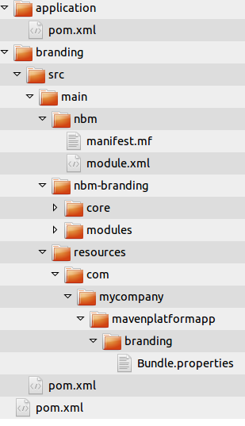
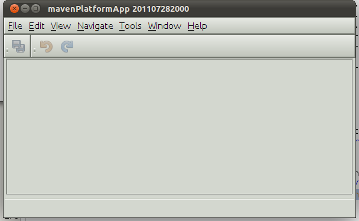
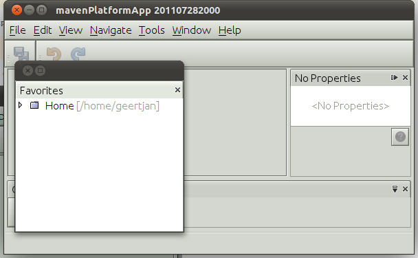
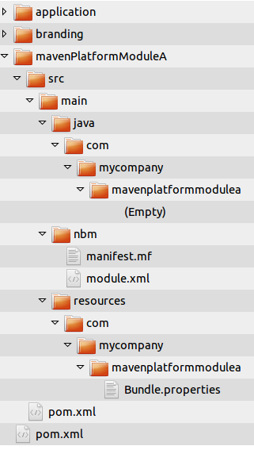

// 
//     Licensed to the Apache Software Foundation (ASF) under one
//     or more contributor license agreements.  See the NOTICE file
//     distributed with this work for additional information
//     regarding copyright ownership.  The ASF licenses this file
//     to you under the Apache License, Version 2.0 (the
//     "License"); you may not use this file except in compliance
//     with the License.  You may obtain a copy of the License at
// 
//       http://www.apache.org/licenses/LICENSE-2.0
// 
//     Unless required by applicable law or agreed to in writing,
//     software distributed under the License is distributed on an
//     "AS IS" BASIS, WITHOUT WARRANTIES OR CONDITIONS OF ANY
//     KIND, either express or implied.  See the License for the
//     specific language governing permissions and limitations
//     under the License.
//

= NetBeans Platform Maven Command Line Tutorial
:jbake-type: platform_tutorial
:jbake-tags: tutorials 
:jbake-status: published
:syntax: true
:source-highlighter: pygments
:toc: left
:toc-title:
:icons: font
:experimental:
:description: NetBeans Platform Maven Command Line Tutorial - Apache NetBeans
:keywords: Apache NetBeans Platform, Platform Tutorials, NetBeans Platform Maven Command Line Tutorial

Welcome to the  link:https://netbeans.apache.org/platform/[*NetBeans Platform*]!

This document demonstrates how to create a NetBeans Platform application and module from a command line prompt using the Maven build framework. To create this application you do not need to install or use the NetBeans IDE. You will need to create and edit some files, but you can use a simple text editor. However, an IDE can be very helpful when performing tasks such as editing the POM and managing dependencies.

In this tutorial you will see that after you install Maven, you can specify goals and parameters and execute Maven goals from the command line prompt to create and build projects. The IDE performs the same task, but provides an interface that simplifies the task of specifying the parameters for creating projects.

Before starting this tutorial you may want to familiarize yourself with the following documentation.

*  link:http://maven.apache.org/guides/mini/guide-configuring-maven.html[Maven - Guide to Configuring Maven]
*  link:http://maven.apache.org/guides/getting-started/maven-in-five-minutes.html[Maven in 5 Minutes]
*  link:http://www.sonatype.com/books/maven-book/reference/introduction.html[Chapter 1. Introducing Apache Maven] (from  link:http://www.sonatype.com/books/maven-book/reference/public-book.html[Maven: The Definitive Guide])

== Creating the NetBeans Platform Application

In this exercise you will execute the Maven goal  ``generate``  from the command line to generate a new NetBeans Platform application from an archetype in the codehaus.org repository. In the command you will specify the parameters that will be used when Maven generates the application.

[start=1]
1. Install  link:http://maven.apache.org/[Maven].

[start=2]
1. Open a command line terminal.

[start=3]
1. Test your Maven installation by typing the following command.

[source,java]
----

mvn -version
----

After you type the command you will see details about the Maven installation, including the version of Maven and the JDK, such as the following:

[source,java]
----

Apache Maven 3.0.3 (rdebian-4)
Java version: 1.6.0_25
Java home: /home/geertjan/jdk1.6.0_25/jre
Default locale: en_US, platform encoding: UTF-8
OS name: "linux" version: "2.6.38-13-generic" arch: "i386" Family: "unix"
----

[start=4]
1. Navigate to the directory where you want to create the NetBeans Platform application.

[start=5]
1. Type the following command, on a single line, in a terminal window (also known as the command prompt):

[source,java]
----

mvn 
  -DarchetypeGroupId=org.codehaus.mojo.archetypes 
  -DarchetypeArtifactId=netbeans-platform-app-archetype 
  -DarchetypeVersion=1.10 
  archetype:generate
----

Here it is on a single line:

[source,java]
----

mvn -DarchetypeGroupId=org.codehaus.mojo.archetypes -DarchetypeArtifactId=netbeans-platform-app-archetype -DarchetypeVersion=1.10 archetype:generate
----

[start=6]
1. When prompted, enter the following values:

* groupId:  ``com.mycompany`` 
* artifactId:  ``mavenPlatformApp`` 
* version: <press Enter to accept the default>
* package: <press Enter to accept the default>
* netbeansVersion:  ``RELEASE71-BETA`` 

You can see that the command specifies the archetype that Maven will use to create the NetBeans Platform application ( link:http://search.maven.org/#search|ga|1|netbeans-platform-app-archetype[ ``netbeans-platform-app-archetype`` ]). The command also specifies the location of the repository for the archetype ( ``http://repository.codehaus.org/`` ) and the version ( ``1.10`` ) and GroupId ( ``org.codehaus.mojo.archetypes`` ) of the archetype.

When you run the command, Maven will automatically retrieve the archetype and create the project according to the details specified in the command (artifact id, version, package).

*Note.* When you use NetBeans IDE to create a Mavenized NetBeans Platform application, the IDE executes a Maven goal with the same parameters.

For more information about the plugin that is used to generate the artifacts, see the documentation on the  link:http://bits.netbeans.org/mavenutilities/nbm-maven-plugin/[nbm-maven-plugin].

When you run the command, you will see output similar to the following in the terminal window.

[source,java]
----

[INFO] Parameter: groupId, Value: com.mycompany
[INFO] Parameter: artifactId, Value: mavenPlatformApp
[INFO] Parameter: version, Value: 1.0-SNAPSHOT
[INFO] Parameter: package, Value: com.mycompany
[INFO] Parameter: packageInPathFormat, Value: com/mycompany
[INFO] Parameter: netbeansVersion, Value: RELEASE71-BETA
[INFO] Parameter: package, Value: com.mycompany
[INFO] Parameter: version, Value: 1.0-SNAPSHOT
[INFO] Parameter: groupId, Value: com.mycompany
[INFO] Parameter: artifactId, Value: mavenPlatformApp
[INFO] project created from Archetype in dir: /home/geertjan/NetBeansProjects/api-samples/versions/7.1/tutorials/mavenPlatformApp
[INFO] ------------------------------------------------------------------------
[INFO] BUILD SUCCESSFUL
[INFO] ------------------------------------------------------------------------
[INFO] Total time: 2 minutes 
[INFO] Finished at: Thu Dec 22 22:16:07 CET 2011
[INFO] Final Memory: 14M/147M
----

If you look in the root directory  ``mavenPlatformApp``  that was created, you can see that the new project contains a  ``pom.xml``  file and a directory for each of the default sub-modules of the archetype: application and branding. 

If you open  ``pom.xml``  for mavenPlatformApp in an editor, you will see that the POM specifies all the details required for building the application:

[source,xml]
----

<?xml version="1.0" encoding="UTF-8"?>
<project xmlns="http://maven.apache.org/POM/4.0.0" xmlns:xsi="http://www.w3.org/2001/XMLSchema-instance"
         xsi:schemaLocation="http://maven.apache.org/POM/4.0.0 http://maven.apache.org/xsd/maven-4.0.0.xsd">
    <modelVersion>4.0.0</modelVersion>

    <groupId>com.mycompany</groupId>
    <artifactId>mavenPlatformApp-parent</artifactId>
    <version>1.0-SNAPSHOT</version>
    <packaging>pom</packaging>

    <name>mavenPlatformApp-parent</name>

    <repositories>
        <!--
        Repository hosting NetBeans modules, especially APIs.
        Versions are based on IDE releases, e.g.: RELEASE691
        To create your own repository, use: nbm:populate-repository
        -->
        <repository>
            <id>netbeans</id>
            <name>NetBeans</name>
            <url>http://bits.netbeans.org/maven2/</url>
        </repository>
    </repositories>

    <dependencyManagement>
        <dependencies>
            <dependency>
                <groupId>junit</groupId>
                <artifactId>junit</artifactId>
                <version>4.8.2</version>
                <scope>test</scope>
            </dependency>
        </dependencies>
    </dependencyManagement>

    <build>
        <pluginManagement>
            <plugins>
                <plugin>
                    <groupId>org.codehaus.mojo</groupId>
                    <artifactId>nbm-maven-plugin</artifactId>
                    <version>3.6</version>
                    <extensions>true</extensions>
                    <configuration>
                        <brandingToken>${brandingToken}</brandingToken>
                        <cluster>${brandingToken}</cluster>
                    </configuration>
                </plugin>
                <plugin>
                    <!-- NetBeans 6.9+ requires JDK 6 -->
                    <groupId>org.apache.maven.plugins</groupId>
                    <artifactId>maven-compiler-plugin</artifactId>
                    <version>2.3.2</version>
                    <configuration>
                        <source>1.6</source>
                        <target>1.6</target>
                    </configuration>
                </plugin>
            <plugin>
                <groupId>org.apache.maven.plugins</groupId>
                <artifactId>maven-jar-plugin</artifactId>
                <version>2.3.1</version>
            </plugin>
            </plugins>
        </pluginManagement>
    </build>

    <modules>
        <module>branding</module>
        <module>application</module>
    </modules>

    <properties>
        <netbeans.version>RELEASE71-BETA</netbeans.version>
        <brandingToken>mavenplatformapp</brandingToken>
    </properties>
</project>
----

If you look at the  ``<properties>``  element, you can see that the version of the NetBeans platform is specified as  ``RELEASE71-BETA`` . In the POM of your sub-modules, you can specify  ``${netbeans.version}``  as the version and the module will use the version specified in the parent POM project. The enables you to easily update the NetBeans Platform version for all the project's sub-modules.

== Installing and Running the NetBeans Platform Application

In this exercise you will run the Maven  ``install``  goal from the command line to build the application and copy the artifacts in your local repository. The NetBeans Platform application is a multi-module application. You will use the reactor mechanism in Maven to build the application project and the project's dependencies. After you build the application you will execute the  ``run-platform``  goal to launch the application.

[start=1]
1. Navigate to the  ``mavenPlatformApp``  directory and type the following command to build the project.

[source,java]
----

mvn install
----

The above command will take some time to complete. When the command completes, you will see the following:

[source,java]
----

[INFO] ------------------------------------------------------------------------
[INFO] Reactor Summary:
[INFO] ------------------------------------------------------------------------
[INFO] mavenPlatformApp-parent ............................... SUCCESS [59.580s]
[INFO] mavenPlatformApp-branding ............................. SUCCESS [15.814s]
[INFO] mavenPlatformApp-app .................................. SUCCESS [1:51.371s]
[INFO] ------------------------------------------------------------------------
[INFO] ------------------------------------------------------------------------
[INFO] BUILD SUCCESSFUL
[INFO] ------------------------------------------------------------------------
[INFO] Total time: 3 minutes 9 seconds
[INFO] Finished at: Mon Dec 19 19:32:34 CET 2011
[INFO] Final Memory: 28M/296M
----

[start=2]
1. After the command above completes, navigate to the  ``application``  directory and type the following command to launch the application.

[source,java]
----

mvn nbm:run-platform
----

When you run the  ``nbm-maven-plugin``  with the  ``run-platform``  goal, Maven will launch your NetBeans Platform application:

Browse through the menus to see what your new application consists of. Open some windows, undock some of them, and you will have something that looks like this:

You have now successfully created and launched your NetBeans Platform application. The default branding elements are located in the  ``branding``  sub-module that was generated according to the archetype. The NetBeans IDE provides tools and wizards that can help you to modify the branding elements.

In the next section you will create a new module for the application.

== Creating a NetBeans Module from an Archetype

You will now create a new module that is named mavenPlatformModuleA in the  ``mavenPlatformApp``  directory. In the same way that you created the NetBeans Platform application, you will run a Maven command from the command line and use the module archetype  ``nbm-archetype`` .

After you create the module, you will use a text editor to create a simple class in the module. You will then build the module to install the module in the local repository.

[start=1]
1. Navigate to the  ``mavenPlatformApp``  directory in the command line terminal and run the following command:

[source,java]
----

mvn 
  -DarchetypeGroupId=org.codehaus.mojo.archetypes 
  -DarchetypeArtifactId=nbm-archetype 
  -DarchetypeVersion=1.9 
  archetype:generate
----

Here it is on a single line:

[source,java]
----

mvn -DarchetypeGroupId=org.codehaus.mojo.archetypes -DarchetypeArtifactId=nbm-archetype -DarchetypeVersion=1.9 archetype:generate
----

[start=2]
1. When prompted, enter the following values:

* groupId:  ``com.mycompany`` 
* artifactId:  ``mavenPlatformModuleA`` 
* version: <press Enter to accept the default>
* package:  ``com.mycompany.mavenplatformmodulea`` 
* netbeansVersion:  ``RELEASE71-BETA`` 

You can see that the command specifies  ``nbm-archetype`` . The archetype will be retrieved from the remote repository.

When you run the command, you will see output similar to the following in the terminal window:

[source,java]
----

[INFO] Parameter: groupId, Value: com.mycompany
[INFO] Parameter: artifactId, Value: mavenPlatformModuleA
[INFO] Parameter: version, Value: 1.0-SNAPSHOT
[INFO] Parameter: package, Value: com.mycompany.mavenplatformmodulea
[INFO] Parameter: packageInPathFormat, Value: com/mycompany/mavenplatformmodulea
[INFO] Parameter: netbeansVersion, Value: RELEASE71-BETA
[INFO] Parameter: package, Value: com.mycompany.mavenplatformmodulea
[INFO] Parameter: version, Value: 1.0-SNAPSHOT
[INFO] Parameter: groupId, Value: com.mycompany
[INFO] Parameter: artifactId, Value: mavenPlatformModuleA
[INFO] project created from Archetype in dir: /home/geertjan/NetBeansProjects/api-samples/versions/7.1/tutorials/mavenPlatformApp/mavenPlatformModuleA
[INFO] ------------------------------------------------------------------------
[INFO] BUILD SUCCESSFUL
[INFO] ------------------------------------------------------------------------
[INFO] Total time: 1 minute 30 seconds
[INFO] Finished at: Thu Dec 22 22:32:17 CET 2011
[INFO] Final Memory: 21M/257M
----

If you look at the contents of the  ``mavenPlatformApp``  directory, you will see that the directory contains a new directory that is named  ``mavenPlatformModuleA`` . The new directory contains a  ``src``  directory and  ``pom.xml`` . The file  ``bundle.properties``  is generated in the  ``resources/com/mycompany/mavenplatformmodulea``  directory.

In the next step you will create a class in the  ``java/com/mycompany/mavenplatformmodulea``  directory.

[start=3]
1. Use a text editor to create the following class  ``HelloWorldActionListener.java``  in the  ``java/com/mycompany/mavenplatformmodulea``  directory.

[source,java]
----

package com.mycompany.mavenplatformmodulea;

import java.awt.event.ActionEvent;
import java.awt.event.ActionListener;
import org.openide.DialogDisplayer;
import org.openide.NotifyDescriptor;
import org.openide.awt.ActionID;
import org.openide.awt.ActionReference;
import org.openide.awt.ActionReferences;
import org.openide.awt.ActionRegistration;
import org.openide.util.NbBundle.Messages;

@ActionID(category = "Window",
id = "com.mycompany.mavenproject2.HelloWorldActionListener")
@ActionRegistration(displayName = "#CTL_HelloWorldActionListener")
@ActionReference(path = "Menu/Window", position = 0)
@Messages("CTL_HelloWorldActionListener=Hello World")
public final class HelloWorldActionListener implements ActionListener {

    public void actionPerformed(ActionEvent e) {
        NotifyDescriptor d = new NotifyDescriptor.Message("hello...");
        DialogDisplayer.getDefault().notify(d);
    }

}
----

[start=4]
1. Edit the module's  ``pom.xml``  to make the following changes (in bold) to add a dependency on the modules you are referring to in the code above.

[source,xml]
----

<dependencies>
    <dependency>
        <groupId>org.netbeans.api</groupId>
        <artifactId>org-netbeans-api-annotations-common</artifactId>
        <version>RELEASE71-BETA</version>
    </dependency>
    *<dependency>
        <groupId>org.netbeans.api</groupId>
        <artifactId>org-openide-util</artifactId>
        <version>RELEASE71-BETA</version>
    </dependency>
    <dependency>
        <groupId>org.netbeans.api</groupId>
        <artifactId>org-openide-awt</artifactId>
        <version>RELEASE71-BETA</version>
    </dependency>
    <dependency>
        <groupId>org.netbeans.api</groupId>
        <artifactId>org-openide-dialogs</artifactId>
        <version>RELEASE71-BETA</version>
    </dependency>*
</dependencies>
----

[start=5]
1. on the command line, navigate to the  ``mavenPlatformModuleA``  directory and run the following command to build and install the module in the local repository.

[source,java]
----

mvn install
----

When you run the  ``install``  command, Maven builds the module and copies the JAR and NBM artifacts to the local repository.

Now that the artifact is in the local repository, you can add the artifact as a dependency of the NetBeans Platform application, as shown in the next section.

== Adding the New NetBeans Module as a Dependency

In this section you will add the module as a dependency of the NetBeans Platform application by declaring the dependency in the POM of the application project.

[start=1]
1. Open the  ``pom.xml``  file in the  ``application``  directory in a text editor.

[start=2]
1. Declare the mavenPlatformModuleA module as a dependency of the application by making the following changes (in bold) to the POM.

[source,xml]
----

 <dependencies>
    <dependency>
        <groupId>org.netbeans.cluster</groupId>
        <artifactId>platform</artifactId>
        <version>${netbeans.version}</version>
        <type>pom</type>
    </dependency>
    <dependency>
        <groupId>com.mycompany</groupId>
        <artifactId>branding</artifactId>
        <version>1.0-SNAPSHOT</version>
    </dependency>
    *<dependency>
        <groupId>com.mycompany</groupId>
        <artifactId>mavenPlatformModuleA</artifactId>
        <version>1.0-SNAPSHOT</version>
    </dependency>*
</dependencies>
----

== Building the NetBeans Platform Application With the New NetBeans Module

You are now almost ready to launch the NetBeans Platform application with the new module installed. You first need to make sure that the new module is specified as a module of the parent POM project. You can then repeat the steps to build and launch the application.

[start=1]
1. Open the  ``pom.xml``  in the  ``mavenPlatformApp``  directory in a text editor.

[start=2]
1. Confirm that the new module is specified in the list of modules that are included with the application.

[source,xml]
----

<modules>
    <module>branding</module>
    <module>application</module>
    *<module>mavenPlatformModuleA</module>*
</modules>
----

[start=3]
1. Navigate to the  ``mavenPlatformApp``  directory in the command line terminal and type the following command to build the project.

[source,java]
----

mvn install
----

When you run the command, you can see that the new module is included in the list of modules.

[source,java]
----

[INFO] ------------------------------------------------------------------------
[INFO] Reactor Summary:
[INFO] ------------------------------------------------------------------------
[INFO] mavenPlatformApp-parent ............................... SUCCESS [0.961s]
[INFO] mavenPlatformApp-branding ............................. SUCCESS [1.443s]
[INFO] mavenPlatformModuleA .................................. SUCCESS [0.464s]
[INFO] mavenPlatformApp-app .................................. SUCCESS [3.744s]
[INFO] ------------------------------------------------------------------------
[INFO] ------------------------------------------------------------------------
[INFO] BUILD SUCCESSFUL
[INFO] ------------------------------------------------------------------------
[INFO] Total time: 7 seconds
[INFO] Finished at: Thu Dec 22 22:37:51 CET 2011
[INFO] Final Memory: 28M/310M
----

[start=4]
1. Navigate to the  ``application``  directory and type the following command to launch the application.

[source,java]
----

mvn nbm:run-platform
----

When you run the command, Maven will launch the application with the new module.

You have now successfully added a new module to the application and launched the application. To confirm that the module was loaded when the application launched, choose Window > Hello World from the main menu of the application to display the greeting:

This tutorial demonstrated how creating a NetBeans Platform application using Maven is not very different from creating an application using Ant. The major difference is understanding how the Maven POM controls how the application is assembled. For more examples on how to build NetBeans Platform applications and modules, see the tutorials listed in the  link:https://netbeans.apache.org/kb/docs/platform.html[NetBeans Platform Learning Trail].

link:http://netbeans.apache.org/community/mailing-lists.html[ Send Us Your Feedback]

 

== See Also

This document described how to use the Maven build framework to create a new NetBeans Platform application without using NetBeans IDE. For more information about creating and developing applications, see the following resources.

*  link:https://netbeans.apache.org/tutorials/nbm-maven-quickstart.html[NetBeans Platform Quick Start Using Maven]
*  link:https://netbeans.apache.org/kb/docs/platform.html[NetBeans Platform Learning Trail]
*  link:http://bits.netbeans.org/dev/javadoc/[NetBeans API Javadoc]

If you have any questions about the NetBeans Platform, feel free to write to the mailing list, dev@platform.netbeans.org, or view the  link:https://mail-archives.apache.org/mod_mbox/netbeans-dev/[NetBeans Platform mailing list archive].

