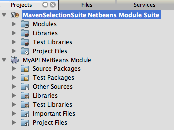
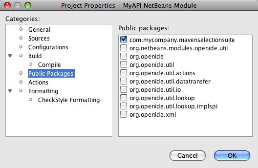
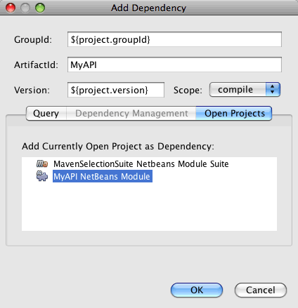
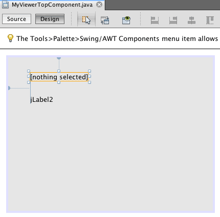
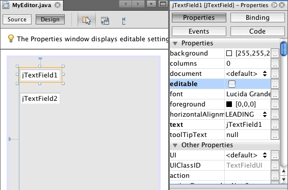
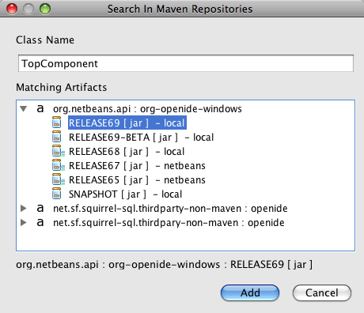
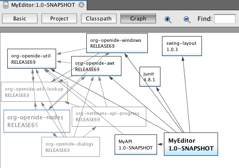
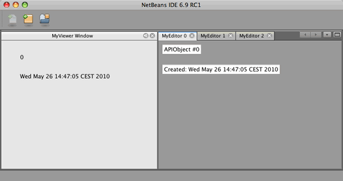
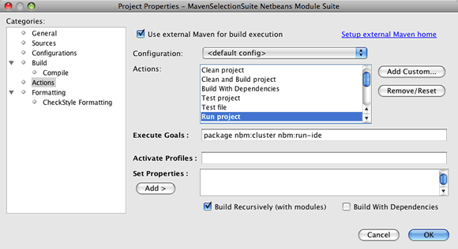

// 
//     Licensed to the Apache Software Foundation (ASF) under one
//     or more contributor license agreements.  See the NOTICE file
//     distributed with this work for additional information
//     regarding copyright ownership.  The ASF licenses this file
//     to you under the Apache License, Version 2.0 (the
//     "License"); you may not use this file except in compliance
//     with the License.  You may obtain a copy of the License at
// 
//       http://www.apache.org/licenses/LICENSE-2.0
// 
//     Unless required by applicable law or agreed to in writing,
//     software distributed under the License is distributed on an
//     "AS IS" BASIS, WITHOUT WARRANTIES OR CONDITIONS OF ANY
//     KIND, either express or implied.  See the License for the
//     specific language governing permissions and limitations
//     under the License.
//

= 使用 Maven 创建 NetBeans 模块套件
:jbake-type: platform_tutorial
:jbake-tags: tutorials 
:jbake-status: published
:syntax: true
:source-highlighter: pygments
:toc: left
:toc-title:
:icons: font
:experimental:
:description: 使用 Maven 创建 NetBeans 模块套件 - Apache NetBeans
:keywords: Apache NetBeans Platform, Platform Tutorials, 使用 Maven 创建 NetBeans 模块套件

本文档演示了如何通过 Maven 原型创建 NetBeans 平台模块套件，并在 IDE 安装中生成和安装此套件。在本教程中，您将创建一个 Maven 模块套件项目，其中包含三个 NetBeans 模块作为子项目。包含子项目的 Maven 项目是一个简单的 POM 项目，该项目声明了套件的编译方式和安装目标。

本文档根据基于 Ant 的  link:https://netbeans.apache.org/tutorials/nbm-selection-1.html[NetBeans 选择管理教程]而编写，阐述了使用 Ant 和 Maven 开发 NetBeans 平台模块套件的一些不同之处。在了解其中的一些不同之处后，您便可以轻松地继续学习  link:https://netbeans.apache.org/kb/docs/platform_zh_CN.html[NetBeans 平台学习资源]上的其他教程。

如果您不熟悉 NetBeans 平台，则可能需要观看截屏视频系列 link:https://netbeans.apache.org/tutorials/nbm-10-top-apis.html[最主要的 10 个 NetBeans API]。

*注意：*为开发适用于 NetBeans 平台的应用程序，您无需下载该平台的独立版本。通常，您是在 NetBeans IDE 中开发应用程序和模块，并且只包含运行 NetBeans 平台和您的应用程序所需的模块。

在开始本教程之前，您可以先阅读下面这些文档。

*  link:https://netbeans.apache.org/wiki/[NetBeans 开发者常见问题解答]
*  link:http://wiki.netbeans.org/MavenBestPractices[Best Practices for Apache Maven in NetBeans 6.x]（NetBeans 6.x 中 Apache Maven 的最佳做法）
*  link:http://www.sonatype.com/books/maven-book/reference/introduction.html[Chapter 1. Introducing Apache Maven]（第 1 章. Apache Maven 简介，来自  link:http://www.sonatype.com/books/maven-book/reference/public-book.html[Maven: The Definitive Guide]（Maven：权威指南））
*  link:https://netbeans.apache.org/kb/docs/java/gui-functionality_zh_CN.html[生成 GUI 应用程序简介]

== 在 IDE 中使用 Maven

如果这是您第一次创建 Maven 项目，则您会希望了解 Maven 配置设置和 Maven 资源库浏览器。

=== 配置 Maven 选项

您可以使用“选项”窗口中的 "Maven" 标签来在 IDE 中配置 Maven 的行为，并检查您的配置是否正确。

[start=1]
1. 在“选项”窗口中选择“其他”类别，然后单击 "Maven" 标签。

[start=2]
1. 指定 Maven 在本地的安装位置（要求为 2.0.9 或更高版本）。

[start=3]
1. 确认本地 Maven 资源库的位置正确无误。

[start=4]
1. 单击“确定”。

在大多数情况下，如果您执行了典型的 Maven 配置，则“选项”窗口中的信息应该已经是正确的。

*注意：*Maven 支持是作为 Java SE 功能集的一部分被激活的。如果“选项”窗口中的 "Maven" 标签不可用，请通过创建一个 Java 应用程序来确认 Java SE 已被激活。

=== 查看 Maven 资源库

Maven 用于生成所有项目的工件均存储在本地 Maven 资源库中。如果某一工件被声明为项目依赖关系且尚未安装，则会将其从已注册的某个远程资源库下载到您的本地资源库中。

缺省情况下，已注册 NetBeans 资源库和一些常见的索引 Maven 资源库，并将它们列在资源库浏览器窗口中。NetBeans 资源库包含生成项目所需的大多数公共工件。您可以使用“Maven 资源库”浏览器查看本地和远程资源库的内容。您可以展开“本地库”节点以查看本地存在的工件。NetBeans 资源库节点下列出的工件可以添加为项目依赖关系，但并非所有这些工件都在本地存在。仅当这些工件被声明为项目依赖关系时，才会将其添加到“本地库”。

打开“Maven 资源库”浏览器：

* 从主菜单中选择“窗口”>“其他”>“Maven 资源库浏览器”。

image::images/maven-quickstart68_maven-nbm-netbeans-repo.png[title="“Maven 资源库”浏览器的屏幕快照"]

== 创建 NetBeans 平台模块套件

在此部分，您将使用“新建项目”向导来通过 Maven 原型创建 NetBeans 平台模块套件。此向导将创建一个包含模块项目的 POM 项目。在此向导中，您还将创建一个模块作为套件的子项目。

[start=1]
1. 打开“新建项目”向导，然后在 "Maven" 类别中选择“Maven NetBeans 模块套件”。单击“下一步”。

[start=2]
1. 在“项目名称”中键入 *MavenSelectionSuite*。单击“下一步”。

[start=3]
1. 选择“创建模块项目”，然后键入 *MyAPI* 作为模块名称。单击“完成”。

单击“完成”后，IDE 会创建 MavenSelectionSuite 项目以及子项目 "MyAPI NetBeans Module"。

MavenSelectionSuite 是一个 POM 项目，它是一个用来包含子项目（在本例中为 NetBeans 模块项目）的容器。POM 项目不包含任何源文件。此项目的 POM 包含用于编译套件的说明；如果您查看此项目的 POM，则可以看到对于 packaging 指定了  ``pom`` 。

[source,xml]
----

     <modelVersion>4.0.0</modelVersion>
    <groupId>com.mycompany</groupId>
    <artifactId>MavenSelectionSuite</artifactId>
    *<packaging>pom</packaging>*
    <version>1.0-SNAPSHOT</version>
    <name>MavenSelectionSuite Netbeans Module Suite</name>
    ...
        <properties>
            <netbeans.version>RELEASE69</netbeans.version>
        </properties>
    *<modules>
        <module>MyAPI</module>
    </modules>*
</project>
----

POM 还包含一个模块列表，当生成 POM 项目时，将包含这些模块。您可以看到 MyAPI 项目已被列为一个模块。

如果在“项目”窗口中展开“模块”节点，则会看到 MyAPI 项目已被列为一个模块。在“文件”窗口中，可以看到 MyAPI 项目目录位于  ``MavenSelectionSuite``  目录中。当在 POM 项目的目录中创建新项目时，IDE 会自动将该项目添加到 POM 的模块列表中，在生成和运行 POM 项目时将包含这些模块。

当通过 Maven 原型创建 NetBeans 平台模块套件时，您不需要像使用 Ant 时那样在“新建项目”向导中指定目标 NetBeans 平台安装。要设置 NetBeans 平台安装，则需要修改 POM 项目的  ``profiles.xml``  文件中的  ``<netbeans.installation>``  元素，并明确指定 NetBeans 平台安装的路径。有关详细信息，请参见本教程中的<<05b,指定 NetBeans 安装的位置>>部分。

== 修改 MyAPI 模块

在创建模块套件时，您创建了 MyAPI 模块，但现在，您需要在该模块中创建一个类，并向其他模块公开该类。

=== 在 MyAPI 模块中创建类

在本练习中，您将创建一个名为  ``APIObject``  的简单类。 ``APIObject``  的每个实例都将是唯一的，因为每创建一个  ``APIObject``  的新实例，字段  ``index``  都会递增 1。

[start=1]
1. 在“项目”窗口中展开 MyAPI 项目。

[start=2]
1. 右键单击“源包”节点，然后选择“新建”>“Java 类”。

[start=3]
1. 在“类名”中键入 *APIObject*，然后从“包”下拉列表中选择  ``com.mycompany.mavenselectionsuite`` 。单击“完成”。

[start=4]
1. 修改该类以声明一些字段，并添加以下简单方法。

[source,java]
----

public final class APIObject {

   private final Date date = new Date();
   private static int count = 0;
   private final int index;

   public APIObject() {
      index = count++;
   }

   public Date getDate() {
      return date;
   }

   public int getIndex() {
      return index;
   }

   public String toString() {
       return index + " - " + date;
   }

}
----

[start=5]
1. 修复导入并保存更改。

=== 指定公共包

在本教程中，您将创建其他模块，这些模块需要访问  ``APIObject``  中的方法。在本练习中，您将公开 MyAPI 模块的内容，以便其他模块可以访问其中的方法。要将  ``com.mycompany.mavenselectionsuite``  包声明为公共包，则需要在 POM 中修改  ``nbm-maven-plugin``  的  ``configuration``  元素，以指定将作为公共包导出的包。您可以在编辑器中更改 POM，也可以通过在项目的属性窗口中选择要公开的包进行更改。

[start=1]
1. 右键单击项目节点，然后选择“属性”以打开属性窗口。

[start=2]
1. 在“公共包”类别中选择 "com.mycompany.mavenselectionsuite" 包。单击“确定”。

在选择要导出的包之后，IDE 会修改 POM 中的  ``nbm-maven-plugin``  元素以指定该包。

[source,xml]
----

<plugin>
    <groupId>org.codehaus.mojo</groupId>
    <artifactId>nbm-maven-plugin</artifactId>
    <extensions>true</extensions>
    <configuration>
        <publicPackages>
            *<publicPackage>com.mycompany.mavenselectionsuite</publicPackage>*
        </publicPackages>
    </configuration>
</plugin>
----

[start=3]
1. 右键单击项目，然后选择“生成”。

在生成项目时， ``nbm-maven-plugin``  将在 JAR 的  ``MANIFEST.MF``  中生成一个清单头，用于指定公共包。

有关详细信息，请参见  link:http://bits.netbeans.org/mavenutilities/nbm-maven-plugin/manifest-mojo.html#publicPackages[nbm-maven-plugin 清单文档]。

== 创建 MyViewer 模块

在此部分，您将创建一个名为 MyViewer 的新模块，然后添加一个窗口组件和两个文本字段。该组件将实现  `` link:http://bits.netbeans.org/dev/javadoc/org-openide-util-lookup/org/openide/util/LookupListener.html[LookupListener]``  以侦听对  link:https://netbeans.apache.org/wiki/devfaqlookup[Lookup] 的更改。

=== 创建模块

在本练习中，您将在  ``MavenSelectionSuite``  目录中创建 MyViewer NetBeans 模块。

[start=1]
1. 从主菜单中选择“文件”>“新建项目”(Ctrl-Shift-N)。

[start=2]
1. 从 "Maven" 类别中选择“Maven NetBeans 模块”。单击“下一步”。

[start=3]
1. 在“项目名称”中键入 *MyViewer*。

[start=4]
1. 确认“项目位置”为  ``MavenSelectionSuite``  目录。单击“完成”。

[start=5]
1. 右键单击“项目”窗口中的“库”节点，然后选择“添加依赖关系”。

[start=6]
1. 在“打开的项目”标签中选择 "MyAPI NetBeans Module"。单击“确定”。

单击“确定”后，IDE 会将工件添加到 POM 的依赖关系列表中，并在“库”节点下显示该工件。

如果查看 MyViewer 模块的 POM，则会看到该模块的父项目是 MavenSelectionSuite，对于  ``packaging``  指定了  ``nbm`` ，并且将使用 *nbm-maven-plugin* 将该项目生成为 NetBeans 模块。

[source,xml]
----

<modelVersion>4.0.0</modelVersion>
*<parent>
    <groupId>com.mycompany</groupId>
    <artifactId>MavenSelectionSuite</artifactId>
    <version>1.0-SNAPSHOT</version>
</parent>*
<groupId>com.mycompany</groupId>
<artifactId>MyViewer</artifactId>
*<packaging>nbm</packaging>*
<version>1.0-SNAPSHOT</version>
<name>MyViewer NetBeans Module</name>

----

=== 创建窗口组件

在本练习中，您将创建一个窗口组件，并添加两个文本字段。

[start=1]
1. 右键单击 MyViewer 项目，然后选择“新建”>“窗口”。

[start=2]
1. 从下拉列表中选择 "navigator"，然后选择“在应用程序启动时打开”。单击“下一步”。

[start=3]
1. 在“类名前缀”中键入 *MyViewer*。单击“完成”。

[start=4]
1. 将两个标签从“组件面板”拖至该组件中，然后将顶部标签的文本更改为  ``"[nothing selected]"`` 。

[start=5]
1. 单击“源”标签，然后修改类签名以实现  ``LookupListener`` 。

[source,java]
----

public class MyViewerTopComponent extends TopComponent *implements LookupListener* {
----

[start=6]
1. 通过将插入光标置于代码行中并按 Alt-Enter 组合键来实现抽象方法。

[start=7]
1. 添加以下  ``private``  字段  ``result``  并将初始值设置为 null。

[source,java]
----

private Lookup.Result result = null;
----

[start=8]
1. 对  ``componentOpened()`` 、 ``componentClosed()``  和  ``resultChanged()``  方法进行以下更改。

[source,java]
----

public void componentOpened() {
    *result = Utilities.actionsGlobalContext().lookupResult(APIObject.class);
    result.addLookupListener(this);*
}

public void componentClosed() {
    *result.removeLookupListener (this);
    result = null;*
}

public void resultChanged(LookupEvent le) {
    *Lookup.Result r = (Lookup.Result) le.getSource();
    Collection c = r.allInstances();
    if (!c.isEmpty()) {
        APIObject o = (APIObject) c.iterator().next();
        jLabel1.setText (Integer.toString(o.getIndex()));
        jLabel2.setText (o.getDate().toString());
    } else {
        jLabel1.setText("[no selection]");
        jLabel2.setText ("");
    }*
}
----

通过使用  `` link:http://bits.netbeans.org/dev/javadoc/org-openide-util/org/openide/util/Utilities.html#actionsGlobalContext%28%29[Utilities.actionsGlobalContext()]`` ，每当打开一个组件时，该类都可以全局侦听具有焦点的组件的 Lookup 对象。当关闭组件时，Lookup 即会被删除。 ``resultChanged()``  方法实现了  ``LookupListener`` ，以便根据具有焦点的  ``APIObject``  来更新窗体中的 JLabel。

[start=9]
1. 修复导入，并确保添加了 * ``org.openide.util.Utilities`` *。保存所做的更改。

== 创建 MyEditor 模块

在此部分，您将创建一个名为 MyEditor 的新模块。该模块将包含一个  `` link:http://bits.netbeans.org/dev/javadoc/org-openide-windows/org/openide/windows/TopComponent.html[TopComponent]`` ，该组件将通过 Lookup 提供  ``APIObject``  的实例。您还将创建一个操作，用于打开 MyEditor 组件的新实例。

=== 创建模块

在本练习中，您将在  ``MavenSelectionSuite``  目录中创建一个 NetBeans 模块，并添加对 MyAPI 模块的依赖关系。

[start=1]
1. 从主菜单选择“文件”>“新建项目”。

[start=2]
1. 从 "Maven" 类别中选择“Maven NetBeans 模块”。单击“下一步”。

[start=3]
1. 在“项目名称”中键入 *MyEditor*。

[start=4]
1. 确认“项目位置”为  ``MavenSelectionSuite``  目录。单击“完成”。

[start=5]
1. 在“项目”窗口中右键单击该项目的“库”节点，然后选择“添加依赖关系”。

[start=6]
1. 在“打开的项目”标签中选择 "MyAPI NetBeans Module"。单击“确定”。

=== 添加操作

在本练习中，您将创建一个类，该类用于在“文件”菜单中添加一个菜单项，以便打开名为 "MyEditor" 的组件。在下一个练习中，您将创建该组件。

[start=1]
1. 右键单击 MyEditor 项目，然后选择“新建”>“操作”以打开“新建操作”对话框。

[start=2]
1. 选择“始终启用”。单击“下一步”。

[start=3]
1. 保留“GUI 注册”页中的缺省设置。单击“下一步”。

[start=4]
1. 在“类名”中键入 *OpenEditorAction*。

[start=5]
1. 在“显示名称”中键入 *Open Editor*。单击“完成”。

IDE 在编辑器中打开  ``OpenEditorAction``  类，并在  ``layer.xml``  文件中添加以下内容。

[source,xml]
----

<filesystem>
    <folder name="Actions">
        <folder name="Build">
            <file name="com-mycompany-myeditor-OpenEditorAction.instance">
                <attr name="delegate" newvalue="com.mycompany.myeditor.OpenEditorAction"/>
                <attr name="displayName" bundlevalue="com.mycompany.myeditor.Bundle#CTL_OpenEditorAction"/>
                <attr name="instanceCreate" methodvalue="org.openide.awt.Actions.alwaysEnabled"/>
                <attr name="noIconInMenu" boolvalue="false"/>
            </file>
        </folder>
    </folder>
    <folder name="Menu">
        <folder name="File">
            <file name="com-mycompany-myeditor-OpenEditorAction.shadow">
                <attr name="originalFile" stringvalue="Actions/Build/com-mycompany-myeditor-OpenEditorAction.instance"/>
                <attr name="position" intvalue="0"/>
            </file>
        </folder>
    </folder>
</filesystem>
----

[start=6]
1. 修改  ``OpenEditorAction``  类中的  ``actionPerformed``  方法。

[source,java]
----

public void actionPerformed(ActionEvent e) {
    MyEditor editor = new MyEditor();
    editor.open();
    editor.requestActive();
}
----

=== 添加编辑器组件

在本练习中，您将创建 MyEditor 组件，当  ``OpenEditorAction``  调用该组件时，会在编辑器区域中将其打开。不能使用“窗口”组件模板，因为您需要的是组件的多个实例，而“窗口”组件用于创建单个组件。但是，您可以使用“JPanel 窗体”模板，然后对类进行修改以扩展  ``TopComponent`` 。

[start=1]
1. 右键单击“源包”，然后选择“新建”>“其他”，并从“Swing GUI 窗体”类别中选择“JPanel 窗体”。单击“下一步”。

[start=2]
1. 在“类名”中键入 *MyEditor*，然后选择 "com.mycompany.myeditor" 包。单击“完成”。

[start=3]
1. 将两个文本字段拖至该组件中。

[start=4]
1. 通过取消选择每个文本字段的  ``editable``  属性来使这些文本字段成为只读字段。

[start=5]
1. 单击“源”标签，然后修改类签名以扩展  ``TopComponent``  而不是  ``javax.swing.JPanel`` 。

[source,java]
----

public class MyEditor extends *TopComponent*
----

[start=6]
1. 将插入光标置于签名中，然后按 Alt-Enter 组合键以修复代码中的错误，方法是搜索 Maven 资源库，然后添加对  ``org.openide.windows``  工件的依赖关系。修复导入。

[start=7]
1. 修改构造函数，以便每次调用  ``APIObject``  类时都会创建该类的新实例。

[source,java]
----

public MyEditor() {
    initComponents();
    *APIObject obj = new APIObject();
    associateLookup(Lookups.singleton(obj));
    jTextField1.setText("APIObject #" + obj.getIndex());
    jTextField2.setText("Created: " + obj.getDate());
    setDisplayName("MyEditor " + obj.getIndex());*

}
----

构造函数中的  ``associateLookup(Lookups.singleton(obj));``  一行将创建一个 Lookup，其中包含  ``APIObject``  的新实例。

[start=8]
1. 修复导入并保存更改。

组件中的文本字段仅显示  ``APIObject``  中的索引值和日期。这样，您便可以看到每个 MyEditor 组件都是唯一的，并且 MyViewer 显示了具有焦点的 MyEditor 组件的详细信息。

*注意：* ``OpenEditorAction``  中的错误会在您保存对  ``MyEditor``  所做的更改之后得以解决。

== 生成和运行模块套件

此时，您几乎已经做好运行此套件的一切准备，以查看它是否可以正确生成、安装和运行。

=== 声明直接依赖关系

在生成和运行此套件之前，您需要首先修改 MyEditor 项目的一个依赖关系。如果您现在尝试生成模块套件，则“输出”窗口中的生成输出会通知您无法编译套件，因为 MyEditor 模块要求  ``org.openide.util-lookup``  工件在运行时可用。

如果右键单击项目节点，然后选择“显示依赖关系图形”，则可以借助依赖关系图形查看器以可视方式查看模块依赖关系。

您可以看到 MyEditor 对  ``org.openide.util-lookup``  不具有直接依赖关系。依赖关系是传递的，并且该工件在编译时对于项目可用，但如果要使该工件在运行时可用，则依赖关系必须是直接的。您需要修改 POM 以将该工件声明为直接依赖关系。

通过手动编辑 POM，或者使用“项目”窗口中的弹出式菜单项，可以使该工件成为直接依赖关系。

[start=1]
1. 展开 MyEditor 模块的“库”节点。

[start=2]
1. 右键单击  ``org.openide.util-lookup``  工件，然后选择“声明为直接依赖关系”。

选择“声明为直接依赖关系”后，IDE 便会修改 POM 以将该工件添加为依赖关系。

*注意：* ``org.openide.util-lookup``  工件已经是 MyViewer 模块的直接依赖关系。

=== 指定 NetBeans 安装的位置

缺省情况下，当使用 Maven 原型创建 NetBeans 平台模块套件时，不会指定任何目标 NetBeans 安装。要在 IDE 安装中安装并运行模块套件，您需要指定安装目录的路径，方法是编辑 POM 项目中的  ``profiles.xml``  文件。

[start=1]
1. 展开 MavenSelectionSuite 应用程序下的“项目文件”节点，然后双击  ``profiles.xml``  以在编辑器中打开该文件。

[start=2]
1. 修改  ``<netbeans.installation>``  元素以指定目标 NetBeans 平台的路径，然后保存更改。

[source,xml]
----

<profile>
   <id>netbeans-ide</id>
   <properties>
       <netbeans.installation>/home/me/netbeans-6.9</netbeans.installation>
   </properties>
</profile>
----

*注意：*此路径需要指定包含可运行文件的  ``bin``  目录所在的目录。

例如，在 OS X 上，您的路径可能与下面的内容类似。

[source,xml]
----

<netbeans.installation>/Applications/NetBeans/NetBeans6.9.app/Contents/Resources/NetBeans</netbeans.installation>
----

=== 运行应用程序

现在，您已经指定了 IDE 的目标安装，接下来便可以对套件项目使用“运行”命令。

[start=1]
1. 右键单击 MavenSelectionSuite，然后选择“运行”。

选择“运行”后，将会启动安装了模块套件的 IDE 实例。

MyViewer 窗口会在应用程序启动时打开，并将显示两个文本标签。现在，您可以从“文件”菜单中选择 "Open Editor"，以在编辑器区域中打开一个 MyEditor 组件。MyViewer 窗口将显示具有焦点的 MyEditor 组件的详细信息。

缺省情况下，模块套件项目的“运行”操作会被配置为使用 Reactor 插件以递归方式对指定为套件组成部分的模块执行生成和打包操作。您可以打开项目的属性窗口以查看被映射到 IDE 中的操作的 Maven 目标。

在属性窗口的“操作”类别中，可以看到被映射到“运行”操作的目标。

== 动态修改 Lookup

目前，每当您打开一个新的 MyEditor 组件时，都会创建一个新的  ``APIObject`` 。在此部分，您将在 MyEditor 组件中添加一个按钮，以便将组件当前的  ``APIObject``  替换为一个新对象。您将修改代码以使用  `` link:http://bits.netbeans.org/dev/javadoc/org-openide-util-lookup/org/openide/util/lookup/InstanceContent.html[InstanceContent]``  动态处理对 Lookup 内容所做的更改。

[start=1]
1. 展开 MyEditor 项目，然后在编辑器的“设计”视图中打开  ``MyEditor``  窗体。

[start=2]
1. 将一个按钮拖至该窗体上，然后将该按钮的文本设置为 "Replace"。

[start=3]
1. 右键单击该按钮，然后选择“事件”> "Action" > "actionPerformed" 来为该按钮创建事件处理程序方法，接着在源代码编辑器中打开该窗体。

[start=4]
1. 将下面的  ``final``  字段添加到类中。

[source,java]
----

public class MyEditor extends TopComponent {
    *private final InstanceContent content = new InstanceContent();*
----

要利用  ``InstanceContent`` ，您需要在构造函数中使用  `` link:http://bits.netbeans.org/dev/javadoc/org-openide-util-lookup/org/openide/util/lookup/AbstractLookup.html#AbstractLookup%28org.openide.util.lookup.AbstractLookup.Content%29[AbstractLookup]``  而不是  ``Lookup`` 。

[start=5]
1. 通过复制类构造函数中的代码行并添加对  ``content.set``  的调用，修改  ``jButton1ActionPerformed``  事件处理程序方法的主体，使其与以下内容类似。

[source,java]
----

private void jButton1ActionPerformed(java.awt.event.ActionEvent evt) {
    *APIObject obj = new APIObject();
    jTextField1.setText ("APIObject #" + obj.getIndex());
    jTextField2.setText ("Created: " + obj.getDate());
    setDisplayName ("MyEditor " + obj.getIndex());
    content.set(Collections.singleton (obj), null);*
}
----

[start=6]
1. 修改构造函数以删除您复制到事件处理程序中的代码行，然后将  ``associateLookup``  更改为使用  ``AbstractLookup``  并添加  ``jButton1ActionPerformed(null);`` 。现在，该构造函数应如下所示。

[source,java]
----

public MyEditor() {
    initComponents();
    *associateLookup(new AbstractLookup(content));
    jButton1ActionPerformed(null);*
}
----

您已将  ``jButton1ActionPerformed(null);``  添加到构造函数中，以确保组件在创建时被初始化。

[start=7]
1. 修复导入并保存更改。

当再次运行模块套件项目时，便会在每个 MyEditor 组件中看到新按钮。单击该按钮时，文本字段中的索引编号将会增加。MyViewer 窗口中的标签也将更新以与新值相对应。

本教程演示了如何创建和运行您通过 Maven 原型创建的 NetBeans 平台模块套件。您看到了如何构建模块套件以及如何配置模块 POM 以指定公共包。还学习了如何修改父 POM 项目以指定目标 NetBeans 安装，这样 IDE 中的“运行”命令就可以安装该套件并启动平台的新实例。有关如何生成 NetBeans 平台应用程序和模块的更多示例，请参见  link:https://netbeans.apache.org/kb/docs/platform_zh_CN.html[NetBeans 平台学习资源]中所列的教程。

== 另请参见

有关在 NetBeans 平台上进行创建和开发的更多信息，请参见以下资源。

*  link:https://netbeans.apache.org/kb/docs/platform_zh_CN.html[NetBeans 平台学习资源]
*  link:https://netbeans.apache.org/wiki/[NetBeans 开发者常见问题解答]
*  link:http://bits.netbeans.org/dev/javadoc/[NetBeans API Javadoc]

如果您有任何有关 NetBeans 平台的问题，可随时写信至邮件列表 dev@platform.netbeans.org，或查看  link:https://mail-archives.apache.org/mod_mbox/netbeans-dev/[NetBeans 平台邮件列表归档]。

