// 
//     Licensed to the Apache Software Foundation (ASF) under one
//     or more contributor license agreements.  See the NOTICE file
//     distributed with this work for additional information
//     regarding copyright ownership.  The ASF licenses this file
//     to you under the Apache License, Version 2.0 (the
//     "License"); you may not use this file except in compliance
//     with the License.  You may obtain a copy of the License at
// 
//       http://www.apache.org/licenses/LICENSE-2.0
// 
//     Unless required by applicable law or agreed to in writing,
//     software distributed under the License is distributed on an
//     "AS IS" BASIS, WITHOUT WARRANTIES OR CONDITIONS OF ANY
//     KIND, either express or implied.  See the License for the
//     specific language governing permissions and limitations
//     under the License.
//

= NetBeans Platform Quick Start Using Maven
:jbake-type: platform_tutorial
:jbake-tags: tutorials 
:jbake-status: published
:syntax: true
:source-highlighter: pygments
:toc: left
:toc-title:
:icons: font
:experimental:
:description: NetBeans Platform Quick Start Using Maven - Apache NetBeans
:keywords: Apache NetBeans Platform, Platform Tutorials, NetBeans Platform Quick Start Using Maven

Welcome to the  link:https://netbeans.apache.org/platform/[*NetBeans Platform*]!

This document is a quick demonstration of how to create a simple NetBeans Platform application on top of the Maven build framework. After using Maven archetypes to create the NetBeans Platform application build structure, you will use the Swing UI toolkit and "Matisse" GUI Builder to create a window component. The modular aspect of the NetBeans Platform enables you to expand the functionality of your application by adding new features during development or at runtime.

This document is based on the Ant-based  link:nbm-quick-start.html[NetBeans Platform Quick Start for NetBeans Platform]. and illustrates some of the differences between using Ant and Maven to develop NetBeans Platform applications. After you understand how Maven is different from Ant, you can easily proceed through other tutorials on the  link:https://netbeans.apache.org/kb/docs/platform.html[NetBeans Platform Learning Trail].

NOTE: This document uses NetBeans Platform 7.1 and NetBeans IDE 7.1. If you are using an earlier version, see  link:../70/nbm-maven-quickstart.html[the previous version of this document].

If you are new to the NetBeans Platform, you might want to watch the screencast series  link:https://netbeans.apache.org/tutorials/nbm-10-top-apis.html[Top 10 NetBeans APIs].

NOTE:  You do not need to download Maven because it is bundled with the IDE. Optionally, use your own download of Maven, in which case use the Options window to configure your Maven settings.

Before starting this tutorial you may want to familiarize yourself with the following documentation.

*  link:http://wiki.netbeans.org/MavenBestPractices[Best Practices for Apache Maven in NetBeans 6.x]
*  link:http://www.sonatype.com/books/maven-book/reference/introduction.html[Chapter 1. Introducing Apache Maven] (from  link:http://www.sonatype.com/books/maven-book/reference/public-book.html[Maven: The Definitive Guide])
*  link:https://netbeans.apache.org/kb/docs/java/gui-functionality.html[Introduction to GUI Building]

== Creating a Mavenized NetBeans Platform Application Project

In this section you use the New Project wizard to create a NetBeans Platform Application from a Maven archetype. The wizard will create the Maven module projects that you need to develop an application on the NetBeans Platform. The wizard also provides the option of creating a NetBeans module in the application project, but in this tutorial you will create each module individually.

=== Creating the Project

Perform the following steps to create the NetBeans Platform application using the New Project wizard.

[start=1]
1. Choose File > New Project (Ctrl-Shift-N) to open the New Project wizard.

[start=2]
1. 
Select NetBeans Application from the Maven category:

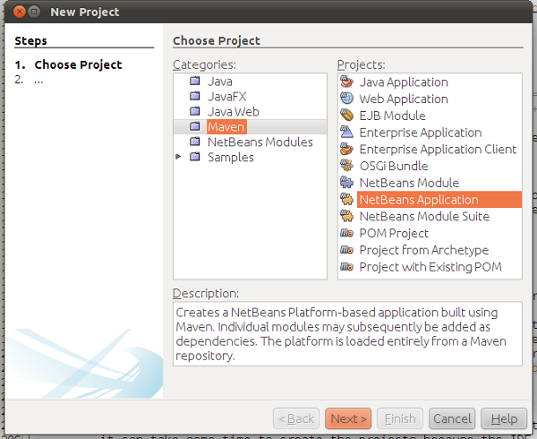

Click Next.

[start=3]
1. Type *MavenPlatformWordApp* for the Project Name and set the Project Location.

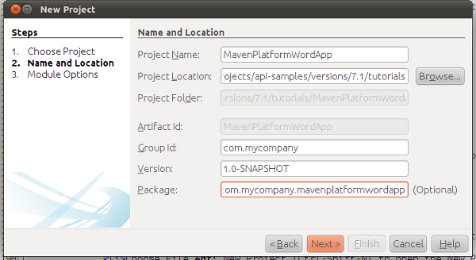

Click Next.

[start=4]
1. Select the version of the NetBeans APIs you want to use:

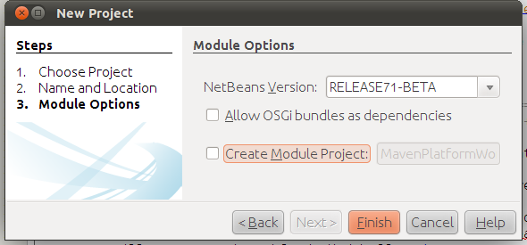

As you can see, you can create a module together with your application, which we won't do in this tutorial. In this tutorial, we will create all the modules separately.

Click Finish.

*Note.* If this is your first NetBeans Platform application using Maven, it can take some time to create the projects because the IDE needs to download any necessary artifacts from the NetBeans Maven repository.

When you click Finish, by default the IDE creates the following Maven project types:

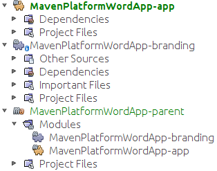

* *app.* The app project enumerates included modules; permits interactive runs; produces various kinds of packaging, such as ZIP by default, but optionally JNLP, NBMs, and in the future perhaps OSGi; holds functional tests. Each module project specifies its own compile dependencies, while the app project's dependencies are anything additional that should be present at runtime. For example, that includes, by default, the whole platform cluster, that is, the set of modules constituting the "platform" cluster. The app project could include other clusters, or subsets of clusters, or whatever plugins you want included in your app which are not used as compilation dependencies. At a minimum, core.startup and its transitive dependencies are included.
* *branding.* This project contains the global resources used for branding the application, such as the splash screen.
* *parent.* This project is a Maven reactor project for the NetBeans Platform application, which lists the modules to include and the location of the project's repositories. This project does not contain any sources. The IDE generates the modules containing the sources and resources in sub-directories of this project.

For all Maven projects, the  ``pom.xml``  file (POM) is located under the Project Files node in the Projects window. If you look at the POM for the parent project, you can see that the two other modules created by the wizard are listed as modules in the application.

[source,xml]
----

<modules>
   <module>branding</module>
   <module>application</module>
</modules>
----

=== Modifying the Branding Elements

The branding module provides the customization information, such as splash screens and icons, used throughout the NetBeans Platform application. The IDE's Branding Editor enables you to easily modify the branding properties of the application, giving you a centralized location for changing the name, splash screen, and values of various text elements.

When you create the NetBeans Platform application, the default name for the application is the artifactId of the application. In this exercise, you will use the Branding Editor to modify the name of the application and replace the default image for the splash screen.

[start=1]
1. Right-click the *branding* module and choose Branding, which is a menu item near the end of the right-click popup menu. Wait a moment while the required JARs are downloaded, before continuing.

[start=2]
1. In the Basic tab, modify the Application Title to *My Maven Platform Word App*.
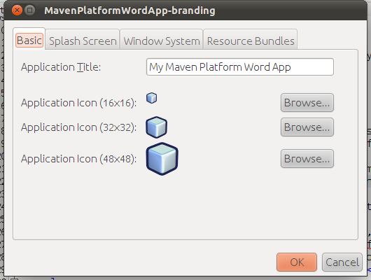

[start=3]
1. Click the Splash Screen tab and click the Browse button next to the default splash screen image to locate a different image. Click OK.

You can copy the image below to your local system and specify the image as the splash screen in the Branding dialog.

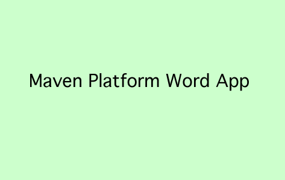

== Creating Your First Mavenized NetBeans Module

In this section you will create a new module named MavenWordEngine. You will then modify the module to add a window component and a button and text area.

=== Creating the Module

In this exercise you will create a new module project in the same directory that contains the branding module and application module.

[start=1]
1. Choose File > New Project from the main menu.

[start=2]
1. 
Select NetBeans Module from the Maven category:

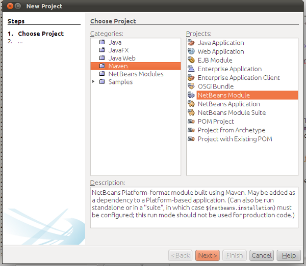

Click Next.

[start=3]
1. Type *MavenWordEngine* as the Project Name:

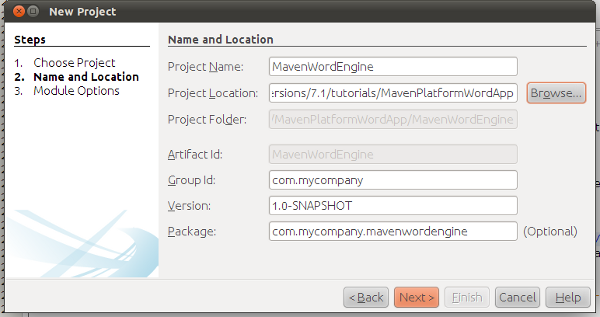

[start=4]
1. Click Browse and locate the MavenPlatformWordApp directory as the Project Location.

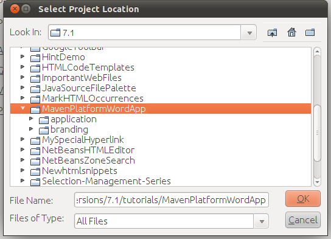

[start=5]
1. Click Next and select the NetBeans APIs you want to use:

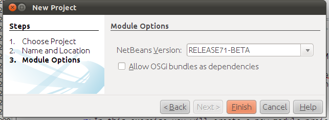

Click Finish.

If you look at the POM for the new MavenWordEngine module you see that the  ``artifactId``  of the project is *MavenWordEngine*.

[source,xml]
----

<modelVersion>4.0.0</modelVersion>
<parent>
    <groupId>com.mycompany</groupId>
    <artifactId>MavenPlatformWordApp</artifactId>
    <version>1.0-SNAPSHOT</version>
</parent>
<groupId>com.mycompany</groupId>
<artifactId>*MavenWordEngine*</artifactId>
<packaging>nbm</packaging>
<version>1.0-SNAPSHOT</version>
<name>MavenWordEngine NetBeans Module</name>
            
----

To build a NetBeans module you need to use the  ``nbm-maven-plugin`` . If you look at the POM for the module, you can see that the IDE automatically specified  ``nbm``  for the  ``packaging``  and that the *nbm-maven-plugin* is specified as a build plugin.

[source,xml]
----

<plugin>
   <groupId>org.codehaus.mojo</groupId>
   <artifactId>*nbm-maven-plugin*</artifactId>
   <version>3.6</version>
   <extensions>true</extensions>
</plugin>
            
----

If you look at the POM for the NetBeans Platform Application, you can see that *MavenWordEngine* was added to the list of the modules in the application.

[source,xml]
----

<modules>
   <module>branding</module>
   <module>application</module>
   <module>*MavenWordEngine*</module>
</modules>
            
----

=== Making the Module a Dependency of MavenPlatformWordApp

In this exercise you will declare the MavenWordEngine module as a dependency of the *app* by adding the dependency in the POM. Currently, the POM of the *app* declares the following dependencies:

[source,xml]
----

<dependencies>
    <dependency>
        <groupId>org.netbeans.cluster</groupId>
        <artifactId>platform</artifactId>
        <version>${netbeans.version}</version>
        <type>pom</type>
    </dependency>
    <dependency>
        <groupId>com.mycompany</groupId>
        <artifactId>branding</artifactId>
        <version>1.0-SNAPSHOT</version>
    </dependency>
</dependencies>
----

If you expand the Libraries node for the *app* you can see that there is a dependency on the branding module and on some other libraries that are dependencies of the cluster required to build the application.

You can expand the list of non-classpath dependencies to see the full list of dependencies.

To add the dependency to the POM, you can edit the POM directly in the editor or by opening the Add Dependency dialog box from the Projects window.

[start=1]
1. Expand the *app* in the Projects window, right-click the Dependencies node, and choose Add Dependency.

[start=2]
1. Click the Open Projects tab and select *MavenWordEngine*. Click OK.

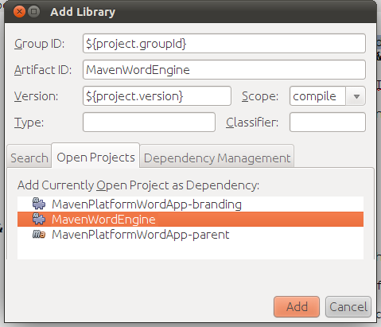

*Note.* The new project will appear in the dialog after the IDE finishes scanning and updating indexes.

If you expand the *app* and the *parent* in the Projects window, you can see that MavenWordEngine is now listed as a dependency.

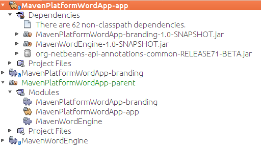

=== Adding a Window Component to the Module

In this exercise you will use a wizard to add a Window Component to the MavenWordEngine module.

[start=1]
1. Right-click *MavenWordEngine* in the Projects window and choose New > Window. Click Next.

[start=2]
1. Select *output* in the Window Position dropdown list. Click Next.
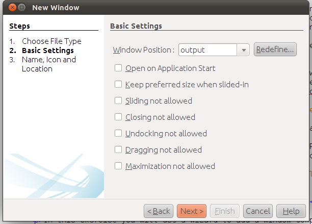

[start=3]
1. Type *Text* in the Class Name Prefix field. Click Finish.

When you click Finish, in the Projects window you can see that the IDE generated the class  ``TextTopComponent.java``  in  ``com.mycompany.mavenwordengine``  under Source Packages.

You can view the structure of the project in the Files window. To compile a Maven project, only source files can be located under Source Packages ( ``src/main/java``  directory in the Files window). Other resources (e.g., properties files) need to be located under Other Sources ( ``src/main/resources``  directory in the Files window).

=== Modifying the Window Component

In this exercise you will add a text area and a button to the window component. You will then modify the method invoked by the button to change the letters in the text area to upper case letters.

[start=1]
1. Click the Design tab of  ``TextTopComponent.java``  in the editor.

[start=2]
1. Drag and drop a button and a text area from the Palette (Ctrl-Shift-8) onto the window.

[start=3]
1. Right-click the text area and choose Change Variable Name, and then type *text* as the name. You will use the name when accessing the component from your code.

[start=4]
1. 
Set the text of the button to "*Filter!*".

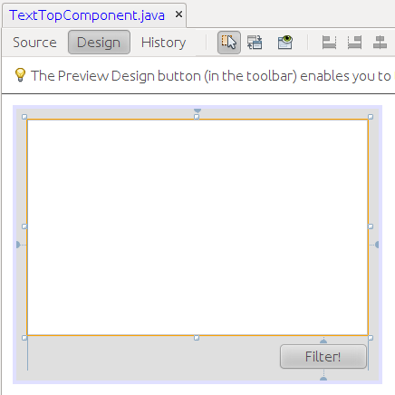

[start=5]
1. Double-click the Filter! button in the Design view to open the event handler method for the button in the source code editor. The method is created automatically when you double-click the button element and the Source view opens. Modify the body of the method to add the following code.

[source,java]
----

private void jButton1ActionPerformed(java.awt.event.ActionEvent evt) {
   *String s = text.getText();
   s = s.toUpperCase();
   text.setText(s);*
}
----

Save your changes.

=== Trying Out the Application

If you want to test that your application is working correctly, you can right-click the project node of the *application* and choose Build with Dependencies.

The default action mapped to Build with Dependencies is to build the project using the Reactor plugin. When you build a project using the Reactor plugin, the dependencies of the sub-projects are built before the containing project is built. The Output window displays the build order.

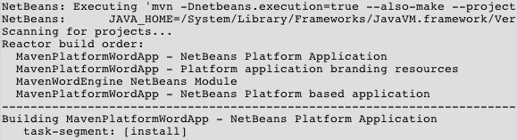

The results of the build are also displayed in the Output window.

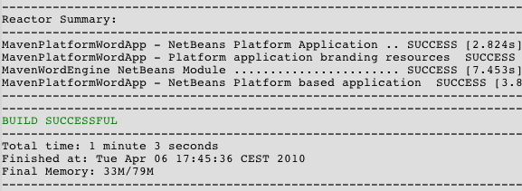

If you look at the Projects window, you will see that the projects no longer have badges because the artifacts of the required dependencies are now available in the Local repository under the  ``com.mycompany``  node.

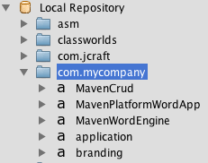

To run the project, in the Projects window, right-click the project node of the *application*, and choose Run. After the application launches, you can test the application by performing the following steps.

[start=1]
1. Choose Window > Text from the main menu of the platform application to open the Text window.

[start=2]
1. Type some lower case letters in the text area and click Filter! When you click Filter!, the letters that you typed are changed to upper case and displayed in the text area.

In the next sections, you will decouple the user interface from the business logic in your application. You will start by creating a module that provides an API. Then you will create a module that implements the API. Finally, you will change the window defined above so that implementations of the API are loaded at runtime into the application. In that way, the GUI will be able to load multiple filters without needing to care about any of the implementation details.

== Creating a Module that Defines a Service

In this exercise, you create a module named *TextFilter* and add the module as a dependency to the application. The TextFilter module will provide an API and only contain an interface. You can then access the service from your other modules by using the NetBeans Lookup mechanism.

=== Creating the Module

In this exercise you will perform the following steps to create the TextFilter module.

[start=1]
1. Choose File > New Project (Ctrl-Shift-N).

[start=2]
1. 
As explained in the previous section, select NetBeans Module from the Maven category:

Click Next.

[start=3]
1. Type *TextFilter* for the Project Name. Click Browse to set the Project Location and locate the application directory:

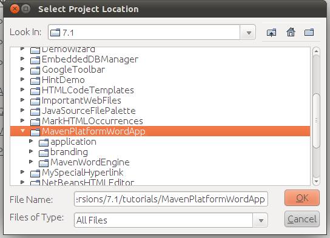

Click Next, choose the version of the NetBeans API you will use, and click Finish.

When you click Finish, the IDE creates the module and opens the module project *TextFilter* in the Projects window.

The IDE modifies  ``pom.xml``  of the *parent* project to add the new module to the list of modules to include in the project.

[source,xml]
----

<modules>
    <module>branding</module>
    <module>application</module>
    <module>MavenWordEngine</module>
    <module>TextFilter</module>
</modules>
----

After you create the module you need to add the module as a dependency of the *application*, as explained in the next exercise.

=== Adding the TextFilter Module as a Dependency of MavenPlatformWordApp

In this exercise you add the TextFilter module as a dependency of the application.

[start=1]
1. Right-click the Dependencies node of the *application* project and choose Add Dependency.

[start=2]
1. Click the Open Projects tab in the Add Dependency dialog.

[start=3]
1. Select the *TextFilter* module. Click OK.

When you click OK, the IDE adds the module as a dependency of the project. If you expand the Libraries node, you can see that the module is added to the list of dependencies. In the POM for *application*, you can see that the IDE added the following lines inside the  ``dependencies``  element:

[source,xml]
----

<dependency>
   <groupId>${project.groupId}</groupId>
   <artifactId>TextFilter</artifactId>
   <version>${project.version}</version>
</dependency>
----

=== Adding an Interface to the TextFilter Module

In this exercise you will add a simple interface to the TextFilter module.

[start=1]
1. Right-click the *TextFilter* module and choose New > Java Interface.

[start=2]
1. Type *TextFilter* as the Class Name.

[start=3]
1. Select *com.mycompany.textfilter* in the Package dropdown list. Click Finish.

[start=4]
1. Modify the class to add the following code. Save your changes.

[source,java]
----

package com.mycompany.textfilter;

public interface TextFilter {
    *private String process(String s);*
}
----

=== Making the TextFilter Module Public

In this exercise you will make the contents of the  ``com.mycompany.textfilter``  package public so that other modules can access its public classes and interfaces. To declare a package as public, you modify the  ``configuration``  element of  ``nbm-maven-plugin``  in the POM to specify the packages that are exported as public by the plugin. You can make the changes to the POM in the editor or by selecting the packages to be made public in the project's Properties dialog box, as explained in the steps below.

[start=1]
1. Right-click the *TextFilter* module and choose Properties.

[start=2]
1. Select the Public Packages category in the Project Properties dialog.

[start=3]
1. 
Select the *com.mycompany.textfilter* package.

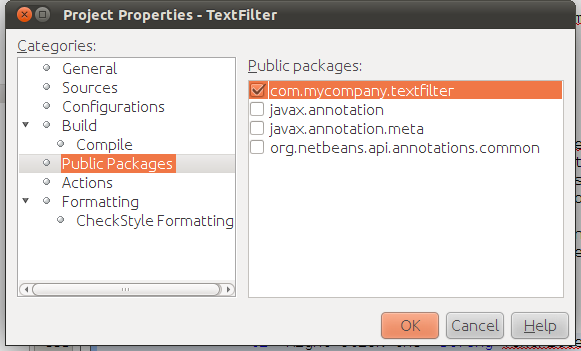

Click OK.

When you click OK, the IDE modifies the project POM to modify the  ``configuration``  element of the  ``nbm-maven-plugin``  artifact to add the following entries.

[source,xml]
----

<publicPackages>
   <publicPackage>com.mycompany.textfilter</publicPackage>
</publicPackages>
----

The POM entry now contains the following entries.

[source,xml]
----

<plugin>
    <groupId>org.codehaus.mojo</groupId>
    <artifactId>nbm-maven-plugin</artifactId>
    <version>3.6</version>
    <extensions>true</extensions>
    <configuration>
        *<publicPackages>
            <publicPackage>com.mycompany.textfilter</publicPackage>
        </publicPackages>*
    </configuration>
</plugin>
----

For more information, see  link:http://bits.netbeans.org/mavenutilities/nbm-maven-plugin/manifest-mojo.html#publicPackages[nbm-maven-plugin manifest].

== Creating a Module that Implements the Service

In this exercise you will create the module *MyFilter* and set a dependency on the *TextFilter* module. In the *MavenWordEngine* you can then use methods from *MyFilter* by looking up the *TextFilter* service. At that point, *MyFilter* will be decoupled from *MavenWordEngine*.

=== Creating the Module

In this exercise you will create a module named *MyFilter*. To create the module, you will perform the same steps that you performed when you created the TextFilter module.

[start=1]
1. Choose File > New Project (Ctrl-Shift-N).

[start=2]
1. As explained in the previous section, select NetBeans Module from the Maven category. Click Next.

[start=3]
1. Type *MyFilter* for the Project Name.

[start=4]
1. Click Browse to set the Project Location and locate the application directory. Click Finish.

[start=5]
1. Add the MyFilter module as a dependency of the *application* project.

For details on the steps above, see the previous sections.

=== Adding the TextFilter Module as a Dependency

In this exercise you add the TextFilter module as a dependency of the MyFilter module.

[start=1]
1. Right-click the Libraries node of the *MyFilter* project and choose Add Dependency.

[start=2]
1. Click the Open Projects tab in the Add Dependency dialog.

[start=3]
1. Select the *TextFilter* module. Click OK.

=== Modifying the MyFilter Module

In this exercise you will add a Java class with a single method that is named  ``process``  that converts a string to upper case. You will also specify that the class will implement the TextFilter interface. You will use an  ``@ServiceProvider``  annotation to specify that TextFilter is a service that will be registered at compile time.

[start=1]
1. Right-click the *MyFilter* module and choose New > Java Class.

[start=2]
1. Type *UpperCaseFilter* as the Class Name.

[start=3]
1. Select *com.mycompany.myfilter* in the Package dropdown list. Click Finish.

[start=4]
1. Modify the class to add the following code. Save your changes.

[source,java]
----

package com.mycompany.myfilter;

import com.mycompany.textfilter.TextFilter;
import org.openide.util.lookup.ServiceProvider;

*@ServiceProvider(service=TextFilter.class)*
public class UpperCaseFilter *implements TextFilter {

    @Override
    public String process(String s) {
        return s.toUpperCase();
    }*

}
----

Notice how the annotation is used to specify the Service Provider. For more about the  ``@ServiceProvider``  annotation and the behavior of the ServiceLoader mechanism in JDK 6, see the Lookup API documentation.

=== Modifying the MavenWordEngine Module

In this exercise you will modify the event handler in the Text window component to use a Lookup to call the TextFilter interface and access the process method in any available implementations, which in this case is only provided by MyFilter. Before adding the code to the event handler you need to declare a dependency on the TextFilter module.

[start=1]
1. Right-click the Dependencies node of the *MavenWordEngine* module and add a dependency on the TextFilter module.

[start=2]
1. Expand the Source Packages of the *MavenWordEngine* module and open  ``TextTopComponent``  in the source editor.

[start=3]
1. Modify the  ``jButton1ActionPerformed``  button handler method to add the following code. Save your changes.

[source,java]
----

private void jButton1ActionPerformed(java.awt.event.ActionEvent evt) {
    String s = text.getText();
    *for (TextFilter filter : Lookup.getDefault().lookupAll(TextFilter.class)) {
       s = filter.process(s);
    } *
    text.setText(s);
}
----

At this point you can check your application to see if it still works as before. In the next sections, you will publish content whenever the Filter button is clicked, followed by a new NetBeans module that will listen to the selection and display the content published there.

== Publishing Content into the Selection

In this exercise you add a listener and a field to store the contents of the text area when the "Filter!" button is clicked.

[start=1]
1. In the *MavenWordEngine* module, add the  ``InstanceContent``  object and modify the constructor of  ``TextTopComponent``  by adding the following code.

[source,java]
----

public final class TextTopComponent extends TopComponent {

    *private InstanceContent content;*

    public TextTopComponent() {
        initComponents();
        setName(Bundle.CTL_TextTopComponent());
        setToolTipText(Bundle.HINT_TextTopComponent());

        *content = new InstanceContent();
        associateLookup(new AbstractLookup(content));*
    }
    ...                
    ...                
    ...                
                
----

[start=2]
1. Modify the  ``jButton1ActionPerformed``  method to add the old value of the text to the  ``InstanceContent``  object when the button is clicked.

[source,java]
----

private void jButton1ActionPerformed(java.awt.event.ActionEvent evt) {
    String s = text.getText();
    for (TextFilter filter : Lookup.getDefault().lookupAll(TextFilter.class)) {
        *content.add(s);*
        s = filter.process(s);
    }
    text.setText(s);
}
----

Now a String will be published whenever the button is clicked. The String is published into the Lookup of the TopComponent. When the TopComponent is selected, the content of its Lookup will be available throughout the application. Next, we will create a new module that will listen to the Lookup and display the Strings found there.

== Creating a Module that Listens to the Selection

In this section you will create a module named *History* that will display Strings found in the Lookup of the selected TopComponent. To create the module, you will perform the same steps that you performed when you created the TextFilter and MyFilter modules.

=== Creating a New Module

[start=1]
1. Choose File > New Project (Ctrl-Shift-N).

[start=2]
1. Select NetBeans Module from the Maven category. Click Next.

[start=3]
1. Type *History* for the Project Name.

[start=4]
1. Click Browse to set the Project Location and locate the application directory. Click Finish.

[start=5]
1. Add the History module as a dependency of the *application* project.

=== Creating a Window Component in the History Module

In this exercise you will use a wizard to add a window component to the module.

[start=1]
1. Right-click the *History* module in the Projects window and choose New > Window.

[start=2]
1. Select *editor* in the Window Position dropdown list. Click Next.

[start=3]
1. Type *History* in the Class Name Prefix field. Click Finish.

A new TopComponent is created in your module, named HistoryTopComponent.

=== Modifying the History Window Component

You will now add a text area element to the window component that will display the filtered strings.

[start=1]
1. Click the Design tab of  ``HistoryTopComponent.java``  in the editor.

[start=2]
1. Drag and drop a text area from the Palette onto the window.

[start=3]
1. Right-click the text area and choose Change Variable Name, and then type *historyText* as the name.

[start=4]
1. Implement the  ``LookupListener``  class and add the following code to the  ``HistoryTopComponent``  so that it listens to the Lookup for the String class whenever the  ``HistoryTopComponent``  opens and displays all retrieved String objects in the text area.

[source,java]
----

...
...
...

public final class HistoryTopComponent extends TopComponent *implements LookupListener* {

    *Result<String> stringsInSelectedWindow;*

    public HistoryTopComponent() {
        initComponents();
        setName(Bundle.CTL_HistoryTopComponent());
        setToolTipText(Bundle.HINT_HistoryTopComponent());
    }

    *@Override
    public void resultChanged(LookupEvent le) {
        StringBuilder sb = new StringBuilder();
        for (String string : stringsInSelectedWindow.allInstances()) {
            sb.append(string).append('\n');
        }
        historyText.setText(sb.toString());
    }

    @Override
    public void componentOpened() {
        stringsInSelectedWindow = Utilities.actionsGlobalContext().lookupResult(String.class);
        stringsInSelectedWindow.addLookupListener(this);
    }

    @Override
    public void componentClosed() {
        stringsInSelectedWindow.removeLookupListener(this);
    }*

    ...
    ...
    ...

----

== Running the Application

You can now test the application.

[start=1]
1. Right-click the project node of the *application* and choose Clean.

[start=2]
1. Right-click the project node of the *application* and choose Build with Dependencies.

[start=3]
1. Right-click the project node of the *application* and choose Run.

When you click Run, the IDE launches the NetBeans Platform application. You can open the History and Text windows from the Window menu.

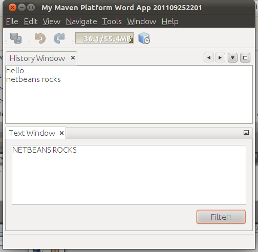

When you type text in the Text window and click the Filter! button, the text is converted to upper case letters and the text is added to the content of the History window.

This tutorial demonstrated the fundamental pieces of NetBeans Platform applications. Creating a NetBeans Platform application using Maven is not very different from creating an application using Ant. The major difference is understanding how the Maven POM controls how the application is assembled. For more examples on how to build NetBeans Platform applications and modules, see the tutorials listed in the  link:https://netbeans.apache.org/kb/docs/platform.html[NetBeans Platform Learning Trail].

link:http://netbeans.apache.org/community/mailing-lists.html[ Send Us Your Feedback]

 

== See Also

For more information about creating and developing applications, see the following resources.

*  link:https://netbeans.apache.org/kb/docs/platform.html[NetBeans Platform Learning Trail]
*  link:http://bits.netbeans.org/dev/javadoc/[NetBeans API Javadoc]

If you have any questions about the NetBeans Platform, feel free to write to the mailing list, dev@platform.netbeans.org, or view the  link:https://mail-archives.apache.org/mod_mbox/netbeans-dev/[NetBeans Platform mailing list archive].

