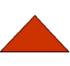
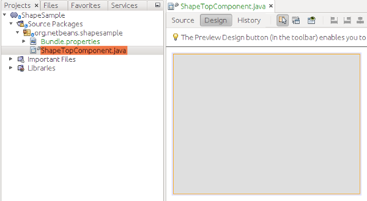
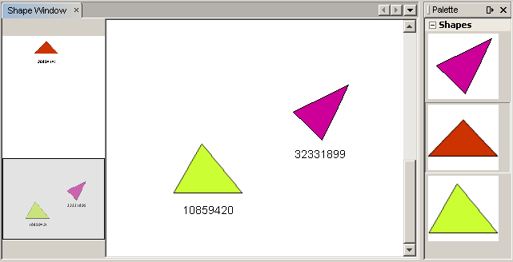

// 
//     Licensed to the Apache Software Foundation (ASF) under one
//     or more contributor license agreements.  See the NOTICE file
//     distributed with this work for additional information
//     regarding copyright ownership.  The ASF licenses this file
//     to you under the Apache License, Version 2.0 (the
//     "License"); you may not use this file except in compliance
//     with the License.  You may obtain a copy of the License at
// 
//       http://www.apache.org/licenses/LICENSE-2.0
// 
//     Unless required by applicable law or agreed to in writing,
//     software distributed under the License is distributed on an
//     "AS IS" BASIS, WITHOUT WARRANTIES OR CONDITIONS OF ANY
//     KIND, either express or implied.  See the License for the
//     specific language governing permissions and limitations
//     under the License.
//

= NetBeans Visual Library Tutorial
:jbake-type: platform_tutorial
:jbake-tags: tutorials 
:jbake-status: published
:syntax: true
:source-highlighter: pygments
:toc: left
:toc-title:
:icons: font
:experimental:
:description: NetBeans Visual Library Tutorial - Apache NetBeans
:keywords: Apache NetBeans Platform, Platform Tutorials, NetBeans Visual Library Tutorial

In this tutorial, you will learn how to use the main features provided by the  link:http://bits.netbeans.org/dev/javadoc/org-netbeans-api-visual/overview-summary.html[NetBeans Visual Library API]. The library provides a set of reusable pieces, called "widgets". When you compose them together, you are able to create a visualization in a simple and flexible way. Each widget has, built into it, various properties, such as "layout", "border", and "actions". The set of predefined widgets provided by the library can be extended.

All the pluggable pieces are declared as interfaces or abstract classes, such as "WidgetAction", "Anchor", "AnchorShape", "PointShape", "Animator", "Border", "GraphLayout", "LookFeel", "Layout", "SceneLayout", "Router", and "CollisionsCollector".

In summary, the Visual Library API is a visualization API, useful in the context of modeling and graphing features.

NOTE: This document uses NetBeans Platform 7.1 and NetBeans IDE 7.1. If you are using an earlier version, see  link:../70/nbm-visual_library.html[the previous version of this document].

Also, you will use 3 icons in the tutorial. You can right-click them here and save them locally, then copy them to the module project's location, after you create the module project later in this tutorial. Here are the 3 icons:

image::images/vislib_image1.png[] 
 
image::images/vislib_image3.png[]

All the information you need to know for working with the Visual Library API is collected at these two locations:

*  link:https://netbeans.apache.org/graph/[Visual Library Project Page]
*  link:https://netbeans.apache.org/graph/documentation.html[Visual Library 2.0 - Documentation]

== Setting Up the Module

In this section, we use wizards to create a module project and a custom window component.

[start=1]
1. Choose File > New Project (Ctrl+Shift+N). Under Categories, select NetBeans Modules. Under Projects, select Module. Click Next.

[start=2]
1. In the Name and Location panel, type  ``ShapeSample``  in the Project Name field. Change the Project Location to any directory on your computer. Leave the Standalone Module option and Set as Main Project checkbox selected. Click Next.

[start=3]
1. 
In the Basic Module Configuration panel, type  ``org.netbeans.shapesample``  in Code Name Base. Click Finish.

The IDE creates the  ``ShapeSample``  project. The project contains all of your sources and project metadata, such as the project's Ant build script. The project opens in the IDE. You can view its logical structure in the Projects window (Ctrl+1) and its file structure in the Files window (Ctrl+2).

[start=4]
1. Right-click the module project, choose New > Other and choose Window from the Module Development category. Click Next. Choose  ``editor``  in the drop-down list and select Open on Application Start. Click Next.

[start=5]
1. 
Type  ``Shape``  in Class Name Prefix. Optionally, add an icon with a dimension of 16x16 pixels. Click Finish.

A Java class is created, named  ``ShapeTopComponent`` . Open this file in "Design" mode. You should now see this:

[start=6]
1. Right-click the project, choose Properties, click Libraries in the Project Properties dialog box and declare a dependency on the Visual Library API. Click OK.

== Creating the Scene

Programming with the Visual Library API is similar to programming in Swing. You build and modify a tree of visual elements that are called "widgets". The root of the tree is represented by a Scene class which holds all the visual data of the scene. The scene is a widget. You have to create a scene view, which is a JComponent. You must then add the JComponent to a JScrollPane.

In this section, we add a JScrollPane to our TopComponent. Then we create a new scene. Next, we pass the scene view to the TopComponent, so that it can be displayed in the TopComponent's JScrollPane. We then install the module project and display our first scene.

[start=1]
1. In the  ``org.netbeans.shapesample``  package, create a Java class called  ``GraphSceneImpl`` . Let the class extend  ``GraphScene`` .

A red error underline and a lightbulb appears. Let the IDE generate the import statement.

A red error underline and a lightbulb appears again. Let the IDE generate the class's abstract methods.

[start=2]
1. Create a dummy implementation of the class by adding meaningful identifiers and setting  ``null``  to be returned where necessary, so that all of the class's requirements are fulfilled:

[source,java]
----

public class GraphSceneImpl extends GraphScene {
    
    public GraphSceneImpl() {
    }
    
    @Override
    protected Widget attachNodeWidget(Object node) {
        return null;
    }
    
    @Override
    protected Widget attachEdgeWidget(Object edge) {
        return null;
    }
    
    @Override
    protected void attachEdgeSourceAnchor(Object edge, Object oldSourceNode, Object newSourceNode) {
    
    }
    
    @Override
    protected void attachEdgeTargetAnchor(Object edge, Object oldTargetNode, Object newTargetNode) {
            
    }
    
}
----

[start=3]
1. Now use the TopComponent's constructor to hold an instance of the  ``GraphSceneImpl``  class. To do so, add the following to the end of the  ``ShapeTopComponent``  class's constructor:

[source,java]
----

setLayout(new BorderLayout());

GraphSceneImpl scene = new GraphSceneImpl();

JScrollPane shapePane = new JScrollPane();

shapePane.setViewportView(scene.createView());

add(shapePane, BorderLayout.CENTER);
add(scene.createSatelliteView(), BorderLayout.WEST);
----

Notice that we are creating two views. The first will be a large view for visualization of your graphs or models, and so on. The second is a satellite view, which we have placed in the WEST (i.e., the left side) of the TopComponent. This will let the user navigate quickly across the view and gives an overview of the entire scene.

[start=4]
1. Right-click the project node and choose "Run".

A new instance of the application starts up. When the module installs, look under the Window menu and you will find a new menu item called "Shape", at the top of the list of menu items. Choose it and you will see the start of your Visual Library API implementation:

image::images/vislib_firstscene.png[]

== Creating a Component Palette for the Scene

To do something useful with the Visual Library API, we will implement the  link:http://bits.netbeans.org/dev/javadoc/org-netbeans-spi-palette/overview-summary.html[Palette API] so that we end up with a Component Palette containing the shapes shown at the start of this tutorial. Later, we will add the Visual Library API's drag and drop functionality so that we can drag and drop the shapes into the scene. After that, we will be able to enrich the scene with additional features, such as the ability to zoom and pan in the scene.

[start=1]
1. Since the focus of this tutorial is the Visual Library API, and not the Palette API, no time will be spent here explaining how the Palette API works. Many tutorials exist on this subject already ( link:https://netbeans.apache.org/kb/docs/platform.html[here]). Therefore, you can simply copy and paste the following files into a new package called  ``org.netbeans.shapesample.palette`` :

*  link:images/vislib_Category.java[Category.java]
*  link:images/vislib_CategoryChildren.java[CategoryChildren.java]
*  link:images/vislib_CategoryNode.java[CategoryNode.java]
*  link:images/vislib_PaletteSupport.java[PaletteSupport.java]
*  link:images/vislib_Shape.java[Shape.java]
*  link:images/vislib_ShapeChildren.java[ShapeChildren.java]
*  link:images/vislib_ShapeNode.java[ShapeNode.java]

[start=2]
1. In the same way as explained in step 3 of the section called "Getting Started", earlier in this tutorial, add dependencies on the Actions API, Nodes API, and Common Palette API.

[start=3]
1. Next, add the palette to the TopComponent's Lookup, by adding this line to the end of the TopComponent's constructor:

[source,java]
----

associateLookup( Lookups.singleton(PaletteSupport.createPalette() ));
----

[start=4]
1. The IDE will prompt you to insert import statements for  ``org.openide.util.lookup.Lookups``  and  ``org.netbeans.shapesample.palette.PaletteSupport`` . Accept the prompts and let the IDE generate the import statements.

[start=5]
1. 
Place the images found at the start of this tutorial into the  ``org.netbeans.shapesample.palette``  package. The Projects window should now look as follows:

image::images/vislib_71_proj-window.png[]

[start=6]
1. Install the module again. The new Component Palette is shown to the right of the scene:

image::images/vislib_firstpalette.png[]

When you try to drag and drop a widget onto the scene, nothing happens because you need a  ``LayerWidget``  on which you will be able to drop your widgets. You will be shown how to do so in the next section.

== Adding a LayerWidget

A  link:http://bits.netbeans.org/dev/javadoc/org-netbeans-api-visual/org/netbeans/api/visual/widget/LayerWidget.html[LayerWidget] represents a glasspane, similar to JGlassPane in Swing. It is transparent by default. So, before we go any further, we will add a LayerWidget to the scene, so that we have somewhere to place the visible widgets that we will drag and drop onto the scene.

[start=1]
1. In the  ``GraphSceneImpl``  class, declare the LayerWidget:

[source,java]
----

private LayerWidget mainLayer;
----

[start=2]
1. In the  ``GraphSceneImpl``  class's constructor, add the LayerWidget as a child of the scene:

[source,java]
----

mainLayer = new LayerWidget (this);
addChild (mainLayer);
----

Now, when we drag and drop items from the palette as widgets to the scene, we will add them as children of the LayerWidget. Because LayerWidgets are transparent by default, you could have various LayerWidgets transparently on top of each other so that, for example, you can add a background image to the scene.

For details, see  link:http://bits.netbeans.org/dev/javadoc/org-netbeans-api-visual/org/netbeans/api/visual/widget/LayerWidget.html[LayerWidget] in the Javadoc.

== Adding an IconNodeWidget via Drag and Drop Functionality

Earlier, we used the  ``GraphSceneImpl``  class's constructor to pass a scene to the TopComponent's JScrollPane. So far, the scene exists but has no behavior. Behavior is added through actions. The action that we will look at in this section is called  `` link:https://netbeans.apache.org/graph/documentation.html#AcceptAction[AcceptAction]`` . This action enables drag and drop functionality. The drag and drop functionality could be applied to a widget, but here we apply it to the scene itself.

We use  ``createAcceptAction``  to specify what should happen when an item from the palette is dragged over the scene. Two methods are involved here. The first,  ``isAcceptable()`` , is used to determine whether the item is acceptable to the scene. Here you can test the item, by using the transferable. You can also set the drag image, which is all that we do in the implementation below. If  ``true``  is returned, the  ``accept``  method is called. Here we get the image from the transferable, using the same helper method as before. Then we call the  ``addNode``  method, instantiating a new  link:http://bits.netbeans.org/dev/javadoc/org-netbeans-api-visual/org/netbeans/api/visual/widget/general/IconNodeWidget.html[IconNodeWidget] and passing the image retrieved from the transferable.

All the code in this section is interrelated, and you will receive red error underlines in your code until all the methods below have been added, but we will try to add everything in some kind of logical order anyway!

[start=1]
1. First, add the  ``createAcceptAction`` , with its two methods, to the  ``GraphSceneImpl``  class's constructor:

[source,java]
----

getActions().addAction(ActionFactory.createAcceptAction(new AcceptProvider() {

    @Override
    public ConnectorState isAcceptable(Widget widget, Point point, Transferable transferable) {
        Image dragImage = getImageFromTransferable(transferable);
        JComponent view = getView();
        Graphics2D g2 = (Graphics2D) view.getGraphics();
        Rectangle visRect = view.getVisibleRect();
        view.paintImmediately(visRect.x, visRect.y, visRect.width, visRect.height);
        g2.drawImage(dragImage,
                AffineTransform.getTranslateInstance(point.getLocation().getX(),
                point.getLocation().getY()),
                null);
        return ConnectorState.ACCEPT;
    }

    @Override
    public void accept(Widget widget, Point point, Transferable transferable) {
        Image image = getImageFromTransferable(transferable);
        Widget w = GraphSceneImpl.this.addNode(new MyNode(image));
        w.setPreferredLocation(widget.convertLocalToScene(point));
    }

}));
----

NOTE:  After you add the above code, some red underlines will remain, denoting that there are errors. These errors are because the code above refers to a method and a class that you have not yet created. You will create them in the next steps.

[start=2]
1. Next, in the  ``GraphSceneImpl``  class, add a helper method for retrieving the image from the transferable:

[source,java]
----

private Image getImageFromTransferable(Transferable transferable) {
    Object o = null;
    try {
        o = transferable.getTransferData(DataFlavor.imageFlavor);
    } catch (IOException ex) {
    } catch (UnsupportedFlavorException ex) {
    }
    return o instanceof Image ? (Image) o : ImageUtilities.loadImage("org/netbeans/shapesample/palette/shape1.png");
}
----

NOTE:  You can define any kind of image when an image is not successfully returned from this helper method. For now we will use the " ``shape1.png`` " image instead.

[start=3]
1. Create a new class called  ``MyNode`` . This class represents a node in a graph-oriented model. It cannot be an image directly, since each node has to be unique (checked by "equals" method) in the model. If you would use the images directly, then you would be able to have only 3 nodes (one for each image) in the scene. Using the MyNode class, you can have multiple nodes and each node can have its own or a shared image instance.

[source,java]
----

public class MyNode {
    
    private Image image;
    
    public MyNode(Image image) {
        this.image = image;
    }
    
    public Image getImage() {
        return image;
    }

}
----

[start=4]
1. Change the signature of the  ``GraphSceneImpl``  class to the following, so that the node is received by the Visual Library implementation class:

[source,java]
----

extends GraphScene<MyNode, String>
----

You must let the IDE generate new stubs for the abstract methods.

[start=5]
1. Finally, define the new widget in the  ``GraphSceneImpl``  class. This method is called automatically by the  ``accept``  method. Use it to define a Visual Library widget when the palette item is dropped.

[source,java]
----

@Override
protected Widget attachNodeWidget(MyNode node) {
    IconNodeWidget widget = new IconNodeWidget(this);
    widget.setImage(node.getImage());
    widget.setLabel(Long.toString(node.hashCode()));
    widget.getActions().addAction(ActionFactory.createMoveAction());
    mainLayer.addChild(widget);
    return widget;
}
----

Notice that we set the image retrieved from the node. We also generate a random number so that we have a label. By default, the widget exists but has no behavior. Here, we create a move action, so that the widget can be moved in the scene. Finally, before returning the widget to the scene, we add it as a child to the LayerWidget that we created in the previous section.

[start=6]
1. Run the module and open the Shape window again.

Now you can drag and drop items from the palette. As you drag an item over the scene, you will see the drag image. When you drop an item, it becomes a widget and is visible within the scene as well as within the satellite view, as you can see here:

== Adding Functionality to the Scene

In the previous section, we added  `` link:https://netbeans.apache.org/graph/documentation.html#AcceptAction[AcceptAction]``  to the scene. We had to define two methods to specify whether the item should be dropped and for resolving the item. In this section, we use  `` link:https://netbeans.apache.org/graph/documentation.html#ZoomAction[ZoomAction]`` , to add zoom/unzoom functionality to the scene.

[start=1]
1. At the end of the  ``GraphSceneImpl``  class's constructor, add this line:

[source,java]
----

getActions().addAction(ActionFactory.createZoomAction());
----

[start=2]
1. Install the module again.

[start=3]
1. 
While holding CTRL key, use the mouse wheel to zoom in and out of the scene:

image::images/vislib_zoom.png[]

image::images/vislib_unzoom.png[]

NOTE:  The shapes are rendered as images. SVG is currently not supported.

In the same way as described above, you can add Pan functionality to the scene, by means of this line:

[source,java]
----

getActions().addAction(ActionFactory.createPanAction());
----

When you add this line, the user will be able to hold down the mouse wheel and then scroll in any direction in the scene.

== Adding Functionality to the IconNodeWidget

Earlier we added  `` link:https://netbeans.apache.org/graph/documentation.html#MoveAction[MoveAction]``  to the IconNodeWidget, to enable move behavior for the widget. In the same way, a lot of other behavior can be added to the widget. In this section, we add  `` link:https://netbeans.apache.org/graph/documentation.html#HoverAction[HoverAction]`` ,  `` link:https://netbeans.apache.org/graph/documentation.html#SelectAction[SelectAction]`` , and  `` link:https://netbeans.apache.org/graph/documentation.html#InplaceEditorAction[InplaceEditorAction]`` .

The  ``InplaceEditorAction``  will let the user change the label:

image::images/vislib_editable.png[]

The  ``SelectAction``  will change the color of the label when the widget is selected, while the  ``HoverAction``  will change the color of the label when the mouse hovers over the widget:

image::images/vislib_selectable-hoverable.png[]

[start=1]
1. First define the editor action that we will add to the IconNodeWidget:

[source,java]
----

private WidgetAction editorAction = ActionFactory.createInplaceEditorAction(new LabelTextFieldEditor());
----

[start=2]
1. Now define the  ``LabelTextFieldEditor`` , as follows:

[source,java]
----

private class LabelTextFieldEditor implements TextFieldInplaceEditor {

    public boolean isEnabled(Widget widget) {
        return true;
    }

    public String getText(Widget widget) {
        return ((LabelWidget) widget).getLabel();
    }

    public void setText(Widget widget, String text) {
        ((LabelWidget) widget).setLabel(text);
    }

}
----

[start=3]
1. Finally, assign the editor action to the IconNodeWidget, in the same way as done for the move action earlier:

[source,java]
----

widget.getLabelWidget().getActions().addAction(editorAction);
----

Here, we first get the IconNodeWidget's LabelWidget. Then we add the editor action to the LabelWidget.

[start=4]
1. The IDE will prompt you to add several import statements. In each case, accept the suggestion offered by the IDE.

[start=5]
1. Next, in the case of  ``SelectAction``  and  ``HoverAction`` , you need do nothing more than assign these actions to the IconNodeWidget:

[source,java]
----

widget.getActions().addAction(createSelectAction());
widget.getActions().addAction(createObjectHoverAction());
----

[start=6]
1. Next, you need to think about the order of the actions that you have created. For details, see the  link:http://bits.netbeans.org/dev/javadoc/org-netbeans-api-visual/org/netbeans/api/visual/widget/doc-files/documentation.html#OrderOfActions[Order of Actions] section in the documentation. After you have reordered the actions, the  ``attachNodeWidget``  should look as follows:

[source,java]
----

protected Widget attachNodeWidget(MyNode node) {
    IconNodeWidget widget = new IconNodeWidget(this);
    widget.setImage(node.getImage());
    widget.setLabel(Long.toString(node.hashCode()));

    //double-click, the event is consumed while double-clicking only:
    widget.getLabelWidget().getActions().addAction(editorAction);

    //single-click, the event is not consumed:
    widget.getActions().addAction(createSelectAction()); 

    //mouse-dragged, the event is consumed while mouse is dragged:
    widget.getActions().addAction(ActionFactory.createMoveAction()); 

    //mouse-over, the event is consumed while the mouse is over the widget:
    widget.getActions().addAction(createObjectHoverAction()); 

    mainLayer.addChild(widget);
    return widget;
}
----

[start=7]
1. Install and try out the module again. As shown at the start of this section, when you hover over a widget's label, or when you select it, its color will change. Also, when you click on a label, you are able to edit its content.

Congratulations, you have completed your first Visual Library scene.

link:http://netbeans.apache.org/community/mailing-lists.html[Send Us Your Feedback]

== Next Steps

For more information on working with the Visual Library API, see:

*  link:https://netbeans.apache.org/graph/[Visual Library Project Page]
*  link:https://netbeans.apache.org/graph/documentation.html[Visual Library 2.0 - Documentation]
