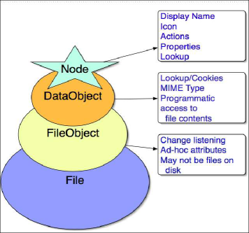
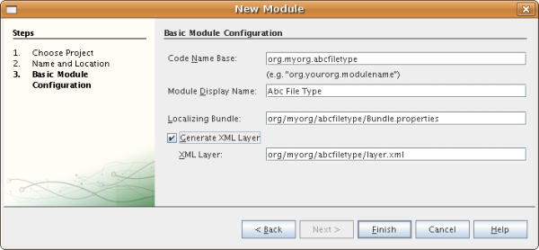
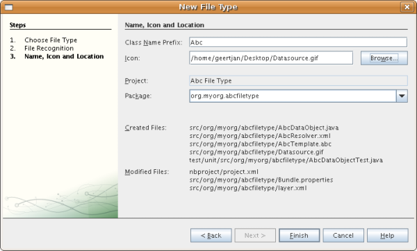
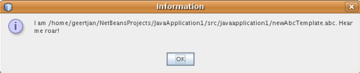

// 
//     Licensed to the Apache Software Foundation (ASF) under one
//     or more contributor license agreements.  See the NOTICE file
//     distributed with this work for additional information
//     regarding copyright ownership.  The ASF licenses this file
//     to you under the Apache License, Version 2.0 (the
//     "License"); you may not use this file except in compliance
//     with the License.  You may obtain a copy of the License at
// 
//       http://www.apache.org/licenses/LICENSE-2.0
// 
//     Unless required by applicable law or agreed to in writing,
//     software distributed under the License is distributed on an
//     "AS IS" BASIS, WITHOUT WARRANTIES OR CONDITIONS OF ANY
//     KIND, either express or implied.  See the License for the
//     specific language governing permissions and limitations
//     under the License.
//

= ファイルの種類統合のチュートリアル
:jbake-type: platform_tutorial
:jbake-tags: tutorials 
:jbake-status: published
:syntax: true
:source-highlighter: pygments
:toc: left
:toc-title:
:icons: font
:experimental:
:description: ファイルの種類統合のチュートリアル - Apache NetBeans
:keywords: Apache NetBeans Platform, Platform Tutorials, ファイルの種類統合のチュートリアル

このチュートリアルでは、IDE または NetBeans プラットフォーム上に構築されたその他のアプリケーションに、新しいファイルの種類を認識させるモジュールを作成する方法を示します。

NOTE:  このドキュメントでは NetBeans IDE 6.5 リリースを使用します。NetBeans IDE 6.x を使用している場合、 link:60/nbm-filetype_ja.html[このドキュメントの 6.1 バージョン]を参照してください。

== ファイルの種類統合について

IDE で認識されるファイルの種類には、独自のアイコン、メニュー項目、および動作があります。表示される「ファイル」は  ``FileObjects``  であり、 ``java.io.File``  のラッパーか、構成ファイルの場合は通常、モジュールの XML ファイル内など、ほかの方法で保存されたデータのラッパーです。実際に_表示_されているものは  ``Nodes``  で、アクションのような機能や、ファイルなどのオブジェクトにローカライズされた名前を提供します。 ``Nodes``  と  ``FileObjects``  の間には  ``DataObjects``  があります。 ``DataObject``  は  ``FileObject``  に似ていますが、どの種類のファイルが表示されるかはわかりません。通常、異なる拡張子を持つファイルと異なる名前空間を持つ XML ファイルに対して、異なる種類の  ``DataObject``  があります。各  ``DataObject``  は異なるモジュールによって提供されます。各実装は、1 つ以上のファイルの種類をサポートします。たとえば、画像モジュールは  ``.gif``  ファイルおよび  ``.png``  ファイルを認識し、開くことができます。

ファイルの種類を認識するモジュールは、 ``DataLoader``  (ファイルの種類に固有の  ``DataObject``  用のファクトリ) をインストールします。フォルダを展開すると、IDE は各既存の  ``DataLoader``  に「これは何かわかりますか ?」と問い合わせます。最初に「はい」と答えた DataLoader が、ファイルの  ``DataObject``  を作成します。各ファイルの何かを実際に表示するために、システムが各  ``DataObject``  に対して  ``DataObject.getNodeDelegate()``  を呼び出すと、 ``Nodes``  が IDE で実際に表示されるものになります。

次の左側の図は、前述の各項目を示しています。

このチュートリアルでは、架空のファイル「Abc」 (ファイル拡張子は  ``.abc`` ) に、 ``DataLoader``  をインストールするモジュールを作成します。デフォルトで、「abc」拡張子を持つファイルは、IDE が認識しないその他のファイルとして扱われます。これはテキストファイルとして扱われるため、IDE はテキストファイルの場合と同様の機能を、Abc ファイルに提供します。モジュールを作成すると、Abc ファイルでのみ利用できる機能を拡張する方法が表示されます。開発サイクルが完了すると、ほかの人にそのモジュールを簡単に使用させることができます。IDE では、ほかの人に送信できるバイナリを作成できます。ほかの人は、アップデートセンターからそれをインストールできます。

==  モジュールプロジェクトの作成

この節では、ウィザードを使用して、各 NetBeans モジュールが必要とするソースの構造を作成します。ソースの構造は、特定の場所にある特定のフォルダと、常に必要なファイルのセットで構成されます。たとえば、すべての NetBeans モジュールには、プロジェクトのメタデータを保存する  ``nbproject``  フォルダと、ツールバーボタンやウィンドウなどの項目を宣言登録するための  ``layer.xml``  ファイルが必要です。

[start=1]
1. 「ファイル」>「新規プロジェクト」(Ctrl-Shift-N) を選択します。「カテゴリ」で「NetBeans モジュール」を選択します。「プロジェクト」で「モジュール」を選択し、「次へ」をクリックします。

[start=2]
1. 「名前と場所」パネルで、「プロジェクト名」に「 ``AbcFileType`` 」と入力します。「プロジェクトの場所」を、 ``c:\mymodules``  などのコンピュータ上の任意のディレクトリに変更します。「スタンドアロンモジュール」ラジオボタンは選択したままにしておきます。パネルは次のようになります。

image::images/filetype_65-projectwizard1.png[]

「次へ」をクリックします。

[start=3]
1. 「基本モジュール構成」パネルで、コード名ベースに「 ``org.myorg.abcfiletype`` 」と入力します。推奨されるモジュール表示名に空白文字を追加し、 ``Abc File Type``  に変更します。「XML レイヤーを生成」チェックボックスを選択し、「ローカライズ版バンドル」と「XML レイヤー」の場所はそのままにしておきます。これらは  ``org/myorg/abcfiletype``  という名前のパッケージに格納されます。パネルは次のようになります。

[start=4]
1. 「完了」をクリックします。

IDE によって  ``Abc File Type``  プロジェクトが作成されます。このプロジェクトには、ソースや、プロジェクトの Ant 構築スクリプトなどのプロジェクトメタデータがすべて含まれます。IDE でプロジェクトが開きます。「プロジェクト」ウィンドウ (Ctrl-1) で、プロジェクトの論理構造を表示できます。また、「ファイル」ウィンドウ (Ctrl-2) で、プロジェクトのファイル構造を表示できます。たとえば、「プロジェクト」ウィンドウは次のように表示されます。

image::images/filetype_65-projectswindow1.png[]

== Abc ファイルの認識

この節では、ウィザードを使用して、Abc ファイルがほかのすべてのファイルとは異なることを認識するために必要なクラスを作成します。このチュートリアルの最初で説明したとおり、これを行うには、データオブジェクトとデータローダーのほかに、MIME タイプリゾルバと  ``layer.xml``  ファイルの登録エントリが必要です。「新規ファイルの種類」ウィザードによってそれらがすべて作成されます。

[start=1]
1. プロジェクトノードを右クリックし、「新規」>「ファイルの種類」を選択します。

[start=2]
1. 「ファイルの認識」パネルで、次を行います。
* MIME タイプの編集ボックスに「 ``text/x-abc`` 」と入力します。
* ファイル名の拡張子の編集ボックスに「 ``.abc .ABC`` 」と入力します。

これで、「ファイルの認識」パネルは次のようになります。

image::images/filetype_60-filewizard1.png[]

「ファイルの認識」パネルには、次のフィールドがあります。

* *MIME タイプ。*データオブジェクトの一意の MIME タイプを指定します。
* 認識方法
* *ファイル名の拡張子。*1 つまたは複数のファイル拡張子を指定して、指定の MIME タイプに属することを IDE に認識させます。任意で、ファイル拡張子の前にピリオドを 1 つ付けることができます。区切り文字はコンマか空白文字、またはその両方です。したがって、次の拡張子はすべて有効です。
*  ``.abc,.def`` 
*  ``.abc .def`` 
*  ``abc def`` 
*  ``abc,.def ghi, .wow`` 

Abc ファイルが大文字小文字を区別するとします。その場合、このチュートリアルでは _2 つの_ MIME タイプ、 ``.abc``  と  ``.ABC``  を指定します。

* *XML のルート要素。*一意の名前空間を指定して、XML ファイルの種類をほかのすべての XML ファイルの種類と区別します。多くの XML ファイルは同じ拡張子 ( ``xml`` ) を持つので、IDE はその XML ルート要素を使用して XML ファイルを区別します。さらに具体的に言うと、IDE は名前空間と XML ファイルの最初の XML 要素を区別できます。これを使用すると、たとえば、JBoss 配備記述子と WebLogic 配備記述子を区別できます。この区別を行うと、JBoss 配備記述子のコンテキストメニューに追加したメニュー項目が、WebLogic 配備記述子で使用できなくなります。例については、 link:nbm-palette-api2.html[NetBeans コンポーネントパレットモジュールのチュートリアル]を参照してください。

「次へ」をクリックします。

[start=3]
1. 「名前と場所」パネルで、「クラス名の接頭辞」に「 ``Abc``  」と入力し、次に示すように、任意の 16x16 ピクセルの画像ファイルを新しいファイルの種類のアイコンとして参照します。

*注:* 16x16 ピクセルの任意のアイコンを使用できます。必要に応じて、このアイコン 
 をクリックしてローカルに保存し、前述のウィザードの手順で指定できます。

[start=4]
1. 「完了」をクリックします。

「プロジェクト」ウィンドウは次のようになります。

image::images/filetype_65-projectswindow2.png[]

新しく生成された各ファイルについて簡単に説明します。

* *AbcDataObject.java。* ``FileObject``  をラップします。DataObjects は DataLoaders によって生成されます。詳細については、 link:https://netbeans.apache.org/wiki/devfaqdataobject[What is a DataObject?] を参照してください。
* *AbcResolver.xml。* ``.abc``  および  ``.ABC``  の拡張子を MIME タイプにマップします。 ``AbcDataLoader``  は MIME タイプのみを認識し、ファイル拡張子については認識しません。
* *AbcTemplate.abc。*「新規ファイル」ダイアログに新しいテンプレートとしてインストールされるように、 ``layer.xml``  に登録されているファイルテンプレートの基盤を提供します。
* *AbcDataObjectTest.java。* ``DataObject``  の JUnit テストクラス。

 ``layer.xml``  ファイルは、次のように表示されます。

[source,xml]
----

<folder name="Loaders">
    <folder name="text">
        <folder name="x-abc">
            <folder name="Actions">
                <file name="org-myorg-abcfiletype-MyAction.shadow">
                    <attr name="originalFile" stringvalue="Actions/Edit/org-myorg-abcfiletype-MyAction.instance"/>
                    <attr name="position" intvalue="600"/>
                </file>
                <file name="org-openide-actions-CopyAction.instance">
                    <attr name="position" intvalue="100"/>
                </file>
                <file name="org-openide-actions-CutAction.instance">
                    <attr name="position" intvalue="200"/>
                </file>
                <file name="org-openide-actions-DeleteAction.instance">
                    <attr name="position" intvalue="300"/>
                </file>
                <file name="org-openide-actions-FileSystemAction.instance">
                    <attr name="position" intvalue="400"/>
                </file>
                <file name="org-openide-actions-OpenAction.instance">
                    <attr name="position" intvalue="500"/>
                </file>
                <file name="org-openide-actions-PropertiesAction.instance">
                    <attr name="position" intvalue="700"/>
                </file>
                <file name="org-openide-actions-RenameAction.instance">
                    <attr name="position" intvalue="800"/>
                </file>
                <file name="org-openide-actions-SaveAsTemplateAction.instance">
                    <attr name="position" intvalue="900"/>
                </file>
                <file name="org-openide-actions-ToolsAction.instance">
                    <attr name="position" intvalue="1000"/>
                </file>
                <file name="sep-1.instance">
                    <attr name="instanceClass" stringvalue="javax.swing.JSeparator"/>
                    <attr name="position" intvalue="1100"/>
                </file>
                <file name="sep-2.instance">
                    <attr name="instanceClass" stringvalue="javax.swing.JSeparator"/>
                    <attr name="position" intvalue="1200"/>
                </file>
                <file name="sep-3.instance">
                    <attr name="instanceClass" stringvalue="javax.swing.JSeparator"/>
                    <attr name="position" intvalue="1300"/>
                </file>
                <file name="sep-4.instance">
                    <attr name="instanceClass" stringvalue="javax.swing.JSeparator"/>
                    <attr name="position" intvalue="1400"/>
                </file>
            </folder>
            <folder name="Factories">
                <file name="AbcDataLoader.instance">
                    <attr name="SystemFileSystem.icon" urlvalue="nbresloc:/org/myorg/abcfiletype/Datasource.gif"/>
                    <attr name="dataObjectClass" stringvalue="org.myorg.abcfiletype.AbcDataObject"/>
                    <attr name="instanceCreate" methodvalue="org.openide.loaders.DataLoaderPool.factory"/>
                    <attr name="mimeType" stringvalue="text/x-abc"/>
                </file>
            </folder>
        </folder>
    </folder>
</folder>
----

== インストールおよび機能の動作確認

次に、モジュールをインストールし、これまでに作成した基本機能を使用します。IDE は、Ant 構築スクリプトを使用してモジュールを構築およびインストールします。構築スクリプトは、プロジェクトを作成するときに作成されます。

[start=1]
1. 「プロジェクト」ウィンドウで、 ``Abc File Type``  プロジェクトを右クリックし、「実行」を選択します。

IDE の新しいインスタンスが起動し、それにモジュールがインストールされます。

[start=2]
1. 「新規プロジェクト」ダイアログ (Ctrl-Shift-N) を使用して、任意の種類のアプリケーションを IDE に作成します。

[start=3]
1. アプリケーションノードを右クリックし、「新規」>「その他」を選択します。「その他」カテゴリで、新しいファイルの種類を操作するためのテンプレートを使用できます。

image::images/filetype_60-action4.png[]

ウィザードを完了するとテンプレートが作成されます。このテンプレートを使用して、特定のファイルの種類でユーザーの作業を開始できます。

このテンプレートを使用してデフォルトのコードを提供する場合は、「新規ファイルの種類」ウィザードで作成された  ``AbcTemplate.abc``  ファイルにそのコードを追加します。

== Abc ファイルの機能の作成

これで、NetBeans プラットフォームが、Abc ファイルとほかの種類のすべてのファイルを区別できるようになりました。次に、これらの種類のファイルに特有の機能を追加します。この節では、「プロジェクト」ウィンドウなどのエクスプローラウィンドウで、ファイルのノードを右クリックしたコンテキストメニューのメニュー項目を追加します。また、ファイルをエディタではなくウィンドウで開けるようにします。

=== アクションの追加

このサブセクションでは、「新規アクション」ウィザードを使用して、ファイルの種類のアクションを実行する Java クラスを作成します。このウィザードでは、エクスプローラウィンドウにあるファイルの種類のノードの、右クリックのコンテキストメニューから呼び出しできるように、クラスを  ``layer.xml``  ファイルに登録します。

[start=1]
1. プロジェクトノードを右クリックし、「新規」>「アクション」を選択します。

[start=2]
1. 「アクションの種類」パネルで、「条件付きで有効」をクリックします。次に示すように、前に「新規ファイルの種類」ウィザードで生成したデータオブジェクトの名前  ``AbcDataObject``  を入力します。

image::images/filetype_60-action1.png[]

「次へ」をクリックします。

[start=3]
1. 「GUI 登録」パネルで、「カテゴリ」ドロップダウンリストから「編集」カテゴリを選択します。「カテゴリ」ドロップダウンリストは、IDE のキーボードショートカットエディタでアクションが表示される場所を制御します。

次に、「大域メニュー項目」を選択解除して「ファイルの種類のメニュー項目」を選択します。「内容の種類」ドロップダウンリストで、次に示すように、「新規ファイルの種類」ウィザードで前に指定した MIME タイプを選択します。

image::images/filetype_60-action2.png[]

メニュー項目の位置は設定可能で、そのメニュー項目を前後の項目から離すことができます。「次へ」をクリックします。

[start=4]
1. 「名前と場所」パネルで、「クラス名」に「 ``MyAction`` 」と入力し、「表示名」に「 ``MyAction`` 」と入力します。コンテキストメニューにあるメニュー項目には、アイコンが表示されません。したがって、「完了」をクリックすると  ``org.myorg.abcfiletype``  パッケージに  ``MyAction.java``  が追加されます。

[start=5]
1. ソースエディタで、アクションの  ``actionPerformed``  メソッドにいくつかのコードを追加します。

[source,java]
----

@Override
public void actionPerformed(ActionEvent ev) {
   FileObject f = context.getPrimaryFile();
   String displayName = FileUtil.getFileDisplayName(f);
   String msg = "I am " + displayName + ". Hear me roar!"; 
        NotifyDescriptor nd = new NotifyDescriptor.Message(msg);
        DialogDisplayer.getDefault().notify(nd);
}
----

Ctrl-Shift-I キーを押します。IDE によって、インポート文がクラスの先頭に自動で追加されます。

一部のコードには、まだ赤い下線が付いています。これは、クラスパスに必要なパッケージのすべてがないことを示しています。プロジェクトノードを右クリックして「プロパティー」を選択し、「プロジェクトプロパティー」ダイアログの「ライブラリ」をクリックします。「ライブラリ」区画の上部にある「追加」をクリックし、「ダイアログ API」を追加します。

 ``MyAction.java``  クラスで、もう一度 Ctrl-Shift-I キーを押します。 IDE がダイアログ API の必要なパッケージを検出したため、赤い下線が消えます。

[start=6]
1. 「重要なファイル」ノードで、「XML レイヤー」を展開します。「 ``<このレイヤー>`` 」と「 ``<コンテキスト内のこのレイヤー>`` 」の 2 つのノードと、それらのサブノードが、 link:https://netbeans.apache.org/tutorials/nbm-glossary.html[System ファイルシステム]ブラウザを構成します。「 ``<このレイヤー>`` 」、「 ``Loaders`` 」を順に展開し、前に作成した「 ``Action`` 」が表示されるまでノードを展開します。

[start=7]
1.  ``My Action``  をドラッグ＆ドロップすると、次に示すように、 ``開く`` アクションの下に表示されます。

image::images/filetype_60-action3.png[]

最後の 2 つの手順から分かるとおり、System ファイルシステムブラウザは、System ファイルシステムに登録されている項目の順序をすばやく再編成するのに使用できます。

[start=8]
1. 前の節で実行したように、モジュールを再実行します。

[start=9]
1. 前の節で示したテンプレートを使用して ABC ファイルを作成し、「プロジェクト」ウィンドウや「お気に入り」ウィンドウなど、いずれかのエクスプローラビューでそのファイルのノードを右クリックします。

Abc ファイルには、モジュールで割り当てたアイコンと、右クリックのコンテキストメニューから使用できる、 ``layer.xml``  ファイルで定義されているアクションのリストがあります。

image::images/filetype_60-dummytemplate.png[]

[start=10]
1. 新規メニュー項目を選択すると、Abc ファイルの名前と場所が次のように表示されます。

特定の種類のファイルのコンテキストメニューに表示される新しいアクションを、「プロジェクト」ウィンドウ、「ファイル」ウィンドウ、または「お気に入り」ウィンドウで作成する方法について学習しました。

=== ファイルをウィンドウで開く

デフォルトでは、このチュートリアルで定義した種類のファイルを開くと、そのファイルが基本のエディタで開きます。ただし、ファイルの視覚表現を作成したい場合があります。ユーザーはウィジェットをドラッグして視覚表現にドロップします。このようなユーザーインタフェースを作成する最初の手順として、ユーザーはファイルをウィンドウで開きます。このサブセクションでその方法を説明します。

[start=1]
1. プロジェクトノードを右クリックし、「新規」>「ウィンドウコンポーネント」を選択します。次に示すように、「ウィンドウの位置」に「editor」と、「アプリケーションの起動時に開く」を設定します。

image::images/filetype_65-topc-1.png[]

[start=2]
1. 「次へ」をクリックし、「クラス名の接頭辞」に「Abc」と入力します。

image::images/filetype_65-topc-2.png[]

「完了」をクリックします。

[start=3]
1.  ``DataObject``  コンストラクタを次のように変更し、DataEditorSupport の代わりに  `` link:http://bits.netbeans.org/dev/javadoc/org-openide-loaders/org/openide/loaders/OpenSupport.html[OpenSupport]``  を使用するように  ``DataObject``  を変更します。

[source,java]
----

public AbcDataObject(FileObject pf, MultiFileLoader loader)
        throws DataObjectExistsException, IOException {

    super(pf, loader);
    CookieSet cookies = getCookieSet();
    *//cookies.add((Node.Cookie) DataEditorSupport.create(this, getPrimaryEntry(), cookies));
    cookies.add((Node.Cookie) new AbcOpenSupport(getPrimaryEntry()));*
              
}
----

[start=4]
1. 次の  `` link:http://bits.netbeans.org/dev/javadoc/org-openide-loaders/org/openide/loaders/OpenSupport.html[OpenSupport] クラスを作成します。`` 

[source,java]
----

class AbcOpenSupport extends OpenSupport implements OpenCookie, CloseCookie {

    public AbcOpenSupport(AbcDataObject.Entry entry) {
        super(entry);
    }

    protected CloneableTopComponent createCloneableTopComponent() {
        AbcDataObject dobj = (AbcDataObject) entry.getDataObject();
        AbcTopComponent tc = new AbcTopComponent();
        tc.setDisplayName(dobj.getName());
        return tc;
    }
 
}
----

TopComponent を変更して、TopComponent の代わりに CloneableTopComponent を拡張します。TopComponent のクラス修飾子を設定し、そのコンストラクタの修飾子を private ではなく public に設定します。

モジュールを再実行すると、次に Abc ファイルを開くときに、 ``OpenSupport``  クラスがファイルを開く処理を行います。たとえば、 ``DataEditorSupport``  が提供する基本エディタの代わりに  ``TopComponent``  でファイルが開かれます。

image::images/filetype_65-topc-3.png[]

link:https://netbeans.apache.org/tutorials/nbm-visual_library.html[NetBeans ビジュアルライブラリのチュートリアル]に、TopComponent の詳細を開発する方法の例が説明されています。たとえば、このチュートリアルで定義されたファイルの種類に対応するファイルの内容を視覚的に表示します。

=== マルチビューウィンドウの作成

ファイルをウィンドウで開くことができるようになったので、ウィンドウを少し変えてみます。マルチビューウィンドウを作成します。通常、マルチビューウィンドウの最初のタブでファイルを視覚的に表示し、2 番目のタブでソースビューを表示します。3 つ以上のタブを作成して、それぞれのタブに、開いたファイルの詳細を表示することもできます。

[start=1]
1. プロジェクトノードを右クリックし、「プロパティー」を選択します。「プロジェクトプロパティー」ダイアログで「ライブラリ」を選択し、「追加」をクリックします。「 link:http://bits.netbeans.org/dev/javadoc/org-netbeans-core-multiview/overview-summary.html[マルチビューウィンドウ]」の依存関係を設定します。「了解」をクリックし、再度「了解」をクリックして、「プロジェクトプロパティー」ダイアログを終了します。

[start=2]
1. マルチビューウィンドウに作成する各タブについて、 `` link:http://bits.netbeans.org/dev/javadoc/org-netbeans-core-multiview/org/netbeans/core/spi/multiview/MultiViewDescription.html[MultiViewDescription]``  および  ``Serializable``  を実装するクラスを作成します。

このチュートリアルでは、まず、指定されたクラスを実装する  ``AbcMultiviewDescription1``  というクラスを作成します。

[source,java]
----

public class AbcMultiviewDescription1 implements MultiViewDescription, Serializable {

    public int getPersistenceType() {
        throw new UnsupportedOperationException("Not supported yet.");
    }

    public String getDisplayName() {
        throw new UnsupportedOperationException("Not supported yet.");
    }

    public Image getIcon() {
        throw new UnsupportedOperationException("Not supported yet.");
    }

    public HelpCtx getHelpCtx() {
        throw new UnsupportedOperationException("Not supported yet.");
    }

    public String preferredID() {
        throw new UnsupportedOperationException("Not supported yet.");
    }

    public MultiViewElement createElement() {
        throw new UnsupportedOperationException("Not supported yet.");
    }

}
----

上の  ``AbcMultiviewDescription1``  クラスでは、 ``createElement()``  メソッドが MultiViewElement を返します。ここで返したいのは  ``TopComponent``  です。これについては次の手順で実行します。

[start=3]
1. クラスの署名を書き直します。前の手順の description にマルチビュー要素を提供するには、次のように  `` link:http://bits.netbeans.org/dev/javadoc/org-netbeans-core-multiview/org/netbeans/core/spi/multiview/MultiViewElement.html[MultiViewElement]``  を実装する必要があります。

[source,java]
----

public final class AbcTopComponent extends TopComponent implements MultiViewElement {
----

 ``TopComponent``  で、 ``findInstance()`` 、 ``getPersistenceType()`` 、 ``writeReplace()`` 、および  ``preferredID()``  の各メソッドを削除 (コメントアウト) する必要があります。

[start=4]
1. ここでは、必要な各メソッドの単純な実装を提供します。まず、新しい  ``JToolbar``  を  ``TopComponent``  クラスの最初に定義します。

[source,java]
----

private JToolBar toolbar = new JToolBar();
----

次に、メソッドを実装します。

[source,java]
----

    public JComponent getVisualRepresentation() {
        return this;
    }

    public JComponent getToolbarRepresentation() {
        return toolbar;
    }

    public void setMultiViewCallback(MultiViewElementCallback arg0) {
    }

    public CloseOperationState canCloseElement() {
        return null;
    }

    public Action[] getActions() {
        return new Action[]{};
    }

    public Lookup getLookup() {
        return Lookups.singleton(this);
    }

    public void componentShowing() {
    }

    public void componentHidden() {
    }

    public void componentActivated() {
    }

    public void componentDeactivated() {
    }

    public UndoRedo getUndoRedo() {
        return UndoRedo.NONE;
    }
----

[start=5]
1. これで、次のように  ``AbcMultiviewDescription1``  を再定義できます。

[source,java]
----

public class AbcMultiviewDescription1 implements MultiViewDescription, Serializable {

    public int getPersistenceType() {
        return TopComponent.PERSISTENCE_ALWAYS;
    }

    public String getDisplayName() {
        return "Tab 1";
    }

    public Image getIcon() {
        return ImageUtilities.loadImage("/org/myorg/abcfiletype/Datasource.gif");
    }

    public HelpCtx getHelpCtx() {
        return null;
    }

    public String preferredID() {
       return "AbcMultiviewDescription1";
    }

    public MultiViewElement createElement() {
        return new AbcTopComponent();
    }

}
----

[start=6]
1.  ``OpenSupport``  クラスの  ``createCloneableTopComponent``  メソッドを変更して、 ``TopComponent``  を先ほど作成した  ``MultiViewDescription``  クラスで開くようにします。

[source,java]
----

protected CloneableTopComponent createCloneableTopComponent() {

    // マルチビュー記述子の配列を作成します:
    AbcMultiviewDescription1 firstTab = new AbcMultiviewDescription1();
    MultiViewDescription[] descriptionArray = { firstTab };

    // マルチビューウィンドウを作成します:
    CloneableTopComponent tc = MultiViewFactory.createCloneableMultiView(descriptionArray, firstTab,  null);
    tc.setDisplayName(entry.getDataObject().getName());
    return tc;

}
----

 ``MultiViewFactory.createCloneableMultiView``  の 2 番目の引数は、デフォルトで開くタブを決定します。ここでは、 ``AbcMultiViewDescription1``  で定義されるタブ  ``firstTab``  になります。

[start=7]
1. 再度、ファイルをインストールして開きます。これで、1 つのタブを持つマルチビューウィンドウができました。

image::images/filetype_65-mvdeployed.png[]

マルチビューウィンドウには単一のタブがあります。追加するタブごとに、新しい  ``MultiviewDescription``  クラスを新しい  ``TopComponent``  とともに作成し、前に表示したとおり、 ``OpenSupport``  拡張クラス内の  ``MultiViewDescription``  クラスをインスタンス化します。

== 共有可能なモジュールバイナリの作成

モジュールが完了したので、ほかの人にそのモジュールを使用させることができます。そのためには、バイナリの「NBM」 (NetBeans モジュール) ファイルを作成し、それを配布する必要があります。

[start=1]
1. 「プロジェクト」ウィンドウで、 ``Abc File Type``  プロジェクトを右クリックし、「NBM を作成」を選択します。

NBM ファイルが作成されます。これは「ファイル」ウィンドウ (Ctrl-2) で確認できます。

image::images/filetype_60-shareable-nbm.png[]

[start=2]
1. たとえば、 link:http://plugins.netbeans.org/PluginPortal/[NetBeans プラグインポータル]を通じて、ほかの人がそのファイルを使用できるようにします。受信者は「プラグインマネージャー」(「ツール」>「プラグイン」) を使用して、それをインストールします。

link:http://netbeans.apache.org/community/mailing-lists.html[ご意見をお寄せください]

== 次の手順

NetBeans モジュールの作成と開発の詳細については、次のリソースを参照してください。

*  link:https://netbeans.apache.org/platform/index.html[NetBeans プラットフォームのホームページ]
*  link:https://bits.netbeans.org/dev/javadoc/[NetBeans API の一覧 (現行の開発バージョン)]
*  link:https://netbeans.apache.org/kb/docs/platform_ja.html[その他の関連チュートリアル]

