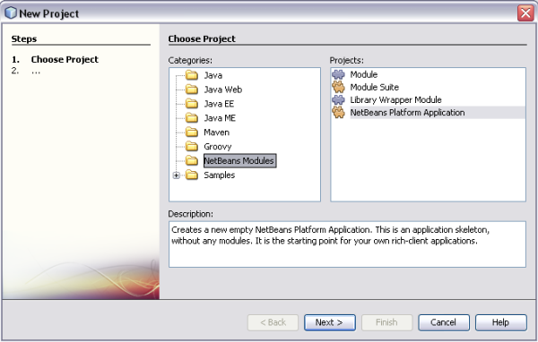
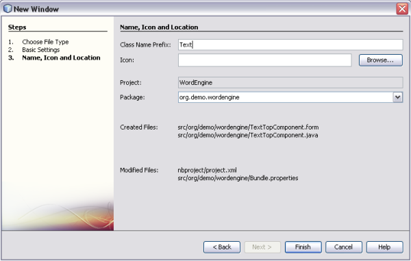
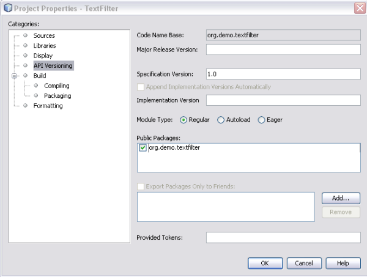
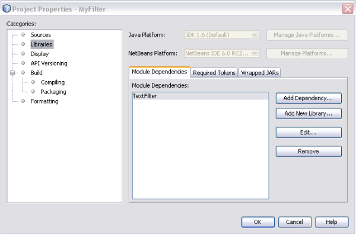
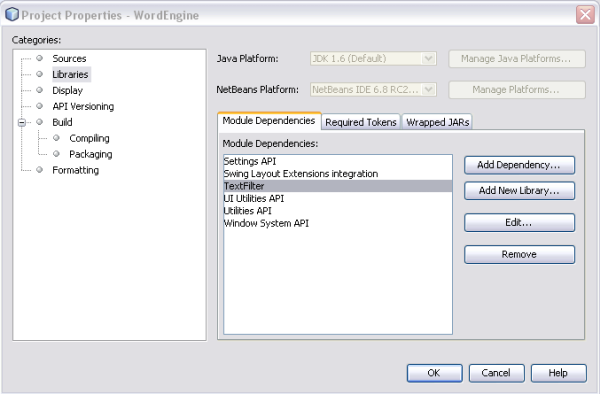
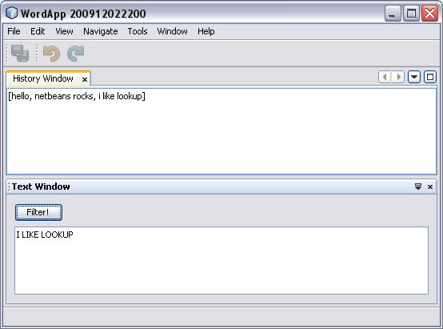

// 
//     Licensed to the Apache Software Foundation (ASF) under one
//     or more contributor license agreements.  See the NOTICE file
//     distributed with this work for additional information
//     regarding copyright ownership.  The ASF licenses this file
//     to you under the Apache License, Version 2.0 (the
//     "License"); you may not use this file except in compliance
//     with the License.  You may obtain a copy of the License at
// 
//       http://www.apache.org/licenses/LICENSE-2.0
// 
//     Unless required by applicable law or agreed to in writing,
//     software distributed under the License is distributed on an
//     "AS IS" BASIS, WITHOUT WARRANTIES OR CONDITIONS OF ANY
//     KIND, either express or implied.  See the License for the
//     specific language governing permissions and limitations
//     under the License.
//

= NetBeans 平台快速入门
:jbake-type: platform_tutorial
:jbake-tags: tutorials 
:jbake-status: published
:syntax: true
:source-highlighter: pygments
:toc: left
:toc-title:
:icons: font
:experimental:
:description: NetBeans 平台快速入门 - Apache NetBeans
:keywords: Apache NetBeans Platform, Platform Tutorials, NetBeans 平台快速入门

欢迎使用  link:https://netbeans.apache.org/platform/[*NetBeans 平台*]！

NetBeans 平台的主要优点是其模块化体系结构。其他优点还有 NetBeans 平台所依赖的 Swing UI 工具包（使用 Java 创建用户界面的正式工具包）以及 NetBeans IDE 屡获殊荣的 "Matisse" GUI 生成器。

在本快速入门教程中，我们将通过一个非常简单的示例向您介绍模块化的优点和使用情况，此示例由目前就读于奥地利林茨市 Johannes Kepler 大学的博士生 Thomas Würthinger 提供。在了解本快速入门教程中所介绍的概念后，您便可以参阅  link:https://netbeans.apache.org/kb/docs/platform_zh_CN.html[NetBeans 平台学习资源]，其中为许多与 NetBeans 平台相关的不同方案提供了各种非常丰富的教程。

如果您不熟悉 NetBeans 平台，强烈建议您观看截屏视频系列  link:https://netbeans.apache.org/tutorials/nbm-10-top-apis.html[Top 10 NetBeans APIs]（最主要的 10 个 NetBeans API）。

*注意：*虽然 NetBeans 平台是一个独立的产品，但无需单独下载该平台。通常，您可以在 NetBeans IDE 中开发应用程序，然后排除特定于 IDE 但对应用程序来说是多余的模块。

== 包含单个模块的 NetBeans 平台应用程序

首先，我们只是创建一个包含单个模块的新 NetBeans 平台应用程序。

[start=1]
1. 选择“文件”|“新建项目”，然后选择“NetBeans 模块”。选择“NetBeans 平台应用程序”。您应看到如下所示的内容：

单击“下一步”。

[start=2]
1. 将新应用程序命名为 "WordApp"，并使其成为 IDE 的主项目：

image::images/quickstart-platform_wordapp02.png[]

当调用全局项目命令“运行项目”时，将启动 IDE 主项目。

单击“完成”。

[start=3]
1. 在“项目”窗口中展开新应用程序，右键单击“模块”节点，然后选择“添加新模块”。将新模块命名为 "WordEngine"：

image::images/quickstart-platform_wordapp03.png[]

单击“下一步”。

[start=4]
1. 为模块指定一个唯一的名称（即其代码名称基）以及将显示在“项目”窗口中的名称。

image::images/quickstart-platform_wordapp04.png[]

单击“完成”。将创建新模块，并在“项目”窗口中显示其结构。

[start=5]
1. 右键单击 "WordEngine" 模块，然后选择“新建”|“其他”。在“模块开发”类别中，选择“窗口组件”：

image::images/quickstart-platform_wordapp05.png[]

单击“下一步”。现在，您应看到如下所示的内容：

image::images/quickstart-platform_wordapp06.png[]

单击“下一步”。

[start=6]
1. 将“类名前缀”设置为 "Text"，并将“包”设置为 "org.demo.wordengine"。

单击“完成”。在模块的源结构中添加新窗口以及一些附属 XML 文件。

[start=7]
1. 现在，双击 "TextTopComponent.java" 文件，以在 "Matisse" GUI 生成器的“设计”视图中将其打开。使用“组件面板”(Ctrl-Shift-8) 将一个按钮和一个文本区域拖放到窗口中：

image::images/quickstart-platform_wordapp15.png[]

右键单击文本区域，选择“更改变量名称”，然后将其命名为 "text"。这是您从代码中访问该组件时所用的名称。将按钮文本设置为 "Filter!"。

[start=8]
1. 双击该按钮，在源代码编辑器中自动创建一个事件处理方法。在单击按钮时，将会调用此方法。将此方法的主体更改为以下代码。

[source,java]
----

private void jButton1ActionPerformed(java.awt.event.ActionEvent evt) {
   String s = text.getText();
   s = s.toUpperCase();
   text.setText(s);
}
----

[start=9]
1. 右键单击该应用程序，然后选择“运行”。此操作将启动新的 NetBeans 平台应用程序并安装模块。新应用程序应如下所示：

image::images/quickstart-platform_wordapp08.png[]

[start=10]
1. 选择“窗口”| "Text"（文本），在文本区域中输入一些文本，然后单击 "Filter!"。此时，您应看到文本将以大写字母显示：

image::images/quickstart-platform_wordapp09.png[]

您已经学习了如何创建新的 NetBeans 平台应用程序以及如何向其中添加新模块。

== 使用 Lookup 的模块化应用程序

我们将另外创建两个模块。第一个新模块会定义一个服务，第二个模块会把该服务提供给前一部分所定义的模块。

[start=1]
1. 在“项目”窗口中展开新应用程序，右键单击“模块”节点，然后选择“添加新模块”。将新模块命名为 "TextFilter"，并指定 "org.demo.textfilter" 作为其代码名称基，然后按照前一部分中的操作完成向导步骤，该向导会将模块添加到先前创建的应用程序中。

[start=2]
1. 右键单击 "TextFilter" 模块，然后选择“新建”|“Java 接口”。将该 Java 接口命名为 "TextFilter"，在“包”中选择 "org.demo.textfilter"，然后使用编辑器对其进行如下定义：

[source,java]
----

package org.demo.textfilter;

public interface TextFilter {

    String process(String s);

}
    
----

[start=3]
1. 右键单击 "TextFilter" 模块，选择“属性”，然后使用“API 版本控制”标签指定包含接口的包应当可以在整个应用程序中使用。

[start=4]
1. 创建应用程序的第三个模块，将其命名为 "MyFilter"，并指定 "org.demo.myfilter" 作为其代码名称基。

[start=5]
1. 在新创建的 "MyFilter" 模块的“项目属性”对话框中，添加对 "TextFilter" 模块的依赖关系：

[start=6]
1. 由于上面定义的依赖关系，您现在可以实现在第二个模块中定义的接口：

[source,java]
----

package org.demo.myfilter;

import org.demo.textfilter.TextFilter;

@ServiceProvider(service=TextFilter.class)
public class UpperCaseFilter implements TextFilter {

    public String process(String s) {
        return s.toUpperCase();
    }

}
----

在编译时，@ServiceProvider 标注将创建 META-INF/services 文件夹并包含一个文件，该文件按照 JDK 6 ServiceLoader 机制注册 TextFilter 接口实现。您需要设置对实用程序 API 模块的依赖关系，该模块提供 ServiceProvider 标注。

[start=7]
1. 现在需要更改处理过滤按钮单击操作的代码，以便查找并装入接口 "TextFilter" 的实现程序。在找到此实现程序后，将对其调用以过滤文本。

我们需要先在 "WordEngine" 模块的“项目属性”对话框中添加对 "TextFilter" 模块的依赖关系，然后才能执行此操作。

现在，您可以装入 "TextFilter" 类的实现，如下所示：

[source,java]
----

private void jButton1ActionPerformed(java.awt.event.ActionEvent evt) {
    String s = text.getText();
    *TextFilter filter = Lookup.getDefault().lookup(TextFilter.class)*;
    if (filter != null) {
	 s = filter.process(s);
    }
    text.setText(s);
}
----

以上代码操作可通过 JDK 6 "ServiceLoader" 类完成，只是 "Lookup" 类可以用在 JDK 6 以前的 JDK 中。此外，"Lookup" 类还有许多附加功能，我们将在下一部分进行说明。

现在，您可以运行代码，并检查是否和以前一样可以正常运行。虽然功能相同，但新的模块化设计将图形用户界面和过滤器实现进行了更明确的划分。新应用程序还可以非常轻松地实现扩展，只需向应用程序的类路径中添加新服务提供程序即可。

作为练习，您可以更改代码，以便对文本连续应用找到的所有文本过滤器（使用方法 "lookupAll"）。例如，添加一个删除所有空格的文本过滤器实现，然后测试最终的应用程序。

== LookupListener 和 InstanceContent

我们将创建第四个模块，该模块在我们单击第一个模块中的 "Filter!" 按钮时会动态接收文本。

[start=1]
1. 在第一个模块中，更改 "TextTopComponent" 的构造函数，如下所示：*private InstanceContent content;*

[source,java]
----

private TextTopComponent() {
    initComponents();
    setName(NbBundle.getMessage(TextTopComponent.class, "CTL_TextTopComponent"));
    setToolTipText(NbBundle.getMessage(TextTopComponent.class, "HINT_TextTopComponent"));
//        setIcon(Utilities.loadImage(ICON_PATH, true));

    *content = new InstanceContent();
    associateLookup(new AbstractLookup(content));*

}
----

[start=2]
1. 更改过滤按钮的代码，以便在单击该按钮时，旧值将被添加到  ``InstanceContent``  对象中。

[source,java]
----

private void jButton1ActionPerformed(java.awt.event.ActionEvent evt) {
    String s = text.getText();
    TextFilter filter = Lookup.getDefault().lookup(TextFilter.class);
    if (filter != null) {
        *content.add(s);*
        s = filter.process(s);
    }
    text.setText(s);
}
----

[start=3]
1. 创建一个名为 "History" 的新模块，并指定 "com.demo.history" 作为其代码名称基。

[start=4]
1. 在 "History" 模块的 "com.demo.history" 包中，创建一个前缀为 "History" 的新窗口组件。指定此组件应该显示在 "editor" 位置。在创建该窗口后，向其中添加一个文本区域。将该文本区域的变量名称更改为 "historyText"。

[start=5]
1. 向 HistoryTopComponent 类的构造函数中添加一些代码，使其侦听当前活动窗口  ``String``  类的 lookup 事件。该代码会在文本区域中显示检索到的所有  ``String``  对象：*private Lookup.Result result;*

[source,java]
----

private HistoryTopComponent() {

    ...

    *result = org.openide.util.Utilities.actionsGlobalContext().lookupResult(String.class);
    result.addLookupListener(new LookupListener() {
        public void resultChanged(LookupEvent e) {
            historyText.setText(result.allInstances().toString());
        }
    });*
}
----

[start=6]
1. 然后，您可以启动应用程序并进行试用。结果应与以下屏幕快照中的所示类似：

作为练习，您可以将查找结果的类型由  ``String``  更改为  ``Object`` ，然后查看当选择不同的窗口时会发生什么情况。

恭喜！至此，您已经使用非常少的编码工作创建了一个模块化应用程序的小示例：

image::images/quickstart-platform_wordapp14.png[]

此应用程序包含 4 个模块。当满足下列条件时，一个模块中的代码才能被另一个模块使用：(1) 第一个模块明确公开了包，并且 (2) 第二个模块设置了对第一个模块的依赖关系。这样，NetBeans 平台就可以帮助您以严格的模块化体系结构组织代码，从而确保仅在提供代码的模块之间设置了约定时才可重用代码，否则不能随意重用。

此外，还引入了  ``Lookup``  类作为模块间通信的一种机制，该类是 JDK 6 ServiceLoader 方法的扩展。实现是通过其接口装入的。无需使用实现的任何代码，"WordEngine" 模块便能显示实现程序所提供的服务。NetBeans 平台应用程序就是以此方式提供松散耦合的。

要继续学习模块化和 NetBeans 平台相关知识，请参见包含 4 个部分的“NetBeans 平台选择管理”系列（ link:https://netbeans.apache.org/tutorials/nbm-selection-1.html[从此处开始]）。之后，可参阅  link:https://netbeans.apache.org/kb/docs/platform_zh_CN.html[NetBeans 平台学习资源]，您可以在其中选择与您的特定业务方案最相关的教程。此外，如果您有与 NetBeans 平台相关的任何类型的问题，可随时写信至邮件列表 dev@platform.netbeans.org，其相关归档位于 link:https://mail-archives.apache.org/mod_mbox/netbeans-dev/[此处]。

祝您使用 NetBeans 平台愉快，并期待着您的来信！

