// 
//     Licensed to the Apache Software Foundation (ASF) under one
//     or more contributor license agreements.  See the NOTICE file
//     distributed with this work for additional information
//     regarding copyright ownership.  The ASF licenses this file
//     to you under the Apache License, Version 2.0 (the
//     "License"); you may not use this file except in compliance
//     with the License.  You may obtain a copy of the License at
// 
//       http://www.apache.org/licenses/LICENSE-2.0
// 
//     Unless required by applicable law or agreed to in writing,
//     software distributed under the License is distributed on an
//     "AS IS" BASIS, WITHOUT WARRANTIES OR CONDITIONS OF ANY
//     KIND, either express or implied.  See the License for the
//     specific language governing permissions and limitations
//     under the License.
//

= Создание приложения CRUD на платформе NetBeans с помощью Maven
:jbake-type: platform_tutorial
:jbake-tags: tutorials 
:jbake-status: published
:syntax: true
:source-highlighter: pygments
:toc: left
:toc-title:
:icons: font
:experimental:
:description: Создание приложения CRUD на платформе NetBeans с помощью Maven - Apache NetBeans
:keywords: Apache NetBeans Platform, Platform Tutorials, Создание приложения CRUD на платформе NetBeans с помощью Maven

Добро пожаловать в  link:https://netbeans.apache.org/platform/[*платформу NetBeans*]!

В этом документе описано использование платформы построения Maven для создания простого приложения на платформе NetBeans, позволяющего выполнять операции чтения и записи в базу данных. В этом документе для создания приложения и модуля на платформе NetBeans будут использоваться архетипы Maven, а для создания оконных компонентов - инструментарий Swing UI и конструктор графического интерфейса пользователя Matisse.

Этот документ основан на  link:nbm-crud_ru.html[Учебном курсе по созданию приложения CRUD на платформе NetBeans] на базе Ant и описывает различия между Ant и Maven при создании приложений на платформе NetBeans. После изучения отличий Maven от Ant можно легко пройти другие учебные курсы в  link:https://netbeans.apache.org/kb/docs/platform_ru.html[Учебной карте по платформе NetBeans].

Пример приложения CRUD является одним из примеров Maven, доступных в мастере создания проекта.

При отсутствии опыта работы с платформой NetBeans можно посмотреть серию демонстрационных роликов  link:https://netbeans.apache.org/tutorials/nbm-10-top-apis.html[10 лучших интерфейсов API NetBeans].

*Содержимое*

* <<config,Настройка Maven>>
* <<01,Создание проекта приложения на платформе NetBeans>>
* <<01b,Создание модуля>>
* <<01c,Добавление модуля в качестве зависимости>>
* <<01d,Брэндинг приложения>>
* <<02,Создание классов сущностей>>
* <<02a,Добавление модуля Derby Client в качестве зависимости>>
* <<02b,Создание классов сущностей из базы данных>>
* <<03,Чтение: считывание и вывод записи>>
* <<03b,Добавление древовидного представления к операционной системе Windows>>
* <<03c,Создание класса фабрики>>
* <<03d,Изменение зависимостей>>
* <<04,Обновление: изменение записи>>
* <<04b,Использование LookupListener>>
* <<04c,Добавление функций "Отменить" и "Вернуть">>
* <<04d,Добавление функции "Сохранить">>
* <<04e,Сохранение изменений>>
* <<04f,Добавление функции "Обновить">>
* <<05,Создание: добавление новой записи>>
* <<05b,Создание и сохранение нового объекта>>
* <<06,Запуск приложения>>

*Для работы с этим учебным курсом требуется программное обеспечение и ресурсы, перечисленные в следующей таблице.*

NOTE: 

* Сервер базы данных JavaDB и демонстрационная база данных поставляются вместе со встроенным сервером приложений GlassFish Server Open Source Edition 3.0.1.
* Для разработки приложений на платформе NetBeans не требуется загружать отдельную версию этой платформы. Как правило, разработка приложений и модулей осуществляется в среде IDE NetBeans, затем необходимо просто включить требуемые модули для выполнения платформы NetBeans и созданного приложения.

Перед изучением этого учебного курса можно ознакомиться со следующей документацией:

*  link:http://wiki.netbeans.org/MavenBestPractices[Практические рекомендации по Apache Maven в NetBeans 6.x];
*  link:http://www.sonatype.com/books/maven-book/reference/introduction.html[Глава 1. Введение в Apache Maven] (из книги  link:http://www.sonatype.com/books/maven-book/reference/public-book.html[Maven: полное руководство])
*  link:https://netbeans.apache.org/kb/docs/java/gui-functionality_ru.html[Введение в разработку графического интерфейса ]

== Настройка Maven

Если это первый опыт работы с Maven, следует проверить параметры настройки Maven в окне "Параметры". Для работы с этим учебным курсом необходимо установить Maven на локальный компьютер. Программу установки можно загрузить с  link:http://maven.apache.org/[сайта Maven].

[start=1]
1. Выберите категорию "Разное" в окне "Параметры" и перейдите на вкладку Maven.

[start=2]
1. Укажите папку установки Maven (требуется версия 2.0.9 или более поздняя).

[start=3]
1. Проверьте корректность адреса к локальному репозиторию Maven.

[start=4]
1. Нажмите кнопку "ОК".

В большинстве случаев при использовании типичной настройки Maven данные в окне "Параметры" уже корректны.

Maven SCM используется в среде IDE для проверки артефактов Maven. Может потребоваться проверка факта установки всех необходимых клиентов для проверки исходных файлов на локальном компьютере и корректности их настройки.

Дополнительные сведения о Maven SCM приведены на  link:http://maven.apache.org/scm/index.html[странице Maven SCM].

=== Просмотр репозиториев Maven

Артефакты, используемые Maven для создания всех проектов, сохраняются в локальном репозитории Maven. Если артефакт объявлен как зависимость проекта, он загружается в локальный репозиторий из одного из зарегистрированных удаленных репозиториев.

Репозиторий NetBeans и некоторые известные индексированные репозитории Maven зарегистрированы и включены в список окна "Обозреватель репозитория" по умолчанию. Репозиторий NetBeans содержит большинство общедоступных артефактов, требуемых для создания проекта. Обозреватель репозиториев Maven можно использовать для просмотра содержимого локальных и удаленных репозиториев. Для просмотра локальных артефактов разверните узел "Локальный репозиторий". Артефакты, указанные в узлах удаленного репозитория, могут быть добавлены в качестве зависимостей проекта, однако не все из них представлены локально. Они добавляются к локальному репозиторию только в том случае, если объявляются в качестве зависимостей проекта.

Чтобы открыть обозреватель репозиториев Maven:

* выберите в главном меню "Окно" > "Прочее" > "Обозреватель репозиториев Maven".

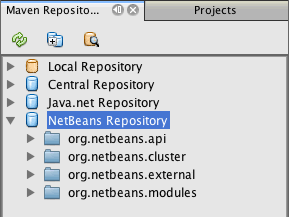

Когда курсор находится над артефактом, среда IDE отображает всплывающую подсказку с координатами артефакта. Посмотреть дополнительные сведения об артефакте можно с помощью двойного щелчка по файлу JAR артефакта в обозревателе.

Чтобы выполнить поиск артефакта, нажмите кнопку "Найти" на панели инструментов обозревателя репозиториев Maven или используйте текстовое поле "Быстрый поиск" на главной панели инструментов.

Подробные сведения об управлении зависимостями путей классов Maven и работе с репозиториями Maven в среде IDE приведены в разделе  link:http://wiki.netbeans.org/MavenBestPractices#Dependency_management[Управление зависимостями] курса  link:http://wiki.netbeans.org/MavenBestPractices[Практические рекомендации по Apache Maven в NetBeans 6.x].

Для просмотра видеоролика по использованию Artifact Viewer обратитесь к демонстрации  link:https://netbeans.apache.org/kb/docs/java/maven-dependencies-screencast.html[Работа с зависимостями Maven].

== [[Создание проекта приложения на платформе NetBeans]] 

В этом разделе для построения приложения на платформе NetBeans из архетипа Maven используется мастер создания проекта. Этот мастер создает проекты модуля Maven, требуемые для разработки приложения на платформе NetBeans. Модуль на платформе NetBeans создается также с помощью мастера создания проекта.

=== Создание проекта

Чтобы создать приложение на платформе NetBeans с помощью мастера создания проекта, выполните следующие действия:

[start=1]
1. Выберите в меню "Файл" команду "Новый проект" (CTRL+SHIFT+N), чтобы открыть мастер создания проекта.

[start=2]
1. Выберите приложение Maven NetBeans из категории Maven. Нажмите кнопку "Далее".

[start=3]
1. В поле "Имя проекта" введите *MavenPlatformCRUDApp* и укажите местоположение проекта. Нажмите кнопку "Готово".

NOTE:  При построении приложения на платформе можно нажать кнопку "Далее" и создать проект модуля в мастере создания проекта, однако для наглядности в данном учебном курсе приложение и модуль создаются отдельно.

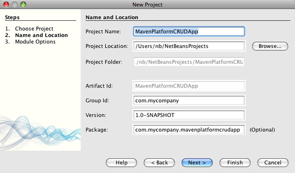

При нажатии кнопки "Готово" в среде IDE по умолчанию создаются следующие типы проектов Maven.

* *Приложение на платформе NetBeans.* Данный проект является проектом-контейнером для приложения на платформе. В нем перечисляются включаемые модули и местоположения репозиториев проекта. Данный проект не содержит исходных файлов. В среде IDE создаются модули, содержащие исходные файлы и ресурсы в подкаталогах проекта.
* *Приложение на базе платформы NetBeans.* В данном проекте указываются артефакты (исходные файлы), требуемые для компиляции приложения. Необходимые зависимости (артефакты среды IDE, артефакты модуля) указываются в файле проекта  ``pom.xml`` .
* *Ресурсы брэндинга приложения на платформе.* Этот проект содержит ресурсы, используемые для брэндинга приложения.

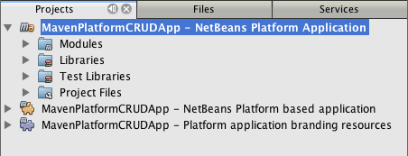

*Примечания.*

* Первое создание приложения платформы NetBeans с использованием Maven может занять некоторое время, поскольку среде IDE требуется загрузить все необходимые артефакты из репозитория NetBeans.
* После создания этого проекта некоторые из проектов (например, проект приложения на базе платформы NetBeans) отмечаются значком, так как некоторые зависимости в файле  ``pom.xml``  недоступны.

=== [[Создание модуля]] 

В этом упражнении будет использоваться мастер создания проекта для создания модуля на платформе NetBeans.

[start=1]
1. Выберите в меню "Файл" команду "Новый проект" (CTRL+SHIFT+N), чтобы открыть мастер создания проекта.

[start=2]
1. Выберите модуль Maven NetBeans из категории Maven. Нажмите кнопку "Далее".

[start=3]
1. В поле "Имя проекта" введите *MavenPlatformCRUDApp-dbaccess*.

[start=4]
1. Укажите местоположение проекта, нажав кнопку "Обзор" и выбрав каталог *MavenPlatformCRUDApp*. Нажмите кнопку "Открыть".
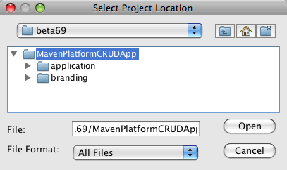

[start=5]
1. Нажмите кнопку "Готово".

После нажатия кнопки "Готово" мастер создает проект модуля на платформе NetBeans с именем *MavenPlatformCRUDApp-dbaccess*. При сохранении модуля в подкаталоге он автоматически включается в приложение. При открытии POM проекта MavenPlatformCRUDApp объявляется как вышестоящий проект.

[source,xml]
----

<parent>
    <artifactId>MavenPlatformCRUDApp</artifactId>
    <groupId>com.mycompany</groupId>
    <version>1.0-SNAPSHOT</version>
</parent>
<artifactId>MavenPlatformCRUDApp-dbaccess</artifactId>
<packaging>nbm</packaging>
<version>1.0-SNAPSHOT</version>
<name>MavenPlatformCRUDApp - dbaccess NetBeans Module</name>

----

Можно изменить отображаемое имя модуля, изменив элемент  ``<name>``  в POM или в окне проекта "Свойства". Отображаемое имя, заданное по умолчанию, - идентификатор артефакта проекта  ``MavenPlatformCRUDApp-dbaccess`` .

Обратите внимание на POM приложения на платформе NetBeans в узле "Файлы проекта" в окне "Проекты": в качестве модулей приложения приводятся три модуля.

[source,xml]
----

<modules>
   <module>branding</module>
   <module>application</module>
   <module>MavenPlatformCRUDApp-dbaccess</module>
</modules>

----

=== Добавление модуля в качестве зависимости

Теперь необходимо добавить модуль как зависимость приложения на базе платформы NetBeans. Зависимость можно добавить, изменив в редакторе файл  ``pom.xml``  или используя диалоговое окно "Добавить зависимость".

[start=1]
1. Разверните в окне "Проекты" узел *Приложение на базе платформы NetBeans*.

[start=2]
1. Щелкните узел "Библиотеки" правой кнопкой мыши и выберите команду "Добавить зависимость".

[start=3]
1. Щелкните вкладку "Открыть проекты" и выберите *MavenPlatformCRUDApp - dbaccess*. Нажмите кнопку "ОК".
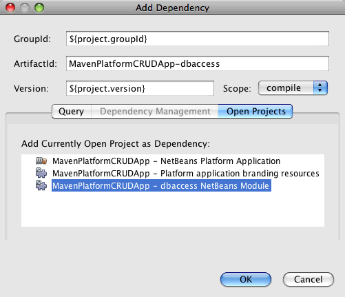

Разверните в окне "Проекты" узел "Библиотеки" приложения на базе платформы NetBeans: теперь MavenPlatformCRUDApp-dbaccess приводится как зависимость.

Обратите внимание на POM приложения на базе платформы NetBeans: артефакт модуля  ``MavenPlatformCRUDApp-dbaccess``  приводится как зависимость, требуемая для компиляции приложения. Данный артефакт будет доступен после создания проекта модуля и установки артефакта в локальный репозиторий.

[source,xml]
----

<dependency>
    <groupId>${project.groupId}</groupId>
    <artifactId>*MavenPlatformCRUDApp-dbaccess*</artifactId>
    <version>${project.version}</version>
</dependency>
----

=== Брэндинг приложения

В модуле брэндинга указываются ресурсы брэндинга, используемые для построения приложения на платформе. В диалоговом окне брэндинга можно простым образом указать имя, заставку и значок приложения, а также изменить значения текстовых элементов.

В этом упражнении будет выполнена замена изображения заставки, заданного по умолчанию. Модуль брэндинга, созданный средой IDE по умолчанию, содержит изображение, выводимое при запуске приложения на платформе. Чтобы заменить это изображение другим, выполните следующие действия:

[start=1]
1. В окне "Проекты" щелкните правой кнопкой мыши модуль *Ресурсы брэндинга приложения на платформе* и выберите команду "Брэндинг".

[start=2]
1. На вкладке "Заставка" укажите изображение для заставки, нажав кнопку "Обзор" рядом с изображением заставки, заданным по умолчанию, и указав местоположение требуемого изображения. Нажмите кнопку "ОК".

Например, можно скопировать изображение, приведенное ниже, на локальный компьютер и указать его в диалоговом окне "Брэндинг".

Новое изображение появится при запуске приложения.

== Создание классов сущностей

В этом разделе будет создано несколько классов сущностей из таблиц в базе данных Java DB. Чтобы создать классы сущностей и использовать в приложении интерфейс API Java Persistence (JPA), необходимо иметь доступ к серверу базы данных и библиотекам поставщика сохранения состояния JPA. В данном учебном курсе используется сервер базы данных Java DB, однако для работы с приложением можно настроить другой сервер базы данных.

Сделать ресурсы доступными проще всего, зарегистрировав экземпляр сервера приложений GlassFish Server Open Source Edition 3.0.1, поставляемый в составе среды IDE. Сервер базы данных Java DB, демонстрационная база данных и поставщик сохранения состояния JPA поставляются вместе с сервером GlassFish. Перед созданием классов сущностей запустите Java DB, выполнив следующие действия:

[start=1]
1. В окне "Службы" разверните узел "Серверы" и убедитесь в том, что экземпляр сервера приложений GlassFish зарегистрирован.

[start=2]
1. Разверните узел базы данных, щелкните правой кнопкой мыши узел подключения к базе данных*app* на Java DB  ``jdbc:derby://localhost:1527/sample [app on APP]``  и выберите команду "Подключить".

При нажатии кнопки "Подключить" среда IDE запускает базу данных, если она еще не запущена.

=== [[Добавление модуля Derby Client в качестве зависимости]] 

В этом разделе в качестве зависимости будет добавлена библиотека derbyclient-10.5.3.0_1.

[start=1]
1. Щелкните правой кнопкой мыши узел "Библиотеки" модуля *dbaccess* и выберите команду "Добавить зависимость".

[start=2]
1. Чтобы добавить библиотеку, введите *org.apache.derby* в поле "Имя группы", *derbyclient* в поле "Имя артефакта" и *10.5.3.0_1* в поле "Имя версии".

[start=3]
1. Выберите в контекстном меню "Область действия" команду *Выполнить*. Нажмите кнопку "ОК".
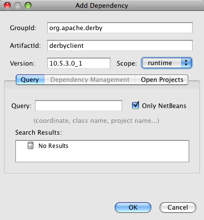

Разверните узел "Библиотеки выполнения" в окне "Проекты": библиотека  ``derbyclient``  приводится в качестве зависимости.

Также в редакторе можно изменить POM, чтобы указать значение элемента  ``<scope>``  зависимости.

[source,xml]
----

<dependency>
            <groupId>org.apache.derby</groupId>
            <artifactId>derbyclient</artifactId>
            <version>10.5.3.0_1</version>
            <scope>runtime</scope>
        </dependency>
----

=== Создание классов сущностей из базы данных

В этом разделе будет использоваться мастер для создания классов сущностей в модуле *dbaccess*.

[start=1]
1. Щелкните правой кнопкой мыши узел "Исходные файлы" модуля *dbaccess* и выберите "Создать" > "Прочее".

[start=2]
1. Выберите классы сущностей из базы данных в категории "Сохранение состояния". Нажмите кнопку "Далее".

[start=3]
1. Выберите демонстрационную базу данных Java DB в контекстном меню "Соединение с базой данных".

[start=4]
1. Выберите таблицу Customer из списка "Доступные таблицы" и нажмите кнопку "Добавить". При нажатии кнопки "Добавить" связанная таблица DiscountCode также добавляется в список "Выбранные таблицы". Нажмите кнопку "Далее".

[start=5]
1. В поле "Имя пакета" введите *com.mycompany.mavenplatformcrudapp.dbaccess*. Убедитесь, что команды "Создать единицу сохранения состояния" и "Создать аннотации именованных запросов" выбраны. Нажмите кнопку "Готово".

При нажатии кнопки "Готово" среда IDE создает классы сущностей Customer и DiscountCode. Также среда IDE создает файл  ``persistence.xml``  в пакете  ``META-INF``  в узле "Другие источники" в каталоге  ``src/main/resources`` .

== Чтение: считывание и вывод записи

В этом разделе будет использоваться мастер для добавления оконного компонента в модуль *dbaccess*. Чтобы просмотреть объекты как узлы, настройте в оконном компоненте древовидное представление. В окне свойств узла можно просмотреть данные по каждой записи.

=== Добавление оконного компонента

В этом упражнении будет создан оконный компонент.

[start=1]
1. В окне "Проекты" щелкните правой кнопкой мыши узел проекта и выберите "Создать" > "Оконный компонент".

[start=2]
1. Задайте в контекстном меню "Позиция окна" значение *editor* и установите флажок *Открывать при запуске приложения*. Нажмите кнопку "Далее".
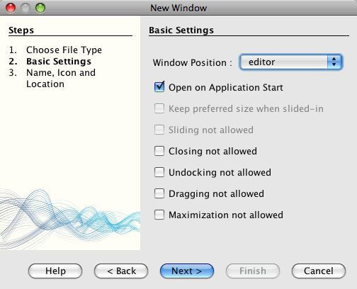

[start=3]
1. В качестве префикса имени класса введите *Customer*.

[start=4]
1. В поле "Имя пакета" введите *com.mycompany.mavenplatformcrudapp.viewer*. Нажмите кнопку "Готово".

В мастере отображается список файлов, которые нужно создать или изменить.

При нажатии кнопки "Готово" в окне "Проекты" отображается класс  ``CustomerTopComponent.java`` , созданный средой IDE в  ``com.mycompany.mavenplatformcrudapp.viewer``  в узле "Исходные файлы". В окне "Файлы" можно просмотреть структуру проекта. Для компиляции проекта Maven в узле "Папка с исходными файлами" могут находиться только исходные файлы (каталог  ``src/main/java``  в окне "Файлы"). Файлы ресурсов (например, файлы XML) должны быть расположены в узле "Другие источники" (каталог  ``src/main/resources``  в окне "Файлы").

=== Добавление древовидного представления

Теперь можно изменить оконный компонент, чтобы отобразить записи базы данных в древовидной структуре. Можно добавить в конструктор диспетчер сущностей и включить древовидное представление компонентов.

[start=1]
1. Для просмотра исходного кода в редакторе перейдите на вкладку "Исходный код" в  ``CustomerTopComponent.java`` .

[start=2]
1. Измените конструктор, добавив следующие элементы:

[source,java]
----

public CustomerTopComponent() {
    initComponents();
    setName(NbBundle.getMessage(CustomerTopComponent.class, "CTL_CustomerTopComponent"));
    setToolTipText(NbBundle.getMessage(CustomerTopComponent.class, "HINT_CustomerTopComponent"));
//        setIcon(ImageUtilities.loadImage(ICON_PATH, true));

    *EntityManager entityManager = Persistence.createEntityManagerFactory("com.mycompany_MavenPlatformCRUDApp-dbaccess_nbm_1.0-SNAPSHOTPU").createEntityManager();
    Query query = entityManager.createQuery("SELECT c FROM Customer c");
    List<Customer> resultList = query.getResultList();*
}
----

Убедитесь, что имя единицы сохранения состояния в коде корректно, сравнив его с именем, указанным в файле  ``persistence.xml`` .

[start=3]
1. Измените сигнатуру класса для реализации элемента  ``ExplorerManager.Provider.`` 

[source,java]
----

final class CustomerTopComponent extends TopComponent *implements ExplorerManager.Provider*
----

[start=4]
1. Исправьте операторы импорта для импорта  ``*javax.persistence.Query*``  и  ``*javax.util.List*`` .

[start=5]
1. Объявите и инициализируйте ExplorerManager:

[source,java]
----

private static ExplorerManager em = new ExplorerManager();
----

[start=6]
1. Реализуйте абстрактные методы и измените метод  ``getExplorerManager``  для возврата  ``em`` .

[source,java]
----

@Override
public ExplorerManager getExplorerManager() {
    return em;
}
----

Чтобы реализовать абстрактные методы, установите курсор в режиме вставки на сигнатуру класса и нажмите сочетание клавиш ALT+ВВОД.

[start=7]
1. Чтобы включить древовидное представление компонентов, добавьте в конструктор следующие элементы:

[source,java]
----

BeanTreeView beanTreeView = new BeanTreeView();
add(beanTreeView, BorderLayout.CENTER);
----

[start=8]
1. Щелкните компонент правой кнопкой мыши в режиме проектирования и выберите из меню "Установить макет" пункт "Макет с границами". Сохраните изменения.

=== Создание класса фабрики

Теперь можно создать новый класс *CustomerChildFactory* в пакете  ``com.mycompany.mavenplatformcrudapp.viewer`` , создающий новый элемент BeanNode для каждого клиента в базе данных.

[start=1]
1. Щелкните правой кнопкой мыши пакет  ``*com.mycompany.mavenplatformcrudapp.viewer*``  и выберите "Создать" > "Класс Java ".

[start=2]
1. В поле "Имя класса" введите *CustomerChildFactory*. Нажмите кнопку "Готово".

[start=3]
1. Для расширения класса  ``ChildFactory<Customer>``  измените его сигнатуру.

[start=4]
1. Объявите поле  ``resultList``  для списка элементов в таблице и добавьте метод  ``CustomerChildFactory`` .

[source,java]
----

private List<Customer> resultList;

public CustomerChildFactory(List<Customer> resultList) {
    this.resultList = resultList;
}
----

[start=5]
1. Реализуйте и затем измените абстрактный метод  ``createKeys`` .

[source,java]
----

@Override
    protected boolean createKeys(List<Customer> list) {
        for (Customer Customer : resultList) {
            list.add(Customer);
        }
        return true;
    }
----

[start=6]
1. Добавьте метод для создания узлов.

[source,java]
----

@Override
protected Node createNodeForKey(Customer c) {
    try {
        return new BeanNode(c);
    } catch (IntrospectionException ex) {
        Exceptions.printStackTrace(ex);
        return null;
    }
}
----

[start=7]
1. Исправьте операторы импорта для импорта  ``org.openide.nodes.Node``  и  ``java.beans.InstrospectionException`` . Сохраните изменения.

Класс будет выглядеть следующим образом:

[source,java]
----

package com.mycompany.mavenplatformcrudapp.viewer;

import com.mycompany.mavenplatformcrudapp.dbaccess.Customer;
import java.beans.IntrospectionException;
import java.util.List;
import org.openide.nodes.BeanNode;
import org.openide.nodes.ChildFactory;
import org.openide.nodes.Node;
import org.openide.util.Exceptions;

public class CustomerChildFactory extends ChildFactory<Customer> {

    private List<Customer> resultList;

    public CustomerChildFactory(List<Customer> resultList) {
        this.resultList = resultList;
    }

    @Override
    protected boolean createKeys(List<Customer> list) {
        for (Customer customer : resultList) {
            list.add(customer);
        }
        return true;
    }

    @Override
    protected Node createNodeForKey(Customer c) {
        try {
            return new BeanNode(c);
        } catch (IntrospectionException ex) {
            Exceptions.printStackTrace(ex);
            return null;
        }
    }

}
----

Теперь необходимо изменить *CustomerTopComponent*, чтобы использовать ExplorerManager для передачи результатов из запроса JPA в элемент Node.

[start=1]
1. Добавьте следующие строки в конструктор CustomerTopComponent, чтобы установить корневой контекст для узлов и добавить ActionMap элемента TopComponent и ExplorerManager в Lookup элемента TopComponent.

[source,java]
----

    EntityManager entityManager =  Persistence.createEntityManagerFactory("com.mycompany_MavenPlatformCRUDApp-dbaccess_nbm_1.0-SNAPSHOTPU").createEntityManager();
    Query query = entityManager.createQuery("SELECT c FROM Customer c");
    List<Customer> resultList = query.getResultList();
    *em.setRootContext(new AbstractNode(Children.create(new CustomerChildFactory(resultList), true)));
    associateLookup(ExplorerUtils.createLookup(em, getActionMap()));*
----

При этом синхронизируются окно "Свойства" и текст всплывающей подсказки для каждого выбранного узла.

[start=2]
1. Исправьте операторы импорта и сохраните измененные данные.

=== Запуск приложения

В этом упражнении будет выполнена проверка приложения для подтверждения правильности доступа и считывания таблицы базы данных. Перед построением и запуском приложения необходимо изменить POM, так как приложение требует прямой зависимости от файлов JAR  ``org-openide-nodes``  и  ``org-openide-explorer`` . Зависимость можно изменить в окне "Проекты".

[start=1]
1. Разверните узел "Библиотеки" модуля *dbaccess*.

[start=2]
1. Щелкните правой кнопкой мыши файл JAR  ``org-openide-nodes``  и выберите команду "Объявить как прямую зависимость".

[start=3]
1. Щелкните правой кнопкой мыши файл JAR  ``org-openide-explorer``  и выберите команду "Объявить как прямую зависимость".

[start=4]
1. Щелкните правой кнопкой мыши *приложение на базе платформы NetBeans MavenPlatformCRUDApp* и выберите команду "Построить вместе с зависимостями".

В окне "Вывод" отобразятся включаемые модули.

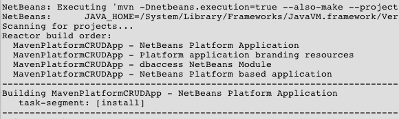

В окне "Вывод" также отображается статус построения.

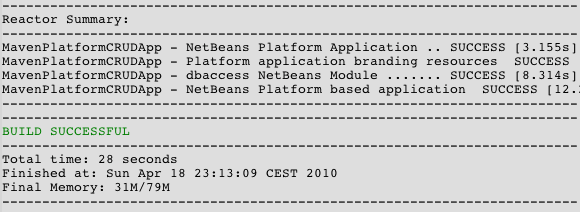

[start=5]
1. Щелкните приложение правой кнопкой мыши и выберите команду "Выполнить".

При запуске приложения появляется окно Customer с узлами для всех записей в таблице базы данных.

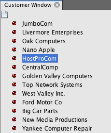

Для просмотра дополнительных сведений о нужном элементе щелкните правой кнопкой мыши его узел в окне Customer и выберите "Свойства".

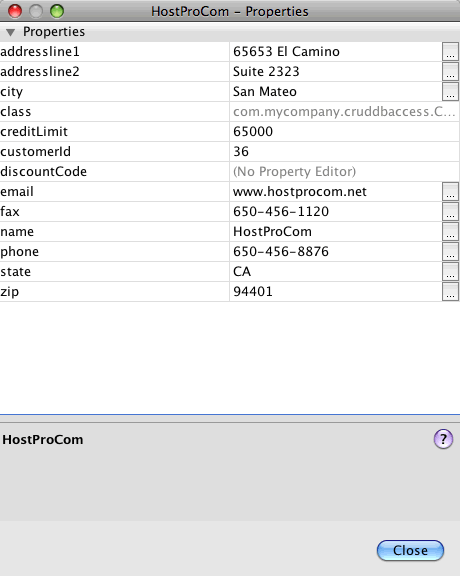

== Обновление: изменение записи

В этом разделе будет добавляться оконный компонент для редактирования подробных сведений записи.

=== Создание окна редактора

В этом упражнении будет создано новое окно MyEditor, содержащее два текстовых поля "Имя" и "Город" для выбранного узла. Затем необходимо изменить файл  ``layer.xml`` , чтобы окно Customer открылось в режиме поиска, а не редактирования.

[start=1]
1. Щелкните модуль *dbaccess* правой кнопкой мыши и выберите "Создать" > "Окно".

[start=2]
1. Выберите в контекстном меню значение *editor* и установите флажок *Открывать при запуске приложения*. Нажмите кнопку "Далее".

[start=3]
1. В качестве префикса имени класса введите *MyEditor*.

[start=4]
1. В поле "Имя пакета" введите *com.mycompany.mavenplatformcrudapp.editor*. Нажмите кнопку "Готово".

[start=5]
1. Добавьте в режиме проектирования компонента  ``MyEditorTopComponent``  две метки JLabel и два поля JTextField.

[start=6]
1. Задайте тексты меток "Имя" и "Город", а затем установите имена переменных полей JTextField равными  ``jTextField1``  и  ``*jTextField2*`` . Сохраните изменения.
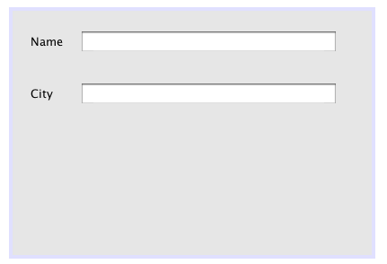

[start=7]
1. В окне "Проекты" разверните узел "Важные файлы" и дважды щелкните подузел *Слой XML*, чтобы открыть в редакторе файл  ``layer.xml`` .

[start=8]
1. Измените файл  ``layer.xml`` , указав в нем, что окно CustomerTopComponent выводится в режиме поиска. Сохраните изменения.

[source,xml]
----

 <folder name="Modes">
    <folder name="editor">
        <file name="MyEditorTopComponent.wstcref" url="MyEditorTopComponentWstcref.xml"/>
    </folder>
    *<folder name="explorer">
        <file name="CustomerTopComponent.wstcref" url="CustomerTopComponentWstcref.xml"/>
    </folder>*
</folder>
            
----

Теперь можно протестировать приложение, чтобы проверить, как отрываются окна и правильно ли они расположены.

Не забудьте очистить приложение перед построением вместе с зависимостями.

Теперь можно добавить код, чтобы при выборе узла в окне Customer поля "Имя" и "Город" объекта отображались в редакторе.

=== Использование LookupListener

В этом упражнении будет изменено окно Customer, чтобы при выборе узла новый объект  ``Customer``  добавлялся в Lookup элемента Node. Затем будет изменен элемент MyEditor, чтобы в этом окне реализовался элемент  `` link:http://bits.netbeans.org/dev/javadoc/org-openide-util-lookup/org/openide/util/LookupListener.html[LookupListener]``  для прослушивания объектов  ``Customer`` , добавленных в Lookup.

[start=1]
1. Измените метод  ``createNodeForKey``  в элементе *CustomerChildFactory*, чтобы создать  ``AbstractNode``  вместо  ``BeanNode`` .

[source,java]
----

@Override
protected Node createNodeForKey(Customer c) {
  *Node node = new AbstractNode(Children.LEAF, Lookups.singleton(c));
  node.setDisplayName(c.getName());
  node.setShortDescription(c.getCity());
  return node;*
//        try {
//            return new BeanNode(c);
//        } catch (IntrospectionException ex) {
//            Exceptions.printStackTrace(ex);
//            return null;
//        }
}
----

При выборе нового узла в окне Customer указанный объект  ``Customer``  добавляется в Lookup окна.

[start=2]
1. Перейдите на вкладку "Исходный код" элемента *MyEditorTopComponent* и измените сигнатуру класса, чтобы реализовать  ``LookupListener`` .

[source,java]
----

public final class MyEditorTopComponent extends TopComponent *implements LookupListener*
----

[start=3]
1. Добавьте переменную, чтобы сохранить результаты.

[source,java]
----

private Lookup.Result result = null;
----

[start=4]
1. Реализуйте требуемые абстрактные методы, чтобы добавить метод  ``resultChanged`` .

[start=5]
1. Измените метод  ``resultChanged`` , чтобы обновлять поля jTextField каждый раз при вставке нового объекта  ``Customer``  в окно Lookup.

[source,java]
----

      @Override
      public void resultChanged(LookupEvent le) {
          Lookup.Result r = (Lookup.Result) le.getSource();
          Collection<Customer> coll = r.allInstances();
          if (!coll.isEmpty()) {
              for (Customer cust : coll) {
                  jTextField1.setText(cust.getName());
                  jTextField2.setText(cust.getCity());
              }
          } else {
              jTextField1.setText("[no name]");
              jTextField2.setText("[no city]");
          }
      }

----

После определения элемента LookupListener можно добавить его в  ``Lookup.Result`` , полученный из глобального контекста. Глобальный контекст используется в качестве прокси для контекста выбранного узла. Например, если в древовидной иерархии выбран узел Ford Motor Co, объект  ``Customer``  для него добавляется в окно Lookup элемента Node. Так как в настоящий момент выбран узел Ford Motor Co, объект  ``Customer``  для него доступен сейчас в глобальном контексте. Это передается в элемент  ``resultChanged``  и приводит к заполнению текстовых полей.

[start=6]
1. Измените методы  ``componentOpened``  и  ``componentClosed`` , чтобы активировать LookupListener, когда откроется окно редактора.

[source,java]
----

      @Override
      public void componentOpened() {
          result = WindowManager.getDefault().findTopComponent("CustomerTopComponent").getLookup().lookupResult(Customer.class);
          result.addLookupListener(this);
          resultChanged(new LookupEvent(result));
      }

      @Override
      public void componentClosed() {
          result.removeLookupListener(this);
          result = null;
      }
----

Так как окно редактора открывается при запуске приложения, элемент LookupListener становится тоже доступен в этот момент.

В этом упражнении используется локальное окно Lookup, предоставленное окном Customer. В этом случае окно явно определяется строкой " ``CustomerTopComponent`` ". Строка определяется в исходном коде  ``CustomerTopComponent``  как идентификатор элемента CustomerTopComponent. Данный подход работает только в том случае, если MyEditorTopComponent может найти компонент TopComponent с идентификатором "CustomerTopComponent".

Более гибкий подход, включающий в себя перезапись модели выбора, описывается в  link:http://weblogs.java.net/blog/timboudreau/archive/2007/01/how_to_replace.html[сообщении блога Тима Будро].

После выполнения команды "Очистить и построить вместе с зависимостями" можно повторно запустить приложение. Теперь окно редактора обновляется каждый раз при выборе нового элемента Node в окне Customer. Так как теперь вместо  ``BeanNode``  используется  ``AbstractNode`` , в окне "Свойства" нет свойств.

=== Добавление функций "Отменить" и "Вернуть"

В этом упражнении с помощью диспетчера  `` link:http://bits.netbeans.org/dev/javadoc/org-openide-awt/org/openide/awt/UndoRedo.html[UndoRedo]``  будут включены функции "Отменить" и "Вернуть". Кнопки "Отменить" и "Вернуть" на панели инструментов и соответствующие пункты меню включаются после изменения одного из полей в окне редактора.

[start=1]
1. Объявите и создайте новый экземпляр диспетчера UndoRedoManager в верхней части компонента MyEditorTopComponent.

[source,java]
----

private UndoRedo.Manager manager = new UndoRedo.Manager();
----

[start=2]
1. Создайте метод  ``getUndoRedo``  в компоненте MyEditorTopComponent:

[source,java]
----

@Override
public UndoRedo getUndoRedo() {
    return manager;
}
----

[start=3]
1. Добавьте в конструктор следующие элементы:

[source,java]
----

jTextField1.getDocument().addUndoableEditListener(manager);
jTextField2.getDocument().addUndoableEditListener(manager);
----

Запустите приложение для проверки правильной работы кнопок "Отменить" и "Вернуть" и соответствующих пунктов меню.

=== Добавление функции "Сохранить"

В этом упражнении будут интегрированы функции сохранения платформы NetBeans. Будет изменен файл ``layer.xml`` , чтобы скрыть кнопку "Сохранить все" и добавить кнопку "Сохранить" на панели инструментов. Затем будут добавлены прослушивающие процессы для определения изменений в текстовых полях и метод  ``fire`` , инициируемый при обнаружении изменения.

[start=1]
1. Откройте и измените файл  ``layer.xml``  модуля *dbaccess*, чтобы добавить элемент панели инструментов.

[source,xml]
----

    *<folder name="Toolbars">
      <folder name="File">
          <file name="org-openide-actions-SaveAction.shadow">
              <attr name="originalFile" stringvalue="Actions/System/org-openide-actions-SaveAction.instance"/>
              <attr name="position" intvalue="444"/>
          </file>
          <file name="org-openide-actions-SaveAllAction.shadow_hidden"/>
      </folder>
    </folder>*
</filesystem>
----

[start=2]
1. В конструкторе *MyEditorTopComponent* добавьте вызов метода при каждом обнаружении изменений в текстовых полях.

[source,java]
----

public MyEditorTopComponent() {

          ...
    jTextField1.getDocument().addUndoableEditListener(manager);
    jTextField2.getDocument().addUndoableEditListener(manager);

    *jTextField1.getDocument().addDocumentListener(new DocumentListener() {
        public void insertUpdate(DocumentEvent arg0) {
          fire(true);
        }
        public void removeUpdate(DocumentEvent arg0) {
          fire(true);
        }
        public void changedUpdate(DocumentEvent arg0) {
          fire(true);
        }
    });

    jTextField2.getDocument().addDocumentListener(new DocumentListener() {
        public void insertUpdate(DocumentEvent arg0) {
          fire(true);
        }
        public void removeUpdate(DocumentEvent arg0) {
          fire(true);
        }
        public void changedUpdate(DocumentEvent arg0) {
          fire(true);
        }
    });

//Создание экземпляра реализации SaveCookie:
    impl = new SaveCookieImpl();

    //Создание экземпляра динамического объекта:
    content = new InstanceContent();

    //Добавление динамического объекта в верхнюю часть TopComponent Lookup:
    associateLookup(new AbstractLookup(content));*

    ...
}
----

[start=3]
1. Добавьте метод  ``fire`` , вызываемый всякий раз при обнаружении изменений.

[source,java]
----

public void fire(boolean modified) {
  if (modified) {
      //Если текст изменен,
      //к Lookup добавляется реализация SaveCookie:
      content.add(impl);
  } else {
      //В противном случае реализация SaveCookie удаляется из lookup:
      content.remove(impl);
  }
}
----

[start=4]
1. Добавьте следующую реализацию  `` link:http://bits.netbeans.org/dev/javadoc/org-openide-nodes/org/openide/cookies/SaveCookie.html[SaveCookie]`` , которая была ранее добавлена к  ``InstanceContent``  с помощью метода  ``fire`` .

[source,java]
----

private class SaveCookieImpl implements SaveCookie {

  @Override
  public void save() throws IOException {

     Confirmation message = new NotifyDescriptor.Confirmation("Сохранить \""
              + jTextField1.getText() + " (" + jTextField2.getText() + ")\"?",
              NotifyDescriptor.OK_CANCEL_OPTION,
              NotifyDescriptor.QUESTION_MESSAGE);

      Object result = DialogDisplayer.getDefault().notify(message);
      //Если пользователь намерен сохранить и нажимает "Да",
      //необходимо отключить действие Save,
      //таким образом оно будет доступно только при наличии изменений
      //текстового поля:
      if (NotifyDescriptor.YES_OPTION.equals(result)) {
          fire(false);
          //Реализация функций сохранения.
      }
  }
}
----

[start=5]
1. Добавьте в компонент MyEditorTopComponent следующие поля:

[source,java]
----

private final SaveCookieImpl impl;
private final InstanceContent content;

----

[start=6]
1. Исправьте операторы импорта и сохраните измененные данные.

[start=7]
1. Щелкните правой кнопкой мыши файл JAR  ``org-openide-dialogs``  в узле "Библиотеки" в окне "Проекты" и выберите команду "Объявить как прямую зависимость".

Теперь можно очистить приложение, построить его вместе с зависимостями и запустить для подтверждения включения кнопки "Сохранить" при изменении текстового поля.

=== Сохранение измененных данных

В следующем упражнении будет добавлен код для сохранения измененных данных. Сейчас приложение правильно распознает внесение изменений в поля и включает параметр сохранения изменений. При нажатии кнопки "Сохранить" появляется диалоговое окно с запросом на подтверждение сохранения измененных данных. Однако изменения не сохраняются при нажатии в диалоговом окне кнопки "ОК". Чтобы сохранить данные, необходимо добавить код JPA для выполнения сохранения в базу данных.

[start=1]
1. Добавьте следующее поле в компонент *MyEditorTopComponent*:

[source,java]
----

private Customer customer;
----

[start=2]
1. Добавьте код JPA для сохранения изменений, изменив метод  ``save`` , чтобы заменить комментарий  ``"//Реализация функций сохранения." `` следующим кодом:

[source,java]
----

@Override
public void save() throws IOException {
...
    if (NotifyDescriptor.YES_OPTION.equals(result)) {
        fire(false);
        *EntityManager entityManager = Persistence.createEntityManagerFactory("com.mycompany_MavenPlatformCRUDApp-dbaccess_nbm_1.0-SNAPSHOTPU").createEntityManager();
        entityManager.getTransaction().begin();
        Customer c = entityManager.find(Customer.class, customer.getCustomerId());
        c.setName(jTextField1.getText());
        c.setCity(jTextField2.getText());
        entityManager.getTransaction().commit();*
    }
}
----

Убедитесь в том, что имя единицы сохранения состояния введено правильно.

Значение "customer" в  ``customer.getCustomerId()``  в настоящее время не определено. Затем установите значение  ``customer``  для настоящего объекта  ``Customer`` , используемого для получения идентификатора Customer.

[start=3]
1. Добавьте следующую строку, выделенную полужирным шрифтом, в метод  ``resultChanged`` :

[source,java]
----

@Override
public void resultChanged(LookupEvent le) {
    Lookup.Result r = (Lookup.Result) le.getSource();
    Collection<Customer> coll = r.allInstances();
    if (!coll.isEmpty()) {
      for (Customer cust : coll) {
          *customer = cust;*
          jTextField1.setText(cust.getName());
          jTextField2.setText(cust.getCity());
      }
    } else {
      jTextField1.setText("[no name]");
      jTextField2.setText("[no city]");
    }
}
----

[start=4]
1. Исправьте операторы импорта и сохраните измененные данные.

Запустите приложение и измените некоторые данные, чтобы проверить правильность работы функции сохранения при наличии изменений. В настоящий момент редактор не обновляет поля для отражения измененных данных. Чтобы проверить, все ли данные сохранены, необходимо перезапустить приложение.

В следующем упражнении будет добавлена функция "Обновить", перезагружающая данные из базы данных и отражающая изменения в редакторе.

=== Добавление функции "Обновить"

В этом упражнении будет добавлена функция обновления средства просмотра Customer путем добавления позиции меню "Обновить" в корневой узел в окне Customer.

[start=1]
1. Щелкните правой кнопкой мыши пакет  ``*com.mycompany.mavenplatformcrudapp.viewer*`` , выберите "Создать" > "Класс Java" и создайте класс с именем *CustomerRootNode.*

[start=2]
1. Измените этот класс, чтобы расширить узел  ``AbstractNode``  и добавить следующие методы:

[source,java]
----

public class CustomerRootNode extends AbstractNode {

    *public CustomerRootNode(Children kids) {
      super(kids);
      setDisplayName("Root");
    }

    @Override
    public Action[] getActions(boolean context) {
      Action[] result = new Action[]{
          new RefreshAction()};
      return result;
    }

    private final class RefreshAction extends AbstractAction {

      public RefreshAction() {
          putValue(Action.NAME, "Refresh");
      }

      public void actionPerformed(ActionEvent e) {
          CustomerTopComponent.refreshNode();
      }
    }*

}
----

Обратите внимание, что действие "Обновить" привязано к новому узлу Root.

[start=3]
1. Исправьте операторы импорта для импорта * ``javax.swing.Action`` *. Сохраните изменения.

[start=4]
1. Измените компонент *CustomerTopComponent*, чтобы добавить для обновления представления следующий метод:

[source,java]
----

public static void refreshNode() {
    EntityManager entityManager = Persistence.createEntityManagerFactory("com.mycompany_MavenPlatformCRUDApp-dbaccess_nbm_1.0-SNAPSHOTPU").createEntityManager();
    Query query = entityManager.createQuery("SELECT c FROM Customer c");
    List<Customer> resultList = query.getResultList();
    em.setRootContext(new *CustomerRootNode*(Children.create(new CustomerChildFactory(resultList), true)));
}
----

Обратите внимание на то, что метод использует элемент *CustomerRootNode* для настройки корневого контекста.

Если необходимо создание скелетного метода средой IDE, нажмите в классе  ``CustomerRootNode``  в строке, содержащей элемент  ``refreshNode`` , сочетание клавиш ALT+ВВОД.

[start=5]
1. Измените код в конструкторе CustomerTopComponent с вызовом *CustomerRootNode* вместо *AbstractNode*.

При вызове  ``CustomerRootNode``  автоматически вызываются метод  ``refreshNode``  и команда "Обновить".

[start=6]
1. Исправьте операторы импорта и сохраните измененные данные.

При запуске приложения в контекстном меню становится доступен новый корневой узел с действием "Обновить".

Можно использовать метод  ``refreshNode``  и реализовать автоматическое обновление, вызвав метод  ``refreshNode``  из метода  ``save`` . Другой вариант заключается в создании отдельного модуля, содержащего действие обновления, который будет совместно использоваться другими модулями.

== Создание: добавление новой записи

В этом разделе пользователю предоставляется возможность создания новой записи базы данных.

===  Добавление действия "Создать"

[start=1]
1. Щелкните правой кнопкой мыши модуль *dbaccess* и выберите "Создать" > "Действие".

[start=2]
1. Укажите параметр "Всегда включено". Нажмите кнопку "Далее".

[start=3]
1. В контекстном меню "Категория" выберите *Файл*.

[start=4]
1. Выберите "Глобальная кнопка панели инструментов". Нажмите кнопку "Далее".
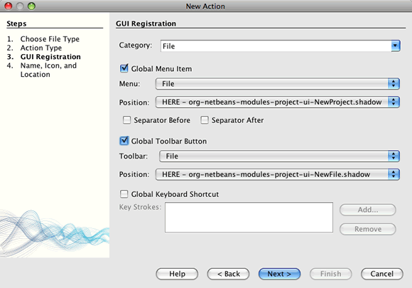

[start=5]
1. В поле "Имя класса" введите *NewAction*.

[start=6]
1. В поле "Отображаемое имя" введите *My New Action*.

[start=7]
1. Нажмите кнопку "Обзор" и выберите изображение, которое будет использоваться на панели инструментов.

Можно скопировать изображение  ``abc16.png``  в рабочей среде и указать его в мастере. 
image::images/maven-crud_abc16.png[title="Пример значка 16x16"]

[start=8]
1. Выберите пакет *com.mycompany.mavenplatformcrudapp.editor*. Нажмите кнопку "Готово".

[start=9]
1. Измените класс  ``NewAction`` , чтобы открыть компонент MyEditorTopComponent и очистить поля.

[source,java]
----

import java.awt.event.ActionEvent;
import java.awt.event.ActionListener;

public final class NewAction implements ActionListener {

    public void actionPerformed(ActionEvent e) {
        MyEditorTopComponent tc = MyEditorTopComponent.getDefault();
        tc.resetFields();
        tc.open();
        tc.requestActive();
    }

}
----

Это действие реализует класс ActionListener, привязанный к приложению через записи в файле layer, размещенном там мастером создания действия.

=== Создание и сохранение нового объекта

[start=1]
1. В компоненте *MyEditorTopComponent* добавьте следующий метод для сброса текстовых полей JTextField и создания нового объекта  ``Customer`` :

[source,java]
----

public void resetFields() {
    customer = new Customer();
    jTextField1.setText("");
    jTextField2.setText("");
}
----

Если необходимо создание скелетного метода средой IDE в компоненте MyEditorTopComponent, нажмите в классе  ``NewAction``  в вызове  ``resetFields``  сочетание клавиш ALT+ВВОД.

[start=2]
1. В SaveCookie возвращаемое значение "null" должно соответствовать сохранению новой записи, а не обновлению существующей:

[source,java]
----

public void save() throws IOException {

    Confirmation message = new NotifyDescriptor.Confirmation("Сохранить \""
                  + jTextField1.getText() + " (" + jTextField2.getText() + ")\"?",
                  NotifyDescriptor.OK_CANCEL_OPTION,
                  NotifyDescriptor.QUESTION_MESSAGE);

    Object result = DialogDisplayer.getDefault().notify(msg);

    //Если пользователь намерен сохранить, и нажимает "Да",
    //следует отключить кнопку "Сохранить" и команду меню "Сохранить",
    //чтобы они могли использоваться только при внесении следующего изменения
    //в текстовом поле:
    if (NotifyDescriptor.YES_OPTION.equals(result)) {
        fire(false);
        EntityManager entityManager = Persistence.createEntityManagerFactory("CustomerLibraryPU").createEntityManager();
        entityManager.getTransaction().begin();
        *if (customer.getCustomerId() != null) {*
            Customer c = entityManager.find(Customer.class, cude.getCustomerId());
            c.setName(jTextField1.getText());
            c.setCity(jTextField2.getText());
            entityManager.getTransaction().commit();
        *} else {
            Query query = entityManager.createQuery("SELECT c FROM Customer c");
            List<Customer> resultList = query.getResultList();
            customer.setCustomerId(resultList.size()+1);
            customer.setName(jTextField1.getText());
            customer.setCity(jTextField2.getText());
            //добавление полей для заполнения столбцов zip и discountCode
            customer.setZip("12345");
            customer.setDiscountCode(entityManager.find(DiscountCode.class, 'H'));

            entityManager.persist(customer);
            entityManager.getTransaction().commit();
        }*
    }

}
----

Этот код также записывает произвольные данные в DiscountCode, так как это поле не может быть пустым.

[start=3]
1. Исправьте операторы импорта для импорта  ``*javax.persistence.Query*`` . Сохраните изменения.

== Построение и запуск приложения

Теперь приложение выполняет три функции CRUD: создание, чтение и обновление. Теперь можно построить и запустить приложение, чтобы проверить, правильно ли выполняются все эти функции.

[start=1]
1. Щелкните правой кнопкой мыши узел проекта *Приложение на базе платформы NetBeans MavenPlatformCRUDApp* и выберите команду "Очистить".

[start=2]
1. Щелкните правой кнопкой мыши узел проекта *Приложение на базе платформы NetBeans MavenPlatformCRUDApp* и выберите команду "Построить вместе с зависимостями".

[start=3]
1. Щелкните правой кнопкой мыши узел проекта *Приложение на базе платформы NetBeans MavenPlatformCRUDApp* и выберите команду "Выполнить".

При нажатии кнопки "Выполнить" среда IDE запускает приложение на платформе. Приложение заполняет дерево в окне Customer именами клиентов в базе данных. При выборе узла в окне Customer в окне My Editor отражаются имя и город выбранного клиента. Можно изменить и сохранить данные в полях "Имя" и "Город". Чтобы создать нового клиента, нажмите кнопку My Action на панели инструментов, заполните пустые текстовые поля "Имя" и "Город" в окне My Editor и нажмите "Сохранить".

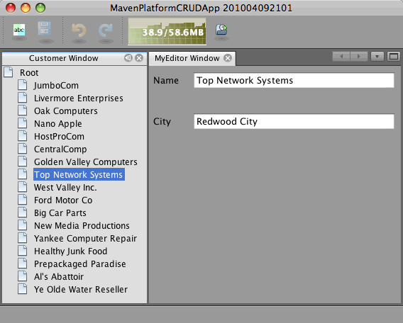

После создания или изменения клиента необходимо обновить корневой узел в окне Customer, если действие "Обновить" не было реализовано при сохранении.

В этом учебном курсе рассмотрены принципы создания приложения на платформе NetBeans с помощью Maven, которые во многом совпадают с принципами создания приложения с помощью Ant. Основное отличие заключается в том, что Maven POM управляет процессом сборки приложения. Дополнительные примеры построения приложений и модулей на платформе NetBeans приведены в учебных курсах  link:https://netbeans.apache.org/kb/docs/platform.html[Учебной карты по платформе NetBeans].

== Дополнительные сведения

Это заключительный раздел учебного курса CRUD. В этом документе были описаны принципы использования платформы построения Maven для создания нового приложения на платформе NetBeans с функциональностью CRUD. Дополнительные сведения о создании и разработке приложений приведены в следующих ресурсах:

*  link:https://netbeans.apache.org/kb/docs/platform_ru.html[Учебная карта по платформе NetBeans]
*  link:http://bits.netbeans.org/dev/javadoc/[Документация Javadoc по интерфейсам API в среде NetBeans]

Если у вас возникли вопросы по платформе NetBeans, можно отправить их в список рассылки dev@platform.netbeans.org либо ознакомиться с  link:https://mail-archives.apache.org/mod_mbox/netbeans-dev/[Архивом списка рассылки по платформе NetBeans].

