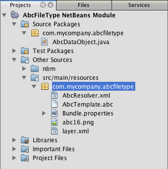
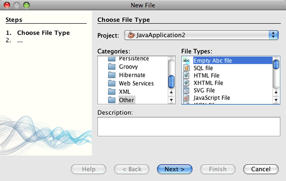
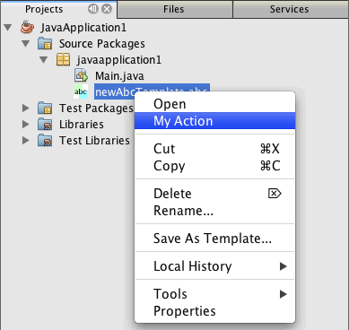
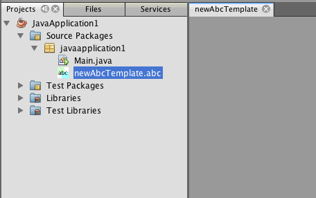

// 
//     Licensed to the Apache Software Foundation (ASF) under one
//     or more contributor license agreements.  See the NOTICE file
//     distributed with this work for additional information
//     regarding copyright ownership.  The ASF licenses this file
//     to you under the Apache License, Version 2.0 (the
//     "License"); you may not use this file except in compliance
//     with the License.  You may obtain a copy of the License at
// 
//       http://www.apache.org/licenses/LICENSE-2.0
// 
//     Unless required by applicable law or agreed to in writing,
//     software distributed under the License is distributed on an
//     "AS IS" BASIS, WITHOUT WARRANTIES OR CONDITIONS OF ANY
//     KIND, either express or implied.  See the License for the
//     specific language governing permissions and limitations
//     under the License.
//

= Maven を使用した NetBeans モジュールの作成
:jbake-type: platform_tutorial
:jbake-tags: tutorials 
:jbake-status: published
:syntax: true
:source-highlighter: pygments
:toc: left
:toc-title:
:icons: font
:experimental:
:description: Maven を使用した NetBeans モジュールの作成 - Apache NetBeans
:keywords: Apache NetBeans Platform, Platform Tutorials, Maven を使用した NetBeans モジュールの作成

このドキュメントでは、Maven 原型から NetBeans モジュールプロジェクトを作成し、モジュールを構築して IDE のインストール構成にインストールする方法を示します。このチュートリアルでは、インストールするとプロジェクトに新しいファイルの種類が作成できるようになる、簡単なモジュールプロジェクトを作成します。このモジュールは、新しいファイルの種類を選択したときに使用できるようになるメニューアクションも作成します。

このドキュメントは、Ant ベースの「 link:https://netbeans.apache.org/tutorials/nbm-filetype_ja.html[NetBeans ファイルの種類のチュートリアル]」に基づいており、NetBeans モジュールの開発において、Ant を使用する場合と Maven を使用する場合の違いについていくつか説明します。これらの相違点を少し理解すれば、「 link:https://netbeans.apache.org/kb/docs/platform_ja.html[NetBeans プラットフォームの学習]」のチュートリアルを容易に理解できるようになります。

NetBeans プラットフォームをはじめて使用する場合は、スクリーンキャストシリーズの「 link:https://netbeans.apache.org/tutorials/nbm-10-top-apis.html[NetBeans API のトップ 10]」を視聴いただくことをお勧めします。

NOTE:  NetBeans プラットフォーム用のアプリケーション開発のために、別々のバージョンの NetBeans プラットフォームをダウンロードする必要はありません。通常、NetBeans IDE でアプリケーションおよびモジュールを開発し、NetBeans プラットフォームおよびアプリケーションを実行するのに必要なモジュールのみを追加します。

このチュートリアルを開始する前に、必要に応じて次のドキュメントをお読みください。

*  link:http://wiki.netbeans.org/MavenBestPractices[NetBeans 6.x での Apache Maven のベストプラクティス]
*  link:http://www.sonatype.com/books/maven-book/reference/introduction.html[Chapter 1. Introducing Apache Maven] (『 link:http://www.sonatype.com/books/maven-book/reference/public-book.html[Maven: The Definitive Guide]』)
*  link:https://netbeans.apache.org/kb/docs/java/gui-functionality_ja.html[GUI 構築入門]

== IDE での Maven の使用方法

これがはじめての Maven プロジェクトである場合は、Maven の構成設定および Maven リポジトリブラウザに慣れることをお勧めします。

=== Maven オプションの構成

「オプション」ウィンドウの「Maven」タブを使用して、IDE における Maven の動作を設定したり、設定が正しいかどうかを確認したりできます。

[start=1]
1. 「オプション」ウィンドウの「その他」カテゴリを選択して、「Maven」タブをクリックします。

[start=2]
1. Maven をインストールするローカルの場所を指定します (2.0.9 以降が必要)。

[start=3]
1. Maven のローカルリポジトリの場所が正しいことを確認します。

[start=4]
1. 「了解」をクリックします。

ほとんどの場合、Maven の設定が標準的であれば、「オプション」ウィンドウの情報はすでに正しいものになっています。

NOTE:  Maven サポートは、Java SE 機能セットの一部として有効になっています。「オプション」ウィンドウで「Maven」タブが使用できない場合は、Java アプリケーションを作成して Java SE が有効になっているか確認してください。

=== Maven リポジトリの表示

Maven ですべてのプロジェクトを構築するために使用されるアーティファクトは、Maven のローカルリポジトリに格納されます。アーティファクトがプロジェクトの依存リソースとして宣言されると、そのアーティファクトは登録されたリモートリポジトリの 1 つからローカルリポジトリにダウンロードされます。

デフォルトで、NetBeans リポジトリおよびよく知られているインデックス付きの Maven リポジトリがいくつか登録され、リポジトリブラウザウィンドウに一覧表示されます。NetBeans リポジトリには、プロジェクトの構築に必要な、ほとんどの公開アーティファクトが含まれています。Maven リポジトリブラウザを使用すると、ローカルリポジトリとリモートリポジトリの内容を確認することができます。「ローカルリポジトリ」ノードを展開すると、ローカルにあるアーティファクトを表示できます。NetBeans リポジトリノードの下に一覧表示されているアーティファクトは、プロジェクトの依存リソースとして追加できますが、すべてのアーティファクトがローカルにあるわけではありません。これらはプロジェクトの依存リソースとして宣言されたときにだけ、ローカルリポジトリに追加されます。

Maven リポジトリブラウザを開くには、次の手順に従います。

* メインメニューから「ウィンドウ」>「その他」>「Maven リポジトリブラウザ」を選択します。

image::images/maven-quickstart68_maven-nbm-netbeans-repo.png[title="Maven リポジトリブラウザのスクリーンショット"]

== NetBeans プラットフォームモジュールプロジェクトの作成

この節では、NetBeans モジュールプロジェクトを作成してから、新しいファイルの種類のための DataObject を作成します。

=== モジュールの作成

この課題では、「新規プロジェクト」ウィザードを使用して、Maven 原型から NetBeans モジュールプロジェクトを作成します。

[start=1]
1. 「新規プロジェクト」ウィザードを開き、「Maven」カテゴリから「Maven NetBeans モジュール」を選択します。「次へ」をクリックします。

[start=2]
1. 「プロジェクト名」に「*AbcFileType*」と入力します。「完了」をクリックします。

「完了」をクリックすると、IDE によって AbcFileType プロジェクトが作成されます。POM を見ると、Maven が  `` link:http://maven.apache.org/plugins/maven-jar-plugin/[maven-jar-plugin]``  を使用して JAR を構築し、 `` link:http://bits.netbeans.org/mavenutilities/nbm-maven-plugin/[nbm-maven-plugin]``  が NetBeans モジュール ( ``nbm`` ) として JAR をパッケージ化することが確認できます。

[source,xml]
----

    <modelVersion>4.0.0</modelVersion>
    <groupId>com.mycompany</groupId>
    <artifactId>AbcFileType</artifactId>
    *<packaging>nbm</packaging>*
    <version>1.0-SNAPSHOT</version>
    <name>AbcFileType NetBeans Module</name>
    ...
    <build>
        <plugins>
            <plugin>
                <groupId>org.codehaus.mojo</groupId>
                *<artifactId>nbm-maven-plugin</artifactId>*
                <extensions>true</extensions>
            </plugin>
            ...
            <plugin>
            <groupId>org.apache.maven.plugins</groupId>
                *<artifactId>maven-jar-plugin</artifactId>*
                <version>2.2</version>
                <configuration>
                    <!-- to have the jar plugin pickup the nbm generated manifest -->
                    <useDefaultManifestFile>true</useDefaultManifestFile>
                </configuration>
            </plugin>
        </plugins>
    </build>
----

=== DataObject クラスの作成

この節では、「新規ファイルの種類」ウィザードを使用して、 ``.abc``  という名前の新しいファイルの種類を作成および認識するためのファイルを作成します。このウィザードは、MIME タイプリゾルバである  `` link:http://bits.netbeans.org/dev/javadoc/org-openide-loaders/org/openide/loaders/DataObject.html[DataObject]``  および  ``abc``  ファイルのファイルテンプレートを作成し、新しいファイルの種類の登録エントリを追加するように  ``layer.xml``  を変更します。

[start=1]
1. 「プロジェクト」ウィンドウでプロジェクトノードを右クリックし、「新規」>「ファイルの種類」を選択します。

[start=2]
1. 「ファイルの認識」パネルで、「MIME タイプ」に「*text/x-abc*」、「ファイル名の拡張子」に「*.abc .ABC*」を入力します。「次へ」をクリックします。
image::images/maven-single_maven-single-new-filetype-wizard.png[title="「新規ファイルの種類」ウィザード"]

[start=3]
1. 「クラス名の接頭辞」に「*Abc*」と入力します。

[start=4]
1. 「参照」をクリックして、16x16 ピクセルの画像ファイルを新しいファイルの種類のアイコンとして選択します。「完了」をクリックします。

この画像  `` link:images/maven-crud_abc16.png[abc16.png]``  (
image::images/maven-crud_abc16.png[title="16x16"]) をシステムに保存して、ウィザードでこの画像を指定することもできます。

「完了」をクリックすると、IDE によって  ``AbcDataObject``  クラスが作成され、指定したファイルの種類のアイコンが、「その他のソース」の下の  ``src/main/resources``  のパッケージにコピーされます。

「プロジェクト」ウィンドウを見ると、ウィザードによって  ``src/main/resources``  ディレクトリに MIME タイプリゾルバ ( ``AbcResolver.xml`` ) およびテンプレート ( ``AbcTemplate.abc`` ) ファイルが作成されているのが確認できます。

IDE によって作成されたファイルの詳細については、「 link:https://netbeans.apache.org/wiki/devfaqdataobject[DataObject とは]」、および「 link:nbm-filetype_ja.html[NBM ファイルの種類のチュートリアル]」の「 link:nbm-filetype_ja.html#recognizing[Abc ファイルの認識]」節を参照してください。

== プロジェクトの構築と実行

この節では、現バージョンの IDE にモジュールがインストールされるように、モジュールを設定します。モジュールを実行すると、IDE の新しいインスタンスが起動します。

=== NetBeans インストールの場所の指定

Maven 原型を使用して NetBeans プラットフォームモジュールを作成した場合、デフォルトではターゲット NetBeans インストールは指定されません。プロジェクトを構築することはできますが、インストールディレクトリを設定せずにプロジェクトを実行しようとすると、「出力」ウィンドウに次のような構築エラーが表示されます。

image::images/maven-single_output-build-error.png[title="構築エラーを表示する「出力」ウィンドウ"]

IDE のインストール場所にモジュールをインストールして実行するには、POM の  ``nbm-maven-plugin``  要素を編集して、インストールディレクトリのパスを指定する必要があります。

[start=1]
1. 「プロジェクトファイル」ノードを展開し、 ``pom.xml``  をエディタで開きます。

[start=2]
1.  ``nbm-maven-plugin``  要素に  ``<netbeansInstallation>``  要素を追加して、NetBeans インストール場所のパスを指定します。

[source,xml]
----

<plugin>
    <groupId>org.codehaus.mojo</groupId>
    <artifactId>nbm-maven-plugin</artifactId>
    <version>3.2</version>
    <extensions>true</extensions>
    *<configuration>
       <netbeansInstallation>/home/me/netbeans-6.9</netbeansInstallation>
    </configuration>*
</plugin>
----

NOTE:  パスには、実行可能ファイルが含まれている  ``bin``  ディレクトリが存在するディレクトリを指定する必要があります。

たとえば、OS X では次のようなパスになります。

[source,xml]
----

<netbeansInstallation>/Applications/NetBeans/NetBeans 6.9.app/Contents/Resources/NetBeans</netbeansInstallation>
----

=== モジュールの実行

NetBeans IDE インストールディレクトリを指定したら、モジュールを構築および実行できます。

[start=1]
1. プロジェクトノードを右クリックし、「構築」を選択します。

[start=2]
1. プロジェクトのノードを右クリックし、「実行」を選択します。

「実行」を選択すると、新しいモジュールがインストールされた IDE が起動します。新しいモジュールが正常に機能しているかどうかを確認するには、新しいプロジェクトを作成してから、「新規ファイル」ウィザードを使用して  ``abc``  ファイルを作成します。たとえば、簡単な Java アプリケーションを作成して「新規ファイル」ウィザードを開くと、「その他」カテゴリで「空の Abc ファイル」を選択できます。

新しいファイルを作成する際、「プロジェクト」ウィンドウにファイルを表示するにはソースパッケージを指定します。デフォルトでは、「新規ファイルの種類」ウィザードは、プロジェクトのルートレベルにファイルを作成します。

 
新しい abc ファイルを作成したら、このファイルの種類のアイコンでファイルが「プロジェクト」ウィンドウに表示されているのが確認できます。エディタでファイルを開くと、新しいファイルの内容がファイルテンプレートから生成されたのが確認できます。

image::images/maven-single_maven-single-projects-abcfile.png[title="「プロジェクト」ウィンドウの Abc ファイルとエディタ表示"]

== ファイルの種類のアクションの追加

この節では、ユーザーが新しいファイルの種類のノードを右クリックしたときに、ポップアップメニューから呼び出せるアクションを追加します。

=== アクションクラスの作成

この課題では、「新規アクション」ウィザードを使用して、新しいファイルの種類のアクションを実行する Java クラスを作成します。ウィザードは、 ``layer.xml``  にもクラスを登録します。

[start=1]
1. プロジェクトノードを右クリックし、「新規」>「アクション」を選択します。

[start=2]
1. 「アクションの種類」パネルで、「条件付きで有効化」を選択して、「Cookie クラス」に「*com.mycompany.abcfiletype.AbcDataObject*」と入力します。「次へ」をクリックします。
image::images/maven-single_maven-single-newactionwizard.png[title="「新規アクション」ウィザード"]

[start=3]
1. 「カテゴリ」ドロップダウンリストから「編集」を選択して、「大域メニュー項目」を選択解除します。

[start=4]
1. 「ファイルの種類のコンテキストメニュー項目」を選択して、「内容の種類」ドロップダウンリストで「*text/x-abc*」を選択します。「次へ」をクリックします。

[start=5]
1. 「クラス名」に「*MyAction*」、「表示名」に「*My Action*」と入力します。「完了」をクリックします。

「完了」をクリックすると、 ``com.mycompany.abcfiletype``  ソースパッケージに  ``MyAction.java``  が作成されます。エディタで  ``layer.xml``  を開くと、 ``Actions``  folder 要素内にある  ``Edit``  folder 要素内で、ウィザードによってこのファイルの種類の新しいアクションの詳細情報が追加されているのが確認できます。

[source,xml]
----

<folder name="Actions">
    <folder name="Edit">
        *<file name="com-mycompany-abcfiletype-MyAction.instance">*
            <attr name="delegate" methodvalue="org.openide.awt.Actions.inject"/>
            <attr name="displayName" bundlevalue="com.mycompany.abcfiletype.Bundle#CTL_MyAction"/>
            <attr name="injectable" stringvalue="com.mycompany.abcfiletype.MyAction"/>
            <attr name="instanceCreate" methodvalue="org.openide.awt.Actions.context"/>
            <attr name="noIconInMenu" boolvalue="false"/>
            <attr name="selectionType" stringvalue="EXACTLY_ONE"/>
            <attr name="type" stringvalue="com.mycompany.abcfiletype.AbcDataObject"/>
        </file>
    </folder>
</folder>
----

また、 ``Loaders``  および  ``Factories``  folder 要素内にも、新しいファイルの種類に適用される要素がウィザードによって生成されています。 ``abc``  のファイルの種類のメニューアクションは  ``Actions``  の下に指定され、 ``DataLoader``  は  ``Factories``  の下に指定されます。

[source,xml]
----

<folder name="Loaders">
    <folder name="text">
        *<folder name="x-abc">
            <folder name="Actions">
                <file name="com-mycompany-abcfiletype-MyAction.shadow">*
                    <attr name="originalFile" stringvalue="Actions/Edit/com-mycompany-abcfiletype-MyAction.instance"/>
                    *<attr name="position" intvalue="0"/>*
                </file>
                <file name="org-openide-actions-CopyAction.shadow">
                    <attr name="originalFile" stringvalue="Actions/Edit/org-openide-actions-CopyAction.instance"/>
                    <attr name="position" intvalue="400"/>
                </file>
                ...
            </folder>
            *<folder name="Factories">
                <file name="AbcDataLoader.instance">*
                    <attr name="SystemFileSystem.icon" urlvalue="nbresloc:/com/mycompany/abcfiletype/abc16.png"/>
                    <attr name="dataObjectClass" stringvalue="com.mycompany.abcfiletype.AbcDataObject"/>
                    <attr name="instanceCreate" methodvalue="org.openide.loaders.DataLoaderPool.factory"/>
                    <attr name="mimeType" stringvalue="text/x-abc"/>
                </file>
            </folder>
        </folder>
    </folder>
</folder>
----

ポップアップメニューの「My Action」の位置は、 ``position``  属性 ( ``<attr name="position" intvalue="0"/>`` ) によって指定されます。デフォルトでは、新しいアクションのこの属性の  ``intvalue``  に  ``0``  が割り当てられ、このアクションがリストの最上部に表示されます。順番を変えるには、 ``intvalue``  を変更します。たとえば、 ``intvalue``  を  ``200``  に変更すると、「My Action」メニュー項目は「開く」メニュー項目の下に表示されます (「開く」アクションの  ``intvalue``  は  ``100`` )。

=== アクションへの動作の割り当て

ここで、アクションのコードを追加する必要があります。この例では、ポップアップメニューからアクションが呼び出されたら、 ``DialogDisplayer``  を使用してダイアログボックスを開くコードを追加します。また、 ``DialogDisplayer``  を使用するために、 ``org.openide.dialogs``  で直接依存リソースを宣言する必要もあります。

[start=1]
1.  ``MyAction.java``  の  ``actionPerformed(ActionEvent ev)``  メソッドを変更して、「My Action」が呼び出されるとダイアログを開くようにします。

[source,java]
----

@Override
public void actionPerformed(ActionEvent ev) {
   *FileObject f = context.getPrimaryFile();
   String displayName = FileUtil.getFileDisplayName(f);
   String msg = "This file is " + displayName + ".";
   NotifyDescriptor nd = new NotifyDescriptor.Message(msg);
   DialogDisplayer.getDefault().notify(nd);*
}
----

[start=2]
1. インポートを修正して、 ``*org.openide.filesystems.FileObject*``  がインポートされることを確認します。変更を保存します。

インポートを修正したとき、 ``org.openide.DialogDisplayer``  のインポート文を追加しました。ここで、 ``org.openide.dialogs``  アーティファクトの依存リソースを、推移的な依存リソースではなく直接依存リソースと宣言する必要があります。

[start=3]
1. プロジェクトの「ライブラリ」ノードの下にある「 ``org.openide.dialogs`` 」JAR を右クリックして、「直接依存リソースとして宣言」を選択します。

ここで、モジュールをテストして、新しいアクションが正常に機能するかどうかを確認できます。

NOTE:  モジュールを実行するには、最初にモジュールに対して「生成物を削除」および「構築」を実行する必要があります。

 ``abc``  のファイルの種類のノードを右クリックすると、ポップアップメニュー項目の 1 つに「My Action」が表示されているのが確認できます。

== ファイルの種類のウィンドウの作成

デフォルトでは、新しいファイルの種類は基本的なテキストエディタで開きます。新しいファイルの種類をエディタで開かないようにするには、新しいファイルの種類を編集するための専用の新しいウィンドウを作成します。そのあとで、ほかのファイル編集方法をサポートするためにウィンドウコンポーネントを変更できます。たとえば、ウィンドウをビジュアルエディタに変更できます。この節では、新しいファイルの種類専用の新しいウィンドウコンポーネントを作成します。

[start=1]
1. プロジェクトノードを右クリックし、「新規」>「ウィンドウ」を選択します。

[start=2]
1. ドロップダウンリストから「*editor*」を選択し、「アプリケーションの起動時に開く」を選択します。「次へ」をクリックします。

[start=3]
1. 「クラス名の接頭辞」に「*Abc*」と入力します。「完了」をクリックします。

[start=4]
1. エディタで  ``AbcDataObject.java``  を開き、 ``DataEditorSupport``  ではなく  `` link:http://bits.netbeans.org/dev/javadoc/org-openide-loaders/org/openide/loaders/OpenSupport.html[OpenSupport]``  を使用するようにクラスコンストラクタを変更します。

[source,java]
----

public AbcDataObject(FileObject pf, MultiFileLoader loader) throws DataObjectExistsException, IOException {
    super(pf, loader);
    CookieSet cookies = getCookieSet();
    *cookies.add((Node.Cookie) new AbcOpenSupport(getPrimaryEntry()));*
}
----

[start=5]
1. コンストラクタによって呼び出される  ``AbcOpenSupport``  クラスを作成します。

 ``AbcOpenSupport``  への呼び出しが含まれる行で Alt-Enter を入力すると、パッケージ  ``com.mycompany.abcfiletype``  に  ``AbcOpenSupport``  が作成されます。

[start=6]
1.  ``AbcOpenSupport``  を変更し、 ``OpenSupport``  を拡張して  ``OpenCookie``  および  ``CloseCookie``  を実装します。

[source,java]
----

class AbcOpenSupport *extends OpenSupport implements OpenCookie, CloseCookie* {
----

[start=7]
1. abstract メソッドを (Alt-Enter で) 実装して、クラスを次のように変更します。

[source,java]
----

    public AbcOpenSupport(*AbcDataObject.Entry entry*) {
        *super(entry);*
    }

    @Override
    protected CloneableTopComponent createCloneableTopComponent() {
        *AbcDataObject dobj = (AbcDataObject) entry.getDataObject();
        AbcTopComponent tc = new AbcTopComponent();
        tc.setDisplayName(dobj.getName());
        return tc;*
    }
----

[start=8]
1. エディタで  ``AbcTopComponent``  を開き、 ``TopComponent``  ではなく  ``CloneableTopComponent``  を拡張するようにクラスを変更します。

[source,java]
----

public final class AbcTopComponent extends *CloneableTopComponent* {
----

[start=9]
1. クラス修飾子を  ``private``  から  ``public``  に変更します。*public*

[source,java]
----

 static AbcTopComponent instance;
----

[start=10]
1. インポートを修正して変更内容を保存します。

ここで、プロジェクトに「生成物を削除」および「構築」を実行してから、ふたたびモジュールの実行を試行できます。

abc ファイルを開くと、基本エディタではなく、新しいウィンドウでファイルが開くようになりました。

このチュートリアルでは、Maven 原型から NetBeans モジュールを作成して実行する方法を示しました。ターゲット NetBeans インストールを指定するようにプロジェクト POM を変更し、IDE の「実行」コマンドによってモジュールのインストールおよび IDE の新しいインスタンスの起動が行われるようにする方法を学習しました。また、ファイルの種類および  ``DataObjects``  を扱う方法についても少し学習しましたが、より詳細な情報については、「 link:https://netbeans.apache.org/tutorials/nbm-filetype_ja.html[NetBeans ファイルの種類のチュートリアル]」を参照するようにしてください。ほかの NetBeans プラットフォームアプリケーションおよびモジュール構築の例については、「 link:https://netbeans.apache.org/kb/docs/platform_ja.html[NetBeans プラットフォームの学習]」に一覧表示されている各チュートリアルを参照してください。

== 関連項目

アプリケーションの作成と開発の詳細については、次のリソースを参照してください。

*  link:https://netbeans.apache.org/kb/docs/platform_ja.html[NetBeans プラットフォームの学習]
*  link:http://bits.netbeans.org/dev/javadoc/[NetBeans API Javadoc]

NetBeans プラットフォームに関して質問がある場合は、dev@platform.netbeans.org のメーリングリストに投稿していただくか、 link:https://mail-archives.apache.org/mod_mbox/netbeans-dev/[NetBeans プラットフォームメーリングリストのアーカイブ]を参照してください。

