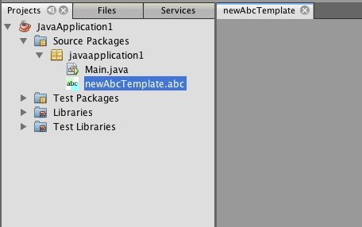

// 
//     Licensed to the Apache Software Foundation (ASF) under one
//     or more contributor license agreements.  See the NOTICE file
//     distributed with this work for additional information
//     regarding copyright ownership.  The ASF licenses this file
//     to you under the Apache License, Version 2.0 (the
//     "License"); you may not use this file except in compliance
//     with the License.  You may obtain a copy of the License at
// 
//       http://www.apache.org/licenses/LICENSE-2.0
// 
//     Unless required by applicable law or agreed to in writing,
//     software distributed under the License is distributed on an
//     "AS IS" BASIS, WITHOUT WARRANTIES OR CONDITIONS OF ANY
//     KIND, either express or implied.  See the License for the
//     specific language governing permissions and limitations
//     under the License.
//

= 使用 Maven 创建 NetBeans 模块
:jbake-type: platform_tutorial
:jbake-tags: tutorials 
:jbake-status: published
:syntax: true
:source-highlighter: pygments
:toc: left
:toc-title:
:icons: font
:experimental:
:description: 使用 Maven 创建 NetBeans 模块 - Apache NetBeans
:keywords: Apache NetBeans Platform, Platform Tutorials, 使用 Maven 创建 NetBeans 模块

本文档演示了如何通过 Maven 原型创建 NetBeans 模块项目，并在 IDE 安装中生成和安装此模块。在本教程中，您将创建一个简单的模块项目，该模块在安装后可用于在项目中创建一种新的文件类型。使用该模块还可创建一个菜单操作，当您选择新的文件类型时，便可使用该操作。

本文档根据基于 Ant 的  link:https://netbeans.apache.org/tutorials/nbm-filetype_zh_CN.html[NetBeans 文件类型教程]而编写，阐述了使用 Ant 和 Maven 开发 NetBeans 模块的一些不同之处。在了解其中的一些不同之处后，您便可以轻松地继续学习  link:https://netbeans.apache.org/kb/docs/platform_zh_CN.html[NetBeans 平台学习资源]上的其他教程。

如果您不熟悉 NetBeans 平台，则可能需要观看截屏视频系列 link:https://netbeans.apache.org/tutorials/nbm-10-top-apis.html[最主要的 10 个 NetBeans API]。

*注意：*为开发适用于 NetBeans 平台的应用程序，您无需下载该平台的独立版本。通常，您是在 NetBeans IDE 中开发应用程序和模块，并且只包含运行 NetBeans 平台和您的应用程序所需的模块。

在开始本教程之前，您可以先阅读下面这些文档。

*  link:http://wiki.netbeans.org/MavenBestPractices[Best Practices for Apache Maven in NetBeans 6.x]（NetBeans 6.x 中 Apache Maven 的最佳做法）
*  link:http://www.sonatype.com/books/maven-book/reference/introduction.html[Chapter 1. Introducing Apache Maven]（第 1 章. Apache Maven 简介，来自  link:http://www.sonatype.com/books/maven-book/reference/public-book.html[Maven: The Definitive Guide]（Maven：权威指南））
*  link:https://netbeans.apache.org/kb/docs/java/gui-functionality_zh_CN.html[生成 GUI 应用程序简介]

== 在 IDE 中使用 Maven

如果这是您第一次创建 Maven 项目，则您会希望了解 Maven 配置设置和 Maven 资源库浏览器。

=== 配置 Maven 选项

您可以使用“选项”窗口中的 "Maven" 标签来在 IDE 中配置 Maven 的行为，并检查您的配置是否正确。

[start=1]
1. 在“选项”窗口中选择“其他”类别，然后单击 "Maven" 标签。

[start=2]
1. 指定 Maven 在本地的安装位置（要求为 2.0.9 或更高版本）。

[start=3]
1. 检查本地 Maven 资源库的位置是否正确。

[start=4]
1. 单击“确定”。

在大多数情况下，如果您执行了典型的 Maven 配置，则“选项”窗口中的信息应该已经是正确的。

*注意：*Maven 支持是作为 Java SE 功能集的一部分被激活的。如果“选项”窗口中的 "Maven" 标签不可用，请通过创建一个 Java 应用程序来确认 Java SE 已被激活。

=== 查看 Maven 资源库

Maven 用于生成所有项目的工件均存储在本地 Maven 资源库中。如果某一工件被声明为项目依赖关系，则会将其从已注册的某个远程资源库下载到您的本地资源库中。

缺省情况下，已注册 NetBeans 资源库和一些常见的索引 Maven 资源库，并将它们列在资源库浏览器窗口中。NetBeans 资源库包含生成项目所需的大多数公共工件。您可以使用“Maven 资源库”浏览器查看本地和远程资源库的内容。您可以展开“本地库”节点以查看本地存在的工件。NetBeans 资源库节点下列出的工件可以添加为项目依赖关系，但并非所有这些工件都在本地存在。仅当这些工件被声明为项目依赖关系时，才会将其添加到“本地库”。

打开“Maven 资源库”浏览器：

* 从主菜单中选择“窗口”>“其他”>“Maven 资源库浏览器”。

image::images/maven-quickstart68_maven-nbm-netbeans-repo.png[title="“Maven 资源库”浏览器的屏幕快照"]

== 创建 NetBeans 平台模块项目

在此部分，您将创建一个 NetBeans 模块项目，然后为新的文件类型创建一个 DataObject。

=== 创建模块

在本练习中，您将使用“新建项目”向导来通过 Maven 原型创建 NetBeans 模块项目。

[start=1]
1. 打开“新建项目”向导，然后在 "Maven" 类别中选择“Maven NetBeans 模块”。单击“下一步”。

[start=2]
1. 在“项目名称”中键入 *AbcFileType*。单击“完成”。

单击“完成”后，IDE 会创建 AbcFileType 项目。如果查看 POM，则可以看到 Maven 将使用  `` link:http://maven.apache.org/plugins/maven-jar-plugin/[maven-jar-plugin]``  来生成 JAR，而  `` link:http://bits.netbeans.org/mavenutilities/nbm-maven-plugin/[nbm-maven-plugin]``  会将该 JAR 打包为一个 NetBeans 模块 ( ``nbm`` )。

[source,xml]
----

    <modelVersion>4.0.0</modelVersion>
    <groupId>com.mycompany</groupId>
    <artifactId>AbcFileType</artifactId>
    *<packaging>nbm</packaging>*
    <version>1.0-SNAPSHOT</version>
    <name>AbcFileType NetBeans Module</name>
    ...
    <build>
        <plugins>
            <plugin>
                <groupId>org.codehaus.mojo</groupId>
                *<artifactId>nbm-maven-plugin</artifactId>*
                <extensions>true</extensions>
            </plugin>
            ...
            <plugin>
            <groupId>org.apache.maven.plugins</groupId>
                *<artifactId>maven-jar-plugin</artifactId>*
                <version>2.2</version>
                <configuration>
                    <!-- to have the jar plugin pickup the nbm generated manifest -->
                    <useDefaultManifestFile>true</useDefaultManifestFile>
                </configuration>
            </plugin>
        </plugins>
    </build>
----

=== 创建 DataObject 类

在此部分，您将使用“新建文件类型”向导创建一些文件，以便创建和识别名为  ``.abc``  的新文件类型。该向导将创建一个  `` link:http://bits.netbeans.org/dev/javadoc/org-openide-loaders/org/openide/loaders/DataObject.html[DataObject]`` 、一个 MIME 类型解析器和一个用于  ``abc``  文件的文件模板，并且会修改  ``layer.xml``  来为新的文件类型添加注册条目。

[start=1]
1. 在“项目”窗口中右键单击项目节点，然后选择“新建”>“文件类型”。

[start=2]
1. 在“文件识别”面板的“MIME 类型”中键入 *text/x-abc*，在“扩展名”中键入 *.abc .ABC*。单击“下一步”。
image::images/maven-single_maven-single-new-filetype-wizard.png[title="“新建文件类型”向导"]

[start=3]
1. 在“类名前缀”中键入 *Abc*。

[start=4]
1. 单击“浏览”，然后选择一个 16x16 像素的图像文件作为新文件类型的图标。单击“完成”。

您可以将此图像  `` link:images/maven-crud_abc16.png[abc16.png]``  ( 
image::images/maven-crud_abc16.png[title="16x16"] ) 保存到您的系统，然后在向导中指定该图像。

单击“完成”后，IDE 会创建  ``AbcDataObject``  类，并将您的文件类型图标复制到“其他源”下  ``src/main/resources``  的包中。

image::images/maven-single_maven-single-projects1.png[title="“项目”窗口的屏幕快照"]

在“项目”窗口中，您可以看到向导在  ``src/main/resources``  目录中创建了 MIME 类型解析器 ( ``AbcResolver.xml`` ) 和模板 ( ``AbcTemplate.abc`` ) 文件。

有关 IDE 所创建的文件的详细信息，请参见 link:https://netbeans.apache.org/wiki/devfaqdataobject[什么是 DataObject] 以及  link:nbm-filetype_zh_CN.html[NBM 文件类型教程]中有关 link:nbm-filetype_zh_CN.html#recognizing[识别 Abc 文件]的部分。

== 生成和运行项目

在此部分，您将配置模块，以便将该模块安装到当前版本的 IDE 中。当您运行模块时，将会启动 IDE 的新实例。

=== 指定 NetBeans 安装的位置

缺省情况下，当您使用 Maven 原型创建 NetBeans 平台模块时，不会指定任何目标 NetBeans 安装。您可以生成项目，但如果您在未设置安装目录的情况下尝试运行项目，则会在“输出”窗口中看到类似以下内容的生成错误。

image::images/maven-single_output-build-error.png[title="显示生成错误的“输出”窗口"]

要在 IDE 安装中安装并运行此模块，您需要编辑 POM 中的  ``nbm-maven-plugin``  元素以指定安装目录的路径。

[start=1]
1. 展开“项目文件”节点，然后在编辑器中打开  ``pom.xml`` 。

[start=2]
1. 指定 NetBeans 安装的路径，方法是修改  ``nbm-maven-plugin``  元素以添加  ``<netbeansInstallation>``  元素。

[source,xml]
----

<plugin>
    <groupId>org.codehaus.mojo</groupId>
    <artifactId>nbm-maven-plugin</artifactId>
    <version>3.2</version>
    <extensions>true</extensions>
    *<configuration>
       <netbeansInstallation>/home/me/netbeans-6.9</netbeansInstallation>
    </configuration>*
</plugin>
----

*注意：*此路径需要指定包含可运行文件的  ``bin``  目录所在的目录。

例如，在 OS X 上，此路径可能如下所示。

[source,xml]
----

<netbeansInstallation>/Applications/NetBeans/NetBeans 6.9.app/Contents/Resources/NetBeans</netbeansInstallation>
----

=== 运行模块

在指定 NetBeans IDE 安装目录之后，您便可以生成和运行此模块。

[start=1]
1. 右键单击项目节点，然后选择“生成”。

[start=2]
1. 右键单击项目节点，然后选择“运行”。

选择“运行”后，将会启动安装了新模块的 IDE。要确认新模块能够正常使用，请创建一个新项目，然后使用“新建文件”向导来创建一个  ``abc``  文件。例如，您可以创建一个简单的 Java 应用程序，然后打开“新建文件”向导，并在“其他”类别中选择“空 Abc 文件”类型。

在创建新文件时，如果您希望在“项目”窗口中看到该文件，请指定一个源包。缺省情况下，新文件类型的向导会在项目的根目录级别创建文件。

image::images/maven-single_wizard-new-abc-file.png[title="具有 Abc 文件类型的“新建文件”向导"] 
在创建新的 abc 文件之后，您便可以看到“项目”窗口中会出现带有该文件类型图标的文件。如果您在编辑器中打开此文件，则可以看到新文件的内容是从文件模板生成的。

image::images/maven-single_maven-single-projects-abcfile.png[title="“项目”窗口中以及编辑器中打开的 Abc 文件"]

== 为文件类型添加操作

在此部分，您将添加一个操作，当用户右键单击新文件类型的节点时，可以从弹出式菜单中调用该操作。

=== 创建操作类

在本练习中，您将使用“新建操作”向导创建一个 Java 类，用于为新的文件类型执行操作。此向导还会在  ``layer.xml``  中注册该类。

[start=1]
1. 右键单击项目节点，然后选择“新建”>“操作”。

[start=2]
1. 在“操作类型”面板中，选择“有条件地启用”，然后在“Cookie 类”中键入 *com.mycompany.abcfiletype.AbcDataObject*。单击“下一步”。
image::images/maven-single_maven-single-newactionwizard.png[title="“新建操作”向导"]

[start=3]
1. 在“类别”下拉列表中选择“编辑”，然后取消选择“全局菜单项”。

[start=4]
1. 选择“文件类型上下文菜单项”，然后在“内容类型”下拉列表中选择 "text/x-abc"。单击“下一步”。

[start=5]
1. 在“类名”中键入 *MyAction*，在“显示名称”中键入 *My Action*。单击“完成”。

单击“完成”后，在  ``com.mycompany.abcfiletype``  源包中创建  ``MyAction.java`` 。如果在编辑器中打开  ``layer.xml`` ，则可以看到在  ``Actions``  文件夹的  ``Edit``  文件夹元素中，向导添加了有关该文件类型的新操作的详细信息。

[source,xml]
----

<folder name="Actions">
    <folder name="Edit">
        *<file name="com-mycompany-abcfiletype-MyAction.instance">*
            <attr name="delegate" methodvalue="org.openide.awt.Actions.inject"/>
            <attr name="displayName" bundlevalue="com.mycompany.abcfiletype.Bundle#CTL_MyAction"/>
            <attr name="injectable" stringvalue="com.mycompany.abcfiletype.MyAction"/>
            <attr name="instanceCreate" methodvalue="org.openide.awt.Actions.context"/>
            <attr name="noIconInMenu" boolvalue="false"/>
            <attr name="selectionType" stringvalue="EXACTLY_ONE"/>
            <attr name="type" stringvalue="com.mycompany.abcfiletype.AbcDataObject"/>
        </file>
    </folder>
</folder>
----

该向导还在适用于新文件类型的  ``Loaders``  和  ``Factories``  文件夹元素中生成了元素。 ``abc``  文件类型的菜单操作在  ``Actions``  下面指定，而  ``DataLoader``  则在  ``Factories``  下面指定。

[source,xml]
----

<folder name="Loaders">
    <folder name="text">
        *<folder name="x-abc">
            <folder name="Actions">
                <file name="com-mycompany-abcfiletype-MyAction.shadow">*
                    <attr name="originalFile" stringvalue="Actions/Edit/com-mycompany-abcfiletype-MyAction.instance"/>
                    *<attr name="position" intvalue="0"/>*
                </file>
                <file name="org-openide-actions-CopyAction.shadow">
                    <attr name="originalFile" stringvalue="Actions/Edit/org-openide-actions-CopyAction.instance"/>
                    <attr name="position" intvalue="400"/>
                </file>
                ...
            </folder>
            *<folder name="Factories">
                <file name="AbcDataLoader.instance">*
                    <attr name="SystemFileSystem.icon" urlvalue="nbresloc:/com/mycompany/abcfiletype/abc16.png"/>
                    <attr name="dataObjectClass" stringvalue="com.mycompany.abcfiletype.AbcDataObject"/>
                    <attr name="instanceCreate" methodvalue="org.openide.loaders.DataLoaderPool.factory"/>
                    <attr name="mimeType" stringvalue="text/x-abc"/>
                </file>
            </folder>
        </folder>
    </folder>
</folder>
----

"My Action" 在弹出式菜单中的位置由  ``position``  属性 ( ``<attr name="position" intvalue="0"/>`` ) 指定。缺省情况下，会将新操作 position 属性的  ``intvalue``  指定为  ``0`` ，这样可使该操作位于列表的最上面。您可以通过更改  ``intvalue``  来改变顺序。例如，如果您将  ``intvalue``  更改为  ``200`` ，则 "My Action" 菜单项将出现在“打开”菜单项的下面（“打开”操作的  ``intvalue``  值为  ``100`` ）。

=== 为操作指定行为

现在，您需要为该操作添加代码。在本示例中，您将添加一些代码，当从弹出式菜单中调用该操作时，这些代码会使用  ``DialogDisplayer``  打开一个对话框。要使用  ``DialogDisplayer`` ，您还需要声明对  ``org.openide.dialogs``  的直接依赖关系。

[start=1]
1. 修改  ``MyAction.java``  中的  ``actionPerformed(ActionEvent ev)``  方法，以便在调用 "My Action" 时打开一个对话框。

[source,java]
----

@Override
public void actionPerformed(ActionEvent ev) {
   *FileObject f = context.getPrimaryFile();
   String displayName = FileUtil.getFileDisplayName(f);
   String msg = "This file is " + displayName + ".";
   NotifyDescriptor nd = new NotifyDescriptor.Message(msg);
   DialogDisplayer.getDefault().notify(nd);*
}
----

[start=2]
1. 修复导入，并确认您导入了  ``*org.openide.filesystems.FileObject*`` 。保存所做的更改。

当您修复导入时，您便为  ``org.openide.DialogDisplayer``  添加了一条导入语句。现在，您需要将对  ``org.openide.dialogs``  工件的依赖关系声明为直接依赖关系，而不是传递依赖关系。

[start=3]
1. 右键单击项目“库”节点下的  ``org.openide.dialogs``  JAR，然后选择“声明为直接依赖关系”。

现在，您可以对此模块进行测试，以确认新操作能够正常使用。

*注意：*要运行此模块，您首先需要清理和生成此模块。

image::images/maven-single_maven-single-action-popup.png[title="“项目”窗口中以及编辑器中打开的 Abc 文件"]

当您右键单击  ``abc``  文件类型的节点时，您会看到 "My Action" 包含在弹出式菜单的项目中。

== 为文件类型创建窗口

缺省情况下，会在一个基本的文本编辑器中打开新文件类型。如果您不希望对新文件类型使用编辑器，则可以创建一个新窗口，专门用于编辑新文件类型。然后，您可以修改此窗口组件以支持其他的文件编辑方式，例如，使窗口成为一个可视编辑器。在此部分，您将创建新窗口组件，专门用于新文件类型的文件。

[start=1]
1. 右键单击项目节点，然后选择“新建”>“窗口”。

[start=2]
1. 从下拉列表中选择 "editor"，然后选择“在应用程序启动时打开”。单击“下一步”。

[start=3]
1. 在“类名前缀”中键入 *Abc*。单击“完成”。

[start=4]
1. 在编辑器中打开  ``AbcDataObject.java`` ，然后将类构造函数修改为使用  `` link:http://bits.netbeans.org/dev/javadoc/org-openide-loaders/org/openide/loaders/OpenSupport.html[OpenSupport]``  而不是  ``DataEditorSupport`` 。

[source,java]
----

public AbcDataObject(FileObject pf, MultiFileLoader loader) throws DataObjectExistsException, IOException {
    super(pf, loader);
    CookieSet cookies = getCookieSet();
    *cookies.add((Node.Cookie) new AbcOpenSupport(getPrimaryEntry()));*
}
----

[start=5]
1. 创建由构造函数调用的  ``AbcOpenSupport``  类。

在包含  ``AbcOpenSupport``  调用的代码行中按 Alt-Enter 组合键，以在包  ``com.mycompany.abcfiletype``  中创建  ``AbcOpenSupport`` 。

[start=6]
1. 修改  ``AbcOpenSupport``  以扩展  ``OpenSupport``  并实现  ``OpenCookie``  和  ``CloseCookie`` 。

[source,java]
----

class AbcOpenSupport *extends OpenSupport implements OpenCookie, CloseCookie* {
----

[start=7]
1. 实现抽象方法 (Alt-Enter) 并对该类进行如下更改。

[source,java]
----

    public AbcOpenSupport(*AbcDataObject.Entry entry*) {
        *super(entry);*
    }

    @Override
    protected CloneableTopComponent createCloneableTopComponent() {
        *AbcDataObject dobj = (AbcDataObject) entry.getDataObject();
        AbcTopComponent tc = new AbcTopComponent();
        tc.setDisplayName(dobj.getName());
        return tc;*
    }
----

[start=8]
1. 在编辑器中打开  ``AbcTopComponent`` ，然后修改该类以扩展  ``CloneableTopComponent``  而不是  ``TopComponent`` 。

[source,java]
----

public final class AbcTopComponent extends *CloneableTopComponent* {
----

[start=9]
1. 将类修饰符由  ``private``  更改为  ``public`` 。*public*

[source,java]
----

 static AbcTopComponent instance;
----

[start=10]
1. 修复导入并保存更改。

现在，您可以尝试在清理和生成项目之后重新运行此模块。

现在，当您打开 abc 文件时，该文件将在新窗口中打开，而不是在基本编辑器中打开。

本教程演示了如何创建和运行您通过 Maven 原型创建的 NetBeans 模块。您学习了如何修改项目 POM 以指定目标 NetBeans 安装，这样 IDE 中的“运行”命令就可以安装该模块并启动 IDE 的新实例。您还学习了一点有关如何使用文件类型和  ``DataObject``  的知识，若要了解详细信息，您应该查看  link:https://netbeans.apache.org/tutorials/nbm-filetype_zh_CN.html[NetBeans 文件类型教程]。有关如何生成 NetBeans 平台应用程序和模块的更多示例，请参见  link:https://netbeans.apache.org/kb/docs/platform_zh_CN.html[NetBeans 平台学习资源]中所列的教程。

== 另请参见

有关创建和开发应用程序的更多信息，请参见以下资源。

*  link:https://netbeans.apache.org/kb/docs/platform_zh_CN.html[NetBeans 平台学习资源]
*  link:http://bits.netbeans.org/dev/javadoc/[NetBeans API Javadoc]

如果您有任何有关 NetBeans 平台的问题，可随时写信至邮件列表 dev@platform.netbeans.org，或查看  link:https://mail-archives.apache.org/mod_mbox/netbeans-dev/[NetBeans 平台邮件列表归档]。

