// 
//     Licensed to the Apache Software Foundation (ASF) under one
//     or more contributor license agreements.  See the NOTICE file
//     distributed with this work for additional information
//     regarding copyright ownership.  The ASF licenses this file
//     to you under the Apache License, Version 2.0 (the
//     "License"); you may not use this file except in compliance
//     with the License.  You may obtain a copy of the License at
// 
//       http://www.apache.org/licenses/LICENSE-2.0
// 
//     Unless required by applicable law or agreed to in writing,
//     software distributed under the License is distributed on an
//     "AS IS" BASIS, WITHOUT WARRANTIES OR CONDITIONS OF ANY
//     KIND, either express or implied.  See the License for the
//     specific language governing permissions and limitations
//     under the License.
//

= NetBeans Platform Swing Porting Tutorial
:jbake-type: platform_tutorial
:jbake-tags: tutorials 
:jbake-status: published
:syntax: true
:source-highlighter: pygments
:toc: left
:toc-title:
:icons: font
:experimental:
:description: NetBeans Platform Swing Porting Tutorial - Apache NetBeans
:keywords: Apache NetBeans Platform, Platform Tutorials, NetBeans Platform Swing Porting Tutorial

This tutorial demonstrates how to port the Swing components and business logic of a simple Java application to the  link:https://netbeans.apache.org/platform/screenshots.html[NetBeans Platform]. Though the scenario below is simple, the basic concepts of "porting" an application to the NetBeans Platform will become clear. In the end, some general principles will be identified, based on the steps taken in the tutorial. Hopefully, they will be useful to you when porting your own Swing applications to the NetBeans Platform.

NOTE: This document uses NetBeans Platform 7.3 and NetBeans IDE 7.3. If you are using an earlier version, see  link:72/nbm-porting-basic.html[the previous version of this document].

== Introduction to Porting

Before beginning this procedure, it makes sense to ask why one would want to port an application to the NetBeans Platform in the first place. A typical Swing application consists of a domain-specific layer on top of a general framework. The general framework normally provides features dealing with an application's infrastructure, such as an application's menu bar, windowing system (also known as "docking framework"), and lifecycle management. Typically this framework is very generic and is (or could be) reused by many applications within the same organization.

The NetBeans Platform exists specifically to cater to these infrastructural concerns. You do not need to create these on your own for your own Swing applications. You can simply move the useful domain-specific parts of your application to the NetBeans Platform and then, from that point onwards, the NetBeans Platform will be the new underlying 'plumbing' layer of your application. You can then focus on the more interesting parts of your application, specifically, the domain-specific parts. This will speed up your development process and give you a consistent basis for all your applications.

In this tutorial, we will begin with the Anagram Game, which is a standard Swing application sample that is distributed with NetBeans IDE. We will, step by step, move it to the NetBeans Platform and gradually see the advantages of doing so.

== Getting the Anagram Game

We begin by getting the Anagram Game, which is one of the IDE's standard Java samples, from the New Project wizard. Then we run it and analyze its parts.

[start=1]
1. Choose File > New Project (Ctrl-Shift-N). Under Categories, select Samples > Java. Under Projects, select Anagram Game. Click Next and Finish. You should now see the Anagram Game application in the Projects window, as shown here:

image::images/porting_73_ag0.png[]

The application contains the following classes:

* * ``WordLibrary.java`` *. Provides an abstract class, with abstract methods like `getWord(int idx)`, `getScrambledWord(int idx)`, and `isCorrect(int idx, String userGuess)`.
* * ``StaticWordLibrary.java`` *. Extends `WordLibrary.java`, providing a list of scrambled words, as well as their unscrambled equivalents, together with the getters and setters for accessing them and for evaluating them.
* * ``Anagrams.java`` *. Provides the main user interface of the application, principally consisting of a `JFrame` with a  ``JPanel``  containing labels and text fields. Also included is a menu bar containing a File menu, with the menu items 'About' and 'Exit'.
* * ``About.java`` *. Provides the About box, accessed from the File menu.

[start=2]
1. 
Run the application and you should see the following:

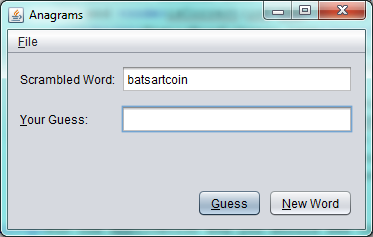

[start=3]
1. When you enter the correctly unscrambled word, you will see this:

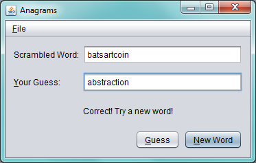

Before porting this application to the NetBeans Platform, we need to think about _the stages in which we want to port our application_. In other words, you do not need to port everything at once. And there are different levels to which you can integrate your application, from a mostly superfical level to a level that aligns your application completely with the paradigms and purposes of the NetBeans Platform. The next section will show the levels of compliance your application can have with the NetBeans Platform.

== Levels of Compliance

Converting an application to be fit for a framework such as the NetBeans Platform can be done on various levels. The integration can be shallow and use just a few integration points or it can be deeper, tightly following the paradigms of the NetBeans Platform.

The stages can be described as follows:

[[section-LevelsOfCompliance-Level0Launchable]]
=== Level 0: Launchable

One or more of the following can be done to make your application launchable with as few changes as possible:

* Enhance your manifest with NetBeans key/value pairs so that your JAR is recognized as an OSGi bundle or as a NetBeans module.
* Set dependencies between modules. In the manifest, with instances of plain Class-Path you can set dependencies between modules.
* Register a menu item in the declarative layer file ( ``layer.xml`` ) of your module, to invoke your original application. This file can be automatically created and populated when the module is compiled, via annotations on Action classes, as you will learn to do later in this tutorial.

In this tutorial, we will do all of the above. We will enhance the manifest, which the module project wizard will do for us. We will create a menu item that will invoke our application. To do so, we will move our application's classes into a module source structure. Then we will create a new Java `ActionListener` for opening the `JFrame` of the application. We will annotate the `ActionListener` to register it in the application's registry as a new menu item. From that action, we will invoke our application.

[[section-LevelsOfCompliance-Level1Integrated]]
==== Level 1: Integrated

Here are some pointers for integrating the application more tightly with the NetBeans Platform:

* Integrate visually to get the benefits of the NetBeans Window System, which is its docking framework.
* Use NetBeans Window System API and the Dialog APIs, primarily the  ``TopComponent``  class and the  ``DialogDisplayer``  class.
* Change initialization code of your application, use the  ``ModuleInstall``  class or declarative registrations, through the layer file or the META-INF/services folder.

In this tutorial, we will move the relevant parts of the  ``JPanel``  from the  ``JFrame``  to a new  ``TopComponent`` . The  ``TopComponent``  class creates a window on the NetBeans Platform, which in our case will show our  ``JPanel`` .

[[section-LevelsOfCompliance-Level2UseCaseSupport]]
==== Level 2: Use Case Support

This level of compliance with the NetBeans Platform is concerned with one or more of the following activities:

* Bind your application to other modules by inspecting existing functionality and trying to use it.
* Simplify the workflow to fit into the NetBeans Platform paradigms.
* Listen to the global selection to discover what other modules are doing and update your state accordingly.

In this tutorial, we will listen for the existence of  `` link:http://bits.netbeans.org/dev/javadoc/org-openide-text/org/openide/cookies/EditorCookie.html[EditorCookie]s`` . A cookie is a _capability_. With a Java interface, your object's capabilities are fixed at compile time, while NetBeans Platform cookies allow your object to behave dynamically because your object can expose capabilities, or not, based on its state. An  ``EditorCookie``  defines an editor, with interfaces for common activities such as opening a document, closing the editor, background loading of files, document saving, and modification notifications.

We will listen for the existence of such a cookie and then we will pass the content of the editor to the  ``TopComponent`` , in the form of words. By doing this, we are doing what the first item above outlines, i.e., inspecting existing functionality and reusing it within the context of our ported application. This is a modest level of integration. However, it pays off because it shows how you can reuse functionality provided by the NetBeans Platform or by any other application created on top of the NetBeans Platform, such as NetBeans IDE.

[[section-LevelsOfCompliance-Level3Aligned]]
==== Level 3: Aligned

In this final stage of your porting activity, you are concerned with the following thoughts, first and foremost:

* Become a good citizen of the NetBeans Platform, by exposing your own state to other modules so that they know what you are doing.
* Eliminate duplicated functionality, by reusing the Navigator, Favorites window, Task List, Progress API, etc., instead of creating or maintaining your own.
* Cooperate with other modules and adapt your application to the NetBeans Platform way of doing things.

Towards the end of this tutorial, we will adopt this level of compliance by letting our  ``TopComponent``  expose a  ``SaveCookie``  when changes are made to the "Guessed Word" text field. By doing this, we will enable the Save menu item under the Tools menu. This kind of integration brings the full benefits of the NetBeans Platform, however it also requires some effort to attain.

== Creating the NetBeans Platform Application

First, let's create the basis of our application. We use a wizard to do so. This is the typical first practical step of creating a new application on top of the NetBeans Platform application.

[start=1]
1. Choose File > New Project (Ctrl-Shift-N). Under Categories, select NetBeans Modules. Under Projects, select NetBeans Platform Application, as shown below:

image::images/porting_73_agp0.png[]

Click Next.

[start=2]
1. Name the application `AnagramApplication`, as shown below:

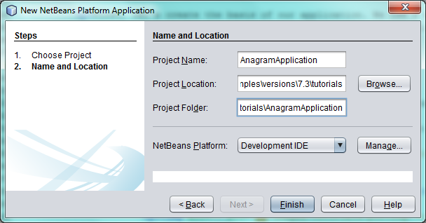

Click Finish. You now have a NetBeans Platform application. You can right-click it and then run it and you will see an empty main window, with a menu bar and a tool bar:

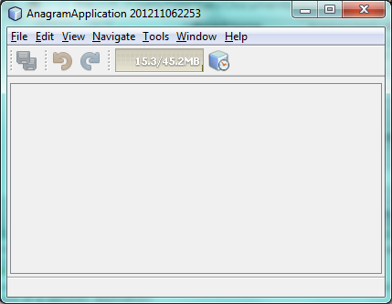

Look under some of the menus, click a few toolbar buttons, and explore the basis of your new application. For example, open the Properties window and the Output window, from the Window menu, and you have the starting point of a complex application:

image::images/porting_73_agp3.png[]

Next, we create a first custom module. We will name it `AnagramCore` because, in the end, it will contain the essential parts of the application. Using subsequent tutorials on the  link:https://netbeans.apache.org/kb/docs/platform.html[NetBeans Platform Learning Trail], we will be able to add more features to the application, none of which will be manadatory parts, since the user will be able to plug them into the application. The core module, however, that is, `AnagramCore`, will be a required module in every distribution of the application.

[start=3]
1. Right-click the application's "Modules" node and choose "Add New...", as shown below:

image::images/porting_73_agp4.png[]

[start=4]
1. Type  ``AnagramGameCore``  in Project Name and accept the default project location, which is the root folder of the application, as shown below:

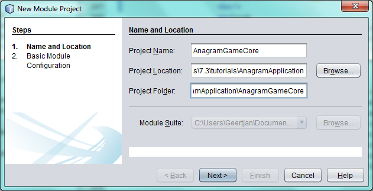

Click Next.

[start=5]
1. Type a unique name in the Code Name Base field, which provides the unique identifier for your module. It could be anything, but here it is  ``com.toy.anagrams.core``  because it is convenient to reproduce the package structure of the original application, which is "com.toy.anagrams.*". Do not click "Generate OSGi Bundle", because in this tutorial you will use the default NetBeans module system.

image::images/porting_73_agp6.png[]

Click Finish. Below the original Anagram Game sample, you should now see the source structure of your new module, as shown here:

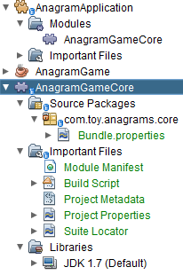

Above, we can see that we now have the original application, together with the module to which it will be ported. In the next sections, we will begin porting the application to the module, using the porting levels described earlier.

== Porting Level 0: Launchable

At this stage, we simply want to be able to launch our application. To do that we will create a menu item that invokes the application. We begin by copying the application's sources into the module source structure.

[start=1]
1. Copy the two packages from the Anagram Game into the module. Below, the new packages and classes in the module are highlighted:

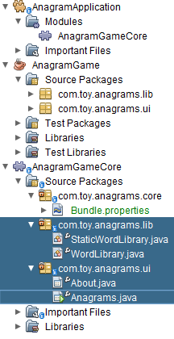

[start=2]
1. In the `com.toy.anagrams.core` package, create a new Java class named `OpenAnagramGameAction`, implementing the standard JDK `ActionListener` class as follows:

[source,java]
----

import com.toy.anagrams.ui.Anagrams;
import java.awt.event.ActionEvent;
import java.awt.event.ActionListener;

public class OpenAnagramGameAction implements ActionListener {

    @Override
    public void actionPerformed(ActionEvent e) {
        new Anagrams().setVisible(true);
    }

}
----

As you can see in the code above, when the user invokes the `OpenAnagramGameAction`, the `JFrame` from the Anagram Game will open.

[start=3]
1. Next, we need to register the new `OpenAnagramGameAction` in the NetBeans central registry, which is also known as the "System FileSystem". We will do this via annotations that will generate entries in the central registry. To use these annotations, the AnagramGameCore module needs to have a library dependency on the module that provides the annotations. Right-click on the module's "Libraries" node and choose "Add Module Dependency", as shown below:

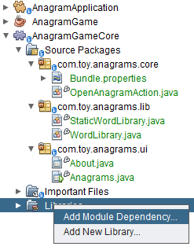

Start typing "ActionRegistration" and you will see that the filter narrows to show the library dependency that provides the `ActionRegistration` class:

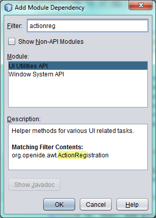

Click OK. Next, add another dependency, this time on the Utilities API, which provides the  ``@Messages``  annotation that you will use below.

[start=4]
1. Now you can annotate your `Action` class as follows:

[source,java]
----

package com.toy.anagrams.core;

import com.toy.anagrams.ui.Anagrams;
import java.awt.event.ActionEvent;
import java.awt.event.ActionListener;
import org.openide.awt.ActionID;
import org.openide.awt.ActionReference;
import org.openide.awt.ActionReferences;
import org.openide.awt.ActionRegistration;
import org.openide.util.NbBundle.Messages;

link:http://bits.netbeans.org/dev/javadoc/org-openide-awt/org/openide/awt/ActionID.html[@ActionID](id="com.toy.anagrams.core.OpenAnagramGameAction",category="Window")
link:http://bits.netbeans.org/dev/javadoc/org-openide-awt/org/openide/awt/ActionRegistration.html[@ActionRegistration](displayName = "#CTL_OpenAnagramGameAction")
link:http://bits.netbeans.org/dev/javadoc/org-openide-awt/org/openide/awt/ActionReferences.html[@ActionReferences]({
link:http://bits.netbeans.org/dev/javadoc/org-openide-awt/org/openide/awt/ActionReference.html[@ActionReference](path = "Menu/Window", position = 10)
})
link:http://bits.netbeans.org/dev/javadoc/org-openide-util/org/openide/util/NbBundle.Messages.html[@Messages]("CTL_OpenAnagramGameAction=Open Anagram Game")
public class OpenAnagramGameAction implements ActionListener {
    
    @Override
    public void actionPerformed(ActionEvent e) {
        new Anagrams().setVisible(true);
    }
    
}
----

[start=5]
1. In the Projects window, right-click the AnagramApplication project node and choose Run. The application starts up, installing all the modules provided by the application, which includes our custom module.

[start=6]
1. Under the Window menu, you should find the menu item "Open Anagram Game", as shown below:

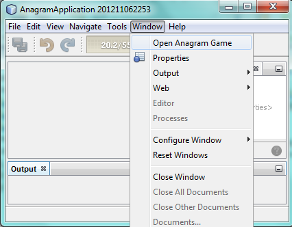

Click "Open Anagram Game" and your application appears, as before.

The application is displayed, but note that it is not well integrated with the NetBeans Platform. For example, it is not modal and it is impossible to close the `JFrame`, unless you close the application. The latter is because the application now manages the lifecycle of the `JFrame`. In the next section, we will integrate the Anagram Game more tightly with the NetBeans Platform.

== Porting Level 1: Integration

In this section, we integrate the application more tightly by creating a new window, so that we have a user interface, that is, a window, to which we can move those contents of the  ``JFrame``  that are useful to our new application.

[start=1]
1. Right-click the `com.toy.anagrams.core` package in the Projects window and then choose New > Other. Under Categories, select Module Development. Under File Types, select Window:

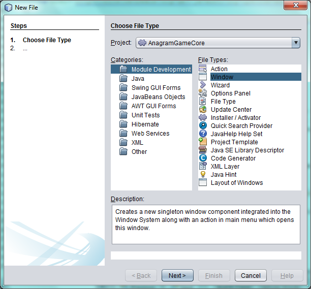

Click Next.

[start=2]
1. Choose the position where you would like the window to appear. For purposes of this tutorial choose "editor", which will place the Anagram Game in the main part of the application. Also check the first checkbox, to specify that the window should open automatically when the application starts up:

image::images/porting_73_agw1.png[]

Click Next.

[start=3]
1. Type  ``Anagram``  in Class Name Prefix and select  ``com.toy.anagrams.core``  in Package, as shown here:

image::images/porting_73_agw2.png[]

Above, notice that the IDE shows the files it will create and modify.

[start=4]
1. Click Finish. Now you have a new Java class named "AnagramGameTopComponent.java". Double-click it and the Matisse GUI Builder opens. You can use the GUI Builder to design your windows:

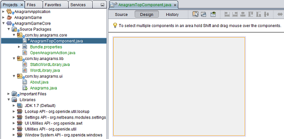

[start=5]
1. Open the  ``Anagrams``  class in the `com.toy.anagrams.ui` package. Click within the Anagrams in the GUI Builder until you see an orange line around the `JPanel`, as shown below:

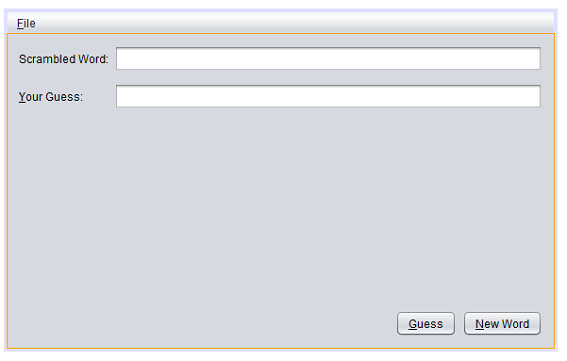

[start=6]
1. When you see the orange line around the `JPanel`, as shown above, right-click it and choose "Copy". Then paste the `JPanel` into the `AnagramTopComponent` and you should see the old user interface in your new `AnagramTopComponent` class:

image::images/porting_73_agw5.png[]

[start=7]
1. You have now ported the user interface of the Anagram Game. A few variables need still to be moved from the `Anagrams` class to the new `AnagramTopComponent` class. Declare these two, which are in the `Anagrams` class, at the top of your new `AnagramTopComponent` class.

[source,java]
----

private int wordIdx = 0;
private WordLibrary wordLibrary;
----

Next, look in the constructor of the `Anagrams` class. The first line in the constructor is as follows:

[source,java]
----

wordLibrary = WordLibrary.getDefault();
----

Copy that statement. Paste it into the `TopComponent` class, making it the new first statement in the constructor of the `TopComponent` class.

Make sure to add the import statement for the  ``WordLibrary``  class to the import section at the top of the class:

[source,java]
----

import com.toy.anagrams.lib.WordLibrary;
----

[start=8]
1. Run the application again. When the application starts up, you should now see the Anagram Game window, which you defined in this section. You will also find a new menu item that opens the window, under the Window menu. Also notice that the game works as before. You need to click the "New Word" button once, to have the module call up a new word, and then you can use it as before:

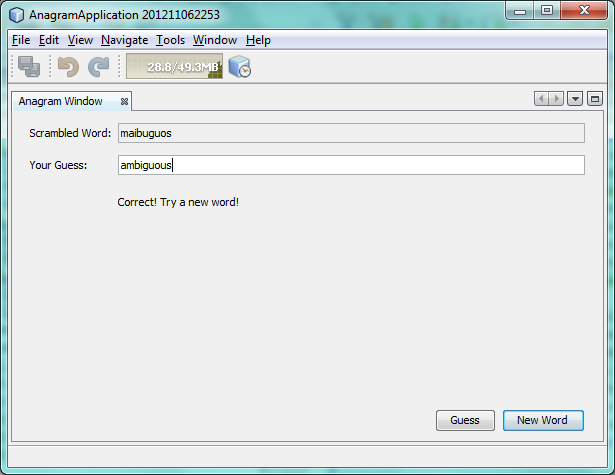

As a final step in this section, you can simply delete the `com.toy.anagrams.ui` package. That package contains the two UI classes from the original Anagram Game. You do not need either of these two classes anymore. Simply delete the package that contains them, since you have ported everything of interest to the NetBeans Platform. Then also delete the `OpenAnagramGameAction` class, since this class is not needed because the `AnagramTopComponent` provides its own `Action` for opening the window.

== Porting Level 2: Use Case Support

In this section, we are concerned with listening to the global selection and making use of data we find there. The global selection is the registry for global singletons and instances of objects which have been registered in the system by modules. Here we query the lookup for  `` link:http://bits.netbeans.org/dev/javadoc/org-openide-text/org/openide/cookies/EditorCookie.html[EditorCookie]`` s and make use of the  ``EditorCookie`` 's document to fill the string array that defines the scrambled words displayed in the  ``TopComponent`` .

A cookie is a capability. With a Java interface, your object's capabilities are fixed at compile time, while NetBeans Platform cookies allow your object to behave dynamically because your object can expose capabilities, or not, based on its state. An `EditorCookie` defines an editor, with interfaces for common activities such as opening a document, closing the editor, background loading of files, document saving, and modification notifications. We will listen for the existence of such a cookie and then we will pass the content of the editor to the TopComponent, in the form of words. By doing this, we are inspecting existing functionality and reusing it within the context of our ported application. This is a modest level of integration. However, it pays off because you are reusing functionality provided by the NetBeans Platform.

[start=1]
1. We begin by tweaking the  ``StaticWordLibrary``  class. We do this so that we can set its list of words externally. The sample provides a hardcoded list, but we want to be able to set that list ourselves, via an external action. Therefore, add this method to  ``StaticWordLibrary`` :

[source,java]
----

public static void setScrambledWordList(String[] inScrambledWordList) {
    SCRAMBLED_WORD_LIST = inScrambledWordList;
}
----

NOTE:  Importantly, change the class signature of  ``StaticWordLibrary``  to `public class` and remove the `final` from the signature of `SCRAMBLED_WORD_LIST`

Next, we will create an action that will obtain the content of a Manifest file, break the content down into words, and fill the  ``SCRAMBLED_WORD_LIST``  string array with these words.

[start=2]
1. As you learned to do in the previous section, set library dependencies on the Text API and the Nodes API.

[start=3]
1. Create a Java class named `SetScrambledAnagramsAction`, in the `com.toy.anagrams.core` package, and define it as follows:

[source,java]
----

package com.toy.anagrams.core;

import com.toy.anagrams.lib.StaticWordLibrary;
import java.awt.event.ActionEvent;
import java.awt.event.ActionListener;
import javax.swing.text.BadLocationException;
import javax.swing.text.StyledDocument;
import org.openide.awt.ActionID;
import org.openide.awt.ActionReference;
import org.openide.awt.ActionReferences;
import org.openide.awt.ActionRegistration;
import org.openide.cookies.EditorCookie;
import org.openide.util.Exceptions;
import org.openide.util.NbBundle.Messages;
import org.openide.windows.TopComponent;
import org.openide.windows.WindowManager;

link:http://bits.netbeans.org/dev/javadoc/org-openide-awt/org/openide/awt/ActionID.html[@ActionID](id="com.toy.anagrams.core.SetScrambledAnagramsAction",category="Window")
link:http://bits.netbeans.org/dev/javadoc/org-openide-awt/org/openide/awt/ActionRegistration.html[@ActionRegistration](displayName = "#CTL_SetScrambledAnagramsAction")
link:http://bits.netbeans.org/dev/javadoc/org-openide-awt/org/openide/awt/ActionReferences.html[@ActionReferences]({
link:http://bits.netbeans.org/dev/javadoc/org-openide-awt/org/openide/awt/ActionReference.html[@ActionReference](path = "Editors/text/x-manifest/Popup", position = 10)
})
link:http://bits.netbeans.org/dev/javadoc/org-openide-util/org/openide/util/NbBundle.Messages.html[@Messages]("CTL_SetScrambledAnagramsAction=Set Scrambled Words")
public final class SetScrambledAnagramsAction implements ActionListener {

    private final EditorCookie context;

    public SetScrambledAnagramsAction(EditorCookie context) {
        this.context = context;
    }

    @Override
    public void actionPerformed(ActionEvent ev) {
        try {
            *//Get the EditorCookie's document:*
            StyledDocument doc = context.getDocument();
            *//Get the complete textual content:*
            String all = doc.getText(0, doc.getLength());
            *//Make words from the content:*
            String[] tokens = all.split(" ");
            *//Pass the words to the WordLibrary class:*
            StaticWordLibrary.setScrambledWordList(tokens);
            *//Open the TopComponent:*
            TopComponent win = WindowManager.getDefault().findTopComponent("AnagramTopComponent");
            win.open();
            win.requestActive();
        } catch (BadLocationException ex) {
            Exceptions.printStackTrace(ex);
        }
    }

}
----

[start=4]
1. As discussed above, when we run the application, we want to be able to right-click within a Manifest file, choose a menu item, and invoke our Action. Right now, however, the NetBeans Platform is unable to distinguish Manifest files from any other file. Therefore, we need to enable Manifest support in our application. For demonstration purposes, we will enable ALL the modules in the NetBeans Platform, as well as those provided by NetBeans IDE. As a result, when we run the application, a new instance of NetBeans IDE will start up, together with our custom module. To achieve the above, expand the Important Files node in the AnagramApplication, then open the NetBeans Platform Config file, which on disk is named `platform.properties`. Notice that many modules have been disabled. You can enable them via the Project Properties dialog of the NetBeans Platform application. Since we are simply going to enable ALL of them, we need only change the content of the `platform.properties` file to the following:

[source,java]
----

branding.token=anagramapplication
cluster.path=\
    ${nbplatform.active.dir}/apisupport:\
    ${nbplatform.active.dir}/harness:\
    ${nbplatform.active.dir}/ide:\
    ${nbplatform.active.dir}/java:\
    ${nbplatform.active.dir}/nb:\
    ${nbplatform.active.dir}/platform:\
    ${nbplatform.active.dir}/profiler:\
    ${nbplatform.active.dir}/websvccommon
disabled.modules=
nbplatform.active=default
----

In the next step, when we run the application, all the groups of modules (called "clusters") will be enabled, nothing will be excluded, and you will see NetBeans IDE started up.

[start=5]
1. Build the application by right-clicking it and choosing "Clean and Build". After you have done so, run the application. Go to the Window menu and choose Favorites. In the Favorites window, browse to a Manifest file. Open the file. Inside the file, i.e., in the Manifest Editor, right-click, and invoke the Set Scrambled Words action via the menu item.

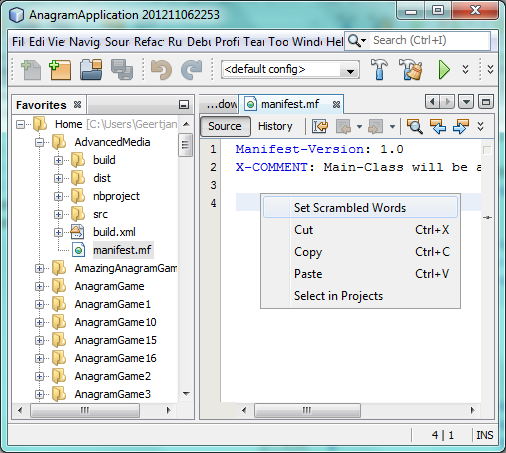

The `AnagramTopComponent` is displayed and, when you click the Next Word button, you will see that the scrambled words all come from the selected Manifest file.

image::images/porting_73_age1.png[]

The result of this exercise is that you now see the content of the Manifest file in the Scrambled Word text field. Of course, these words are not really scrambled and you cannot really unscramble them. However, your module is making use of the content of a file that is supported by a different set of modules altogether, that is, the Manifest support modules, as well as related editor modules.

Optionally, before continuing, you can now remove all the groups of modules (known as "clusters") provided by NetBeans IDE, which may not be relevant for your own application. To do so, right-click the `AnagramApplication` node in the Projects window, choose Properties, go to the Libraries tab, and uncheck all the checkboxes, except for `platform`. Run the application again and you will see that all the project-related and editor-related features of the application have now been removed.

== Porting Level 3: Aligned

In this section, we are concerned with becoming a "good citizen" of the NetBeans Platform. We are going to expose the state of the TopComponent to the other modules, so that we can cooperate with them.

As an example of this, we will modify the TopComponent to offer a  ``SaveCookie`` , which gives the user a way to store the text typed in the text field. By offering the  ``SaveCookie``  when changes are made in the text field, the Save button and the Save menu item under the File menu will become enabled. That is because the NetBeans Platform provides a context-sensitive Action called `SaveAction`. The `SaveAction` becomes enabled whenever the capability of being saved, in other words, the `SaveCookie`, is available. In this case, we will make the `SaveCookie` available whenever the user types something in the `guessedWord` text field. Then the `SaveAction` will automatically become enabled.

When the user selects the enabled button or menu item, a dialog will be displayed and the button and menu item will become disabled, until the next time that a change is made to the text field.

[start=1]
1. Begin by setting a library dependency on the Dialogs API, which you learned to do in the previous sections.

[start=2]
1. Next, we define an implementation of the `SaveCookie`, somewhere within the `AnagramTopComponent` class:

[source,java]
----

private class SaveCookieImpl implements SaveCookie {

    @Override
    public void save() throws IOException {

        Confirmation msg = new NotifyDescriptor.Confirmation("Do you want to save \""
                + guessedWord.getText() + "\"?", NotifyDescriptor.OK_CANCEL_OPTION,
                NotifyDescriptor.QUESTION_MESSAGE);

        Object result = DialogDisplayer.getDefault().notify(msg);

        //When user clicks "Yes", indicating they really want to save,
        //we need to disable the Save button and Save menu item,
        //so that it will only be usable when the next change is made
        //to the text field:
        if (NotifyDescriptor.YES_OPTION.equals(result)) {
            fire(false);
            //Implement your save functionality here.
        }

    }

}
----

We have not defined the `fire` method yet, so the related statement above will be underlined in red until we do so.

[start=3]
1. In the constructor, call the as-yet-undefined `fire` method, passing in true this time, whenever a change is detected in the `guessedWord` text field:

[source,java]
----

guessedWord.getDocument().addDocumentListener(new DocumentListener() {

    @Override
    public void insertUpdate(DocumentEvent arg0) {
        fire(true);
    }

    public void removeUpdate(DocumentEvent arg0) {
        fire(true);
    }

    public void changedUpdate(DocumentEvent arg0) {
        fire(true);
    }

});
----

[start=4]
1. Now we declare an ` link:http://bits.netbeans.org/dev/javadoc/org-openide-util-lookup/org/openide/util/lookup/InstanceContent.html[InstanceContent]` at the top of the class. The `InstanceContent` class is a very powerful class in the NetBeans Platform, enabling you to update the Lookup on the fly, at runtime. We also declare the implementation of our `SaveCookie`:

[source,java]
----

InstanceContent ic;
SaveCookieImpl impl;
----

[start=5]
1. Next, at the end of the constructor, we instantiate the `SaveCookie` and the `InstanceContent`, while adding the `InstanceContent` to the `Lookup` of the `AnagramTopComponent`:

[source,java]
----

impl = new SaveCookieImpl();

ic = new InstanceContent();

associateLookup(new AbstractLookup(ic));
----

[start=6]
1. Now we can add the `fire` method, which dynamically adds and removes the `SaveCookie` from the `InstanceContent`:

[source,java]
----

public void fire(boolean modified) {
    if (modified) {
        //If the text is modified,
        //we add the SaveCookie implementation
        //to the InstanceContent, which
        //is in the Lookup of the TopComponent:
        ic.add(impl);
    } else {
        //Otherwise, we remove the SaveCookie
        //from the InstanceContent:
        ic.remove(impl);
    }
}
----

[start=7]
1. Run the application again. Make a change in the "Guessed Word" text field and notice that the Save menu item is enabled:

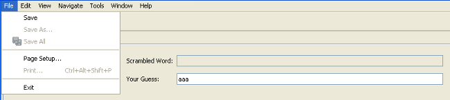

Click the menu item, click the "OK" button in the dialog...

image::images/porting_70_ageditorcookie5.png[]

...and notice that the Save menu item is disabled afterwards.

Congratulations! Now that your application is making use of existing NetBeans Platform functionality, you have taken one further step in successfully aligning it with the NetBeans Platform. Other modules can be now be plugged into the NetBeans Platform to take advantage of, or even extend, features added by your application. Hence, not only can your application benefit from what the NetBeans Platform provides, but you can create features that other modules can use as well.

== Porting Tips &amp; Tricks

There are several next steps one can take at this point, aside from further aligning the application with the NetBeans Platform, as outlined above:

* *Attain a thorough understanding of what the NetBeans Platform provides.* As you port your application, you will learn more and more about the various features that the NetBeans Platform makes available. A central problem is that the NetBeans Platform is quite large and attaining a thorough overview of all that it offers can be a lengthy process. A quick shortcut is to download and print out the  link:http://refcardz.dzone.com/refcardz/netbeans-platform-70[NetBeans Platform 7.0 Refcard], which is a free DZone document that highlights all the NetBeans Platform benefits, features, APIs, and many tips and tricks in an easy to digest format.
* *Become aware of the differences between standard Swing applications and the NetBeans Platform.* For the most part, the standard Swing approach to creating a user interface will continue to work for your NetBeans Platform application. However, the NetBeans Platform approach is better, easier, or both in some cases. One example is that of the NetBeans Dialogs API. The standard Swing approach, via, for example, the  ``JOptionsPane`` , works OK, but using the NetBeans Dialogs API is easier, because it automatically centers your dialog in the application and allows you to dismiss it with the ESC key. Using the Dialogs API also lets you plug in a different DialogDisplayer, which can make it easier to customize or test your application.

Below is a list of the principle differences between the typical Swing approach and that of the NetBeans Platform:

* Loading of images
* Loading of resource bundles and localized string
* Assigning of mnemonics to labels and buttons
* Showing dialogs

For details on all of the above items, read this FAQ:  link:https://netbeans.apache.org/wiki/devfaqnbideosyncracies[Common calls that should be done slightly differently in NetBeans than standard Swing apps (loading images, localized strings, showing dialogs)].

In addition, note that, since the NetBeans Platform now handles the lifecycle of your module, since it is now part of the whole application, you can no longer use  ``System.exit`` . Instead, you need to use  ``LifecycleManager`` . To run code on start up, which should only be done when absolutely necessary, you need to use the NetBeans  ``ModuleInstall``  class and, specifically, its  ``restored``  method. A useful reference in this context is  link:http://www.ociweb.com/jnb/jnbOct2005.html#porting[Porting a Java Swing Application to the NetBeans Platform], by Tom Wheeler, in  link:http://www.ociweb.com/jnb/jnbOct2005.html#porting[Building A Complete NetBeans Platform Application].

* *Create a module project for each distinct part of your application.* The NetBeans Platform provides a modular architecture out of the box. Break your application into one or more modules. Doing so requires some analysis of your original application and an assessment of which parts could best fit within a new module and how to communicate between them. Since the example in this tutorial was simple, we only needed one module. A next step might be to put the  ``WordLibrary``  class in a separate module and expose it as a public API. The  ``StaticWordLibrary``  would be put into another module, providing an implementation of the  ``WordLibrary``  API. Doing so would let other modules provide user interfaces on top of the API provided by the first module, without depending in any way on the implementations.

As shown above, you need to put the modules in a module suite. Then set a dependency in the plugin module on the API module, using the Libraries panel in the plugin module's Project Properties dialog box. The size of each module, i.e., when one should create a new module or continue developing within an existing one, is a question of debate. Smaller is better, in general.

* *Always keep reevaluating what you really need to port.* Look at the NetBeans Platform and decide where there is overlap with your own application. Where there is overlap, such as the menu bar and About box, decide what you want to do. Typically, you want to leverage as much as possible from the NetBeans Platform. Therefore, you would port as little as possible from your own application, while keeping as much of it as is useful to you.
* *Move distinct parts of your user interface to one or more TopComponents.* On the NetBeans Platform, the  ``TopComponent``  class provides the top level Swing container. In effect, it is a window. Move the user interface from your original application to one or more of these windows and discard your original  ``JFrame`` s.
* *Copy the Java classes that do not provide user interface elements.* We simply copied the original  ``WordLibrary.java``  class. You can do the same with the model of your own Swing applications. You might need to tweak some code to smoothen the transition between the old Swing application and the new NetBeans Platform application, but (as in the case shown in this tutorial) this might not even be necessary.
* *Learn from others.* Aside from joining the dev@platform.netbeans.org mailing list, also read the following two crucial articles:
*  link:http://netbeans.dzone.com/10-tips-4-porting-2-netbeans[Top 10 Tips for Porting to the NetBeans Platform]
*  link:http://java.dzone.com/news/how-to-split-into-modules[How to Split an Application into Modules?]
* *Watch the Top 10 NetBeans APIs Screencast.* The  link:https://netbeans.apache.org/tutorials/nbm-10-top-apis.html[screencast series] gives a good overview of the NetBeans Platform, with many useful code snippets and coding patterns.
link:http://netbeans.apache.org/community/mailing-lists.html[Send Us Your Feedback]

== Next Steps

For more information about creating and developing NetBeans modules, see the following resources:

*  link:https://netbeans.apache.org/kb/docs/platform.html[Other Related Tutorials]
*  link:https://bits.netbeans.org/dev/javadoc/[NetBeans API Javadoc]
