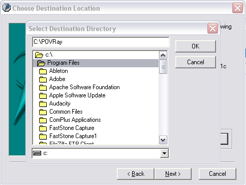

// 
//     Licensed to the Apache Software Foundation (ASF) under one
//     or more contributor license agreements.  See the NOTICE file
//     distributed with this work for additional information
//     regarding copyright ownership.  The ASF licenses this file
//     to you under the Apache License, Version 2.0 (the
//     "License"); you may not use this file except in compliance
//     with the License.  You may obtain a copy of the License at
// 
//       http://www.apache.org/licenses/LICENSE-2.0
// 
//     Unless required by applicable law or agreed to in writing,
//     software distributed under the License is distributed on an
//     "AS IS" BASIS, WITHOUT WARRANTIES OR CONDITIONS OF ANY
//     KIND, either express or implied.  See the License for the
//     specific language governing permissions and limitations
//     under the License.
//

= Writing POV-Ray Support for NetBeans X—Conclusion
:jbake-type: platform_tutorial
:jbake-tags: tutorials 
:jbake-status: published
:syntax: true
:source-highlighter: pygments
:toc: left
:toc-title:
:icons: font
:experimental:
:description: Writing POV-Ray Support for NetBeans X—Conclusion - Apache NetBeans
:keywords: Apache NetBeans Platform, Platform Tutorials, Writing POV-Ray Support for NetBeans X—Conclusion

This is a continuation of the tutorial for building POV-Ray support for NetBeans. If you have not read the  link:nbm-povray-1.html[first],  link:nbm-povray-2.html[second],  link:nbm-povray-3.html[third],  link:nbm-povray-4.html[fourth],  link:nbm-povray-5.html[fifth],  link:nbm-povray-6.html[sixth],  link:nbm-povray-7.html[seventh],  link:nbm-povray-8.html[eighth], and  link:nbm-povray-9.html[ninth] parts of this tutorial, you may want to start there.

At this stage, you have completed the application, which should look like this:

[.feature]
--
image::images/povray_71_ch7_pic2.png[role="left", link="images/pic1.png"]
--

Additional steps to take to improve and enhance the application:

* Test your application. (See the  link:https://netbeans.apache.org/tutorials/nbm-test.html[Test Infrastructure Tutorial].)
* Hide the menus and toolbar buttons that you don't need in your application.
* Add a Plugin Manager so that users can install new features at runtime.
* Localize the application.
* Customize the display text in the title bar.
* Customize the splash screen, icons, and NetBeans Platform display texts.
* Create an installer.

== Key Points

We now have our POV-Ray rendering application working exactly as we want. During the course of this tutorial, many NetBeans Platform topics have been covered. Here they are listed, per part:

* Part 1:  link:nbm-povray-1.html[Application Structure &amp; File Support]—Here you learn how to set up a NetBeans Platform application, how to create modules, and how the NetBeans Platform distinguishes between different types of files.
* Part 2:  link:nbm-povray-2.html[Project Type Design]—Before beginning to code, you spend some time examining the requirements of the application and how you will implement those requirements.
* Part 3:  link:nbm-povray-3.html[Implementing a Project Type]—Here you learn how the NetBeans Platform is able to recognize a set of folders and files on disk as being POV-Ray projects. By the end of this section, you're able to open POV-Ray projects into your application.
* Part 4:  link:nbm-povray-4.html[Providing Project Templates]—You install your POV-Ray Project module into NetBeans IDE, so that the IDE is able to recognize POV-Ray projects. You then create some POV-Ray projects and create project template wizards, registering them in the module so that they're available to your users via the New Project dialog.
* Part 5:  link:nbm-povray-5.html[Creating an API]—Here you create a provider of main files, a rendering service, and a viewing service. You are shown how to encapsulate these interfaces in a separate module, how to load that module on demand, and how to share it with the other two modules in the application. A first usage of one of the APIs is described—the  ``Node``  of a POV-Ray file will be bold-faced if the main file provider indicates that the  ``Node``  represents the main file of the project.
* Part 6:  link:nbm-povray-6.html[Implementing the API]—In this section, you learn how implement the APIs created in the previous part, you add  ``Actions``  to the  ``Node``  for setting the main file and for rendering POV-Ray files, and you add some plumbing code for locating the POV-Ray executable.
* Part 7:  link:nbm-povray-7.html[Support For Running POV-Ray]—For the first time, you actually begin working directly with the POV-Ray executable. By the end of this section, you're able to actually render POV-Ray files and display the rendered images.
* Part 8:  link:nbm-povray-8.html[Implementing ViewService and its Actions]—An  ``Action``  for opening images, and rendering them if they don't already exist, is added. You're also introduced to the topic of icon badging, which you use to distinguish between  ``Nodes``  representing files that have been rendered and those that represent files that haven't been rendered.
* Part 9:  link:nbm-povray-9.html[Build Support]—You now move away from working with the  ``Node``  representing POV-Ray files. Instead, you work on the project node and add new project actions, for rendering the main file of the POV-Ray project, for setting the main file if it has not been set, and for closing the project.

== Next Steps

Now that you have completed the POV-Ray tutorial, what should you do next?

* With the concepts you've learned and applied in this tutorial, take another look at the * link:http://wiki.netbeans.org/NbmIdioms[Introduction to NetBeans Idioms and Infrastructure]*, which reinforces a lot of the concepts you have encountered in this tutorial.
* Explore the  link:https://netbeans.apache.org/wiki/[NetBeans Developer FAQ], focusing on the specific topics you're interested in.
* Gain some more practical experiences by joining one of the many NetBeans Platform open source projects:  link:http://web.archive.org/web/20170410015153/https://java.net/projects/netbeans[http://java.net/projects/netbeans]
* Stay in tune with the latest NetBeans API changes, by looking through this page now and again:  link:http://bits.netbeans.org/dev/javadoc/apichanges.html[http://bits.netbeans.org/dev/javadoc/apichanges.html]
* As you learn more about the NetBeans Platform, blog about your experiences. You can publish or republish your blog entries, articles, tips, or any other thoughts here on NetBeans Zone:  link:http://netbeans.dzone.com/[http://netbeans.dzone.com/]
* When you have an application ready, ask for it to be added to the  link:https://netbeans.apache.org/platform/screenshots.html[NetBeans Platform Showcase], which is a great page to look through when beginning your project, since more than likely a similar project that you can learn from, possibly in the open source community, already exists.
* Read and work through the  link:https://netbeans.apache.org/tutorials/nbm-porting-basic.html[NetBeans Platform Porting Tutorial] and apply its principles to your own existing applications.

== Appendix: Setting Up POV-Ray

Mac users may find  link:http://darwinports.opendarwin.org/[DarwinPorts] the easiest way—simply install DarwinPorts and then run `sudo port install povray`.

Linux and other Unix users should be fine with the downloads available from  link:http://povray.org/[povray.org]. Everything should work out of the box for these users, without any tweaks or post-install configurations. Make sure, however, that the POV-Ray launcher has the correct permissions, otherwise it will not execute. Run it from the command line to check that it executes.

Under Windows, life is slightly more complicated. Take the following steps to set up POV-Ray:

[start=1]
1. Download the newest stable version of POV-Ray for Windows:  link:http://povray.org/download[http://povray.org/download]

[start=2]
1. 
Run the downloaded file and install into "C:\POVRay" or some other directory, while making sure that the path has no spaces, even though the installer will prompt you to install in a directory with spaces. For example, change the suggested destination directory to "C:\POVRay", as shown here:

NOTE:  Do not let the installer install the application into the destination directory "C:\Program Files" or into any of that directory's subfolders.

NOTE:  Read the above note again.

[start=3]
1. Open the POV-Ray application. Do the following:
* 
Disable I/O restrictions to avoid input and output warnings on each render: Options | Script I/O Restrictions | No Restrictions.

image::images/povray_71_ch10_pov-windows-2.png[]

* To facilitate smooth interoperability with the plugin that you will create, ensure that POV-Ray will exit when rendering completes: Render | On Completion | Exit POV-Ray for Windows.

image::images/povray_71_ch10_pov-windows-3.png[]

NOTE:  POV-Ray for Windows cannot process paths with spaces. When you use the application that you will create to create POV-Ray projects, make sure that you create them in directories without spaces in their paths. The name of the project must not have any spaces either.

