// 
//     Licensed to the Apache Software Foundation (ASF) under one
//     or more contributor license agreements.  See the NOTICE file
//     distributed with this work for additional information
//     regarding copyright ownership.  The ASF licenses this file
//     to you under the Apache License, Version 2.0 (the
//     "License"); you may not use this file except in compliance
//     with the License.  You may obtain a copy of the License at
// 
//       http://www.apache.org/licenses/LICENSE-2.0
// 
//     Unless required by applicable law or agreed to in writing,
//     software distributed under the License is distributed on an
//     "AS IS" BASIS, WITHOUT WARRANTIES OR CONDITIONS OF ANY
//     KIND, either express or implied.  See the License for the
//     specific language governing permissions and limitations
//     under the License.
//

= NetBeans Platform Runtime Container Tutorial
:jbake-type: platform_tutorial
:jbake-tags: tutorials 
:jbake-status: published
:syntax: true
:source-highlighter: pygments
:toc: left
:toc-title:
:icons: font
:experimental:
:description: NetBeans Platform Runtime Container Tutorial - Apache NetBeans
:keywords: Apache NetBeans Platform, Platform Tutorials, NetBeans Platform Runtime Container Tutorial

This tutorial covers the most fundamental concept in the NetBeans Platform—the runtime container. The runtime container is the execution environment for the modules that define a NetBeans Platform application. It consists of six modules provided by the NetBeans Platform. In this tutorial, we will look at these six modules, and use them in a very simple modular application.

Before going further, you can watch this video series, which covers the same material as the rest of this tutorial:  link:nbm-10-top-apis.html[Top 10 NetBeans APIs]

NOTE: This document uses NetBeans Platform 7.2 and NetBeans IDE 7.2. If you are using an earlier version, see  link:71/nbm-runtime-container.html[the previous version of this document].

== Introduction to the Runtime Container

The "NetBeans runtime container" is the collective name for these NetBeans Platform modules:

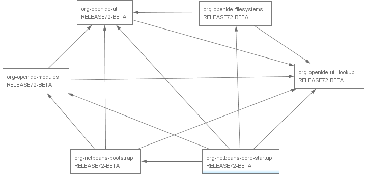

Brief overview of each of these six modules:

* Startup (org-netbeans-core-startup)—Provides the main method of your application, as well as all the code needed for starting it up.
* Bootstrap (org-netbeans-bootstratp)—Enables the runtime container to understand what a module is and how to load and compose them into one application.
* Filesystem API (org-openide-filesystems)—Gives your application a virtual filesystem.
* Module System API (org-openide-modules)—Gives you access to the lifecycle of the modules in your application.
* Lookup API (org-openide-util-lookup)—Provides a generic communication mechanism for inter-modular interaction.
* Utilities API (org-openide-util)—Includes several utility classes shared between the other modules in the runtime container.

== Setting up the Runtime Container

In this section, we will create an absolutely minimal NetBeans Platform application. It will consist of only those modules that every NetBeans Platform application must have—the six modules that make up the runtime container. Once we have created an application that consists of nothing more than these six modules, we will run it. There will be no specific output from this application. However, it will build and run successfully because all the fundamental requirements of a NetBeans Platform application will have been met.

[start=1]
1. Go to File > New Project. In the New Project dialog, choose NetBeans Modules > NetBeans Platform Application:

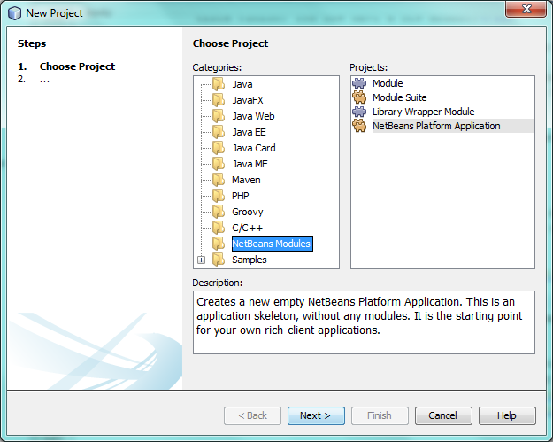

Click Next.

[start=2]
1. Name your application 'HelloWorld' and specify where to store it:

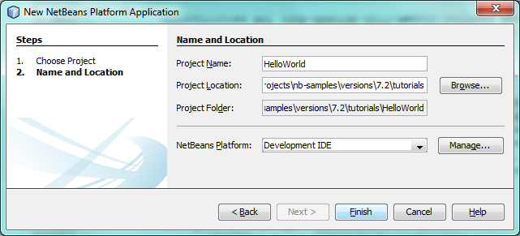

Click Finish. You now have your first NetBeans Platform application:

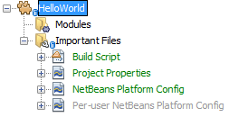

[start=3]
1. Right-click the main project node in the Projects window, choose Properties, and go to the Libraries tab. There you can see all the modules that are part of this application:

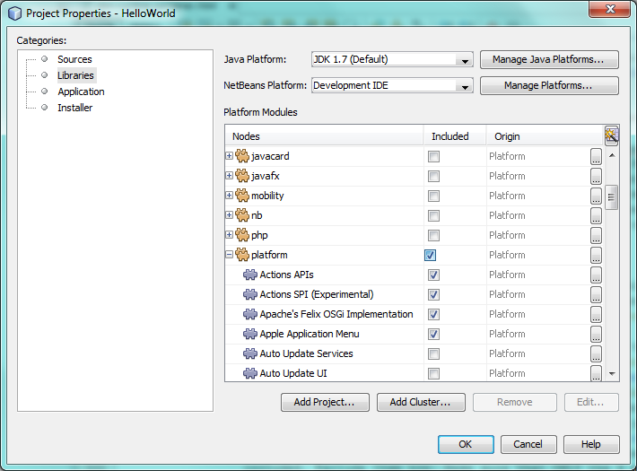

NOTE:  Notice that the template you used in step 1 above preselected several modules for you. Also notice that the preselected modules all come from the "platform" cluster.

In addition to the six modules making up the runtime container, many other modules are included. We are going to exclude them in the next step because the purpose of this tutorial is to create a minimal NetBeans Platform application, that is, one that contains nothing more than the runtime container.

[start=4]
1. Click the checkbox next to "platform". Now all modules are unselected, that is, there are now no modules in the application. Next, scroll down the list, find "Startup", and click the corresponding checkbox, as shown below: 

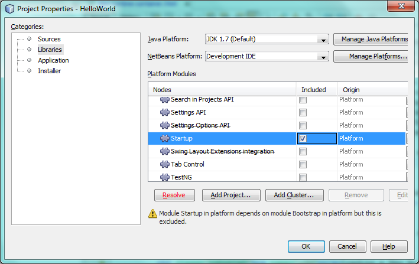

Click the Resolve button, because the Startup module depends on code found in five other modules, that is, the other modules making up the runtime container. Now you should see that the Resolve button disappears, together with the warning messages:

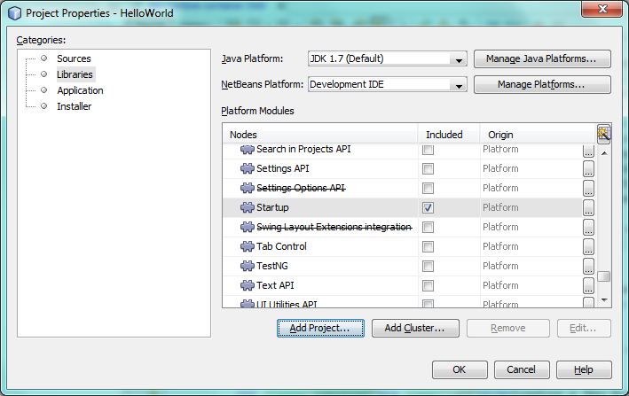

Scroll up and down the list and notice that ONLY the six modules that make up the runtime container are included.

You now have a minimal NetBeans Platform application. It does not contain a user interface. It has six modules that provide the low level plumbing mandatory in any NetBeans Platform application.

Right-click the application and choose Run. The application successfully executes but doesn't do or display anything special yet.

== Loading a New Module into the Runtime Container

In this section, we add one custom module to the NetBeans runtime container. The custom module will do nothing special; it will only print a message to System.out. The only reason for adding the custom module will be so that you can see that it will be an equal partner to the existing six modules in your application. At the end of this section, you will have seven modules instead of the six that you already have, that is, you will have included your own custom module.

[start=1]
1. Right-click the application's Modules node and choose 'Add New...'.

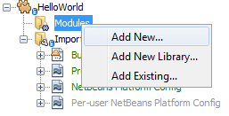

[start=2]
1. Give your module a project name, such as 'HelloModule' and specify a location to store the module:

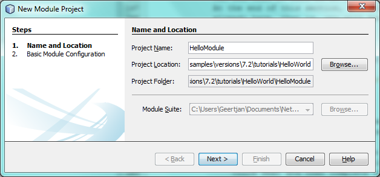

Click Next.

[start=3]
1. Specify a code name base, which is a unique string that identifies the module: 

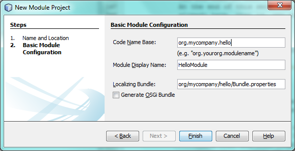

Click Finish. You now have a new module:

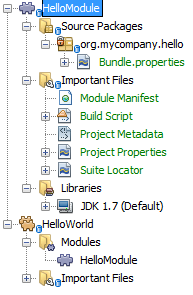

[start=4]
1. Right-click the module, choose New > Other, and then choose Module Development > Installer/Activator: 

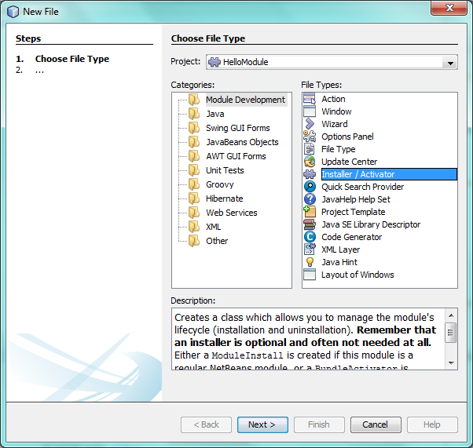

Click Next.

[start=5]
1. Click Finish below to complete the wizard: 

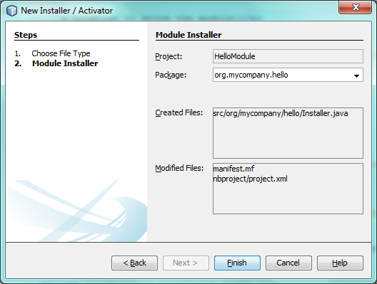

You now have a new class that extends the NetBeans ModuleInstall class, which is from the Module System API.

[start=6]
1. Add a new 'System.out.println' message in the 'restored' method of the Installer class, as shown in the highlighted line below:

[source,java]
----

package org.mycompany.hello;

import org.openide.modules.ModuleInstall;

public class Installer extends ModuleInstall {

    @Override
    public void restored() {
        *System.out.println("hello world!");*
    }
    
}
----

[start=7]
1. Run the application again and notice the 'Hello World' message in the application's output, in the Output window, which can be opened from the Window menu. The end of the stack trace, which includes the 'hello world' message, should be something like this:

[source,java]
----

org.mycompany.hello.netbeans:
Generating Auto Update information for org.mycompany.hello
run:
run.run:
-------------------------------------------------------------------------------
*hello world!*
>Log Session: Friday, July 6, 2012 7:43:41 PM CEST
>System Info: 
  Product Version         = HelloWorld 201206240002
  Operating System        = Windows 7 version 6.1 running on x86
  Java; VM; Vendor        = 1.7.0_02; Java HotSpot(TM) Server VM 22.0-b10; Oracle Corporation
  Runtime                 = Java(TM) SE Runtime Environment 1.7.0_02-b13
  Java Home               = C:\Program Files (x86)\Java\jdk1.7.0_02\jre
  System Locale; Encoding = en_US (helloworld); Cp1252
  Home Directory          = C:\Users\Geertjan
  Current Directory       = C:\Users\Geertjan\Documents\NetBeansProjects\nb-samples\versions\7.2\tutorials\HelloWorld
  User Directory          = C:\Users\Geertjan\Documents\NetBeansProjects\nb-samples\versions\7.2\tutorials\HelloWorld\build\testuserdir
  Cache Directory         = C:\Users\Geertjan\Documents\NetBeansProjects\nb-samples\versions\7.2\tutorials\HelloWorld\build\testuserdir\var\cache
  Installation            = C:\Users\Geertjan\Documents\NetBeansProjects\nb-samples\versions\7.2\tutorials\HelloWorld\build\cluster
                            C:\Program Files\NetBeans Dev 201206240002\platform
                            C:\Program Files\NetBeans Dev 201206240002\platform
  Boot &amp; Ext. Classpath   = C:\Program Files (x86)\Java\jdk1.7.0_02\jre\lib\resources.jar;C:\Program Files (x86)\Java\jdk1.7.0_02\jre\lib\rt.jar;C:\Program Files (x86)\Java\jdk1.7.0_02\jre\lib\sunrsasign.jar;C:\Program Files (x86)\Java\jdk1.7.0_02\jre\lib\jsse.jar;C:\Program Files (x86)\Java\jdk1.7.0_02\jre\lib\jce.jar;C:\Program Files (x86)\Java\jdk1.7.0_02\jre\lib\charsets.jar;C:\Program Files (x86)\Java\jdk1.7.0_02\jre\classes;C:\Program Files (x86)\Java\jdk1.7.0_02\jre\lib\ext\dnsns.jar;C:\Program Files (x86)\Java\jdk1.7.0_02\jre\lib\ext\localedata.jar;C:\Program Files (x86)\Java\jdk1.7.0_02\jre\lib\ext\sunec.jar;C:\Program Files (x86)\Java\jdk1.7.0_02\jre\lib\ext\sunjce_provider.jar;C:\Program Files (x86)\Java\jdk1.7.0_02\jre\lib\ext\sunmscapi.jar;C:\Program Files (x86)\Java\jdk1.7.0_02\jre\lib\ext\sunpkcs11.jar;C:\Program Files (x86)\Java\jdk1.7.0_02\jre\lib\ext\zipfs.jar
  Application Classpath   = C:\Program Files\NetBeans Dev 201206240002\platform\lib\boot.jar;C:\Program Files\NetBeans Dev 201206240002\platform\lib\org-openide-modules.jar;C:\Program Files\NetBeans Dev 201206240002\platform\lib\org-openide-util-lookup.jar;C:\Program Files\NetBeans Dev 201206240002\platform\lib\org-openide-util.jar;C:\Program Files\NetBeans Dev 201206240002\platform\lib\locale\boot_ja.jar;C:\Program Files\NetBeans Dev 201206240002\platform\lib\locale\boot_pt_BR.jar;C:\Program Files\NetBeans Dev 201206240002\platform\lib\locale\boot_ru.jar;C:\Program Files\NetBeans Dev 201206240002\platform\lib\locale\boot_zh_CN.jar;C:\Program Files\NetBeans Dev 201206240002\platform\lib\locale\org-openide-modules_ja.jar;C:\Program Files\NetBeans Dev 201206240002\platform\lib\locale\org-openide-modules_pt_BR.jar;C:\Program Files\NetBeans Dev 201206240002\platform\lib\locale\org-openide-modules_ru.jar;C:\Program Files\NetBeans Dev 201206240002\platform\lib\locale\org-openide-modules_zh_CN.jar;C:\Program Files\NetBeans Dev 201206240002\platform\lib\locale\org-openide-util-lookup_ja.jar;C:\Program Files\NetBeans Dev 201206240002\platform\lib\locale\org-openide-util-lookup_pt_BR.jar;C:\Program Files\NetBeans Dev 201206240002\platform\lib\locale\org-openide-util-lookup_ru.jar;C:\Program Files\NetBeans Dev 201206240002\platform\lib\locale\org-openide-util-lookup_zh_CN.jar;C:\Program Files\NetBeans Dev 201206240002\platform\lib\locale\org-openide-util_ja.jar;C:\Program Files\NetBeans Dev 201206240002\platform\lib\locale\org-openide-util_pt_BR.jar;C:\Program Files\NetBeans Dev 201206240002\platform\lib\locale\org-openide-util_ru.jar;C:\Program Files\NetBeans Dev 201206240002\platform\lib\locale\org-openide-util_zh_CN.jar;C:\Program Files (x86)\Java\jdk1.7.0_02\lib\dt.jar;C:\Program Files (x86)\Java\jdk1.7.0_02\lib\tools.jar
  Startup Classpath       = C:\Program Files\NetBeans Dev 201206240002\platform\core\core.jar;C:\Program Files\NetBeans Dev 201206240002\platform\core\org-openide-filesystems.jar;C:\Program Files\NetBeans Dev 201206240002\platform\core\locale\core_ja.jar;C:\Program Files\NetBeans Dev 201206240002\platform\core\locale\core_pt_BR.jar;C:\Program Files\NetBeans Dev 201206240002\platform\core\locale\core_ru.jar;C:\Program Files\NetBeans Dev 201206240002\platform\core\locale\core_zh_CN.jar;C:\Program Files\NetBeans Dev 201206240002\platform\core\locale\org-openide-filesystems_ja.jar;C:\Program Files\NetBeans Dev 201206240002\platform\core\locale\org-openide-filesystems_pt_BR.jar;C:\Program Files\NetBeans Dev 201206240002\platform\core\locale\org-openide-filesystems_ru.jar;C:\Program Files\NetBeans Dev 201206240002\platform\core\locale\org-openide-filesystems_zh_CN.jar;C:\Users\Geertjan\Documents\NetBeansProjects\nb-samples\versions\7.2\tutorials\HelloWorld\build\cluster\core\locale\core_helloworld.jar
-------------------------------------------------------------------------------
INFO [org.netbeans.core.startup.NbEvents]: Turning on modules:
	org.openide.util.lookup [8.16 201206240002]
	org.openide.util [8.26 201206240002]
	org.openide.modules [7.33 201206240002]
	org.openide.filesystems [7.63 201206240002]
	org.netbeans.bootstrap/1 [2.53 201206240002]
	org.netbeans.core.startup/1 [1.41 201206240002]
	org.mycompany.hello [1.0 120706]
BUILD SUCCESSFUL (total time: 27 seconds)
----

In this tutorial, you have used the least amount of NetBeans Platform modules that any NetBeans Platform application requires, that is, the NetBeans runtime container, consisting of six modules. You added a custom module, that is, a module that you created yourself. The custom module printed a message into the Output window.

Notice that you did not need to create a main method because the NetBeans runtime container contains one already. The "module" concept was also predefined in the NetBeans runtime container. Other features of the NetBeans runtime container will be introduced as you take the next steps outlined below.

link:http://netbeans.apache.org/community/mailing-lists.html[Send Us Your Feedback]

== Next Steps

To continue your journey on the NetBeans Platform, see:

*  link:https://netbeans.org/features/platform/features.html[NetBeans Platform Features]
*  link:nbm-quick-start.html[NetBeans Platform Quick Start]
*  link:nbm-selection-1.html[NetBeans Selection Management Tutorial I—Using a TopComponent's Lookup]
*  link:nbm-10-top-apis.html[Top 10 NetBeans APIs]
