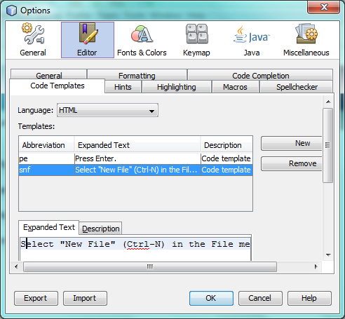
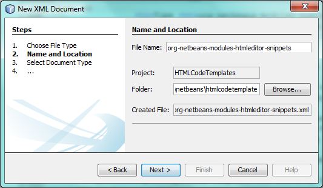

// 
//     Licensed to the Apache Software Foundation (ASF) under one
//     or more contributor license agreements.  See the NOTICE file
//     distributed with this work for additional information
//     regarding copyright ownership.  The ASF licenses this file
//     to you under the Apache License, Version 2.0 (the
//     "License"); you may not use this file except in compliance
//     with the License.  You may obtain a copy of the License at
// 
//       http://www.apache.org/licenses/LICENSE-2.0
// 
//     Unless required by applicable law or agreed to in writing,
//     software distributed under the License is distributed on an
//     "AS IS" BASIS, WITHOUT WARRANTIES OR CONDITIONS OF ANY
//     KIND, either express or implied.  See the License for the
//     specific language governing permissions and limitations
//     under the License.
//

= NetBeans Code Template Module Tutorial
:jbake-type: platform_tutorial
:jbake-tags: tutorials 
:jbake-status: published
:syntax: true
:source-highlighter: pygments
:toc: left
:toc-title:
:icons: font
:experimental:
:description: NetBeans Code Template Module Tutorial - Apache NetBeans
:keywords: Apache NetBeans Platform, Platform Tutorials, NetBeans Code Template Module Tutorial

This tutorial demonstrates how to create a NetBeans module that provides code templates. Changes can be made by the user in the Options window, either to customize the existing code templates or to add new ones:

To provide this functionality, you will not need to use any Java code at all. As shown in this tutorial, you will only need to provide an XML file that defines your code templates, by registering it in your module's  ``layer.xml``  file.

NOTE:  This document uses NetBeans IDE 7.2 or above and NetBeans Platform 7.2 or above. If you are using an earlier version, see  link:71/nbm-code-template.html[the previous version of this document].

== Setting up the Module Project

Before you start writing the module, you have to make sure you that your project is set up correctly. The IDE provides a wizard that sets up all the basic files needed for a module.

[start=1]
1. Choose File > New Project (Ctrl+Shift+N). Under Categories, select NetBeans Modules. Under Projects, select Module. Click Next.

[start=2]
1. In the Name and Location panel, type  ``HTMLCodeTemplates``  in the Project Name field. Change the Project Location to any directory on your computer. Click Next.

[start=3]
1. In the Basic Module Configuration panel, type  ``org.netbeans.htmlcodetemplate``  in Code Name Base. Click Finish.

The IDE creates the  ``HTMLCodeTemplates``  project. The project contains all of your sources and project metadata, such as the project's Ant build script. The project opens in the IDE. You can view its logical structure in the Projects window (Ctrl-1) and its file structure in the Files window (Ctrl-2).

== Creating the Code Templates

In this section, you create the code templates for HTML files.

[start=1]
1. Right-click the  ``org.netbeans.modules.htmlcodetemplate``  node and choose New > Other > XML > XML Document. Click Next.

[start=2]
1. 
Type  ``org-netbeans-modules-htmleditor-snippets``  and in "Folder" browse to the "htmlcondetemplate" folder:

Click Next and then click Finish.

[start=3]
1. Replace the default content of the  ``org-netbeans-modules-htmleditor-snippets.xml``  file with the following:

[source,xml]
----

<?xml version="1.0" encoding="UTF-8"?>
<!DOCTYPE codetemplates PUBLIC "-//NetBeans//DTD Editor Code Templates settings 1.0//EN" "https://netbeans.org/dtds/EditorCodeTemplates-1_0.dtd">
<codetemplates>
    <codetemplate abbreviation="snf" xml:space="preserve">
        <code>Select "New File" (Ctrl-N) in the File menu</code>
        <description>Code template for selecting "New File".</description>
    </codetemplate>
    <codetemplate abbreviation="pe" xml:space="preserve">
        <code>Press Enter.</code>
        <description>Code template for clicking the "Enter" key.</description>
    </codetemplate>
</codetemplates>
                    
----

You now have two code templates. The first will be shown when "snf" is typed, followed by the expansion key, while the second requires "pe" to be typed, prior to the expansion key being pressed.

== Declaring and Registering the Code Templates

Code templates are registered in the  ``layer.xml``  file for the MIME type to which they apply.

[start=1]
1. Right-click the  ``org.netbeans.modules.htmlcodetemplate``  node and choose New > Other > Module Development > XML Layer. Click Next and then click Finish.

[start=2]
1. Replace the content of the layer.xml file with the following:

[source,xml]
----

<?xml version="1.0" encoding="UTF-8"?>
<!DOCTYPE filesystem PUBLIC "-//NetBeans//DTD Filesystem 1.2//EN" "https://netbeans.org/dtds/filesystem-1_2.dtd">
<filesystem>
    <folder name="Editors">
        <folder name="text">
            <folder name="html">
                <folder name="CodeTemplates">
                    <file name="org-netbeans-modules-htmleditor-snippets.xml" url="org-netbeans-modules-htmleditor-snippets.xml"/>
                </folder>
            </folder>
        </folder>
    </folder>
</filesystem>
----

== Building and Installing the Code Templates

Now we need to think about installation and distribution. In the first section below, we install the code templates, next we create an NBM file and examine distribution channels.

=== Trying Out the Code Templates

Install and try out the code templates, by following the steps below.

[start=1]
1. In the Projects window, right-click the  ``HTMLCodeTemplates``  project and choose Run. The module is built and installed in the target platform. The target platform opens so that you can try out your new module. The default target platform is the installation used by the current instance of the development IDE.

[start=2]
1. Look in the Options window and notice your two code templates:

[start=3]
1. Open an HTML file and type "snf". Press the Tab key and notice that the abbreviation expands. Do the same for "pe".

=== Creating a Shareable Module Binary

An NBM file is the binary version of the module that provides the code templates. Below, using one menu item, we create the NBM file.

[start=1]
1. In the Projects window, right-click the  ``HTMLCodeTemplates``  project and choose Create NBM. The NBM file is created and you can view it in the Files window (Ctrl-2).

[start=2]
1. Make the module available to others via, for example, the  link:http://plugins.netbeans.org/PluginPortal/[Plugin Portal].

[start=3]
1. The recipient can install the module by using their IDE's Plugin Manager. They would choose Tools > Plugins from the main menu.
link:http://netbeans.apache.org/community/mailing-lists.html[Send Us Your Feedback]

== Next Steps

For more information about creating and developing NetBeans modules, see the following resources:

*  link:https://netbeans.apache.org/kb/docs/platform.html[Other Related Tutorials]
*  link:http://bits.netbeans.org/dev/javadoc/index.html[NetBeans API Javadoc]
