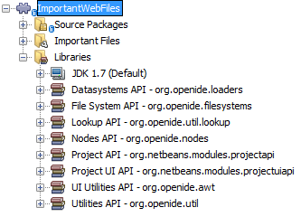
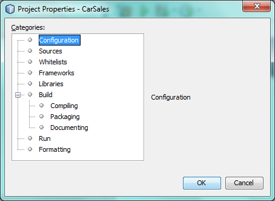

// 
//     Licensed to the Apache Software Foundation (ASF) under one
//     or more contributor license agreements.  See the NOTICE file
//     distributed with this work for additional information
//     regarding copyright ownership.  The ASF licenses this file
//     to you under the Apache License, Version 2.0 (the
//     "License"); you may not use this file except in compliance
//     with the License.  You may obtain a copy of the License at
// 
//       http://www.apache.org/licenses/LICENSE-2.0
// 
//     Unless required by applicable law or agreed to in writing,
//     software distributed under the License is distributed on an
//     "AS IS" BASIS, WITHOUT WARRANTIES OR CONDITIONS OF ANY
//     KIND, either express or implied.  See the License for the
//     specific language governing permissions and limitations
//     under the License.
//

= NetBeans Project Type Extension Module Tutorial
:jbake-type: platform_tutorial
:jbake-tags: tutorials 
:jbake-status: published
:syntax: true
:source-highlighter: pygments
:toc: left
:toc-title:
:icons: font
:experimental:
:description: NetBeans Project Type Extension Module Tutorial - Apache NetBeans
:keywords: Apache NetBeans Platform, Platform Tutorials, NetBeans Project Type Extension Module Tutorial

This tutorial demonstrates how to extend an existing project type.

NOTE: This document uses NetBeans Platform 7.2 and NetBeans IDE 7.2. If you are using an earlier version, see  link:71/nbm-projectextension.html[the previous version of this document].

You will also make use of this icon, which you can right-click here and download: 

== Introduction to Project Extensions

New NetBeans IDE APIs since NetBeans IDE 6.0 enable you to add new nodes to an existing project type's logical view, new objects to an existing project type's lookup, and new panels to an existing project type's Project Properties dialog box. For example, in this tutorial, to illustrate these extensions, we extend the web application project type's logical view, by adding a new "Important Files" node, exposing the content of the project's "nbproject" folder, as shown here:

image::images/cc_72_result-2.png[]

Prior to NetBeans IDE 6.0, no NetBeans IDE APIs existed for extending existing project types. Instead, you would need to create new project types from scratch. From 6.0 onwards, you are recommended to extend existing project types rather than create new ones, where possible. This will keep the number of project types to a minimum and avoid a large number of project types with very small differences. However, it is, of course, always possible to create project types from scratch, as before, following the  link:https://netbeans.apache.org/tutorials/nbm-projecttype.html[NetBeans Project Type Module Tutorial].

Annotations are used throughout this tutorial to register the lookup extension, logical view extension, and project customizer extension. As you will see below, the extensions will be registered for the project type "org-netbeans-modules-web-project", which is the web application project type. Here is a list of strings representing other project types supported by NetBeans IDE:

* org-netbeans-modules-ant-freeform
* org-netbeans-modules-apisupport-project
* org-netbeans-modules-apisupport-project-suite
* org-netbeans-modules-j2ee-archiveproject
* org-netbeans-modules-j2ee-clientproject
* org-netbeans-modules-j2ee-earproject
* org-netbeans-modules-j2ee-ejbjarproject
* org-netbeans-modules-java-j2seproject

More project types may be available, depending on the modules that are part of your specific installation of NetBeans IDE or other application on the NetBeans Platform.

== Creating the Module Project

We begin by working through the New Module Project wizard. At the end of it, we will have a basic source structure, with some default files, that every NetBeans module requires.

[start=1]
1. Choose File > New Project (Ctrl+Shift+N). Under Categories, select NetBeans Modules. Under Projects, select Module. Click Next.

[start=2]
1. In the Name and Location panel, type  ``ImportantWebFiles``  in the Project Name field. Change the Project Location to any directory on your computer. Click Next.

[start=3]
1. In the Basic Module Configuration panel, type  ``org.netbeans.modules.importantwebfiles``  in Code Name Base. Click Finish. The IDE creates the  ``ImportantWebFiles``  project. The project contains all of your sources and project metadata, such as the project's Ant build script. The project opens in the IDE. You can view its logical structure in the Projects window (Ctrl-1) and its file structure in the Files window (Ctrl-2).

[start=4]
1. Right-click the project's Libraries node, choose Add Module Dependency, and then set dependencies on the following modules: 
* Datasystems API
* File System API
* Lookup API
* Nodes API
* Project API
* Project UI API
* Utilities API

You should now see the following dependencies have been set:

Your module structure is ready, the dependencies have been set, and you can now begin coding.

== Project Extension Scenarios

Three separate, independent scenarios are described below. Depending on your needs, extend the project of your choice in one or more of the following ways:

* <<extendingthelookup,Scenario 1: Extending the Project Lookup>>
* <<extendingthelogicalview,Scenario 2: Extending the Project Logical View>>
* <<extendingthecustomizer,Scenario 3: Extending the Project Customizer>>

=== Scenario 1: Extending the Project Lookup

In this section, we register a class named  ``ServiceImpl``  into the  ``Lookup``  of web projects. We create an  ``Action``  to verify that the object has been registered successfully.

[start=1]
1. Create a Java class named  ``Service`` . Change the default code to the following:

[source,java]
----

import javax.swing.JOptionPane;

public abstract class Service {

    static {
        JOptionPane.showMessageDialog(null, "===> loading Service");
    }

    public abstract String m();
    
}
----

[start=2]
1. Create a new Java class named  ``ServiceImpl`` . Change the default code to the following:

[source,java]
----

import javax.swing.JOptionPane;
import org.netbeans.api.project.Project;
import org.netbeans.api.project.ProjectUtils;
import org.netbeans.spi.project.ProjectServiceProvider;

link:http://bits.netbeans.org/dev/javadoc/org-netbeans-modules-projectapi/org/netbeans/spi/project/ProjectServiceProvider.html[@ProjectServiceProvider](
        service=Service.class,
        projectType="org-netbeans-modules-web-project")
public class ServiceImpl extends Service {

    static {
        JOptionPane.showMessageDialog(null, "===> loading ServiceImpl");
    }
    private final Project p;

    public ServiceImpl(Project p) {
        this.p = p;
        JOptionPane.showMessageDialog(null, "===> new ServiceImpl on " + p);
    }

    @Override
    public String m() {
        return ProjectUtils.getInformation(p).getDisplayName();
    }
    
}
----

[start=3]
1. Create a new Java class named  ``TestAction`` . Change the default code to the following:

[source,java]
----

import java.awt.event.ActionEvent;
import java.awt.event.ActionListener;
import javax.swing.JOptionPane;
import org.netbeans.api.project.Project;
import org.netbeans.api.project.ui.OpenProjects;
import org.openide.awt.ActionID;
import org.openide.awt.ActionReference;
import org.openide.awt.ActionRegistration;
import org.openide.util.NbBundle.Messages;

@ActionID(
    category = "File",
    id = "org.netbeans.modules.importantwebfiles.TestAction")
@ActionRegistration(
    displayName = "#CTL_TestAction")
@ActionReference(
    path = "Menu/File", 
    position = 0)
@Messages("CTL_TestAction=Test")
public final class TestAction implements ActionListener {

    @Override
    public void actionPerformed(ActionEvent e) {
        JOptionPane.showMessageDialog(null, "===> running action");
        for (Project p : OpenProjects.getDefault().getOpenProjects()) {
            Service s = p.getLookup().lookup(Service.class);
            if (s != null) {
                JOptionPane.showMessageDialog(null, "===> got a service: " + s.m());
            } else {
                JOptionPane.showMessageDialog(null, "===> nothing for " + p);
            }
        }
    }
    
}
----

Run the module to install it into a new instance of NetBeans IDE. Open a few NetBeans projects. Invoke the  ``Action``  and observe the  ``JOptionPanes``  to see the result. Depending on whether a project is a web project, you will get different messages.

=== Scenario 2: Extending the Project Logical View

In this section, we change the node hierarchy in the Projects window for an existing project type. We start by implementing the  `` link:http://bits.netbeans.org/dev/javadoc/org-netbeans-modules-projectuiapi/org/netbeans/spi/project/ui/support/NodeFactory.html[NodeFactory]``  class, which we will register via an annotation.

[start=1]
1. Create a Java class called  ``ImportantFilesNodeFactory`` . Change the default code to the following:

[source,java]
----

import org.netbeans.api.project.Project;
import org.netbeans.spi.project.ui.support.NodeFactory;
import org.netbeans.spi.project.ui.support.NodeFactorySupport;
import org.netbeans.spi.project.ui.support.NodeList;
import org.openide.loaders.DataObjectNotFoundException;
import org.openide.util.Exceptions;

link:http://bits.netbeans.org/dev/javadoc/org-netbeans-modules-projectuiapi/org/netbeans/spi/project/ui/support/NodeFactory.Registration.html[@NodeFactory.Registration](projectType = "org-netbeans-modules-web-project")
public class ImportantFilesNodeFactory implements  link:http://bits.netbeans.org/dev/javadoc/org-netbeans-modules-projectuiapi/org/netbeans/spi/project/ui/support/NodeFactory.html[NodeFactory] {

    @Override
    public NodeList createNodes(Project project) {

        //Optionally, only return a new node
        //if some item is in the project's lookup:
        //MyCoolLookupItem item = project.getLookup().lookup(MyCoolLookupItem.class);
        //if (item != null) {
        try {
            ImportantFilesNode nd = new ImportantFilesNode(project);
            return NodeFactorySupport.fixedNodeList(nd);
        } catch (DataObjectNotFoundException ex) {
            Exceptions.printStackTrace(ex);
        }
        //}

        //If the above try/catch fails, e.g.,
        //our item isn't in the lookup,
        //then return an empty list of nodes:
        return NodeFactorySupport.fixedNodeList();

    }
    
}
----

[start=2]
1. Create a new Java class called  ``ImportantFilesNode`` , which will filter the node of the project's "nbproject" folder. A new display name and icon will be defined for that folder. Therefore, change the default code to the following:

[source,java]
----

import java.awt.Image;
import org.netbeans.api.annotations.common.StaticResource;
import org.netbeans.api.project.Project;
import org.openide.filesystems.FileUtil;
import org.openide.loaders.DataFolder;
import org.openide.loaders.DataObject;
import org.openide.loaders.DataObjectNotFoundException;
import org.openide.nodes.FilterNode;
import org.openide.util.ImageUtilities;

public class ImportantFilesNode extends  link:http://bits.netbeans.org/dev/javadoc/org-openide-nodes/org/openide/nodes/FilterNode.html[FilterNode] {

    @StaticResource
    private static final String IMAGE = "org/netbeans/modules/"
            + "importantwebfiles/webPagesBadge.gif";

    public ImportantFilesNode(Project proj) throws DataObjectNotFoundException {
        super(DataObject.find(proj.getProjectDirectory().
                getFileObject("nbproject")).getNodeDelegate());
    }

    @Override
    public String getDisplayName() {
        return "Important Files";
    }
     
    //Next, we add icons, for the default state, which is
    //closed, and the opened state; we will make them the same. 
    //
    //Icons in project logical views are
    //based on combinations--you can combine the node's own icon
    //with a distinguishing badge that is merged with it. Here we
    //first obtain the icon from a data folder, then we add our
    //badge to it by merging it via a NetBeans API utility method:
    @Override
    public Image getIcon(int type) {
        DataFolder root = DataFolder.findFolder(FileUtil.getConfigRoot());
        Image original = root.getNodeDelegate().getIcon(type);
        return ImageUtilities.mergeImages(original, 
                ImageUtilities.loadImage(IMAGE), 7, 7);
    }
    @Override
    public Image getOpenedIcon(int type) {
        DataFolder root = DataFolder.findFolder(FileUtil.getConfigRoot());
        Image original = root.getNodeDelegate().getIcon(type);
        return ImageUtilities.mergeImages(original,
                ImageUtilities.loadImage(IMAGE), 7, 7);
    }
    
}
----

[start=3]
1. Right-click this icon and save it in the main package of your module: 

Run the module and you will notice that web applications have your newly defined node, exposing the project's "nbproject" folder: 

image::images/cc_72_result-2.png[]

=== Scenario 3: Extending the Project Customizer

In this section, we create two new tabs in the Project Properties dialog of the web application project type.

[start=1]
1. Create a Java class called  ``ImportantFilesCustomizerTab`` . Change the default code to the following:

[source,java]
----

import java.awt.BorderLayout;
import javax.swing.JComponent;
import javax.swing.JLabel;
import javax.swing.JPanel;
import org.netbeans.spi.project.ui.support.ProjectCustomizer;
import org.netbeans.spi.project.ui.support.ProjectCustomizer.Category;
import org.openide.util.Lookup;
import org.openide.util.NbBundle;

public class ImportantFilesCustomizerTab 
    implements  link:http://bits.netbeans.org/dev/javadoc/org-netbeans-modules-projectuiapi/org/netbeans/spi/project/ui/support/ProjectCustomizer.CompositeCategoryProvider.html[ProjectCustomizer.CompositeCategoryProvider] {

    private final String name;

    private ImportantFilesCustomizerTab(String name) {
        this.name = name;
    }

    @Override
    public Category createCategory(Lookup lkp) {
        return ProjectCustomizer.Category.create(name, name, null);
    }

    @Override
    public JComponent createComponent(Category category, Lookup lkp) {
        JPanel jPanel1 = new JPanel();
        jPanel1.setLayout(new BorderLayout());
        jPanel1.add(new JLabel(name), BorderLayout.CENTER);
        return jPanel1;
    }

    @NbBundle.Messages({"LBL_Config=Configuration"})
link:http://bits.netbeans.org/dev/javadoc/org-netbeans-modules-projectuiapi/org/netbeans/spi/project/ui/support/ProjectCustomizer.CompositeCategoryProvider.Registration.html[@ProjectCustomizer.CompositeCategoryProvider.Registration](
        projectType = "org-netbeans-modules-web-project", 
        position = 10)
    public static ImportantFilesCustomizerTab createMyDemoConfigurationTab() {
        return new ImportantFilesCustomizerTab(Bundle.LBL_Config());
    }
    
}
----

[start=2]
1. Run the module. Right-click a web application's project node and choose Properties. Notice the new tab that has been added. The  ``createCategory``  method above defines the left side of the screenshot below, while the right side is defined by the  ``createComponent``  method.

[start=3]
1. Now we'll change the class so that two tabs are created, instead of one:

[source,java]
----

import java.awt.BorderLayout;
import javax.swing.JComponent;
import javax.swing.JLabel;
import javax.swing.JPanel;
import org.netbeans.spi.project.ui.support.ProjectCustomizer;
import org.netbeans.spi.project.ui.support.ProjectCustomizer.Category;
import org.openide.util.Lookup;
import org.openide.util.NbBundle;

public class ImportantFilesCustomizerTab 
    implements ProjectCustomizer.CompositeCategoryProvider {

    private final String name;

    private ImportantFilesCustomizerTab(String name) {
        this.name = name;
    }

    @Override
    public Category createCategory(Lookup lkp) {
        ProjectCustomizer.Category toReturn = null;
        if (Bundle.LBL_Config1().equals(name)) {
            toReturn = ProjectCustomizer.Category.create(
                    Bundle.LBL_Config1(),
                    Bundle.LBL_Config1(),
                    null);
        } else {
            toReturn = ProjectCustomizer.Category.create(
                    Bundle.LBL_Config2(),
                    Bundle.LBL_Config2(),
                    null);
        }
        return toReturn;
    }

    @Override
    public JComponent createComponent(Category category, Lookup lkp) {
        String nm = category.getName();
        if (name.equals(nm)) {
            JPanel jPanel1 = new JPanel();
            jPanel1.setLayout(new BorderLayout());
            jPanel1.add(new JLabel(name), BorderLayout.CENTER);
            return jPanel1;
        } else {
            JPanel jPanel2 = new JPanel();
            jPanel2.setLayout(new BorderLayout());
            jPanel2.add(new JLabel(name), BorderLayout.CENTER);
            return jPanel2;
        }
    }

    @NbBundle.Messages({"LBL_Config1=ConfigurationPart1"})
    @ProjectCustomizer.CompositeCategoryProvider.Registration(
        projectType = "org-netbeans-modules-web-project",
        position = 10)
    public static ImportantFilesCustomizerTab createMyDemoConfigurationTab1() {
        return new ImportantFilesCustomizerTab(Bundle.LBL_Config1());
    }

    @NbBundle.Messages({"LBL_Config2=ConfigurationPart2"})
    @ProjectCustomizer.CompositeCategoryProvider.Registration(
        projectType = "org-netbeans-modules-web-project",
        position = 20)
    public static ImportantFilesCustomizerTab createMyDemoConfigurationTab2() {
        return new ImportantFilesCustomizerTab(Bundle.LBL_Config2());
    }

}
----

Run the module again and notice that you now have two new tabs:

image::images/cc_72_result-4.png[]

In this tutorial, you have learned how to extend the project's lookup, logical view, and customizer.

link:http://netbeans.apache.org/community/mailing-lists.html[Send Us Your Feedback]

== Next Steps

For more information about creating and developing NetBeans modules, see the following resources:

*  link:https://netbeans.apache.org/kb/docs/platform.html[Other Related Tutorials]
*  link:https://bits.netbeans.org/dev/javadoc/[NetBeans API Javadoc]
