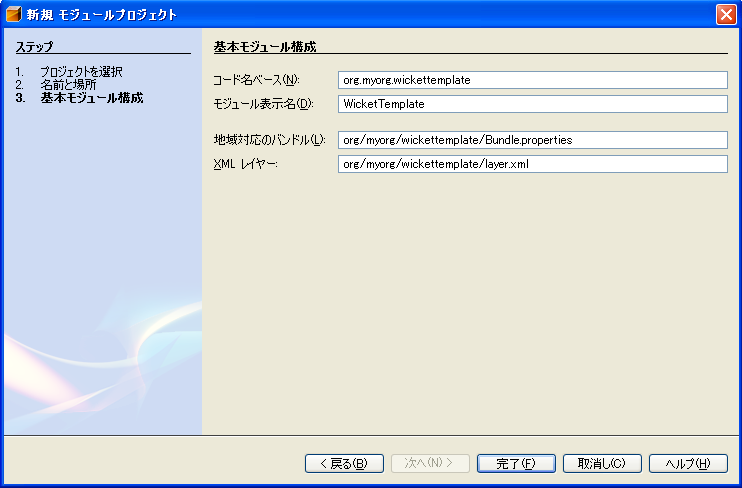
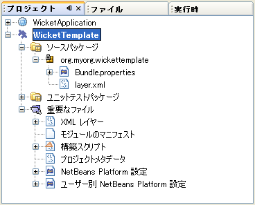
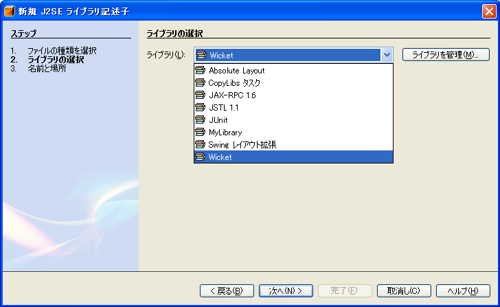
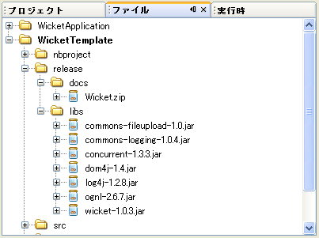
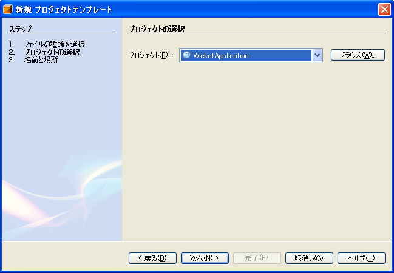
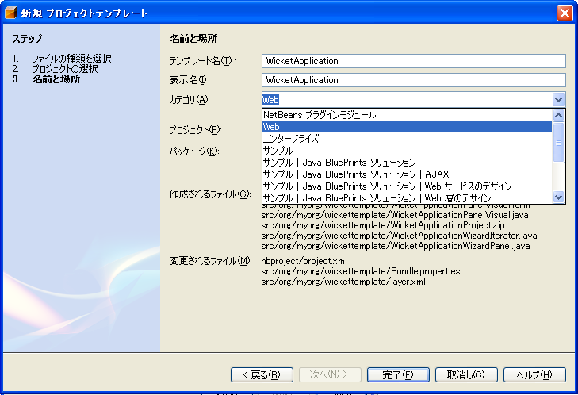
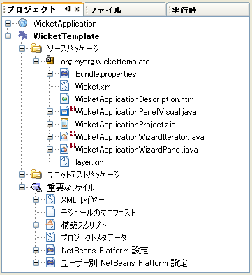
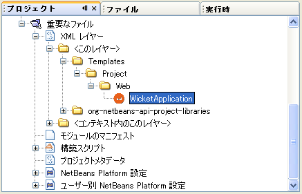
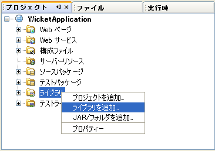

// 
//     Licensed to the Apache Software Foundation (ASF) under one
//     or more contributor license agreements.  See the NOTICE file
//     distributed with this work for additional information
//     regarding copyright ownership.  The ASF licenses this file
//     to you under the Apache License, Version 2.0 (the
//     "License"); you may not use this file except in compliance
//     with the License.  You may obtain a copy of the License at
// 
//       http://www.apache.org/licenses/LICENSE-2.0
// 
//     Unless required by applicable law or agreed to in writing,
//     software distributed under the License is distributed on an
//     "AS IS" BASIS, WITHOUT WARRANTIES OR CONDITIONS OF ANY
//     KIND, either express or implied.  See the License for the
//     specific language governing permissions and limitations
//     under the License.
//

= NetBeans プロジェクトテンプレートモジュールのチュートリアル
:jbake-type: platform_tutorial
:jbake-tags: tutorials 
:jbake-status: published
:syntax: true
:source-highlighter: pygments
:toc: left
:toc-title:
:icons: font
:experimental:
:description: NetBeans プロジェクトテンプレートモジュールのチュートリアル - Apache NetBeans
:keywords: Apache NetBeans Platform, Platform Tutorials, NetBeans プロジェクトテンプレートモジュールのチュートリアル

翻訳 :  link:http://blogs.oracle.com/roller/page/katakai[片貝正紀] , 2006/7/10, レビュー/保守:  link:http://ja.netbeans.org/index.html[NetBeans 日本語サイト]

link:mailto:dev@netbeans.apache.org?subject=Feedback:%20NetBeans%20IDE%20Project%20Sample%20Module%20Tutorial[フィードバック]

このチュートリアルでは IDE 新規プロジェクトウィザードで新しいプロジェクトのテンプレートを利用可能にする方法を説明します。IDE ではさまざまはプロジェクトテンプレートを提供しています。たとえば Web アプリケーション、既存のソースからの Java プロジェクト、EJB モジュール、エンタープライズアプリケーションなどです。それぞれのプロジェクトテンプレートは基本的なソース構成にいくつかのサンプルコードのファイルを提供しています。たとえば Web アプリケーションのプロジェクトでは Java BluePrints のソース構成、あるいは Jakarta が推奨するソース構成を提供しています。それにくわえて、デフォルトの  ``index.jsp``  ファイル、 ``web.xml``  配備記述子、Web アプリケーションテンプレートウィザードで選択されたサーバーの配備記述子などを提供しています。

このチュートリアルでは Java Web アプリケーションフレームワークのひとつ  link:http://wicket.sourceforge.net/[Wicket] 用のプロジェクトテンプレートを追加してみましょう。Wicket のプロジェクトテンプレートを作成するときには次の Wicket 特有の要件を理解することが大切です:

* JSP ファイルはなし。それそれの Web ページは同じパッケージ構成内の同じ名前の Java クラスと HTML で構成されます。
* XML 構成ファイルはなし。一つの Java クラスがアプリケーションのホームページなどのアプリケーションレベルでの情報を提供します。
* Wicket 特有のライブラリと  ``web.xml``  配備記述子ファイルが要求を処理する Wicket サーブレットを参照します。

モジュールを作成しインストールすると、新規ウィザードで Wicket プロジェクトテンプレートを利用できるようになり、ライブラリマネージャーでは Wicket JAR ファイルが含まれるようになります。

このチュートリアルでは以下のことを説明します:

* <<installing,ソフトウェアのインストール>>
* <<preparing,Wicket プロジェクトテンプレートの準備>>
* <<creatingthemoduleproject,モジュールプロジェクトの作成>>
* <<bundlinglibraries,ライブラリの構築>>
* <<bundlingtemplate,プロジェクトテンプレートの構築>>
* <<building,モジュールの構築とインストール>>

このチュートリアルはソフトウェアがインストールできれば 20 分程度で完了します。

モジュール開発に関する詳細は NetBeans サイトの  link:https://netbeans.apache.org/platform/index.html[NetBeans 開発プロジェクトホーム] を参照してください。わからないところがあれば  link:http://wiki.netbeans.org/wiki/view/NetBeansDeveloperFAQ[NetBeans 開発者 FAQ] を参照してください。またこのページの「フィードバック」リンクを使ってください。

== ソフトウェアのインストール

まずはじめにコンピュータにソフトウェアをインストールします:

* NetBeans IDE 5.0 ( link:https://netbeans.apache.org/download/index.html[ダウンロード])
* Java Standard Development Kit (JDK) バージョン 1.4.2 ( link:https://www.oracle.com/technetwork/java/javase/downloads/index.html[ダウンロード]) または 5.0 ( link:https://www.oracle.com/technetwork/java/javase/downloads/index.html[ダウンロード])

== Wicket プロジェクトテンプレートの準備

[start=1]
1.  link:http://sourceforge.net/project/showfiles.php?group_id=119783&package_id=130482[Wicket 1.0.3] の zip ファイルのダウンロードと展開。

*注意:* このチュートリアルは他のリリースの Wicket でも進められますが、他のリリースではこのチュートリアルで示しているフォルダとは別の場所に Wicket ライブラリが存在するかもしれません。

[start=2]
1. 「ファイル」、「新規プロジェクト」を選択してください。「カテゴリ」で「Web」を選択します。「プロジェクト」では「Web アプリケーション」を選択し「次へ」ボタンをクリックします。

[start=3]
1. 「プロジェクト名」には  ``WicketApplication``  と入力します。「プロジェクトの場所」は適当なコンピューター上のディレクトリを指定します。このディレクトリを以降  ``_$__PROJECTHOME_``  とします。

[start=4]
1. ソース構造の推奨を選択します。これは個人的な好みでかまいません:

* *Java BluePrints.* 詳細は  link:http://java.sun.com/blueprints/code/projectconventions.html[http://java.sun.com/blueprints/code/projectconventions.html] を参照してください。

* *Jakarta.*詳細は  link:http://jakarta.apache.org/tomcat/tomcat-5.0-doc/[http://jakarta.apache.org/tomcat/tomcat-5.0-doc/] を参照してください。

[start=5]
1. 他の項目はデフォルトのままにします。「完了」ボタンをクリックします。

IDE は  ``_$PROJECTHOME_/WicketApplication``  プロジェクトフォルダを作成します。プロジェクトは必要なすべてのソースやメタデータ、たとえばプロジェクトの Ant 構築スクリプトなどを含んでいます。 ``WicketApplication``  プロジェクトは IDE 上で開かれます。「プロジェクト」ウィンドウ(Ctrl-1) で理論的な構成を表示できます。また「ファイル」ウィンドウ(Ctrl-2)ではファイル構造を表示できます。

[start=6]
1.  ``index.jsp``  を削除します。Wicket の Web ページは Java クラスと HTML ファイルで構成されます。したがってデフォルトの JSP ページは必要ありません。

これで基本的な Wicket プロジェクトのテンプレートは準備できました。この例では、標準の Web アプリケーションと Wicket アプリケーションとの差は  ``index.jsp``  がないだけです。これは必要に応じて変更することできます。次のセクションでは Wicket ライブラリとプロジェクトテンプレートを含んだモジュールプロジェクトを作成し、新規プロジェクトウィザードでインストールします。

== モジュールプロジェクトの作成

[start=1]
1. 「ファイル」>「新規プロジェクト」(Ctrl-Shift-N) を選択してください。「カテゴリ」で「NetBeans プラグインモジュール」を選択します。「プロジェクト」では「モジュールプロジェクト」を選択し「次へ」ボタンをクリックします。

[start=2]
1. 「名前と場所」パネルでは「プロジェクト名」に「 ``WicketTemplate`` 」と入力します。「プロジェクトの場所」は適当なコンピューター上のディレクトリを指定します。たとえば  ``c:\mymodules``  などです。「スタンドアロンモジュール」のラジオボタンはそのままにし「主プロジェクトとして設定」チェックボックスを選択します。パネルは次のようになります:

image::images/projecttemplates_new-module-project-wiz1_ja.png[]

「次へ」をクリックします。

[start=3]
1. 「基本モジュール構成」パネルでは「コード名ベース」で  ``yourorghere``  を  ``myorg``  に置き換え、 ``org.myorg.wickttemplate``  にします。「地域対応のバンドル」と「XML レイヤー」はそのままにし  ``org/myorg/wickttemplate``  にこれらのファイルが保存されるようにします。パネルはこのようになります:

[start=4]
1. 「完了」ボタンをクリックします。

IDE は  ``WicketTemplate``  プロジェクトを作成します。プロジェクトは必要なすべてのソースやメタデータ、たとえばプロジェクトの構築スクリプトなどを含んでいます。プロジェクトは IDE 上で開かれます。「プロジェクト」ウィンドウ(Ctrl-1) で理論的な構成を表示できます。また「ファイル」ウィンドウ(Ctrl-2)ではファイル構造を表示できます。たとえば「プロジェクト」ウィンドウではこのようになります:

これらのファイルの基本的な説明は  link:quickstart-nbm_ja.html[プラグインモジュールクイックスタートガイド] を参照してください。

== Wicket ライブラリのバンドル

[start=1]
1.  ``WicketTemplate``  プロジェクトノードで右クリックして「新規」>「J2SE ライブラリ記述子」を選択します。「次へ」をクリックします。

[start=2]
1. 「ライブラリの選択」パネルで「ライブラリを管理」をクリックします。「ライブラリマネージャー」で、「新規ライブラリ」をクリックし「ライブラリ名」に  ``Wicket``  と入力します。「完了」ボタンをクリックします。

[start=3]
1. 「JAR/フォルダを追加」をクリックし、 link:http://sourceforge.net/project/showfiles.php?group_id=119783&package_id=130482[Wicket 1.0.3] を展開したフォルダを参照します。

[start=4]
1. 「JAR/フォルダをブラウズ」ダイアログの「クラスパス」タブで次の JAR ファイルを追加します:

*  ``wicket-1.0.3`` 
*  ``lib/commons-fileupload-1.0`` 
*  ``lib/commons-logging-1.0.4`` 
*  ``lib/concurrent-1.3.3`` 
*  ``lib/dom4j-1.4`` 
*  ``lib/log4j-1.2.8`` 
*  ``lib/ognl-2.6.7`` 

「ライブラリマネージャー」の「クラスパス」タブは次のようになります:

image::images/projecttemplates_library-manager-1_ja.png[]

[start=5]
1. 「Javadoc」タブでは  ``docs/apidocs``  フォルダを追加します。

「ライブラリマネージャー」の「Javadoc」タブは次のようになります:

image::images/projecttemplates_library-manager-2_ja.png[]

[start=6]
1. 「完了」ボタンをクリックします。「ライブラリの選択」パネルで新しく作成した Wicket ライブラリを選択します。

「次へ」をクリックします。

[start=7]
1. 「名前と場所」パネルではすべてデフォルトのままにします。

[start=8]
1. 「完了」ボタンをクリックします。

プロジェクトウィンドウは  ``Wicket``  J2SE ライブラリ記述子を含んでいます。ファイルウィンドウではモジュールに追加した Wicket アーカイブファイルが表示されます:

image::images/projecttemplates_projects-window-2_ja.png[] 
 

== Wicket プロジェクトテンプレートのバンドル

[start=1]
1.  ``WicketTemplate``  プロジェクトノードで右クリックして「新規」>「プロジェクトテンプレート」を選択します。

[start=2]
1. 「プロジェクトを選択」パネルでは次のようにサンプルとしてバンドルするプロジェクトが自動的に選択されます:

IDE に複数のプロジェクトが開かれていた場合にはドロップダウンリストを使って Wicket アプリケーションを選択します。

「次へ」をクリックします。

[start=3]
1. 「名前と場所」パネルでは「テンプレート名」に「 ``WicketApplication`` 」と入力し、「表示名」には「 ``Wicket Application`` 」と入力します。「カテゴリ」ドロップダウンリストからは次のように「Web」を選択します。

[start=4]
1. 「完了」ボタンをクリックします。

IDE は次のことを行います:

* プロジェクトを含む ZIP ファイルを作成する
* サンプルを作成するための新規プロジェクトウィザードで使われる Java パネルと反復子を作成する
* 新規プロジェクトウィザードの説明を表示する HTML を提供する
* XML レイヤーファイルにサンプルを登録する
* ローカライズ用の文字を  ``bundle.properties``  ファイルに追加する

これで「プロジェクト」ウィンドウはこのようになります:

最後にデフォルトのアイコンを Wicket のアイコンと置き換えます。Wicket のアイコンを取得するには、以下のイメージで右クリックしてファイルに保存します。

image::images/projecttemplates_wicket.gif[]

[start=5]
1. 「重要なファイル」ノードで「XML レイヤー」ノードを展開します。２つのノード  ``<このレイヤー>``  と  ``<コンテキスト内のこのレイヤー>``  とそのサブノードで  link:https://netbeans.apache.org/tutorials/nbm-glossary.html[ファイルシステム] のブラウザを構成しています。 ``<このレイヤー>`` 、さらに  ``Templates`` 、作成したテンプレートが見えるまでノードを展開します。

[start=6]
1. 新しいテンプレートのノードで右クリックして次のように「アイコンを選択」を選択します:

image::images/projecttemplates_layerxml1_ja.png[]

Wicket アイコンが保存してある場所を参照します。デフォルトのアイコンが Wicket アイコンに変更されます:

これで Wicket ライブラリとテンプレートを含むモジュールの構築、インストールして使用する準備が整いました。

== モジュールの構築とインストール

IDE はモジュールの構築およびインストールに Ant 構築スクリプトを使用します。構築スクリプトはプロジェクトの作成時に作成されます。

=== NetBeans モジュールのインストール

* 「プロジェクト」ウィンドウで「 ``WicketTemplate`` 」プロジェクトを右クリックし「ターゲットプラットフォームでのインストール/再読み込み」を選びます。

モジュールが構築されターゲット IDE あるいはプラットフォームにインストールされます。ターゲット IDE またはプラットフォームが起動し新規モジュールを試すことができます。デフォルトのターゲットプラットフォームとは IDE の現在のインスタンスで使用しているインストールです。モジュールを実行すると IDE のユーザーディレクトリとは別のテストユーザーディレクトリで実行されます。

=== NetBeans モジュールの使用

[start=1]
1. 「ファイル」>「新規プロジェクト」(Ctrl-Shift-N) を選択してください。

新規プロジェクトウィザードが開き Wicket アプリケーションテンプレートが表示されます:

image::images/projecttemplates_new-project-wizard_ja.png[]

[start=2]
1. 「Wicket アプリケーション」を選択し「次へ」ボタンをクリックします。「名前と場所」パネルが表示されます。「プロジェクト名」に名前を入力します。

[start=3]
1. 「完了」ボタンをクリックします。

IDE は新しく作成されたサンプルプロジェクトを開き表示します。 ``index.jsp``  が開かれないことに気がつくでしょう。

[start=4]
1. 「ライブラリ」ノードで右クリックし、「ライブラリを追加」を選択します。次のようになります:

[start=5]
1. Wicket ライブラリを選択肢、「ライブラリを追加」をクリックします。

[start=6]
1. 新しく Java クラスが作成します。Wicket ライブラリのコード補完やJavadoc がサポートされています。

image::images/projecttemplates_source-editor_ja.png[]

=== 共有可能なモジュールバイナリの作成 (NBM ファイル)

NBM ファイルは Web 経由で NetBeans モジュール配布するためのパッケージです。主な NBM ファイルとモジュールの JAR ファイルとの違いは次です:

* NBM ファイルは圧縮されています。
* NBM ファイルは複数の JAR ファイルを含むことができます。モジュールは NBM で使用する任意のライブラリをパッケージできます。
* NBM ファイルは NetBeans が表示する表示名、アップデートセンターに関する情報、マニフェストコンテンツ、ライセンス等メタデータを含むことができます。
* NBM ファイルは通常セキュリティーの目的で署名されています。

NBM は特別な拡張子を使った ZIP ファイルです。JDK の機構を使って JAR を署名します。特別なことをしないかぎり、NBM ファイルの内容に注意する必要はありません。標準の Ant 構築スクリプトによって NBM が作成されます。IDE はプロジェクトのプロジェクトプロパティーダイアログボックスで入力した値に基づいて構築スクリプトを作成します。プロジェクトプロパティーのダイアログボックスではモジュールの依存関係、バージョン、パッケージの情報を設定できます。Ant スクリプトや Ant プロパティーを使ってプログラムの実行をカスタマイズすることができます。

[start=1]
1. 「プロジェクト」ウィンドウで  ``WicketTemplate``  プロジェクトを右クリックし、「NBM を作成」を選択します。

NBM ファイルが作成されます。「ファイル」ウィンドウ (Ctrl-2) で確認できます:

image::images/projecttemplates_shareable-nbm_ja.png[]

[start=2]
1. メールなどで送付することにより他の人に配布、共有できます。

== 次のステップ

NetBeans モジュールの開発と作成の詳細は次のリソースを参照してください:

*  link:https://netbeans.apache.org/platform/index.html[プラグイン開発者リソース]

*  link:https://bits.netbeans.org/dev/javadoc/[NetBeans API リスト (現行の開発バージョン)]

*  link:http://apisupport.netbeans.org/new-apisupport.html[新規 API サポートの提案]

*  link:https://netbeans.apache.org/tutorials/index_ja.html[その他のプラグインモジュールチュートリアル]

== バージョン

詳細な更新履歴は  link:nbm-projecttemplates_ja.html[原文の英文] をご覧下さい。このファイルはリビジョン 1.13 を翻訳しています。

