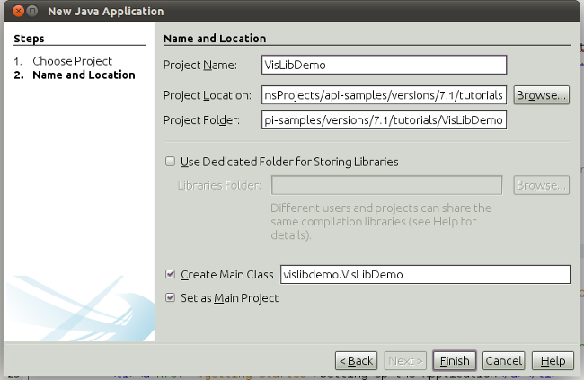
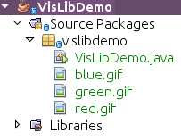
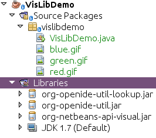
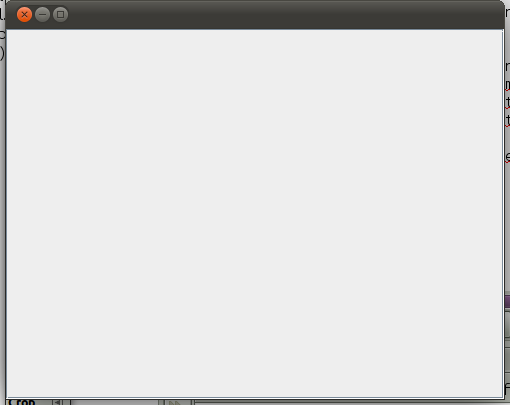
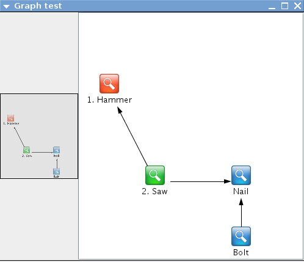

// 
//     Licensed to the Apache Software Foundation (ASF) under one
//     or more contributor license agreements.  See the NOTICE file
//     distributed with this work for additional information
//     regarding copyright ownership.  The ASF licenses this file
//     to you under the Apache License, Version 2.0 (the
//     "License"); you may not use this file except in compliance
//     with the License.  You may obtain a copy of the License at
// 
//       http://www.apache.org/licenses/LICENSE-2.0
// 
//     Unless required by applicable law or agreed to in writing,
//     software distributed under the License is distributed on an
//     "AS IS" BASIS, WITHOUT WARRANTIES OR CONDITIONS OF ANY
//     KIND, either express or implied.  See the License for the
//     specific language governing permissions and limitations
//     under the License.
//

= NetBeans Visual Library Tutorial for Standard Java SE Applications
:jbake-type: platform_tutorial
:jbake-tags: tutorials 
:jbake-status: published
:syntax: true
:source-highlighter: pygments
:toc: left
:toc-title:
:icons: font
:experimental:
:description: NetBeans Visual Library Tutorial for Standard Java SE Applications - Apache NetBeans
:keywords: Apache NetBeans Platform, Platform Tutorials, NetBeans Visual Library Tutorial for Standard Java SE Applications

In this tutorial, you will learn how to use the main features provided by the  link:http://bits.netbeans.org/dev/javadoc/org-netbeans-api-visual/overview-summary.html[NetBeans Visual Library API].

Also, you will use 3 icons in the tutorial. You can right-click them here and save them locally, then copy them to the application's location, after you create the application later in this tutorial. Here are the 3 icons:

 
image::images/vislib_blue.gif[] 
image::images/vislib_green.gif[]

== Setting Up the Application

In this section, we use a wizard to create a Java application.

[start=1]
1. Choose File > New Project (Ctrl+Shift+N). Under Categories, select Java. Under Projects, select Java Application. Click Next.

[start=2]
1. 
In the Name and Location panel, type  ``VisLibDemo``  in the Project Name field:

Click Finish. The IDE creates the  ``VisLibDemo``  project.

[start=3]
1. Add the three images above to the main package. You should now see this:

== Adding the Libraries

In this section, we add the NetBeans Platform JARs you need, to be able to work with the Visual Library.

[start=1]
1. Right-click the Libraries node and choose "Add JAR/Folder".

[start=2]
1. Browse to the installation directory of NetBeans IDE.

[start=3]
1. In  ``platform/lib`` , choose  ``org-openide-util.jar`` .

[start=4]
1. In  ``platform/lib`` , choose  ``org-openide-util-lookup.jar`` .

[start=5]
1. In  ``platform/modules`` , choose  ``org-netbeans-api-visual.jar`` .

You now have the only NetBeans Platform JARs you will need:

== Creating the Container

In this section, we create the container that will hold the  ``Scene``  from the Visual Library.

[start=1]
1. Define  ``VisLibDemo.java``  to contain a  ``JFrame``  with a  ``JScrollPane``  as follows:

[source,java]
----

public class VisLibDemo extends JPanel {

    public VisLibDemo() {
        initComponents();
    }

    private void initComponents() {
        setLayout(new BorderLayout());
        JScrollPane scrollPane = new JScrollPane();
        add(scrollPane, BorderLayout.CENTER);
    }

    public static void main(String args[]) {
        EventQueue.invokeLater(new Runnable() {
            @Override
            public void run() {
                JFrame frame = new JFrame();
                frame.setMinimumSize(new Dimension(500, 400));
                frame.setDefaultCloseOperation(JFrame.EXIT_ON_CLOSE);
                frame.setContentPane(new VisLibDemo());
                frame.pack();
                frame.setVisible(true);
            }
        });
    }
    
}
----

[start=2]
1. Run the application and you should see a simple JFrame:

Now that you have a  ``JFrame`` , a  ``JPanel`` , and a  ``JScrollPane`` , you're ready to create a scene!

== Creating the Widgets

In this section, we create a separate class containing our scene. We then hook it into our  ``JPanel`` .

[start=1]
1. Create a new class called  ``GraphSceneImpl.java`` .

[start=2]
1. Let it extend GraphScene<String, String>.

[start=3]
1. Use the lightbulb at the side of the IDE to add import statements and abstract methods. You should now see this:

[source,java]
----

package vislibdemo;

import org.netbeans.api.visual.graph.GraphScene;
import org.netbeans.api.visual.widget.Widget;

public class GraphSceneImpl extends GraphScene<String, String> {

    @Override
    protected Widget attachNodeWidget(String arg0) {
        throw new UnsupportedOperationException("Not supported yet.");
    }

    @Override
    protected Widget attachEdgeWidget(String arg0) {
        throw new UnsupportedOperationException("Not supported yet.");
    }

    @Override
    protected void attachEdgeSourceAnchor(String arg0, String arg1, String arg2) {
        throw new UnsupportedOperationException("Not supported yet.");
    }

    @Override
    protected void attachEdgeTargetAnchor(String arg0, String arg1, String arg2) {
        throw new UnsupportedOperationException("Not supported yet.");
    }

}

----

[start=4]
1. We'll be using three  ``LayerWidgets`` , which are like  ``JGlassPanes``  in Swing. Declare them at the top of the class:

[source,java]
----

private LayerWidget mainLayer;
private LayerWidget connectionLayer;
private LayerWidget interactionLayer;

----

[start=5]
1. Create a constructor, initialize your  ``LayerWidgets``  and add them to the  ``Scene`` :

[source,java]
----

public GraphSceneImpl() {
    mainLayer = new LayerWidget(this);
    connectionLayer = new LayerWidget(this);
    interactionLayer = new LayerWidget(this);
    addChild(mainLayer);
    addChild(connectionLayer);
    addChild(interactionLayer);
}

----

[start=6]
1. Next, define what will happen when a new Widget is created:

[source,java]
----

@Override
protected Widget attachNodeWidget(String arg) {
    IconNodeWidget widget = new IconNodeWidget(this);
    if (arg.startsWith("1")) {
        widget.setImage(ImageUtilities.loadImage("vislibdemo/red.gif"));
    } else if (arg.startsWith("2")) {
        widget.setImage(ImageUtilities.loadImage("vislibdemo/green.gif"));
    } else {
        widget.setImage(ImageUtilities.loadImage("vislibdemo/blue.gif"));
    }
    widget.setLabel(arg);
    mainLayer.addChild(widget);
    return widget;
}
----

The above is triggered whenever  ``addNode``  is called on the scene.

[start=7]
1. At the end of the constructor, trigger the method above 4 times:

[source,java]
----

Widget w1 = addNode("1. Hammer");
w1.setPreferredLocation(new Point(10, 100));
Widget w2 = addNode("2. Saw");
w2.setPreferredLocation(new Point(100, 250));
Widget w3 = addNode("Nail");
w3.setPreferredLocation(new Point(250, 250));
Widget w4 = addNode("Bolt");
w4.setPreferredLocation(new Point(250, 350));

----

Above, you have created four widgets, you have passed in a string, and you have set the widget's position. Now, the  ``attachNodeWidget``  method is triggered, which you defined in the previous step. The  ``arg``  parameter in the  ``attachNodeWidget``  is the string you passed to  ``addNode`` . Therefore, the string will set the label of the widget. Then the widget is added to the  ``mainLayer`` .

[start=8]
1. Back in the  ``Main.java``  class, add the lines in bold to the  ``initComponents``  method:

[source,java]
----

private void initComponents() {
    //Set the layout:
    setLayout(new BorderLayout());
    //Create a JScrollPane:
    JScrollPane scrollPane = new JScrollPane();
    //Add the JScrollPane to the JPanel:
    add(scrollPane, BorderLayout.CENTER);
    *//Create the GraphSceneImpl:
    GraphScene scene = new GraphSceneImpl();
    //Add it to the JScrollPane:
    scrollPane.setViewportView(scene.createView());
    //Add the SatellitView to the scene:
    add(scene.createSatelliteView(), BorderLayout.WEST);*
}

----

[start=9]
1. Run the application and you should see this:

image::images/vislib_vislib-java-5.png[]

Now that you have a scene with some widgets, we can begin integrating some actions!

== Enabling the Actions

In this section, we enable actions on the widgets we created previously.

[start=1]
1. Change the  ``attachNodeWidget``  by adding the lines in bold below:

[source,java]
----

@Override
protected Widget attachNodeWidget(String arg) {
    IconNodeWidget widget = new IconNodeWidget(this);
    if (arg.startsWith("1")) {
        widget.setImage(ImageUtilities.loadImage("vislibdemo/red.gif"));
    } else if (arg.startsWith("2")) {
        widget.setImage(ImageUtilities.loadImage("vislibdemo/green.gif"));
    } else {
        widget.setImage(ImageUtilities.loadImage("vislibdemo/blue.gif"));
    }
    *widget.getActions().addAction(
            ActionFactory.createAlignWithMoveAction(
            mainLayer, interactionLayer,
            ActionFactory.createDefaultAlignWithMoveDecorator()));*
    widget.setLabel(arg);
    mainLayer.addChild(widget);
    return widget;
}

----

[start=2]
1. Run the application. Drag a widget around and notice that alignment markers appear that help the user position a widget in relation to other widgets:

image::images/vislib_vislib-java-7.png[]

[start=3]
1. Change the  ``GraphSceneImpl``  class by adding the line below to the end of the constructor:

[source,java]
----

getActions().addAction(ActionFactory.createZoomAction());

----

[start=4]
1. Run the application. Scroll the middle mousebutton, or do whatever your operating system requires for "zooming", and notice that the whole scene increases/decreases in size.

[start=5]
1. Add a custom  ``ConnectProvider``  to the end of the  ``GraphSceneImpl`` :

[source,java]
----

private class MyConnectProvider implements ConnectProvider {

    public boolean isSourceWidget(Widget source) {
        return source instanceof IconNodeWidget &amp;&amp; source != null? true : false;
    }

    public ConnectorState isTargetWidget(Widget src, Widget trg) {
        return src != trg &amp;&amp; trg instanceof IconNodeWidget ? ConnectorState.ACCEPT : ConnectorState.REJECT;
    }

    public boolean hasCustomTargetWidgetResolver(Scene arg0) {
        return false;
    }

    public Widget resolveTargetWidget(Scene arg0, Point arg1) {
        return null;
    }

    public void createConnection(Widget source, Widget target) {
        ConnectionWidget conn = new ConnectionWidget(GraphSceneImpl.this);
        conn.setTargetAnchorShape(AnchorShape.TRIANGLE_FILLED);
        conn.setTargetAnchor(AnchorFactory.createRectangularAnchor(target));
        conn.setSourceAnchor(AnchorFactory.createRectangularAnchor(source));
        connectionLayer.addChild(conn);
    }

}

----

Hook the custom  ``ConnectProvider``  into the widget as follows:

[source,java]
----

@Override
protected Widget attachNodeWidget(String arg0) {
    IconNodeWidget widget = new IconNodeWidget(this);
    if (arg0.startsWith("1")) {
        widget.setImage(ImageUtilities.loadImage("vislibdemo/red.gif"));
    } else if (arg0.startsWith("2")) {
        widget.setImage(ImageUtilities.loadImage("vislibdemo/green.gif"));
    } else {
        widget.setImage(ImageUtilities.loadImage("vislibdemo/blue.gif"));
    }
    *widget.getActions().addAction(
            ActionFactory.createExtendedConnectAction(
            connectionLayer, new MyConnectProvider()));*
    widget.getActions().addAction(
            ActionFactory.createAlignWithMoveAction(
            mainLayer, interactionLayer,
            ActionFactory.createDefaultAlignWithMoveDecorator()));
    widget.setLabel(arg0);
    mainLayer.addChild(widget);
    return widget;
}

----

[start=6]
1. Run the application, select a widget, hold down the Ctrl key, and then drag the mouse to another widget. You should then be able to connect widgets to each other, like this:

Now that you have a basic idea of the features that the Visual Library API provides, see the section called "NetBeans APIs for Visualizing Data" on the  link:https://netbeans.apache.org/kb/docs/platform.html[NetBeans Platform Learning Trail].

link:http://netbeans.apache.org/community/mailing-lists.html[Send Us Your Feedback]

== Next Steps

For more information about using NetBeans APIs, see the following resources:

*  link:https://netbeans.apache.org/kb/docs/platform.html[Other Related Tutorials]
*  link:https://bits.netbeans.org/dev/javadoc/[NetBeans API Javadoc]
