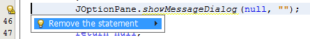
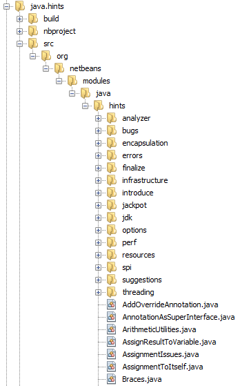
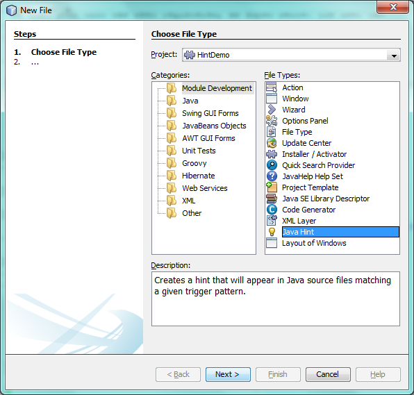
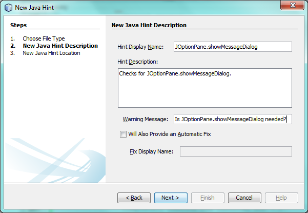
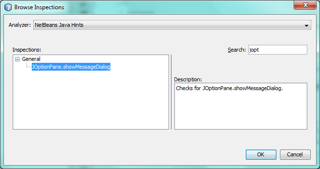
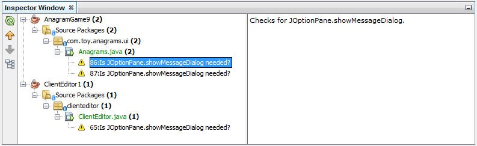

// 
//     Licensed to the Apache Software Foundation (ASF) under one
//     or more contributor license agreements.  See the NOTICE file
//     distributed with this work for additional information
//     regarding copyright ownership.  The ASF licenses this file
//     to you under the Apache License, Version 2.0 (the
//     "License"); you may not use this file except in compliance
//     with the License.  You may obtain a copy of the License at
// 
//       http://www.apache.org/licenses/LICENSE-2.0
// 
//     Unless required by applicable law or agreed to in writing,
//     software distributed under the License is distributed on an
//     "AS IS" BASIS, WITHOUT WARRANTIES OR CONDITIONS OF ANY
//     KIND, either express or implied.  See the License for the
//     specific language governing permissions and limitations
//     under the License.
//

= NetBeans Java Hint Module Tutorial
:jbake-type: platform_tutorial
:jbake-tags: tutorials 
:jbake-status: published
:syntax: true
:source-highlighter: pygments
:toc: left
:toc-title:
:icons: font
:experimental:
:description: NetBeans Java Hint Module Tutorial - Apache NetBeans
:keywords: Apache NetBeans Platform, Platform Tutorials, NetBeans Java Hint Module Tutorial

This tutorial demonstrates how to create a NetBeans module that provides one or more Java hints. At the end of the first scenario covered in this tutorial, whenever the user types " ``JOptionPane.showMessageDialog`` ", a Java hint will appear, asking the user whether the statement is needed (or whether it is there because the user needed it for debugging):

image::images/hint_72_result-1.png[]

At the end of the second scenario, the user will be able to click the hint to delete the superfluous statement:

In addition, the user will be able to find and replace multiple instances of the superfluous statement, after using the "Inspect &amp; Transform" dialog in the Refactor menu, which displays all found instances in the Refactoring window:

image::images/hint_72_result-3.png[]

NOTE:  This document is applicable to NetBeans IDE 8.0 and NetBeans Platform 8.0. If you are using an earlier version, see  link:74/nbm-java-hint.html[the previous version of this document].

For troubleshooting purposes, you are welcome to download the  link:http://web.archive.org/web/20170409072842/http://java.net/projects/nb-api-samples/show/versions/8.0/tutorials/MyCustomHints[completed tutorial source code].

== Learning About Java Hints

The best way to learn about the Java hint infrastructure is to read the sources of the Java hints that are part of the IDE. Start by identifying a hint that does something similar to what you would like to achieve, then check out the NetBeans sources, and read the source code of the related hint.

[start=1]
1. Use Mercurial to clone the NetBeans sources:  link:https://netbeans.apache.org/wiki/devfaqaccesssourcesusingmercurial[http://wiki.netbeans.org/DevFaqAccessSourcesUsingMercurial]

[start=2]
1. 
In the NetBeans sources, browse to the "java.hints" folder, expand it, and read the sources relevant to the hint you want to create:

The list of classes you see above is only the tip of the iceberg!

The remainder of the tutorial shows you how to put a Java hint together generally, from scratch, but remember that the best place to look for useful snippets of code is in the sources above, if there is anything specific that you don't know how to do.

== Setting Up the Module Project

Before you start writing the module, you have to make sure you that your project is set up correctly. The IDE provides a wizard that sets up all the basic files needed for a module.

[start=1]
1. Choose File > New Project (Ctrl+Shift+N). Under Categories, select NetBeans Modules. Under Projects, select Module. Click Next.

[start=2]
1. In the Name and Location panel, type  ``MyCustomHints``  in the Project Name field. Change the Project Location to any directory on your computer. Click Next.

[start=3]
1. In the Basic Module Configuration panel, type  ``org.my.custom.hints``  in Code Name Base. Click Finish.

The IDE creates the  ``MyCustomHints``  project. The project contains all of your sources and project metadata, such as the project's Ant build script. The project opens in the IDE. You can view its logical structure in the Projects window (Ctrl-1) and its file structure in the Files window (Ctrl-2).

== Scenario 1: Identifying Statements of Interest

In this section, you provide the Java code for the Java hint.

[start=1]
1. Right-click the project node and choose New > Other > Module Development > Java Hint: 

Click Next.

[start=2]
1. In the New Java Hint Description panel, fill out the fields as follows: 

Click Next.

[start=3]
1. In the New Java Hint Location panel, fill out the fields as follows: 
image::images/hint_72_new-hint-3.png[]

Click Finish.

The newly created class has the content below:

[source,java]
----

package org.my.custom.hints;

import org.netbeans.spi.editor.hints.ErrorDescription;
import org.netbeans.spi.java.hints.ConstraintVariableType;
import org.netbeans.spi.java.hints.ErrorDescriptionFactory;
import org.netbeans.spi.java.hints.Hint;
import org.netbeans.spi.java.hints.HintContext;
import org.netbeans.spi.java.hints.TriggerPattern;
import org.openide.util.NbBundle.Messages;

link:http://bits.netbeans.org/dev/javadoc/org-netbeans-spi-java-hints/org/netbeans/spi/java/hints/Hint.html[@Hint](displayName = "#DN_JOptionPaneHint",
      description = "#DESC_JOptionPaneHint", 
      category = "general")
link:http://bits.netbeans.org/dev/javadoc/org-openide-util/org/openide/util/NbBundle.Messages.html[@Messages]({
    "DN_JOptionPaneHint=JOptionPane.showMessageDialog",
    "DESC_JOptionPaneHint=Checks for JOptionPane.showMessageDialog."
})
public class JOptionPaneHint {

link:http://bits.netbeans.org/dev/javadoc/org-netbeans-spi-java-hints/org/netbeans/spi/java/hints/TriggerPattern.html[@TriggerPattern](
            value = "$str.equals(\"\")", //Specify a pattern as needed
            constraints =
link:http://bits.netbeans.org/dev/javadoc/org-netbeans-spi-java-hints/org/netbeans/spi/java/hints/ConstraintVariableType.html[@ConstraintVariableType](
                    variable = "$str", 
                    type = "java.lang.String"))
link:http://bits.netbeans.org/dev/javadoc/org-openide-util/org/openide/util/NbBundle.Messages.html[@Messages]("ERR_JOptionPaneHint=Is JOptionPane.showMessageDialog needed?")
    public static  link:http://bits.netbeans.org/dev/javadoc/org-netbeans-spi-editor-hints/org/netbeans/spi/editor/hints/ErrorDescription.html[ErrorDescription] computeWarning( link:http://bits.netbeans.org/dev/javadoc/org-netbeans-spi-java-hints/org/netbeans/spi/java/hints/HintContext.html[HintContext] ctx) {
        return  link:http://bits.netbeans.org/dev/javadoc/org-netbeans-spi-java-hints/org/netbeans/spi/java/hints/ErrorDescriptionFactory.html[ErrorDescriptionFactory].forName(
                ctx, 
                ctx.getPath(), 
                Bundle.ERR_JOptionPaneHint());
    }
    
}
----

[start=4]
1. Replace the  ``@TriggerPattern``  with the following:

[source,java]
----

@TriggerPattern(
            value = "$1.showMessageDialog", 
            constraints = 
                @ConstraintVariableType(
                    variable = "$1", 
                    type = "javax.swing.JOptionPane"))
----

[start=5]
1. Right-click the module and choose Build. Open the Files window (Ctrl-2) and browse to the generated layer file, which is shown below:

image::images/hint_72_layer-1.png[] 

Open the layer file and you should see that the following has been generated from the annotations in the class:

[source,xml]
----

<folder name="org-netbeans-modules-java-hints">
    <folder name="code-hints">
        <folder name="org-my-custom-hints-JOptionPaneHint.class">
            <folder name="org-netbeans-spi-java-hints-Hint.annotation">
                <!--org.my.custom.hints.JOptionPaneHint-->
                <attr
                    bundlevalue="org.my.custom.hints.Bundle#DN_JOptionPaneHint" name="displayName"/>
                <attr
                    bundlevalue="org.my.custom.hints.Bundle#DESC_JOptionPaneHint" name="description"/>
                <attr name="category" stringvalue="general"/>
            </folder>
            <folder name="computeWarning.method">
                <folder name="org-netbeans-spi-java-hints-TriggerPattern.annotation">
                    <folder name="constraints">
                        <folder name="item0">
                            <folder name="org-netbeans-spi-java-hints-ConstraintVariableType.annotation">
                                <!--org.my.custom.hints.JOptionPaneHint-->
                                <attr name="variable" stringvalue="$1"/>
                                <attr name="type" stringvalue="javax.swing.JOptionPane"/>
                            </folder>
                            <!--org.my.custom.hints.JOptionPaneHint-->
                        </folder>
                        <!--org.my.custom.hints.JOptionPaneHint-->
                    </folder>
                    <!--org.my.custom.hints.JOptionPaneHint-->
                    <attr name="value" stringvalue="$1.showMessageDialog"/>
                </folder>
                <!--org.my.custom.hints.JOptionPaneHint-->
            </folder>
            <!--org.my.custom.hints.JOptionPaneHint-->
        </folder>
    </folder>
</folder>
----

[start=6]
1. Switch back to the Projects window, right-click the module, and choose Run. A new instance of the IDE starts up. The module is installed automatically. Create a new Java application. Type  ``JOptionPane.showMessageDialog``  somewhere in your code. You should see the  ``showMessageDialog``  is underlined and you should also see the hint' displayed:

image::images/hint_72_result-1.png[]

When you click on the icon in the left sidebar, the popup below appears. Press the Right key on the keyboard while the popup is shown to expand it, so that you can configure it if necessary:

image::images/hint_72_result-2.png[]

Go to Source | Inspect, click Single Inspection, and then click the Browse button. Use the Search field to find your new inspection:

Set the Scope to "Open Projects", so that all projects will be searched for the statement of interest, and check that your inspection is shown:

image::images/hint_72_result-5.png[]

Click Inspect and notice that all instances of the statement of interest are found:

Double-click an item in the list above and the corresponding file opens, with the cursor on the line where the statement of interest has been found.

Though you are able to find statements throughout your projects, you're not able to fix them yet. That topic is covered in the next scenario.

== Scenario 2: Fixing Identified Statements

In this section, you learn how to fix statements of interest that have been identified via the instructions in the previous section.

[start=1]
1. Add the Java fix below as an inner class of the class created in the previous section.

[source,java]
----

private static final class FixImpl extends  link:http://bits.netbeans.org/dev/javadoc/org-netbeans-spi-java-hints/org/netbeans/spi/java/hints/JavaFix.html[JavaFix] {

    public FixImpl(CompilationInfo info, TreePath tp) {
        super(info, tp);
    }

    @Override
    @Messages("FIX_ShowMessageDialogChecker=Remove the statement")
    protected String getText() {
        return Bundle.FIX_ShowMessageDialogChecker();
    }

    @Override
    protected void performRewrite(TransformationContext tc) throws Exception {
        WorkingCopy wc = tc.getWorkingCopy();
        TreePath statementPath = tc.getPath();
        TreePath blockPath = tc.getPath().getParentPath();
        while (!(blockPath.getLeaf() instanceof BlockTree)) {
            statementPath = blockPath;
            blockPath = blockPath.getParentPath();
            if (blockPath == null) {
                return;
            }
        }
        BlockTree blockTree = (BlockTree) blockPath.getLeaf();
        List<? extends StatementTree> statements = blockTree.getStatements();
        List<StatementTree> newStatements = new ArrayList<StatementTree>();
        for (Iterator<? extends StatementTree> it = statements.iterator(); it.hasNext();) {
            StatementTree statement = it.next();
            if (statement != statementPath.getLeaf()) {
                newStatements.add(statement);
            }
        }
        BlockTree newBlockTree = wc.getTreeMaker().Block(newStatements, blockTree.isStatic());
        wc.rewrite(blockTree, newBlockTree);
    }

}
----

The code above comes from the NetBeans sources, where it is used in the SystemOut class, in the "java.hints" module, for removing found instances of  ``System.out`` .

[start=2]
1. Add the fix to the error description you defined in the previous section; you only need to add the code highlighted below:

[source,java]
----

public static ErrorDescription computeWarning(HintContext ctx) {
    * link:http://bits.netbeans.org/dev/javadoc/org-netbeans-spi-editor-hints/org/netbeans/spi/editor/hints/Fix.html?is-external=true[Fix] fix = new FixImpl(ctx.getInfo(), ctx.getPath()).toEditorFix();*
    return ErrorDescriptionFactory.forName(
            ctx,
            ctx.getPath(),
            Bundle.ERR_JOptionPaneHint(),
            *fix*);
}
----

[start=3]
1. Check that you have these import statements:

[source,java]
----

import com.sun.source.tree.BlockTree;
import com.sun.source.tree.StatementTree;
import com.sun.source.util.TreePath;
import java.util.ArrayList;
import java.util.Iterator;
import java.util.List;
import org.netbeans.api.java.source.CompilationInfo;
import org.netbeans.api.java.source.WorkingCopy;
import org.netbeans.spi.editor.hints.ErrorDescription;
import org.netbeans.spi.editor.hints.Fix;
import org.netbeans.spi.java.hints.ConstraintVariableType;
import org.netbeans.spi.java.hints.ErrorDescriptionFactory;
import org.netbeans.spi.java.hints.Hint;
import org.netbeans.spi.java.hints.HintContext;
import org.netbeans.spi.java.hints.JavaFix;
import org.netbeans.spi.java.hints.JavaFix.TransformationContext;
import org.netbeans.spi.java.hints.TriggerPattern;
import org.openide.util.NbBundle.Messages;
----

[start=4]
1. Install the module again and you will be able to click the hint to delete the superfluous statement:

In addition, you should be able to find and replace multiple instances of the superfluous statement, after using the "Inspect &amp; Transform" dialog in the Refactor menu, which displays all found instances in the Refactoring window:

image::images/hint_72_result-3.png[]

In this tutorial, you have been introduced to the NetBeans Java hint infrastructure. To obtain a deeper understanding, see the sources referred to at the start of this tutorial, as well as the resources referred to below.

link:http://netbeans.apache.org/community/mailing-lists.html[Send Us Your Feedback]

== See Also

For more information about creating and developing NetBeans Module, see the following resources:

*  link:http://wiki.netbeans.org/Java_DevelopersGuide[Java Developer's Guide]
*  link:https://netbeans.apache.org/tutorials/nbm-copyfqn.html[NetBeans Java Language Infrastructure Tutorial]
*  link:http://wiki.netbeans.org/RetoucheDeveloperFAQ[Retouche Developer FAQ]
*  link:https://netbeans.apache.org/kb/docs/platform.html[Other Related Tutorials]
*  link:https://bits.netbeans.org/dev/javadoc/[NetBeans API Javadoc]
