// 
//     Licensed to the Apache Software Foundation (ASF) under one
//     or more contributor license agreements.  See the NOTICE file
//     distributed with this work for additional information
//     regarding copyright ownership.  The ASF licenses this file
//     to you under the Apache License, Version 2.0 (the
//     "License"); you may not use this file except in compliance
//     with the License.  You may obtain a copy of the License at
// 
//       http://www.apache.org/licenses/LICENSE-2.0
// 
//     Unless required by applicable law or agreed to in writing,
//     software distributed under the License is distributed on an
//     "AS IS" BASIS, WITHOUT WARRANTIES OR CONDITIONS OF ANY
//     KIND, either express or implied.  See the License for the
//     specific language governing permissions and limitations
//     under the License.
//

= Criando o aplicativo CRUD da plataforma NetBeans utilizando Maven
:jbake-type: platform_tutorial
:jbake-tags: tutorials 
:jbake-status: published
:syntax: true
:source-highlighter: pygments
:toc: left
:toc-title:
:icons: font
:experimental:
:description: Criando o aplicativo CRUD da plataforma NetBeans utilizando Maven - Apache NetBeans
:keywords: Apache NetBeans Platform, Platform Tutorials, Criando o aplicativo CRUD da plataforma NetBeans utilizando Maven

Bem-vindo à  link:https://netbeans.apache.org/platform/[*Plataforma NetBeans*]!

Este documento mostra como utilizar a estrutura de construção Maven para criar um aplicativo da plataforma NetBeans que possa ser lido e gravado num banco de dados. Neste documento poderão ser utilizados os arquétipos Maven para criar o aplicativo e o módulo da plataforma NetBeans e o kit de ferramentas da Interface do usuário Swing e o construtor de GUI "Matisse" para criar componentes da janela.

Este documento se baseia no  link:nbm-crud_pt_BR.html[Tutorial do aplicativo NetBeans CRUD com base Ant para a plataforma NetBeans] e ilustra algumas das diferenças entre o uso de Ant e Maven para desenvolver os aplicativos da plataforma NetBeans. Após entender como Maven se diferencia de Ant, é possível prosseguir facilmente através de outros tutoriais na  link:https://netbeans.apache.org/kb/docs/platform_pt_BR.html[Trilha de aprendizagem da plataforma NetBeans].

O aplicativo modelo CRUD é um dos modelos Maven disponíveis no assistente do Novo projeto.

Caso não tenha experiência com a plataforma NetBeans, recomenda-se assistir à série de screencasts  link:https://netbeans.apache.org/tutorials/nbm-10-top-apis.html[As 10 principais APIs NetBeans].

*Para seguir este tutorial, são necessários o software e os recursos listados na tabela a seguir.*

NOTE: 

* O servidor do banco de dados JavaDB e um banco de dados modelo estão incluídos no pacote do GlassFish Server Open Source Edition 3.0.1.
* Não é necessário fazer o download de uma versão avulsa da plataforma NetBeans para desenvolver os aplicativos para a plataforma NetBeans. Normalmente, se desenvolve os aplicativos e módulos no NetBeans IDE e, a seguir, inclui-se somente os módulos necessários para executar a plataforma NetBeans e seu aplicativo.

Antes de começar este tutorial, talvez você queira se familiarizar com a documentação a seguir.

*  link:http://wiki.netbeans.org/MavenBestPractices[Melhores práticas para o Apache Maven no NetBeans 6.x]
*  link:http://www.sonatype.com/books/maven-book/reference/introduction.html[Capítulo 1. Introdução ao Apache Maven] (do  link:http://www.sonatype.com/books/maven-book/reference/public-book.html[Maven: o guia definitivo])
*  link:https://netbeans.apache.org/kb/docs/java/gui-functionality_pt_BR.html[Introdução à construção de GUI]

== Configurando o Maven

Se este for seu primeiro projeto Maven, talvez você queira verificar as definições de configurações do Maven na janela Opções. Para completar este tutorial é preciso ter o Maven instalado em seu sistema local. É possível fazer o download do instalador a partir do  link:http://maven.apache.org/[site do Maven].

[start=1]
1. Selecione a categoria Diversos na janela Opções e clique na aba Maven.

[start=2]
1. Especifique a localização da instalação local do Maven (exige-se o 2.0.9 ou um mais recente).

[start=3]
1. Verifique se a localização do repositório local do Maven está correta.

[start=4]
1. Clique em OK.

Na maioria dos casos, se a configuração do Maven for típica a informação na janela Opções já deve estar correta.

O IDE usa o Maven SCM para a verificação de artefatos Maven. Talvez você queira verificar se todos os clientes necessários para a verificação de fontes estão instalados no seu computador e configurados corretamente.

Para obter mais detalhes sobre o Maven SCM, consulte a  link:http://maven.apache.org/scm/index.html[página Maven SCM].

=== Visualizando os repositórios Maven

Os artefatos que são utilizados pelo Maven para construir todos os seus projetos são armazenados em seu repositório local Maven. Quando um artefato é declarado como uma dependência do projeto, o artefato é baixado para seu repositório local a partir de um dos repositórios remotos registrados.

O repositório NetBeans e vários super conhecidos repositórios indexados Maven são, por padrão, registrados e listados na janela do Navegador do repositório. O repositório NetBeans contém a maioria dos artefatos públicos necessários para a construção do seu projeto. É possível utilizar o navegador do repositório Maven para visualizar o conteúdo dos repositórios locais e remotos. É possível expandir o nó Repositório local para ver os artefatos que estão presentes localmente. Os artefatos listados sob os nós repositório NetBeans podem ser adicionados como dependências de projeto, mas nem todos eles estão presentes no local. Eles são adicionados ao repositório local somente quando são declarados como dependências do projeto.

Para abrir o navegador do repositório Maven:

* Selecione Janela > Outro > Navegador do repositório Maven no menu principal.

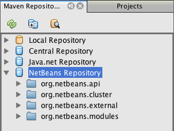

Quando seu cursor estiver sobre um artefato, o IDE exibirá uma dica de ferramenta com as coordenadas do artefato. É possível visualizar detalhes adicionais sobre um artefato ao clicar duas vezes no arquivo JAR do artefato no navegador.

É possível pesquisar por um artefato ao clicar no botão Localizar da barra de ferramentas do navegador do repositório Maven ou ao utilizar o campo de texto Pesquisa rápida na barra de ferramentas principal.

Para saber mais sobre como gerenciar as dependências do classpath Maven e sobre como trabalhar com repositórios Maven no IDE, consulte a seção  link:http://wiki.netbeans.org/MavenBestPractices#Dependency_management[Gerenciamento de dependência] em  link:http://wiki.netbeans.org/MavenBestPractices[Melhores práticas para o Apache Maven no NetBeans 6.x].

Para assistir a uma demonstração sobre como utilizar o Visualizador de artefato, consulte o screencast  link:https://netbeans.apache.org/kb/docs/java/maven-dependencies-screencast.html[ Trabalhando com dependências Maven].

== Criando o projeto do aplicativo da plataforma NetBeans

Nesta seção será utilizado o assistente Novo projeto para criar um aplicativo da plataforma NetBeans a partir de um arquétipo Maven. O assistente criará os projetos do módulo Maven que serão necessários para desenvolver um aplicativo da plataforma NetBeans. Será utilizado também o assistente Novo projeto para criar o módulo NetBeans.

=== Criando o projeto

Siga as seguintes etapas para criar o aplicativo da plataforma NetBeans utilizando o assistente do Novo projeto.

[start=1]
1. Selecione Arquivo > Novo projeto (Ctrl-Shift-N) para abrir o assistente do Novo projeto.

[start=2]
1. Selecione Aplicativo NetBeans Maven na categoria Maven. Clique em Próximo.

[start=3]
1. Digite *MavenPlatformCRUDApp* para o nome do projeto e defina a localização do projeto. Clique em Concluir.

NOTE:  é possível clicar em Próximo e criar um projeto do módulo no assistente ao criar o aplicativo da plataforma, mas para fins de demonstração neste tutorial, será criado o aplicativo e o módulo separadamente.

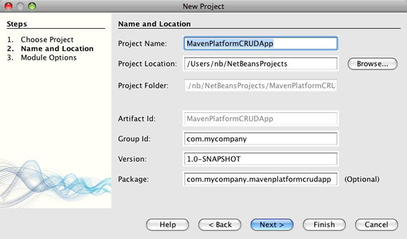

Ao clicar em Concluir, por padrão, o IDE cria os seguintes tipos de projetos Maven.

* *Aplicativo da plataforma NetBeans.* Este projeto é um projeto recipiente para o aplicativo da plataforma e lista os modelos a serem incluídos e a localização dos repositórios do projeto. Este projeto não contém nenhuma origem. O IDE gera os módulos contendo as origens e recursos nos subdiretórios deste projeto.
* *Plataforma NetBeans com base no aplicativo.* Este projeto especifica os artefatos (fontes) necessários para a compilação do aplicativo. As dependências exigidas (artefatos IDE, artefatos de módulos) são especificados no arquivo  ``pom.xml``  do projeto.
* *Recursos da marca do aplicativo da plataforma.* Este projeto contém os recursos utilizados para identificação da marca do aplicativo.

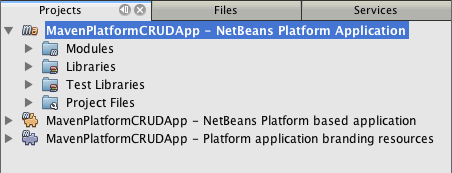

*Notas.*

* Caso este seja seu primeiro aplicativo da plataforma NetBeans utilizando o Maven, pode ser que leve mais tempo para criar os projetos, pois o IDE precisa baixar todos os artefatos necessários a partir do repositório NetBeans.
* Ao criar o projeto, será possível ver que alguns dos projetos (por exemplo, o projeto do aplicativo com base na Plataforma NetBeans) são evidenciados porque algumas das dependências declaradas no arquivo (POM) ``pom.xml``  não se encontram disponíveis.

=== Criando um módulo

Neste exercício será utilizado o assistente do Novo projeto para criar o módulo NetBeans.

[start=1]
1. Selecione Arquivo > Novo projeto (Ctrl-Shift-N) para abrir o assistente do Novo projeto.

[start=2]
1. Selecione Módulo NetBeans Maven na categoria Maven. Clique em Próximo.

[start=3]
1. Digite *MavenPlatformCRUDApp-dbaccess* para o Nome do projeto.

[start=4]
1. Especifique a localização do projeto clicando em Navegador e localizando o diretório *MavenPlatformCRUDApp-dbaccess*. Clique em Abrir.
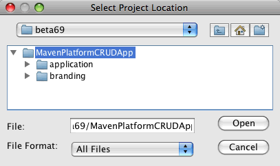

[start=5]
1. Clique em Concluir.

Ao clicar em Concluir, o assistente cria um projeto de módulo NetBeans chamado *MavenPlatformCRUDApp-dbaccess*. O módulo será automaticamente configurado para ser incluído no aplicativo ao ser salvo num subdiretório. Caso abra o POM para o projeto, é possível notar que o MavenPlatformCRUDApp foi declarado como o projeto pai.

[source,xml]
----

<parent>
    <artifactId>MavenPlatformCRUDApp</artifactId>
    <groupId>com.mycompany</groupId>
    <version>1.0-SNAPSHOT</version>
</parent>
<artifactId>MavenPlatformCRUDApp-dbaccess</artifactId>
<packaging>nbm</packaging>
<version>1.0-SNAPSHOT</version>
<name>MavenPlatformCRUDApp - dbaccess NetBeans Module</name>

----

É possível alterar a exibição do nome para o módulo editando o elemento  ``<nome>``  no POM ou modificando o nome na janela Propriedades do projeto. O nome de exibição padrão é a Id do artefato do projeto  ``MavenPlatformCRUDApp-dbaccess`` .

Se observar o POM para o aplicativo da plataforma NetBeans sob o nó Arquivos do projeto na janela Projetos, é possível notar que três módulos estão listados como módulos no aplicativo.

[source,xml]
----

<modules>
   <module>branding</module>
   <module>application</module>
   <module>MavenPlatformCRUDApp-dbaccess</module>
</modules>

----

=== Tornando o módulo uma dependência

Agora será necessário adicionar o módulo como uma dependência do aplicativo com base na plataforma NetBeans. É possível adicionar a dependência editando  ``pom.xml``  no editor ou utilizando a caixa de diálogo Adicionar dependência.

[start=1]
1. Amplie o nó *Aplicativo com base na plataforma NetBeans* na janela Projetos.

[start=2]
1. Clique com o botão direito do mouse no nó Bibliotecas e selecione Adicionar dependência.

[start=3]
1. Clique na aba Abrir projetos e selecione *MavenPlatformCRUDApp - dbaccess*. Clique em OK.
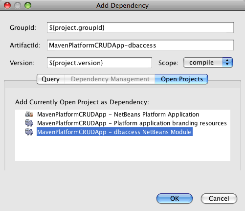

Caso amplie o nó Bibliotecas do aplicativo com base na plataforma NetBeans na janela Projetos, é possível notar que o MavenPlatformCRUDApp-dbaccess está agora listado como uma dependência.

Se observar o POM do aplicativo com base na plataforma NetBeans, verá que o artefato  ``MavenPlatformCRUDApp-dbaccess``  está listado como uma dependência necessária para a compilação do aplicativo. O artefato estará disponível após a construção do projeto do módulo e a instalação do artefato no seu repositório local.

[source,xml]
----

<dependency>
    <groupId>${project.groupId}</groupId>
    <artifactId>*MavenPlatformCRUDApp-dbaccess*</artifactId>
    <version>${project.version}</version>
</dependency>
----

===  Marcando o aplicativo

O módulo da marca especifica os recursos da marca que são utilizados ao construir o aplicativo da plataforma. A caixa de diálogo da marca lhe permite especificar facilmente o nome do aplicativo, a tela de splash e o ícone do aplicativo e modificar os valores dos elementos do texto.

Neste exercício será substituída a imagem de splash padrão. Por padrão, o módulo da marca gerado pelo IDE contém uma imagem que é exibida ao iniciar o aplicativo da plataforma. É possível substituí-la por uma imagem diferente executando os passos a seguir.

[start=1]
1. Clique com o botão direito no módulo *Recursos da marca do aplicativo da plataforma* na janela Projetos e selecione Marca.

[start=2]
1. Na aba Tela de splash, especifique uma imagem para utilizar como a tela de splash clicando no botão Navegador ao lado da imagem da tela de splash e localizando a imagem que deseja utilizar. Clique em OK.

Por exemplo, é possível copiar a imagem abaixo no sistema local e especificar a imagem na caixa de diálogo Marca.

Ao iniciar o aplicativo, a nova imagem aparecerá durante a inicialização.

== Criando as classes de entidade

Nesta seção será possível gerar algumas entidades a partir das tabelas no banco de dados do Java DB. Para criar as classes de entidades e utilizar o Java Persistence API (JPA) no seu aplicativo, é necessário ter acesso ao servidor do banco de dados e às bibliotecas do provedor de persistência JPA. Este tutorial usa o servidor do banco de dados do JavaDB, mas é possível configurar o aplicativo para utilizar outros servidores de banco de dados.

O jeito mais fácil de tornar os recursos disponíveis é registrar uma instância do GlassFish Server Open Source Edition 3.0.1 que vem com o IDE. O servidor do banco de dados do Java DB, um banco de dados modelo e um provedor de persistência JPA estão incluídos no servidor GlassFish. Antes de criar classes de entidades, inicie o Java DB executando os passos a seguir.

[start=1]
1. Na janela Serviços, amplie o nó Servidores e verifique se há uma instância GlassFish registrada.

[start=2]
1. Amplie o nó Banco de dados, clique com o botão direito no nó conexão do banco de dados para o *banco de dados* do aplicativo no Java DB ( ``jdbc:derby://localhost:1527/sample [app on APP]``  e selecione Conectar.

Ao selecionar Conectar, o IDE iniciará o banco de dados, caso este já não tenha sido iniciado.

=== Adicionando do DerbyClient como uma dependência do tempo de execução

Nesta seção será possível adicionar a biblioteca do derbyclient-10.5.3.0_1 como uma dependência.

[start=1]
1. Clique com o botão direito no nó Bibliotecas do módulo *dbaccess* e selecione Adicionar dependência.

[start=2]
1. Adicione a biblioteca digitando *org.apache.derby* para a Id do grupo, *derbyclient* para a Id do artefato e *10.5.3.0_1* para a Versão.

[start=3]
1. Selecione *Tempo de execução* na lista suspensa Escopo. Clique em OK.
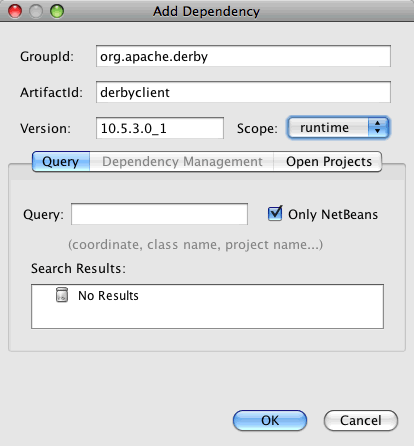

Caso amplie o nó Bibliotecas do tempo de execução na janela Projetos, é possível notar que a biblioteca  ``derbyclient``  está listada como uma dependência.

Também é possível modificar o POM no editor para especificar o valor do elemento  ``<escopo>``  de uma dependência.

[source,xml]
----

<dependência>
            <Id do grupo>org.apache.derby</Id do grupo>
            <Id do artefato>derbyclient</Id do artefato>
            <versão>10.5.3.0_1</versão>
            <escopo>tempo de execução</escopo>
        </dependência>
----

=== Gerando classes de entidade a partir do banco de dados

Nesta seção será utilizado um assistente para gerar classes de entidade no módulo *dbaccess*.

[start=1]
1. Clique com o botão direito em Pacotes originais do módulo *dbaccess* e selecione Novo > Outro.

[start=2]
1. Selecione Classes de entidade a partir do banco de dados na categoria Persistência. Clique em Próximo.

[start=3]
1. Selecione o banco de dados modelo Java DB na lista suspensa Conexão do banco de dados.

[start=4]
1. Selecione a tabela Cliente na lista Tabelas disponíveis, e clique em Adicionar. Ao clicar em Adicionar, a tabela relacionada Códigodedesconto também é adicionada à lista Tabelas selecionadas. Clique em Próximo.

[start=5]
1. Digite *com.mycompany.mavenplatformcrudapp.dbaccess* para o nome do pacote. Certifique-se de que os comandos Criar unidade de persistência e Gerar anotações de consultas nomeadas estejam selecionados. Clique em Concluir.

Ao clicar em Concluir, o IDE gera as classes de entidade Cliente e Código de desconto. O IDE também gera o arquivo  ``persistence.xml`` no pacote  ``META-INF``  sob o nó Outras fontes, no diretório  ``src/main/resources`` .

== LER: Leitura e Exibição de um registro

Nesta seção será utilizado um assistente para adicionar um Componente de janela ao módulo *dbaccess*. Será ativada uma visualização de árvore no componente de janela exiba os objetos como nós. É possível visualizar os dados para cada registro na janela de propriedades dos nós.

=== Adicionando um Componente de janela

Neste exercício será criado o componente de janela.

[start=1]
1. Clique com o botão direito do mouse no nó Projeto na janela Projetos e selecione Nova > Janela.

[start=2]
1. Selecione: *editor*na lista suspensa Posição da janela e selecione *Abrir na inicialização do aplicativo*. Clique em Próximo.
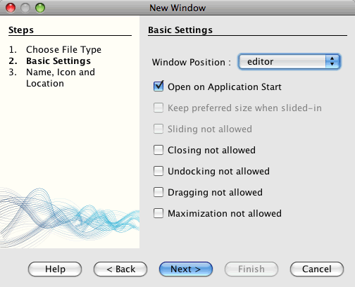

[start=3]
1. Digite: *Cliente* como o Prefixo do nome da classe.

[start=4]
1. Digite: *com.mycompany.mavenplatformcrudapp.viewer* para o pacote. Clique em Concluir.

O assistente exibe uma lista de arquivos que serão criados e modificados.

Ao clicar em Concluir, na janela Projetos, é possível notar que o IDE gera a classe  ``CustomerTopComponent.java``  em  ``com.mycompany.mavenplatformcrudapp.viewer``  sob Pacotes originais. É possível visualizar a estrutura do projeto na janela Arquivos. Para compilar um projeto Maven, somente podem ser localizados arquivos de origem sob o diretório Pacotes originais ( ``src/main/java``  na janela Arquivos). Arquivos de recursos (ex. arquivos XML) devem estar localizados sob o diretório Outras fontes ( ``src/main/resources`` na janela Arquivos).

=== Adicionando uma visualização de árvore

Agora será modificado o componente de janela a fim de exibir registros do banco de dados numa visualização de árvore. Será adicionado o gerenciador de entidade ao construtor e ativará uma visualização de árvore bean.

[start=1]
1. Clique na aba Origem do  ``CustomerTopComponent.java``  para visualizar o código da fonte no editor.

[start=2]
1. Modifique o construtor para adicionar os seguintes comandos.

[source,java]
----

EntityManager entityManager = Persistence.createEntityManagerFactory("com.mycompany_MavenPlatformCRUDApp-dbaccess_nbm_1.0-SNAPSHOTPU").createEntityManager();
    Query query = entityManager.createQuery("SELECT c FROM Customer c");
    List<Customer> resultList = query.getResultList();*EntityManager entityManager = Persistence.createEntityManagerFactory("com.mycompany_MavenPlatformCRUDApp-dbaccess_nbm_1.0-SNAPSHOTPU").createEntityManager();
    Query query = entityManager.createQuery("SELECT c FROM Customer c");
    List<Customer> resultList = query.getResultList();*}
----

Certifique-se de que o nome da unidade persistente no código esteja correto comparando-o ao nome especificado no  ``persistence.xml`` .

[start=3]
1. Modifique a assinatura de classe para implementar o  ``ExplorerManager.Provider.`` 

[source,java]
----

public final class CustomerTopComponent extends TopComponent *implements ExplorerManager.Provider*
----

[start=4]
1. Corrija as importações para importar o  ``*javax.persistence.Query*``  e o  ``*javax.util.List*`` .

[start=5]
1. Declare e inicialize o ExplorerManager:

[source,java]
----

private static ExplorerManager em = new ExplorerManager();
----

[start=6]
1. Implemente os métodos abstratos e modifique o método  ``getExplorerManager``  para retornar  ``em`` .

[source,java]
----

@Override
public ExplorerManager getExplorerManager() {
    return em;
}
----

É possível colocar o cursor de inserção na assinatura de classe e pressionar Alt+Enter para implementar os métodos abstratos.

[start=7]
1. Adicione os comando seguintes ao construtor para ativar a visualização de árvore.

[source,java]
----

BeanTreeView beanTreeView = new BeanTreeView();
adicionar(beanTreeView, BorderLayout.CENTER);
----

[start=8]
1. Na visualização Desenho, clique com o botão direito no componente e selecione Definir Layout > Layout da borda. Salve as alterações.

=== Criação de uma Classe de fábrica

Agora será criado criar uma nova classe *CustomerChildFactory* no pacote  ``com.mycompany.mavenplatformcrudapp.viewer``  que cria um novo BeanNode para cada cliente no seu banco de dados.

[start=1]
1. Clique com o botão direito no pacote  ``*com.mycompany.mavenplatformcrudapp.viewer*`` e selecione Nova > Classe Java.

[start=2]
1. Digite *CustomerChildFactory* para o Nome da classe. Clique em Concluir.

[start=3]
1. Modifique a assinatura para estender  ``ChildFactory<Cliente>`` .

[start=4]
1. Declare o campo  ``resultList``  para a lista de itens na tabela e adicione o método  ``CustomerChildFactory`` .

[source,java]
----

private List<Customer> resultList;

public CustomerChildFactory(List<Customer> resultList) {
    this.resultList = resultList;
}
----

[start=5]
1. Implemente e, a seguir, modifique o método abstrato  ``createKeys`` .

[source,java]
----

@Override
    protected boolean createKeys(List<Customer> list) {
      for (Customer customer : resultList) {
          list.add(customer);
      }
      return true;
    }
----

[start=6]
1. Adicione um método par criar nós.

[source,java]
----

@Override
protected Node createNodeForKey(Customer c) {
    try {
        return new BeanNode(c);
    } catch (IntrospectionException ex) {
        Exceptions.printStackTrace(ex);
        return null;
    }
}
----

[start=7]
1. Corrija as importações para importar o  ``org.openide.nodes.Node``  e o  ``java.beans.InstrospectionException`` . Salve as alterações.

A classe se parecerá com:

[source,java]
----

package com.mycompany.mavenplatformcrudapp.viewer;

import com.mycompany.mavenplatformcrudapp.dbaccess.Customer;
import java.beans.IntrospectionException;
import java.util.List;
import org.openide.nodes.BeanNode;
import org.openide.nodes.ChildFactory;
import org.openide.nodes.Node;
import org.openide.util.Exceptions;

public class CustomerChildFactory extends ChildFactory<Customer> {

    private List<Customer> resultList;

    public CustomerChildFactory(List<Customer> resultList) {
        this.resultList = resultList;
    }    @Override
    protected boolean createKeys(List<Customer> list) { 
        for (Customer customer : resultList) { 
            list.add(customer);
        }        return true;    }
    @Override    protected Node createNodeForKey(Customer c) {        try {
            return new BeanNode(c);
        } catch (IntrospectionException ex) {
            Exceptions.printStackTrace(ex);
            return null;
        }    }

}
----

É necessário modificar o *CustomerTopComponent* para utilizar o ExplorerManager para passar a lista de resultados da consulta JPA para o Nó.

[start=1]
1. Adicione as linhas a seguir ao construtor CustomerTopComponent para definir o contexto da raiz para os nós e para adicionar o ActionMap do TopComponent e o ExplorerManager à Pesquisa do TopComponent.

[source,java]
----

    EntityManager entityManager =  Persistence.createEntityManagerFactory("com.mycompany_MavenPlatformCRUDApp-dbaccess_nbm_1.0-SNAPSHOTPU").createEntityManager();
    Query query = entityManager.createQuery("SELECT c FROM Customer c");
    List<Customer> resultList = query.getResultList();
    *em.setRootContext(new AbstractNode(Children.create(new CustomerChildFactory(resultList), true)));
    associateLookup(ExplorerUtils.createLookup(em, getActionMap()));*
----

Isto sincronizará a janela propriedades e o texto da dica de ferramenta para cada nó selecionado.

[start=2]
1. Corrija as importações e salve as alterações.

=== Executando do aplicativo

Neste exercício será testado o aplicativo para confirmar que este é capaz de acessar e ler corretamente as tabelas do banco de dados. Antes de construir e executar o aplicativo é necessário modificar o POM pois o aplicativo exige uma dependência direta nos JARs  ``org-openide-nodes``  e  ``org-openide-explorer`` . É possível modificar a dependência na janela Projetos.

[start=1]
1. Amplie o nó Bibliotecas do módulo *dbaccess*.

[start=2]
1. Clique com o botão direito no JAR  ``org-openide-nodes``  e selecione Declarar como dependência direta.

[start=3]
1. Clique com o botão direito no JAR  ``org-openide-explorer``  e selecione Declarar como dependência direta.

[start=4]
1. Clique com o botão direito no *aplicativo com base na plataforma NetBeans MavenPlatformCRUDApp* e selecione Construir com dependências.

A Janela de saída exibe os módulos que serão incluídos.

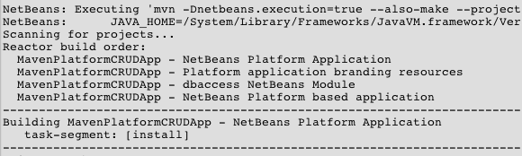

A Janela de saída exibe também o status da construção.

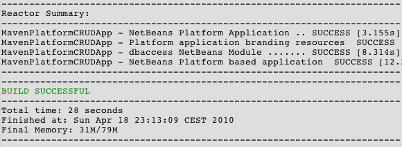

[start=5]
1. Clique com o botão direito do mouse no aplicativo e selecione Executar.

Ao iniciar o aplicativo, a janela Cliente aparecerá com um nó para cada um dos registros na tabela do banco de dados.

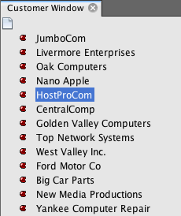

É possível clicar com o botão direito num nó na árvore da janela Cliente e selecionar Propriedades, para visualizar detalhes adicionais sobre o item.

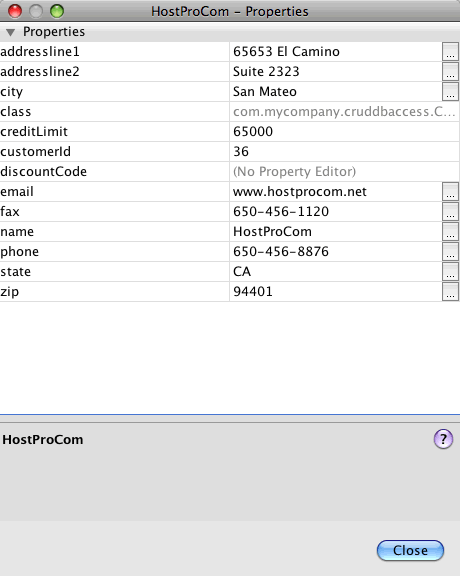

== ATUALIZAÇÃO: Edição de um registro

Nesta seção será adicionado um componente de janela para editar os detalhes de um registro.

=== Criando a janela Editor

Neste exercício será criada uma nova janela MyEditor a qual conterá dois campos de texto para a edição dos campos do nome e da cidade do nó selecionado. Será então modificado o arquivo  ``layer.xml``  de maneira que a janela Cliente seja aberta no modo explorer ao invés de no modo editor.

[start=1]
1. Clique com o botão direito no módulo *dbaccess* e selecione Nova > Janela.

[start=2]
1. Selecione *editor* na lista suspensa e selecione *Abrir na inicialização do aplicativo*. Clique em Próximo.

[start=3]
1. Digite *MyEditor* como o Prefixo do nome de classe.

[start=4]
1. Digite *com.mycompany.mavenplatformcrudapp.editor* como o pacote. Clique em Concluir.

[start=5]
1. Adicione dois JLabels e dois JTextFileds na visualização Desenho do  ``MyEditorTopComponent`` .

[start=6]
1. Defina os textos dos rótulos como "Nome" e "Cidade" e defina os nomes das variáveis dos dois JTextFields como  ``*jTextField1*``  e  ``*jTextField2*`` . Salve as alterações.
image::images/maven-crud_mavencrud-myeditor-window.png[title=" Componente de janela na visualização Desenho"]

[start=7]
1. Amplie o nó Arquivos importantes na janela Projetos e clique duas vezes na *Camada XML* para abrir o arquivo  ``layer.xml``  no editor.

[start=8]
1. Modifique  ``layer.xml``  para especificar que a janela CustomerTopComponent aparecerá no modo explorer. Salve as alterações.

[source,xml]
----

<folder name="Modes">
    <folder name="editor"........<file name="MyEditorTopComponent.wstcref" url="MyEditorTopComponentWstcref.xml"/>
    </folder>*<folder name="explorer">
        <file name="CustomerTopComponent.wstcref" url="CustomerTopComponentWstcref.xml"/>
    </folder>*</folder>
            
----

Agora é possível testar o aplicativo para certificar-se de que as janelas estejam abertas e situadas no local correto.

Lembre-se de limpar o aplicativo antes de construir utilizando dependências.

Agora é possível adicionar o código de maneira que ao selecionar um nó na janela Cliente, os campos do nome e da cidade do objeto estejam exibidos no editor.

=== Utilizando um LookupListener

Neste exercício será possível modificar a janela Cliente de maneira que quando um nó estiver selecionado, um novo objeto  ``Cliente``  é adicionado à função Pesquisar do nó. Será então modificado o MyEditor de maneira que a janela implementará o  `` link:http://bits.netbeans.org/dev/javadoc/org-openide-util-lookup/org/openide/util/LookupListener.html[LookupListener]``  para ouvir os objetos  ``Clientes``  que foram adicionados à função Pesquisar.

[start=1]
1. Modifique o método  ``createNodeForKey``  em *CustomerChildFactory* para criar um  ``AbstractNode``  ao invés de um  ``BeanNode`` .

[source,java]
----

@Override
protected Node createNodeForKey(Customer c) {*Node node = new AbstractNode(Children.LEAF, Lookups.singleton(c));
  node.setDisplayName(c.getName());
  node.setShortDescription(c.getCity());
  return node;*//        tente {
//            retorne o novo BeanNode(c);
//        } capture (IntrospectionException ex) {
//            Exceptions.printStackTrace(ex);
//            retorne nulo;
//        }
}
----

Ao selecionar um novo nó na janela Cliente, o objeto selecionado  ``Cliente``  é adicionado à função Pesquisar da janela.

[start=2]
1. Clique na aba Origem do *MyEditorTopComponent* e modifique a assinatura da classe para implementar o  ``LookupListener`` .

[source,java]
----

public final class MyEditorTopComponent extends TopComponent *implementa o LookupListener*
----

[start=3]
1. Adicione uma variável para armazenar os resultados.

[source,java]
----

private Lookup.Result result = null;
----

[start=4]
1. Implemente os métodos abstratos necessários para adicionar o método  ``resultChanged`` .

[start=5]
1. Modifique o método  ``resultChanged``  para atualizar o jTextFields toda vez que um novo objeto  ``Cliente``  for introduzido na função Pesquisar.

[source,java]
----

      @Override
      public void resultChanged(LookupEvent le) {
          Lookup.Result r = (Lookup.Result) le.getSource();
          Collection<Customer> coll = r.allInstances();
          if (!coll.isEmpty()) {
              for (Customer cust : coll) {
                  jTextField1.setText(cust.getName());
                  jTextField2.setText(cust.getCity());
              }
          } else {
              jTextField1.setText("[no name]");
              jTextField2.setText("[no city]");
          }
      }

----

Após definir o LookupListener, é possível adicioná-lo ao  ``Lookup.Result``  obtido a partir do contexto global. O contexto global aproxima o contexto do nó selecionado. Por exemplo, se o "Ford Motor Co" estiver selecionado na hierarquia da árvore, o objeto  ``Cliente``  para "Ford Motor Co" é adicionado à função Pesquisar do nó. Como este é o nó atualmente selecionado, o objeto  ``Cliente``  para "Ford Motor Co" está agora disponível no contexto global. Isso é, então, o que é passado para o  ``resultChanged`` , fazendo com que os campos de texto sejam preenchidos.

[start=6]
1. Modifique os métodos  ``componentOpened``  e  ``componentClosed``  para ativar o LookupListener ao abrir a janela editor.

[source,java]
----

      @Override
      public void componentOpened() {
          result = WindowManager.getDefault().findTopComponent("CustomerTopComponent").getLookup().lookupResult(Customer.class);
          result.addLookupListener(this);
          resultChanged(new LookupEvent(result));
      }

      @Override
      public void componentClosed() {
          result.removeLookupListener(this);
          result = null;
      }
----

Como a janela editor está configurada para ser aberta quando for iniciado o aplicativo, o LookupListener também estará disponível na hora em que o aplicativo for iniciado.

Neste exemplo está sendo utilizada a função Pesquisar fornecida pela janela Cliente. A janela é identificada explicitamente neste caso pela string " ``CustomerTopComponent`` ". A string é especificada no código de origem do  ``CustomerTopComponent``  como a ID do CustomerTopComponent. Esta abordagem funciona somente se o MyEditorTopComponent puder encontrar um TopComponent com a ID "CustomerTopComponent".

Uma abordagem mais flexível que envolve a regravação do modelo de seleção é descrita por Tim Bordeau, nesta  link:http://weblogs.java.net/blog/timboudreau/archive/2007/01/how_to_replace.html[entrada de blog].

É possível executar o aplicativo novamente após executar o comando Limpar e Construir com dependências. A janela editor estará atualizada ao selecionar um novo nó na janela Cliente. Nenhuma propriedade está exibida na janela Propriedades do nó uma vez que está sendo utilizado agora o  ``AbstractNode``  ao invés do  ``BeanNode`` .

=== Adição dos comandos Desfazer e Refazer

Neste exercício serão ativadas funções Desfazer e Refazer ao implementar o gerenciador  `` link:http://bits.netbeans.org/dev/javadoc/org-openide-awt/org/openide/awt/UndoRedo.html[UndoRedo]`` . Os botões Desfazer e Refazer na barra de ferramentas e os itens do menu Desfazer e Refazer serão ativados quando um usuário fizer uma alteração num dos campos na janela Editor.

[start=1]
1. Declare e instancie um novo UndoRedoManager na parte superior do MyEditorTopComponent.

[source,java]
----

private UndoRedo.Manager manager = new UndoRedo.Manager();
----

[start=2]
1. Crie um método  ``getUndoRedo()``  no MyEditorTopComponent:

[source,java]
----

@Override
public UndoRedo getUndoRedo() {
  return manager;
}
----

[start=3]
1. Adicione os seguintes comandos ao construtor.

[source,java]
----

jTextField1.getDocument().addUndoableEditListener(manager);
jTextField2.getDocument().addUndoableEditListener(manager);
----

É possível executar o aplicativo para testar os botões e itens do menu para as funções Desfazer e Refazer que estão em funcionamento.

=== Adicionando a função Salvar

Neste exercício será integrada a função Salvar plataforma NetBeans. O arquivo  ``layer.xml`` será modificado para ocultar o botão "Salvar tudo" na barra de ferramentas e para adicionar o botão "Salvar". Serão adicionados então listeners para detectar alterações nos campos de texto e um método  ``ativar``  que é ativado quando é detectada uma mudança.

[start=1]
1. Abra e modifique o arquivo  ``layer.xml``  do módulo *dbaccess* para adicionar um elemento Barra de ferramenta.

[source,xml]
----

    *<folder name="Toolbars">
      <folder name="File">
          <file name="org-openide-actions-SaveAction.shadow">
              <attr name="originalFile" stringvalue="Actions/System/org-openide-actions-SaveAction.instance"/>
              <attr name="position" intvalue="444"/>
          </file>
          <file name="org-openide-actions-SaveAllAction.shadow_hidden"/>
      </folder>
    </folder>*</filesystem>
----

[start=2]
1. No construtor *MyEditorTopComponent*, adicione a chamada seguinte para acionar um método quando for detectada uma alteração nos campos de texto.

[source,java]
----

public MyEditorTopComponent() {

          ...
    jTextField1.getDocument().addUndoableEditListener(manager);
    jTextField2.getDocument().addUndoableEditListener(manager);

    *jTextField1.getDocument().addDocumentListener(new DocumentListener() {
        public void insertUpdate(DocumentEvent arg0) {
          fire(true);
        }
        public void removeUpdate(DocumentEvent arg0) {
          fire(true);
        }
        public void changedUpdate(DocumentEvent arg0) {
          fire(true);
        }
    });

    jTextField2.getDocument().addDocumentListener(new DocumentListener() {
        public void insertUpdate(DocumentEvent arg0) {
          fire(true);
        }
        public void removeUpdate(DocumentEvent arg0) {
          fire(true);
        }
        public void changedUpdate(DocumentEvent arg0) {
          fire(true);
        }
    });

    //Cria uma nova instância para a implementação SaveCookie:
    impl = new SaveCookieImpl();

    //Cria uma nova instância para o objeto dinâmico:
    content = new InstanceContent();

    //Adiciona o objeto dinâmico ao TopComponent Lookup:
    associateLookup(new AbstractLookup(content));*

    ...
}
----

[start=3]
1. Adicione o método  ``acionar``  que é chamado sempre que é detectada uma alteração.

[source,java]
----

public void fire(boolean modified) {
  if (modified) {
      //Se o texto for modificado,
      //adicione SaveCookie impl ao Lookup:
      content.add(impl);
  } else {
      //Do contrário, remova o SaveCookie impl do lookup:
      content.remove(impl);
  }
}
----

[start=4]
1. Adicione a implementação a seguir da função  `` link:http://bits.netbeans.org/dev/javadoc/org-openide-nodes/org/openide/cookies/SaveCookie.html[SalvarCookie]``  que foi adicionada à  ``InstanceContent``  pelo método  ``acionar`` .

[source,java]
----

private class SaveCookieImpl implements SaveCookie {

  @Override
  public void save() throws IOException {

     Confirmation message = new NotifyDescriptor.Confirmation("Do you want to save \""
              + jTextField1.getText() + " (" + jTextField2.getText() + ")\"?",
              NotifyDescriptor.OK_CANCEL_OPTION,
              NotifyDescriptor.QUESTION_MESSAGE);

      Object result = DialogDisplayer.getDefault().notify(message);
      //Quando o usuário clica em "Sim", indicando que realmente deseja salvar,
      //é necessário desabilitar a ação Salvar,
      //de forma que isto só será utilizável quando for feita a próxima mudança       //à JTextArea:
      if (NotifyDescriptor.YES_OPTION.equals(result)) {
          acionar(falso);
          //Implemente aqui a função salvar.
      }
  }
}
----

[start=5]
1. Adicione os campos a seguir ao MyEditorTopComponent.

[source,java]
----

private final SaveCookieImpl impl;
private final InstanceContent content;

----

[start=6]
1. Corrija as importações e salve as alterações.

[start=7]
1. Clique com o botão direito no JAR  ``org-opnide-dialogs``  sob o nó Bibliotecas na janela Projetos e selecione Declarar como dependência direta.

É possível agora limpar, construir com dependências e executar o aplicativo para confirmar que o botão Salvar esteja ativado ao modificar um campo de texto.

=== Alterações persistentes

No próximo exercício será adicionado o código para persistir as alterações. No momento, o aplicativo reconhece corretamente quando uma alteração é feita num campo e ativa a opção para salvar as mudanças. Ao clicar em Salvar, aparece uma caixa de diálogo solicitando que confirme que deseja salvar as alterações. No entanto, as alterações não persistem quando clica em OK na caixa de diálogo. Para vigorar as alterações, é necessário adicionar alguns códigos JPA para controlar a persistência do banco de dados.

[start=1]
1. Adicione os campos a seguir ao *MyEditorTopComponent*.

[source,java]
----

cliente Cliente privado;
----

[start=2]
1. Adicione o código JPA para vigorar as alterações modificando o método  ``salvar``  para substituir o comentário  ``"//Implemente aqui a função Salvar." ``  com o código a seguir.

[source,java]
----

@Override
public void save() throws IOException {
...
    if (NotifyDescriptor.YES_OPTION.equals(result)) {
        fire(false); * EntityManager entityManager = Persistence.createEntityManagerFactory("com.mycompany_MavenPlatformCRUDApp-dbaccess_nbm_1.0-SNAPSHOTPU").createEntityManager();
        entityManager.getTransaction().begin();
        Customer c = entityManager.find(Customer.class, customer.getCustomerId());
        c.setName(jTextField1.getText());
        c.setCity(jTextField2.getText());
        entityManager.getTransaction().commit();*    }}
----

Verifique se o nome da unidade persistente está correto.

O "cliente" em  ``customer.getCustomerId()`` está atualmente indefinido. Na próxima etapa será definido o  ``cliente``  como o objeto atual  ``Cliente``  usado para obter a ID do Cliente.

[start=3]
1. Adicione a linha a seguir em negrito ao método  ``resultChanged`` .

[source,java]
----

@Override
public void resultChanged(LookupEvent le) {
    Lookup.Result r = (Lookup.Result) le.getSource();
    Collection<Customer> coll = r.allInstances();
    if (!coll.isEmpty()) {
      for (Customer cust : coll) {
          *customer = cust;*           jTextField1.setText(cust.getName());
          jTextField2.setText(cust.getCity());
      }
    } else {
      jTextField1.setText("[no name]");
      jTextField2.setText("[no city]");
    }
}
----

[start=4]
1. Corrija as importações e salve as alterações.

É possível executar o aplicativo e alterar alguns dados para testar se a função Salvar está funcionando corretamente e se persistem as alterações. No momento, o editor não atualiza os campos para refletir os dados alterados. Para verificar se os dados persistem será necessário reiniciar o aplicativo.

No próximo exercício será adicionada uma função "Atualizar" que recarregará os dados do banco de dados e lhe permitirá visualizar as alterações no editor.

=== Adição da função Atualizar

Neste exercício será adicionada a funcionalidade para atualizar o observador do Cliente adicionando um item de menu "Atualizar" ao nó raiz na janela Cliente.

[start=1]
1. Clique com o botão direito do mouse no pacote  ``*com.mycompany.mavenplatformcrudapp.viewer*`` e selecione Nova > Classe Java e crie uma classe chamada *CustomerRootNode*.

[start=2]
1. Modifique a classe para ampliar o  ``AbstractNode``  e adicione os seguintes métodos.

[source,java]
----

public class CustomerRootNode extends AbstractNode {

    * public CustomerRootNode(Children kids) {
      super(kids);
      setDisplayName("Root");
    }

    @Override
    public Action[] getActions(boolean context) {
      Action[] result = new Action[]{
          new RefreshAction()};
      return result;
    }

    private final class RefreshAction extends AbstractAction {

      public RefreshAction() {
          putValue(Action.NAME, "Refresh");
      }

      public void actionPerformed(ActionEvent e) {
          CustomerTopComponent.refreshNode();
      }
    }*}
----

Observe que a ação "Atualizar" está vinculado ao novo nó Raiz.

[start=3]
1. Corrija as importações para importar * ``javax.swing.Action`` *. Salve as alterações.

[start=4]
1. Modifique *CustomerTopComponent* para adicionar o método seguinte para atualizar a visualização:

[source,java]
----

public static void refreshNode() {
    EntityManager entityManager = Persistence.createEntityManagerFactory("com.mycompany_MavenPlatformCRUDApp-dbaccess_nbm_1.0-SNAPSHOTPU").createEntityManager();
    Query query = entityManager.createQuery("SELECT c FROM Customer c");
    List<Customer> resultList = query.getResultList();
    em.setRootContext(new *CustomerRootNode*(Children.create(new CustomerChildFactory(resultList), true)));
}
----

Observe que o método usa *CustomerRootNode* para configuração do contexto de raiz.

Na classe  ``CustomerRootNode`` , é possível pressionar Alt+Enter na linha contendo  ``refreshNode``  caso deseje que o IDE gere o esqueleto do método.

[start=5]
1. Modifique o código no construtor do CustomerTopComponent com uma chamada para *CustomerRootNode* ao invés de *AbstractNode*.

Ao chamar o  ``CustomerRootNode``  chama automaticamente o método  ``refreshNode``  e invoca uma "Atualização".

[start=6]
1. Corrija as importações e salve as alterações.

Caso execute o aplicativo, será possível ver que há um novo nó de raiz com uma ação "Atualizar" disponível no menu pop-up.

É possível reutilizar o método  ``refreshNode``  e implementar uma atualização automática chamando o método  ``refreshNode`` do método  ``salvar`` . Alternativamente, seria possível criar um módulo separado contendo a ação atualizada e o módulo pode ser compartilhado entre os módulos.

== CRIAR: Adição de um novo registro

Nesta seção, você permite que o usuário crie uma nova entrada no banco de dados.

=== Adicionando a ação Criar

[start=1]
1. Clique com o botão direito do mouse no módulo *dbaccess* e selecione Nova > Ação.

[start=2]
1. Selecione Sempre ativado. Clique em Próximo.

[start=3]
1. Selecione *Arquivo* na lista suspensa Categoria.

[start=4]
1. Selecione o botão Barra de ferramentas global. Clique em Próximo.
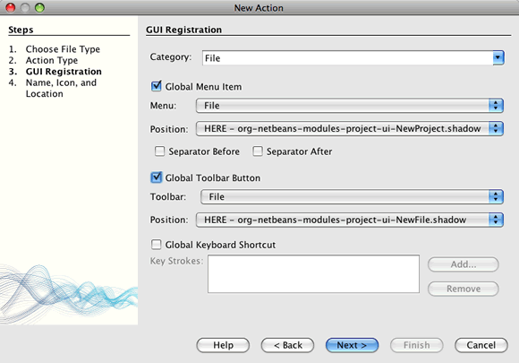

[start=5]
1. Digite *NovaAção* para o nome da classe.

[start=6]
1. Digite *Minha nova ação* para o nome da exibição.

[start=7]
1. Clique no Navegador e selecione uma imagem que será usada na barra de ferramentas.

É possível copiar a imagem a seguir  ``abc16.png``  para a área de trabalho e especificar a imagem no assistente. ( 
image::images/maven-crud_abc16.png[title="Ícone do modelo 16 x 16"] )

[start=8]
1. Selecione o pacote *com.mycompany.mavenplatformcrudapp.editor*. Clique em Concluir.

[start=9]
1. Modifique a classe  ``NovaAção``  para abrir o MyEditorTopComponent e apagar os campos.

[source,java]
----

import java.awt.event.ActionEvent;
import java.awt.event.ActionListener;

public final class NewAction implements ActionListener {

    public void actionPerformed(ActionEvent e) {
        MyEditorTopComponent tc = MyEditorTopComponent.getDefault();
        tc.resetFields();
        tc.open();
        tc.requestActive();
    }

}
----

A ação implementa a classe ActionListener, que está vinculada ao aplicativo através das entradas no arquivo de camada, colocada lá pelo assistente Nova ação.

=== Crianbdo e salvando um objeto novo

[start=1]
1. Em *MyEditorTopComponent*, adicione o método a seguir para redefinir o JTextFields e criar um novo objeto  ``Cliente`` .

[source,java]
----

public void resetFields() {
    customer = new Customer();
    jTextField1.setText("");
    jTextField2.setText("");
}
----

Na classe  ``NovaAção``  é possível pressionar Alt+Enter na chamada para  ``redefinirCampos``  se deseja que o IDE gere um esqueleto do método em MyEditorTopComponent.

[start=2]
1. Em SaveCookie, assegure-se de que um retorno de nulo indica que uma nova entrada foi salva, ao invés da atualização de uma entrada existente:

[source,java]
----

public void save() throws IOException {

    Confirmation message = new NotifyDescriptor.Confirmation("Do you want to save \""
                  + jTextField1.getText() + " (" + jTextField2.getText() + ")\"?",
                  NotifyDescriptor.OK_CANCEL_OPTION,
                  NotifyDescriptor.QUESTION_MESSAGE);

    Object result = DialogDisplayer.getDefault().notify(msg);

    //Quando o usuário clica em "Sim", indicando que realmente deseja salvar,
    //é necessário disabilitar o botão Salvar e o item do menu Salvar,     //de forma que isto só será utilizável quando for feita a próxima mudança     //ao campo de texto:
    if (NotifyDescriptor.YES_OPTION.equals(result)) {
        fire(false);
        EntityManager entityManager = Persistence.createEntityManagerFactory("CustomerLibraryPU").createEntityManager();
        entityManager.getTransaction().begin();
        *if (customer.getCustomerId() != null) {*             Customer c = entityManager.find(Customer.class, cude.getCustomerId());
            c.setName(jTextField1.getText());
            c.setCity(jTextField2.getText());
            entityManager.getTransaction().commit();        *} else {
            Query query = entityManager.createQuery("SELECT c FROM Customer c");
            List<Customer> resultList = query.getResultList();
            customer.setCustomerId(resultList.size()+1);
            customer.setName(jTextField1.getText());
            customer.setCity(jTextField2.getText());
            //adiciona mais campos que serão populados nas colunas zip e discountCode
            customer.setZip("12345");
            customer.setDiscountCode(entityManager.find(DiscountCode.class, 'H'));

            entityManager.persist(customer);
            entityManager.getTransaction().commit();
        }*    }
----

O código também grava alguns dados arbitrários no DiscountCode uma vez que o campo não pode estar vazio.

[start=3]
1. Corrija as importações para importar o  ``*javax.persistence.Query*`` . Salve as alterações.

== Construindo e executando o aplicativo

O aplicativo agora executa três das funções CRUD: Criar, Ler e Atualizar. Agora é possível construir e executar o aplicativo para verificar que todas as funções estão funcionando corretamente.

[start=1]
1. Clique com o botão direito do mouse no nó do projeto do *aplicativo com base na plataforma NetBeans MavenPlatformCRUDApp* e selecione Limpar.

[start=2]
1. Clique com o botão direito do mouse no nó do projeto do *aplicativo com base na plataforma NetBeans MavenPlatformCRUDApp* e selecione Construir utilizando dependências.

[start=3]
1. Clique com o botão direito do mouse no nó do projeto do *aplicativo com base na plataforma NetBeans MavenPlatformCRUDApp* e selecione Executar.

Ao clicar em Executar, o IDE ativa o aplicativo da plataforma. O aplicativo preenche a árvore na janela Cliente com os nomes dos clientes no banco de dados. Ao selecionar um nó na janela Cliente, a janela Meu editor exibe o nome e a cidade do cliente selecionado. É possível modificar e salvar os dados nos campos Nome e Cidade. Para criar um novo cliente, clique no botão Minha ação na barra de ferramentas e insira um nome para a cidade no campo de texto vazio na janela Meu editor e, a seguir, clique em Salvar.

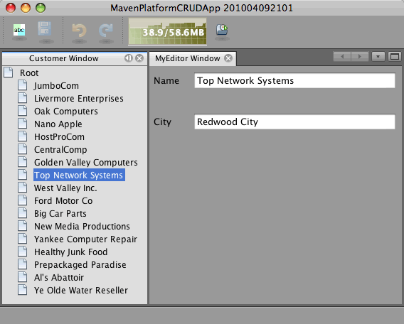

Após criar ou modificar um cliente, será necessário atualizar o nó Raiz na janela Cliente caso não tenha implementado a ação Atualizar na opção Salvar.

Este tutorial demonstrou que criar um aplicativo da plataforma NetBeans utilizando Maven não é muito diferente de criar um aplicativo utilizando Ant. A principal diferença é entender como o POM Maven controla a montagem do aplicativo. Para mais exemplos sobre como construir aplicativos e módulos da plataforma NetBeans, consulte os tutoriais listados na  link:https://netbeans.apache.org/kb/docs/platform_pt_BR.html[Trilha de aprendizagem da plataforma NetBeans].

== Veja também

Isto conclui o tutorial CRUD. Este documento descreve como utilizar a estrutrua de construção Maven para criar um novo aplicativo da plataforma NetBeans como a funcionalidade CRUD. Para mais informações sobre a criação e o desenvolvimento dos aplicativos, consulte os resursos a seguir.

*  link:https://netbeans.apache.org/kb/docs/platform_pt_BR.html[Trilha de aprendizagem da plataforma NetBeans]
*  link:http://bits.netbeans.org/dev/javadoc/[Javadoc da API do NetBeans ]

Caso tenha qualquer dúvida sobre a plataforma NetBeans, sinta-se à vontade para nos mandar um e-mail para dev@platform.netbeans.org ou ou veja o  link:https://mail-archives.apache.org/mod_mbox/netbeans-dev/[arquivo de endereços da plataforma NetBeans].

