// 
//     Licensed to the Apache Software Foundation (ASF) under one
//     or more contributor license agreements.  See the NOTICE file
//     distributed with this work for additional information
//     regarding copyright ownership.  The ASF licenses this file
//     to you under the Apache License, Version 2.0 (the
//     "License"); you may not use this file except in compliance
//     with the License.  You may obtain a copy of the License at
// 
//       http://www.apache.org/licenses/LICENSE-2.0
// 
//     Unless required by applicable law or agreed to in writing,
//     software distributed under the License is distributed on an
//     "AS IS" BASIS, WITHOUT WARRANTIES OR CONDITIONS OF ANY
//     KIND, either express or implied.  See the License for the
//     specific language governing permissions and limitations
//     under the License.
//

= NetBeans コンポーネントパレットモジュールのチュートリアル
:jbake-type: platform_tutorial
:jbake-tags: tutorials 
:jbake-status: published
:syntax: true
:source-highlighter: pygments
:toc: left
:toc-title:
:icons: font
:experimental:
:description: NetBeans コンポーネントパレットモジュールのチュートリアル - Apache NetBeans
:keywords: Apache NetBeans Platform, Platform Tutorials, NetBeans コンポーネントパレットモジュールのチュートリアル

翻訳 :  link:http://blogs.oracle.com/roller/page/katakai[片貝正紀] , 2006/7/10, レビュー/保守:  link:http://ja.netbeans.org/index.html[NetBeans 日本語サイト]

link:mailto:dev@netbeans.apache.org?subject=Feedback:%20NetBeans%20IDE%20Component%20Palette%20Module%20Tutorial[フィー ドバック]

このチュートリアルでは新しいファイルの種類のためのコードサンプル(コードスニペット)をドラッグ &amp; ドロップで作成できるコンポーネントパレットの作成方法を説明します。コードスニペットはコーディングを手助けします。IDE は JSP ファイル、HTML ファイルそしてフォームファイルにコンポーネントパレットを提供しています。このチュートリアルでは通常 IDE では識別されていないファイル用にコンポーネントパレットを作成する方法を説明します。まず最初に「新規ファイルの種類」ウィザードを用いて IDE で認識できる新しいファイルの種類を作成します。次に  link:https://bits.netbeans.org/dev/javadoc/org-netbeans-spi-palette/overview-summary.html[NetBeans パレット API] を使っていくつかのクラスを作成していきます。最後に  ``layer.xml``  ファイルに新しいコンポーネントパレットを登録します。

このチュートリアルで作成するコンポーネントパレットは JBoss の配備記述子ファイル ( ``jboss-web.xml`` ) に対して使用できるものです。 ``jboss-web.xml``  ファイルは他の XML とは名前空間を使用して識別されます。

[source,java]
----

<!DOCTYPE jboss-webPUBLIC "-//JBoss//DTD Web Application 2.3//EN""http://www.jboss.org/j2ee/dtd/jboss-web_3_0.dtd">
----

このチュートリアルで作成されたコンポーネントパレットは上記の名前空間を持つファイルが IDE のソースエディタ上に開かれた時のみ有効になります。このファイルの種類のみの場合にコンポーネントパレットは  ``jboss-web.xml``  ファイルの次の３つの基本的な要素のコードスニペットを提供します。 「Context Root」、 「Security Domain」と「Resource Reference」です。以下のようにツールチップはソースエディタにドラッグ＆ドロップしたときにカーソル位置に挿入されるタグがツールチップに表示 されます。

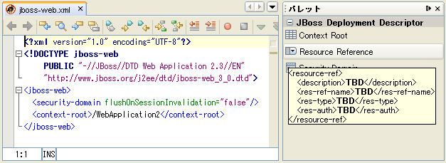

新しいコンポーネントパレットを作成するのではなく、既存のコンポーネントパレットにコードスニペットを追加したいだけならば  link:nbm-palette-api1.html[NetBeans コードスニペットモジュールのチュートリアル] を参照してください。

このチュートリアルでは以下のことを説明します:

* <<installing,ソフトウェアのインストール>>
* <<installing-sample,サンプルのインストール>>
* <<creatingthemoduleproject,モジュールプロジェクトの設定>>
* <<recognizing-filetype,新しいファイルの種類の認識>>
* <<coding-module,コンポーネントパレットモジュールとコードスニペットの作成>>
* <<creating-palettes,コンポーネントパレットの作成>>
* <<creating-snippets,コードスニペットの作成>>
* <<registering-module,モジュールの登録>>
* <<declaring-resources,リソースの宣言>>
* <<registering-resoucres,リソースの登録>>
* <<building,モジュールの構築とインストール>>
* <<install-plugin,モジュールのインストールと使用>>
* <<share-plugin,共有可能なモジュールバイナリの作成>>

このチュートリアルはソフトウェアがインストールできれば 45 分程度で完了します。

モジュール開発に関する詳細は NetBeans サイトの  link:https://netbeans.apache.org/platform/index.html[NetBeans 開発プロジェクトホーム] を参照してください。わからないところがあれば  link:http://wiki.netbeans.org/wiki/view/NetBeansDeveloperFAQ[NetBeans 開発者 FAQ] を参照してください。またこのページの「フィードバック」リンクを使ってください。

== ソフトウェアのインストール

まずはじめにコンピュータにソフトウェアをインストールします:

* NetBeans IDE 5.0 ( link:https://netbeans.apache.org/download/index.html[ダウンロード])
* Java Standard Development Kit (JDK) バージョン 1.4.2 ( link:https://www.oracle.com/technetwork/java/javase/downloads/index.html[ダウンロード]) または 5.0 ( link:https://www.oracle.com/technetwork/java/javase/downloads/index.html[ダウンロード])

=== サンプルのインストール

次の手順でサンプルをインストールします:

[start=1]
1.  link:https://netbeans.org/files/documents/4/651/jbosswebxml.zip[サン プルファイル] を展開 (unzip) します。

[start=2]
1. IDE の「ファイル」>「プロジェクトを開く」を選択し、解凍したファイルがあるフォルダまで移動します。モジュールプロジェクトを開きます。プロジェク トを開くと次のようになります:

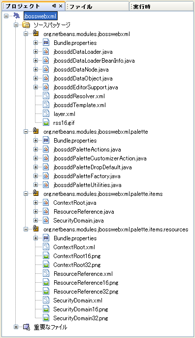

[start=3]
1. プロジェクトノードを右クリックし「ターゲットプラットフォームでのインストール/再読み込み」を選びます。ターゲットプラットフォームが開 きモジュールがインストールされます。

[start=4]
1. 「ファイル」ウィンドウ(Ctrl-2)から  ``test-jboss-web.xml``  ファイルをダブルクリップすることでモジュールが正しくインストールされているかどうか確認できます:

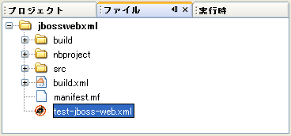

ファイルがソースエディタに読み込まれるとコンポーネントパレットが開きます。するとこのチュートリアルの冒頭部分のスクリーンショットの ように３つのコードスニペットが表示されます。コンポーネントパレットが自動的に表示されない場合は Ctrl-Shift-8 を押して手動で開いてください。

[start=5]
1. メニューバーから「ツール」 > 「パレットマネージャー」を選択すると次のようになります:

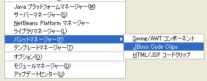

「パレットマネージャー」が表示されコードスニペットが含まれています:

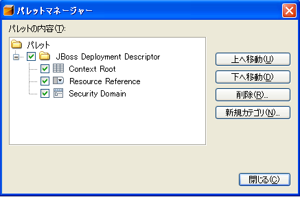

最終的な結果がどのようになるかわかったので、スクラッチからモジュールを作り作成の過程でそれぞれの部分を勉強してみましょう。

== モジュールプロジェクトの 設定

モジュールを作成する前にまずプロジェクトが正しく設定されているか確認する必要があります。 link:https://netbeans.apache.org/download/index.html[NetBeans IDE 5.0] ではモジュールのための基本的なファイルを設定するためにウィザードを提供しています。

[start=1]
1. 「ファイル」>「新規プロジェクト」(Ctrl-Shift-N) を選択してください。「カテゴリ」で「NetBeans プラグインモジュール」を選択します。「プロジェクト」では「モジュールプロジェクト」を選択し「次へ」ボタンをクリックします。

[start=2]
1. 「名前と場所」パネルでは「プロジェクト名」に「 ``jbosswebxml`` 」と入力します。「プロジェクトの場所」は適当な コンピューター上のディレクトリを指定します。たとえば  ``c:\mymodules``  などです。「スタンドアロンモジュール」のラジオボタンはそのままにし「主プロジェクトとして設定」チェックボックスを選択します。「次へ」をクリックし ます。

[start=3]
1. 「基本モジュール構成」パネルでは「コード名ベース」で  ``yourorghere``  を  ``org.netbeans.modules``  に置き換え、 ``org.netbeans.modules.jbosswebxml``  にします。「地域対応のバンドル」と「XML レイヤー」はそのままにし  ``org/netbeans/modules/jbosswebxml``  にこれらのファイルが保存されるようにします。「完了」ボタンをクリックします。

IDE は  ``jbosswebxml``  プロジェクトを作成します。プロジェクトは必要なすべてのソースやメタデータ、たとえばプロジェクトの構築スクリプトなどを含んでいます。プロジェクトは IDE 上で開かれます。「プロジェクト」ウィンドウ(Ctrl-1) で理論的な構成を表示できます。また「ファイル」ウィンドウ(Ctrl-2)ではファイル構造を表示できます。 

== 新しいファイルの種類の認識

[start=1]
1. プロジェクトノードで右クリックして「新規」>「ファイルの種類」を選択します。「次へ」をクリックします。

[start=2]
1. 「ファイルの認識」パネルでは次のようにします:
* 「MIME タイプ」には  ``text/x-jboss+xml``  と入力します。
* 「XML のルート要素」の編集ボックスに「 ``public-id="-//JBoss//DTD Web Application 2.3//EN"`` 」と入力します。

「ファイルの認識」パネルはこのようになります:

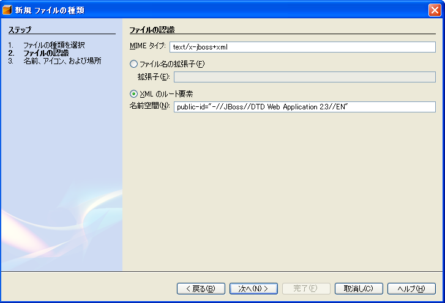

「ファイルの認識」パネルのそれぞれの項目は次のようになっています:

* *MIME タイプ* はデータオブジェクトの一意の MIME タイプを指定します。
* *認識方法*
* *ファイル拡張子* は IDE がその MIME タイプに割り当てるひとつあるいはそれ以上のファイル拡張子を指定します。ファイル拡張子は任意でドット(.)を先頭に付けることができます。セパレータ はコンマ、空白あるいはどちらでもかまいません。したがって以下の例はすべて有効です:
*  ``.abc,.def`` 
*  ``.abc .def`` 
*  ``abc def`` 
*  ``abc,.def ghi, .wow`` 

JAR ファイルのマニフェストファイルは "MANIFEST.MF" であり少なくとも UNIX プラットフォームでは大文字小文字が区別されます。そのためこのチュートリアルでは _２つ_ の MIME タイプを使用します、 ``.mf``  と  ``.MF``  です。

* *XML ルート要素* は他の XML ファイルと区別するための一意に決められた名前空間です。XML ファイルは同じ拡張子 ( ``xml`` ) を持つので IDE はこの XML ルート要素を使って XML ファイルを区別します。さらに具体的に言うと、IDE は XML ファイルの最初の要素で名前空間を区別します。このチュートリアルではファイルの識別は XML ファイルの  ``doctype``  要素で行われます。

「次へ」をクリックします。

[start=3]
1. 「名前と場所」パネルでは「クラス名」に「 ``jbossdd`` 」と入力し、16x16 ピクセルのイメージファイルを新しいファイルの種類のアイコンとして参照します。

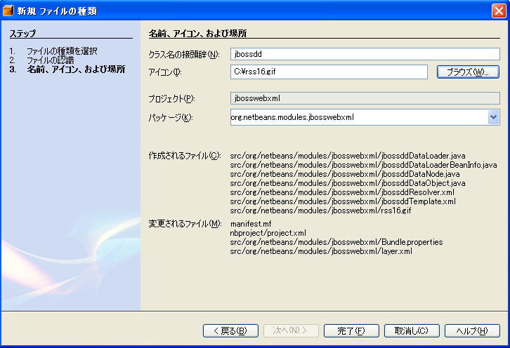

NetBeans のインストールディレクトリにはいろいろな 16x16 ピクセルのイメージファイルがあります。例えば次の場所にあります:

 ``enterprise2\jakarta-tomcat-5.5.7\server\webapps\admin\images`` 

たとえば上記ディレクトリの  ``Datasource.gif``  を使うことができます。これは次のようなアイコンです:
image::images/filetype_Datasource.gif[]

[start=4]
1. 「完了」ボタンをクリックします。

これで「プロジェクト」ウィンドウはこのようになります:

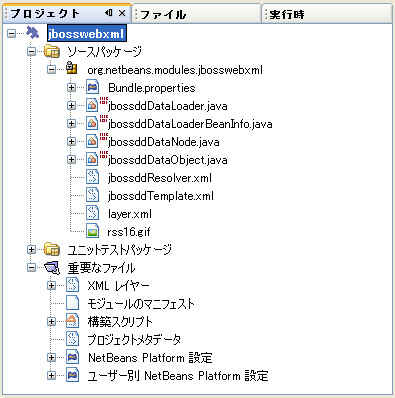

新規に作成されたファイルについて簡単に説明します:

* *jbossddDataLoader.java.* このファイルは  ``text/x-jboss+xml``  MIME タイプを認識します。 ``DataObject``  のファクトリとして機能します。詳しい説明は  link:https://netbeans.apache.org/wiki/devfaqdataloader[What is a DataLoader?] を参照してください。
* *jbossddResolver.xml.* このファイルは MIME タイプと  ``<xml-rule>``  をマップします。これはこの  ``DataLoader``  が  ``<xml-rule>``  で一致した XML ファイルのみを認識するように制限します。 ``<doc-type>``  を定義するように以下のように(太字の行が変更する行です)変更します:

[source,xml]
----

<?xml version="1.0" encoding="UTF-8"?><!DOCTYPE MIME-resolver PUBLIC "-//NetBeans//DTD MIME Resolver 1.0//EN""https://netbeans.org/dtds/mime-resolver-1_0.dtd"><MIME-resolver><file><ext name="xml"/><resolver mime="text/x-jboss+xml"><xml-rule>*<doctype public-id="-//JBoss//DTD Web Application 2.3//EN"/>*</xml-rule></resolver></file></MIME-resolver>
----

* *jbossddDataObject.java.* このファイルは  ``FileObject``  をラップします。 ``DataObjects``  は  ``DataLoaders``  によって生成されます。詳しい説明は  link:https://netbeans.apache.org/wiki/devfaqdataobject[What is a DataObject?] を参照してください。
* *jbossddDataNode.java.* このファイルはアクションなどの機能、アイコンや地域対応された名前など IDE 上での _見え方_ を提供します。
* *jbossddDataLoaderBeanInfo.java.* このファイルは「オプション」ウィンドウの「オブジェクトの種類」セクションで ``DataLoader`` を表示するかしないかを制御しま す。

== コンポーネントパレットモジュールとコードスニペットの作成

=== モジュールの依存性の指定

link:https://bits.netbeans.org/dev/javadoc/[NetBeans API] に属するいくつかのクラスのサブクラスが必要です。それぞれモジュールの依存関係に定義する必要があります。これは「プロジェクト」プロパティーを使って 設定できます。

[start=1]
1. 「プロジェクト」ウィンドウで  ``jbosswebxml``  プロジェクトを右クリックし、「プロパティー」を選択します。プロジェクトプロパティーのダイアログボックスで、「ライブラリ」をクリックします。

[start=2]
1. 次のそれぞれの API は「追加...」ボタンをクリックし「モジュールリスト」から名前を選択して「了解」ボタンを押すことで追加できます:

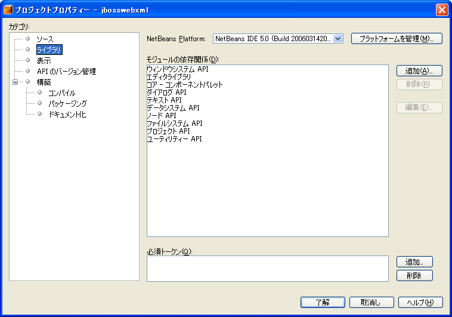

[start=3]
1. 「了解」をクリックしてプロジェクトの「プロパティー」ダイアログを閉じます。

[start=4]
1. 「プロジェクト」ウィンドウで「重要なファイル」ノードを展開、「プロジェクトメタデータ」をダブルクリックしてモジュールの依存性が正しく 宣言されているか確認できます。

[source,xml]
----

<?xml version="1.0" encoding="UTF-8"?><project xmlns="https://netbeans.org/ns/project/1"><type>org.netbeans.modules.apisupport.project</type><configuration><data xmlns="http://www.netbeans.org/ns/nb-module-project/2"><code-name-base>org.netbeans.modules.jbosswebxml</code-name-base><standalone/><module-dependencies><dependency><code-name-base>org.netbeans.modules.editor.lib</code-name-base><build-prerequisite/><compile-dependency/><run-dependency><release-version>1</release-version><specification-version>1.9.0.1</specification-version></run-dependency></dependency><dependency><code-name-base>org.netbeans.modules.projectapi</code-name-base><build-prerequisite/><compile-dependency/><run-dependency><release-version>1</release-version><specification-version>1.9</specification-version></run-dependency></dependency><dependency><code-name-base>org.netbeans.spi.palette</code-name-base><build-prerequisite/><compile-dependency/><run-dependency><release-version>0</release-version><specification-version>1.5</specification-version></run-dependency></dependency><dependency><code-name-base>org.openide.dialogs</code-name-base><build-prerequisite/><compile-dependency/><run-dependency><specification-version>6.4</specification-version></run-dependency></dependency><dependency><code-name-base>org.openide.filesystems</code-name-base><build-prerequisite/><compile-dependency/><run-dependency><specification-version>6.4</specification-version></run-dependency></dependency><dependency><code-name-base>org.openide.loaders</code-name-base><build-prerequisite/><compile-dependency/><run-dependency><specification-version>5.9</specification-version></run-dependency></dependency><dependency><code-name-base>org.openide.nodes</code-name-base><build-prerequisite/><compile-dependency/><run-dependency><specification-version>6.7</specification-version></run-dependency></dependency><dependency><code-name-base>org.openide.text</code-name-base><build-prerequisite/><compile-dependency/><run-dependency><specification-version>6.9</specification-version></run-dependency></dependency><dependency><code-name-base>org.openide.util</code-name-base><build-prerequisite/><compile-dependency/><run-dependency><specification-version>6.8</specification-version></run-dependency></dependency><dependency><code-name-base>org.openide.windows</code-name-base><build-prerequisite/><compile-dependency/><run-dependency><specification-version>6.5</specification-version></run-dependency></dependency></module-dependencies><public-packages/></data></configuration></project>
----

=== コンポーネントパレットの作成

コンポーネントパレットは  link:https://bits.netbeans.org/dev/javadoc/org-netbeans-spi-palette/overview-summary.html[NetBeans パレット API] を使って定義されています。このチュートリアルで NetBeans パレット API を実装することは次の NetBeans Palette API クラスを実装することです:

|===
|*ファイル* |*説明* 

| `` link:https://bits.netbeans.org/dev/javadoc/org-netbeans-spi-palette/org/netbeans/spi/palette/PaletteFactory.html[PaletteFactory]``  |コンポーネントパレットの新しいインスタンスを作成します。そのためには  ``JBOSSPalette``  フォルダから新しいパレットを作成する  ``createPalette``  メソッドを呼び出します。これは  ``layer.xml``  ファイルに定義されています。 

| `` link:https://bits.netbeans.org/dev/javadoc/org-netbeans-spi-palette/org/netbeans/spi/palette/PaletteController.html[PaletteController]``  |コンポーネントパレットのデータへのアクセスを提供します。 

| `` link:https://bits.netbeans.org/dev/javadoc/org-netbeans-spi-palette/org/netbeans/spi/palette/PaletteActions.html[PaletteActions]``  |
 
|===

これにくわえて次のサポートクラスを作成する必要があります:

|===
|*ファイル* |*説明* 

| ``jbossddPaletteUtilities``  |ドロップされたコードスニペットの挿入とフォーマットを扱います。２つの NetBeans API クラスで実装されます:

*  link:https://bits.netbeans.org/dev/javadoc/org-netbeans-modules-editor-lib/org/netbeans/editor/BaseDocument.html[org.netbeans.editor.BaseDocument]
*  link:https://bits.netbeans.org/dev/javadoc/org-netbeans-modules-editor-lib/org/netbeans/editor/Formatter.html[org.netbeans.editor.Formatter]
 

| ``jbossddPaletteCustomizerAction ``  |パレットマネージャーで使われるメニュー項目を提供します:

 

| ``jbossddPaletteDropDefault``  |
 
|===

NetBeans パレット API を実装するには次のステップにしたがってください:

[start=1]
1.  ``org.netbeans.modules.jbosswebxml``  プロジェクトノードで右クリックして「新規」>「Java クラス」を選択します。次のファイルの最初のファイルを作り、パッケージのドロップダウンリストには  ``org.netbeans.modules.jbosswebxml.palette``  と入力し、「完了」ボタンを押します。他のファイルも同様に作成ます。
*  ``jbossddPaletteActions`` 
*  ``jbossddPaletteCustomizerAction`` 
*  ``jbossddPaletteDropDefault`` 
*  ``jbossddPaletteFactory`` 
*  ``jbossddPaletteUtilities`` 

次のファイルが作成されます。(スクリーンショットで選択されています):

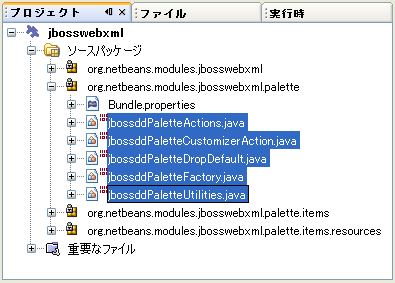

[start=2]
1. 以下のリンクをダブルクリックし以下の内容でファイルの内容を置き換えます:
*  ``jbossddPaletteActions`` 
*  ``jbossddPaletteCustomizerAction`` 
*  ``jbossddPaletteDropDefault`` 
*  ``jbossddPaletteFactory`` 
*  ``jbossddPaletteUtilities`` 

[start=3]
1.  ``jbossddPaletteFactory.java``  ファイルのデフォルトの内容を次で置き換えます:

[source,java]
----

package org.netbeans.modules.jbosswebxml.palette;import java.io.IOException;import  link:https://bits.netbeans.org/dev/javadoc/org-netbeans-spi-palette/org/netbeans/spi/palette/PaletteController.html[org.netbeans.spi.palette.PaletteController];import  link:https://bits.netbeans.org/dev/javadoc/org-netbeans-spi-palette/org/netbeans/spi/palette/PaletteFactory.html[org.netbeans.spi.palette.PaletteFactory];public class jbossddPaletteFactory {public static final String JBOSS_PALETTE_FOLDER = "JBOSSPalette";private static PaletteController palette = null;public static PaletteController getPalette() throws IOException {if (palette == null)palette = PaletteFactory.createPalette(JBOSS_PALETTE_FOLDER, new jbossddPaletteActions()); return palette;}}
----

[start=4]
1.  ``jbossddPaletteActions.java``  ファイルのデフォルトの内容を次で置き換えます:

[source,java]
----

package org.netbeans.modules.jbosswebxml.palette;import java.awt.event.ActionEvent;import java.io.IOException;import javax.swing.AbstractAction;import javax.swing.Action;import javax.swing.text.JTextComponent;import org.netbeans.editor.Utilities;import org.netbeans.spi.palette.PaletteActions;import org.netbeans.spi.palette.PaletteController;import org.openide.DialogDisplayer;import org.openide.NotifyDescriptor;import org.openide.text.ActiveEditorDrop;import org.openide.util.Lookup;import org.openide.util.NbBundle;public class jbossddPaletteActions extends  link:https://bits.netbeans.org/dev/javadoc/org-netbeans-spi-palette/org/netbeans/spi/palette/PaletteActions.html[PaletteActions] {/** Creates a new instance of jbossddPaletteActions */public jbossddPaletteActions() {}public Action[] getImportActions() {return new Action[0]; //TODO implement this}public Action[] getCustomCategoryActions(Lookup category) {return new Action[0]; //TODO implement this}public Action[] getCustomItemActions(Lookup item) {return new Action[0]; //TODO implement this}public Action[] getCustomPaletteActions() {return new Action[0]; //TODO implement this}public Action getPreferredAction( Lookup item ) {return new MFPaletteInsertAction(item);}private static class MFPaletteInsertAction extends AbstractAction {private Lookup item;MFPaletteInsertAction(Lookup item) {this.item = item;}public void actionPerformed(ActionEvent e) {ActiveEditorDrop drop = (ActiveEditorDrop) item.lookup(ActiveEditorDrop.class);JTextComponent target = Utilities.getFocusedComponent();if (target == null) {String msg = NbBundle.getMessage(jbossddPaletteActions.class, "MSG_ErrorNoFocusedDocument");DialogDisplayer.getDefault().notify(new NotifyDescriptor.Message(msg, NotifyDescriptor.ERROR_MESSAGE));return;}try {drop.handleTransfer(target);}finally {Utilities.requestFocus(target);}try {PaletteController pc = jbossddPaletteFactory.getPalette();pc.clearSelection();}catch (IOException ioe) {} //should not occur}}}
----

[start=5]
1.  ``jbossddPaletteUtilities.java``  ファイルのデフォルトの内容を次で置き換えます:

[source,java]
----

package org.netbeans.modules.jbosswebxml.palette;import java.awt.Component;import java.awt.Container;import java.util.StringTokenizer;import javax.swing.JTree;import javax.swing.text.BadLocationException;import javax.swing.text.Caret;import javax.swing.text.Document;import javax.swing.text.JTextComponent;import org.netbeans.api.project.FileOwnerQuery;import org.netbeans.api.project.Project;import org.netbeans.api.project.ProjectUtils;import org.netbeans.api.project.SourceGroup;import org.netbeans.api.project.Sources;import org.netbeans.editor.BaseDocument;import org.netbeans.editor.Formatter;import org.openide.filesystems.FileObject;public class jbossddPaletteUtilities {/** Creates a new instance of jbossddPaletteUtilities */public jbossddPaletteUtilities() {}public static void insert(String s, JTextComponent target)throws BadLocationException {insert(s, target, true);}public static void insert(String s, JTextComponent target, boolean reformat)throws BadLocationException {if (s == null)s = "";Document doc = target.getDocument();if (doc == null)return;if (doc instanceof BaseDocument)((BaseDocument)doc).atomicLock();int start = insert(s, target, doc);if (reformat &amp;&amp; start >= 0 &amp;&amp; doc instanceof BaseDocument) {  // format the inserted textint end = start + s.length();Formatter f = ((BaseDocument)doc).getFormatter();f.reformat((BaseDocument)doc, start, end);}if (doc instanceof BaseDocument)((BaseDocument)doc).atomicUnlock();}private static int insert(String s, JTextComponent target, Document doc)throws BadLocationException {int start = -1;try {//at first, find selected text rangeCaret caret = target.getCaret();int p0 = Math.min(caret.getDot(), caret.getMark());int p1 = Math.max(caret.getDot(), caret.getMark());doc.remove(p0, p1 - p0);//replace selected text by the inserted onestart = caret.getDot();doc.insertString(start, s, null);} catch (BadLocationException ble) {}return start;}}
----

[start=6]
1.  ``jbossddPaletteCustomizerAction.java``  ファイルのデフォルトの内容を次で置き換えます:

[source,java]
----

package org.netbeans.modules.jbosswebxml.palette;import java.io.IOException;import org.openide.ErrorManager;import org.openide.util.HelpCtx;import org.openide.util.NbBundle;import  link:https://bits.netbeans.org/dev/javadoc/org-openide-util/org/openide/util/actions/CallableSystemAction.html[org.openide.util.actions.CallableSystemAction];public class jbossddPaletteCustomizerAction extends  link:https://bits.netbeans.org/dev/javadoc/org-openide-util/org/openide/util/actions/CallableSystemAction.html[CallableSystemAction] {private static String name;public jbossddPaletteCustomizerAction () {putValue("noIconInMenu", Boolean.TRUE); // NOI18N}protected boolean asynchronous() {return false;}/** Human presentable name of the action. This should be* presented as an item in a menu.* @return the name of the action*/public String getName() {if (name == null)name = NbBundle.getBundle(jbossddPaletteCustomizerAction.class).getString("ACT_OpenjbossddCustomizer"); // NOI18Nreturn name;}/** Help context where to find more about the action.* @return the help context for this action*/public HelpCtx getHelpCtx() {return null;}/** This method is called by one of the "invokers" as a result of* some user's action that should lead to actual "performing" of the action.*/public void performAction() {try {jbossddPaletteFactory.getPalette().showCustomizer();}catch (IOException ioe) {ErrorManager.getDefault().notify(ErrorManager.EXCEPTION, ioe);}}}
----

[start=7]
1.  ``jbossddPaletteDropDefault.java``  ファイルのデフォルトの内容を次で置き換えます:

[source,java]
----

package org.netbeans.modules.jbosswebxml.palette;import javax.swing.text.BadLocationException;import javax.swing.text.JTextComponent;import org.openide.text.ActiveEditorDrop;public class jbossddPaletteDropDefault implements ActiveEditorDrop {String body;public jbossddPaletteDropDefault(String body) {this.body = body;}public boolean handleTransfer(JTextComponent targetComponent) {if (targetComponent == null)return false;try {jbossddPaletteUtilities.insert(body, (JTextComponent)targetComponent);}catch (BadLocationException ble) {return false;}return true;}}
----

[start=8]
1.  ``org.netbeans.modules.jbosswebxml.palette``  ノードで右クリックし、「新規」、「ファイル/フォルダ」を選び、「その他」のカテゴリから「プロパティー」ファイルを選択します。「次へ」をクリックし ます。「名前」に「Bundle」と入力し「完了」ボタンを押します。この新しい  ``Bundle.properties``  ファイルに次のキーを追加します:

[source,java]
----

MSG_ErrorNoFocusedDocument=No document selected. Please select a document to insert the item into.ACT_OpenJbossddCustomizer=&amp;JBoss Code Clips
----

=== コードスニペットの作成

それぞれのコードスニペットには次のファイルが必要です:

* ソースエディタへドラッグされるコードの一部を定義した Java クラス。この Java クラスはどのようにコードが挿入されるべきかを定義した  ``jbossddPaletteUtilities.java``  を参照する必要があります。たとえば、インデント設定とフォーマットはここで定義されます。
* プロパティーファイルはラベルとツールチップを定義します。
* 16x16 ピクセルイメージは小さいアイコンでの表示用です。
* 32x32 ピクセルイメージは大きいアイコンでの表示用です。

NetBeans モジュールに上のファイルを作成し、追加したあとにこれらをリソース宣言 XML ファイルで宣言します。 ``layer.xml``  を使って NetBeans システムファイルシステムに登録します。

この詳細は  link:nbm-palette-api1.html[NetBeans コードスニペットモジュールのチュートリアル] を参照してください。

例として３つのコードスニペットを  ``ContextRoot.java`` 、 ``ResourceReference.java`` 、  ``SecurityDomain.java``  として作成したとすると、結果は次のようになります。以下の選択されたパッケージにコードスニペットとサポートリソースが含まれています:

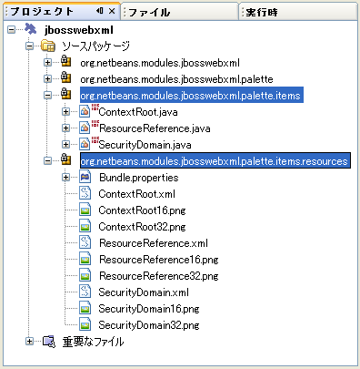

== モジュールの登録

[start=1]
1. 次のタグを  ``layer.xml``  ファイルに追加します:

[source,xml]
----

<folder name="Menu"><folder name="Tools"><folder name="PaletteManager"><file name="org-netbeans-modules-jbosswebxml-palette-jbossddPaletteCustomizerAction.instance"/></folder></folder></folder><folder name="JBOSSPalette"><folder name="JBoss">  <attr name="SystemFileSystem.localizingBundle" stringvalue="org.netbeans.modules.jbosswebxml.palette.Bundle"/><file name="ContextRoot.xml" url="nbresloc:/org/netbeans/modules/jbosswebxml/palette/items/resources/ContextRoot.xml"/><file name="SecurityDomain.xml" url="nbresloc:/org/netbeans/modules/jbosswebxml/palette/items/resources/SecurityDomain.xml"/><file name="ResourceReference.xml" url="nbresloc:/org/netbeans/modules/jbosswebxml/palette/items/resources/ResourceReference.xml"/></folder></folder>
----

[start=2]
1. 以下を  ``layer.xml``  ファイルと同じパッケージ内の  ``Bundle.properties``  ファイルに追加します:

[source,java]
----

JBOSSPalette/JBoss=JBoss Deployment DescriptorJBOSSPalette/JBoss/ContextRoot.xml=Context RootJBOSSPalette/JBoss/ResourceReference.xml=Resource ReferenceJBOSSPalette/JBoss/SecurityDomain.xml=Security Domain
----

上記のキー-値のペアは  ``layer.xml``  ファイルに登録された項目をローカライズします。

[start=3]
1. 必要に応じて他のモジュールで提供されているコードスニペットとマージできます。たとえば、 ``jboss-web.xml``  ファイルで JSP モジュールや HTML モジュールで提供されているコードスニペットにアクセスできるようにマージしたい場合は次のようにします:
*  ``org.netbeans.modules.jbosswebxml.palette``  では、HTML モジュールと JSP モジュールが提供しているいくつかのアクション名と一致するように  ``ACT_OpenJbossddCustomizer``  の値を変更します:

[source,java]
----

ACT_OpenJbossddCustomizer=&amp;HTML/JSP Code Clips
----

*  ``layer.xml``  ファイルに以下の２つの行を追加することによって２つのアクションを隠します。この部分は HTML モジュールと JSP モジュールのアクションを JSP/HTML コードクリップパレットマネージャーを表示しています。

[source,xml]
----

<folder name="Menu"><folder name="Tools"><folder name="PaletteManager"><file name="org-netbeans-modules-jbosswebxml-palette-jbossddPaletteCustomizerAction.instance"/>*<file name="org-netbeans-modules-html-palette-HTMLPaletteCustomizerAction.instance_hidden"/>
<file name="org-netbeans-modules-web-core-palette-JSPPaletteCustomizerAction.instance_hidden"/>*</folder></folder></folder>
----

* 最後に HTML モジュールと JSP モジュールのリソース宣言 XML ファイルを宣言します:

[source,xml]
----

<folder name="JBOSSPalette"><folder name="JBoss"><attr name="SystemFileSystem.localizingBundle" stringvalue="org.netbeans.modules.jbosswebxml.Bundle"/><file name="ContextRoot.xml" url="ContextRoot.xml"/><file name="ResourceReference.xml" url="ResourceReference.xml"/><file name="SecurityDomain.xml" url="SecurityDomain.xml"/></folder>*<folder name="HTML.shadow">
<attr name="SystemFileSystem.localizingBundle" 
stringvalue="org.netbeans.modules.web.core.palette.Bundle"/>
<attr name="originalFile" 
stringvalue="HTMLPalette/HTML"/>
</folder>
<folder name="HTML_Forms.shadow">
<attr name="SystemFileSystem.localizingBundle" 
stringvalue="org.netbeans.modules.web.core.palette.Bundle"/>
<attr name="originalFile" 
stringvalue="HTMLPalette/HTML_Forms"/>
</folder>
<folder name="JSP.shadow">
<attr name="SystemFileSystem.localizingBundle" 
stringvalue="org.netbeans.modules.web.core.palette.Bundle"/>
<attr name="originalFile" 
stringvalue="JSPPalette/JSP"/>
</folder>
<folder name="Database.shadow">
<attr name="SystemFileSystem.localizingBundle" 
stringvalue="org.netbeans.modules.web.core.palette.Bundle"/>
<attr name="originalFile" 
stringvalue="JSPPalette/Database"/>
</folder>*</folder>
----

これでモジュールを構築し、インストールすると、次のセクションで説明するように  ``jboss-web.xml``  ファイル用のコンポーネントパレットが JSP モジュールで提供されている _すべての_ コードスニペット、HTML モジュールで提供されている _すべての_ コードスニペットを含んで表示されます。

== モジュールの構築とインストール

IDE はモジュールの構築およびインストールに Ant 構築スクリプトを使用します。構築スクリプトはプロジェクトの作成時に作成されます。

=== モジュールのインストールと使用

[start=1]
1. 「プロジェクト」ウィンドウで「 ``jbosswebxml`` 」プロジェクトを右クリックし「ターゲットプラットフォームでのイ ンストール/再読み込み」を選びます。

モジュールが構築されターゲットプラットフォームにインストールされます。ターゲットプラットフォームが起動し新規モジュールを試すことが できます。デフォルトのターゲットプラットフォームとは IDE の現在のインスタンスで使用しているインストールです。

[start=2]
1. 使い方は <<installing-sample,サンプルのインストール>> セクションで説明していますのでモジュールが正しくインストールできているかどうか確認してください。

=== 共有可能なモジュールバイナリの作成

[start=1]
1. 「プロジェクト」ウィンドウで  ``newhtmlsnippet``  プロジェクトを右クリックし、「NBM を作成」を選択します。

NBM ファイルが作成されます。「ファイル」ウィンドウ (Ctrl-2) で確認できます:

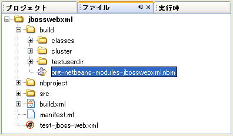

[start=2]
1. メールなどで送付することにより他の人に配布、共有できます。

[start=3]
1. アップデートセンターを使ってモジュールをインストールできます。メインメニューの「ツール」>「アップデートセンター」 を選択してください。

== 次のステップ

NetBeans モジュールの開発と作成の詳細は次のリソースを参照してください:

*  link:https://netbeans.apache.org/platform/index.html[モジュール開発者リソース]
*  link:https://bits.netbeans.org/dev/javadoc/[NetBeans API リスト (現行の開発バージョン)]
*  link:http://apisupport.netbeans.org/new-apisupport.html[新規 API サポートの提案]

== バージョン

詳細な更新履歴は  link:nbm-palette-api2_ja.html[原文の英文] をご覧下さい。このファイルはリビジョン 1.18 を翻訳しています。

