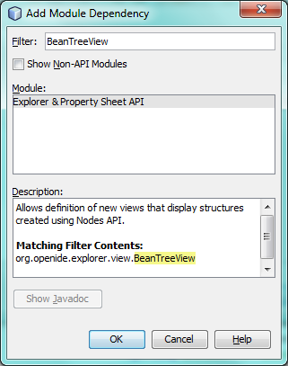
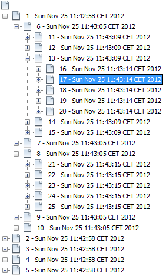
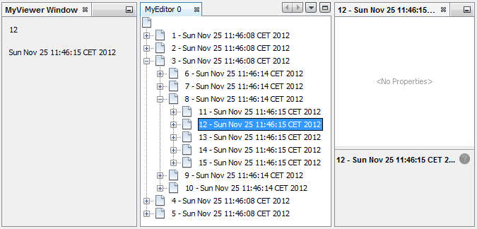
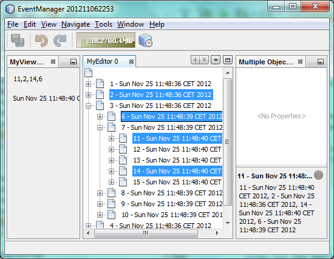

// 
//     Licensed to the Apache Software Foundation (ASF) under one
//     or more contributor license agreements.  See the NOTICE file
//     distributed with this work for additional information
//     regarding copyright ownership.  The ASF licenses this file
//     to you under the Apache License, Version 2.0 (the
//     "License"); you may not use this file except in compliance
//     with the License.  You may obtain a copy of the License at
// 
//       http://www.apache.org/licenses/LICENSE-2.0
// 
//     Unless required by applicable law or agreed to in writing,
//     software distributed under the License is distributed on an
//     "AS IS" BASIS, WITHOUT WARRANTIES OR CONDITIONS OF ANY
//     KIND, either express or implied.  See the License for the
//     specific language governing permissions and limitations
//     under the License.
//

= NetBeans Selection Management Tutorial II—Using Nodes
:jbake-type: platform_tutorial
:jbake-tags: tutorials 
:jbake-status: published
:syntax: true
:source-highlighter: pygments
:toc: left
:toc-title:
:icons: font
:experimental:
:description: NetBeans Selection Management Tutorial II—Using Nodes - Apache NetBeans
:keywords: Apache NetBeans Platform, Platform Tutorials, NetBeans Selection Management Tutorial II—Using Nodes

The  link:nbm-selection-1.html[previous tutorial] covered the basics of component-wide selection handling in NetBeans—how to provide objects from a ` link:https://netbeans.apache.org/wiki/devfaqwindowstopcomponent[TopComponent]`'s ` link:https://netbeans.apache.org/wiki/devfaqlookup[Lookup]`, and how to write other components that are sensitive to the `Lookup` of whatever component has focus.

This tutorial focuses on the  link:https://bits.netbeans.org/dev/javadoc/org-openide-nodes/overview-summary.html[Nodes API], which makes it possible to do more granular views and selection than just component-level selection. Of course, you could write a component that reads and writes into its own Lookup whatever it wants, and provides more granular selection logic that way. But the Nodes API makes it very easy to do this, and offers a number of advantages over doing it yourself.

NOTE: If you are using an earlier version of Apache NetBeans, see  link:74/nbm-selection-2.html[the previous version of this document].

For troubleshooting purposes, you are welcome to download the  link:http://web.archive.org/web/20170409072842/http://java.net/projects/nb-api-samples/show/versions/8.0/tutorials/selection-management/2-of-4/EventManager[completed tutorial source code].

== Introduction to the Nodes API

The first advantage is that the Nodes API provides a _presentation layer_—a layer between the data model being edited in some way, and the UI components that expose the data model to the user. This is quite useful and powerful, as the same model may be presented in multiple ways, or with multiple UIs.

The second advantage is the Explorer API—the module `org.openide.explorer` provides a vast array of components—trees, lists, tree tables and more—which can render a Node and its children.

A `Node` is a generic hierarchical object—a `Node` has:

* Children—Nodes in a hierarchy underneath it, that can be displayed in a tree
* Actions—An array of actions that can be displayed in a popup menu
* Display Name—A human-readable, localized display name that can be shown in a UI component
* Icon—An icon that can be shown in a UI component

and `Node`s can fire changes in any of the above, and the explorer UI components will automatically update themselves.

This is _not_ to say that the content of the previous tutorial was useless—on the contrary, it is the reason the Nodes API can work. The reason: `org.openide.nodes.Node` has a method, you guessed it, `getLookup()`. In fact what is happening when you change selection in the Projects tab in the IDE, for example, is...the Projects tab is a TopComponent. It proxies the `Lookup` of whatever object(s) are currently selected in the tree—just as the `Utilities.actionsGlobalContext()` `Lookup` proxies whichever component is focused and fires changes when focus changes.

Thanks to the components in the Explorer API, it is very easy to create your own views of a tree of `Node`s, and have this type of proxying in your own components with very little code. Viewer type components such as the `MyViewer` component in the previous tutorial do not have to do anything special to be able to respond to selection changes in Explorer components—they will automatically be notified as selection changes.

== Creating an Explorer View

The first thing you will do is some substantial modifications to your `MyEditor` editor component. This starts with opening it in the editor.

[start=1]
1. First, bring up the properties dialog for the My Editor project by right-clicking the My Editor project and choosing Properties. On the Libraries tab, click the Add Dependency button, and type "BeanTreeView" in the dialog:

Click OK once you see the Explorer &amp; Property Sheet API listed, as shown above. This will add a dependency on the Explorer API module, so you can use classes from it.

[start=2]
1. Switch to the form designer, select all of the components, and delete them. In the next steps, we will use a component from the Explorer &amp; Property Sheet API, instead of the text fields and button we have been using so far.

[start=3]
1. 
Rewrite the constructor of the  ``MyEditor``  class as shown below:

[source,java]
----

public MyEditor() {

    initComponents();
    Event obj = new Event();
    associateLookup(new AbstractLookup(content));

    *setLayout(new BorderLayout());
    add(new BeanTreeView(), BorderLayout.CENTER);*

    setDisplayName("MyEditor " + obj.getIndex());

}
----

`BeanTreeView` is a component from the Explorer &amp; Property Sheet API—a basic `JTree`-based view over a `Node` and its children, with built-in handling of popup menus, searching and more. Press Ctrl-Shift-I to import BeanTreeView, because the import statement needs to be added.

[start=4]
1. The next step is to give your tree something to show. Explorer UI components work like this: When added to a container, they search that container and their ancestors until they find one that implements `ExplorerManager.Provider`. So you don't set the node to be viewed directly on the component—you set it on the component's manager. This makes it possible to have multiple views, master/detail views and such, all managed by a single manager. Add to the signature of MyEditor as follows:

[source,java]
----

public class MyEditor extends TopComponent *implements ExplorerManager.Provider* {
----

Then press Ctrl-Shift-I to fix imports. Keeping the caret in the signature line, a lightbulb glyph should appear in the margin. Press Alt-Enter, and accept the hint "Implement all abstract methods". This will add one method, `getExplorerManager()`. Implement it as follows:

[source,java]
----

private final ExplorerManager mgr = new ExplorerManager();

public ExplorerManager getExplorerManager() {
    return mgr;
}
----

[start=5]
1. Now, since the goal is one component that can display multiple `Event`s, you need a `Node` or two to display in your component. Each one will own its own instance of `Event`. So, right now you'll just add the code that will create a root node for your tree view. Add the following line to the constructor:

[source,java]
----

mgr.setRootContext(new AbstractNode(Children.create(new EventChildFactory(), true)));
----

This is the code that sets the root node for all of the explorer views that are child components of `MyEditor`. The `Children.create` is a static call from the NetBeans APIs that will, thanks to the `true` parameter, create the child components asynchronously, that is, as needed, instead of all at once.

[start=6]
1. If you tried Fix Imports, you may have seen the error dialog telling you that neither `AbstractNode`, `Children`, nor `EventChildFactory` could be resolved. To resolve `AbstractNode` and `Children`, you need to add one dependency, on the Nodes API module. Right click the My Editor project, go to the Libraries page and click Add Dependency. Type "AbstractNode" in the Add dialog, and when the item "Nodes API" in the list is selected, click OK or press Enter.

[start=7]
1. Now, back in the source editor, press Ctrl-Shift-I to Fix Imports. You will be notified that `EventChildFactory` could not be resolved. That's okay—you're about to write it, in the next section.

== Implementing Nodes and Node Children

You'll notice you're using a class called `AbstractNode` above. Despite its name, it is not an abstract class! It is a utility implementation of `org.openide.nodes.Node` which can save you some time and trouble—rather than implement Node yourself, you can just create an AbstractNode and pass it a `Children` object which will provide child nodes for it, and then set its icon and display name as needed. So it is a simple way to get a `Node` object to represent something, without needing to do any subclassing of `Node` itself.

The next step is to implement `EventChildFactory`, so that there are subnodes underneath the initial node.

[start=1]
1. Right click the `org.myorg.myeditor` package in the My Editor project, and choose New > Java Class from the popup menu. In the New Java Class wizard, name the class "EventChildFactory", and click Finish or press Enter to create the class.

[start=2]
1. Modify the signature of the class so it extends `ChildFactory`:

[source,java]
----

class EventChildFactory extends ChildFactory<Event> {
----

Press Ctrl-Shift-I to Fix Imports.

[start=3]
1. Position the caret in the class signature line. When the lightbulb glyph appears in the margin, press Alt-Enter and then Enter again to accept the hint "Implement all Abstract Methods". This will add a `createKeys(List<Event> toPopulate)` method—this is where you will create the keys, on a background thread, that will be used to create the children of your root node.

[start=4]
1. But first, you want to override one method—`createKeys`. `ChildrenFactory.createKeys` is called the first time something pays attention to this Children object—the first time it is asked for its child nodes. So you can delay creation of child Nodes until the user has really expanded the parent node in a view and needs to see them. Implement the method as follows:

[source,java]
----

@Override
protected boolean createKeys(List toPopulate) {
    Event[] objs = new Event[5];
    for (int i = 0; i < objs.length; i++) {
        objs[i] = new Event();
    }
    toPopulate.addAll(Arrays.asList(objs));
    return true;
}
----

As you may have guessed from the name `ChildFactory`, what your parent class does is take an array or `Collection` of key objects, and act as a factory for `Node`s for them. For each element in the array or collection you pass to the `toPopulate` list above, the `createNodeForKey()` shown below will be called once when `true` is returned (note this means that if you want, you can have more than one node to represent one object).

[start=5]
1. 
Now you need to implement the code that actually creates Node objects for all of these. Implement `createNodeForKey` as follows:

[source,java]
----

@Override
protected Node createNodeForKey(Event key) {
    Node result = new AbstractNode(
        Children.create(new EventChildFactory(), true), 
        Lookups.singleton(key));
    result.setDisplayName(key.toString());
    return result;
}
----

The new  ``Node``  is created by passing in the definition of its  ``Children`` , together with the current  ``Event`` , which is put into the  ``Lookup``  of the  ``Node`` . When the user selects the  ``Node`` , the object in its  ``Lookup``  will be proxied by the  ``Lookup``  of the  ``TopComponent`` , which in turn is proxied by the global  ``Lookup`` . In this way, you make the current  ``Event``  object available to any object that is interested in it, whenever the  ``Node``  is selected. Press Ctrl-Shift-I to Fix Imports.

[start=6]
1. The last step is to install a bit of plumbing code that will wire up your explorer manager to your TopComponent's lookup. First, delete the line

[source,java]
----

private final InstanceContent content = new InstanceContent();
----

from the head of the class definition—you will be using a utility to wire up the selected `Node`'s `Lookup` to your component's `Lookup`.

[start=7]
1. Modify the constructor of `MyEditor` so it looks like this:

[source,java]
----

public MyEditor() {

    initComponents();
    Event obj = new Event();
    *associateLookup(ExplorerUtils.createLookup(mgr, getActionMap()));*

    setLayout(new BorderLayout());
    add(new BeanTreeView(), BorderLayout.CENTER);

    setDisplayName("MyEditor " + obj.getIndex());

    mgr.setRootContext(new AbstractNode(Children.create(new EventChildFactory(), true)));

}
----

== Running the Tutorial

You may have noticed that because you pass a new instance of `EventChildFactory` to each `AbstractNode` you create, that you will end up with an infinitely deep tree of `Events`—each `Node` will have five child `Node`s, each with its own `Event`.

You are now ready to run, so right-click `EventManager` and choose Clean and Build, and then right-click again and choose Run from the popup menu. When the application starts, you should be able to browse the  ``Events`` , as shown below:

Notice that as you click and/or expand different nodes, the viewer and the property sheet update themselves to show the `Event` belonging to each node, as shown below:

== Exploring Explorer

Now that you have the above code, it can be interesting to explore some of the other components available in the Explorer &amp; Property Sheet API, which can also render a `Node` and it's children. You can do this by opening `MyEditor` in the Source view and changing `add (new BeanTreeView(), BorderLayout.CENTER)` to something different, in the constructor.

Some of the options are:

* *OutlineView*—a tree-table—a table whose leftmost column is a tree
* *IconView*—a component that shows Node children in equally spaced icons, rather like Windows Explorer
* *ListView*—display nodes in a JList (you can set how deep into the Node hierarchy it should go)
* *ChoiceView*—a combo-box view of a Node and its children
* *MenuView*—a `JButton` that pops up a menu of a Node and its children

== Handling Multi-Selection

You may have noticed that `BeanTreeView`, the basic tree view for Nodes, lets you select more than one Node at a time. Therefore, it might be desirable to modify your viewer component to display information about all of the selected nodes:

[start=1]
1. Open `org.myorg.myviewer.MyViewerTopComponent` from the My Viewer project, in the editor.

[start=2]
1. Replace the `resultChanged()` listener method with the following code:

[source,java]
----

@Override
public void resultChanged(LookupEvent lookupEvent) {
    Collection<? extends Event> allEvents = result.allInstances();
    if (!allEvents.isEmpty()) {
        StringBuilder text1 = new StringBuilder();
        StringBuilder text2 = new StringBuilder();
        for (Iterator i = allEvents.iterator(); i.hasNext();) {
            Event o = (Event) i.next();
            text1.append(o.getIndex());
            text2.append(o.getDate().toString());
            if (i.hasNext()) {
                text1.append(',');
                text2.append(',');
            }
        }
        jLabel1.setText(text1.toString());
        jLabel2.setText(text2.toString());
    } else {
        jLabel1.setText("[no selection]");
        jLabel2.setText("");
    }
}
----

So you can see that, not only does the `Lookup` created by `ExplorerUtils` handle proxying the `Lookup` of whatever `Node` is selected; it also correctly proxies the `Lookup`s of multiple `Node`s.

== Review of Concepts

To review a few of the concepts you've covered here:

* A `Lookup` is like a `Map` where the keys are classes and the values are instances of those classes. It's also useful to think of a `Lookup` as a _place_ that objects swim into and out of, and you can subscribe to be notified of the arrival and departure of specific types of object.
* `Utilities.actionsGlobalContext()` is a `Lookup` which proxies the `Lookup` of whichever `TopComponent` currently has keyboard focus, and fires changes when focus moves to a different component.
* `Node`s are presentation objects that can be displayed in a tree, list or other component from the Explorer API. Each `Node` has its own `Lookup`.
* Just as `Utilities.actionsGlobalContext` proxies the `Lookup` of TopComponents (so you can just ask that lookup for a result and listen for changes in it, rather than having to track focus changes yourself), so also the `Lookup` created by `ExplorerUtils.createLookup(ExplorerManager, ActionMap)` will create a `Lookup` which automatically proxies the `Lookup` of whatever `Node`(s) are selected in an Explorer component.

link:http://netbeans.apache.org/community/mailing-lists.html[Send Us Your Feedback]

== Next Steps

So you now have a view that can display `Node`s that expose some underlying model object (`Event` in your case). In the  link:nbm-nodesapi2.html[next tutorial], you will cover how to enhance the Nodes you have already created with actions, properties and more colorful display names.

